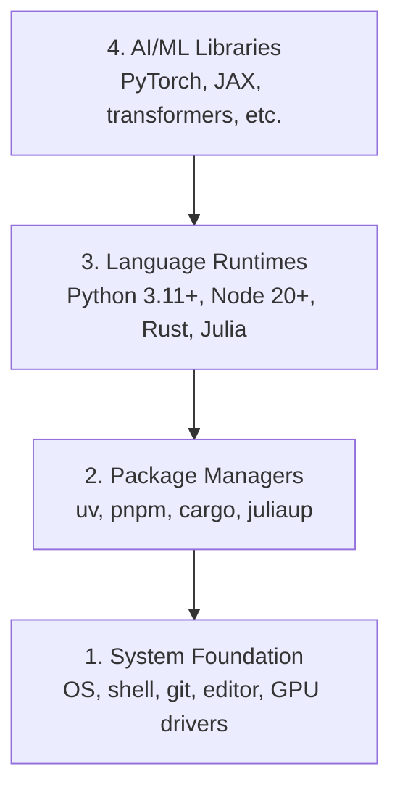

# 开发环境

> 工具会塑造你的思考方式。一次把它们配置好，并且配置正确。

**类型：** 构建
**语言：** Python、Node.js、Rust
**前置课程：** 无
**预计学习：** 约 45 分钟

## 学习目标

- 从零配置 Python 3.11+、Node.js 20+ 和 Rust 工具链
- 配置虚拟环境和包管理器，以获得可复现的构建
- 验证 CUDA/MPS 的 GPU 访问，并运行一次测试张量运算
- 理解系统、包、运行时和 AI 库组成的四层栈

## 问题

你将会在 200 多节课程中学习 AI 工程，涉及 Python、TypeScript、Rust 和 Julia。若环境出了问题，每节课都会变成与工具链搏斗，而不是学习。

很多人跳过环境配置，随后花数小时排查导入错误、版本冲突和缺失的 CUDA 驱动。我们这次把它一次做好。

## 概念

一个 AI 工程环境由四层组成：



我们从底向上安装；每一层都依赖于它下面的一层。

```figure
s0-env-stack
```

## 动手构建

### 第 1 步：系统基础

检查系统并安装基础工具。

```bash
# macOS
xcode-select --install
brew install git curl wget

# Ubuntu/Debian
sudo apt update && sudo apt install -y build-essential git curl wget

# Windows (use WSL2)
wsl --install -d Ubuntu-24.04
```

### 第 2 步：使用 uv 配置 Python

我们使用 `uv`：它比 pip 快 10–100 倍，并会自动管理虚拟环境。

```bash
curl -LsSf https://astral.sh/uv/install.sh | sh

uv python install 3.12

uv venv
source .venv/bin/activate  # or .venv\Scripts\activate on Windows

uv pip install numpy matplotlib jupyter
```

验证：

```python
import sys
print(f"Python {sys.version}")

import numpy as np
print(f"NumPy {np.__version__}")
a = np.array([1, 2, 3])
print(f"Vector: {a}, dot product with itself: {np.dot(a, a)}")
```

### 第 3 步：使用 pnpm 配置 Node.js

它用于 TypeScript 课程，例如智能体、MCP 服务器和 Web 应用。

```bash
curl -fsSL https://fnm.vercel.app/install | bash
fnm install 22
fnm use 22

npm install -g pnpm

node -e "console.log('Node', process.version)"
```

**macOS / Apple Silicon（M1/M2/M3/M4）：** 若安装器报错 `Error: Cannot install under Rosetta 2 in ARM default prefix (/opt/homebrew)`，说明你的终端在 Rosetta 2 下运行（`arch` 输出 `i386`），而 Homebrew 是原生 arm64 构建。强制以 arm64 安装 fnm、写入 shell 配置，然后从 `fnm install 22` 起重新运行命令：

```bash
arch -arm64 brew install fnm
echo 'eval "$(fnm env --use-on-cd)"' >> ~/.zshrc
source ~/.zshrc
```

### 第 4 步：Rust

它用于性能关键型课程，例如推理与系统。

```bash
curl --proto '=https' --tlsv1.2 -sSf https://sh.rustup.rs | sh

rustc --version
cargo --version
```

### 第 5 步：Julia（可选）

它适合 Julia 有优势的数学密集型课程。

```bash
curl -fsSL https://install.julialang.org | sh

julia -e 'println("Julia ", VERSION)'
```

### 第 6 步：GPU 配置（如有 GPU）

**NVIDIA（Linux / Windows）：**

```bash
nvidia-smi

# Install PyTorch with CUDA
uv pip install torch torchvision torchaudio --index-url https://download.pytorch.org/whl/cu124
```

**macOS / Apple Silicon（M1/M2/M3/M4）：** Mac 没有 CUDA，这是预期行为，不是错误。不要传入 `--index-url .../cuXXX`（这些 wheel 只适用于 Linux/Windows，因此安装会失败）。请安装普通构建，其中包含苹果的 MPS（Metal）GPU 后端：

```bash
uv pip install torch torchvision torchaudio
```

验证（适用于任意平台）：

```python
import torch
print(f"CUDA available: {torch.cuda.is_available()}")           # False on macOS — expected
print(f"MPS available:  {torch.backends.mps.is_available()}")   # True on Apple Silicon
if torch.cuda.is_available():
    print(f"GPU: {torch.cuda.get_device_name(0)}")
```

没有 GPU？没关系。多数课程可在 CPU 上完成；训练量大的课程可使用 Google Colab 或云端 GPU。

### 第 7 步：验证全部工具

运行验证脚本：

```bash
python phases/00-setup-and-tooling/01-dev-environment/code/verify.py
```

## 实际使用

你的环境现在已可用于本课程的每一节课。以下是各语言的使用范围：

| 语言 | 使用阶段 | 包管理器 |
|----------|---------|-----------------|
| Python | Phase 1–12（ML、DL、NLP、视觉、音频、LLM） | uv |
| TypeScript | Phase 13–17（工具、智能体、群体、基础设施） | pnpm |
| Rust | Phase 12、15–17（性能关键任务） | cargo |
| Julia | Phase 1（数学基础） | Pkg |

## 交付成果

本课会产出一个人人可运行的验证脚本，用来检查自己的配置。

参见 `outputs/prompt-env-check.md`，其中的提示词可帮助 AI 助手诊断环境问题。

## 练习

1. 运行验证脚本，并修复所有失败项
2. 为本课程创建一个 Python 虚拟环境并安装 PyTorch
3. 用四种语言分别编写并运行一个“hello world”
