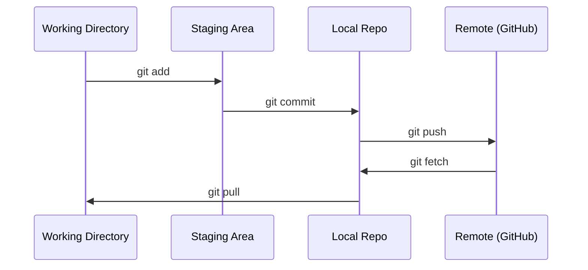

# Git 与协作

> 版本控制不是可选项。这里的每个实验、模型和课程成果都应被追踪。

**类型：** 学习
**语言：** --
**前置课程：** Phase 0，第 01 课
**预计学习：** 约 30 分钟

## 学习目标

- 配置 Git 身份，并使用 add、commit、push 的日常流程
- 为隔离实验创建和合并分支，且不破坏主分支
- 编写 `.gitignore` 以排除模型检查点和大型二进制文件
- 用 `git log` 浏览提交历史，理解项目如何演进

## 问题

你将在 20 个阶段中编写数百个代码文件。没有版本控制，你会丢失工作、弄坏无法撤销的内容，也无法与他人协作。

Git 是工具，GitHub 是代码存放的位置。本课只讲完成本课程所需的内容。

## 概念 <!-- learning-atlas: the-concept -->



记住三件事：
1. 经常保存（`git commit`）
2. 推送到远程仓库（`git push`）
3. 为实验创建分支（`git checkout -b experiment`）

## 动手构建

### 第 1 步：配置 Git

```bash
git config --global user.name "Your Name"
git config --global user.email "you@example.com"
```

### 第 2 步：日常工作流

```bash
git status
git add file.py
git commit -m "Add perceptron implementation"
git push origin main
```

### 第 3 步：为实验创建分支

```bash
git checkout -b experiment/new-optimizer

# ... make changes, commit ...

git checkout main
git merge experiment/new-optimizer
```

### 第 4 步：使用本课程仓库

你不能直接推送到课程仓库——只有维护者有写权限。请先在 GitHub 上 fork 它（右上角的 Fork 按钮），让 `origin` 指向你的副本：

```bash
git clone https://github.com/YOUR-USERNAME/ai-engineering-from-scratch.git
cd ai-engineering-from-scratch

git checkout -b my-progress
# work through lessons, commit your code
git push origin my-progress
```

## 实际使用

在本课程中，你只需要这些命令：

| 命令 | 使用时机 |
|---------|------|
| `git clone` | 获取课程仓库 |
| `git add` + `git commit` | 保存你的工作 |
| `git push` | 备份到 GitHub |
| `git checkout -b` | 尝试新内容而不破坏主分支 |
| `git log --oneline` | 查看已完成的工作 |

就是这些。本课程不需要 rebase、cherry-pick 或 submodule。

## 练习

1. Fork 本仓库，克隆你的 fork，创建名为 `my-progress` 的分支，创建一个文件、提交并推送
2. 创建一个 `.gitignore`，排除模型检查点文件（`.pt`、`.pth`、`.safetensors`）
3. 用 `git log --oneline` 查看本仓库的提交历史，了解课程是如何加入的

## 核心术语

| 术语 | 常见说法 | 实际含义 |
|------|----------------|----------------------|
| Commit | “保存” | 项目在某个时间点的完整快照 |
| Branch | “副本” | 随工作向前移动、指向某次提交的指针 |
| Merge | “合并代码” | 将一个分支的变更应用到另一个分支 |
| Remote | “云端” | 托管在其他位置（GitHub、GitLab）的仓库副本 |
