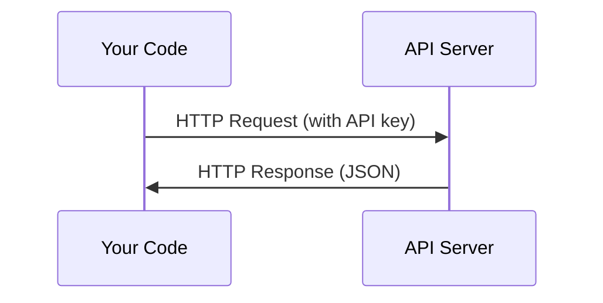

# API 与密钥

> 所有 AI API 的工作方式都一样：发送请求，获得响应。细节会变化，模式不会。

**类型：** 构建
**语言：** Python、TypeScript
**前置课程：** Phase 0，第 01 课
**预计学习：** 约 30 分钟

## 学习目标

- 使用环境变量和 `.env` 文件安全地保存 API key
- 同时用 Anthropic Python SDK 和原始 HTTP 发起 LLM API 调用
- 比较 SDK 与原始 HTTP 的请求/响应格式，以便调试
- 识别并处理认证、速率限制等常见 API 错误

## 问题

从 Phase 11 开始，你会调用 LLM API（Anthropic、OpenAI、Google）。在 Phase 13–16 中，你会构建在循环中使用这些 API 的 agent。你需要知道 API key 如何工作、如何安全保存，以及如何完成第一次 API 调用。

## 概念



每次 API 调用都包含：
1. 端点（URL）
2. API key（认证）
3. 请求体（你想要什么）
4. 响应体（你得到什么）

## 动手构建

### 第 1 步：安全存储 API key

绝不要把 API key 写进代码。使用环境变量。

```bash
export ANTHROPIC_API_KEY="sk-ant-..."
export OPENAI_API_KEY="sk-..."
```

或者使用 `.env` 文件（将其加入 `.gitignore`）：

```text
ANTHROPIC_API_KEY=sk-ant-...
OPENAI_API_KEY=sk-...
```

### 第 2 步：第一次 API 调用（Python）

```python
import os

import anthropic

client = anthropic.Anthropic()

MODEL = os.environ.get("LLM_MODEL", "claude-sonnet-5")

response = client.messages.create(
    model=MODEL,
    max_tokens=256,
    messages=[{"role": "user", "content": "What is a neural network in one sentence?"}]
)

print(response.content[0].text)
```

`LLM_MODEL` 选择 Anthropic 的模型 ID，默认值是不带日期的 Sonnet 别名。其他提供方（OpenAI、Google 等）也遵循“key 加模型 ID”的相同模式，但各自有不同的 SDK、端点和请求/响应 schema。

### 第 3 步：第一次 API 调用（TypeScript）

```typescript
import Anthropic from "@anthropic-ai/sdk";

const client = new Anthropic();

const MODEL = process.env.LLM_MODEL ?? "claude-sonnet-5";

const response = await client.messages.create({
  model: MODEL,
  max_tokens: 256,
  messages: [{ role: "user", content: "What is a neural network in one sentence?" }],
});

console.log(response.content[0].text);
```

### 第 4 步：原始 HTTP（不使用 SDK）

```python
import os
import urllib.request
import json

url = "https://api.anthropic.com/v1/messages"
headers = {
    "Content-Type": "application/json",
    "x-api-key": os.environ["ANTHROPIC_API_KEY"],
    "anthropic-version": "2023-06-01",
}
body = json.dumps({
    "model": os.environ.get("LLM_MODEL", "claude-sonnet-5"),
    "max_tokens": 256,
    "messages": [{"role": "user", "content": "What is a neural network in one sentence?"}],
}).encode()

req = urllib.request.Request(url, data=body, headers=headers, method="POST")
with urllib.request.urlopen(req) as resp:
    result = json.loads(resp.read())
    print(result["content"][0]["text"])
```

这就是 SDK 在底层做的事情。理解原始 HTTP 调用有助于调试。

## 实际使用

本课程中：

| API | 需要它的场景 | 免费层 |
|-----|-----------------|-----------|
| Anthropic（Claude） | Phase 11–16（agent、工具） | 注册可得 $5 额度 |
| OpenAI | Phase 11（比较） | 注册可得 $5 额度 |
| Hugging Face | Phase 4–10（模型、数据集） | 免费 |

现在不必全部配置；在课程需要时再设置。

## 交付成果

本课会产出：
- `outputs/prompt-api-troubleshooter.md` —— 诊断常见 API 错误

## 练习

1. 获取 Anthropic API key 并完成第一次 API 调用
2. 尝试原始 HTTP 版本，并与 SDK 版本比较响应格式
3. 有意使用错误的 API key，阅读错误信息

## 核心术语

| 术语 | 常见说法 | 实际含义 |
|------|----------------|----------------------|
| API key | “API 的密码” | 用于识别账户并授权请求的唯一字符串 |
| Rate limit | “他们在限流” | 为防止滥用并确保公平使用而设置的每分钟/每小时最大请求数 |
| Token | “一个词”（在 API 语境中） | 计费单位；输入和输出 token 都会被统计和收费 |
| Streaming | “实时响应” | 逐词获得响应，而不是等待完整响应 |
