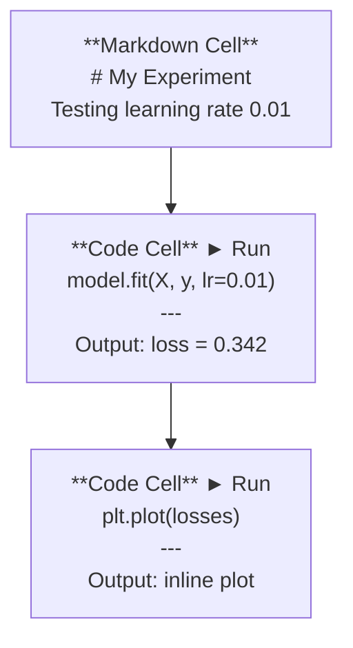
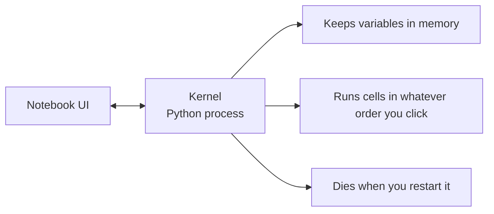

# Jupyter Notebooks

> Notebook 是 AI 工程的实验台：先在这里原型验证，再把可用的内容移入生产环境。

**类型：** 构建
**语言：** Python
**前置课程：** Phase 0，第 01 课
**预计学习：** 约 30 分钟

## 学习目标

- 安装并启动 JupyterLab、Jupyter Notebook，或带 Jupyter 扩展的 VS Code
- 使用 magic command（`%timeit`、`%%time`、`%matplotlib inline`）进行基准测试和内联可视化
- 区分 notebook 与脚本的适用场景，运用“在 notebook 探索、在脚本交付”的工作流
- 识别并规避常见 notebook 陷阱：乱序执行、隐藏状态和内存泄漏

## 问题

每篇 AI 论文、教程和 Kaggle 竞赛都会使用 Jupyter notebook。它让你分块运行代码、内联查看输出、混合代码和说明，并快速迭代。没有 notebook 就学 AI，如同不带草稿纸做数学作业。

但 notebook 也有真实陷阱。人们把它用于所有事情，包括它并不擅长的事情。知道何时使用 notebook、何时使用脚本，能让你避免日后的调试噩梦。

## 概念

Notebook 是一组单元格；每个单元格是代码或文本。



内核（kernel）是在后台运行的 Python 进程。运行单元格时，界面将代码发给内核；内核执行并返回结果。所有单元格共享同一个内核，因此变量会在单元格之间保留。



“按任意点击顺序运行”既是超级能力，也是危险点。

```figure
s0-cell-order
```

## 动手构建

### 第 1 步：选择界面

三种界面，一种文件格式：

| 界面 | 安装 | 最适合 |
|-----------|---------|----------|
| JupyterLab | `pip install jupyterlab` 后运行 `jupyter lab` | 完整 IDE 体验、多标签页、文件浏览器、终端 |
| Jupyter Notebook | `pip install notebook` 后运行 `jupyter notebook` | 简单轻量、一次使用一个 notebook |
| VS Code | 安装 “Jupyter” 扩展 | 已在编辑器中，可用 Git 集成和调试 |

三者读写相同的 `.ipynb` 文件。选择你喜欢的即可；JupyterLab 在 AI 工作中最常见。

```bash
pip install jupyterlab
jupyter lab
```

### 第 2 步：重要的键盘快捷键

你会在两种模式下操作：按 `Escape` 进入命令模式（左侧蓝条），按 `Enter` 进入编辑模式（绿条）。

**命令模式（最常用）：**

| 按键 | 操作 |
|-----|--------|
| `Shift+Enter` | 运行单元格并移至下一个 |
| `A` | 在上方插入单元格 |
| `B` | 在下方插入单元格 |
| `DD` | 删除单元格 |
| `M` | 转为 markdown |
| `Y` | 转为代码 |
| `Z` | 撤销单元格操作 |
| `Ctrl+Shift+H` | 显示全部快捷键 |

**编辑模式：**

| 按键 | 操作 |
|-----|--------|
| `Tab` | 自动补全 |
| `Shift+Tab` | 显示函数签名 |
| `Ctrl+/` | 切换注释 |

`Shift+Enter` 是你每天会用上千次的快捷键，先把它练熟。

### 第 3 步：单元格类型

**代码单元格**运行 Python 并显示输出：

```python
import numpy as np
data = np.random.randn(1000)
data.mean(), data.std()
```

输出：`(0.0032, 0.9987)`

**Markdown 单元格**渲染带格式文本。用它记录正在做什么、为什么这样做；它支持标题、加粗、斜体、LaTex 数学（`$E = mc^2$`）、表格和图片。

### 第 4 步：Magic command

它们是以 `%`（行 magic）或 `%%`（单元格 magic）开头的 Jupyter 专用命令，不属于 Python 语法。

**测量代码时间：**

```python
%timeit np.random.randn(10000)
```

输出：`45.2 us +/- 1.3 us per loop`

```python
%%time
model.fit(X_train, y_train, epochs=10)
```

输出：`Wall time: 2.34 s`

`%timeit` 会多次运行并取平均；`%%time` 只运行一次。微基准测试用 `%timeit`，训练运行用 `%%time`。

**启用内联图：**

```python
%matplotlib inline
```

现在每次 `plt.plot()` 或 `plt.show()` 都会直接在 notebook 中渲染。

**无需离开 notebook 即可安装包：**

```python
!pip install scikit-learn
```

`!` 前缀可运行任意 shell 命令。

**检查环境变量：**

```python
%env CUDA_VISIBLE_DEVICES
```

### 第 5 步：内联显示丰富输出

Notebook 会自动显示单元格最后一个表达式，但你可以控制它：

```python
import pandas as pd

df = pd.DataFrame({
    "model": ["Linear", "Random Forest", "Neural Net"],
    "accuracy": [0.72, 0.89, 0.94],
    "training_time": [0.1, 2.3, 45.6]
})
df
```

它渲染的是格式化 HTML 表格，而非文本转储；图也是如此：

```python
import matplotlib.pyplot as plt

plt.figure(figsize=(8, 4))
plt.plot([1, 2, 3, 4], [1, 4, 2, 3])
plt.title("Inline Plot")
plt.show()
```

图会出现在单元格正下方。这正是 notebook 主导 AI 工作的原因：数据、图和代码在同一处呈现。

对于图像：

```python
from IPython.display import Image, display
display(Image(filename="architecture.png"))
```

### 第 6 步：Google Colab

Colab 是云端免费的 Jupyter notebook。它提供 GPU、预装库和 Google Drive 集成，无需配置。

1. 打开 [colab.research.google.com](https://colab.research.google.com)
2. 上传本课程的任一 `.ipynb` 文件
3. Runtime > Change runtime type > T4 GPU（免费）

Colab 与本地 Jupyter 的差异：
- 文件不会跨会话保存（保存到 Drive 或下载）
- 预装 numpy、pandas、matplotlib、torch、tensorflow、sklearn
- 使用 `from google.colab import files` 上传/下载文件
- 使用 `from google.colab import drive; drive.mount('/content/drive')` 获得持久存储
- 免费层空闲 90 分钟后会话超时

## 实际使用

### Notebook 与脚本：分别在何时使用

| notebook 适合 | 脚本适合 |
|-------------------|-----------------|
| 探索数据集 | 训练流水线 |
| 原型化模型 | 可复用工具 |
| 可视化结果 | 含 `if __name__` 的任何代码 |
| 解释工作 | 按计划运行的代码 |
| 快速实验 | 生产代码 |
| 课程练习 | 包和库 |

规则是：**在 notebook 探索，在脚本交付**。

AI 中的常见工作流：
1. 在 notebook 中探索数据
2. 在 notebook 中原型化模型
3. 工作后，将代码移到 `.py` 文件
4. 再把这些 `.py` 文件导入 notebook 做进一步实验

### 常见陷阱

**乱序执行。** 你先运行第 5 格，再运行第 2 格，最后运行第 7 格。它在你的机器上可用，但其他人从上到下运行时失败。修复：分享前执行 Kernel > Restart & Run All。

**隐藏状态。** 你删除了一个单元格，但其中创建的变量仍在内存里。Notebook 看起来干净，却依赖一个幽灵单元格。修复：定期重启内核。

**内存泄漏。** 加载 4GB 数据集、训练模型、再加载另一个数据集，内存没有释放。修复：使用 `del variable_name` 和 `gc.collect()`，或重启内核。

## 交付成果

本课会产出：
- `outputs/prompt-notebook-helper.md`，用于排查 notebook 问题

## 练习

1. 打开 JupyterLab，创建 notebook，用 `%timeit` 比较列表推导式与 numpy 创建 100,000 个随机数数组的速度
2. 创建包含 markdown 和代码单元格的 notebook：加载 CSV、显示 dataframe、绘制图表；然后用 Kernel > Restart & Run All 验证可从上到下运行
3. 将 `code/notebook_tips.py` 的代码粘入 Colab notebook，并使用免费 GPU 运行

## 核心术语

| 术语 | 常见说法 | 实际含义 |
|------|----------------|----------------------|
| Kernel | “运行代码的东西” | 执行单元格代码并在内存中保留变量的独立 Python 进程 |
| Cell | “代码块” | notebook 中可独立运行的单元，可为代码或 markdown |
| Magic command | “Jupyter 小技巧” | 以 `%` 或 `%%` 开头、控制 notebook 环境的特殊命令 |
| `.ipynb` | “notebook 文件” | 含单元格、输出和元数据的 JSON 文件，意为 IPython Notebook |

## 延伸阅读

- [JupyterLab Docs](https://jupyterlab.readthedocs.io/)：完整功能集
- [Google Colab FAQ](https://research.google.com/colaboratory/faq.html)：Colab 专属限制和功能
- [28 Jupyter Notebook Tips](https://www.dataquest.io/blog/jupyter-notebook-tips-tricks-shortcuts/)：高级用户快捷方式
