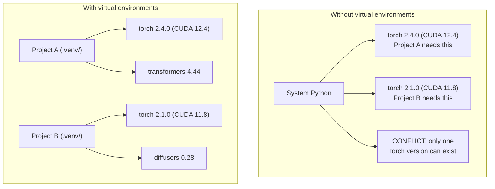

# Python 环境

> 不同项目需要不同的依赖版本；虚拟环境负责把它们隔离开。

**类型：** 构建
**语言：** Shell
**前置课程：** Phase 0，第 01 课
**预计学习：** 约 30 分钟

## 学习目标

- 用 `uv`、`venv` 或 `conda` 创建隔离的虚拟环境
- 编写带可选依赖组的 `pyproject.toml`，并生成可复现的 lockfile
- 诊断全局安装、混用 pip/conda、CUDA 版本不匹配等常见问题
- 为依赖冲突的项目实施按阶段划分的环境策略

## 问题

你为微调项目安装 PyTorch 2.4；下周另一个项目因 CUDA 构建被固定而需要 PyTorch 2.1。全局升级会破坏前者，降级又会破坏后者。

这是 AI/ML 中频繁发生的依赖地狱，因为：

- PyTorch、JAX 和 TensorFlow 各自携带自己的 CUDA 绑定
- 模型库会固定特定框架版本
- 全局 `pip install` 会覆盖此前安装的内容
- CUDA 11.8 构建不能与 CUDA 12.x 驱动配合使用（反之亦然）

解决办法是：每个项目都有自己的隔离环境和包集合。

## 概念



```figure
s0-env-isolation
```

## 动手构建

### 方案 1：uv venv（推荐）

`uv` 是最快的 Python 包管理器（比 pip 快 10–100 倍），可用一个工具处理虚拟环境、Python 版本和依赖解析。

```bash
curl -LsSf https://astral.sh/uv/install.sh | sh

uv python install 3.12

cd your-project
uv venv
source .venv/bin/activate
```

安装包：

```bash
uv pip install torch numpy
```

一步创建带 `pyproject.toml` 的项目：

```bash
uv init my-ai-project
cd my-ai-project
uv add torch numpy matplotlib
```

### 方案 2：venv（内置）

不能安装 `uv` 时，Python 自带 `venv`：

```bash
python3 -m venv .venv
source .venv/bin/activate  # Linux/macOS
.venv\Scripts\activate     # Windows

pip install torch numpy
```

它比 `uv` 慢，但凡是安装了 Python 的地方都可用。

### 方案 3：conda（需要时使用）

Conda 可管理 CUDA toolkit、cuDNN、C 库等非 Python 依赖。出现下列情形时使用它：

- 需要特定 CUDA toolkit 版本，但不希望在系统范围安装
- 在无法安装系统包的共享集群上工作
- 某个库的安装说明明确写着“use conda”

```bash
# Install miniconda (not the full Anaconda)
curl -LsSf https://repo.anaconda.com/miniconda/Miniconda3-latest-Linux-x86_64.sh -o miniconda.sh
bash miniconda.sh -b

conda create -n myproject python=3.12
conda activate myproject

conda install pytorch torchvision torchaudio pytorch-cuda=12.4 -c pytorch -c nvidia
```

规则：在一个 conda 环境中使用 conda，就用 conda 安装全部包。往 conda 环境混入 `pip install` 会制造难以调试的冲突。

### 本课程的按阶段策略

不要为整套课程只建一个环境；不同阶段会需要不同甚至冲突的依赖。

```text
ai-engineering-from-scratch/
├── .venv/                    <-- shared lightweight env for phases 0-3
├── phases/
│   ├── 04-neural-networks/
│   │   └── .venv/            <-- PyTorch env
│   ├── 05-cnns/
│   │   └── .venv/            <-- same PyTorch env (symlink or shared)
│   ├── 08-transformers/
│   │   └── .venv/            <-- might need different transformer versions
│   └── 11-llm-apis/
│       └── .venv/            <-- API SDKs, no torch needed
```

`code/env_setup.sh` 会为本课程创建基础环境。

## pyproject.toml 基础

每个 Python 项目都应有 `pyproject.toml`，它将 `setup.py`、`setup.cfg` 和 `requirements.txt` 合并为一个文件。

```toml
[project]
name = "ai-engineering-from-scratch"
version = "0.1.0"
requires-python = ">=3.11"
dependencies = [
    "numpy>=1.26",
    "matplotlib>=3.8",
    "jupyter>=1.0",
    "scikit-learn>=1.4",
]

[project.optional-dependencies]
torch = ["torch>=2.3", "torchvision>=0.18"]
llm = ["anthropic>=0.39", "openai>=1.50"]
```

然后安装：

```bash
uv pip install -e ".[torch]"    # base + PyTorch
uv pip install -e ".[llm]"     # base + LLM SDKs
uv pip install -e ".[torch,llm]" # everything
```

## Lockfile

Lockfile 会把每个依赖（包括传递依赖）固定为精确版本，确保任何人从它安装都会得到相同包。

```bash
# uv generates uv.lock automatically when using uv add
uv add numpy

# pip-tools approach
uv pip compile pyproject.toml -o requirements.lock
uv pip install -r requirements.lock
```

将 lockfile 提交到 Git；克隆仓库的人据此安装即可得到相同版本。

## 常见错误

### 1. 全局安装

```bash
pip install torch  # BAD: installs to system Python

source .venv/bin/activate
pip install torch  # GOOD: installs to virtual environment
```

检查包安装位置：

```bash
which python       # should show .venv/bin/python, not /usr/bin/python
which pip           # should show .venv/bin/pip
```

### 2. 混用 pip 和 conda

```bash
conda create -n myenv python=3.12
conda activate myenv
conda install pytorch -c pytorch
pip install some-other-package   # BAD: can break conda's dependency tracking
conda install some-other-package # GOOD: let conda manage everything
```

如果必须在 conda 中使用仅由 pip 提供的包，先安装全部 conda 包，最后才安装 pip 包。

### 3. 忘记激活

```bash
python train.py           # uses system Python, missing packages
source .venv/bin/activate
python train.py           # uses project Python, packages found
```

Shell 提示符应显示环境名：

```text
(.venv) $ python train.py
```

### 4. 将 .venv 提交到 Git

```bash
echo ".venv/" >> .gitignore
```

虚拟环境有 200MB–2GB，且只适用于本机；请提交 `pyproject.toml` 和 lockfile，而不是环境本身。

### 5. CUDA 版本不匹配

```bash
nvidia-smi                # shows driver CUDA version (e.g., 12.4)
python -c "import torch; print(torch.version.cuda)"  # shows PyTorch CUDA version

# These must be compatible.
# PyTorch CUDA version must be <= driver CUDA version.
```

## 实际使用

运行配置脚本创建课程环境：

```bash
bash phases/00-setup-and-tooling/06-python-environments/code/env_setup.sh
```

它会在仓库根目录创建 `.venv`，安装并验证核心依赖。

## 练习

1. 运行 `env_setup.sh` 并确认所有检查通过
2. 创建第二个虚拟环境，安装不同版本的 numpy，确认二者隔离
3. 为同时需要 PyTorch 和 Anthropic SDK 的项目编写 `pyproject.toml`
4. 有意不激活 venv 而全局安装一个包，观察安装位置后将其卸载

## 核心术语

| 术语 | 常见说法 | 实际含义 |
|------|----------------|----------------------|
| Virtual environment | “venv” | 含 Python 解释器与包、独立于系统 Python 的隔离目录 |
| Lockfile | “固定依赖” | 列出每个包精确版本、确保安装相同的文件 |
| pyproject.toml | “新的 setup.py” | Python 项目标准配置文件，替代 setup.py/setup.cfg/requirements.txt |
| Transitive dependency | “依赖的依赖” | B 依赖 C；安装依赖 B 的 A 时，C 就是传递依赖 |
| CUDA mismatch | “我的 GPU 不工作” | PyTorch 编译所用 CUDA 版本与 GPU 驱动支持版本不同 |
