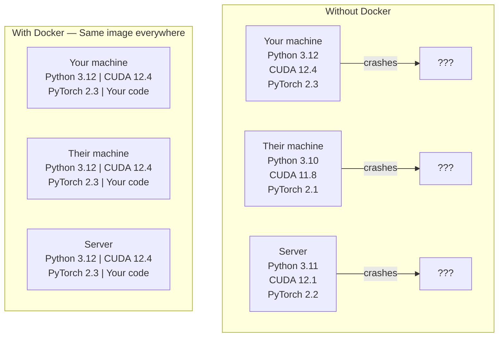

# 面向 AI 的 Docker

> 容器让“只在我的机器上能运行”成为过去式。

**类型：** 构建
**语言：** Docker
**前置课程：** Phase 0，第 01、03 课
**预计学习：** 约 60 分钟

## 学习目标

- 从 Dockerfile 构建包含 CUDA、PyTorch 和 AI 库的 GPU Docker 镜像
- 将宿主目录挂载为 volume，在容器重建间保留模型、数据集和代码
- 配置 NVIDIA Container Toolkit，在容器内暴露 GPU
- 使用 Docker Compose 编排多服务 AI 应用（推理服务器 + 向量数据库）

## 问题

你在笔记本上使用 PyTorch 2.3、CUDA 12.4、Python 3.12 训练模型；同事使用 PyTorch 2.1、CUDA 11.8、Python 3.10，模型在其机器上崩溃。Dockerfile 在两台机器上都能工作。

AI 项目存在依赖噩梦：Python、PyTorch、CUDA 驱动、cuDNN、系统级 C 库，以及需要精确编译器版本的 flash-attn 等专用包。Docker 将它们打包到一个在任何地方都相同运行的镜像中。

## 概念

Docker 将代码、运行时、库和系统工具包装为称作容器的隔离单元。它类似轻量虚拟机，但共享宿主 OS 内核而非运行自己的内核，因此数秒启动而不是数分钟。



### 为什么 AI 项目特别需要 Docker <!-- learning-atlas: why-ai-projects-need-docker-more-than-most -->

1. **GPU 驱动很脆弱。** CUDA 12.4 代码不能在 CUDA 11.8 上运行。Docker 通过 NVIDIA Container Toolkit 共享宿主 GPU 驱动，同时将 CUDA toolkit 隔离在容器中。
2. **模型权重很大。** 一个 7B 参数模型在 fp16 下为 14 GB，不应每次重建都重新下载；Docker volume 可挂载宿主 models 目录。
3. **多服务架构常见。** 真实 AI 应用并不只是 Python 脚本，还包括推理服务器、用于 RAG 的向量数据库，可能还有 Web 前端；Docker Compose 可用一条命令编排它们。

### 核心词汇

| 术语 | 含义 |
|------|---------------|
| Image | 只读模板，是配方；由 Dockerfile 构建。 |
| Container | 镜像的运行实例，是厨房。 |
| Dockerfile | 逐层构建镜像的指令。 |
| Volume | 容器重启后仍保留的持久存储。 |
| docker-compose | 用 YAML 定义多容器应用的工具。 |

### AI 中常见的容器模式

```text
Dev Container
  Full toolkit. Editor support. Jupyter. Debugging tools.
  Used during development and experimentation.

Training Container
  Minimal. Just the training script and dependencies.
  Runs on GPU clusters. No editor, no Jupyter.

Inference Container
  Optimized for serving. Small image. Fast cold start.
  Runs behind a load balancer in production.
```

```figure
s0-image-layers
```

## 动手构建

### 第 1 步：安装 Docker

```bash
# macOS
brew install --cask docker
open /Applications/Docker.app

# Ubuntu
curl -fsSL https://get.docker.com | sh
sudo usermod -aG docker $USER
# Log out and back in for group change to take effect
```

验证：

```bash
docker --version
docker run hello-world
```

### 第 2 步：安装 NVIDIA Container Toolkit（带 NVIDIA GPU 的 Linux）

它让 Docker 容器能访问 GPU。macOS 和 Windows（WSL2）用户可跳过，Docker Desktop 会以不同方式处理 GPU passthrough。

```bash
distribution=$(. /etc/os-release;echo $ID$VERSION_ID)
curl -fsSL https://nvidia.github.io/libnvidia-container/gpgkey | sudo gpg --dearmor -o /usr/share/keyrings/nvidia-container-toolkit-keyring.gpg
curl -s -L https://nvidia.github.io/libnvidia-container/$distribution/libnvidia-container.list | \
    sed 's#deb https://#deb [signed-by=/usr/share/keyrings/nvidia-container-toolkit-keyring.gpg] https://#g' | \
    sudo tee /etc/apt/sources.list.d/nvidia-container-toolkit.list

sudo apt-get update
sudo apt-get install -y nvidia-container-toolkit
sudo nvidia-ctk runtime configure --runtime=docker
sudo systemctl restart docker
```

在容器内测试 GPU：

```bash
docker run --rm --gpus all nvidia/cuda:12.4.1-base-ubuntu22.04 nvidia-smi
```

若显示 GPU 信息，toolkit 已正常工作。

### 第 3 步：理解基础镜像

选择正确基础镜像可节省数小时调试时间。

```text
nvidia/cuda:12.4.1-devel-ubuntu22.04
  Full CUDA toolkit. Compilers included.
  Use for: building packages that need nvcc (flash-attn, bitsandbytes)
  Size: ~4 GB

nvidia/cuda:12.4.1-runtime-ubuntu22.04
  CUDA runtime only. No compilers.
  Use for: running pre-built code
  Size: ~1.5 GB

pytorch/pytorch:2.6.0-cuda12.4-cudnn9-runtime
  PyTorch pre-installed on top of CUDA.
  Use for: skipping the PyTorch install step
  Size: ~6 GB

python:3.12-slim
  No CUDA. CPU only.
  Use for: inference on CPU, lightweight tools
  Size: ~150 MB
```

### 第 4 步：编写 AI 开发 Dockerfile

下面是 `code/Dockerfile`；逐行阅读它：

```dockerfile
FROM nvidia/cuda:12.4.1-devel-ubuntu22.04

ENV DEBIAN_FRONTEND=noninteractive
ENV PYTHONUNBUFFERED=1

RUN apt-get update && apt-get install -y --no-install-recommends \
    software-properties-common \
    git \
    curl \
    build-essential \
    && add-apt-repository -y ppa:deadsnakes/ppa \
    && apt-get update && apt-get install -y --no-install-recommends \
    python3.12 \
    python3.12-venv \
    python3.12-dev \
    && rm -rf /var/lib/apt/lists/*

RUN update-alternatives --install /usr/bin/python python /usr/bin/python3.12 1

RUN curl -sSL https://raw.githubusercontent.com/pypa/get-pip/3b73145063be545b649ad9ca83ea8da5fc915a4f/public/get-pip.py -o /tmp/get-pip.py \
    && echo "a341e1a43e38001c551a1508a73ff23636a11970b61d901d9a1cad2a18f57055  /tmp/get-pip.py" | sha256sum -c - \
    && python /tmp/get-pip.py \
    && rm /tmp/get-pip.py \
    && update-alternatives --install /usr/bin/pip pip /usr/local/bin/pip3.12 1

RUN python -m pip install --no-cache-dir --upgrade pip setuptools wheel

RUN python -m pip install --no-cache-dir \
    torch==2.6.0+cu124 \
    torchvision==0.21.0+cu124 \
    torchaudio==2.6.0+cu124 \
    --index-url https://download.pytorch.org/whl/cu124

RUN python -m pip install --no-cache-dir \
    numpy \
    pandas \
    scikit-learn \
    matplotlib \
    jupyter \
    transformers \
    datasets \
    accelerate \
    safetensors

WORKDIR /workspace

VOLUME ["/workspace", "/models"]

EXPOSE 8888

CMD ["python"]
```

构建：

```bash
docker build -t ai-dev -f phases/00-setup-and-tooling/07-docker-for-ai/code/Dockerfile .
```

首次构建需下载 CUDA 基础镜像和 PyTorch，耗时较长；后续构建会使用缓存层。

运行：

```bash
docker run --rm -it --gpus all \
    -v $(pwd):/workspace \
    -v ~/models:/models \
    ai-dev python -c "import torch; print(f'PyTorch {torch.__version__}, CUDA: {torch.cuda.is_available()}')"
```

在容器中运行 Jupyter：

```bash
docker run --rm -it --gpus all \
    -v $(pwd):/workspace \
    -v ~/models:/models \
    -p 8888:8888 \
    ai-dev jupyter notebook --ip=0.0.0.0 --port=8888 --no-browser --allow-root
```

### 第 5 步：数据和模型的 volume mount

Volume mount 对 AI 很关键；没有它，容器停止时下载的 14 GB 模型会消失。

```bash
# Mount your code
-v $(pwd):/workspace

# Mount a shared models directory
-v ~/models:/models

# Mount datasets
-v ~/datasets:/data
```

训练脚本从挂载路径加载：

```python
from transformers import AutoModel

model = AutoModel.from_pretrained("/models/llama-7b")
```

模型位于宿主文件系统，可任意重建容器而不用重新下载。

### 第 6 步：多服务 AI 应用的 Docker Compose

真实 RAG 应用需要推理服务器和向量数据库；Docker Compose 用一条命令运行两者。见 `code/docker-compose.yml`：

```yaml
services:
  ai-dev:
    build:
      context: .
      dockerfile: Dockerfile
    deploy:
      resources:
        reservations:
          devices:
            - driver: nvidia
              count: all
              capabilities: [gpu]
    volumes:
      - ../../../:/workspace
      - ~/models:/models
      - ~/datasets:/data
    ports:
      - "8888:8888"
    stdin_open: true
    tty: true
    command: jupyter notebook --ip=0.0.0.0 --port=8888 --no-browser --allow-root

  qdrant:
    image: qdrant/qdrant:v1.12.5
    ports:
      - "6333:6333"
      - "6334:6334"
    volumes:
      - qdrant_data:/qdrant/storage

volumes:
  qdrant_data:
```

启动全部服务：

```bash
cd phases/00-setup-and-tooling/07-docker-for-ai/code
docker compose up -d
```

AI 开发容器现在可通过服务名访问 `http://qdrant:6333`；Docker Compose 自动创建共享网络。

从 AI 容器内测试连接：

```python
from qdrant_client import QdrantClient

client = QdrantClient(host="qdrant", port=6333)
print(client.get_collections())
```

停止全部服务：

```bash
docker compose down
```

追加 `-v` 也删除 qdrant volume：

```bash
docker compose down -v
```

### 第 7 步：AI 工作的实用 Docker 命令

```bash
# List running containers
docker ps

# List all images and their sizes
docker images

# Remove unused images (reclaim disk space)
docker system prune -a

# Check GPU usage inside a running container
docker exec -it <container_id> nvidia-smi

# Copy a file from container to host
docker cp <container_id>:/workspace/results.csv ./results.csv

# View container logs
docker logs -f <container_id>
```

## 实际使用

你现在拥有可复现的 AI 开发环境。后续课程中：

- 用 `docker compose up` 同时启动开发环境和向量数据库
- 将代码、模型和数据挂载为 volume，避免重建间丢失内容
- 课程需要新 Python 包时，将其加入 Dockerfile 后重建
- 与团队共享 Dockerfile，使他们获得完全相同的环境

### 没有 GPU？

移除 `--gpus all` 标志和 NVIDIA deploy 块即可。容器仍可用于 CPU 课程；PyTorch 会检测没有 CUDA 并自动退回 CPU。

## 练习

1. 构建 Dockerfile，并在容器中运行 `python -c "import torch; print(torch.__version__)"`。
2. 启动 docker-compose 栈，确认 AI 容器可在 `http://qdrant:6333/collections` 访问 Qdrant。
3. 将 `flask` 加到 Dockerfile，重建，在端口 5000 运行简单 API 服务器，并用 `-p 5000:5000` 映射端口。
4. 用 `docker images` 测量镜像大小；将基础镜像从 `devel` 换为 `runtime` 并比较大小。

## 核心术语

| 术语 | 常见说法 | 实际含义 |
|------|----------------|----------------------|
| Container | “轻量 VM” | 使用宿主内核、拥有独立文件系统和网络的隔离进程 |
| Image layer | “缓存步骤” | 每条 Dockerfile 指令创建一个层；未改变的层会缓存，因此重建很快 |
| NVIDIA Container Toolkit | “Docker 中的 GPU” | 通过 `--gpus` 标志向容器暴露宿主 GPU 的运行时 hook |
| Volume mount | “共享文件夹” | 映射到容器中的宿主目录；容器停止后变更仍保留 |
| Base image | “起点” | Dockerfile 的 `FROM` 镜像，决定预安装内容 |
