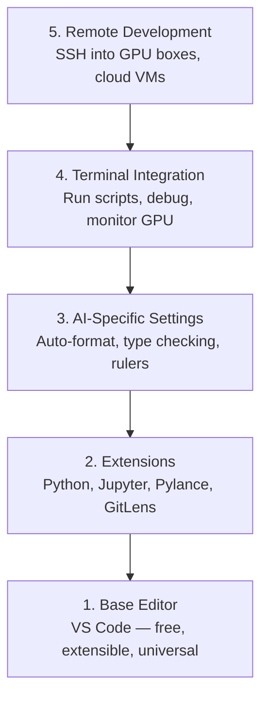

# 编辑器配置

> 编辑器是你的副驾驶。一次配置好，让它不再制造阻力，并真正分担工作。

**类型：** 构建
**语言：** --
**前置课程：** Phase 0，第 01 课
**预计学习：** 约 20 分钟

## 学习目标

- 安装 VS Code 及 Python、Jupyter、lint 和远程 SSH 所需扩展
- 为 AI 工作流配置保存时格式化、类型检查和 notebook 输出滚动
- 用 Remote SSH 像编辑本地文件一样编辑、调试远程 GPU 机器代码
- 评估 Cursor、Windsurf、Neovim 等编辑器在 AI 工作中的取舍

## 问题

你会花数千小时在编辑器中写 Python、运行 notebook、调试训练循环并 SSH 到 GPU 机器。配置不当会让每次工作都充满摩擦：没有补全、类型提示、内联错误，格式化全靠手工，终端也难用。

正确配置要 20 分钟；跳过它每天都会损失 20 分钟。

## 概念

AI 工程编辑器需要五样东西：



## 动手构建

### 第 1 步：安装 VS Code

推荐使用 VS Code：免费、支持所有操作系统、原生支持 Jupyter notebook，扩展生态可覆盖 AI 工作所需功能。

从 [code.visualstudio.com](https://code.visualstudio.com/) 下载，并在终端验证：

```bash
code --version
```

若 macOS 找不到 `code`，在 VS Code 中按 `Cmd+Shift+P`，输入 “Shell Command”，选择 “Install 'code' command in PATH”。

### 第 2 步：安装必要扩展

在 VS Code 集成终端（所有平台均为 `` Ctrl+` ``）中安装 AI 工作需要的扩展：

```bash
code --install-extension ms-python.python
code --install-extension ms-python.vscode-pylance
code --install-extension ms-toolsai.jupyter
code --install-extension eamodio.gitlens
code --install-extension ms-vscode-remote.remote-ssh
code --install-extension ms-python.debugpy
code --install-extension ms-python.black-formatter
code --install-extension charliermarsh.ruff
```

各扩展作用：

| 扩展 | 原因 |
|-----------|-----|
| Python | 语言支持、虚拟环境检测、运行/调试 |
| Pylance | 快速类型检查、补全、导入解析 |
| Jupyter | 在 VS Code 内运行 notebook、变量浏览器 |
| GitLens | 查看修改者和内联 Git blame |
| Remote SSH | 像本地一样打开远程 GPU 机器上的文件夹 |
| Debugpy | 单步调试 Python |
| Black Formatter | 保存时自动格式化，保持风格一致 |
| Ruff | 快速 lint，捕获常见错误 |

本课的 `code/.vscode/extensions.json` 含完整推荐列表；打开项目文件夹时 VS Code 会提示安装。

### 第 3 步：配置设置

复制本课 `code/.vscode/settings.json` 中的设置，或通过 `Settings > Open Settings (JSON)` 手动设置。AI 工作关键项如下：

```jsonc
{
    "python.analysis.typeCheckingMode": "basic",
    "editor.formatOnSave": true,
    "editor.rulers": [88, 120],
    "notebook.output.scrolling": true,
    "files.autoSave": "afterDelay"
}
```

- **基础类型检查**：运行前发现错误参数类型、张量形状和 API 参数，减少调试时间。
- **保存时格式化**：Black 自动处理格式，无须再思考它。
- **88 和 120 列标尺**：Black 在 88 列换行；120 列提醒 docstring 和注释过长。
- **Notebook 输出滚动**：训练循环会输出数千行；不开启时输出面板会失控膨胀。
- **自动保存**：避免忘记保存而运行旧代码。

### 第 4 步：终端集成

VS Code 集成终端用于运行训练脚本、监控 GPU 和管理环境，应这样设置：

```jsonc
{
    "terminal.integrated.defaultProfile.osx": "zsh",
    "terminal.integrated.defaultProfile.linux": "bash",
    "terminal.integrated.fontSize": 13,
    "terminal.integrated.scrollback": 10000
}
```

常用快捷键：

| 操作 | macOS | Linux/Windows |
|--------|-------|---------------|
| 切换终端 | `` Ctrl+` `` | `` Ctrl+` `` |
| 新建终端 | `` Ctrl+Shift+` `` | `` Ctrl+Shift+` `` |
| 拆分终端 | `Cmd+\` | `Ctrl+Shift+5` |

拆分终端很实用：一个运行脚本，另一个用 `nvidia-smi -l 1` 或 `watch -n 1 nvidia-smi` 监控 GPU。

### 第 5 步：远程开发（SSH 到 GPU 机器）

这是 AI 工作最重要的扩展。训练会在远程机器运行（云 VM、实验室服务器、Lambda、Vast.ai）；Remote SSH 让你像本地一样打开远程文件系统、编辑、运行终端和调试。

配置步骤：

1. 安装 Remote SSH 扩展（第 2 步已完成）。
2. 按 `Ctrl+Shift+P`（或 `Cmd+Shift+P`），输入 “Remote-SSH: Connect to Host”。
3. 输入 `user@your-gpu-box-ip`。
4. VS Code 会自动在远程机器安装服务端组件。

为免密码访问设置 SSH key：

```bash
ssh-keygen -t ed25519 -C "your-email@example.com"
ssh-copy-id user@your-gpu-box-ip
```

将主机加入 `~/.ssh/config`：

```text
Host gpu-box
    HostName 203.0.113.50
    User ubuntu
    IdentityFile ~/.ssh/id_ed25519
    ForwardAgent yes
```

此后选择 `Remote-SSH: Connect to Host > gpu-box` 即可立即连接。

## 替代方案

### Cursor

[cursor.com](https://cursor.com) 是内置 AI 代码生成的 VS Code fork，使用相同扩展生态和设置格式；导入相同 `settings.json` 与 `extensions.json` 即可。

### Windsurf

[windsurf.com](https://windsurf.com) 是另一款 AI-first 的 VS Code fork：同样使用扩展、设置格式和 Remote SSH。

### Vim/Neovim

若你已经熟练使用 Vim/Neovim，可继续使用。AI Python 工作至少需要：

- **pyright** 或 **pylsp**：通过 Mason 或手工安装做类型检查
- **nvim-lspconfig**：语言服务器集成
- **jupyter-vim** 或 **molten-nvim**：类 notebook 执行
- **telescope.nvim**：文件/符号搜索
- 带 black 和 ruff 的 **none-ls.nvim**：格式化/lint

若尚未使用 Vim，不要现在开始；学习曲线会与 AI 工程学习竞争。请使用 VS Code。

## 实际使用

配置完成后，日常流程是：

1. 在 VS Code 打开项目文件夹（或通过 Remote SSH 连接 GPU 机器）。
2. 以补全、类型提示和内联错误编写 Python。
3. 用 Jupyter 扩展内联运行 notebook。
4. 用集成终端运行训练脚本、`uv pip install` 与 GPU 监控。
5. 提交前用 GitLens 审查修改。

## 练习

1. 安装 VS Code 和第 2 步全部扩展
2. 将本课 `settings.json` 复制到 VS Code 配置
3. 打开 Python 文件，确认 Pylance 显示类型提示，Black 在保存时格式化
4. 若可访问远程机器，配置 Remote SSH 并打开其文件夹

## 核心术语

| 术语 | 常见说法 | 实际含义 |
|------|----------------|----------------------|
| LSP | “自动补全引擎” | Language Server Protocol：编辑器从语言专属服务器获得类型信息、补全和诊断的标准 |
| Pylance | “Python 插件” | Microsoft 的 Python 语言服务器，使用 Pyright 做类型检查和 IntelliSense |
| Remote SSH | “在服务器上工作” | 在远程机器运行轻量 VS Code 服务端、将 UI 流式传到本地编辑器的扩展 |
| Format on save | “自动 prettier” | 每次保存时运行格式化器（Black、Ruff），让代码风格一致 |
