# 数据管理

> 数据是燃料；如何管理它决定你前进的速度。

**类型：** 构建
**语言：** Python
**前置课程：** Phase 0，第 01 课
**预计学习：** 约 45 分钟

## 学习目标

- 用 Hugging Face `datasets` 库加载、流式处理和缓存数据集
- 在 CSV、JSON、Parquet 与 Arrow 格式间转换，并说明取舍
- 用固定随机种子创建可复现的训练/验证/测试集划分
- 用 `.gitignore`、Git LFS 或 DVC 管理大型模型和数据集文件

## 问题

每个 AI 项目都从数据开始：寻找、下载、转换格式、划分训练和评估数据，并做版本管理以复现实验。每次手工完成这些步骤既慢又易错；你需要可重复的工作流。

## 概念

```mermaid
graph TD
    A["Hugging Face Hub"] --> B["datasets library"]
    B --> C["Load / Stream"]
    C --> D["Local Cache<br/>~/.cache/huggingface/"]
    B --> E["Format Conversion<br/>CSV, JSON, Parquet, Arrow"]
    E --> F["Data Splits<br/>train / val / test"]
    F --> G["Your Training Pipeline"]
```



Hugging Face `datasets` 是 AI 工作中加载数据的标准方式，开箱即可处理下载、缓存、格式转换和流式读取。

```figure
s0-data-pipeline
```

## 动手构建

### 第 1 步：安装 datasets 库

```bash
pip install datasets huggingface_hub
```

### 第 2 步：加载数据集

```python
from datasets import load_dataset

dataset = load_dataset("stanfordnlp/imdb")
print(dataset)
print(dataset["train"][0])
```

这会下载 IMDB 电影评论数据集。首次下载后，会从 `~/.cache/huggingface/datasets/` 缓存加载。

### 第 3 步：流式处理大型数据集

有些数据集大到无法放入磁盘；流式模式逐行加载，无需下载完整数据。

```python
dataset = load_dataset("wikimedia/wikipedia", "20220301.en", split="train", streaming=True)

for i, example in enumerate(dataset):
    print(example["title"])
    if i >= 4:
        break
```

流式模式给出 `IterableDataset`；数据到达时逐行处理，因此无论数据集大小，内存占用保持不变。

### 第 4 步：数据集格式

`datasets` 底层使用 Apache Arrow，可按流水线需要转换为其他格式。

```python
dataset = load_dataset("stanfordnlp/imdb", split="train")

dataset.to_csv("imdb_train.csv")
dataset.to_json("imdb_train.json")
dataset.to_parquet("imdb_train.parquet")
```

格式比较：

| 格式 | 大小 | 读取速度 | 最适合 |
|--------|------|-----------|----------|
| CSV | 大 | 慢 | 人工可读、电子表格 |
| JSON | 大 | 慢 | API、嵌套数据 |
| Parquet | 小 | 快 | 分析、列式查询 |
| Arrow | 小 | 最快 | 内存处理（`datasets` 内部使用） |

AI 工作中，Parquet 是最佳存储格式，Arrow 是内存中处理的格式；CSV 和 JSON 用于交换。

### 第 5 步：数据划分 <!-- learning-atlas: step-5-data-splits -->

每个 ML 项目需要三个划分：

- **训练集**：模型从中学习（通常 80%）
- **验证集**：训练过程中检查进度（通常 10%）
- **测试集**：训练结束后的最终评估（通常 10%）

有些数据集预先划分；没有时自行划分：

```python
dataset = load_dataset("stanfordnlp/imdb", split="train")

split = dataset.train_test_split(test_size=0.2, seed=42)
train_val = split["train"].train_test_split(test_size=0.125, seed=42)

train_ds = train_val["train"]
val_ds = train_val["test"]
test_ds = split["test"]

print(f"Train: {len(train_ds)}, Val: {len(val_ds)}, Test: {len(test_ds)}")
```

始终设置种子以便复现；相同种子每次产生相同划分。

### 第 6 步：下载和缓存模型

模型是大文件，`huggingface_hub` 负责下载与缓存。

```python
from huggingface_hub import hf_hub_download, snapshot_download

model_path = hf_hub_download(
    repo_id="sentence-transformers/all-MiniLM-L6-v2",
    filename="config.json"
)
print(f"Cached at: {model_path}")

model_dir = snapshot_download("sentence-transformers/all-MiniLM-L6-v2")
print(f"Full model at: {model_dir}")
```

模型缓存到 `~/.cache/huggingface/hub/`；下载一次后，后续运行会立刻加载。

### 第 7 步：处理大型文件

模型权重和大型数据集不应放入 Git，有三种选择：

**方案 A：.gitignore（最简单）**

```text
*.bin
*.safetensors
*.pt
*.onnx
data/*.parquet
data/*.csv
models/
```

**方案 B：Git LFS（在 Git 中追踪大文件）**

```bash
git lfs install
git lfs track "*.bin"
git lfs track "*.safetensors"
git add .gitattributes
```

Git LFS 在仓库中保存指针，实际文件放在单独服务器；GitHub 免费提供 1 GB。

**方案 C：DVC（数据版本控制）**

```bash
pip install dvc
dvc init
dvc add data/training_set.parquet
git add data/training_set.parquet.dvc data/.gitignore
git commit -m "Track training data with DVC"
```

DVC 创建指向数据的小型 `.dvc` 文件；数据本身存于 S3、GCS 或其他远程存储后端。

| 方法 | 复杂度 | 最适合 |
|----------|-----------|----------|
| .gitignore | 低 | 个人项目、可重新获取的已下载数据 |
| Git LFS | 中 | 团队通过 Git 共享模型权重 |
| DVC | 高 | 可复现实验、大型数据集、团队 |

本课程使用 `.gitignore` 已足够；需要跨机器复现精确实验时再使用 DVC。

### 第 8 步：存储模式

**本地存储**适用于约 10 GB 以下的数据集，HF cache 会自动处理。

**云存储**用于更大的数据，或需要跨机器共享的数据：

```python
import os

local_path = os.path.expanduser("~/.cache/huggingface/datasets/")

# s3_path = "s3://my-bucket/datasets/"
# gcs_path = "gs://my-bucket/datasets/"
```

DVC 可直接集成 S3 和 GCS：

```bash
dvc remote add -d myremote s3://my-bucket/dvc-store
dvc push
```

本课程本地存储已足够；在远程 GPU 实例上微调时，云存储才变得重要。

## 本课程使用的数据集

| 数据集 | 课程 | 大小 | 教授内容 |
|---------|---------|------|----------------|
| IMDB | 分词、分类 | 84 MB | 文本分类基础 |
| WikiText | 语言建模 | 181 MB | 下一个词元预测 |
| SQuAD | QA 系统 | 35 MB | 问答、span |
| Common Crawl（子集） | 嵌入 | 不定 | 大规模文本处理 |
| MNIST | 视觉基础 | 21 MB | 图像分类基础 |
| COCO（子集） | 多模态 | 不定 | 图文对 |

现在不需要下载全部数据集；每节课都会说明它需要什么。

## 实际使用

运行工具脚本验证所有内容：

```bash
python code/data_utils.py
```

它会下载一个小数据集、转换、划分并打印摘要。

## 交付成果

本课会产出：
- `code/data_utils.py` —— 可复用的数据加载与缓存工具
- `outputs/prompt-data-helper.md` —— 为任务寻找合适数据集的提示词

## 练习

1. 使用 `mrpc` 配置加载 `glue` 数据集，并查看前 5 个样本
2. 流式读取 `c4` 数据集，统计 10 秒内可处理的样本数
3. 将数据集转为 Parquet，比较其与 CSV 的文件大小
4. 用固定种子创建 70/15/15 的 train/val/test 划分并验证大小

## 核心术语

| 术语 | 常见说法 | 实际含义 |
|------|----------------|----------------------|
| Dataset split | “训练数据” | 在 ML 生命周期不同阶段使用的命名子集（train/val/test） |
| Streaming | “懒加载” | 不下载完整数据集、从远程来源逐行处理数据 |
| Parquet | “压缩 CSV” | 为分析查询和存储效率优化的列式文件格式 |
| Arrow | “快速 dataframe” | `datasets` 在内部用于零拷贝读取的内存列式格式 |
| Git LFS | “用于大文件的 Git” | 将大文件存于仓库外、版本控制中保留指针的扩展 |
| DVC | “用于数据的 Git” | 与云存储集成的数据集与模型版本控制系统 |
| Cache | “已下载” | 默认存于 ~/.cache/huggingface/ 的先前下载内容的本地副本 |
