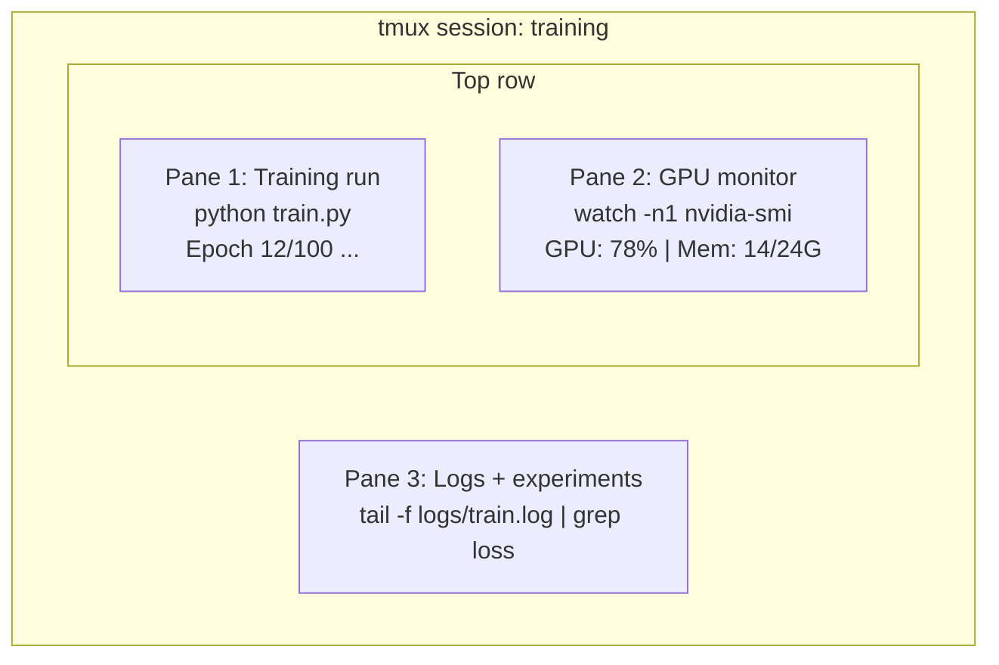

# 终端与 Shell

> 终端是 AI 工程师日常工作的地方；请在这里建立熟练度。

**类型：** 学习
**语言：** --
**前置课程：** Phase 0，第 01 课
**预计学习：** 约 35 分钟

## 学习目标

- 用管道、重定向和 `grep` 在命令行中过滤、处理训练日志
- 用多个 pane 创建持久 tmux 会话，同时训练和监控 GPU
- 使用 `htop`、`nvtop` 和 `nvidia-smi` 监控系统与 GPU 资源
- 使用 SSH、`scp` 和 `rsync` 在本机与远程机器间传输文件

## 问题

你会在终端中花费比任何编辑器更多的时间：训练运行、GPU 监控、日志跟踪、远程 SSH 会话、环境管理。每个 AI 工作流都会接触 shell；这里慢，其他地方也慢。

本课只介绍 AI 工作常用的终端技能，不讲 Unix 历史，也不展开 Bash 脚本。

## 概念



三件事同时运行，只用一个终端。你可脱离会话、回家、再 SSH 回来并重新连接；训练仍会继续。

```figure
s0-shell-pipeline
```

## 动手构建

### 第 1 步：了解你的 shell

检查正在运行的 shell：

```bash
echo $SHELL
```

大多数系统使用 `bash` 或 `zsh`，两者都可以，本课程命令在任一者中都能工作。

要了解的关键操作：

```bash
# Move around
cd ~/projects/ai-engineering-from-scratch
pwd
ls -la

# History search (most useful shortcut you'll learn)
# Ctrl+R then type part of a previous command
# Press Ctrl+R again to cycle through matches

# Clear terminal
clear   # or Ctrl+L

# Cancel a running command
# Ctrl+C

# Suspend a running command (resume with fg)
# Ctrl+Z
```

### 第 2 步：管道与重定向 <!-- learning-atlas: step-2-piping-and-redirects -->

管道把命令连接起来，用于处理日志、过滤输出和串联工具；你会频繁使用它。

```bash
# Count how many times "loss" appears in a log
cat train.log | grep "loss" | wc -l

# Extract just the loss values from training output
grep "loss:" train.log | awk '{print $NF}' > losses.txt

# Watch a log file update in real time, filtering for errors
tail -f train.log | grep --line-buffered "ERROR"

# Sort experiments by final accuracy
grep "final_accuracy" results/*.log | sort -t= -k2 -n -r

# Redirect stdout and stderr to separate files
python train.py > output.log 2> errors.log

# Redirect both to the same file
python train.py > train_full.log 2>&1
```

需要的三类重定向：

| 符号 | 作用 |
|--------|-------------|
| `>` | 将 stdout 写入文件（覆盖） |
| `>>` | 将 stdout 追加到文件 |
| `2>` | 将 stderr 写入文件 |
| `2>&1` | 将 stderr 发送到 stdout 的同一位置 |
| `\|` | 将一条命令的 stdout 作为下一条命令的 stdin |

### 第 3 步：后台进程

训练要数小时，不应始终让终端保持打开。

```bash
# Run in background (output still goes to terminal)
python train.py &

# Run in background, immune to hangup (closing terminal won't kill it)
nohup python train.py > train.log 2>&1 &

# Check what's running in background
jobs
ps aux | grep train.py

# Bring a background job to foreground
fg %1

# Kill a background process
kill %1
# or find its PID and kill that
kill $(pgrep -f "train.py")
```

`&`、`nohup` 与 `screen`/`tmux` 的差异：

| 方法 | 关闭终端后仍运行？ | 可重新连接？ |
|--------|-------------------------|---------------|
| `command &` | 否 | 否 |
| `nohup command &` | 是 | 否（查看日志文件） |
| `screen` / `tmux` | 是 | 是 |

任何超过几分钟的任务都请使用 tmux。

### 第 4 步：tmux

tmux 可创建带多个 pane 的持久终端会话，是管理训练任务最有用的工具。

```bash
# Install
# macOS
brew install tmux
# Ubuntu
sudo apt install tmux

# Start a named session
tmux new -s training

# Split horizontally
# Ctrl+B then "

# Split vertically
# Ctrl+B then %

# Navigate between panes
# Ctrl+B then arrow keys

# Detach (session keeps running)
# Ctrl+B then d

# Reattach
tmux attach -t training

# List sessions
tmux ls

# Kill a session
tmux kill-session -t training
```

典型 AI 工作流会话：

```bash
tmux new -s train

# Pane 1: start training
python train.py --epochs 100 --lr 1e-4

# Ctrl+B, " to split, then run GPU monitor
watch -n1 nvidia-smi

# Ctrl+B, % to split vertically, tail the logs
tail -f logs/experiment.log

# Now detach with Ctrl+B, d
# SSH out, go get coffee, come back
# tmux attach -t train
```

### 第 5 步：使用 htop 和 nvtop 监控

```bash
# System processes (better than top)
htop

# GPU processes (if you have NVIDIA GPU)
# Install: sudo apt install nvtop (Ubuntu) or brew install nvtop (macOS)
nvtop

# Quick GPU check without nvtop
nvidia-smi

# Watch GPU usage update every second
watch -n1 nvidia-smi

# See which processes are using the GPU
nvidia-smi --query-compute-apps=pid,name,used_memory --format=csv
```

常用 `htop` 快捷键：
- `F6` 或 `>`：按列排序（按内存排序可找内存泄漏）
- `F5`：切换树状视图（查看子进程）
- `F9`：终止进程
- `/`：按进程名搜索

### 第 6 步：远程 GPU 机器的 SSH

租用云端 GPU（Lambda、RunPod、Vast.ai）时通过 SSH 连接。

```bash
# Basic connection
ssh user@gpu-box-ip

# With a specific key
ssh -i ~/.ssh/my_gpu_key user@gpu-box-ip

# Copy files to remote
scp model.pt user@gpu-box-ip:~/models/

# Copy files from remote
scp user@gpu-box-ip:~/results/metrics.json ./

# Sync a whole directory (faster for many files)
rsync -avz ./data/ user@gpu-box-ip:~/data/

# Port forward (access remote Jupyter/TensorBoard locally)
ssh -L 8888:localhost:8888 user@gpu-box-ip
# Now open localhost:8888 in your browser

# SSH config for convenience
# Add to ~/.ssh/config:
# Host gpu
#     HostName 192.168.1.100
#     User ubuntu
#     IdentityFile ~/.ssh/gpu_key
#
# Then just:
# ssh gpu
```

### 第 7 步：AI 工作实用别名

将下列内容加入 `~/.bashrc` 或 `~/.zshrc`：

```bash
source phases/00-setup-and-tooling/10-terminal-and-shell/code/shell_aliases.sh
```

也可只复制需要的别名；关键别名如下：

```bash
# GPU status at a glance
alias gpu='nvidia-smi --query-gpu=index,name,utilization.gpu,memory.used,memory.total,temperature.gpu --format=csv,noheader'

# Kill all Python training processes
alias killtraining='pkill -f "python.*train"'

# Quick virtual environment activate
alias ae='source .venv/bin/activate'

# Watch training loss
alias watchloss='tail -f logs/*.log | grep --line-buffered "loss"'
```

完整列表见 `code/shell_aliases.sh`。

### 第 8 步：常见 AI 终端模式

实践中会反复使用：

```bash
# Run training, log everything, notify when done
python train.py 2>&1 | tee train.log; echo "DONE" | mail -s "Training complete" you@email.com

# Compare two experiment logs side by side
diff <(grep "accuracy" exp1.log) <(grep "accuracy" exp2.log)

# Find the largest model files (clean up disk space)
find . -name "*.pt" -o -name "*.safetensors" | xargs du -h | sort -rh | head -20

# Download a model from Hugging Face
wget https://huggingface.co/model/resolve/main/model.safetensors

# Untar a dataset
tar xzf dataset.tar.gz -C ./data/

# Count lines in all Python files (see how big your project is)
find . -name "*.py" | xargs wc -l | tail -1

# Check disk space (training data fills disks fast)
df -h
du -sh ./data/*

# Environment variable check before training
env | grep -i cuda
env | grep -i torch
```

## 实际使用

本课程中各工具的使用时机：

| 工具 | 使用时机 |
|------|----------------|
| tmux | 每次训练运行（Phase 3+） |
| `tail -f` + `grep` | 监控训练日志 |
| `nohup` / `&` | 快速后台任务 |
| `htop` / `nvtop` | 排查训练缓慢、OOM 错误 |
| SSH + `rsync` | 使用云端 GPU |
| 管道 + 重定向 | 处理实验结果 |
| 别名 | 节省重复命令时间 |

## 练习

1. 安装 tmux，创建三 pane 会话，分别运行 `htop`、`watch -n1 date` 和 Python 脚本；脱离并重新连接。
2. 将 `code/shell_aliases.sh` 中别名加入 shell 配置，并用 `source ~/.zshrc`（或 `~/.bashrc`）重载。
3. 用 `for i in $(seq 1 100); do echo "epoch $i loss: $(echo "scale=4; 1/$i" | bc)"; sleep 0.1; done > fake_train.log` 创建模拟训练日志，再用 `grep`、`tail` 和 `awk` 提取 loss 值。
4. 为可访问的服务器配置 SSH 条目（或使用 `localhost` 练习语法）。

## 核心术语

| 术语 | 常见说法 | 实际含义 |
|------|----------------|----------------------|
| Shell | “终端” | 解释命令的程序（bash、zsh、fish） |
| tmux | “终端复用器” | 可在一个窗口运行多个终端会话并脱离/重新连接的程序 |
| Pipe | “那根竖线” | 将一个命令输出作为另一命令输入的 `\|` 操作符 |
| PID | “进程 ID” | 分配给每个进程、用于监控或终止它的唯一编号 |
| nohup | “不挂断” | 使命令不受 hangup 信号影响，关闭终端也不会终止 |
| SSH | “连接服务器” | 用于在远程机器运行命令的加密 Secure Shell 协议 |
