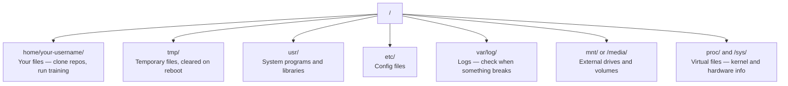

# 面向 AI 的 Linux

> 大多数 AI 在 Linux 上运行；你需要掌握足够的知识，避免被卡住。

**类型：** 学习
**语言：** --
**前置课程：** Phase 0，第 01 课
**预计学习：** 约 30 分钟

## 学习目标

- 在 Linux 文件系统中导航，并从命令行执行基础文件操作
- 用 `chmod` 和 `chown` 管理权限，解决“Permission denied”错误
- 用 `apt` 安装系统软件包，并为 AI 工作配置一台新的 GPU 机器
- 识别在远程机器上工作时常见的 macOS 与 Linux 差异

## 问题

你可能在 macOS 或 Windows 开发，但一旦 SSH 到云端 GPU、租用 Lambda 实例或启动 EC2 机器，就会进入 Ubuntu。终端是唯一界面：没有 Finder、Explorer 或 GUI。若无法从命令行浏览文件系统、安装软件、管理进程，就会在闲置的 GPU 计费时间里搜索“如何在 Linux 解压文件”。

这是一份生存指南：只覆盖在远程 Linux 机器上完成 AI 工作所需的内容。

## 文件系统布局 <!-- learning-atlas: file-system-layout -->

Linux 将一切组织在单一根目录 `/` 下，没有 `C:\` 或 `/Volumes`。实际会接触的目录如下：



家目录是 `~` 或 `/home/your-username`；几乎所有操作都在这里完成。

## 基础命令

这 15 个命令覆盖远程 GPU 机器上 95% 的操作。

### 移动

```bash
pwd                         # Where am I?
ls                          # What's here?
ls -la                      # What's here, including hidden files with details?
cd /path/to/dir             # Go there
cd ~                        # Go home
cd ..                       # Go up one level
```

### 文件与目录

```bash
mkdir my-project            # Create a directory
mkdir -p a/b/c              # Create nested directories in one shot

cp file.txt backup.txt      # Copy a file
cp -r src/ src-backup/      # Copy a directory (recursive)

mv old.txt new.txt          # Rename a file
mv file.txt /tmp/           # Move a file

rm file.txt                 # Delete a file (no trash, it's gone)
rm -rf my-dir/              # Delete a directory and everything inside
```

`rm -rf` 是永久删除，没有撤销；按回车前请再次核对路径。

### 阅读文件

```bash
cat file.txt                # Print entire file
head -20 file.txt           # First 20 lines
tail -20 file.txt           # Last 20 lines
tail -f log.txt             # Follow a log file in real time (Ctrl+C to stop)
less file.txt               # Scroll through a file (q to quit)
```

### 搜索

```bash
grep "error" training.log           # Find lines containing "error"
grep -r "learning_rate" .           # Search all files in current directory
grep -i "cuda" config.yaml          # Case-insensitive search

find . -name "*.py"                 # Find all Python files under current dir
find . -name "*.ckpt" -size +1G     # Find checkpoint files larger than 1GB
```

## 权限

每个 Linux 文件都有所有者与权限位；脚本不能执行或目录不能写入时会遇到它们。

```bash
ls -l train.py
# -rwxr-xr-- 1 user group 2048 Mar 19 10:00 train.py
#  ^^^             owner permissions: read, write, execute
#     ^^^          group permissions: read, execute
#        ^^        everyone else: read only
```

常见修复：

```bash
chmod +x train.sh           # Make a script executable
chmod 755 deploy.sh         # Owner: full, others: read+execute
chmod 644 config.yaml       # Owner: read+write, others: read only

chown user:group file.txt   # Change who owns a file (needs sudo)
```

看到“Permission denied”时，几乎总是权限问题；多数情况可用 `chmod +x` 或 `sudo` 修复。

## 软件包管理（apt）

Ubuntu 使用 `apt` 安装系统级软件：

```bash
sudo apt update             # Refresh the package list (always do this first)
sudo apt install -y htop    # Install a package (-y skips confirmation)
sudo apt install -y build-essential  # C compiler, make, etc. Needed by many Python packages
sudo apt install -y tmux    # Terminal multiplexer (keep sessions alive after disconnect)

apt list --installed        # What's installed?
sudo apt remove htop        # Uninstall
```

新 GPU 机器常安装的软件包：

```bash
sudo apt update && sudo apt install -y \
    build-essential \
    git \
    curl \
    wget \
    tmux \
    htop \
    unzip \
    python3-venv
```

## 用户与 sudo

通常以普通用户登录，部分操作需要 root（管理员）权限：

```bash
whoami                      # What user am I?
sudo command                # Run a single command as root
sudo su                     # Become root (exit to go back, use sparingly)
```

云端 GPU 实例中你通常是唯一用户且已有 sudo 权限。不要以 root 运行所有内容，只在需要时使用 sudo。

## 进程与 systemd

训练卡住或需要检查运行内容时：

```bash
htop                        # Interactive process viewer (q to quit)
ps aux | grep python        # Find running Python processes
kill 12345                  # Gracefully stop process with PID 12345
kill -9 12345               # Force kill (use when graceful doesn't work)
nvidia-smi                  # GPU processes and memory usage
```

systemd 管理服务（后台守护进程）；运行推理服务器时会使用：

```bash
sudo systemctl start nginx          # Start a service
sudo systemctl stop nginx           # Stop it
sudo systemctl restart nginx        # Restart it
sudo systemctl status nginx         # Check if it's running
sudo systemctl enable nginx         # Start automatically on boot
```

## 磁盘空间

GPU 机器磁盘空间常有限，模型和数据集会很快填满它：

```bash
df -h                       # Disk usage for all mounted drives
df -h /home                 # Disk usage for /home specifically

du -sh *                    # Size of each item in current directory
du -sh ~/.cache             # Size of your cache (pip, huggingface models land here)
du -sh /data/checkpoints/   # Check how big your checkpoints are

# Find the biggest space hogs
du -h --max-depth=1 / 2>/dev/null | sort -hr | head -20
```

常见的空间清理操作：

```bash
# Clear pip cache
pip cache purge

# Clear apt cache
sudo apt clean

# Remove old checkpoints you don't need
rm -rf checkpoints/epoch_01/ checkpoints/epoch_02/
```

## 网络

你会从命令行下载模型、传输文件并调用 API：

```bash
# Download files
wget https://example.com/model.bin                   # Download a file
curl -O https://example.com/data.tar.gz              # Same thing with curl
curl -s https://api.example.com/health | python3 -m json.tool  # Hit an API, pretty-print JSON

# Transfer files between machines
scp model.bin user@remote:/data/                     # Copy file to remote machine
scp user@remote:/data/results.csv .                  # Copy file from remote to local
scp -r user@remote:/data/checkpoints/ ./local-dir/   # Copy directory

# Sync directories (faster than scp for large transfers, resumes on failure)
rsync -avz --progress ./data/ user@remote:/data/
rsync -avz --progress user@remote:/results/ ./results/
```

大文件应优先用 `rsync` 而非 `scp`；它仅传输改动字节，并能处理断开的连接。

## tmux：保持会话存活

SSH 到远程机器后合上笔记本会杀掉训练；tmux 可避免此问题。

```bash
tmux new -s train           # Start a new session named "train"
# ... start your training, then:
# Ctrl+B, then D            # Detach (training keeps running)

tmux ls                     # List sessions
tmux attach -t train        # Reattach to session

# Inside tmux:
# Ctrl+B, then %            # Split pane vertically
# Ctrl+B, then "            # Split pane horizontally
# Ctrl+B, then arrow keys   # Switch between panes
```

所有长训练任务都应在 tmux 中运行。始终如此。

## Windows 用户的 WSL2

Windows 下，WSL2 提供不需要双系统的真实 Linux 环境：

```bash
# In PowerShell (admin)
wsl --install -d Ubuntu-24.04

# After restart, open Ubuntu from Start menu
sudo apt update && sudo apt upgrade -y
```

WSL2 运行真实 Linux 内核，本课所有内容都可在其中运行。WSL 内的 Windows 文件位于 `/mnt/c/Users/YourName/`。

安装 Windows 侧 NVIDIA 驱动（不是 Linux 驱动）后，GPU passthrough 可用，CUDA 会在 WSL2 内可用。

## 注意事项：从 macOS 到 Linux

从 macOS 转来时容易踩坑的差异：

| macOS | Linux | 说明 |
|-------|-------|-------|
| `brew install` | `sudo apt install` | 软件包名有时不同；`brew install htop` 与 `sudo apt install htop` 相同，但 `brew install readline` 与 `sudo apt install libreadline-dev` 不同。 |
| `open file.txt` | `xdg-open file.txt` | 远程机器通常没有 GUI；请使用 `cat` 或 `less`。 |
| `pbcopy` / `pbpaste` | 不可用 | 通过 SSH 不存在到/从剪贴板的管道。 |
| `~/.zshrc` | `~/.bashrc` | macOS 默认 zsh，多数 Linux 服务器使用 bash。 |
| `/opt/homebrew/` | `/usr/bin/`、`/usr/local/bin/` | 二进制文件位置不同。 |
| `sed -i '' 's/a/b/' file` | `sed -i 's/a/b/' file` | macOS sed 的 `-i` 后需空字符串，Linux 不需要。 |
| 大小写不敏感文件系统 | 大小写敏感文件系统 | Linux 中 `Model.py` 和 `model.py` 是两个不同文件。 |
| 行尾 `\n` | 行尾 `\n` | 相同；但 Windows 使用 `\r\n`，会破坏 bash 脚本，使用 `dos2unix` 修复。 |

## 快速参考卡

```text
Navigation:     pwd, ls, cd, find
Files:          cp, mv, rm, mkdir, cat, head, tail, less
Search:         grep, find
Permissions:    chmod, chown, sudo
Packages:       apt update, apt install
Processes:      htop, ps, kill, nvidia-smi
Services:       systemctl start/stop/restart/status
Disk:           df -h, du -sh
Network:        curl, wget, scp, rsync
Sessions:       tmux new/attach/detach
```

## 练习

1. SSH 到任意 Linux 机器（或打开 WSL2），进入家目录，创建项目文件夹，在其中用 `touch` 创建三个空文件，然后用 `ls -la` 列出它们。
2. 用 apt 安装 `htop`，运行它并找出最占内存的进程。
3. 启动 tmux 会话，在其中运行 `sleep 300`，脱离、列出会话，然后重新连接。
4. 用 `df -h` 检查可用磁盘空间，再用 `du -sh ~/.cache/*` 找出缓存中占空间的内容。
5. 用 `scp` 将文件从本机传到远程机器，再用 `rsync` 做相同传输，比较体验。
