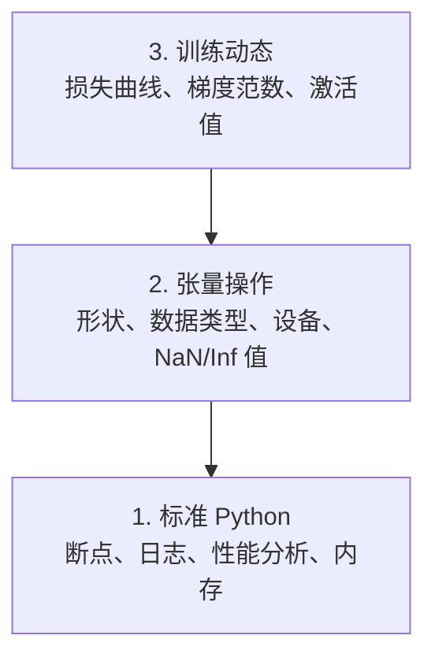

# 调试与性能分析

> 最糟糕的 AI bug 不会崩溃。它们会悄悄用垃圾数据训练，却给出一条漂亮的损失曲线。

**类型：** 构建
**语言：** Python
**前置课程：** 第 01 课（开发环境），具备基础 PyTorch 经验
**预计学习：** 约 60 分钟

## 学习目标

- 使用条件式 `breakpoint()` 和 `debug_print` 在训练中途检查张量形状、数据类型和 NaN 值
- 使用 `cProfile`、`line_profiler` 和 `tracemalloc` 分析训练循环，找出瓶颈
- 检测常见 AI bug：形状不匹配、NaN 损失、数据泄漏和设备错误的张量
- 配置 TensorBoard 来可视化损失曲线、权重直方图和梯度分布

## 问题

AI 代码的失败方式不同于普通代码。Web 应用会带着堆栈跟踪崩溃。一个配置错误的训练循环会运行 8 小时，烧掉 200 美元的 GPU 时间，并产出一个对每个输入都预测均值的模型。代码从未报错。bug 可能是张量在错误设备上、忘记调用 `.detach()`，或者标签泄漏进了特征。

你需要能在这些静默失败浪费时间和算力之前捕获它们的调试工具。

## 概念

AI 调试分为三个层次：



大多数人直接跳到第 3 层（盯着 TensorBoard）。但 80% 的 AI bug 都出现在第 1 层和第 2 层。

```figure
s0-flame-hot
```

## 构建它

### 第 1 部分：打印调试（没错，它有效）

打印调试常被轻视，但不该如此。对张量代码而言，有针对性的打印语句胜过逐步运行调试器，因为你需要一次看到形状、数据类型和值域。

```python
def debug_print(name, tensor):
    print(f"{name}: shape={tensor.shape}, dtype={tensor.dtype}, "
          f"device={tensor.device}, "
          f"min={tensor.min().item():.4f}, max={tensor.max().item():.4f}, "
          f"mean={tensor.mean().item():.4f}, "
          f"has_nan={tensor.isnan().any().item()}")
```

在每个可疑操作后调用它。找到 bug 后，移除这些打印。就是这么简单。

### 第 2 部分：Python 调试器（pdb 和 breakpoint）

内置调试器在 AI 工作中被低估了。把 `breakpoint()` 放进训练循环，交互式检查张量。

```python
def training_step(model, batch, criterion, optimizer):
    inputs, labels = batch
    outputs = model(inputs)
    loss = criterion(outputs, labels)

    if loss.item() > 100 or torch.isnan(loss):
        breakpoint()

    loss.backward()
    optimizer.step()
```

调试器进入后，可用的命令：

- `p outputs.shape` 用于检查形状
- `p loss.item()` 用于查看损失值
- `p torch.isnan(outputs).sum()` 用于统计 NaN
- `p model.fc1.weight.grad` 用于检查梯度
- `c` 继续，`q` 退出

这就是条件式调试。只有出现异常时才会停下。对于一次 10,000 步的训练，这一点很重要。

### 第 3 部分：Python 日志

当调试不再只是快速检查时，用日志替代打印语句。

```python
import logging

logging.basicConfig(
    level=logging.INFO,
    format="%(asctime)s [%(levelname)s] %(message)s",
    handlers=[
        logging.FileHandler("training.log"),
        logging.StreamHandler()
    ]
)
logger = logging.getLogger(__name__)

logger.info("Starting training: lr=%.4f, batch_size=%d", lr, batch_size)
logger.warning("Loss spike detected: %.4f at step %d", loss.item(), step)
logger.error("NaN loss at step %d, stopping", step)
```

日志会提供时间戳、严重级别和文件输出。训练在凌晨 3 点失败时，你需要的是日志文件，而不是已经滚出屏幕的终端输出。

### 第 4 部分：为代码段计时

了解时间花在哪里是优化的第一步。

```python
import time

class Timer:
    def __init__(self, name=""):
        self.name = name

    def __enter__(self):
        self.start = time.perf_counter()
        return self

    def __exit__(self, *args):
        elapsed = time.perf_counter() - self.start
        print(f"[{self.name}] {elapsed:.4f}s")

with Timer("data loading"):
    batch = next(dataloader_iter)

with Timer("forward pass"):
    outputs = model(batch)

with Timer("backward pass"):
    loss.backward()
```

常见发现是：数据加载占用了 60% 的训练时间。解决办法是在 DataLoader 中设定 `num_workers > 0`，而不是换一张更快的 GPU。

### 第 5 部分：cProfile 和 line_profiler

当手动计时器还不够用时：

```bash
python -m cProfile -s cumtime train.py
```

它会按累计时间展示每个函数调用。若需要逐行分析：

```bash
pip install line_profiler
```

```python
@profile
def train_step(model, data, target):
    output = model(data)
    loss = F.cross_entropy(output, target)
    loss.backward()
    return loss

# Run with: kernprof -l -v train.py
```

### 第 6 部分：内存分析

#### 使用 tracemalloc 分析 CPU 内存

```python
import tracemalloc

tracemalloc.start()

# your code here
model = build_model()
data = load_dataset()

snapshot = tracemalloc.take_snapshot()
top_stats = snapshot.statistics("lineno")
for stat in top_stats[:10]:
    print(stat)
```

#### 使用 memory_profiler 分析 CPU 内存

```bash
pip install memory_profiler
```

```python
from memory_profiler import profile

@profile
def load_data():
    raw = read_csv("data.csv")       # watch memory jump here
    processed = preprocess(raw)       # and here
    return processed
```

使用 `python -m memory_profiler your_script.py` 运行，可查看逐行内存用量。

#### 使用 PyTorch 分析 GPU 内存 <!-- learning-atlas: gpu-memory-with-pytorch -->

```python
import torch

if torch.cuda.is_available():
    print(torch.cuda.memory_summary())

    print(f"Allocated: {torch.cuda.memory_allocated() / 1e9:.2f} GB")
    print(f"Cached: {torch.cuda.memory_reserved() / 1e9:.2f} GB")
```

遇到 OOM（内存不足）时：

1. 减小批大小（总是第一个要尝试的办法）
2. 使用 `torch.cuda.empty_cache()` 释放缓存内存
3. 对大型中间变量使用 `del tensor`，随后调用 `torch.cuda.empty_cache()`
4. 使用混合精度（`torch.cuda.amp`）将内存用量减半
5. 对很深的模型使用梯度检查点

### 第 7 部分：常见 AI bug 及其捕获方法

#### 形状不匹配

这是最常见的 bug。一个张量的形状是 `[batch, features]`，而模型期望的是 `[batch, channels, height, width]`。

```python
def check_shapes(model, sample_input):
    print(f"Input: {sample_input.shape}")
    hooks = []

    def make_hook(name):
        def hook(module, inp, out):
            in_shape = inp[0].shape if isinstance(inp, tuple) else inp.shape
            out_shape = out.shape if hasattr(out, "shape") else type(out)
            print(f"  {name}: {in_shape} -> {out_shape}")
        return hook

    for name, module in model.named_modules():
        hooks.append(module.register_forward_hook(make_hook(name)))

    with torch.no_grad():
        model(sample_input)

    for h in hooks:
        h.remove()
```

用一个样本批次运行一次。它会映射模型中的每次形状变换。

#### NaN 损失

NaN 损失表示某处发生了数值爆炸。常见原因：

- 学习率过高
- 自定义损失中除以零
- 对零或负数取对数
- RNN 中的梯度爆炸

```python
def detect_nan(model, loss, step):
    if torch.isnan(loss):
        print(f"NaN loss at step {step}")
        for name, param in model.named_parameters():
            if param.grad is not None:
                if torch.isnan(param.grad).any():
                    print(f"  NaN gradient in {name}")
                if torch.isinf(param.grad).any():
                    print(f"  Inf gradient in {name}")
        return True
    return False
```

#### 数据泄漏

你的模型在测试集上达到 99% 的准确率。听起来很好，但这是个 bug。

```python
def check_data_leakage(train_set, test_set, id_column="id"):
    train_ids = set(train_set[id_column].tolist())
    test_ids = set(test_set[id_column].tolist())
    overlap = train_ids & test_ids
    if overlap:
        print(f"DATA LEAKAGE: {len(overlap)} samples in both train and test")
        return True
    return False
```

还要检查时间泄漏：用未来数据预测过去。切分前请按时间戳排序。

#### 错误设备

不同设备（CPU 与 GPU）上的张量会导致运行时错误。但有时某个张量会悄悄留在 CPU 上，其他所有东西都在 GPU 上，训练只是变慢。

```python
def check_devices(model, *tensors):
    model_device = next(model.parameters()).device
    print(f"Model device: {model_device}")
    for i, t in enumerate(tensors):
        if t.device != model_device:
            print(f"  WARNING: tensor {i} on {t.device}, model on {model_device}")
```

### 第 8 部分：TensorBoard 基础

TensorBoard 会展示训练过程中内部发生的情况。

```bash
pip install tensorboard
```

```python
from torch.utils.tensorboard import SummaryWriter

writer = SummaryWriter("runs/experiment_1")

for step in range(num_steps):
    loss = train_step(model, batch)

    writer.add_scalar("loss/train", loss.item(), step)
    writer.add_scalar("lr", optimizer.param_groups[0]["lr"], step)

    if step % 100 == 0:
        for name, param in model.named_parameters():
            writer.add_histogram(f"weights/{name}", param, step)
            if param.grad is not None:
                writer.add_histogram(f"grads/{name}", param.grad, step)

writer.close()
```

启动它：

```bash
tensorboard --logdir=runs
```

需要观察的内容：

- **损失未下降：** 学习率过低，或模型架构有问题
- **损失剧烈振荡：** 学习率过高
- **损失变为 NaN：** 数值不稳定（见上面的 NaN 部分）
- **训练损失下降、验证损失上升：** 过拟合
- **权重直方图坍缩为零：** 梯度消失
- **梯度直方图爆炸：** 需要梯度裁剪

### 第 9 部分：VS Code 调试器

要进行交互式调试，请为 VS Code 配置一个 `launch.json`：

```json
{
    "version": "0.2.0",
    "configurations": [
        {
            "name": "Debug Training",
            "type": "debugpy",
            "request": "launch",
            "program": "${file}",
            "console": "integratedTerminal",
            "justMyCode": false
        }
    ]
}
```

点击代码槽即可设置断点。使用“变量”窗格检查张量属性。“调试控制台”允许你在执行中途运行任意 Python 表达式。

它适合逐步检查数据预处理流水线，因为此时你想看到每次变换。

## 使用它

以下调试工作流能捕获大多数 AI bug：

1. **训练前：** 用一个样本批次运行 `check_shapes`。确认输入和输出维度符合预期。
2. **前 10 步：** 对损失、输出和梯度使用 `debug_print`。确认没有 NaN，且值处于合理范围。
3. **训练中：** 记录损失、学习率和梯度范数。使用 TensorBoard 可视化。
4. **出现故障时：** 在故障点放置 `breakpoint()`。交互式检查张量。
5. **性能方面：** 为数据加载、前向传播和反向传播分别计时。接近 OOM 时分析内存。

## 交付它

运行调试工具包脚本：

```bash
python phases/00-setup-and-tooling/12-debugging-and-profiling/code/debug_tools.py
```

参阅 `outputs/prompt-debug-ai-code.md`，其中有一个帮助诊断 AI 特有 bug 的提示词。

## 练习

1. 运行 `debug_tools.py` 并阅读每个部分的输出。修改虚拟模型以引入 NaN（提示：在前向传播中除以零），观察检测器捕获它。
2. 使用 `cProfile` 分析一个训练循环，并找出最慢的函数。
3. 使用 `tracemalloc` 找出数据加载流水线中分配内存最多的是哪一行。
4. 为一次简单训练配置 TensorBoard，并判断模型是否过拟合。
5. 在训练循环中使用 `breakpoint()`。练习从调试器提示符检查张量形状、设备和梯度值。
