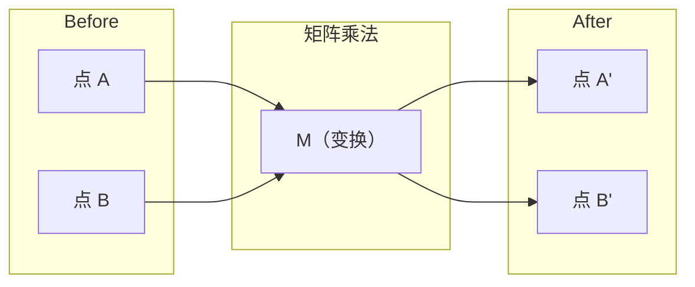
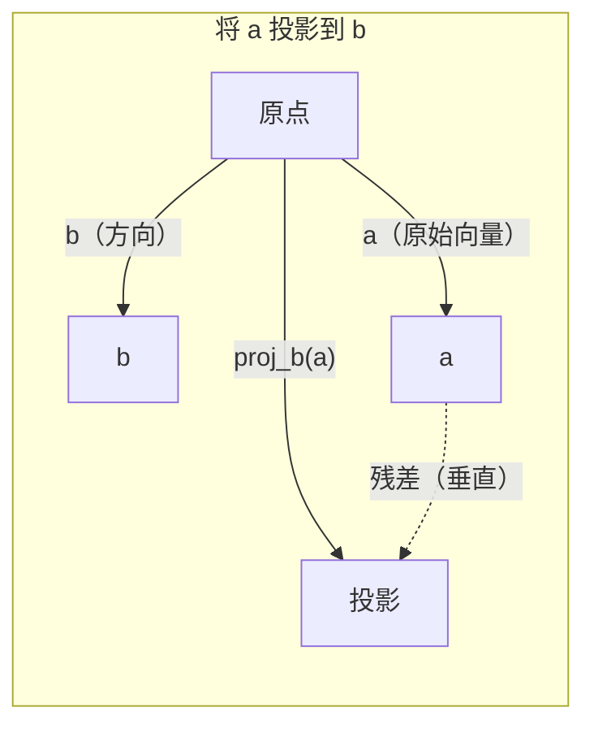

# 线性代数直觉

> 每个 AI 模型都在做矩阵运算，只是披上了更花哨的外衣。

**类型：** 学习
**学习实现：** Python
**前置课程：** Phase 0
**预计时间：** 约 60 分钟

## 学习目标

- 用 Python 从零实现向量与矩阵操作，包括加法、点积和矩阵乘法
- 从几何角度解释点积、投影与 Gram-Schmidt 过程
- 用行化简判断一组向量的线性无关性、秩和基
- 把线性代数概念连到 AI 中的嵌入（embedding）、注意力分数和 LoRA

## 问题

打开一篇机器学习论文，第一页通常就会出现向量、矩阵、点积和变换。缺少线性代数直觉时，它们只是符号；建立直觉后，你会看到神经网络在空间中怎样移动点。

你不必先成为数学家。先看清这些操作的几何含义，再亲手把它们写出来。

## 概念

### 向量既是点，也是方向 <!-- learning-atlas: vectors-are-points-and-directions -->

向量是一列数字。这些数字给出空间中的坐标。

**二维向量 `[3, 2]`：**

| x | y | 点 |
|---|---|---|
| 3 | 2 | 向量在平面上从原点 `(0, 0)` 指向 `(3, 2)` |

它的模长为 `sqrt(3^2 + 2^2) = sqrt(13)`，方向朝右上方。

在 AI 中，向量可以表示许多对象：

- 一个词 → 由 768 个数字构成的向量，即它在嵌入空间中的“含义”
- 一张图像 → 由数百万个像素值构成的向量
- 一个用户 → 偏好构成的向量

### 矩阵是变换 <!-- learning-atlas: matrices-are-transformations -->

矩阵把一个向量变成另一个向量。它可以旋转、缩放、拉伸或投影。



在 AI 中，矩阵就是模型的一部分：

- 神经网络权重 → 把输入变成输出的矩阵
- 注意力分数 → 决定模型关注什么的矩阵
- 嵌入 → 把词映射为向量的矩阵

### 点积衡量相似度 <!-- learning-atlas: the-dot-product-measures-similarity -->

两个向量的点积能反映它们的方向有多接近。

```text
a · b = a₁×b₁ + a₂×b₂ + ... + aₙ×bₙ

同向：        a · b > 0  （相似）
垂直：        a · b = 0  （无关）
反向：        a · b < 0  （不相似）
```

搜索引擎、推荐系统和 RAG 都会寻找点积较高的向量。

### 线性无关

若一组向量中没有任何一个能由其余向量线性组合得到，这组向量就线性无关。若 `v1`、`v2`、`v3` 线性无关，它们张成三维空间；若其中一个由其余向量组合而成，它们只张成一个平面。

这对 AI 很重要：特征矩阵的列应尽量线性无关。两项特征若完全相关，也就是线性相关，模型无法区分它们各自的影响。在线性回归中，这会造成多重共线性，让权重矩阵变得不稳定；很小的输入变化也可能带来很大的输出波动。

**具体例子：**

```text
v1 = [1, 0, 0]
v2 = [0, 1, 0]
v3 = [2, 1, 0]   # v3 = 2*v1 + v2
```

`v1` 和 `v2` 线性无关，二者都不是对方的标量倍数或线性组合。但 `v3 = 2*v1 + v2`，因此 `{v1, v2, v3}` 线性相关。三个向量都落在 `xy` 平面上；无论怎样组合，你都到不了 `[0, 0, 1]`。它们有三个向量，却只有两个自由方向。

在数据集中，若 `feature_3 = 2*feature_1 + feature_2`，加入 `feature_3` 不会带来新信息，还会让正规方程奇异，权重没有唯一解。

### 基与秩

基是一组能张成整个空间的最小线性无关向量集。基向量的数量就是空间的维数。

三维空间的一组标准基为 `{[1,0,0], [0,1,0], [0,0,1]}`。任意三个线性无关的三维向量都能构成一组基。选择哪组基，就是选择哪套坐标系。

矩阵的秩等于线性无关列的数量，也等于线性无关行的数量。当 `rank < min(rows, cols)` 时，矩阵秩亏，意味着：

- 系统有无穷多个解，或没有解
- 变换丢失了信息
- 矩阵不可逆

| 情形 | 秩 | 对机器学习的含义 |
|---|---|---|
| 满秩（`rank = min(m, n)`） | 可能的最大值 | 最小二乘问题有唯一解，模型条件良好。 |
| 秩亏（`rank < min(m, n)`） | 小于最大值 | 特征冗余，权重有无穷多组解，需要正则化。 |
| 秩 1 | 1 | 每一列都是同一向量的缩放副本，所有数据都落在一条线上。 |
| 近似秩亏（奇异值很小） | 数值上偏低 | 矩阵病态，微小的输入噪声会带来很大的输出变化，可使用 SVD 截断或岭回归。 |

### 投影

把向量 **a** 投影到向量 **b** 上，得到的是 **a** 在 **b** 方向上的分量：

```text
proj_b(a) = (a dot b / b dot b) * b
```

残差 `(a - proj_b(a))` 与 `b` 垂直。这种正交分解是最小二乘拟合的基础。

投影在机器学习中随处可见：

- 线性回归把观测值投到列空间上，解就是这个投影
- PCA 把数据投到方差最大的方向上
- Transformer 注意力把查询投到键上



**例子：** `a = [3, 4]`，`b = [1, 0]`

`proj_b(a) = (3*1 + 4*0) / (1*1 + 0*0) * [1, 0] = 3 * [1, 0] = [3, 0]`

投影去掉了 `y` 分量。这是最简单的降维：舍去你暂时不关心的方向。

### Gram-Schmidt 过程

Gram-Schmidt 过程把任意一组线性无关向量转成一组标准正交基。标准正交意味着每个向量的长度都是 1，任意两个向量都互相垂直。

算法如下：

1. 取第一个向量，将它归一化。
2. 取第二个向量，减去它在第一个向量上的投影，再归一化。
3. 取第三个向量，减去它在之前所有向量上的投影，再归一化。
4. 对其余向量重复这个过程。

```text
输入：v1, v2, v3, ...（线性无关）

u1 = v1 / |v1|

w2 = v2 - (v2 dot u1) * u1
u2 = w2 / |w2|

w3 = v3 - (v3 dot u1) * u1 - (v3 dot u2) * u2
u3 = w3 / |w3|

输出：u1, u2, u3, ...（标准正交基）
```

QR 分解内部就使用了这个过程。`Q` 是标准正交基，`R` 保存投影系数。QR 分解可用于：

- 求解线性方程组，比高斯消元更稳定
- 计算特征值，即 QR 算法
- 最小二乘回归的数值求解

```figure
eigen-directions
```

## 动手实现

### 步骤 1：从零实现向量（Python）

```python
class Vector:
    def __init__(self, components):
        self.components = list(components)
        self.dim = len(self.components)

    def __add__(self, other):
        return Vector([a + b for a, b in zip(self.components, other.components)])

    def __sub__(self, other):
        return Vector([a - b for a, b in zip(self.components, other.components)])

    def dot(self, other):
        return sum(a * b for a, b in zip(self.components, other.components))

    def magnitude(self):
        return sum(x**2 for x in self.components) ** 0.5

    def normalize(self):
        mag = self.magnitude()
        return Vector([x / mag for x in self.components])

    def cosine_similarity(self, other):
        return self.dot(other) / (self.magnitude() * other.magnitude())

    def __repr__(self):
        return f"Vector({self.components})"


a = Vector([1, 2, 3])
b = Vector([4, 5, 6])

print(f"a + b = {a + b}")
print(f"a · b = {a.dot(b)}")
print(f"|a| = {a.magnitude():.4f}")
print(f"cosine similarity = {a.cosine_similarity(b):.4f}")
```

### 步骤 2：从零实现矩阵（Python）

```python
class Matrix:
    def __init__(self, rows):
        self.rows = [list(row) for row in rows]
        self.shape = (len(self.rows), len(self.rows[0]))

    def __matmul__(self, other):
        if isinstance(other, Vector):
            return Vector([
                sum(self.rows[i][j] * other.components[j] for j in range(self.shape[1]))
                for i in range(self.shape[0])
            ])
        rows = []
        for i in range(self.shape[0]):
            row = []
            for j in range(other.shape[1]):
                row.append(sum(
                    self.rows[i][k] * other.rows[k][j]
                    for k in range(self.shape[1])
                ))
            rows.append(row)
        return Matrix(rows)

    def transpose(self):
        return Matrix([
            [self.rows[j][i] for j in range(self.shape[0])]
            for i in range(self.shape[1])
        ])

    def __repr__(self):
        return f"Matrix({self.rows})"


rotation_90 = Matrix([[0, -1], [1, 0]])
point = Vector([3, 1])

rotated = rotation_90 @ point
print(f"Original: {point}")
print(f"Rotated 90°: {rotated}")
```

### 步骤 3：它与 AI 有什么关系

```python
import random

random.seed(42)
weights = Matrix([[random.gauss(0, 0.1) for _ in range(3)] for _ in range(2)])
input_vector = Vector([1.0, 0.5, -0.3])

output = weights @ input_vector
print(f"Input (3D): {input_vector}")
print(f"Output (2D): {output}")
print("This is what a neural network layer does -- matrix multiplication.")
```

### 步骤 4：Julia 版本

<!-- learning-atlas: upstream-non-python omitted=julia -->

本项目采用 Python-first 实作策略，因此不维护这一段 Julia 版本；可在锁定版本的[原始课程对应位置](https://github.com/huangyue12120/ai-engineering-from-scratch/blob/7157ca74a135fad2165f680ec4b4e592f075ec21/phases/01-math-foundations/01-linear-algebra-intuition/docs/en.md#step-4-julia-version)查看向量加法、点积与矩阵—向量乘法的 Julia 写法。

### 步骤 5：从零实现线性无关性和投影（Python）

```python
def is_linearly_independent(vectors):
    n = len(vectors)
    dim = len(vectors[0].components)
    mat = Matrix([v.components[:] for v in vectors])
    rows = [row[:] for row in mat.rows]
    rank = 0
    for col in range(dim):
        pivot = None
        for row in range(rank, len(rows)):
            if abs(rows[row][col]) > 1e-10:
                pivot = row
                break
        if pivot is None:
            continue
        rows["rank"], rows[pivot] = rows[pivot], rows[rank]
        scale = rows[rank][col]
        rows["rank"] = [x / scale for x in rows[rank]]
        for row in range(len(rows)):
            if row != rank and abs(rows[row][col]) > 1e-10:
                factor = rows[row][col]
                rows["row"] = [rows[row][j] - factor * rows[rank][j] for j in range(dim)]
        rank += 1
    return rank == n


def project(a, b):
    scalar = a.dot(b) / b.dot(b)
    return Vector([scalar * x for x in b.components])


def gram_schmidt(vectors):
    orthonormal = []
    for v in vectors:
        w = v
        for u in orthonormal:
            proj = project(w, u)
            w = w - proj
        if w.magnitude() < 1e-10:
            continue
        orthonormal.append(w.normalize())
    return orthonormal


v1 = Vector([1, 0, 0])
v2 = Vector([1, 1, 0])
v3 = Vector([1, 1, 1])
basis = gram_schmidt([v1, v2, v3])
for i, u in enumerate(basis):
    print(f"u{i+1} = {u}")
    print(f"  |u{i+1}| = {u.magnitude():.6f}")

print(f"u1 · u2 = {basis[0].dot(basis[1]):.6f}")
print(f"u1 · u3 = {basis[0].dot(basis[2]):.6f}")
print(f"u2 · u3 = {basis[1].dot(basis[2]):.6f}")
```

## 延伸实践：在工具中使用

现在用 NumPy 完成同样的操作。这也是你在实践中更常使用的写法：

```python
import numpy as np

a = np.array([1, 2, 3], dtype=float)
b = np.array([4, 5, 6], dtype=float)

print(f"a + b = {a + b}")
print(f"a · b = {np.dot(a, b)}")
print(f"|a| = {np.linalg.norm(a):.4f}")
print(f"cosine = {np.dot(a, b) / (np.linalg.norm(a) * np.linalg.norm(b)):.4f}")

W = np.random.randn(2, 3) * 0.1
x = np.array([1.0, 0.5, -0.3])
print(f"Wx = {W @ x}")
```

### 用 NumPy 求秩、投影和 QR 分解

```python
import numpy as np

A = np.array([[1, 2], [2, 4]])
print(f"Rank: {np.linalg.matrix_rank(A)}")

a = np.array([3, 4])
b = np.array([1, 0])
proj = (np.dot(a, b) / np.dot(b, b)) * b
print(f"Projection of {a} onto {b}: {proj}")

Q, R = np.linalg.qr(np.random.randn(3, 3))
print(f"Q is orthogonal: {np.allclose(Q @ Q.T, np.eye(3))}")
print(f"R is upper triangular: {np.allclose(R, np.triu(R))}")
```

### PyTorch：带自动微分的张量也是向量

```python
import torch

x = torch.randn(3, requires_grad=True)
y = torch.tensor([1.0, 0.0, 0.0])

similarity = torch.dot(x, y)
similarity.backward()

print(f"x = {x.data}")
print(f"y = {y.data}")
print(f"dot product = {similarity.item():.4f}")
print(f"d(dot)/dx = {x.grad}")
```

点积对 `x` 的梯度就是 `y`。PyTorch 自动完成了这一步。神经网络的每一步都由这类操作构成，包括矩阵乘法、点积和投影；自动微分会沿着这些操作追踪梯度。

你刚刚从零实现了 NumPy 用一行就能完成的部分操作。现在你知道这行代码背后做了什么。

## 产出

本课产出：

- `outputs/prompt-linear-algebra-tutor.md`：用于让 AI 助手以几何直觉教授线性代数的提示词

## 延伸理解：概念在 AI 中的位置

本课中的每个概念都能在现代 AI 中找到对应位置：

| 概念 | 出现场景 |
|---|---|
| 点积 | Transformer 的注意力分数、RAG 中的余弦相似度 |
| 矩阵乘法 | 每个神经网络层、每次线性变换 |
| 线性无关 | 特征选择、避免多重共线性 |
| 秩 | 判断系统能否求解、LoRA 的低秩适配 |
| 投影 | 线性回归中的列空间投影、PCA |
| Gram-Schmidt / QR | 数值求解器、特征值计算 |
| 标准正交基 | 稳定的数值计算、白化变换 |

LoRA 值得单独说明。它把权重更新分解为低秩矩阵，从而微调大语言模型。更新一个 `4096x4096` 的权重矩阵需要处理约 1600 万个参数；LoRA 则更新大小为 `4096x16` 与 `16x4096` 的两个矩阵，共约 13.1 万个参数。秩为 16 的约束假设权重更新位于完整 4096 维空间的一个 16 维子空间中。这里的效率来自明确的线性代数结构。

## 练习

1. 实现 `Vector.angle_between(other)`，返回两个向量夹角的角度值。
2. 创建一个二维缩放矩阵，让 `x` 坐标变为两倍、`y` 坐标变为三倍，并将它作用于向量 `[1, 1]`。
3. 给定 5 个维度为 50 的随机“词向量”，用余弦相似度找出最相似的一对。
4. 验证 Gram-Schmidt 的输出确实标准正交：检查每一对向量的点积是否为 0，以及每个向量的模长是否为 1。
5. 创建一个秩为 2 的 `3x3` 矩阵。用 `rank()` 方法验证，再解释这些列张成什么几何对象。
6. 将向量 `[1, 2, 3]` 投影到 `[1, 1, 1]` 上。结果在几何上表示什么？

## 术语表

| 术语 | 常见说法 | 准确含义 |
|---|---|---|
| 向量 | “一支箭” | 在 n 维空间中表示点或方向的一列数字。 |
| 矩阵 | “数字表格” | 把向量从一个空间映射到另一个空间的变换。 |
| 点积 | “相乘后求和” | 衡量两个向量方向对齐程度的量，是相似度搜索的核心。 |
| 嵌入 | “某种 AI 魔法” | 表示词、图像或用户等对象含义的向量。 |
| 线性无关 | “它们不重叠” | 一组向量中没有任何一个能由其余向量线性组合得到。 |
| 秩 | “有多少维” | 线性无关列或行的数量。 |
| 投影 | “影子” | 一个向量在另一个向量方向上的分量。 |
| 基 | “坐标轴” | 能张成空间的最小线性无关向量集。 |
| 标准正交 | “垂直的单位向量” | 彼此垂直且每个长度为 1 的向量。 |
