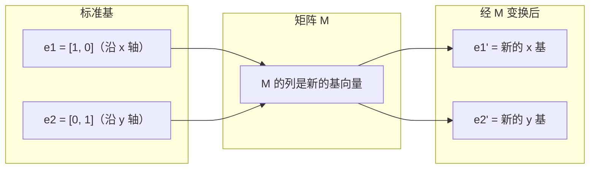
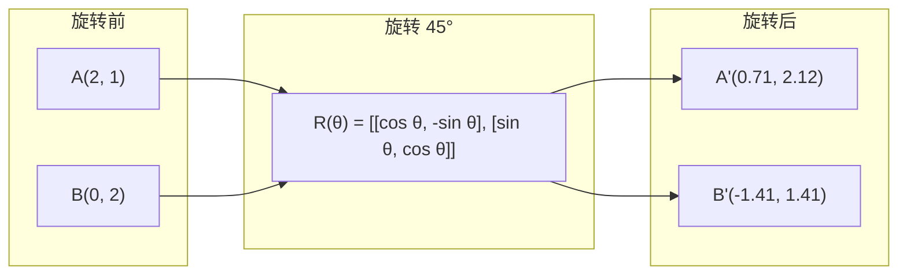
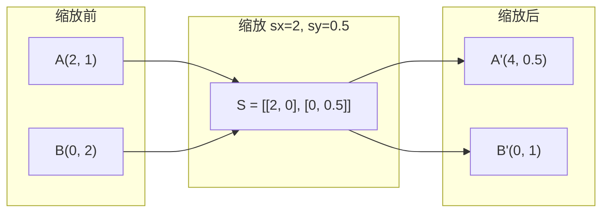
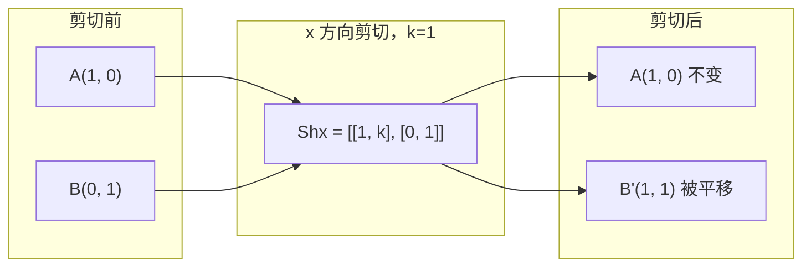
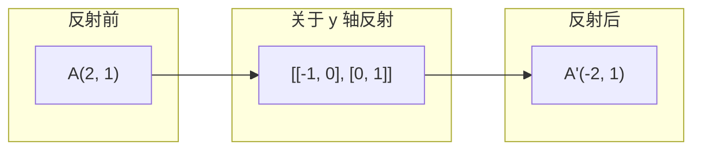
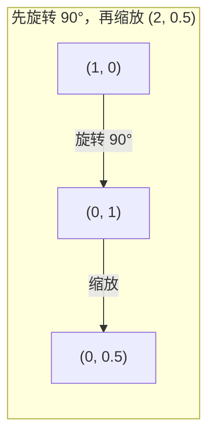
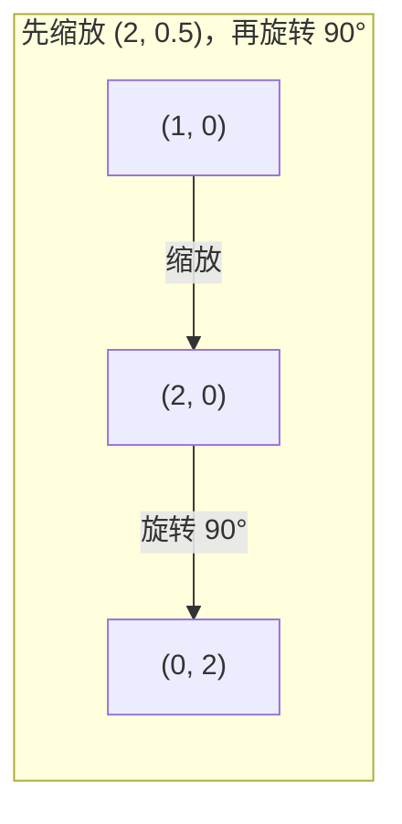

# 矩阵变换

> 矩阵是一台重塑空间的机器。理解它如何作用于每个点，就理解了整个变换。

**类型：** 实作
**学习实现：** Python（上游另有 Julia 版本，可由原文追溯）
**前置课程：** Phase 1 · 第 01–02 课「线性代数直觉」「向量、矩阵与运算」
**预计学习：** 约 75 分钟

## 学习目标

- 构造旋转、缩放、剪切和反射矩阵，并应用到二维、三维点
- 用矩阵乘法复合多个变换，并验证顺序的重要性
- 由特征方程计算 2×2 矩阵的特征值和特征向量
- 说明特征值如何决定 PCA 方向、RNN 稳定性和谱聚类行为

## 问题

阅读 PCA 时会遇到“求协方差矩阵的特征向量”；阅读模型稳定性时会遇到“检查所有特征值的模是否小于 1”；数据增强会要求“应用随机旋转”。这些结论的共同基础是矩阵如何在几何上改变空间。

矩阵不是单纯的数字网格，而是空间机器：旋转矩阵转动点，缩放矩阵拉伸点，剪切矩阵倾斜点。神经网络应用给数据的每个变换，都是这些操作或其复合。

## 概念

### 变换就是矩阵 <!-- learning-atlas: transformations-as-matrices -->

每个二维线性变换都可写成 2×2 矩阵。矩阵的两列精确给出标准基 `[1, 0]` 和 `[0, 1]` 的去向；其他向量都是这两个基向量的线性组合，因此结果随之确定。



### 旋转

二维旋转 θ 保持距离和夹角，并让每个点沿圆弧移动：`R(θ) = [[cos θ, -sin θ], [sin θ, cos θ]]`。



三维旋转围绕一个轴进行。绕 z 轴时 x-y 平面转动而 z 不变；绕 x、y 轴同理：

```text
Rz(theta) = | cos  -sin  0 |     绕 z 轴旋转
            | sin   cos  0 |
            |  0     0   1 |

Rx(theta) = | 1   0     0    |   绕 x 轴旋转
            | 0  cos  -sin   |
            | 0  sin   cos   |

Ry(theta) = |  cos  0  sin |     绕 y 轴旋转
            |   0   1   0  |
            | -sin  0  cos |
```

### 缩放

缩放沿各轴独立拉伸或压缩。



### 剪切

剪切固定一个轴而倾斜另一个轴，会把矩形变成平行四边形。`Shx = [[1, k], [0, 1]]` 使 x 增加 `k * y`，`Shy = [[1, 0], [k, 1]]` 使 y 增加 `k * x`。



### 反射

反射使点关于一条轴或直线镜像。关于 y 轴的矩阵为 `[[-1, 0], [0, 1]]`，关于 x 轴的矩阵为 `[[1, 0], [0, -1]]`。



### 复合：串联变换 <!-- learning-atlas: composition-chaining-transformations -->

先应用 A、再应用 B，等价于 `result = B @ A @ point`。顺序不可交换：先将 `(1, 0)` 旋转 90° 再按 `(2, 0.5)` 缩放，得到 `(0, 0.5)`；先缩放再旋转，得到 `(0, 2)`。



`S @ R = [[0, -2], [0.5, 0]]`



`R @ S = [[0, -0.5], [2, 0]]`

结果不同：矩阵乘法不可交换。

### 特征值与特征向量 <!-- learning-atlas: eigenvalues-and-eigenvectors -->

大多数向量经过矩阵会改变方向；特征向量是例外，矩阵只缩放它，缩放因子就是特征值：

```text
A @ v = lambda * v

v 是特征向量（保持不变的方向）
lambda 是特征值（沿该方向的缩放倍数）

A = [[2, 1], [1, 2]]
A @ [1, 1] = [3, 3] = 3 * [1, 1]
A @ [1, -1] = [1, -1] = 1 * [1, -1]
```

矩阵会在 `[1, 1]` 方向拉伸 3 倍、在 `[1, -1]` 方向保持不变；其他方向都是这两个方向的混合。

### 特征分解

若矩阵有 n 个线性无关特征向量，就能写成：

```text
A = V @ D @ V^(-1)

V = 列为特征向量的矩阵
D = 特征值构成的对角矩阵
V^(-1) = V 的逆
```

这表示：先转到特征向量坐标，再沿各轴缩放，最后转回。

### 特征值为何重要

PCA 取协方差矩阵的特征向量为主成分，特征值表示各主成分捕获的方差；RNN 和动力系统中，模大于 1 的特征值导致爆炸、模小于 1 的导致消失；图神经网络和谱聚类从图矩阵或 Laplacian 的特征向量读取结构。

### 行列式是体积缩放因子

行列式说明变换把二维面积或三维体积缩放多少：`det = 1` 保持面积（旋转），`det = 2` 使面积加倍，`det = 0` 将空间压到低维，`det = -1` 保持面积但翻转方向。旋转的行列式恒为 1，缩放为 `sx * sy`，剪切为 1，反射为 -1。

```text
| det(Rotation) | = 1
| det(Scale sx, sy) | = sx * sy
| det(Shear) | = 1
| det(Reflection) | = -1
```

```figure
matrix-transform
```

> **构建说明：**

在 Python 工作区运行 `transformations.py`，再从零实现 `rotation_2d`、`scaling_2d`、`shearing_2d`、`reflection_x`、`reflection_y`、矩阵乘向量与矩阵乘法。用 `R = rotation_2d(math.pi / 2)` 和 `S = scaling_2d(2, 0.5)` 比较 `mat_mul(S, R)` 与 `mat_mul(R, S)`。

对 `[[a, b], [c, d]]`，特征值满足 `lambda^2 - (a+d)*lambda + (ad - bc) = 0`。实现 `eigenvalues_2x2` 和 `eigenvector_2x2` 后，以 `[[2, 1], [1, 2]]` 验证 `A @ v` 与 `lambda * v` 相同。最后实现 `det_2x2`，比较旋转、缩放、剪切、反射及奇异矩阵的行列式。

> **工具说明：**

NumPy 的 `R @ point` 执行矩阵乘向量，`np.linalg.eig(A)` 返回特征值和按列存储的特征向量，`np.linalg.det` 计算行列式。用 `V @ D @ np.linalg.inv(V)` 重构 `B = [[3, 1], [0, 2]]`，并以 `rotation_3d_z(np.pi / 2)`、`rotation_3d_x(np.pi / 2)` 旋转三维点 `[1, 0, 0]`。

> **产出说明：**

本课为 PCA（Phase 2）和神经网络权重分析建立几何基础。这里的特征值/特征向量代码，正是生产 ML 系统中降维、谱聚类和稳定性分析所用算法的核心。

> **练习预览：**

1. 将旋转、缩放和剪切应用到单位正方形（角点 `[0,0]`、`[1,0]`、`[1,1]`、`[0,1]`），打印变换后的角点，并验证旋转保留角点间距离。
2. 用特征方程手算 `[[4, 2], [1, 3]]` 的特征值，再用从零函数和 NumPy 验证。
3. 复合旋转 30°、缩放 `[1.5, 0.8]`、剪切 `kx=0.3`，应用到圆周上的 8 个点；验证复合矩阵行列式等于各行列式乘积。

> **术语预览：**

| 术语 | 实际含义 |
|---|---|
| 旋转矩阵 | 保留距离和角度的正交矩阵；行列式恒为 1。 |
| 缩放矩阵 | 沿每轴独立拉伸或压缩的对角矩阵。 |
| 剪切矩阵 | 按另一坐标比例偏移一个坐标，使矩形变平行四边形。 |
| 反射 | 关于轴或平面翻转空间的矩阵；行列式为 -1。 |
| 复合 | 用矩阵乘法串联变换；`B @ A` 表示先 A 后 B。 |
| 特征向量 | 矩阵只缩放、不旋转的方向。 |
| 特征值 | 缩放相应特征向量的标量，可为负或复数。 |
| 特征分解 | `V @ D @ V^(-1)`，分离基本方向和缩放幅度。 |
| 行列式 | 变换缩放面积或体积的倍数；为零表示不可逆。 |
| 特征方程 | `det(A - lambda * I) = 0`，其根为特征值。 |

> **阅读资料预览：**

- 锁定版本的上游课程：`phases/01-math-foundations/03-matrix-transformations/docs/en.md`
- [3Blue1Brown：线性变换](https://www.3blue1brown.com/lessons/linear-transformations)
- [3Blue1Brown：特征向量与特征值](https://www.3blue1brown.com/lessons/eigenvalues)
- [MIT 18.06 Lecture 21：Eigenvalues and Eigenvectors](https://ocw.mit.edu/courses/18-06-linear-algebra-spring-2010/)

## 动手实现

以下代码按原文构建顺序组织；每段都可在前一段的定义基础上运行。

### 步骤 1：从零构建变换矩阵（Python）

```python
import math

def rotation_2d(theta):
    c, s = math.cos(theta), math.sin(theta)
    return [[c, -s], [s, c]]

def scaling_2d(sx, sy):
    return [[sx, 0], [0, sy]]

def shearing_2d(kx, ky):
    return [[1, kx], [ky, 1]]

def reflection_x():
    return [[1, 0], [0, -1]]

def reflection_y():
    return [[-1, 0], [0, 1]]

def mat_vec_mul(matrix, vector):
    return [
        sum(matrix[i][j] * vector[j] for j in range(len(vector)))
        for i in range(len(matrix))
    ]

def mat_mul(a, b):
    rows_a, cols_b = len(a), len(b[0])
    cols_a = len(a[0])
    return [
        [sum(a[i][k] * b[k][j] for k in range(cols_a)) for j in range(cols_b)]
        for i in range(rows_a)
    ]

point = [1.0, 0.0]
angle = math.pi / 4

rotated = mat_vec_mul(rotation_2d(angle), point)
print(f"Rotate (1,0) by 45 deg: ({rotated[0]:.4f}, {rotated[1]:.4f})")

scaled = mat_vec_mul(scaling_2d(2, 3), [1.0, 1.0])
print(f"Scale (1,1) by (2,3): ({scaled[0]:.1f}, {scaled[1]:.1f})")

sheared = mat_vec_mul(shearing_2d(1, 0), [1.0, 1.0])
print(f"Shear (1,1) kx=1: ({sheared[0]:.1f}, {sheared[1]:.1f})")

reflected = mat_vec_mul(reflection_y(), [2.0, 1.0])
print(f"Reflect (2,1) across y: ({reflected[0]:.1f}, {reflected[1]:.1f})")
```

### 步骤 2：复合变换

```python
R = rotation_2d(math.pi / 2)
S = scaling_2d(2, 0.5)

rotate_then_scale = mat_mul(S, R)
scale_then_rotate = mat_mul(R, S)

point = [1.0, 0.0]
result1 = mat_vec_mul(rotate_then_scale, point)
result2 = mat_vec_mul(scale_then_rotate, point)

print(f"Rotate 90 then scale: ({result1[0]:.2f}, {result1[1]:.2f})")
print(f"Scale then rotate 90: ({result2[0]:.2f}, {result2[1]:.2f})")
print(f"Same? {result1 == result2}")
```

### 步骤 3：从零计算特征值（2×2）

```python
def eigenvalues_2x2(matrix):
    a, b = matrix[0]
    c, d = matrix[1]
    trace = a + d
    det = a * d - b * c
    discriminant = trace ** 2 - 4 * det
    if discriminant < 0:
        real = trace / 2
        imag = (-discriminant) ** 0.5 / 2
        return (complex(real, imag), complex(real, -imag))
    sqrt_disc = discriminant ** 0.5
    return ((trace + sqrt_disc) / 2, (trace - sqrt_disc) / 2)

def eigenvector_2x2(matrix, eigenvalue):
    a, b = matrix[0]
    c, d = matrix[1]
    if abs(b) > 1e-10:
        v = [b, eigenvalue - a]
    elif abs(c) > 1e-10:
        v = [eigenvalue - d, c]
    else:
        if abs(a - eigenvalue) < 1e-10:
            v = [1, 0]
        else:
            v = [0, 1]
    mag = (v[0] ** 2 + v[1] ** 2) ** 0.5
    return [v[0] / mag, v[1] / mag]

A = [[2, 1], [1, 2]]
vals = eigenvalues_2x2(A)
print(f"Matrix: {A}")
print(f"Eigenvalues: {vals[0]:.4f}, {vals[1]:.4f}")

for val in vals:
    vec = eigenvector_2x2(A, val)
    result = mat_vec_mul(A, vec)
    scaled = [val * vec[0], val * vec[1]]
    print(f"  lambda={val:.1f}, v={[round(x,4) for x in vec]}")
    print(f"    A@v = {[round(x,4) for x in result]}")
    print(f"    l*v = {[round(x,4) for x in scaled]}")
```

### 步骤 4：以行列式表示体积缩放

```python
def det_2x2(matrix):
    return matrix[0][0] * matrix[1][1] - matrix[0][1] * matrix[1][0]

print(f"det(rotation 45) = {det_2x2(rotation_2d(math.pi/4)):.4f}")
print(f"det(scale 2,3)   = {det_2x2(scaling_2d(2, 3)):.1f}")
print(f"det(shear kx=1)  = {det_2x2(shearing_2d(1, 0)):.1f}")
print(f"det(reflect y)   = {det_2x2(reflection_y()):.1f}")

singular = [[1, 2], [2, 4]]
print(f"det(singular)     = {det_2x2(singular):.1f}")
print("Singular: columns are proportional, space collapses to a line.")
```

## 使用库

NumPy 以优化过的例程完成相同操作。

```python
import numpy as np

theta = np.pi / 4
R = np.array([[np.cos(theta), -np.sin(theta)],
              [np.sin(theta),  np.cos(theta)]])

point = np.array([1.0, 0.0])
print(f"Rotate (1,0) by 45 deg: {R @ point}")

S = np.diag([2.0, 3.0])
composed = S @ R
print(f"Scale(2,3) after Rotate(45): {composed @ point}")

A = np.array([[2, 1], [1, 2]], dtype=float)
eigenvalues, eigenvectors = np.linalg.eig(A)
print(f"\nEigenvalues: {eigenvalues}")
print(f"Eigenvectors (columns):\n{eigenvectors}")

for i in range(len(eigenvalues)):
    v = eigenvectors[:, i]
    lam = eigenvalues[i]
    print(f"  A @ v{i} = {A @ v}, lambda * v{i} = {lam * v}")

print(f"\ndet(R) = {np.linalg.det(R):.4f}")
print(f"det(S) = {np.linalg.det(S):.1f}")

B = np.array([[3, 1], [0, 2]], dtype=float)
vals, vecs = np.linalg.eig(B)
D = np.diag(vals)
V = vecs
reconstructed = V @ D @ np.linalg.inv(V)
print(f"\nEigendecomposition A = V @ D @ V^-1:")
print(f"Original:\n{B}")
print(f"Reconstructed:\n{reconstructed}")
```

### 用 NumPy 做三维旋转

```python
def rotation_3d_z(theta):
    c, s = np.cos(theta), np.sin(theta)
    return np.array([[c, -s, 0], [s, c, 0], [0, 0, 1]])

def rotation_3d_x(theta):
    c, s = np.cos(theta), np.sin(theta)
    return np.array([[1, 0, 0], [0, c, -s], [0, s, c]])

point_3d = np.array([1.0, 0.0, 0.0])
rotated_z = rotation_3d_z(np.pi / 2) @ point_3d
rotated_x = rotation_3d_x(np.pi / 2) @ point_3d

print(f"\n3D point: {point_3d}")
print(f"Rotate 90 around z: {np.round(rotated_z, 4)}")
print(f"Rotate 90 around x: {np.round(rotated_x, 4)}")
```

## 交付物

本课为 PCA（Phase 2）和神经网络权重分析建立几何基础。这里的特征值/特征向量代码，正是生产 ML 系统中降维、谱聚类和稳定性分析所用算法的核心。

## 练习

1. 将旋转、缩放和剪切应用到单位正方形（角点 `[0,0]`、`[1,0]`、`[1,1]`、`[0,1]`），打印变换后的角点，并验证旋转保留角点间距离。
2. 用特征方程手算 `[[4, 2], [1, 3]]` 的特征值，再用从零函数和 NumPy 验证。
3. 复合旋转 30°、缩放 `[1.5, 0.8]`、剪切 `kx=0.3`，应用到圆周上的 8 个点；验证复合矩阵行列式等于各行列式乘积。

## 术语

| 术语 | 实际含义 |
|---|---|
| 旋转矩阵 | 保留距离和角度的正交矩阵；行列式恒为 1。 |
| 缩放矩阵 | 沿每轴独立拉伸或压缩的对角矩阵。 |
| 剪切矩阵 | 按另一坐标比例偏移一个坐标，使矩形变平行四边形。 |
| 反射 | 关于轴或平面翻转空间的矩阵；行列式为 -1。 |
| 复合 | 用矩阵乘法串联变换；`B @ A` 表示先 A 后 B。 |
| 特征向量 | 矩阵只缩放、不旋转的方向。 |
| 特征值 | 缩放相应特征向量的标量，可为负或复数。 |
| 特征分解 | `V @ D @ V^(-1)`，分离基本方向和缩放幅度。 |
| 行列式 | 变换缩放面积或体积的倍数；为零表示不可逆。 |
| 特征方程 | `det(A - lambda * I) = 0`，其根为特征值。 |

## 原文与补充阅读

- [3Blue1Brown：线性变换](https://www.3blue1brown.com/lessons/linear-transformations)
- [3Blue1Brown：特征向量与特征值](https://www.3blue1brown.com/lessons/eigenvalues)
- [MIT 18.06 Lecture 21：Eigenvalues and Eigenvectors](https://ocw.mit.edu/courses/18-06-linear-algebra-spring-2010/)
