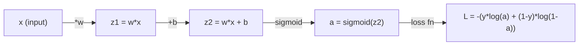
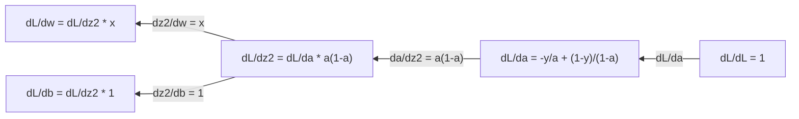
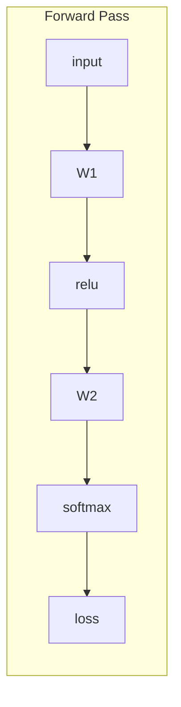
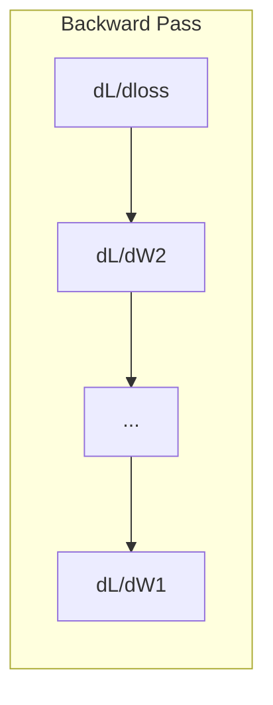

# 机器学习微积分

> 导数给出损失下降的方向，神经网络据此更新参数。

**类型：** 学习
**语言：** Python
**前置课程：** Phase 1，第 01–03 课
**时间：** 约 60 分钟

## 学习目标

- 计算常见机器学习函数（x^2、sigmoid、交叉熵）的数值导数和解析导数
- 从零实现梯度下降，最小化一维和二维损失函数
- 推导线性回归模型的梯度，并通过手动更新权重来训练模型
- 解释 Hessian 矩阵、Taylor 级数近似及其与优化方法的联系

## 问题

你有一个包含数百万个权重的神经网络。每个权重都是一个旋钮。你需要弄清楚每个旋钮该往哪个方向转，才能让模型的错误稍微减少一点。微积分会告诉你这个方向。

没有微积分，训练神经网络就意味着随机尝试各种改动，然后期待结果变好。有了导数，你就能确切知道每个权重如何影响误差。每一次，你都能把每个旋钮转向正确的方向。

## 概念

### 什么是导数？

导数衡量变化率。对于函数 y = f(x)，导数 f'(x) 会告诉你：如果将 x 略微改变一点，y 会变化多少？

从几何上看，导数就是某一点处切线的斜率。

**f(x) = x^2：**

| x | f(x) | f'(x)（斜率） |
|---|------|---------------|
| 0 | 0    | 0（平坦，位于最低点） |
| 1 | 1    | 2 |
| 2 | 4    | 4（该点切线的斜率） |
| 3 | 9    | 6 |

在 x=2 处，斜率是 4。如果将 x 向右移动一个很小的量，y 的增量约为该移动量的 4 倍。在 x=0 处，斜率是 0。此时你位于碗底。

形式化定义如下：

```text
f'(x) = lim   f(x + h) - f(x)
        h->0  -----------------
                     h
```

在代码中，可以跳过求极限的过程，直接使用一个非常小的 h，得到数值导数。

### 偏导数：一次只处理一个变量

实际函数往往有多个输入。神经网络的损失取决于数千个权重。求偏导数时，除一个变量外的所有变量都保持不变，然后对这一个变量求导。

```text
f(x, y) = x^2 + 3xy + y^2

df/dx = 2x + 3y     （将 y 视为常量）
df/dy = 3x + 2y     （将 x 视为常量）
```

每个偏导数回答的问题都是：如果只略微改变这一个权重，损失会如何变化？

### 梯度：所有偏导数组成的向量

梯度把每个偏导数收集到一个向量中。对于函数 f(x, y, z)，梯度为：

```text
grad f = [ df/dx, df/dy, df/dz ]
```

梯度指向最陡上升方向。要最小化一个函数，就向相反方向移动。

**f(x,y) = x^2 + y^2 的等高线图：**

这个函数形成碗状曲面，其等高线是一组同心圆。最小值位于 (0, 0)。

| 点 | grad f | -grad f（下降方向） |
|-------|--------|----------------------------|
| (1, 1) | [2, 2]（指向上坡，远离最小值） | [-2, -2]（指向下坡，靠近最小值） |
| (0, 0) | [0, 0]（平坦，位于最小值） | [0, 0] |

图中的梯度下降过程是：计算梯度，取其相反数，然后迈出一步。

### 与优化的联系

训练神经网络就是做优化。损失函数 L(w1, w2, ..., wn) 衡量模型错得有多严重，而你的目标是将它最小化。

```text
梯度下降更新规则：

  w_new = w_old - learning_rate * dL/dw

对于每个权重：
  1. 计算损失对该权重的偏导数
  2. 从权重中减去该偏导数的一个小倍数
  3. 重复以上步骤
```

学习率控制步长。学习率过大就会越过目标，过小则会缓慢爬行。

**损失曲面（一维切片）：**

当权重 w 变化时，损失函数 L(w) 形成一条包含峰和谷的曲线。

| 特征 | 说明 |
|---------|-------------|
| 全局最小值 | 整条曲线上的最低点——最佳解 |
| 局部最小值 | 比相邻点低、但并非全局最低点的谷底 |
| 斜率 | 梯度下降从任意起点沿斜率向下移动 |

梯度下降沿斜率向下移动。它可能陷入局部最小值，但在拥有数百万个权重的高维空间中，这在实践中很少成为问题。

### 数值导数与解析导数

计算导数有两种方法。

解析方法：手动应用微积分法则。对于 f(x) = x^2，导数是 f'(x) = 2x。结果精确，而且速度快。

数值方法：利用定义进行近似。取一个很小的 h，计算 f(x+h) 和 f(x-h)，再求它们的差。

```text
数值方法（中心差分）：

f'(x) ~= f(x + h) - f(x - h)
          -----------------------
                  2h

实践中 h = 0.0001 的效果很好
```

数值导数较慢，但适用于任何函数。解析导数速度快，但需要你推导出公式。神经网络框架使用第三种方法：自动微分，它以机械化方式计算精确导数。你将在 Phase 3 中看到这种方法。

### 简单函数的手算导数

下面这些导数会在机器学习中反复出现。

```text
函数                 导数                       用途
--------             ----------                 -------
f(x) = x^2           f'(x) = 2x                 损失函数（MSE）
f(x) = wx + b        f'(w) = x                  线性层（对权重的梯度）
                     f'(b) = 1                  线性层（对偏置的梯度）
                     f'(x) = w                  线性层（对输入的梯度）
f(x) = e^x           f'(x) = e^x                Softmax、注意力
f(x) = ln(x)         f'(x) = 1/x                交叉熵损失
f(x) = 1/(1+e^-x)    f'(x) = f(x)(1-f(x))       Sigmoid 激活函数
```

对于 f(x) = x^2：

```text
f(x) = x^2    f'(x) = 2x

  x    f(x)   f'(x)   含义
  -2    4      -4      斜率向左倾斜（递减）
  -1    1      -2      斜率向左倾斜（递减）
   0    0       0      平坦（最小值！）
   1    1       2      斜率向右倾斜（递增）
   2    4       4      斜率向右倾斜（递增）
```

对于 x=3、b=1 时的 f(w) = wx + b：

```text
f(w) = 3w + 1    f'(w) = 3

对 w 的导数就是 x。
如果 x 很大，w 的微小变化会使输出发生很大变化。
```

### 链式法则

当函数复合在一起时，链式法则会告诉你如何求导。

```text
若 y = f(g(x))，则 dy/dx = f'(g(x)) * g'(x)

示例：y = (3x + 1)^2
  外层：f(u) = u^2       f'(u) = 2u
  内层：g(x) = 3x + 1    g'(x) = 3
  dy/dx = 2(3x + 1) * 3 = 6(3x + 1)
```

神经网络是一条函数链：输入 -> 线性层 -> 激活函数 -> 线性层 -> 激活函数 -> 损失。反向传播从输出到输入反复应用链式法则，构成整个算法。

### Hessian 矩阵

梯度告诉你斜率，Hessian 告诉你曲率。

Hessian 是由二阶偏导数组成的矩阵。对于函数 f(x1, x2, ..., xn)，Hessian 的第 (i, j) 个元素为：

```text
H[i][j] = d^2f / (dx_i * dx_j)
```

对于二元函数 f(x, y)：

```text
H = | d^2f/dx^2    d^2f/dxdy |
    | d^2f/dydx    d^2f/dy^2 |
```

**Hessian 在临界点（梯度 = 0）处告诉你的信息：**

| Hessian 的性质 | 含义 | 曲面示例 |
|-----------------|---------|-----------------|
| 正定（所有特征值 > 0） | 局部最小值 | 开口向上的碗 |
| 负定（所有特征值 < 0） | 局部最大值 | 开口向下的碗 |
| 不定（特征值正负混合） | 鞍点 | 马鞍形曲面 |

**示例：** f(x, y) = x^2 - y^2（鞍形函数）

```text
df/dx = 2x       df/dy = -2y
d^2f/dx^2 = 2    d^2f/dy^2 = -2    d^2f/dxdy = 0

H = | 2   0 |
    | 0  -2 |

特征值：2 和 -2（一正一负）
--> (0, 0) 是鞍点
```

再与 f(x, y) = x^2 + y^2（碗形函数）比较：

```text
H = | 2  0 |
    | 0  2 |

特征值：2 和 2（均为正）
--> (0, 0) 是局部最小值
```

**为什么 Hessian 在机器学习中很重要：**

Newton 法使用 Hessian，能采取比梯度下降更好的优化步伐。它不仅沿斜率移动，还会考虑曲率：

```text
Newton 更新：    w_new = w_old - H^(-1) * gradient
梯度下降：       w_new = w_old - lr * gradient
```

Newton 法收敛更快，因为 Hessian 会对梯度进行“重缩放”——在陡峭方向上缩小步长，在平坦方向上增大步长。

问题在于：对于一个有 N 个参数的神经网络，Hessian 是 N x N 矩阵。包含 100 万个参数的模型需要一个拥有 1 万亿个元素的矩阵。因此，我们会使用近似方法。

| 方法 | 使用的信息 | 成本 | 收敛速度 |
|--------|-------------|------|-------------|
| 梯度下降 | 仅使用一阶导数 | 每步 O(N) | 慢（线性） |
| Newton 法 | 完整 Hessian | 每步 O(N^3) | 快（二次） |
| L-BFGS | 根据梯度历史近似 Hessian | 每步 O(N) | 中等（超线性） |
| Adam | 每个参数的自适应学习率（对角 Hessian 近似） | 每步 O(N) | 中等 |
| 自然梯度 | Fisher 信息矩阵（统计 Hessian） | 每步 O(N^2) | 快 |

实践中，Adam 是深度学习的默认优化器。它跟踪每个参数的梯度运行均值和方差，从而以较低成本近似二阶信息。

### Taylor 级数近似

任何光滑函数都可以在局部用多项式近似：

```text
f(x + h) = f(x) + f'(x)*h + (1/2)*f''(x)*h^2 + (1/6)*f'''(x)*h^3 + ...
```

包含的项越多，近似就越好——但只在点 x 附近如此。

**Taylor 级数为什么对机器学习很重要：**

- **一阶 Taylor = 梯度下降。** 使用 f(x + h) ~ f(x) + f'(x)*h 时，你建立的是线性近似。梯度下降通过最小化这个线性模型来选择 h = -lr * f'(x)。

- **二阶 Taylor = Newton 法。** 使用 f(x + h) ~ f(x) + f'(x)*h + (1/2)*f''(x)*h^2 时，你得到一个二次模型。将其最小化可得 h = -f'(x)/f''(x)，得到 Newton 步。

- **损失函数设计。** MSE 和交叉熵都是光滑函数，这意味着它们的 Taylor 展开具有良好性质。这并非巧合。光滑损失使优化过程更加可预测。

```text
近似阶数              捕捉的信息          优化方法
-------------------   -----------------   -------------------
零阶（常数）          仅函数值            随机搜索
一阶（线性）          斜率                梯度下降
二阶（二次）          曲率                Newton 法
更高阶                更精细的结构        很少用于机器学习
```

所有基于梯度的优化都会先在局部近似损失函数，再沿该近似模型下降。

### 机器学习中的积分

导数告诉你变化率。积分计算累积量——也就是曲线下的面积。

在机器学习中，你很少手算积分，但这个概念无处不在：

**概率。** 对于概率密度为 p(x) 的连续随机变量：

```text
P(a < X < b) = 从 a 到 b 对 p(x) dx 积分
```

概率密度曲线在 a 和 b 之间的面积，就是随机变量落入该区间的概率。

**期望值。** 按概率加权后的平均结果：

```text
E[f(X)] = 对 f(x) * p(x) dx 积分
```

数据分布上的期望损失是一个积分。训练过程最小化的是它的经验近似。

**KL 散度。** 衡量两个分布之间的差异：

```text
KL(p || q) = 对 p(x) * log(p(x) / q(x)) dx 积分
```

它用于 VAE、知识蒸馏和贝叶斯推断。

**归一化常数。** 在贝叶斯推断中：

```text
p(w | data) = p(data | w) * p(w) / 对 p(data | w) * p(w) dw 积分
```

分母是对所有可能参数值的积分。它往往难以直接计算，因此我们会采用 MCMC 和变分推断等近似方法。

| 积分概念 | 在机器学习中的应用 |
|-----------------|----------------------|
| 曲线下面积 | 根据概率密度函数计算概率 |
| 期望值 | 损失函数、风险最小化 |
| KL 散度 | VAE、策略优化、蒸馏 |
| 归一化 | 贝叶斯后验、softmax 分母 |
| 边际似然 | 模型比较、证据下界（ELBO） |

### 计算图中的多变量链式法则

链式法则并不只适用于排成一条直线的标量函数。在神经网络中，变量会分支，也会汇合。下面展示导数如何流过一次简单的前向传播：



反向传播从右向左计算梯度：



每条箭头都会乘以局部导数。任意参数的梯度，都是损失到该参数的路径上所有局部导数的乘积。当路径发生分支和汇合时，需要将各条路径的贡献相加，这构成多变量链式法则。

反向传播的全部含义就是：从输出到输入，沿计算图系统地应用链式法则。

### Jacobian 矩阵

当函数把一个向量映射为另一个向量时（例如神经网络层），它的导数是矩阵。Jacobian 包含每个输出相对于每个输入的所有偏导数。

对于 f: R^n -> R^m，Jacobian J 是一个 m x n 矩阵：

| | x1 | x2 | ... | xn |
|---|---|---|---|---|
| f1 | df1/dx1 | df1/dx2 | ... | df1/dxn |
| f2 | df2/dx1 | df2/dx2 | ... | df2/dxn |
| ... | ... | ... | ... | ... |
| fm | dfm/dx1 | dfm/dx2 | ... | dfm/dxn |

你不会为神经网络手算 Jacobian，PyTorch 会处理它。不过，知道 Jacobian 的存在有助于理解反向传播中的形状：如果某一层将 R^n 映射到 R^m，它的 Jacobian 就是 m x n。梯度通过这个矩阵的转置向后传播。

### 这为何对神经网络很重要

神经网络中的每个权重都会得到一个梯度。梯度告诉你该如何调整这个权重，才能减小损失。





每个权重的更新如下：

- `W1 = W1 - lr * dL/dW1`
- `W2 = W2 - lr * dL/dW2`

前向传播计算预测和损失。反向传播计算损失相对于每个权重的梯度。然后，每个权重向下坡方向迈出一小步。重复数百万步，这套过程构成深度学习。

```figure
derivative-tangent
```

## 动手实现

### 步骤 1：从零实现数值导数

```python
def numerical_derivative(f, x, h=1e-7):
    return (f(x + h) - f(x - h)) / (2 * h)

def f(x):
    return x ** 2

for x in [-2, -1, 0, 1, 2]:
    numerical = numerical_derivative(f, x)
    analytical = 2 * x
    print(f"x={x:2d}  f'(x) numerical={numerical:.6f}  analytical={analytical:.1f}")
```

数值导数与解析导数在许多位小数上都一致。

### 步骤 2：偏导数与梯度

```python
def numerical_gradient(f, point, h=1e-7):
    gradient = []
    for i in range(len(point)):
        point_plus = list(point)
        point_minus = list(point)
        point_plus[i] += h
        point_minus[i] -= h
        partial = (f(point_plus) - f(point_minus)) / (2 * h)
        gradient.append(partial)
    return gradient

def f_multi(point):
    x, y = point
    return x**2 + 3*x*y + y**2

grad = numerical_gradient(f_multi, [1.0, 2.0])
print(f"Numerical gradient at (1,2): {[f'{g:.4f}' for g in grad]}")
print(f"Analytical gradient at (1,2): [2*1+3*2, 3*1+2*2] = [{2*1+3*2}, {3*1+2*2}]")
```

### 步骤 3：用梯度下降寻找 f(x) = x^2 的最小值

```python
x = 5.0
lr = 0.1
for step in range(20):
    grad = 2 * x
    x = x - lr * grad
    print(f"step {step:2d}  x={x:8.4f}  f(x)={x**2:10.6f}")
```

从 x=5 开始，每一步都会更接近 x=0，也就是最小值。

### 步骤 4：二维函数上的梯度下降

```python
def f_2d(point):
    x, y = point
    return x**2 + y**2

point = [4.0, 3.0]
lr = 0.1
for step in range(30):
    grad = numerical_gradient(f_2d, point)
    point = [p - lr * g for p, g in zip(point, grad)]
    loss = f_2d(point)
    if step % 5 == 0 or step == 29:
        print(f"step {step:2d}  point=({point[0]:7.4f}, {point[1]:7.4f})  f={loss:.6f}")
```

### 步骤 5：比较数值导数与解析导数

```python
import math

test_functions = [
    ("x^2",      lambda x: x**2,          lambda x: 2*x),
    ("x^3",      lambda x: x**3,          lambda x: 3*x**2),
    ("sin(x)",   lambda x: math.sin(x),   lambda x: math.cos(x)),
    ("e^x",      lambda x: math.exp(x),   lambda x: math.exp(x)),
    ("1/x",      lambda x: 1/x,           lambda x: -1/x**2),
]

x = 2.0
print(f"{'Function':<12} {'Numerical':>12} {'Analytical':>12} {'Error':>12}")
print("-" * 50)
for name, f, df in test_functions:
    num = numerical_derivative(f, x)
    ana = df(x)
    err = abs(num - ana)
    print(f"{name:<12} {num:12.6f} {ana:12.6f} {err:12.2e}")
```

### 步骤 6：数值计算 Hessian

```python
def hessian_2d(f, x, y, h=1e-5):
    fxx = (f(x + h, y) - 2 * f(x, y) + f(x - h, y)) / (h ** 2)
    fyy = (f(x, y + h) - 2 * f(x, y) + f(x, y - h)) / (h ** 2)
    fxy = (f(x + h, y + h) - f(x + h, y - h) - f(x - h, y + h) + f(x - h, y - h)) / (4 * h ** 2)
    return [[fxx, fxy], [fxy, fyy]]

def saddle(x, y):
    return x ** 2 - y ** 2

def bowl(x, y):
    return x ** 2 + y ** 2

H_saddle = hessian_2d(saddle, 0.0, 0.0)
H_bowl = hessian_2d(bowl, 0.0, 0.0)
print(f"Saddle Hessian: {H_saddle}")  # [[2, 0], [0, -2]] -- mixed signs
print(f"Bowl Hessian:   {H_bowl}")    # [[2, 0], [0, 2]]  -- both positive
```

鞍形函数的 Hessian 特征值为 2 和 -2（符号相反，证实该点是鞍点）。碗形函数的 Hessian 特征值为 2 和 2（均为正，证实该点是最小值）。

### 步骤 7：实际使用 Taylor 近似

```python
import math

def taylor_approx(f, f_prime, f_double_prime, x0, h, order=2):
    result = f(x0)
    if order >= 1:
        result += f_prime(x0) * h
    if order >= 2:
        result += 0.5 * f_double_prime(x0) * h ** 2
    return result

x0 = 0.0
for h in [0.1, 0.5, 1.0, 2.0]:
    true_val = math.sin(h)
    t1 = taylor_approx(math.sin, math.cos, lambda x: -math.sin(x), x0, h, order=1)
    t2 = taylor_approx(math.sin, math.cos, lambda x: -math.sin(x), x0, h, order=2)
    print(f"h={h:.1f}  sin(h)={true_val:.4f}  order1={t1:.4f}  order2={t2:.4f}")
```

在 x0=0 附近，sin(x) ~ x（一阶 Taylor 近似）。当 h 很小时，近似非常准确；但 h 较大时，近似就会失效。这正是梯度下降在学习率较小时效果最好的原因——每一步都假定线性近似是准确的。

### 步骤 8：这为何对神经网络很重要

```python
import random

random.seed(42)

w = random.gauss(0, 1)
b = random.gauss(0, 1)
lr = 0.01

xs = [1.0, 2.0, 3.0, 4.0, 5.0]
ys = [3.0, 5.0, 7.0, 9.0, 11.0]

for epoch in range(200):
    total_loss = 0
    dw = 0
    db = 0
    for x, y in zip(xs, ys):
        pred = w * x + b
        error = pred - y
        total_loss += error ** 2
        dw += 2 * error * x
        db += 2 * error
    dw /= len(xs)
    db /= len(xs)
    total_loss /= len(xs)
    w -= lr * dw
    b -= lr * db
    if epoch % 40 == 0 or epoch == 199:
        print(f"epoch {epoch:3d}  w={w:.4f}  b={b:.4f}  loss={total_loss:.6f}")

print(f"\nLearned: y = {w:.2f}x + {b:.2f}")
print(f"Actual:  y = 2x + 1")
```

每一个基于梯度的训练循环都遵循同一模式：预测、计算损失、计算梯度、更新权重。

## 使用库

使用 NumPy，同样的操作会更快、更简洁：

```python
import numpy as np

x = np.array([1, 2, 3, 4, 5], dtype=float)
y = np.array([3, 5, 7, 9, 11], dtype=float)

w, b = np.random.randn(), np.random.randn()
lr = 0.01

for epoch in range(200):
    pred = w * x + b
    error = pred - y
    loss = np.mean(error ** 2)
    dw = np.mean(2 * error * x)
    db = np.mean(2 * error)
    w -= lr * dw
    b -= lr * db

print(f"Learned: y = {w:.2f}x + {b:.2f}")
```

你刚刚从零实现了梯度下降。PyTorch 会自动完成梯度计算，但更新循环完全相同。

## 练习

1. 调用两次 `numerical_derivative` 来实现 `numerical_second_derivative(f, x)`。验证 x^3 在 x=2 处的二阶导数为 12。
2. 使用梯度下降求 f(x, y) = (x - 3)^2 + (y + 1)^2 的最小值。从 (0, 0) 开始，结果应收敛到 (3, -1)。
3. 为梯度下降循环加入动量：维护一个累积过去梯度的速度向量。对 f(x) = x^4 - 3x^2，比较使用动量和不使用动量时的收敛速度。

## 关键术语

| 术语 | 人们常说 | 实际含义 |
|------|----------------|----------------------|
| 导数（Derivative） | “斜率” | 函数在某一点的变化率。它告诉你输入每变化一个单位，输出会变化多少。 |
| 偏导数（Partial derivative） | “一个变量的导数” | 在其他所有变量保持不变时，对其中一个变量求得的导数。 |
| 梯度（Gradient） | “最陡上升方向” | 由所有偏导数组成的向量，指向使函数增长最快的方向。 |
| 梯度下降（Gradient descent） | “向下走” | 从参数中减去梯度（乘以学习率）以减小损失。它是神经网络训练的核心。 |
| 学习率（Learning rate） | “步长” | 控制每次梯度下降步幅大小的标量。过大：发散；过小：收敛缓慢。 |
| 链式法则（Chain rule） | “把导数乘起来” | 对复合函数求导的法则：df/dx = df/dg * dg/dx。它是反向传播的数学基础。 |
| Jacobian | “导数矩阵” | 当函数将向量映射到向量时，Jacobian 是所有输出相对于所有输入的偏导数组成的矩阵。 |
| 数值导数（Numerical derivative） | “有限差分” | 在相邻两个点求函数值并计算它们之间的斜率，以此近似导数。 |
| 反向传播（Backpropagation） | “反向模式自动微分” | 使用链式法则，从输出到输入逐层计算梯度。这构成神经网络的学习方式。 |
| Hessian | “二阶导数矩阵” | 由所有二阶偏导数组成的矩阵，用于描述函数的曲率。临界点处的 Hessian 若为正定，则该点是局部最小值。 |
| Taylor 级数（Taylor series） | “多项式近似” | 使用函数在某一点的各阶导数来近似该点附近的函数：f(x+h) ~ f(x) + f'(x)h + (1/2)f''(x)h^2 + ...。这是理解梯度下降和 Newton 法为何有效的基础。 |
| 积分（Integral） | “曲线下面积” | 一个量在某个范围内的累积。在机器学习中，积分定义了概率、期望值和 KL 散度。 |

## 延伸阅读

- [3Blue1Brown：微积分的本质](https://www.3blue1brown.com/topics/calculus)——通过可视化直观理解导数、积分和链式法则
- [Stanford CS231n：反向传播](https://cs231n.github.io/optimization-2/)——了解梯度如何流过神经网络各层
