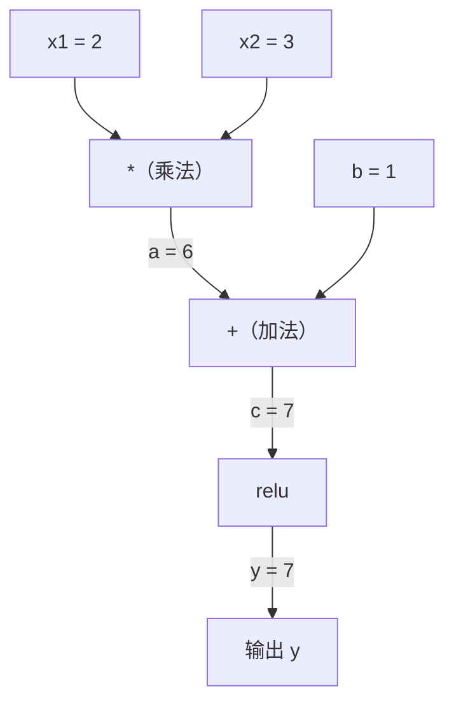
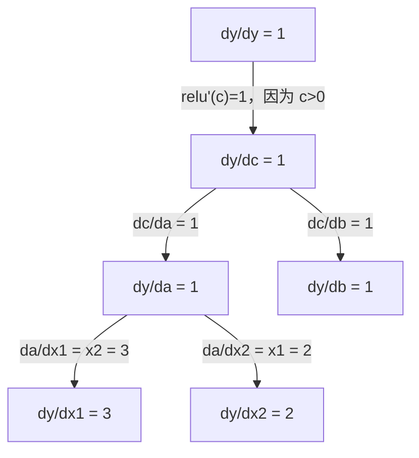

# 链式法则与自动微分

> 链式法则是每个能够学习的神经网络的引擎。

**类型：** 实作
**学习实现：** Python
**前置课程：** Phase 1 · 第 04 课「机器学习微积分」（上游：Derivatives & Gradients）
**预计学习：** 约 90 分钟

## 学习目标

- 构建记录运算并用反向模式自动微分计算梯度的最小 autograd 引擎（`Value` 类）
- 通过拓扑排序实现计算图前向与反向传播
- 仅用自建 autograd 引擎构造并训练 XOR 多层感知机
- 用有限差分梯度检查验证自动微分正确性

## 问题

网络是矩阵乘法、偏置、激活、softmax 和交叉熵等数百个函数的复合。手工求数百万个权重的导数不可能，有限差分又太慢。链式法则给出数学，自动微分给出算法：它在与一次前向传播同阶的时间内，精确计算任意复合函数的梯度。这正是 PyTorch、TensorFlow 与 JAX 的工作方式。

## 概念

### 链式法则 <!-- learning-atlas: chain-rule -->

若 `y = f(g(x))`，则 `dy/dx = dy/dg * dg/dx = f'(g(x)) * g'(x)`。例如 `y = sin(x^2)` 的导数为 `cos(x^2) * 2x`；更深的组合继续沿链相乘。网络的每层都是链中的一环。

### 计算图与反向模式 <!-- learning-atlas: computational-graphs -->

计算图将操作画成节点：值前向流动，梯度反向流动。例如 `y = relu(x1*x2 + b)`，从 `dy/dy=1` 开始，ReLU、加法和乘法依次将局部导数传播给 `x1`、`x2` 与 `b`。一个值可被多次使用，因此所有入射梯度必须用 `+=` 累加。

前向模式从输入传播导数，适合少输入、多输出；反向模式从输出回传，适合多输入、少输出。网络有数百万权重却通常只有一个标量损失，因此一次反向传播能得到所有梯度，反向模式正是反向传播。对偶数 `(value, derivative)` 可优雅实现前向模式，乘法规则为 `(a,a')*(b,b')=(ab,a'b+ab')`。

### 前向模式与反向模式

对 `y = sin(x^2)`、x=2，前向模式从 `dx/dx=1` 出发，先得 `d(x^2)/dx=4`，再得 `dy/dx=cos(4)*4≈-2.615`；反向模式从 `dy/dy=1` 出发，先得 `dy/d(x^2)=cos(4)≈-0.654`，再乘局部导数 4，结果相同。前者对每个输入变量需一次传播，后者对每个输出需一次传播；故标量损失网络选择反向模式。

| 模式 | 种子 | 方向 | 最适合 |
|---|---|---|---|
| 前向 | `dx_i/dx_i = 1` | 输入到输出 | 少输入、多输出 |
| 反向 | `dy/dy = 1` | 输出到输入 | 多输入、少输出（神经网络） |

### 对偶数

前向模式可用 `a + b*epsilon` 表示对偶数，其中 `epsilon^2=0`。`(2,1)` 表示值为 2、相对 x 的导数为 1；加法规则为 `(a,a')+(b,b')=(a+b,a'+b')`，而 `sin(a,a')=(sin(a),cos(a)*a')`。把输入导数种子设为 1，导数便随每次运算自动传播。

### 构建 autograd 引擎

`Value` 包装数值、梯度、父节点与本地 `_backward` 闭包。每次加、乘、ReLU、幂、exp、log、tanh 都创建输出节点并记录局部梯度。`backward()` 先拓扑排序计算图，再反序执行闭包；输出梯度种子为 1。PyTorch 的 `Tensor(requires_grad=True)`、动态图与 `.backward()` 遵循同一模式。

### PyTorch 自动微分的底层机制

PyTorch 中 `x=torch.tensor(2.0, requires_grad=True)` 与 `y=x**2+3*x+1` 会为每个运算创建节点；`y.backward()` 反向遍历动态图，通过节点的 `grad_fn` 将局部贡献累加到父节点 `.grad`。图在每次前向执行时新建，因此条件与循环等控制流也受支持。

| 运算 | 反向规则 | 用途 |
|---|---|---|
| `__sub__` | 复用 add 与 neg | `pred-target` 损失 |
| `__pow__` | `n*x^(n-1)` | MSE 的 `error^2` |
| `__truediv__` | 复用 mul 与 `pow(-1)` | 归一化、学习率缩放 |
| `exp` | `exp(x)*upstream` | softmax、对数似然 |
| `log` | `(1/x)*upstream` | 交叉熵、对数概率 |
| `tanh` | `(1-tanh^2)*upstream` | 经典激活 |

减法和除法由已实现的加、乘、幂组合而成，因此链式法则会自动给出正确梯度。

`Neuron` 计算 `tanh(w1*x1 + ... + b)`；`Layer` 是神经元列表，`MLP` 堆叠层。每个参数都是 `Value`，故 `loss.backward()` 自动把梯度传播至所有权重。XOR 训练每步先清零梯度，再反传，最后执行 `p.data -= lr * p.grad`。梯度检查以 `(f(x+h)-f(x-h))/(2h)` 对比 autodiff 梯度，适用于新增操作或排查训练错误。

完整流程还包括手算 `relu(x1*x2+1)` 的 `dy/dx1=3`、`dy/dx2=2`，再用引擎验证；对 `x^3`、`relu(a*b+c)`、单个 ReLU 神经元、`exp`、`log` 与复杂表达式分别做检查。XOR 采用 `MLP([2,4,1])`、目标 `[-1,1,1,-1]`、平方误差和学习率 0.05；100 步后输出符号应与目标一致。若安装 PyTorch，最后将同一 ReLU 图的梯度逐项与 `torch` 对照。

```text
若 y = f(g(x))，则 dy/dx = dy/dg × dg/dx
```

```text
y = sin(x²)
dy/dx = cos(x²) × 2x
```

```text
对 y = f(g(h(x)))，总导数是每一段局部导数的乘积。
```





```text
前向模式：从输入到输出传播导数；反向模式：从输出到输入回传梯度。
```

```text
对偶数：(a, a') × (b, b') = (ab, a'b + ab')
```

```text
自动微分引擎记录每次运算的父节点和局部反向规则，再按拓扑逆序执行。
```

```python
x = torch.tensor(2.0, requires_grad=True)
y = x ** 2 + 3 * x + 1
y.backward()
print(x.grad)  # 7.0 = 2*x + 3 = 2*2 + 3
```

```figure
chain-rule
```

> **产出说明：**

本课产出一个可验证的微型自动微分引擎：可继续扩展为神经网络、优化器与损失函数实验的基础。它把第 04 课的链式法则变成可运行的反向传播程序。

> **练习预览：**

1. 增加 sigmoid：实现 `sigmoid()` 与 `sigmoid'(x)=sigmoid(x)(1-sigmoid(x))` 的反向规则，并做梯度检查。
2. 实现交叉熵损失 `-sum(y*log(p))`，用它替换 XOR 的平方误差，并检查概率必须为正。
3. 实现一个在 2D 点上训练的两层 MLP，记录训练前后损失并检查所有参数收到梯度。

> **术语预览：**

| 术语 | 实际含义 |
|---|---|
| 链式法则 | 复合函数的总导数是沿路径局部导数的乘积。 |
| 计算图 | 用节点和依赖边记录运算的图。 |
| 前向模式 | 从输入传播导数；适合少输入。 |
| 反向模式 | 从输出回传梯度；适合标量损失网络。 |
| 自动微分 | 记录基本运算并机械组合精确导数。 |
| 拓扑排序 | 使节点在依赖满足后才反传的顺序。 |
| 梯度累加 | 共享值接收多条路径贡献时将它们相加。 |
| 梯度检查 | 用有限差分验证自动微分实现。 |

> **阅读资料预览：**

- 锁定版本的上游课程：`phases/01-math-foundations/05-chain-rule-and-autodiff/docs/en.md`
- [micrograd](https://github.com/karpathy/micrograd)：极小 autograd 引擎的参考实现
- [PyTorch Autograd 文档](https://pytorch.org/docs/stable/autograd.html)

## 动手实现

在工作区中运行 `autodiff.py`：先验证 `relu(x1*x2+1)`、幂和复合表达式的梯度，再实现完整运算集合与拓扑反传；随后训练 `MLP([2,4,1])` 解决 XOR，执行梯度检查，并在已安装 PyTorch 时与其梯度对照。

### 步骤 1：Value 类

```python
class Value:
    def __init__(self, data, children=(), op=''):
        self.data = data
        self.grad = 0.0
        self._backward = lambda: None
        self._prev = set(children)
        self._op = op

    def __repr__(self):
        return f"Value(data={self.data:.4f}, grad={self.grad:.4f})"
```

### 步骤 2：带梯度跟踪的算术运算

```python
    def __add__(self, other):
        other = other if isinstance(other, Value) else Value(other)
        out = Value(self.data + other.data, (self, other), '+')
        def _backward():
            self.grad += out.grad
            other.grad += out.grad
        out._backward = _backward
        return out

    def __mul__(self, other):
        other = other if isinstance(other, Value) else Value(other)
        out = Value(self.data * other.data, (self, other), '*')
        def _backward():
            self.grad += other.data * out.grad
            other.grad += self.data * out.grad
        out._backward = _backward
        return out

    def relu(self):
        out = Value(max(0, self.data), (self,), 'relu')
        def _backward():
            self.grad += (1.0 if out.data > 0 else 0.0) * out.grad
        out._backward = _backward
        return out
```

### 步骤 3：反向传播

```python
    def backward(self):
        topo = []
        visited = set()
        def build_topo(v):
            if v not in visited:
                visited.add(v)
                for child in v._prev:
                    build_topo(child)
                topo.append(v)
        build_topo(self)

        self.grad = 1.0
        for v in reversed(topo):
            v._backward()
```

### 步骤 4：补全引擎的更多操作

```python
    def __neg__(self):
        return self * -1

    def __sub__(self, other):
        return self + (-other)

    def __radd__(self, other):
        return self + other

    def __rmul__(self, other):
        return self * other

    def __rsub__(self, other):
        return other + (-self)

    def __pow__(self, n):
        out = Value(self.data ** n, (self,), f'**{n}')
        def _backward():
            self.grad += n * (self.data ** (n - 1)) * out.grad
        out._backward = _backward
        return out

    def __truediv__(self, other):
        return self * (other ** -1) if isinstance(other, Value) else self * (Value(other) ** -1)

    def exp(self):
        import math
        e = math.exp(self.data)
        out = Value(e, (self,), 'exp')
        def _backward():
            self.grad += e * out.grad
        out._backward = _backward
        return out

    def log(self):
        import math
        out = Value(math.log(self.data), (self,), 'log')
        def _backward():
            self.grad += (1.0 / self.data) * out.grad
        out._backward = _backward
        return out

    def tanh(self):
        import math
        t = math.tanh(self.data)
        out = Value(t, (self,), 'tanh')
        def _backward():
            self.grad += (1 - t ** 2) * out.grad
        out._backward = _backward
        return out
```

### 步骤 5：从零构建迷你 MLP

```python
import random

class Neuron:
    def __init__(self, n_inputs):
        self.w = [Value(random.uniform(-1, 1)) for _ in range(n_inputs)]
        self.b = Value(0.0)

    def __call__(self, x):
        act = sum((wi * xi for wi, xi in zip(self.w, x)), self.b)
        return act.tanh()

    def parameters(self):
        return self.w + [self.b]

class Layer:
    def __init__(self, n_inputs, n_outputs):
        self.neurons = [Neuron(n_inputs) for _ in range(n_outputs)]

    def __call__(self, x):
        return [n(x) for n in self.neurons]

    def parameters(self):
        return [p for n in self.neurons for p in n.parameters()]

class MLP:
    def __init__(self, sizes):
        self.layers = [Layer(sizes[i], sizes[i+1]) for i in range(len(sizes)-1)]

    def __call__(self, x):
        for layer in self.layers:
            x = layer(x)
        return x[0] if len(x) == 1 else x

    def parameters(self):
        return [p for layer in self.layers for p in layer.parameters()]
```
```python
random.seed(42)
model = MLP([2, 4, 1])  # 2 inputs, 4 hidden neurons, 1 output

xs = [[0, 0], [0, 1], [1, 0], [1, 1]]
ys = [-1, 1, 1, -1]  # XOR pattern (using -1/1 for tanh)

for step in range(100):
    preds = [model(x) for x in xs]
    loss = sum((p - y) ** 2 for p, y in zip(preds, ys))

    for p in model.parameters():
        p.grad = 0.0
    loss.backward()

    lr = 0.05
    for p in model.parameters():
        p.data -= lr * p.grad

    if step % 20 == 0:
        print(f"step {step:3d}  loss = {loss.data:.4f}")

print("\nPredictions after training:")
for x, y in zip(xs, ys):
    print(f"  input={x}  target={y:2d}  pred={model(x).data:6.3f}")
```

### 步骤 6：梯度检查

```python
def gradient_check(build_expr, x_val, h=1e-7):
    x = Value(x_val)
    y = build_expr(x)
    y.backward()
    autodiff_grad = x.grad

    y_plus = build_expr(Value(x_val + h)).data
    y_minus = build_expr(Value(x_val - h)).data
    numerical_grad = (y_plus - y_minus) / (2 * h)

    diff = abs(autodiff_grad - numerical_grad)
    return autodiff_grad, numerical_grad, diff
```
```python
def expr(x):
    return (x ** 3 + x * 2 + 1).tanh()

ad, num, diff = gradient_check(expr, 0.5)
print(f"Autodiff:  {ad:.8f}")
print(f"Numerical: {num:.8f}")
print(f"Difference: {diff:.2e}")
# Difference should be < 1e-5
```

### 步骤 7：与手算结果核对

```python
x1 = Value(2.0)
x2 = Value(3.0)
a = x1 * x2          # a = 6.0
b = a + Value(1.0)    # b = 7.0
y = b.relu()          # y = 7.0

y.backward()

print(f"y = {y.data}")          # 7.0
print(f"dy/dx1 = {x1.grad}")   # 3.0 (= x2)
print(f"dy/dx2 = {x2.grad}")   # 2.0 (= x1)
```
```python
import torch

x1 = torch.tensor(2.0, requires_grad=True)
x2 = torch.tensor(3.0, requires_grad=True)
a = x1 * x2
b = a + 1.0
y = torch.relu(b)
y.backward()

print(f"PyTorch dy/dx1 = {x1.grad.item()}")  # 3.0
print(f"PyTorch dy/dx2 = {x2.grad.item()}")  # 2.0
```
```python
a = Value(2.0)
b = Value(-3.0)
c = Value(10.0)
f = (a * b + c).relu()  # relu(2*(-3) + 10) = relu(4) = 4

f.backward()
print(f"df/da = {a.grad}")  # -3.0 (= b)
print(f"df/db = {b.grad}")  #  2.0 (= a)
print(f"df/dc = {c.grad}")  #  1.0
```


<!-- 已在前一节按原顺序保留；以下为历史重复副本，不参与发布内容。 -->
<!--

下列代码块逐字保留，补足前述概念说明中的所有构建、梯度检查、PyTorch 校验和复杂表达式步骤。

```python
class Value:
    def __init__(self, data, children=(), op=''):
        self.data = data
        self.grad = 0.0
        self._backward = lambda: None
        self._prev = set(children)
        self._op = op

    def __repr__(self):
        return f"Value(data={self.data:.4f}, grad={self.grad:.4f})"
```

```python
    def __add__(self, other):
        other = other if isinstance(other, Value) else Value(other)
        out = Value(self.data + other.data, (self, other), '+')
        def _backward():
            self.grad += out.grad
            other.grad += out.grad
        out._backward = _backward
        return out

    def __mul__(self, other):
        other = other if isinstance(other, Value) else Value(other)
        out = Value(self.data * other.data, (self, other), '*')
        def _backward():
            self.grad += other.data * out.grad
            other.grad += self.data * out.grad
        out._backward = _backward
        return out

    def relu(self):
        out = Value(max(0, self.data), (self,), 'relu')
        def _backward():
            self.grad += (1.0 if out.data > 0 else 0.0) * out.grad
        out._backward = _backward
        return out
```

```python
    def backward(self):
        topo = []
        visited = set()
        def build_topo(v):
            if v not in visited:
                visited.add(v)
                for child in v._prev:
                    build_topo(child)
                topo.append(v)
        build_topo(self)

        self.grad = 1.0
        for v in reversed(topo):
            v._backward()
```

```python
    def __neg__(self):
        return self * -1

    def __sub__(self, other):
        return self + (-other)

    def __radd__(self, other):
        return self + other

    def __rmul__(self, other):
        return self * other

    def __rsub__(self, other):
        return other + (-self)

    def __pow__(self, n):
        out = Value(self.data ** n, (self,), f'**{n}')
        def _backward():
            self.grad += n * (self.data ** (n - 1)) * out.grad
        out._backward = _backward
        return out

    def __truediv__(self, other):
        return self * (other ** -1) if isinstance(other, Value) else self * (Value(other) ** -1)

    def exp(self):
        import math
        e = math.exp(self.data)
        out = Value(e, (self,), 'exp')
        def _backward():
            self.grad += e * out.grad
        out._backward = _backward
        return out

    def log(self):
        import math
        out = Value(math.log(self.data), (self,), 'log')
        def _backward():
            self.grad += (1.0 / self.data) * out.grad
        out._backward = _backward
        return out

    def tanh(self):
        import math
        t = math.tanh(self.data)
        out = Value(t, (self,), 'tanh')
        def _backward():
            self.grad += (1 - t ** 2) * out.grad
        out._backward = _backward
        return out
```

```python
import random

class Neuron:
    def __init__(self, n_inputs):
        self.w = [Value(random.uniform(-1, 1)) for _ in range(n_inputs)]
        self.b = Value(0.0)

    def __call__(self, x):
        act = sum((wi * xi for wi, xi in zip(self.w, x)), self.b)
        return act.tanh()

    def parameters(self):
        return self.w + [self.b]

class Layer:
    def __init__(self, n_inputs, n_outputs):
        self.neurons = [Neuron(n_inputs) for _ in range(n_outputs)]

    def __call__(self, x):
        return [n(x) for n in self.neurons]

    def parameters(self):
        return [p for n in self.neurons for p in n.parameters()]

class MLP:
    def __init__(self, sizes):
        self.layers = [Layer(sizes[i], sizes[i+1]) for i in range(len(sizes)-1)]

    def __call__(self, x):
        for layer in self.layers:
            x = layer(x)
        return x[0] if len(x) == 1 else x

    def parameters(self):
        return [p for layer in self.layers for p in layer.parameters()]
```

```python
random.seed(42)
model = MLP([2, 4, 1])  # 2 inputs, 4 hidden neurons, 1 output

xs = [[0, 0], [0, 1], [1, 0], [1, 1]]
ys = [-1, 1, 1, -1]  # XOR pattern (using -1/1 for tanh)

for step in range(100):
    preds = [model(x) for x in xs]
    loss = sum((p - y) ** 2 for p, y in zip(preds, ys))

    for p in model.parameters():
        p.grad = 0.0
    loss.backward()

    lr = 0.05
    for p in model.parameters():
        p.data -= lr * p.grad

    if step % 20 == 0:
        print(f"step {step:3d}  loss = {loss.data:.4f}")

print("\nPredictions after training:")
for x, y in zip(xs, ys):
    print(f"  input={x}  target={y:2d}  pred={model(x).data:6.3f}")
```

```python
def gradient_check(build_expr, x_val, h=1e-7):
    x = Value(x_val)
    y = build_expr(x)
    y.backward()
    autodiff_grad = x.grad

    y_plus = build_expr(Value(x_val + h)).data
    y_minus = build_expr(Value(x_val - h)).data
    numerical_grad = (y_plus - y_minus) / (2 * h)

    diff = abs(autodiff_grad - numerical_grad)
    return autodiff_grad, numerical_grad, diff
```

```python
def expr(x):
    return (x ** 3 + x * 2 + 1).tanh()

ad, num, diff = gradient_check(expr, 0.5)
print(f"Autodiff:  {ad:.8f}")
print(f"Numerical: {num:.8f}")
print(f"Difference: {diff:.2e}")
# Difference should be < 1e-5
```

```python
x1 = Value(2.0)
x2 = Value(3.0)
a = x1 * x2          # a = 6.0
b = a + Value(1.0)    # b = 7.0
y = b.relu()          # y = 7.0

y.backward()

print(f"y = {y.data}")          # 7.0
print(f"dy/dx1 = {x1.grad}")   # 3.0 (= x2)
print(f"dy/dx2 = {x2.grad}")   # 2.0 (= x1)
```

## 使用库

### 用 PyTorch 验证

```python
import torch

x1 = torch.tensor(2.0, requires_grad=True)
x2 = torch.tensor(3.0, requires_grad=True)
a = x1 * x2
b = a + 1.0
y = torch.relu(b)
y.backward()

print(f"PyTorch dy/dx1 = {x1.grad.item()}")  # 3.0
print(f"PyTorch dy/dx2 = {x2.grad.item()}")  # 2.0
```

### 更复杂的表达式

```python
a = Value(2.0)
b = Value(-3.0)
c = Value(10.0)
f = (a * b + c).relu()  # relu(2*(-3) + 10) = relu(4) = 4

f.backward()
print(f"df/da = {a.grad}")  # -3.0 (= b)
print(f"df/db = {b.grad}")  #  2.0 (= a)
print(f"df/dc = {c.grad}")  #  1.0
```

-->

> **补充说明：图、引擎步骤与验证**

对 y=relu(x1*x2+b)、x1=2、x2=3、b=1，前向先得到 a=6、c=7、y=7。反向从 dy/dy=1 开始：ReLU 在 c>0 时给 dy/dc=1；加法给 dy/da=1 与 dy/db=1；乘法给 dy/dx1=x2=3、dy/dx2=x1=2。每个节点都应用局部导数乘上游梯度。

构建引擎的三个不可缺步骤是：(1) 用对象包装数值与梯度；(2) 每次运算记录输入和局部反传函数；(3) 拓扑排序后反序执行，保证子节点接到的全部贡献先累加完成。PyTorch 中 requires_grad=True 会记录对应运算，grad_fn 计算局部梯度，并以加法而不是替换方式存入 .grad；它是 define-by-run 的动态图，因而允许前向内包含 if/else 与循环。

梯度检查应比较自动微分的梯度和中心差分 (f(x+h)-f(x-h))/(2h)，误差应小于 1e-5。手算验证、XOR 训练和 PyTorch 对照都应检查损失下降、梯度近似一致，而不是假定固定步数后的输出必然满足某个符号结果。对复杂表达式和 torch 对照的完整可运行代码已保留在下方 Build/Use 对照中。

## 使用库

### 用 PyTorch 验证

将手写 `relu(x1*x2+1)` 的梯度与 `torch.tensor(..., requires_grad=True)` 计算的 `.grad` 对照；两者应分别给出 3 与 2。

### 更复杂的表达式

对 `relu(a*b+c)` 运行反向传播，检查三个输入分别接到 `b`、`a` 与 1 的梯度贡献。

## 交付物

本课产出一个可验证的微型自动微分引擎：可继续扩展为神经网络、优化器与损失函数实验的基础。它把第 04 课的链式法则变成可运行的反向传播程序。

## 练习

1. 增加 sigmoid：实现 `sigmoid()` 与 `sigmoid'(x)=sigmoid(x)(1-sigmoid(x))` 的反向规则，并做梯度检查。
2. 实现交叉熵损失 `-sum(y*log(p))`，用它替换 XOR 的平方误差，并检查概率必须为正。
3. 实现一个在 2D 点上训练的两层 MLP，记录训练前后损失并检查所有参数收到梯度。

## 术语

| 术语 | 实际含义 |
|---|---|
| 链式法则 | 复合函数的总导数是沿路径局部导数的乘积。 |
| 计算图 | 用节点和依赖边记录运算的图。 |
| 前向模式 | 从输入传播导数；适合少输入。 |
| 反向模式 | 从输出回传梯度；适合标量损失网络。 |
| 自动微分 | 记录基本运算并机械组合精确导数。 |
| 拓扑排序 | 使节点在依赖满足后才反传的顺序。 |
| 梯度累加 | 共享值接收多条路径贡献时将它们相加。 |
| 梯度检查 | 用有限差分验证自动微分实现。 |

## 原文与补充阅读

- [Andrej Karpathy：The spelled-out intro to neural networks and backpropagation](https://www.youtube.com/watch?v=tIeHLnjs5U8)
- [PyTorch：Autograd mechanics](https://pytorch.org/docs/stable/notes/autograd.html)
- [Automatic Differentiation in Machine Learning: a Survey](https://arxiv.org/abs/1502.05767)
