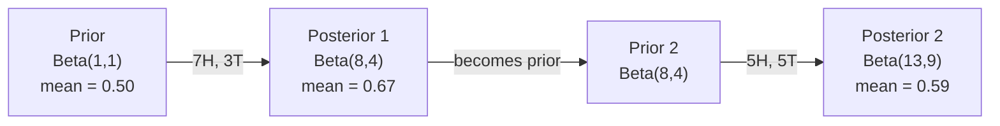

# 贝叶斯定理

> 概率描述的是你的预期；贝叶斯定理描述的是你学到了什么。

**类型：** 实作
**语言：** Python
**前置课程：** 第 1 阶段，第 06 课（概率基础）
**时间：** 约 75 分钟

## 学习目标

- 应用贝叶斯定理，根据先验、似然和证据计算后验概率
- 使用 Laplace 平滑和 log 空间计算，从零构建 Naive Bayes 文本分类器
- 比较 MLE 与 MAP 估计，并解释 MAP 如何对应 L2 正则化
- 使用 Beta-Binomial 共轭先验，为 A/B 测试实现顺序贝叶斯更新

## 问题

某项医疗检测的准确率为 99%。你的检测结果呈阳性。你真正患病的概率是多少？

大多数人会回答 99%。真实答案取决于这种疾病有多罕见。如果每 10,000 人中只有 1 人患病，那么一次阳性结果只能说明你患病的概率约为 1%。其余 99% 的阳性结果，都是健康人产生的误报。

贝叶斯定理解释了这个结果。垃圾邮件过滤、医疗诊断和量化不确定性的机器学习模型都采用同一种推理方式：从先验信念出发，观察证据，再更新信念。

如果你在不了解这一点的情况下构建 ML 系统，就会误读模型输出、设置糟糕的阈值，并交付过度自信的预测。

## 概念

### 从联合概率到贝叶斯定理 <!-- learning-atlas: from-joint-probability-to-bayes -->

你已经在第 06 课学过，条件概率为：

```
P(A|B) = P(A and B) / P(B)
```

对称地：

```
P(B|A) = P(A and B) / P(A)
```

两个表达式的分子相同，都是 P(A and B)。令二者相等并重新整理：

```
P(A and B) = P(A|B) * P(B) = P(B|A) * P(A)

Therefore:

P(A|B) = P(B|A) * P(A) / P(B)
```

这四个量构成贝叶斯定理的一个等式。

### 四个部分

| 部分 | 名称 | 含义 |
|------|------|------|
| P(A\|B) | 后验 | 看到证据 B 后，你对 A 更新后的信念 |
| P(B\|A) | 似然 | 如果 A 为真，证据 B 出现的可能性 |
| P(A) | 先验 | 看到任何证据之前，你对 A 的信念 |
| P(B) | 证据 | 在所有可能情况下看到 B 的总概率 |

证据项 P(B) 起归一化作用。可以用全概率公式将它展开：

```
P(B) = P(B|A) * P(A) + P(B|not A) * P(not A)
```

### 医疗检测示例

某种疾病每 10,000 人中有 1 人患病。检测的准确率为 99%（能检出 99% 的患者，假阳性率为 1%）。

```
P(sick)          = 0.0001     (prior: disease is rare)
P(positive|sick) = 0.99       (likelihood: test catches it)
P(positive|healthy) = 0.01    (false positive rate)

P(positive) = P(positive|sick) * P(sick) + P(positive|healthy) * P(healthy)
            = 0.99 * 0.0001 + 0.01 * 0.9999
            = 0.000099 + 0.009999
            = 0.010098

P(sick|positive) = P(positive|sick) * P(sick) / P(positive)
                 = 0.99 * 0.0001 / 0.010098
                 = 0.0098
                 = 0.98%
```

不足 1%。先验占据主导。当一种疾病很罕见时，即使检测相当准确，大部分阳性结果仍是假阳性。因此医生会安排确认检测。

### 垃圾邮件过滤示例

你收到了一封包含单词 “lottery” 的电子邮件。它是垃圾邮件吗？

```
P(spam)                = 0.3      (30% of email is spam)
P("lottery"|spam)      = 0.05     (5% of spam emails contain "lottery")
P("lottery"|not spam)  = 0.001    (0.1% of legitimate emails contain "lottery")

P("lottery") = 0.05 * 0.3 + 0.001 * 0.7
             = 0.015 + 0.0007
             = 0.0157

P(spam|"lottery") = 0.05 * 0.3 / 0.0157
                  = 0.955
                  = 95.5%
```

一个单词就把概率从 30% 推高到 95.5%。生产垃圾邮件过滤器会同时对数百个单词应用贝叶斯定理。

### Naive Bayes：独立性假设

Naive Bayes 将这一方法扩展到多个特征，假设给定类别后，所有特征都条件独立：

```
P(class | feature_1, feature_2, ..., feature_n)
  = P(class) * P(feature_1|class) * P(feature_2|class) * ... * P(feature_n|class)
    / P(feature_1, feature_2, ..., feature_n)
```

所谓“朴素”，指的就是这个独立性假设。在文本中，单词是否出现并不独立（“New” 和 “York” 是相关的）。但在实践中，这个假设的效果出奇地好，因为分类器只需要对各个类别排序，而不需要生成经过校准的概率。

因为对所有类别来说分母都相同，所以可以跳过分母，只比较分子：

```
score(class) = P(class) * product of P(feature_i | class)
```

选择得分最高的类别。

### 最大似然估计（MLE）

如何从训练数据中得到 P(feature|class)？计数即可。

```
P("free"|spam) = (number of spam emails containing "free") / (total spam emails)
```

MLE 选择使观测数据最有可能出现的参数值。你最大化的是似然函数；对于离散计数，它可以简化为相对频率。

问题在于：如果某个单词在训练期间从未出现在垃圾邮件中，MLE 会给它分配零概率。一个未见过的单词就会让整个乘积变为零。可以用 Laplace 平滑修复这个问题：

```
P(word|class) = (count(word, class) + 1) / (total_words_in_class + vocabulary_size)
```

给每个计数加 1，可以确保概率永远不为零。

### 最大后验估计（MAP）

MLE 问的是：哪些参数能使 P(data|parameters) 最大？

MAP 问的是：哪些参数能使 P(parameters|data) 最大？

根据贝叶斯定理：

```
P(parameters|data) proportional to P(data|parameters) * P(parameters)
```

MAP 还为参数本身加入先验。如果你认为参数应该较小，就可以把这种信念编码成一个惩罚大参数值的先验。这与 ML 中的 L2 正则化完全相同；岭回归中的“ridge”惩罚对应权重上的高斯先验。

| 估计方法 | 优化目标 | ML 中的等价形式 |
|------------|-----------|---------------|
| MLE | P(data\|params) | 无正则化训练 |
| MAP | P(data\|params) * P(params) | L2 / L1 正则化 |

### 贝叶斯学派与频率学派：实际差异

频率学派把参数视为固定但未知的量。他们问：“如果我把这个实验重复很多次，会发生什么？”

贝叶斯学派把参数视为分布。他们问：“根据我已经观察到的结果，我对这些参数有怎样的信念？”

对于 ML 系统的构建，两者的实际差异如下：

| 方面 | 频率学派 | 贝叶斯学派 |
|--------|-------------|----------|
| 输出 | 点估计 | 值的概率分布 |
| 不确定性 | 置信区间（针对过程） | 可信区间（针对参数） |
| 小数据 | 可能过拟合 | 先验起正则化作用 |
| 计算 | 通常更快 | 经常需要采样（MCMC） |

大多数生产环境中的 ML 都采用频率学派方法（SGD、点估计）。当你需要经过校准的不确定性时（医疗决策、安全关键系统），或者数据稀缺时（小样本学习、冷启动），贝叶斯方法尤为出色。

### 为什么贝叶斯思维对 ML 很重要

二者存在以下数学对应关系：

**先验就是正则化。** 权重上的高斯先验对应 L2 正则化，Laplace 先验对应 L1。添加正则化项，也是在用贝叶斯形式表达对参数值的预期。

**后验就是不确定性。** 单一的预测概率并不能说明模型对这一估计有多大把握。贝叶斯方法会给你一个分布：“我认为 P(spam) 位于 0.8 到 0.95 之间。”

**贝叶斯更新就是在线学习。** 今天的后验会成为明天的先验。当模型看到新数据时，它会逐步更新信念，而不必从头重新训练。

**模型比较也是贝叶斯式的。** 贝叶斯信息准则（BIC）、边缘似然和贝叶斯因子都使用贝叶斯推理，在避免过拟合的同时从多个模型中作出选择。

```figure
bayes-update
```

## 动手构建

### 步骤 1：贝叶斯定理函数

```python
def bayes(prior, likelihood, false_positive_rate):
    evidence = likelihood * prior + false_positive_rate * (1 - prior)
    posterior = likelihood * prior / evidence
    return posterior

result = bayes(prior=0.0001, likelihood=0.99, false_positive_rate=0.01)
print(f"P(sick|positive) = {result:.4f}")
```

### 步骤 2：Naive Bayes 分类器

```python
import math
from collections import defaultdict

class NaiveBayes:
    def __init__(self, smoothing=1.0):
        self.smoothing = smoothing
        self.class_counts = defaultdict(int)
        self.word_counts = defaultdict(lambda: defaultdict(int))
        self.class_word_totals = defaultdict(int)
        self.vocab = set()

    def train(self, documents, labels):
        for doc, label in zip(documents, labels):
            self.class_counts[label] += 1
            words = doc.lower().split()
            for word in words:
                self.word_counts[label][word] += 1
                self.class_word_totals[label] += 1
                self.vocab.add(word)

    def predict(self, document):
        words = document.lower().split()
        total_docs = sum(self.class_counts.values())
        vocab_size = len(self.vocab)
        best_class = None
        best_score = float("-inf")
        for cls in self.class_counts:
            score = math.log(self.class_counts[cls] / total_docs)
            for word in words:
                count = self.word_counts[cls].get(word, 0)
                total = self.class_word_totals[cls]
                score += math.log((count + self.smoothing) / (total + self.smoothing * vocab_size))
            if score > best_score:
                best_score = score
                best_class = cls
        return best_class
```

log 概率可以防止下溢。许多小概率相乘，会得到小到浮点数无法表示的数值；对 log 概率求和在数学上等价，同时具有数值稳定性。

### 步骤 3：使用垃圾邮件数据训练

```python
train_docs = [
    "win free money now",
    "free lottery ticket winner",
    "claim your prize today free",
    "urgent offer free cash",
    "congratulations you won free",
    "meeting tomorrow at noon",
    "project update attached",
    "can we schedule a call",
    "quarterly report review",
    "lunch on thursday sounds good",
    "team standup notes attached",
    "please review the pull request",
]

train_labels = [
    "spam", "spam", "spam", "spam", "spam",
    "ham", "ham", "ham", "ham", "ham", "ham", "ham",
]

classifier = NaiveBayes()
classifier.train(train_docs, train_labels)

test_messages = [
    "free money waiting for you",
    "meeting rescheduled to friday",
    "you won a free prize",
    "please review the attached report",
]

for msg in test_messages:
    print(f"  '{msg}' -> {classifier.predict(msg)}")
```

### 步骤 4：检查学到的概率

```python
def show_top_words(classifier, cls, n=5):
    vocab_size = len(classifier.vocab)
    total = classifier.class_word_totals[cls]
    probs = {}
    for word in classifier.vocab:
        count = classifier.word_counts[cls].get(word, 0)
        probs[word] = (count + classifier.smoothing) / (total + classifier.smoothing * vocab_size)
    sorted_words = sorted(probs.items(), key=lambda x: x[1], reverse=True)
    for word, prob in sorted_words[:n]:
        print(f"    {word}: {prob:.4f}")

print("\nTop spam words:")
show_top_words(classifier, "spam")
print("\nTop ham words:")
show_top_words(classifier, "ham")
```

## 实际使用

Scikit-learn 提供了可用于生产环境的 Naive Bayes 实现：

```python
from sklearn.feature_extraction.text import CountVectorizer
from sklearn.naive_bayes import MultinomialNB
from sklearn.metrics import classification_report

vectorizer = CountVectorizer()
X_train = vectorizer.fit_transform(train_docs)
clf = MultinomialNB()
clf.fit(X_train, train_labels)

X_test = vectorizer.transform(test_messages)
predictions = clf.predict(X_test)
for msg, pred in zip(test_messages, predictions):
    print(f"  '{msg}' -> {pred}")
```

算法是相同的。CountVectorizer 负责分词和构建词表，MultinomialNB 在内部处理平滑和 log 概率。你从零实现的版本用 40 行代码完成了同样的事情。

## 交付成果

本课构建的 NaiveBayes 类展示了完整流程：分词、使用 Laplace 平滑估计概率，以及在 log 空间中进行预测。`code/bayes.py` 中的代码无需 Python 标准库以外的依赖，即可端到端运行。

### 共轭先验

如果先验和后验属于同一个分布族，这个先验就称为“共轭先验”。它使贝叶斯更新在代数上非常简洁——无需数值积分，就能得到闭式后验。

| 似然 | 共轭先验 | 后验 | 示例 |
|-----------|----------------|-----------|---------|
| Bernoulli | Beta(a, b) | Beta(a + successes, b + failures) | 估计硬币正面概率 |
| Normal（方差已知） | Normal(mu_0, sigma_0) | Normal（加权均值、更小方差） | 传感器校准 |
| Poisson | Gamma(a, b) | Gamma(a + sum of counts, b + n) | 建模到达率 |
| Multinomial | Dirichlet(alpha) | Dirichlet(alpha + counts) | 主题建模、语言模型 |

这一点很重要：如果没有共轭先验，就需要使用 Monte Carlo 采样或变分推断来近似后验；有了共轭先验，只需更新两个数即可。

Beta 分布是实践中最常见的共轭先验。Beta(a, b) 表示你对某个概率参数的信念，其均值为 a/(a+b)。a+b 越大，分布越集中（即信念越确定）。

Beta 先验的特殊情况：
- Beta(1, 1) = 均匀分布。你对参数没有任何倾向。
- Beta(10, 10) = 在 0.5 处达到峰值。你非常相信参数接近 0.5。
- Beta(1, 10) = 向 0 偏斜。你认为参数较小。

更新规则极其简单：

```
Prior:     Beta(a, b)
Data:      s successes, f failures
Posterior: Beta(a + s, b + f)
```

无需积分，无需采样，只要做加法。

### 顺序贝叶斯更新

贝叶斯推断天然适合顺序处理。今天的后验会成为明天的先验。现实系统正是以这种方式逐步学习，无需重新处理全部历史数据。

来看一个具体例子：估计一枚硬币是否公平。

**第 1 天：还没有数据。**
从 Beta(1, 1)——均匀先验——开始。你没有任何倾向。
- 先验均值：0.5
- 先验在 [0, 1] 区间上是平坦的

**第 2 天：观察到 7 次正面、3 次反面。**
后验 = Beta(1 + 7, 1 + 3) = Beta(8, 4)
- 后验均值：8/12 = 0.667
- 证据表明硬币偏向正面

**第 3 天：又观察到 5 次正面、5 次反面。**
把昨天的后验用作今天的先验。
后验 = Beta(8 + 5, 4 + 5) = Beta(13, 9)
- 后验均值：13/22 = 0.591
- 新的均衡数据将估计拉回到了 0.5 附近



观测顺序并不重要。用全部 12 次正面和 8 次反面一次性更新 Beta(1,1)，也会得到 Beta(13, 9)——结果完全相同。顺序更新和批量更新在数学上等价，但顺序更新让你无需保存原始数据，就能在每一步作出决策。

这是生产环境中 ML 系统实现在线学习的基础。用于多臂老虎机的 Thompson sampling、增量式推荐系统和流式异常检测器，都使用这种模式。

### 与 A/B 测试的联系

A/B 测试其实就是披着伪装的贝叶斯推断。

场景：你正在测试两种按钮颜色，变体 A（蓝色）和变体 B（绿色）。你想知道哪一种能获得更多点击。

贝叶斯 A/B 测试：

1. **先验。** 两个变体都从 Beta(1, 1) 开始，不偏好任何一方。
2. **数据。** 变体 A：1000 次展示中有 50 次点击。变体 B：1000 次展示中有 65 次点击。
3. **后验。**
   - A：Beta(1 + 50, 1 + 950) = Beta(51, 951)。均值 = 0.051
   - B：Beta(1 + 65, 1 + 935) = Beta(66, 936)。均值 = 0.066
4. **决策。** 计算 P(B > A)——即 B 的真实转化率高于 A 的概率。

以解析方式计算 P(B > A) 很困难，但 Monte Carlo 能让这件事变得极其简单：

```
1. Draw 100,000 samples from Beta(51, 951)  -> samples_A
2. Draw 100,000 samples from Beta(66, 936)  -> samples_B
3. P(B > A) = fraction of samples where B > A
```

如果 P(B > A) > 0.95，就交付变体 B；如果它位于 0.05 和 0.95 之间，就继续收集数据；如果 P(B > A) < 0.05，就交付变体 A。

与频率学派 A/B 测试相比，它的优势包括：
- 你可以得到直接的概率陈述：“B 有 97% 的概率更好”
- 不会混淆 p 值，也无需用“无法拒绝零假设”这样的措辞来回避结论
- 可以随时检查结果而不会抬高假阳性率（不存在“偷看问题”）
- 可以纳入先验知识（例如，过去的测试表明转化率通常为 3–8%）

| 方面 | 频率学派 A/B | 贝叶斯 A/B |
|--------|----------------|--------------|
| 输出 | p 值 | P(B > A) |
| 解释 | “如果 A=B，这些数据有多令人意外？” | “B 优于 A 的可能性有多大？” |
| 提前停止 | 会抬高假阳性率 | 可在任何时点安全停止（前提是先验选择合理且模型设定正确） |
| 先验知识 | 不使用 | 编码为 Beta 先验 |
| 决策规则 | p < 0.05 | P(B > A) > 阈值 |

## 练习

1. **多次检测。** 一名患者在两次相互独立的检测中都呈阳性（两次检测的准确率均为 99%，疾病患病率为万分之一）。两次检测之后 P(sick) 是多少？把第一次检测的后验用作第二次检测的先验。

2. **平滑的影响。** 分别使用 0.01、0.1、1.0 和 10.0 作为 smoothing 值运行垃圾邮件分类器。排名靠前的单词概率会如何变化？当 smoothing=0，并且某个单词只出现在 ham 中时，会发生什么？

3. **添加特征。** 扩展 NaiveBayes 类，除了单词计数之外，还把消息长度（短/长）用作特征。从训练数据中估计 P(short|spam) 和 P(short|ham)，并将其纳入预测得分。

4. **手算 MAP。** 给定观测数据（10 次抛硬币中有 7 次正面），使用 Beta(2,2) 先验计算正面概率的 MAP 估计，并与 MLE 估计（7/10）比较。

## 关键术语

| 术语 | 人们常说 | 实际含义 |
|------|----------------|----------------------|
| 先验 | “我的初始猜测” | 观察证据之前的 P(hypothesis)。在 ML 中，它就是正则化项。 |
| 似然 | “数据有多吻合” | P(evidence\|hypothesis)。在某一特定假设下，观测数据出现的可能性。 |
| 后验 | “我更新后的信念” | P(hypothesis\|evidence)。先验乘以似然，然后归一化。 |
| 证据 | “归一化常数” | 所有假设下的 P(data)。确保后验概率之和为 1。 |
| Naive Bayes | “那个简单的文本分类器” | 假设给定类别后各特征相互独立的分类器。尽管假设并不成立，它仍然效果很好。 |
| Laplace 平滑 | “加一平滑” | 给每个特征增加一个较小的计数，防止未见数据产生零概率。 |
| MLE | “直接使用频率” | 选择使 P(data\|parameters) 最大的参数。不使用先验。在小数据上可能过拟合。 |
| MAP | “带先验的 MLE” | 选择使 P(data\|parameters) * P(parameters) 最大的参数。等价于正则化后的 MLE。 |
| log 概率 | “在 log 空间中计算” | 使用 log(P) 而非 P，避免许多小数相乘时发生浮点数下溢。 |
| 假阳性 | “错误警报” | 检测结果为阳性，但真实状态为阴性。它会导致基础比率谬误。 |

## 延伸阅读

- [3Blue1Brown：贝叶斯定理](https://www.youtube.com/watch?v=HZGCoVF3YvM) - 使用医疗检测示例进行可视化讲解
- [Stanford CS229：生成式学习算法](https://cs229.stanford.edu/notes2022fall/cs229-notes2.pdf) - Naive Bayes 及其与判别模型的联系
- [Think Bayes](https://greenteapress.com/wp/think-bayes/) - 免费书籍，使用 Python 代码讲解贝叶斯统计
- [scikit-learn Naive Bayes](https://scikit-learn.org/stable/modules/naive_bayes.html) - 生产级实现，以及各变体的适用时机
