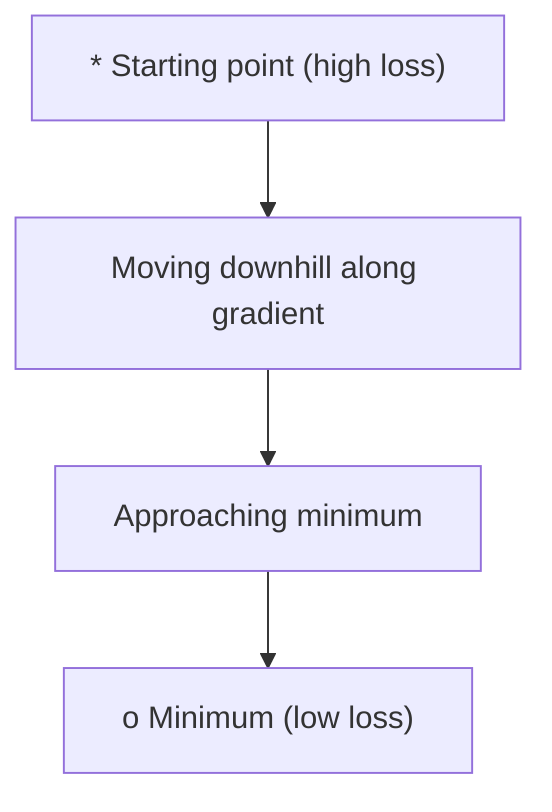
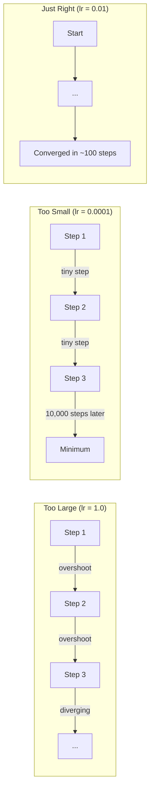
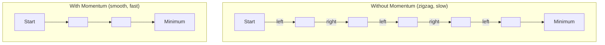
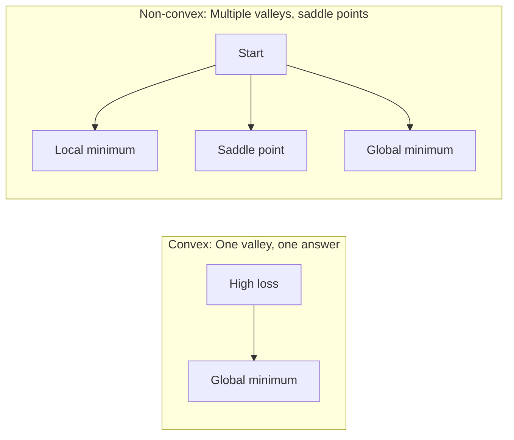
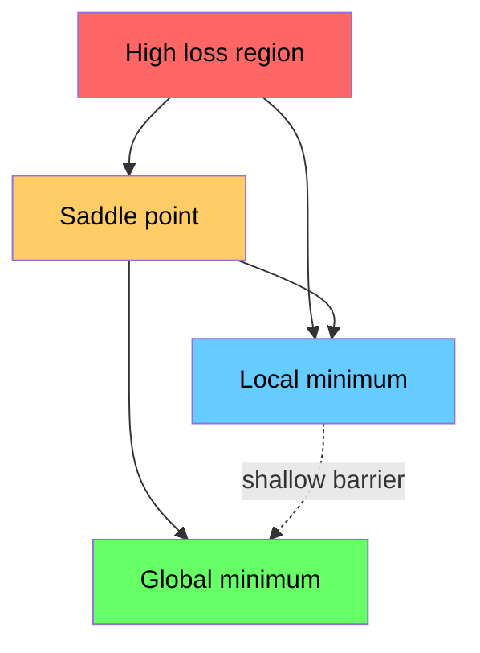

# 优化

> 训练神经网络就是最小化损失函数。

**类型：** 实作  
**学习实现：** Python  
**前置课程：** Phase 1 · 第 04–05 课「导数、梯度」  
**预计学习：** 约 75 分钟

## 学习目标

- 从零实现普通梯度下降、带动量 SGD 和 Adam。
- 在 Rosenbrock 函数上比较收敛，并说明 Adam 为什么为每个权重自适应步长。
- 区分凸与非凸损失地形，解释高维鞍点的影响。
- 配置 step decay、cosine annealing 与 warmup 等学习率调度以保证训练稳定。

## 问题

损失函数告诉你模型错了多少，梯度告诉你哪一边更糟；还缺少一条可靠下山策略。沿负梯度走是梯度下降：步长过大会越过山谷、在两侧反弹甚至发散；过小则要浪费数千次迭代；鞍点处梯度为零却并未到达最小值。所有深度学习优化器都在回答同一问题：怎样更快、更可靠地抵达低损失区域。

## 概念

### 优化意味着什么 <!-- learning-atlas: gradient-descent -->

优化是找使函数最小（或最大）的输入。训练中函数是损失 L，输入是可达数百万的权重 w：`minimize L(w)`。

### 原始梯度下降

最基本的更新沿负梯度进行：`w = w - lr * gradient`。它每轮根据当前参数位置下降，适合用来理解所有一阶优化器的共同核心。

### 学习率：最重要的超参数

`lr` 是学习率，控制每一轮走多远。它过大会越过山谷、反弹甚至发散，过小则浪费成千上万次迭代；没有通用最优值，只能实验。常用起点是 Adam 的 0.001、动量 SGD 的 0.01。

### Batch、SGD 与 mini-batch

批量 GD 每步对全数据求精确梯度，稳定而慢；SGD 每次用一个随机样本，快但噪声大；实践几乎总用 32、64、128 或 256 个样本的 mini-batch，在速度、梯度质量和噪声之间折中。噪声并非纯缺点：它能推动优化器越过浅局部极小和鞍点。

| 变体 | 批量大小 | 梯度质量 | 每步速度 | 噪声 |
|---|---:|---|---|---|
| Batch GD | 全部数据 | 精确 | 慢 | 无 |
| SGD | 1 | 很嘈杂 | 快 | 高 |
| Mini-batch | 32–256 | 良好估计 | 平衡 | 中等 |

### 动量：滚下山的球 <!-- learning-atlas: adam-adaptive-learning-rates -->

普通 GD 只看当前梯度，在狭窄谷底的左右摆动会很慢。动量累积速度 `v=beta*v+gradient`，再令 `w=w-lr*v`；beta 通常为 0.9。它像滚下山的球，会在一致方向加速并抑制振荡；beta 越高越平滑，却越难快速响应方向改变。

### Adam：自适应学习率

Adam 为每个权重维护一阶矩 m（梯度方向的滑动平均）和二阶矩 v（梯度平方的滑动平均）：
m=beta1*m+(1-beta1)*g，v=beta2*v+(1-beta2)*g^2；
m_hat=m/(1-beta1^t)，v_hat=v/(1-beta2^t)；
w=w-lr*m_hat/(sqrt(v_hat)+epsilon)。
偏差修正补偿 m、v 从零开始的冷启动。sqrt(v_hat) 使长期梯度大的权重有效步长变小、梯度小的权重有效步长变大。默认 lr=0.001、beta1=0.9、beta2=0.999、epsilon=1e-8 对许多问题有效。

### 学习率调度

固定 lr 是折中：早期希望大步快速推进，靠近最小值后希望小步微调。

| 调度 | 公式/形式 | 使用场景 |
|---|---|---|
| Step decay | 每 N 个 epoch：lr=lr*factor | 简单、手工控制 |
| Exponential decay | lr=lr_0*decay^t | 平滑下降 |
| Cosine annealing | lr_min+0.5(lr_max-lr_min)(1+cos(pi*t/T)) | Transformer、现代训练 |
| Warmup + decay | 先线性升高再衰减 | 大模型，避免早期不稳定 |

### 凸与非凸

凸函数任意局部最小都是全局最小，如 f(x)=x^2；梯度下降总能找到它。神经网络损失是非凸的，含局部极小、鞍点和平台。高维中局部极小往往与全局最小损失相近，鞍点（有些方向最小、有些方向最大）才更常构成障碍；动量和 mini-batch 噪声有助逃离。

### 损失地形可视化

有一百万权重时，损失地形位于一百万零一维空间；可选两条随机权重方向切片为二维表面来可视化。尖锐极小常泛化较差、平坦极小常泛化较好，这也解释了为什么带动量 SGD 有时最终测试精度优于 Adam：其噪声不易停在尖锐谷底。

Rosenbrock 基准与实践选择：

Rosenbrock 函数 f(x,y)=(1-x)^2+100(y-x^2)^2 的最低点是 (1,1)，但狭窄弯曲的谷底难以沿着走。比较三种实现时，Adam 通常最快，动量路径更平滑，普通 GD 在谷中进展慢。

生产中由 PyTorch/JAX 处理参数组、weight decay、gradient clipping 与 GPU。经验规则：先试 Adam(lr=0.001)；若有调参余量且追求最终精度，试 SGD(momentum=0.9,lr=0.01)；Transformer 用带解耦权重衰减的 AdamW；训练超过数个 epoch 用调度器；不稳定时减小 lr，太慢时增大 lr。

## 动手实现

以下上游 Build/Use 代码块逐字保留；参考实现 optimizer.py 同样逐字保留完整上游标准库程序。

```
minimize L(w) where:
  L = loss function
  w = model weights (could be millions of parameters)
```

```
w = w - lr * gradient
```





```
v = beta * v + gradient
w = w - lr * v
```



```
m = beta1 * m + (1 - beta1) * gradient
v = beta2 * v + (1 - beta2) * gradient^2

m_hat = m / (1 - beta1^t)    bias correction
v_hat = v / (1 - beta2^t)    bias correction

w = w - lr * m_hat / (sqrt(v_hat) + epsilon)
```





```figure
gradient-descent
```

```
f(x, y) = (1 - x)^2 + 100 * (y - x^2)^2
```

### 步骤 1：定义测试函数

```python
def rosenbrock(params):
    x, y = params
    return (1 - x) ** 2 + 100 * (y - x ** 2) ** 2

def rosenbrock_gradient(params):
    x, y = params
    df_dx = -2 * (1 - x) + 200 * (y - x ** 2) * (-2 * x)
    df_dy = 200 * (y - x ** 2)
    return [df_dx, df_dy]
```

### 步骤 2：原始梯度下降

```python
class GradientDescent:
    def __init__(self, lr=0.001):
        self.lr = lr

    def step(self, params, grads):
        return [p - self.lr * g for p, g in zip(params, grads)]
```

### 步骤 3：带动量的 SGD

```python
class SGDMomentum:
    def __init__(self, lr=0.001, momentum=0.9):
        self.lr = lr
        self.momentum = momentum
        self.velocity = None

    def step(self, params, grads):
        if self.velocity is None:
            self.velocity = [0.0] * len(params)
        self.velocity = [
            self.momentum * v + g
            for v, g in zip(self.velocity, grads)
        ]
        return [p - self.lr * v for p, v in zip(params, self.velocity)]
```

### 步骤 4：Adam

```python
class Adam:
    def __init__(self, lr=0.001, beta1=0.9, beta2=0.999, epsilon=1e-8):
        self.lr = lr
        self.beta1 = beta1
        self.beta2 = beta2
        self.epsilon = epsilon
        self.m = None
        self.v = None
        self.t = 0

    def step(self, params, grads):
        if self.m is None:
            self.m = [0.0] * len(params)
            self.v = [0.0] * len(params)

        self.t += 1

        self.m = [
            self.beta1 * m + (1 - self.beta1) * g
            for m, g in zip(self.m, grads)
        ]
        self.v = [
            self.beta2 * v + (1 - self.beta2) * g ** 2
            for v, g in zip(self.v, grads)
        ]

        m_hat = [m / (1 - self.beta1 ** self.t) for m in self.m]
        v_hat = [v / (1 - self.beta2 ** self.t) for v in self.v]

        return [
            p - self.lr * mh / (vh ** 0.5 + self.epsilon)
            for p, mh, vh in zip(params, m_hat, v_hat)
        ]
```

### 步骤 5：运行并比较

```python
def optimize(optimizer, func, grad_func, start, steps=5000):
    params = list(start)
    history = [params[:]]
    for _ in range(steps):
        grads = grad_func(params)
        params = optimizer.step(params, grads)
        history.append(params[:])
    return history

start = [-1.0, 1.0]

gd_history = optimize(GradientDescent(lr=0.0005), rosenbrock, rosenbrock_gradient, start)
sgd_history = optimize(SGDMomentum(lr=0.0001, momentum=0.9), rosenbrock, rosenbrock_gradient, start)
adam_history = optimize(Adam(lr=0.01), rosenbrock, rosenbrock_gradient, start)

for name, history in [("GD", gd_history), ("SGD+M", sgd_history), ("Adam", adam_history)]:
    final = history[-1]
    loss = rosenbrock(final)
    print(f"{name:6s} -> x={final[0]:.6f}, y={final[1]:.6f}, loss={loss:.8f}")
```

## 使用

PyTorch 与 JAX 的生产级优化器处理参数组、权重衰减、梯度裁剪和 GPU；从零实现用于理解其更新规则。

```python
import torch

model = torch.nn.Linear(784, 10)

sgd = torch.optim.SGD(model.parameters(), lr=0.01, momentum=0.9)
adam = torch.optim.Adam(model.parameters(), lr=0.001)
adamw = torch.optim.AdamW(model.parameters(), lr=0.001, weight_decay=0.01)

scheduler = torch.optim.lr_scheduler.CosineAnnealingLR(adam, T_max=100)
```

## 交付物

本课产出“如何选择优化器”的提示指南，位于上游 outputs/prompt-optimizer-guide.md；这些优化器会在 Phase 3 从零训练神经网络时再次使用。

## 练习

1. 以 lr=[0.0001,0.0005,0.001,0.005,0.01] 跑 Rosenbrock 的 5000 步普通 GD，打印或绘制最终损失，找最大仍收敛的 lr。
2. 比较 momentum=[0,0.5,0.9,0.99]，记录每步损失，判断最快者和过冲者。
3. 从 (0.01,0.01) 优化 f(x,y)=x^2-y^2，比较 GD、动量和 Adam 谁逃离原点鞍点。
4. 给 GradientDescent 加指数衰减 lr=lr_0*0.999^step，和固定 lr 比较。

## 术语

| 术语 | 准确定义 |
|---|---|
| 梯度下降 | 减去学习率缩放的梯度来更新权重。 |
| 学习率 | 控制每次更新距离；过大导致发散，过小浪费计算。 |
| 动量 | 将过去梯度累积为速度以抑制振荡、加速一致方向。 |
| SGD | 用随机数据子集而非全数据求梯度；实践中通常指 mini-batch SGD。 |
| Mini-batch | 用于估计梯度的 32–256 个训练样本子集。 |
| Adam | 用每权重的一阶、二阶矩自适应步长的 Adaptive Moment Estimation。 |
| 偏差修正 | 用 1-beta^t 修正 Adam 矩从零初始化的早期偏差。 |
| 学习率调度 | 随训练过程调整 lr 的函数。 |
| 凸函数 | 任意局部最小即全局最小的函数。 |
| 鞍点 | 梯度为零但某些方向最小、某些方向最大的点。 |
| 损失地形 | 权重空间上的损失函数；常以二维切片展示。 |
| 收敛 | 继续迭代已不能显著降低损失。 |

## 延伸阅读

- Sebastian Ruder：梯度下降优化算法综述。
- Distill：Why Momentum Really Works。
- Kingma & Ba (2014)：Adam 原论文。
- Li et al. (2018)：神经网络损失地形的可视化。

**构建步骤与运行预期。**

第 1 步定义 Rosenbrock 测试函数及其解析梯度；第 2 步编写只按负梯度更新的 GradientDescent；第 3 步加入保存历史梯度的 velocity；第 4 步实现 Adam 的 m、v、偏差修正与 epsilon；第 5 步从 [-1,1] 出发各运行 5000 步并比较轨迹。预期 Adam 最快收敛，动量 SGD 的路径更平滑，普通 GD 沿狭窄谷底进展较慢。

**使用框架优化器。**

生产环境用 PyTorch 或 JAX 优化器，因为它们处理参数组、weight decay、gradient clipping 和 GPU 加速。先用 Adam(lr=0.001) 作为少调参起点；若要最高最终精度并能多调参，改用 SGD(lr=0.01,momentum=0.9)；Transformer 用 AdamW（解耦权重衰减）；训练超过少数 epoch 始终加学习率调度。不稳定则降低 lr，过慢则提高 lr。

**术语的常用说法。**

| 术语 | 常用说法 | 准确定义 |
|---|---|---|
| 梯度下降 | “往下走” | 减去学习率缩放的梯度来更新权重。 |
| 学习率 | “步长” | 控制每次更新距离；过大导致发散，过小浪费计算。 |
| 动量 | “保持滚动” | 将过去梯度累积为速度以抑制振荡、加速一致方向。 |
| SGD | “随机抽样” | 用随机数据子集而非全数据求梯度；实践中通常指 mini-batch SGD。 |
| Mini-batch | “一块数据” | 用于估计梯度的 32–256 个训练样本子集。 |
| Adam | “默认优化器” | 用每权重的一阶、二阶矩自适应步长的 Adaptive Moment Estimation。 |
| 偏差修正 | “修正冷启动” | 用 1-beta^t 修正 Adam 矩从零初始化的早期偏差。 |
| 学习率调度 | “随时间改 lr” | 随训练过程调整 lr 的函数。 |
| 凸函数 | “一座谷” | 任意局部最小即全局最小的函数。 |
| 鞍点 | “平但不是最低点” | 梯度为零但某些方向最小、某些方向最大的点。 |
| 损失地形 | “地形” | 权重空间上的损失函数；常以二维切片展示。 |
| 收敛 | “抵达了” | 继续迭代已不能显著降低损失。 |

原始延伸阅读链接：
- [Sebastian Ruder：梯度下降优化算法综述](https://ruder.io/optimizing-gradient-descent/)
- [Distill：Why Momentum Really Works](https://distill.pub/2017/momentum/)
- [Kingma & Ba (2014)：Adam](https://arxiv.org/abs/1412.6980)
- [Li et al. (2018)：损失地形可视化](https://arxiv.org/abs/1712.09913)
