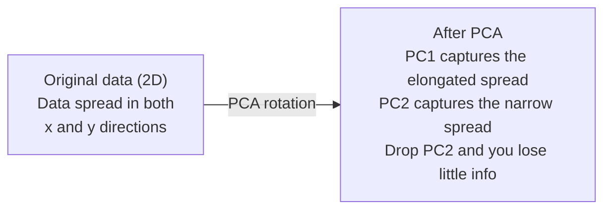

# 降维

> 高维数据有结构；从正确角度观察便能发现它。

**类型：** 实作  
**学习实现：** Python  
**前置课程：** Phase 1 · 第 01、02、03、06 课  
**预计学习：** 约 90 分钟

## 学习目标

- 从零实现 PCA：中心化、协方差、特征分解、投影。
- 用解释方差比与 elbow 方法选择主成分数。
- 比较 PCA、t-SNE、UMAP 的二维 MNIST 可视化取舍。
- 用 RBF kernel PCA 将普通 PCA 无法分开的非线性结构分离。

## 问题

一张手写数字有 784 像素，基因表达和用户行为也可有数百特征，既不能可视化也难直觉理解。但多数特征冗余：一个“7”主要由笔画角度、横杠长度、倾斜等少数因素决定，其余是噪声。降维把 784 维压到 2、10 或 50 维，同时保留重要结构。

## 概念

### 维度灾难

维度升高会令距离失去区分力：随机点最大/最小距离比例大约从 2D 的 5.0 降至 10D 的 1.8、100D 的 1.2、1000D 的 1.02；最近邻不再可靠。单位超立方体有 2^d 个角，100D 中几乎所有体积集中在远离中心的角落。维度从 2 到 20，维持相同样本密度需约 10^18 倍数据；降低维数把密度带回可用范围。

### PCA：寻找重要方向 <!-- learning-atlas: pca-find-the-directions-that-matter -->

PCA 旋转坐标轴，使第一轴承载最大方差、第二轴承载次大方差。步骤为：(1) 每列减均值；(2) 计算特征共同变化的协方差；(3) 对对称半正定协方差矩阵特征分解；(4) 按特征值降序；(5) 保留前 k 个特征向量并投影。协方差的正交特征向量给特征空间方向，特征值给该方向捕获的方差；最大特征值对应最大伸展方向。丢弃窄方向 PC2 就是以很小信息损失投到 PC1。

### 解释方差比

component 的 explained ratio=eigenvalue_k/sum(all eigenvalues)。例中 PC1=4.73、ratio=.473；PC2=2.51、.251，累计 .724；PC3=1.12、.112，累计 .836；PC4=.89、.089，累计 .925。

### 选择成分数

可取累计 90–95% 阈值；画逐 component 方差找陡降 elbow；或作为预处理扫描 k，以模型准确率平台为准。

### t-SNE：保持邻域

t-SNE 为可视化而设计：先把高维点对距离转为概率，近点概率高，再寻求相同邻域概率的 2D/3D 布局。它非线性、随机、perplexity 通常 5–50、输出簇间距离无意义且默认 O(n^2)，适合小于 10k 样本的图，不应用作分类前预处理。

### UMAP：更快且保留更好的全局结构

UMAP 同样保持邻域，但用近似最近邻图，速度更快，簇的相对全局位置通常也更有意义。n_neighbors 决定局部/全局范围（高值保留更多全局结构），min_dist 决定输出簇紧密程度（低值更密）。

### 何时使用哪一种

| 方法 | 用途 | 保留内容 | 速度 |
|---|---|---|---|
| PCA | 训练前预处理、压缩、快速探索 | 全局线性方差 | 快，可达百万样本 |
| t-SNE | 高质量 2D 图 | 局部邻域 | 慢，<10k 理想 |
| UMAP | 大规模 2D 可视化 | 局部及部分全局 | 中等，可达百万 |
| t-SNE/UMAP | 理解簇 | 簇分离 | 中慢 |

### Kernel PCA

普通 PCA 只找线性子空间；同心圆投向任一直线都会重叠。Kernel PCA 用 kernel 隐式映射到高维特征空间，不显式计算坐标：先取 K_ij=k(x_i,x_j)，在特征空间中心化 K，特征分解，前向量按 1/sqrt(eigenvalue) 缩放。RBF=exp(-gamma*||x-y||^2) 适合平滑非线性流形；Polynomial=(x·y+c)^d 适合多项式关系；Sigmoid=tanh(alpha*x·y+c) 类似神经网络映射。

标准 PCA 在速度、可解释性、可扩展性和直接 inverse transform 上占优；kernel PCA 适用于非线性流形，却需 n*n kernel、O(n^2d+n^3)，成分不直接解释且逆变换要 pre-image 近似。RBF kernel PCA 可把内外圆映射到可线性分隔区域。

### 重建误差

重建先算 `X_reduced=X@W_k`，再算 `X_hat=X_reduced@W_k^T`，MSE=`mean((X-X_hat)^2)`。PCA 中重建误差是所有丢弃特征值之和；高重建误差样本不适合已学子空间，因而可用于生产异常检测。

## 动手实现

下列 Build/Use 上游代码块逐字保留；reference_dim_reduction.py 逐字保留完整实现。MNIST、scikit-learn 与 UMAP 示例依赖可选网络/第三方包；离线环境可运行 synthetic、kernel PCA 和 reconstruction 示例。

```
Dimension    Avg distance ratio (max/min between random points)
2            ~5.0
10           ~1.8
100          ~1.2
1000         ~1.02
```

```
1. Center the data        (subtract the mean from each feature)
2. Compute covariance     (how features move together)
3. Eigendecomposition     (find the principal directions)
4. Sort by eigenvalue     (biggest variance first)
5. Project               (keep top k eigenvectors, drop the rest)
```



```
Component    Eigenvalue    Explained ratio    Cumulative
PC1          4.73          0.473              0.473
PC2          2.51          0.251              0.724
PC3          1.12          0.112              0.836
PC4          0.89          0.089              0.925
...
```

```
Reconstruction error = sum of eigenvalues NOT included
Total variance = sum of ALL eigenvalues
Fraction lost = (sum of dropped eigenvalues) / (sum of all eigenvalues)
```

```
explained_ratio_k = eigenvalue_k / sum(all eigenvalues)
```

```figure
pca-axes
```

### 步骤 1：从零实现 PCA

```python
import numpy as np

class PCA:
    def __init__(self, n_components):
        self.n_components = n_components
        self.components = None
        self.mean = None
        self.eigenvalues = None
        self.explained_variance_ratio_ = None

    def fit(self, X):
        self.mean = np.mean(X, axis=0)
        X_centered = X - self.mean

        cov_matrix = np.cov(X_centered, rowvar=False)

        eigenvalues, eigenvectors = np.linalg.eigh(cov_matrix)

        sorted_idx = np.argsort(eigenvalues)[::-1]
        eigenvalues = eigenvalues[sorted_idx]
        eigenvectors = eigenvectors[:, sorted_idx]

        self.components = eigenvectors[:, :self.n_components].T
        self.eigenvalues = eigenvalues[:self.n_components]
        total_var = np.sum(eigenvalues)
        self.explained_variance_ratio_ = self.eigenvalues / total_var

        return self

    def transform(self, X):
        X_centered = X - self.mean
        return X_centered @ self.components.T

    def fit_transform(self, X):
        self.fit(X)
        return self.transform(X)
```

### 步骤 2：在合成数据上测试

```python
np.random.seed(42)
n_samples = 500

t = np.random.uniform(0, 2 * np.pi, n_samples)
x1 = 3 * np.cos(t) + np.random.normal(0, 0.2, n_samples)
x2 = 3 * np.sin(t) + np.random.normal(0, 0.2, n_samples)
x3 = 0.5 * x1 + 0.3 * x2 + np.random.normal(0, 0.1, n_samples)

X_synthetic = np.column_stack([x1, x2, x3])

pca = PCA(n_components=2)
X_reduced = pca.fit_transform(X_synthetic)

print(f"Original shape: {X_synthetic.shape}")
print(f"Reduced shape:  {X_reduced.shape}")
print(f"Explained variance ratios: {pca.explained_variance_ratio_}")
print(f"Total variance captured: {sum(pca.explained_variance_ratio_):.4f}")
```

### 步骤 3：二维 MNIST 数字

```python
from sklearn.datasets import fetch_openml

mnist = fetch_openml("mnist_784", version=1, as_frame=False, parser="auto")
X_mnist = mnist.data[:5000].astype(float)
y_mnist = mnist.target[:5000].astype(int)

pca_mnist = PCA(n_components=50)
X_pca50 = pca_mnist.fit_transform(X_mnist)
print(f"50 components capture {sum(pca_mnist.explained_variance_ratio_):.2%} of variance")

pca_2d = PCA(n_components=2)
X_pca2d = pca_2d.fit_transform(X_mnist)
print(f"2 components capture {sum(pca_2d.explained_variance_ratio_):.2%} of variance")
```

### 步骤 4：与 sklearn 比较

```python
from sklearn.decomposition import PCA as SklearnPCA
from sklearn.manifold import TSNE

sklearn_pca = SklearnPCA(n_components=2)
X_sklearn_pca = sklearn_pca.fit_transform(X_mnist)

print(f"\nOur PCA explained variance:     {pca_2d.explained_variance_ratio_}")
print(f"Sklearn PCA explained variance: {sklearn_pca.explained_variance_ratio_}")

diff = np.abs(np.abs(X_pca2d) - np.abs(X_sklearn_pca))
print(f"Max absolute difference: {diff.max():.10f}")

tsne = TSNE(n_components=2, perplexity=30, random_state=42)
X_tsne = tsne.fit_transform(X_mnist)
print(f"\nt-SNE output shape: {X_tsne.shape}")
```

### 步骤 5：UMAP 比较

```python
try:
    from umap import UMAP

    reducer = UMAP(n_components=2, n_neighbors=15, min_dist=0.1, random_state=42)
    X_umap = reducer.fit_transform(X_mnist)
    print(f"UMAP output shape: {X_umap.shape}")
except ImportError:
    print("Install umap-learn: pip install umap-learn")
```

## 使用

PCA 也可作为分类器的预处理；将训练与测试数据分别按训练集拟合的成分变换。

```python
from sklearn.decomposition import PCA as SklearnPCA
from sklearn.linear_model import LogisticRegression
from sklearn.model_selection import train_test_split
from sklearn.metrics import accuracy_score

X_train, X_test, y_train, y_test = train_test_split(
    X_mnist, y_mnist, test_size=0.2, random_state=42
)

results = {}
for k in [10, 30, 50, 100, 200]:
    pca_k = SklearnPCA(n_components=k)
    X_tr = pca_k.fit_transform(X_train)
    X_te = pca_k.transform(X_test)

    clf = LogisticRegression(max_iter=1000, random_state=42)
    clf.fit(X_tr, y_train)
    acc = accuracy_score(y_test, clf.predict(X_te))
    var_captured = sum(pca_k.explained_variance_ratio_)
    results[k] = (acc, var_captured)
    print(f"k={k:>3d}  accuracy={acc:.4f}  variance={var_captured:.4f}")
```

## 交付

上游输出 `outputs/skill-dimensionality-reduction.md` 用于选择降维技术。

## 练习

1. 给 PCA 写 `inverse_transform`，比较 10、50、200 components 的 MNIST MSE。
2. 将 t-SNE `perplexity` 设为 5、30、100，比较簇紧密度。
3. 对 50 特征但仅 5 informative 的 `make_classification` 数据，检查解释方差曲线。

## 术语

| 术语 | 常用说法 | 准确定义 |
|---|---|---|
| 维度灾难 | “特征太多” | 距离、体积和样本密度随维度反直觉，需指数级数据。 |
| PCA | “降维” | 旋转至最大方差轴并丢弃低方差轴。 |
| 主成分 | “重要方向” | 协方差矩阵特征向量，沿其数据方差最大。 |
| 解释方差比 | “component 有多少信息” | 一个主成分捕获的总方差分数。 |
| 协方差矩阵 | “特征如何相关” | (i,j) 衡量特征共同变化的对称矩阵，对角为方差。 |
| t-SNE | “那个簇图” | 保持点对邻域概率的非线性二维映射，只宜可视化。 |
| UMAP | “更快的 t-SNE” | 基于拓扑表示、兼顾局部和部分全局结构的方法。 |
| Perplexity | “t-SNE 调钮” | 每点有效邻居数；低值极局部，高值范围更广。 |
| 流形 | “数据所在曲面” | 嵌在高维空间的低维曲面，如 3D 中揉皱的纸仍是 2D。 |

## 延伸阅读

- [Shlens：A Tutorial on Principal Component Analysis](https://arxiv.org/abs/1404.1100)
- [Wattenberg et al.：How to Use t-SNE Effectively](https://distill.pub/2016/misread-tsne/)
- [UMAP documentation](https://umap-learn.readthedocs.io/)

**使用 PCA 训练分类器。**

把 MNIST 划分训练/测试集后，对 k=10、30、50、100、200 依次在训练集拟合 PCA、变换两部分数据，再训练 LogisticRegression，并记录 accuracy 与累计解释方差。性能常在远少于 784 维时进入平台；那个 accuracy 不再显著提高的 k 就是实际运行点，而不是“方差百分比等于准确率”。

**交付物、练习与原始资源。**

交付物是上游 outputs/skill-dimensionality-reduction.md：按任务选择技术的指南。完整练习要求：(1) 修改 PCA 加 inverse_transform，重建 10、50、200 component 的 MNIST 并打印 MSE；(2) 在同一子集试 t-SNE perplexity=5、30、100，描述簇紧密度为何随有效邻居数而变；(3) 生成 50 feature、仅 5 informative 的 make_classification 数据，检查解释方差曲线是否辨认其有效 5 维。

补充术语：Kernel PCA 是以 kernel 的 Gram 矩阵完成特征空间 PCA；重建误差是原数据和 inverse transform 的均方差；elbow 是累计方差收益开始递减的拐点；n_neighbors 是 UMAP 定义局部图的近邻数量；min_dist 是 UMAP 输出点之间容许的最近间距。

原始延伸阅读：
- [Shlens：A Tutorial on Principal Component Analysis](https://arxiv.org/abs/1404.1100)
- [Wattenberg et al.：How to Use t-SNE Effectively](https://distill.pub/2016/misread-tsne/)
- [UMAP documentation](https://umap-learn.readthedocs.io/)
