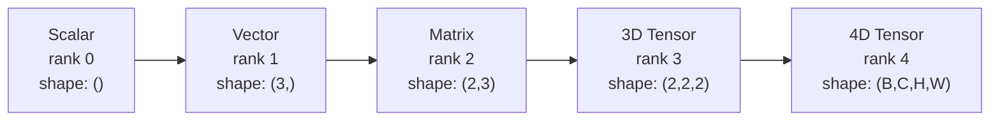
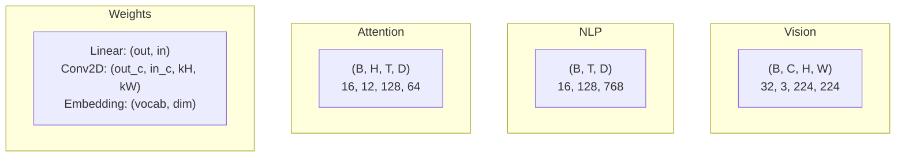
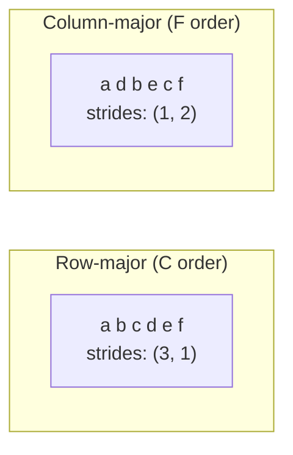
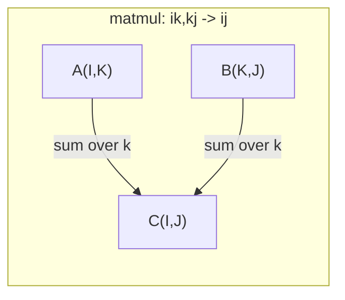

# 张量运算

> 张量是数据和深度学习的共同语言：每张图、每个句子、每个梯度都在其中流动。

**类型：** 实作  
**学习实现：** Python  
**前置课程：** Phase 1 · 第 01–02 课  
**预计学习：** 约 90 分钟

## 学习目标

- 从零写出有 shape、strides、reshape、transpose 和逐元素操作的张量类。
- 以广播规则在不复制数据下操作不同 shape 的张量。
- 用 einsum 表达点积、矩阵乘、外积与批处理操作。
- 逐步追踪 multi-head attention 的所有精确形状。

## 问题

Transformer 的一次前向可能报错 mat1 and mat2 shapes cannot be multiplied (32x768 and 512x768)，一个 transpose 又报需要 4D 却得到 3D；shape bug 是深度学习最常见问题。每项操作有明确 shape contract，数十个 reshape、transpose、broadcast 串联时一条错误轴会级联，甚至沿错误维广播而静默产生垃圾结果。32 张 RGB 224×224 图像是 (32,3,224,224)，12-head attention 是 (batch,heads,seq_len,head_dim)；掌握张量使这些错误可直接调试。

## 概念

### 什么是张量 <!-- learning-atlas: what-a-tensor-is -->

张量是统一 dtype 的多维数值数组；rank/order 是轴数，axis 是一维，shape 列各轴大小。scalar rank 0 shape ()；vector rank 1 shape (3,)；matrix rank 2 shape (2,3)；(2,3,4) 总元素为 24。视觉惯例 (B,C,H,W)，NLP (B,T,D)，attention (B,H,T,D_head)；Linear 权重 (out,in)，Conv2D (out_c,in_c,kH,kW)，Embedding (vocab,dim)。PyTorch 默认 NCHW（channels-first），TensorFlow 默认 NHWC（channels-last），混淆会报错或无声变慢。

### 深度学习中的张量形状

批次、通道、序列长度和特征维共同构成模型接口；在每一步注明 shape 才能避免把维度解释错位。

### 内存布局如何工作

二维数组在内存是一维序列，stride 是沿轴走一步要跳过的元素数；row-major (3,1)，column-major (1,2)。transpose 交换 stride 而不移动数据，导致 non-contiguous。reshape 不改变元素顺序且总元素不变，-1 可推断一维；squeeze 去 size=1 轴，unsqueeze 插入轴，如 (D,) bias 在 (B,T,D) 上先变 (1,1,D)。transpose 交换两个轴，permute 重排全部轴，用于 NCHW/NHWC；PyTorch 非连续 tensor 的 view 会失败，应 reshape 或 contiguous。

逐元素 add/multiply/subtract 保 shape；reduction sum/mean/max 沿轴折叠。CNN 的 (B,C,H,W).mean(axis=[2,3]) 是 (B,C) global average pooling，NLP 的 (B,T,D).mean(axis=1) 是 (B,D) sequence pooling。

### 广播 <!-- learning-atlas: broadcasting-rules -->

从右对齐 shape；两轴相等或有一个为 1 则兼容，较少维数左补 1。A=(8,1,6,1)，B=(7,1,5) 补为 (1,7,1,5)，输出 (8,7,6,5)。例子包括 (4,3) activations+bias(3,)，(2,3,4,4) images 乘 reshape(1,3,1,1) channel scale，(3,1)*(1,4) 得 (3,4) outer product。pairwise distance 以 (M,1,2)-(1,N,2) 得 (M,N,2)，平方/沿末轴求和开根后为 (M,N)。

### Einsum 与 attention <!-- learning-atlas: einsum-the-universal-tensor-operation -->

Einstein 标签每条轴；输入中出现而输出缺失的标签被求和，同时出现的保留。常用 i,i-> 点积；i,j->ij 外积；ii-> trace；ij->ji 转置；bij,bjk->bik batch matmul；bhtd,bhsd->bhts attention scores。bij,bjk->bik 若 B=32,I=128,J=64,K=128，成本为 32*128*64*128=33,554,432 multiply-adds。

multi-head attention：X=(B,T,E)，E=H*D；以 bte,ek->btk 投影 Q/K/V，reshape(B,T,H,D) 再 transpose 到 (B,H,T,D)；scores=bhtd,bhsd->bhts/sqrt(D) 为 (B,H,T,T)，softmax 沿最后一轴；weights 与 V 的 bhts,bhsd->bhtd 得输出；transpose 回 (B,T,H,D)、reshape (B,T,E)，最后输出投影 bte,ek->btk。每一步都必须符合这份 shape trace。

## 动手实现

以下上游 Build/Use 代码块逐字保留；完整 Python 实现在 `code/tensors.py`，各步骤均对应其中的实现。







```
Tensor A:     (8, 1, 6, 1)
Tensor B:        (7, 1, 5)
Padded B:     (1, 7, 1, 5)
Result:       (8, 7, 6, 5)
```



```figure
tensor-broadcast
```

### 步骤 1：张量存储与步幅

```python
class Tensor:
    def __init__(self, data, shape=None):
        if isinstance(data, (list, tuple)):
            self._data, self._shape = self._flatten_nested(data)
        elif isinstance(data, np.ndarray):
            self._data = data.flatten().tolist()
            self._shape = tuple(data.shape)
        else:
            self._data = [data]
            self._shape = ()

        if shape is not None:
            total = reduce(lambda a, b: a * b, shape, 1)
            if total != len(self._data):
                raise ValueError(
                    f"Cannot reshape {len(self._data)} elements into shape {shape}"
                )
            self._shape = tuple(shape)

        self._strides = self._compute_strides(self._shape)

    @staticmethod
    def _compute_strides(shape):
        if len(shape) == 0:
            return ()
        strides = [1] * len(shape)
        for i in range(len(shape) - 2, -1, -1):
            strides[i] = strides[i + 1] * shape[i + 1]
        return tuple(strides)
```

### 步骤 2：reshape、squeeze 与 unsqueeze

```python
t = Tensor(list(range(12)), shape=(2, 6))
r = t.reshape((3, 4))
r = t.reshape((-1, 3))
```

```python
t = Tensor(list(range(6)), shape=(1, 3, 1, 2))
s = t.squeeze()
v = Tensor([1, 2, 3])
u = v.unsqueeze(0)
```

### 步骤 3：transpose 与 permute

```python
mat = Tensor(list(range(6)), shape=(2, 3))
tr = mat.transpose(0, 1)

t4d = Tensor(list(range(24)), shape=(1, 2, 3, 4))
perm = t4d.permute((0, 2, 3, 1))
```

### 步骤 4：逐元素运算与归约

```python
a = Tensor([[1, 2], [3, 4]])
b = Tensor([[10, 20], [30, 40]])
c = a + b
d = a * 2
s = a.sum(axis=0)
```

### 步骤 5：使用 NumPy 广播

```python
activations = np.random.randn(4, 3)
bias = np.array([0.1, 0.2, 0.3])
result = activations + bias

images = np.random.randn(2, 3, 4, 4)
scale = np.array([0.5, 1.0, 1.5]).reshape(1, 3, 1, 1)
result = images * scale

a = np.array([1, 2, 3]).reshape(-1, 1)
b = np.array([10, 20, 30, 40]).reshape(1, -1)
outer = a * b
```

### 步骤 6：einsum 运算

```python
a = np.array([1.0, 2.0, 3.0])
b = np.array([4.0, 5.0, 6.0])
dot = np.einsum("i,i->", a, b)

A = np.array([[1, 2], [3, 4], [5, 6]], dtype=float)
B = np.array([[7, 8, 9], [10, 11, 12]], dtype=float)
matmul = np.einsum("ik,kj->ij", A, B)

batch_A = np.random.randn(4, 3, 5)
batch_B = np.random.randn(4, 5, 2)
batch_mm = np.einsum("bij,bjk->bik", batch_A, batch_B)
```

### 步骤 7：通过 einsum 实现注意力

```python
B, H, T, D = 2, 4, 8, 16
E = H * D

X = np.random.randn(B, T, E)
W_q = np.random.randn(E, E) * 0.02

Q = np.einsum("bte,ek->btk", X, W_q)
Q = Q.reshape(B, T, H, D).transpose(0, 2, 1, 3)

scores = np.einsum("bhtd,bhsd->bhts", Q, K) / np.sqrt(D)
weights = softmax(scores, axis=-1)
attn_output = np.einsum("bhts,bhsd->bhtd", weights, V)

concat = attn_output.transpose(0, 2, 1, 3).reshape(B, T, E)
output = np.einsum("bte,ek->btk", concat, W_o)
```

## 使用

### 从零实现与 NumPy

| 操作 | Scratch（Tensor 类） | NumPy |
|---|---|---|
| 创建 | `Tensor([[1,2],[3,4]])` | `np.array([[1,2],[3,4]])` |
| Reshape | `t.reshape((3,4))` | `a.reshape(3,4)` |
| Transpose | `t.transpose(0,1)` | `a.T` 或 `a.transpose(0,1)` |
| Squeeze | `t.squeeze(0)` | `np.squeeze(a, 0)` |
| Sum | `t.sum(axis=0)` | `a.sum(axis=0)` |
| Einsum | 不适用 | `np.einsum("ij,jk->ik", a, b)` |

### 从零实现与 PyTorch

```python
import torch

t = torch.tensor([[1, 2, 3], [4, 5, 6]], dtype=torch.float32)
t.shape
t.stride()
t.is_contiguous()

t.reshape(3, 2)
t.unsqueeze(0)
t.transpose(0, 1)
t.transpose(0, 1).contiguous()

torch.einsum("ik,kj->ij", A, B)
```

### 每个神经网络层都是张量运算

PyTorch 增加 autograd、GPU 支持和优化的 BLAS kernel，但 shape 语义相同；理解 Scratch 版本后，PyTorch 的 shape 报错就变得可读。常见层都能写成张量操作：

| 操作 | 张量形式 | Einsum |
|---|---|---|
| Linear 层 | `Y = X @ W.T + b` | `"bd,od->bo"` + bias |
| Attention QKV | `Q = X @ W_q` | `"btd,dh->bth"` |
| Attention scores | `Q @ K.T / sqrt(d)` | `"bhtd,bhsd->bhts"` |
| Attention output | `softmax(scores) @ V` | `"bhts,bhsd->bhtd"` |
| Batch norm | `(X - mu) / sigma * gamma` | 逐元素运算 + 广播 |
| Softmax | `exp(x) / sum(exp(x))` | 逐元素运算 + 归约 |

## 交付

本课产出两个可复用提示：

1. **`outputs/prompt-tensor-shapes.md`** —— 系统化调试 tensor shape mismatch 的提示，包含 matmul、broadcast、cat、Linear、Conv2d、BatchNorm、softmax 等常见操作的决策表，以及修复查找表。
2. **`outputs/prompt-tensor-debugger.md`** —— shape 错误阻塞时粘贴给任意 AI 助手的逐步调试提示；提供错误消息和张量 shape，即可得到精确修复方案。

## 练习

1. **Easy——Reshape 往返。** 取 `(2, 3, 4)` 张量，依次 reshape 为 `(6, 4)`、`(24,)`，再还原为 `(2, 3, 4)`；每一步打印扁平数据，验证元素顺序保持不变。
2. **Medium——实现广播。** 为 `Tensor` 增加 `broadcast_to(shape)`，将 size 为 1 的轴扩展到目标 shape；修改 `_elementwise_op` 以便运算前自动广播。用 `(3, 1)` 与 `(1, 4)` 测试，结果应为 `(3, 4)`。
3. **Hard——从零构建 einsum。** 实现基础 `einsum(subscripts, *tensors)`，至少支持点积（`i,i->`）、矩阵乘（`ij,jk->ik`）、外积（`i,j->ij`）和转置（`ij->ji`）。解析下标字符串，识别 contraction 轴，遍历所有索引组合；与 `np.einsum` 对比结果。
4. **Hard——Attention shape tracker。** 编写函数接收 `batch_size`、`seq_len`、`embed_dim`、`num_heads`，打印 multi-head attention 每一步的精确 shape：输入、Q/K/V 投影、head split、attention scores、softmax weights、加权和、head merge、输出投影；与 `demo_attention_einsum()` 输出核对。

## 术语

| 术语 | 常用说法 | 准确定义 |
|---|---|---|
| 张量 | “更多维的矩阵” | 具有统一类型、shape、stride 和操作的多维数组。 |
| Rank | “维度数” | 轴的数目；矩阵 rank=2（不指矩阵秩）。 |
| Shape | “张量大小” | 每轴大小元组。 |
| Stride | “内存布局” | 沿每一轴前进一个逻辑位置跳过的元素数。 |
| 广播 | “shape 不同也能算” | 右对齐后维度相等或其中一方为 1 的严格规则。 |
| Contiguous | “正常内存” | 元素在物理内存连续、没有 stride 重排。 |
| Einsum | “高级 matmul” | 统一表达 contraction、outer、trace、transpose 的指标记法。 |
| View | “等于 reshape” | 共用数据缓冲但改变 shape/stride 的视图，非连续时会失败。 |
| Contraction | “对指标求和” | 共享指标相乘再求和，结果 rank 降低。 |
| NCHW/NHWC | “PyTorch/TensorFlow 格式” | 图像轴次序约定，channels 分别在空间轴前/后。 |

## 延伸阅读

- [NumPy Broadcasting](https://numpy.org/doc/stable/user/basics.broadcasting.html)
- [PyTorch Tensor Views](https://pytorch.org/docs/stable/tensor_view.html)
- [einops](https://github.com/arogozhnikov/einops)
- [The Illustrated Transformer](https://jalammar.github.io/illustrated-transformer/)
- [NumPy einsum](https://numpy.org/doc/stable/reference/generated/numpy.einsum.html)
