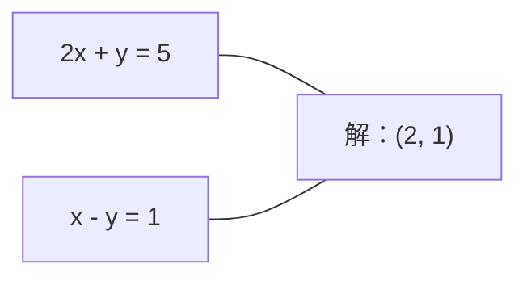
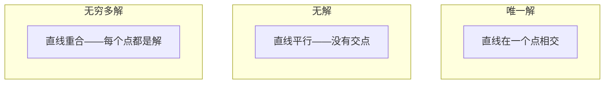

# 线性方程组

> 求解 Ax = b，是数学中最古老、却依然在驱动你的神经网络的问题。

**类型：** 实作
**语言：** Python
**先修课：** 第一阶段，第 01 课（线性代数直觉）、第 02 课（向量与矩阵）、第 03 课（矩阵变换）
**预计时间：** 约 120 分钟

## 学习目标

- 使用带部分主元选取（partial pivoting）和回代（back substitution）的高斯消元法求解 Ax = b
- 以 LU、QR 和 Cholesky 分解矩阵，并说明各自适用的情形
- 推导最小二乘的正规方程，并将它与线性回归和岭回归联系起来
- 用条件数诊断病态方程组，并应用正则化使其稳定

## 问题

每当你训练线性回归，都会求解一个线性方程组。每当你计算最小二乘拟合，都会求解一个线性方程组。每当神经网络的一层计算 `y = Wx + b`，它都在计算线性方程组的一侧。加入正则化时，你修改了这个方程组。使用高斯过程时，你在分解矩阵。为 Mahalanobis 距离求协方差矩阵的逆时，你在求解线性方程组。

方程 Ax = b 无处不在。A 是已知系数构成的矩阵，b 是已知输出构成的向量，x 是你要寻找的未知量向量。在线性回归中，A 是数据矩阵，b 是目标向量，x 是权重向量。整个模型可归结为：找到一个 x，使 Ax 尽可能接近 b。

本课从零构建求解该方程的所有主要方法。你将理解：为什么有的方法很快而有的方法很稳定；为什么有的只适用于方阵，有的能够处理超定系统；以及为什么矩阵的条件数决定了答案是否有意义。

## 概念

### Ax = b 的几何含义

线性方程组具有几何解释。每个方程定义一个超平面；解是所有超平面的交点（或交集）。

```
2x + y = 5          二维空间中的两条直线。
x - y  = 1          它们在 x=2、y=1 处相交。
```



可能出现三种情形：



用矩阵语言说，“唯一解”表示 A 可逆；“无解”表示方程组不一致；“无穷多解”表示 A 有零空间（null space）。多数机器学习问题属于“没有精确解”，因为方程（数据点）多于未知量（参数）。这正是最小二乘发挥作用的地方。

### 列图像与行图像

理解 Ax = b 有两种方式。

**行图像（row picture）。** A 的每一行定义一个方程，每个方程都是一个超平面；解是它们全都相交的位置。

**列图像（column picture）。** A 的每一列是一个向量。问题变成：A 的列向量怎样线性组合才能得到 b？

```
A = | 2  1 |    b = | 5 |
    | 1 -1 |        | 1 |

行图像：同时求解 2x + y = 5 与 x - y = 1。

列图像：找出 x1、x2，使得：
  x1 * [2, 1] + x2 * [1, -1] = [5, 1]
  2 * [2, 1] + 1 * [1, -1] = [4+1, 2-1] = [5, 1]   验证。
```

列图像更为根本。若 b 位于 A 的列空间中，方程组就有解；若 b 不在其中，就寻找列空间内与 b 最近的点。这个最近点就是最小二乘解。

### 高斯消元法

高斯消元将 Ax = b 变换为上三角方程组 Ux = c，再通过回代求解。这是最直接的方法。

算法如下：

```
1. 对每一列 k（主元列）：
   a. 在第 k 行及其下方寻找第 k 列中绝对值最大的元素（部分主元选取）。
   b. 将该行与第 k 行交换。
   c. 对 k 下方的每一行 i：
      - 计算倍数 m = A[i][k] / A[k][k]
      - 用第 k 行的 m 倍减去第 i 行。
2. 回代：从最后一个方程向上求解。
```

示例：

```
原始方程组：
| 2  1  1 | 8 |       R2 = R2 - (2)R1     | 2  1   1 |  8 |
| 4  3  3 |20 |  -->  R3 = R3 - (1)R1 --> | 0  1   1 |  4 |
| 2  3  1 |12 |                            | 0  2   0 |  4 |

                       R3 = R3 - (2)R2     | 2  1   1 |  8 |
                                       --> | 0  1   1 |  4 |
                                           | 0  0  -2 | -4 |

回代：
  -2 * x3 = -4    -->  x3 = 2
  x2 + 2  = 4     -->  x2 = 2
  2*x1 + 2 + 2 = 8 --> x1 = 2
```

高斯消元需要 O(n^3) 次运算。对一个 1000×1000 的方程组，这大约是十亿次浮点运算。它很快；但若需用同一个 A 求解多个方程组，还能做得更好。

### 部分主元选取：为何重要

没有主元选取时，高斯消元可能失败或产生错误结果。主元为零时会发生除零；主元很小时，舍入误差会被放大。

```
不良主元：                       使用部分主元选取：
| 0.001  1 | 1.001 |            先交换两行：
| 1      1 | 2     |            | 1      1 | 2     |
                                 | 0.001  1 | 1.001 |

m = 1/0.001 = 1000              m = 0.001/1 = 0.001
R2 = R2 - 1000*R1               R2 = R2 - 0.001*R1
| 0.001  1     | 1.001   |      | 1      1     | 2     |
| 0     -999   | -999.0  |      | 0      0.999 | 0.999 |

x2 = 1.000（正确）              x2 = 1.000（正确）
x1 = (1.001 - 1)/0.001          x1 = (2 - 1)/1 = 1.000（正确）
   = 0.001/0.001 = 1.000        稳定，因为倍数很小。
```

在精度有限的浮点运算中，不选主元的版本可能损失有效数字。部分主元选取始终选择可用的最大主元，以尽量减小误差放大。

### LU 分解

LU 分解将 A 分解为下三角矩阵 L 和上三角矩阵 U：A = LU。L 存储高斯消元中的倍数，U 是消元后的结果。

```
A = L @ U

| 2  1  1 |   | 1  0  0 |   | 2  1   1 |
| 4  3  3 | = | 2  1  0 | @ | 0  1   1 |
| 2  3  1 |   | 1  2  1 |   | 0  0  -2 |
```

为何分解而不只做消元？因为一旦得到 L 和 U，对任意新的 b 求解 Ax = b 只需 O(n^2)：

```
Ax = b
LUx = b
令 y = Ux：
  Ly = b    （前代，O(n^2)）
  Ux = y    （回代，O(n^2)）
```

O(n^3) 的成本只在分解时支付一次，之后每次求解都是 O(n^2)。若要对相同的 A、不同的 b 向量求解 1000 个方程组，LU 可将总工作量节省约 1000/3 倍。

带部分主元选取时，得到 PA = LU，其中 P 是记录行交换的置换矩阵。

### QR 分解

QR 分解把 A 分解为正交矩阵 Q 与上三角矩阵 R：A = QR。

正交矩阵满足 Q^T Q = I，其列为标准正交向量。左乘 Q 会保持长度与角度。

```
A = Q @ R

Q 的列标准正交：Q^T Q = I
R 是上三角矩阵

求解 Ax = b：
  QRx = b
  Rx = Q^T b    （只需乘以 Q^T，无须求逆）
  通过回代得到 x。
```

对最小二乘问题，QR 在数值上比 LU 更稳定。Gram–Schmidt 过程逐列构建 Q：

```
给定 A 的列 a1、a2、...：

q1 = a1 / ||a1||

q2 = a2 - (a2 . q1) * q1        （减去在 q1 上的投影）
q2 = q2 / ||q2||                （归一化）

q3 = a3 - (a3 . q1) * q1 - (a3 . q2) * q2
q3 = q3 / ||q3||

R["i"][j] = qi . aj    当 i <= j
```

每一步都移除沿所有此前 q 向量的分量，只留下新的正交方向。

### Cholesky 分解

当 A 是对称矩阵（A = A^T）且正定（所有特征值为正）时，可将它分解为 A = L L^T，其中 L 为下三角矩阵，这种分解称为 Cholesky 分解。

```
A = L @ L^T

| 4  2 |   | 2  0 |   | 2  1 |
| 2  5 | = | 1  2 | @ | 0  2 |

L["i"][i] = sqrt(A[i][i] - sum(L[i][k]^2 for k < i))
L[i][j] = (A[i][j] - sum(L[i][k]*L[j][k] for k < j)) / L[j][j]    for i > j
```

Cholesky 的速度约为 LU 的两倍，存储需求约为一半。它只能处理对称正定矩阵，但这类矩阵频繁出现：

- 协方差矩阵是对称半正定的（加入正则化后为正定）。
- 高斯过程中的核矩阵是对称正定的。
- 凸函数在极小点处的 Hessian 矩阵是对称正定的。
- A^T A 始终是对称半正定的。

在高斯过程中，将核矩阵 K 作 Cholesky 分解，然后求解 K alpha = y，便可得到预测均值。Cholesky 因子还能给出边际似然所需的对数行列式：log det(K) = 2 * sum(log(diag(L)))。

### 最小二乘：当 Ax = b 没有精确解时

若 A 为 m×n 矩阵且 m > n（方程多于未知量），该方程组为超定系统，通常没有精确解。此时改为最小化平方误差：

```
minimize ||Ax - b||^2

这是残差平方和：
  sum((A[i,:] @ x - b[i])^2 for i in range(m))
```

最小值点满足正规方程：

```
A^T A x = A^T b
```

推导：展开 ||Ax - b||^2 = (Ax - b)^T (Ax - b) = x^T A^T A x - 2 x^T A^T b + b^T b。对 x 求梯度并令其为零：2 A^T A x - 2 A^T b = 0。

```
原始方程组（超定：4 个方程、2 个未知量）：
| 1  1 |         | 3 |
| 1  2 | x     = | 5 |       不存在一个精确的 x 同时满足全部 4 个方程。
| 1  3 |         | 6 |
| 1  4 |         | 8 |

正规方程：
A^T A = | 4  10 |    A^T b = | 22 |
        | 10 30 |            | 63 |

求解：x = [1.5, 1.7]

这给出线性回归：x[0] 是截距，x[1] 是斜率。
```

### 正规方程 = 线性回归

两者的联系完全等价。在线性回归中，数据矩阵 X 的每行对应一个样本，每列对应一个特征；目标向量 y 每个样本有一个元素。权重向量 w 满足：

```
X^T X w = X^T y
w = (X^T X)^(-1) X^T y
```

这给出线性回归的闭式解。每次调用 `sklearn.linear_model.LinearRegression.fit()` 都是在计算它，或借助 QR、SVD 的等价形式计算它。

在矩阵中加入正则项 lambda * I，就得到岭回归：

```
(X^T X + lambda * I) w = X^T y
w = (X^T X + lambda * I)^(-1) X^T y
```

正则化使矩阵的条件更好（更容易精确求逆），并通过把权重向零收缩来防止过拟合。当 lambda > 0 时，矩阵 X^T X + lambda * I 始终对称正定，因此可用 Cholesky 求解。

### 伪逆（Moore–Penrose）

伪逆 A+ 将矩阵求逆推广到非方阵和奇异矩阵。对任意矩阵 A：

```
x = A+ b

其中 A+ = V Sigma+ U^T    （通过 SVD 计算）
```

Sigma+ 的构造方式是：对每个非零奇异值取倒数，再将结果转置。若 A = U Sigma V^T，则 A+ = V Sigma+ U^T。

```
A = U Sigma V^T        （SVD）

Sigma = | 5  0 |       Sigma+ = | 1/5  0  0 |
        | 0  2 |                | 0  1/2  0 |
        | 0  0 |

A+ = V Sigma+ U^T
```

伪逆给出最小范数的最小二乘解。若方程组有：

- 唯一解：A+ b 给出该解。
- 无解：A+ b 给出最小二乘解。
- 无穷多解：A+ b 给出其中 ||x|| 最小的解。

NumPy 的 `np.linalg.lstsq` 和 `np.linalg.pinv` 都在内部使用 SVD。

### 条件数

条件数度量解对于输入微小变化的敏感程度。矩阵 A 的条件数为：

```
kappa(A) = ||A|| * ||A^(-1)|| = sigma_max / sigma_min
```

其中 sigma_max 和 sigma_min 分别为最大和最小奇异值。

```
良态（kappa ~ 1）：                病态（kappa ~ 10^15）：
b 的微小变化 -->                  b 的微小变化 -->
x 的微小变化                       x 的巨大变化

| 2  0 |   kappa = 2/1 = 2          | 1   1          |   kappa ~ 10^15
| 0  1 |   可安全求解                | 1   1+10^(-15) |   解毫无意义
```

经验规则：

- kappa < 100：安全，解较精确。
- kappa ~ 10^k：浮点运算会损失约 k 位有效数字。
- kappa ~ 10^16（对 float64）：解没有意义，矩阵可视为奇异矩阵。

在机器学习中，特征近乎共线时就会发生病态。正则化（加入 lambda * I）可将条件数从 sigma_max / sigma_min 改善为 (sigma_max + lambda) / (sigma_min + lambda)。

### 迭代方法：共轭梯度

对未知量达数百万的超大型稀疏系统，LU 或 Cholesky 等直接方法成本太高。迭代方法通过多次改进猜测值来逼近解。

当 A 对称正定时，共轭梯度法（conjugate gradient，CG）可求解 Ax = b。它在精确算术中至多 n 次迭代找到精确解；若特征值聚集，通常收敛得快得多。

```
算法概要：
  x0 = 初始猜测值（通常为零）
  r0 = b - A x0           （残差）
  p0 = r0                 （搜索方向）

  对 k = 0, 1, 2, ...：
    alpha = (rk . rk) / (pk . A pk)
    x_{k+1} = xk + alpha * pk
    r_{k+1} = rk - alpha * A pk
    beta = (r_{k+1} . r_{k+1}) / (rk . rk)
    p_{k+1} = r_{k+1} + beta * pk
    若 ||r_{k+1}|| < tolerance：停止
```

CG 的使用场景包括：

- 大规模优化（Newton-CG 方法）
- 求解偏微分方程（PDE）的离散化
- 无法直接分解大型核矩阵时的核方法
- 为其他迭代求解器构造预条件

收敛速度取决于条件数。条件越好，系统收敛越快；这也是正则化有帮助的另一原因。

### 全貌：何时选择哪种方法

| 方法 | 要求 | 成本 | 使用场景 |
|--------|-------------|------|----------|
| 高斯消元 | A 为非奇异方阵 | O(n^3) | 一次性求解方阵系统 |
| LU 分解 | A 为非奇异方阵 | O(n^3) 分解 + O(n^2) 求解 | 相同 A 的多次求解 |
| QR 分解 | 任意 A（m >= n） | O(mn^2) | 最小二乘，数值稳定 |
| Cholesky | A 对称正定 | O(n^3/3) | 协方差矩阵、高斯过程、岭回归 |
| 正规方程 | 超定（m > n） | O(mn^2 + n^3) | 线性回归（n 较小时） |
| SVD / 伪逆 | 任意 A | O(mn^2) | 秩亏方程组、最小范数解 |
| 共轭梯度 | A 对称正定且稀疏 | O(n * k * nnz) | 大型稀疏系统，k = 迭代次数 |

### 与机器学习的联系

本课的每一种方法都会在生产机器学习中出现：

**线性回归。** 闭式解要解正规方程 X^T X w = X^T y。可通过 Cholesky（n 较小时）、QR（需要数值稳定性时）或 SVD（矩阵可能秩亏时）完成。

**岭回归。** 向 X^T X 加入 lambda * I。正则化系统 `(X^T X + lambda * I) w = X^T y` 总能通过 Cholesky 求解，因为在 lambda > 0 时 X^T X + lambda * I 对称正定。

**高斯过程。** 预测均值需要求解 K alpha = y，其中 K 是核矩阵。对 K 做 Cholesky 分解是标准方法。对数边际似然使用 log det(K) = 2 sum(log(diag(L)))。

**神经网络初始化。** 正交初始化通过 QR 分解创建列标准正交的权重矩阵，这可防止深层网络中的信号坍缩。

**预条件。** 大规模优化器使用不完全 Cholesky 或不完全 LU，作为共轭梯度求解器的预条件器。

**特征工程。** X^T X 的条件数能表明特征是否共线。若 kappa 很大，应删除特征或加入正则化。

```figure
linear-system-conditioning
```

## 动手实现

### 步骤 1：带部分主元选取的高斯消元

```python
import numpy as np

def gaussian_elimination(A, b):
    n = len(b)
    Ab = np.hstack([A.astype(float), b.reshape(-1, 1).astype(float)])

    for k in range(n):
        max_row = k + np.argmax(np.abs(Ab[k:, k]))
        Ab[[k, max_row]] = Ab[[max_row, k]]

        if abs(Ab[k, k]) < 1e-12:
            raise ValueError(f"Matrix is singular or nearly singular at pivot {k}")

        for i in range(k + 1, n):
            m = Ab[i, k] / Ab[k, k]
            Ab[i, k:] -= m * Ab[k, k:]

    x = np.zeros(n)
    for i in range(n - 1, -1, -1):
        x[i] = (Ab[i, -1] - Ab[i, i+1:n] @ x[i+1:n]) / Ab[i, i]

    return x
```

### 步骤 2：LU 分解

```python
def lu_decompose(A):
    n = A.shape[0]
    L = np.eye(n)
    U = A.astype(float).copy()
    P = np.eye(n)

    for k in range(n):
        max_row = k + np.argmax(np.abs(U[k:, k]))
        if max_row != k:
            U[[k, max_row]] = U[[max_row, k]]
            P[[k, max_row]] = P[[max_row, k]]
            if k > 0:
                L[[k, max_row], :k] = L[[max_row, k], :k]

        for i in range(k + 1, n):
            L[i, k] = U[i, k] / U[k, k]
            U[i, k:] -= L[i, k] * U[k, k:]

    return P, L, U

def lu_solve(P, L, U, b):
    n = len(b)
    Pb = P @ b.astype(float)

    y = np.zeros(n)
    for i in range(n):
        y[i] = Pb[i] - L[i, :i] @ y[:i]

    x = np.zeros(n)
    for i in range(n - 1, -1, -1):
        x[i] = (y[i] - U[i, i+1:] @ x[i+1:]) / U[i, i]

    return x
```

### 步骤 3：Cholesky 分解

```python
def cholesky(A):
    n = A.shape[0]
    L = np.zeros_like(A, dtype=float)

    for i in range(n):
        for j in range(i + 1):
            s = A[i, j] - L[i, :j] @ L[j, :j]
            if i == j:
                if s <= 0:
                    raise ValueError("Matrix is not positive definite")
                L[i, j] = np.sqrt(s)
            else:
                L[i, j] = s / L[j, j]

    return L
```

### 步骤 4：通过正规方程求最小二乘

```python
def least_squares_normal(A, b):
    AtA = A.T @ A
    Atb = A.T @ b
    return gaussian_elimination(AtA, Atb)

def ridge_regression(A, b, lam):
    n = A.shape[1]
    AtA = A.T @ A + lam * np.eye(n)
    Atb = A.T @ b
    L = cholesky(AtA)
    y = np.zeros(n)
    for i in range(n):
        y[i] = (Atb[i] - L[i, :i] @ y[:i]) / L[i, i]
    x = np.zeros(n)
    for i in range(n - 1, -1, -1):
        x[i] = (y[i] - L.T[i, i+1:] @ x[i+1:]) / L.T[i, i]
    return x
```

### 步骤 5：条件数

```python
def condition_number(A):
    U, S, Vt = np.linalg.svd(A)
    return S[0] / S[-1]
```

## 使用

将各部分组合起来，在真实数据上完成线性回归与岭回归：

```python
np.random.seed(42)
X_raw = np.random.randn(100, 3)
w_true = np.array([2.0, -1.0, 0.5])
y = X_raw @ w_true + np.random.randn(100) * 0.1

X = np.column_stack([np.ones(100), X_raw])

w_ols = least_squares_normal(X, y)
print(f"OLS weights (ours):    {w_ols}")

w_np = np.linalg.lstsq(X, y, rcond=None)[0]
print(f"OLS weights (numpy):   {w_np}")
print(f"Max difference: {np.max(np.abs(w_ols - w_np)):.2e}")

w_ridge = ridge_regression(X, y, lam=1.0)
print(f"Ridge weights (ours):  {w_ridge}")

from sklearn.linear_model import Ridge
ridge_sk = Ridge(alpha=1.0, fit_intercept=False)
ridge_sk.fit(X, y)
print(f"Ridge weights (sklearn): {ridge_sk.coef_}")
```

## 交付成果

完成后得到：

- `code/linear_systems.py`：包含从零实现的高斯消元、LU 分解、Cholesky 分解、最小二乘和岭回归
- 一个可运行演示，证明正规方程与 sklearn 的 `LinearRegression` 会产生相同权重

## 练习

1. 使用你的高斯消元、LU 求解器和 `np.linalg.solve`，求解 `[[1,2,3],[4,5,6],[7,8,10]] x = [6, 15, 27]`。验证三者在浮点容差内给出相同答案。

2. 生成一个 50×5 的随机矩阵 X，以及目标 `y = X @ w_true + noise`。分别用正规方程、QR（通过 `np.linalg.qr`）、SVD（通过 `np.linalg.svd`）和 `np.linalg.lstsq` 求解 w。比较这四种解。测量 X^T X 的条件数，并说明它如何影响你信任哪一种方法。

3. 令两列几乎相同来创建近奇异矩阵（例如，第 2 列 = 第 1 列 + `1e-10 * noise`）。计算其条件数。分别在有无正则化（加入 `0.01 * I`）时求解 Ax = b，比较解和残差，并解释正则化为何有效。

4. 为一个 100×100 的随机对称正定矩阵实现共轭梯度算法。统计它收敛到容差 `1e-8` 所需的迭代次数，并与理论上最多 n 次迭代进行比较。

5. 在大小为 10、50、200、500 的对称正定矩阵上，测量你的 Cholesky 求解器、LU 求解器与 `np.linalg.solve` 的时间，绘制结果。验证 Cholesky 约比 LU 快两倍。

## 关键术语

| 术语 | 常见说法 | 实际含义 |
|------|----------|----------|
| 线性方程组 | “求 x” | 一组形如 Ax = b 的线性方程。寻找 x 就是在变换 A 下，寻找产生输出 b 的输入。 |
| 高斯消元 | “行化简” | 通过行运算，系统性地将对角线下方元素化为零，得到可通过回代求解的上三角方程组。成本为 O(n^3)。 |
| 部分主元选取 | “为了稳定而换行” | 在第 k 列消元前，将该列绝对值最大的行交换到主元位置，避免除以小数。 |
| LU 分解 | “分解成三角矩阵” | 写成 A = LU，其中 L 是下三角矩阵（存储倍数），U 是上三角矩阵（消元后的矩阵）。将 O(n^3) 成本摊销到多次求解中。 |
| QR 分解 | “正交分解” | 写成 A = QR，其中 Q 的列标准正交，R 为上三角矩阵。对最小二乘而言比 LU 更稳定。 |
| Cholesky 分解 | “矩阵的平方根” | 对对称正定 A，写成 A = LL^T。成本为 LU 的一半。用于协方差矩阵、核矩阵和岭回归。 |
| 最小二乘 | “无法精确求解时的最佳拟合” | 在超定系统（方程多于未知量）中，最小化残差平方和 ||Ax - b||^2。 |
| 正规方程 | “微积分捷径” | A^T A x = A^T b，即令 ||Ax - b||^2 的梯度为零。这给出线性回归的闭式解。 |
| 伪逆 | “非方阵的求逆” | 通过 SVD 得到 A+ = V Sigma+ U^T。对任意矩阵——无论方阵或矩形、奇异与否——给出最小范数最小二乘解。 |
| 条件数 | “这个答案有多可信” | kappa = sigma_max / sigma_min，衡量对输入扰动的敏感性。大约会损失 log10(kappa) 位精度。 |
| 岭回归 | “正则化的最小二乘” | 求解 `(X^T X + lambda I) w = X^T y`。加入 lambda I 改善条件数，并使权重向零收缩，从而防止过拟合。 |
| 共轭梯度 | “面向大矩阵的迭代 Ax=b” | 用于对称正定系统的迭代求解器，至多 n 步收敛。适合分解成本过高的大型稀疏系统。 |
| 超定系统 | “数据多于参数” | 在 m×n 系统中 m > n。不存在精确解；最小二乘找到最佳近似。这是所有回归问题的情形。 |
| 回代 | “从下向上求解” | 给定上三角方程组，先解最后一个方程，再向后代入。成本为 O(n^2)。 |
| 前代 | “从上向下求解” | 给定下三角方程组，先解第一个方程，再向前代入。成本为 O(n^2)，用于 LU 求解的 L 步骤。 |

## 延伸阅读

- [MIT 18.06：线性代数](https://ocw.mit.edu/courses/18-06-linear-algebra-spring-2010/)（Gilbert Strang）——讲解线性方程组和矩阵分解的权威课程
- [数值线性代数](https://people.maths.ox.ac.uk/trefethen/text.html)（Trefethen 与 Bau）——理解数值稳定性、条件数及算法为何失败的标准参考
- [矩阵计算](https://www.cs.cornell.edu/cv/GolubVanLoan4/golubandvanloan.htm)（Golub 与 Van Loan）——覆盖各种矩阵算法的百科式参考书
- [3Blue1Brown：逆矩阵](https://www.3blue1brown.com/lessons/inverse-matrices)——直观理解从几何上求解 Ax = b 的含义
