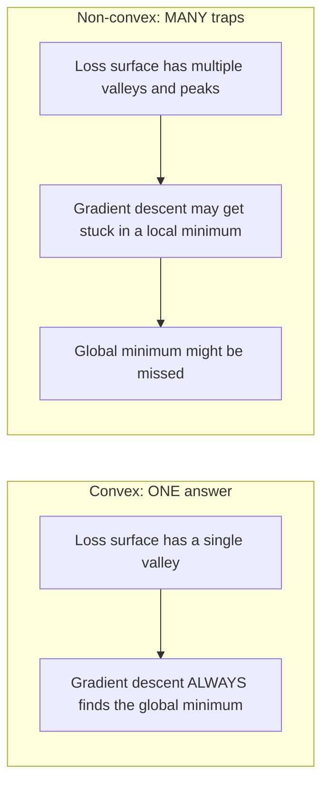
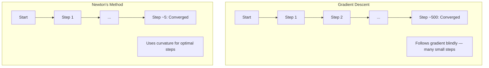
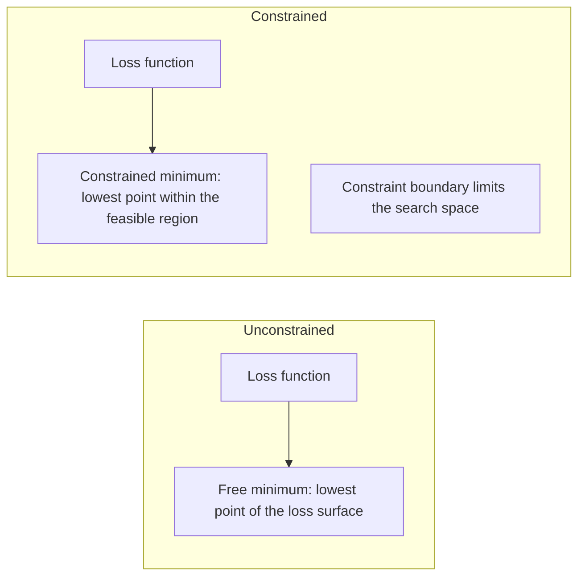
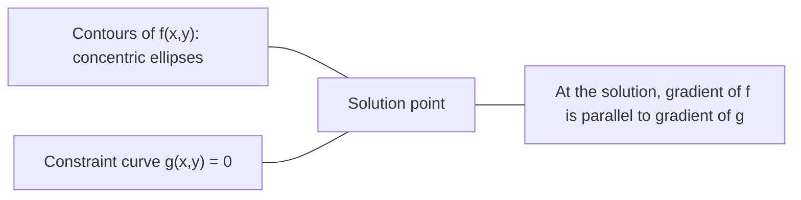

# 凸优化

> 凸问题只有一个谷底，神经网络却有数百万个。理解二者的区别十分重要。

**类型：** 动手构建
**语言：** Python
**前置要求：** 阶段 1，第 04 课（面向机器学习的微积分）、第 08 课（优化）
**时间：** 约 90 分钟

## 学习目标

- 使用定义、二阶导数和 Hessian 判据检验函数是否为凸函数
- 实现牛顿法，并将其二次收敛速度与梯度下降进行比较
- 使用拉格朗日乘子求解约束优化问题，并解释 KKT 条件
- 解释神经网络损失景观为何是非凸的，以及 SGD 为何仍能找到良好解

## 问题

第 08 课介绍了梯度下降、动量法和 Adam。这些优化器能在任何曲面上向下行进，但不提供任何保证。在非凸景观上，梯度下降可能落入糟糕的局部最小值、困在鞍点，或永远来回振荡。尽管如此，你仍然会使用它，因为神经网络是非凸的，并没有其他可行的通用选择。

不过，机器学习中的许多问题都是凸的，例如线性回归、逻辑回归、SVM、LASSO 和岭回归。对这些问题，我们可以得到更强的结果：带有数学保证的优化。凸问题只有一个谷底，任何向下行进的算法都会到达全局最小值。无需重新启动，无需学习率调度，也无需祈祷好运。

理解凸性有三方面作用。第一，它能告诉你问题是容易的（凸）还是困难的（非凸）。第二，它为凸问题提供牛顿法等更快的工具。第三，它能解释贯穿机器学习的许多概念：将正则化视为约束、SVM 中的对偶性，以及深度学习为何在违背凸性所赋予的所有良好性质时仍能奏效。

## 概念

### 凸集

如果集合 S 中任意两点之间的线段仍完全位于 S 内，那么 S 就是凸集。

| 凸集 | 非凸集 |
|---|---|
| **矩形**：内部任意两点都能用一条始终留在矩形内的线段连接 | **星形/月牙形**：两个内部点之间的线段可能穿出集合 |
| **三角形**：所有内部点都满足同样的性质 | **圆环**：中间的孔洞会使某些线段离开集合 |
| 任意两点之间的线段都留在集合内 | 某些点对之间的线段会离开集合 |

形式化检验：对 S 中任意点 x、y 以及 [0, 1] 中任意 t，点 tx + (1-t)y 也在 S 中。

凸集的例子：
- 直线、平面以及整个 R^n
- 球（圆、球面、高维球）
- 半空间：{x : a^T x <= b}
- 任意数量凸集的交集

非凸集的例子：
- 圆环
- 两个不相交圆的并集
- 任何带有“凹陷”或“孔洞”的集合

### 凸函数

如果函数 f 的定义域是凸集，并且对其定义域中的任意两点 x、y 以及 [0, 1] 中任意 t，都有：

```
f(tx + (1-t)y) <= t*f(x) + (1-t)*f(y)
```

那么 f 就是凸函数。几何上，这意味着函数图像上任意两点之间的线段都位于图像上方或与图像重合。

| 性质 | 凸函数 | 非凸函数 |
|---|---|---|
| **线段检验** | 图像上任意两点之间的线段都位于曲线**上方或与其重合** | 图像上某些点之间的线段会落到曲线**下方** |
| **形状** | 向上弯曲的单一碗形或谷地 | 曲率混合、包含多个峰和谷 |
| **局部最小值** | 每个局部最小值都是全局最小值 | 可能存在多个高度不同的局部最小值 |

常见的凸函数：
- f(x) = x^2（抛物线）
- f(x) = |x|（绝对值）
- f(x) = e^x（指数函数）
- f(x) = max(0, x)（ReLU，尽管它是分段线性的）
- 当 x > 0 时，f(x) = -log(x)（负对数）
- 任意线性函数 f(x) = a^T x + b（既是凸函数，也是凹函数）

### 检验凸性

下面是三种实用检验方法，按从最简单到最严格排列。

**检验 1：二阶导数检验（一维）。** 如果对所有 x 都有 f''(x) >= 0，那么 f 是凸函数。

- f(x) = x^2：f''(x) = 2 >= 0，是凸函数。
- f(x) = x^3：f''(x) = 6x，当 x < 0 时为负，因此不是凸函数。
- f(x) = e^x：f''(x) = e^x > 0，是凸函数。

**检验 2：Hessian 检验（多变量）。** 如果 Hessian 矩阵 H(x) 对所有 x 都是半正定的，那么 f 是凸函数。Hessian 是由二阶偏导数组成的矩阵。

**检验 3：定义检验。** 直接检查不等式 f(tx + (1-t)y) <= t*f(x) + (1-t)*f(y)。这种方法适用于难以计算导数的函数。

### 凸性为何重要

凸优化的核心定理是：

**对于凸函数，每个局部最小值都是全局最小值。**

这意味着梯度下降不会被困住。任何向下的路径都会通向同一个答案，算法能够保证收敛到最优解。



由此带来的结果：
- 无需随机重新启动
- 无需复杂的学习率调度
- 可以给出收敛性证明（收敛速度取决于函数性质）
- 解是唯一的（平坦区域除外）

### 机器学习中的凸问题与非凸问题

| 问题 | 是否为凸问题？ | 原因 |
|---------|---------|-----|
| 线性回归（MSE） | 是 | 损失关于权重是二次函数 |
| 逻辑回归 | 是 | 对数损失关于权重是凸函数 |
| SVM（合页损失） | 是 | 线性函数的最大值 |
| LASSO（L1 回归） | 是 | 凸函数之和仍是凸函数 |
| 岭回归（L2） | 是 | 二次函数加二次函数仍是凸函数 |
| 神经网络（任意损失） | 否 | 非线性激活会产生非凸景观 |
| k-means 聚类 | 否 | 包含离散的分配步骤 |
| 矩阵分解 | 否 | 未知量之间存在乘积 |

使用凸损失的线性模型是凸问题。一旦加入采用非线性激活的隐藏层，凸性就会被破坏。

### Hessian 矩阵

函数 f: R^n -> R 的 Hessian H 是一个 n x n 的二阶偏导数矩阵。

```
H[i][j] = d^2 f / (dx_i dx_j)
```

对于 f(x, y) = x^2 + 3xy + y^2：

```
df/dx = 2x + 3y       d^2f/dx^2 = 2      d^2f/dxdy = 3
df/dy = 3x + 2y       d^2f/dydx = 3      d^2f/dy^2 = 2

H = [ 2  3 ]
    [ 3  2 ]
```

Hessian 能揭示曲率：
- 所有特征值都为正：函数在每个方向上都向上弯曲（在该点是凸的）
- 所有特征值都为负：函数在每个方向上都向下弯曲（是凹的，该点为局部最大值）
- 正负号混合：该点是鞍点（在某些方向上向上弯曲，在另一些方向上向下弯曲）
- 存在零特征值：该方向是平坦的（退化情形）

要使函数具有凸性，Hessian 必须在所有位置都半正定（所有特征值 >= 0），而不只是在某一个点如此。

### 牛顿法

梯度下降使用一阶信息（梯度），牛顿法则使用二阶信息（Hessian）。它在当前点拟合一个二次近似，然后直接跳到该二次函数的最小值。

```
Update rule:
  x_new = x - H^(-1) * gradient

Compare to gradient descent:
  x_new = x - lr * gradient
```

牛顿法用 Hessian 的逆替代标量学习率，从而依据局部曲率自动调整步长和方向。



优点：
- 在最小值附近二次收敛（误差在每一步都会平方）
- 无需调节学习率
- 具有尺度不变性（无论怎样参数化问题都能工作）

缺点：
- 计算 Hessian 需要 O(n^2) 内存，而求逆需要 O(n^3) 计算量
- 对拥有 100 万个权重的神经网络而言，这意味着 10^12 个矩阵元素和 10^18 次运算
- 不适用于深度学习

### 约束优化

无约束优化：在所有 x 上最小化 f(x)。
约束优化：在满足约束的条件下最小化 f(x)。

现实问题通常都有约束。你可能想最小化成本，但预算有限；也可能想最小化误差，但模型复杂度存在上限。



### 拉格朗日乘子

拉格朗日乘子法将约束问题转化为无约束问题。

问题：在约束 g(x) = 0 下最小化 f(x)。

解法：引入一个新变量（拉格朗日乘子 lambda），然后求解下面的无约束问题：

```
L(x, lambda) = f(x) + lambda * g(x)
```

在解处，L 的梯度为零：

```
dL/dx = df/dx + lambda * dg/dx = 0
dL/dlambda = g(x) = 0
```

几何直觉是：在约束条件下的最小值处，f 的梯度必须与约束 g 的梯度平行。否则，你就可以沿约束曲面移动，使 f 进一步减小。



示例：在约束 x + y = 1 下最小化 f(x,y) = x^2 + y^2。

```
L = x^2 + y^2 + lambda(x + y - 1)

dL/dx = 2x + lambda = 0  =>  x = -lambda/2
dL/dy = 2y + lambda = 0  =>  y = -lambda/2
dL/dlambda = x + y - 1 = 0

From first two: x = y
Substituting: 2x = 1, so x = y = 0.5, lambda = -1
```

直线 x + y = 1 上距离原点最近的点是 (0.5, 0.5)。

### KKT 条件

Karush-Kuhn-Tucker（KKT）条件将拉格朗日乘子法扩展到不等式约束。

问题：在 i = 1, ..., m 时满足 g_i(x) <= 0 的条件下，最小化 f(x)。

KKT 条件（最优性的必要条件）如下：

```
1. Stationarity:    df/dx + sum(lambda_i * dg_i/dx) = 0
2. Primal feasibility:  g_i(x) <= 0  for all i
3. Dual feasibility:    lambda_i >= 0  for all i
4. Complementary slackness:  lambda_i * g_i(x) = 0  for all i
```

互补松弛给出了一个直接判据：约束活跃时（g_i = 0，解位于边界上），对应乘子可以为正；约束不影响解时，其 lambda = 0。

KKT 条件是 SVM 的核心。支持向量就是约束处于活跃状态（lambda > 0）的数据点。其他所有数据点的 lambda = 0，不会影响决策边界。

### 将正则化视为约束优化

L1 和 L2 正则化并非任意拼凑的技巧，它们其实是伪装成另一种形式的约束优化问题。

**L2 正则化（岭回归）：**

```
minimize  Loss(w)  subject to  ||w||^2 <= t

Equivalent unconstrained form:
minimize  Loss(w) + lambda * ||w||^2
```

约束 ||w||^2 <= t 定义了一个球（二维中为圆，三维中为球）。解位于损失等高线首次接触这个球的位置。

**L1 正则化（LASSO）：**

```
minimize  Loss(w)  subject to  ||w||_1 <= t

Equivalent unconstrained form:
minimize  Loss(w) + lambda * ||w||_1
```

约束 ||w||_1 <= t 定义了一个菱形（二维中旋转后的正方形）。

| 性质 | L2 约束（圆） | L1 约束（菱形） |
|---|---|---|
| **约束形状** | 圆（高维中为球） | 菱形（二维中旋转后的正方形） |
| **损失等高线的接触位置** | 光滑边界——可以是圆上的任意一点 | 顶角——与某条坐标轴对齐 |
| **解的表现** | 权重很小但不为零 | 某些权重恰好为零（稀疏） |
| **结果** | 权重收缩 | 特征选择 |

这解释了为何 L1 会产生稀疏模型（特征选择），而 L2 只会缩小权重。菱形的顶角与坐标轴对齐，损失等高线更可能接触某个顶角，从而使一个或多个权重恰好变为零。

### 对偶性

每个约束优化问题（原问题）都有一个与之配对的问题（对偶问题）。对于凸问题，原问题与对偶问题具有相同的最优值，这称为强对偶性。

拉格朗日对偶函数：

```
Primal: minimize f(x) subject to g(x) <= 0
Lagrangian: L(x, lambda) = f(x) + lambda * g(x)
Dual function: d(lambda) = min_x L(x, lambda)
Dual problem: maximize d(lambda) subject to lambda >= 0
```

对偶性的重要之处：
- 对偶问题有时比原问题更容易求解
- SVM 以对偶形式求解，此时问题取决于数据点之间的点积（从而可以使用核技巧）
- 对偶问题为原问题的最优值提供下界，可用于检查解的质量

以 SVM 为例：

```
Primal: find w, b that maximize the margin 2/||w|| subject to
        y_i(w^T x_i + b) >= 1 for all i

Dual:   maximize sum(alpha_i) - 0.5 * sum_ij(alpha_i * alpha_j * y_i * y_j * x_i^T x_j)
        subject to alpha_i >= 0 and sum(alpha_i * y_i) = 0

The dual only involves dot products x_i^T x_j.
Replace x_i^T x_j with K(x_i, x_j) to get the kernel trick.
```

### 深度学习为何能在非凸条件下奏效

神经网络的损失函数具有极强的非凸性。按照所有经典衡量标准，优化它们本应失败，然而随机梯度下降却能可靠地找到良好解。以下几个因素可以解释这一现象。

**大多数局部最小值已经足够好。** 在高维空间中，随机临界点（梯度为零的位置）绝大多数是鞍点，而非局部最小值。少数确实存在的局部最小值，其损失值往往接近全局最小值。当参数空间有数百万个维度时，陷入极差局部最小值的概率非常低。

**高维优化的主要障碍是鞍点。** 对一个有 n 个参数的函数，鞍点在不同方向上兼有正曲率和负曲率。在高维空间的随机临界点处，全部 n 个特征值均为正（即局部最小值）的概率大约为 2^(-n)。几乎所有临界点都是鞍点，而 SGD 的噪声有助于逃离这些点。

**过度参数化会使景观更平滑。** 参数数量多于训练样本数量的网络具有更平滑、连通性更强的损失曲面。更宽的网络拥有更少的糟糕局部最小值。这虽然有悖直觉，却与经验观察一致。

**损失景观的结构：**

| 性质 | 低维空间 | 高维空间 |
|---|---|---|
| **景观** | 许多彼此孤立的峰和谷 | 平滑连通的谷地 |
| **最小值** | 许多孤立的局部最小值 | 糟糕的局部最小值很少；大多数接近最优 |
| **寻路** | 难以找到全局最小值 | 许多路径都能通向良好解 |
| **临界点** | 局部最小值与鞍点并存 | 绝大多数是鞍点，而非局部最小值 |

**随机噪声会发挥隐式正则化作用。** 小批量 SGD 会加入噪声，防止优化过程停留在尖锐最小值中。尖锐最小值容易过拟合，平坦最小值则有更好的泛化能力。噪声会使优化过程偏向损失景观中的平坦区域。

### 实践中的二阶方法

纯牛顿法不适用于大型模型，但有多种近似方法可以利用二阶信息。

**L-BFGS（有限内存 BFGS）：** 使用最近 m 次梯度差来近似 Hessian 的逆。它只需要 O(mn) 内存，而不是 O(n^2)。对参数数量不超过约 10,000 的问题效果良好。它常用于经典机器学习（逻辑回归、CRF），但不用于深度学习。

**自然梯度：** 使用 Fisher 信息矩阵（对数似然的期望 Hessian），而不是标准 Hessian。这种方法考虑了概率分布的几何结构。K-FAC（Kronecker-Factored Approximate Curvature，Kronecker 分解近似曲率）将 Fisher 矩阵近似为 Kronecker 积，使其能实际用于神经网络。

**无 Hessian 优化：** 使用共轭梯度求解 Hx = g，全程不显式构造 H。它只需要 Hessian-向量积，而自动微分能够以 O(n) 时间计算这种乘积。

**对角近似：** Adam 的二阶矩是对 Hessian 对角线的对角近似。AdaHessian 在此基础上使用 Hutchinson 估计量得到实际的 Hessian 对角元素。

| 方法 | 内存 | 每步成本 | 适用场景 |
|--------|--------|--------------|-------------|
| 梯度下降 | O(n) | O(n) | 基线方法、大型模型 |
| 牛顿法 | O(n^2) | O(n^3) | 小型凸问题 |
| L-BFGS | O(mn) | O(mn) | 中等规模的凸问题 |
| Adam | O(n) | O(n) | 深度学习的默认选择 |
| K-FAC | O(n) | 每层 O(n) | 研究、大批量训练 |

```figure
convex-vs-nonconvex
```

## 动手实现

### 第 1 步：凸性检查器

构建一个函数，通过采样点并检查凸性定义，以经验方式检验函数是否为凸函数。

```python
import random
import math

def check_convexity(f, dim, bounds=(-5, 5), samples=1000):
    violations = 0
    for _ in range(samples):
        x = [random.uniform(*bounds) for _ in range(dim)]
        y = [random.uniform(*bounds) for _ in range(dim)]
        t = random.uniform(0, 1)
        mid = [t * xi + (1 - t) * yi for xi, yi in zip(x, y)]
        lhs = f(mid)
        rhs = t * f(x) + (1 - t) * f(y)
        if lhs > rhs + 1e-10:
            violations += 1
    return violations == 0, violations
```

### 第 2 步：二维牛顿法

使用显式 Hessian 实现牛顿法，并将其收敛速度与梯度下降进行比较。

```python
def newtons_method(f, grad_f, hessian_f, x0, steps=50, tol=1e-12):
    x = list(x0)
    history = [x[:]]
    for _ in range(steps):
        g = grad_f(x)
        H = hessian_f(x)
        det = H[0][0] * H[1][1] - H[0][1] * H[1][0]
        if abs(det) < 1e-15:
            break
        H_inv = [
            [H[1][1] / det, -H[0][1] / det],
            [-H[1][0] / det, H[0][0] / det],
        ]
        dx = [
            H_inv[0][0] * g[0] + H_inv[0][1] * g[1],
            H_inv[1][0] * g[0] + H_inv[1][1] * g[1],
        ]
        x = [x[0] - dx[0], x[1] - dx[1]]
        history.append(x[:])
        if sum(gi ** 2 for gi in g) < tol:
            break
    return history
```

### 第 3 步：拉格朗日乘子求解器

对拉格朗日函数执行梯度下降，求解约束优化问题。

```python
def lagrange_solve(f_grad, g_val, g_grad, x0, lr=0.01,
                   lr_lambda=0.01, steps=5000):
    x = list(x0)
    lam = 0.0
    history = []
    for _ in range(steps):
        fg = f_grad(x)
        gv = g_val(x)
        gg = g_grad(x)
        x = [
            xi - lr * (fgi + lam * ggi)
            for xi, fgi, ggi in zip(x, fg, gg)
        ]
        lam = lam + lr_lambda * gv
        history.append((x[:], lam, gv))
    return history
```

### 第 4 步：比较一阶方法与二阶方法

在同一个二次函数上运行梯度下降和牛顿法，统计二者收敛所需的步数。

```python
def quadratic(x):
    return 5 * x[0] ** 2 + x[1] ** 2

def quadratic_grad(x):
    return [10 * x[0], 2 * x[1]]

def quadratic_hessian(x):
    return [[10, 0], [0, 2]]
```

牛顿法将在 1 步内收敛（对二次函数而言它是精确的）。梯度下降则需要数百步，因为 Hessian 的特征值相差 5 倍，形成了一个狭长的谷地。

## 应用

在选择机器学习模型和求解器时，可以直接应用凸性分析。

对于凸问题（逻辑回归、SVM、LASSO）：
- 使用专用求解器（liblinear、CVXPY、采用 method='L-BFGS-B' 的 scipy.optimize.minimize）
- 可以预期得到唯一的全局解
- 二阶方法既实用又快速

对于非凸问题（神经网络）：
- 使用一阶方法（SGD、Adam）
- 接受解会受到初始化和随机性的影响
- 使用过度参数化、噪声和学习率调度作为隐式正则化
- 不要浪费时间寻找全局最小值，良好的局部最小值已经足够

```python
from scipy.optimize import minimize

result = minimize(
    fun=lambda w: sum((y - X @ w) ** 2) + 0.1 * sum(w ** 2),
    x0=np.zeros(d),
    method='L-BFGS-B',
    jac=lambda w: -2 * X.T @ (y - X @ w) + 0.2 * w,
)
```

对于 SVM，对偶形式使你能够使用核技巧：

```python
from sklearn.svm import SVC

svm = SVC(kernel='rbf', C=1.0)
svm.fit(X_train, y_train)
print(f"Support vectors: {svm.n_support_}")
```

## 练习

1. **凸性图集。** 使用检查器检验以下函数的凸性：f(x) = x^4、f(x) = sin(x)、f(x,y) = x^2 + y^2、f(x,y) = x*y、f(x) = max(x, 0)。解释每个结果为何合理。

2. **牛顿法与梯度下降竞速。** 从起点 (10, 10) 出发，对 f(x,y) = 50*x^2 + y^2 运行这两种方法。各自需要多少步才能使损失达到 < 1e-10？当条件数（Hessian 最大特征值与最小特征值之比）增大时，梯度下降会发生什么？

3. **拉格朗日乘子的几何意义。** 在约束 x + 2y = 4 下最小化 f(x,y) = (x-3)^2 + (y-3)^2。检查在解处 f 的梯度是否与 g 的梯度平行，以验证该解。

4. **正则化约束。** 实现 L1 约束优化：在 |x| + |y| <= 1 的条件下，最小化 (x-3)^2 + (y-2)^2。证明解的一个坐标等于零（菱形约束产生的稀疏性）。

5. **Hessian 特征值分析。** 分别计算 Rosenbrock 函数在 (1,1) 和 (-1,1) 处的 Hessian，并计算这两个位置的特征值。这些特征值说明了最小值附近和远离最小值处怎样的曲率？

## 关键术语

| 术语 | 含义 |
|------|---------------|
| 凸集 | 集合中任意两点之间的线段都留在集合内部 |
| 凸函数 | 函数图像上任意两点之间的线段都位于图像上方或与其重合。等价地，Hessian 在所有位置都半正定 |
| 局部最小值 | 比所有邻近点都低的点。对于凸函数，每个局部最小值都是全局最小值 |
| 全局最小值 | 函数在整个定义域上的最低点 |
| Hessian 矩阵 | 由所有二阶偏导数组成的矩阵，用于编码曲率信息 |
| 半正定 | 所有特征值均非负的矩阵，是“二阶导数 >= 0”在多维空间中的对应概念 |
| 条件数 | Hessian 最大特征值与最小特征值之比。条件数高意味着谷地狭长，梯度下降缓慢 |
| 牛顿法 | 使用 Hessian 的逆来确定步进方向和大小的二阶优化器，在最小值附近二次收敛 |
| 拉格朗日乘子 | 为将约束优化问题转化为无约束问题而引入的变量 |
| KKT 条件 | 含不等式约束的问题达到最优所需的必要条件，是拉格朗日乘子法的推广 |
| 互补松弛 | 在解处，要么约束处于活跃状态，要么其乘子为零，二者绝不会同时非零 |
| 对偶性 | 每个约束问题都有一个与之配对的对偶问题。对凸问题而言，二者具有相同的最优值 |
| 强对偶性 | 原问题与对偶问题的最优值相等。满足 Slater 条件的凸问题具有这一性质 |
| L-BFGS | 一种近似二阶方法，存储最近 m 次梯度差，而不是完整的 Hessian |
| 鞍点 | 梯度为零，但在某些方向上是最小值、另一些方向上是最大值的点 |
| 过度参数化 | 使用比训练样本更多的参数，可使损失景观更平滑，并减少糟糕的局部最小值 |

## 延伸阅读

- [Boyd & Vandenberghe：《凸优化》](https://web.stanford.edu/~boyd/cvxbook/)——可在线免费获取的标准教材
- [Bottou、Curtis、Nocedal：《大规模机器学习的优化方法》（2018）](https://arxiv.org/abs/1606.04838)——连接凸优化理论与深度学习实践
- [Choromanska 等：《多层网络的损失曲面》（2015）](https://arxiv.org/abs/1412.0233)——解释非凸神经网络景观为何没有看起来那么糟糕
- [Nocedal & Wright：《数值优化》](https://link.springer.com/book/10.1007/978-0-387-40065-5)——关于牛顿法、L-BFGS 和约束优化的综合参考资料
