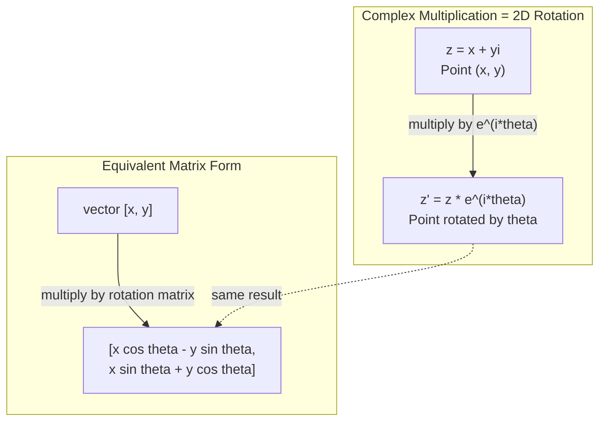
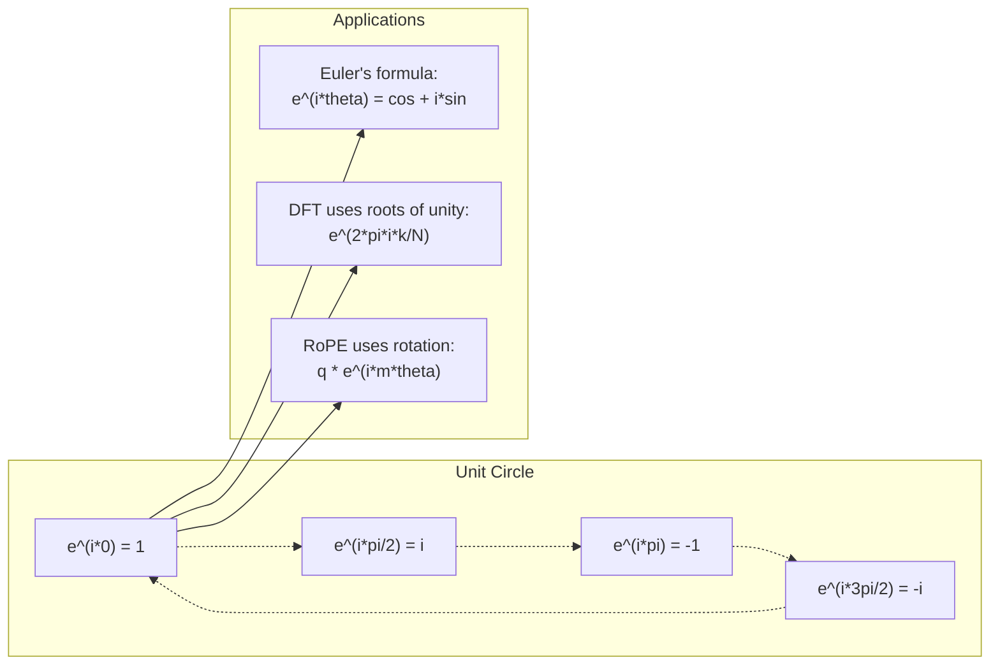

# 面向 AI 的复数

> -1 的平方根并不是虚幻之物。它是理解旋转、频率以及信号处理半壁江山的关键。

**类型：** 学习
**语言：** Python
**先修内容：** 阶段 1，第 01—04 课（线性代数、微积分）
**时间：** 约 60 分钟

## 学习目标

- 分别以直角坐标形式和极坐标形式进行复数运算（加法、乘法、除法和共轭）
- 运用欧拉公式在复指数函数与三角函数之间转换
- 使用复数单位根实现离散傅里叶变换
- 解释复数旋转如何构成 Transformer 中 RoPE 和正弦位置编码的基础

## 问题

当你打开一篇有关傅里叶变换的论文时，会发现 `i` 无处不在。查看 Transformer 的位置编码时，你会看到不同频率的 `sin` 和 `cos`——它们正是复指数的实部和虚部。阅读量子计算资料时，你又会发现一切都用复向量空间来表达。

复数看起来十分抽象，因为它建立在 -1 的平方根之上。它为旋转和振荡提供了自然的数学表示；处理转动、振动或周期信号时，复数通常是合适的工具。

如果不理解复数，你就无法理解离散傅里叶变换，也无法理解 FFT。你无法理解现代语言模型中的 RoPE（旋转位置嵌入）如何工作，也无法理解原始 Transformer 论文中的正弦位置编码为何采用那些频率。

本课构建复数运算，说明其几何含义及在机器学习中的应用。

## 概念

### 什么是复数？

一个复数由两部分组成：实部和虚部。

```
z = a + bi

其中：
  a 是实部
  b 是虚部
  i 是虚数单位，定义为 i^2 = -1
```

就这么简单。你把数轴扩展成了一个平面：实数位于一条坐标轴上，虚数位于另一条坐标轴上。每个复数都是这个平面中的一个点。

### 复数运算

**加法。** 实部与实部相加，虚部与虚部相加。

```
(a + bi) + (c + di) = (a + c) + (b + d)i

示例：(3 + 2i) + (1 + 4i) = 4 + 6i
```

**乘法。** 使用分配律，并记住 i^2 = -1。

```
(a + bi)(c + di) = ac + adi + bci + bdi^2
                 = ac + adi + bci - bd
                 = (ac - bd) + (ad + bc)i

示例：(3 + 2i)(1 + 4i) = 3 + 12i + 2i + 8i^2
                            = 3 + 14i - 8
                            = -5 + 14i
```

**共轭。** 将虚部的符号取反。

```
(a + bi) 的共轭复数 = a - bi
```

一个复数与其共轭复数的乘积始终是实数：

```
(a + bi)(a - bi) = a^2 + b^2
```

**除法。** 分子和分母同时乘以分母的共轭复数。

```
(a + bi) / (c + di) = (a + bi)(c - di) / (c^2 + d^2)
```

这样会消去分母中的虚部，得到一个形式简洁的复数。

### 复平面

复平面将每个复数映射为一个二维点。横轴是实轴，纵轴是虚轴。

```
z = 3 + 2i 对应点 (3, 2)
z = -1 + 0i 对应实轴上的点 (-1, 0)
z = 0 + 4i 对应虚轴上的点 (0, 4)
```

一个复数既是一个点，也是从原点出发的一个向量。正是这种双重解释让复数在几何中格外有用。

### 极坐标形式

平面中的任意一点，都可以用它到原点的距离以及它相对于实轴正方向的夹角来描述。

```
z = r * (cos(theta) + i*sin(theta))

其中：
  r = |z| = sqrt(a^2 + b^2)     （大小或模）
  theta = atan2(b, a)           （相位或辐角）
```

直角坐标形式（a + bi）适合做加法，极坐标形式（r, theta）适合做乘法。

**极坐标形式下的乘法。** 模相乘，角度相加。

```
z1 = r1 * e^(i*theta1)
z2 = r2 * e^(i*theta2)

z1 * z2 = (r1 * r2) * e^(i*(theta1 + theta2))
```

复数非常适合表示旋转，因为乘以一个模为 1 的复数就是一次纯旋转。

### 欧拉公式

连接复指数函数与三角函数的桥梁是：

```
e^(i*theta) = cos(theta) + i*sin(theta)
```

这是本课最重要的公式。当 theta = pi 时：

```
e^(i*pi) = cos(pi) + i*sin(pi) = -1 + 0i = -1

因此：e^(i*pi) + 1 = 0
```

五个基本常数（e、i、pi、1、0）由一个方程联系在了一起。

### 欧拉公式为何对机器学习很重要

欧拉公式说明，随着 theta 变化，`e^(i*theta)` 会描出单位圆。当 theta = 0 时，你位于 (1, 0)；当 theta = pi/2 时，你位于 (0, 1)；当 theta = pi 时，你位于 (-1, 0)；当 theta = 3*pi/2 时，你位于 (0, -1)。完整旋转一周对应 theta = 2*pi。

复指数可以表示旋转，信号处理和机器学习中的许多操作都依赖这种表示。

### 与二维旋转的联系

将复数 (x + yi) 乘以 e^(i*theta)，会把点 (x, y) 绕原点旋转 theta 角。

```
通过复数乘法旋转：
  (x + yi) * (cos(theta) + i*sin(theta))
  = (x*cos(theta) - y*sin(theta)) + (x*sin(theta) + y*cos(theta))i

通过矩阵乘法旋转：
  [cos(theta)  -sin(theta)] [x]   [x*cos(theta) - y*sin(theta)]
  [sin(theta)   cos(theta)] [y] = [x*sin(theta) + y*cos(theta)]
```

两种方法会得到完全相同的结果。复数乘法就是二维旋转。旋转矩阵不过是用矩阵记法写出的复数乘法。



### 相量与旋转信号

复指数 e^(i*omega*t) 是一个以角频率 omega 绕单位圆旋转的点。随着 t 增大，这个点会沿圆周运动。

这个旋转点的实部是 cos(omega*t)，虚部是 sin(omega*t)。正弦信号就是一个旋转复数投下的影子。

```
e^(i*omega*t) = cos(omega*t) + i*sin(omega*t)

实部：          cos(omega*t)    -- 余弦波
虚部：          sin(omega*t)    -- 正弦波
```

相量表示法用一支平滑旋转的箭头代替上下摆动的正弦波。相位偏移变成角度偏移，振幅变化变成模的变化，信号相加则变成向量相加。

### 单位根

N 次单位根是单位圆上等间距分布的 N 个点：

```
w_k = e^(2*pi*i*k/N)    for k = 0, 1, 2, ..., N-1
```

当 N = 4 时，单位根是 1、i、-1、-i（罗盘上的四个基本方向点）。
当 N = 8 时，除了这四个基本方向点，还有四个对角方向点。

单位根是离散傅里叶变换的基础。DFT 将一个信号分解成这 N 个等间距频率上的分量。

### 与 DFT 的联系

信号 x[0], x[1], ..., x[N-1] 的离散傅里叶变换为：

```
X[k] = sum_{n=0}^{N-1} x[n] * e^(-2*pi*i*k*n/N)
```

每个 X[k] 衡量信号与第 k 个单位根——即频率为 k 的复正弦波——的相关程度。DFT 将信号分解为 N 个旋转相量，并告诉你每个相量的振幅和相位。

### 为什么 i 并不虚幻

“虚数”这个词是历史偶然的产物。笛卡尔曾带着贬义使用它。但 i 并不比人们最初拒绝的负数更加虚幻。负数回答了“从什么数中减去 5 会得到 3？”这个问题；虚数单位则回答了“什么数的平方等于 -1？”这个问题。

更实用的理解是：i 是一个旋转 90 度的算子。一个实数乘一次 i，就旋转 90 度来到虚轴；再乘一次 i（即 i^2），就再旋转 90 度——此时它指向实轴负方向。因此 i^2 = -1：两次四分之一圈旋转组成半圈旋转。

这也解释了复数为何在工程领域无处不在。任何发生旋转的事物——电磁波、量子态、信号振荡、位置编码——都很适合用复数来描述。

### 复指数函数与三角函数

在欧拉公式出现之前，工程师把信号写成 A*cos(omega*t + phi)——振幅 A、频率 omega、相位 phi。这种写法可行，却会让运算变得很麻烦。两个相位不同的余弦相加，需要使用三角恒等式。

使用复指数时，同一个信号可写为 A*e^(i*(omega*t + phi))。两个信号相加只需将两个复数相加；相乘（调制）只需将模相乘并把角度相加。相位偏移变成角度相加，频率偏移变成乘以相量。

整个信号处理领域之所以转而采用复指数记法，是因为这种数学形式更加简洁。“实信号”始终只是复数表示的实部。虚部作为辅助记账信息一同保留，让所有代数运算都能自然成立。

### 与 Transformer 的联系

**正弦位置编码**（原始 Transformer 论文）：

```
PE(pos, 2i) = sin(pos / 10000^(2i/d))
PE(pos, 2i+1) = cos(pos / 10000^(2i/d))
```

每一对 sin 和 cos 都是不同频率下复指数的实部和虚部。每个频率都为位置编码提供一种不同的“分辨率”。低频变化缓慢（表示粗粒度位置），高频变化迅速（表示细粒度位置）。它们共同为每个位置赋予一个独一无二的频率指纹。

**RoPE（旋转位置嵌入）** 将这一思路又推进了一步。它显式地把查询向量和键向量乘以复数旋转矩阵。两个词元之间的相对位置转化为一个旋转角度。注意力使用这些经过旋转的向量来计算，使模型能够通过复数乘法感知相对位置。

| 运算 | 代数形式 | 几何意义 |
|-----------|---------------|-------------------|
| 加法 | (a+c) + (b+d)i | 平面中的向量加法 |
| 乘法 | (ac-bd) + (ad+bc)i | 旋转并缩放 |
| 共轭 | a - bi | 关于实轴反射 |
| 模 | sqrt(a^2 + b^2) | 到原点的距离 |
| 相位 | atan2(b, a) | 相对于实轴正方向的夹角 |
| 除法 | 乘以共轭复数 | 逆向旋转并重新缩放 |
| 幂 | r^n * e^(i*n*theta) | 旋转 n 次，并按 r^n 缩放 |



```figure
roots-of-unity
```

## 动手构建

### 第 1 步：复数类

构建一个支持算术运算、模、相位以及直角坐标形式与极坐标形式相互转换的复数类。

```python
import math

class Complex:
    def __init__(self, real, imag=0.0):
        self.real = real
        self.imag = imag

    def __add__(self, other):
        return Complex(self.real + other.real, self.imag + other.imag)

    def __mul__(self, other):
        r = self.real * other.real - self.imag * other.imag
        i = self.real * other.imag + self.imag * other.real
        return Complex(r, i)

    def __truediv__(self, other):
        denom = other.real ** 2 + other.imag ** 2
        r = (self.real * other.real + self.imag * other.imag) / denom
        i = (self.imag * other.real - self.real * other.imag) / denom
        return Complex(r, i)

    def magnitude(self):
        return math.sqrt(self.real ** 2 + self.imag ** 2)

    def phase(self):
        return math.atan2(self.imag, self.real)

    def conjugate(self):
        return Complex(self.real, -self.imag)
```

### 第 2 步：极坐标转换与欧拉公式

```python
def to_polar(z):
    return z.magnitude(), z.phase()

def from_polar(r, theta):
    return Complex(r * math.cos(theta), r * math.sin(theta))

def euler(theta):
    return Complex(math.cos(theta), math.sin(theta))
```

验证：`euler(theta).magnitude()` 应当始终为 1.0。`euler(0)` 应当得到 (1, 0)，`euler(pi)` 应当得到 (-1, 0)。

### 第 3 步：旋转

将点 (x, y) 旋转 theta 角，只需做一次复数乘法：

```python
point = Complex(3, 4)
rotated = point * euler(math.pi / 4)
```

模保持不变，只有角度发生变化。

### 第 4 步：用复数运算实现 DFT

```python
def dft(signal):
    N = len(signal)
    result = []
    for k in range(N):
        total = Complex(0, 0)
        for n in range(N):
            angle = -2 * math.pi * k * n / N
            total = total + Complex(signal[n], 0) * euler(angle)
        result.append(total)
    return result
```

这是复杂度为 O(N^2) 的 DFT。每个输出 X[k] 都是信号样本与单位根相乘后的总和。

### 第 5 步：逆 DFT

逆 DFT 根据频谱重建原始信号。与正向 DFT 相比只有两处变化：把指数中的符号反转，再除以 N。

```python
def idft(spectrum):
    N = len(spectrum)
    result = []
    for n in range(N):
        total = Complex(0, 0)
        for k in range(N):
            angle = 2 * math.pi * k * n / N
            total = total + spectrum[k] * euler(angle)
        result.append(Complex(total.real / N, total.imag / N))
    return result
```

这样可以实现无误差重建。先应用 DFT，再应用 IDFT，就能在机器精度范围内恢复原始信号，不会丢失任何信息。

### 第 6 步：单位根

```python
def roots_of_unity(N):
    return [euler(2 * math.pi * k / N) for k in range(N)]
```

验证以下两个性质：
- 每个单位根的模都恰好为 1。
- 全部 N 个单位根之和为零（它们会因对称性相互抵消）。

正是这些性质让 DFT 可逆。单位根构成了频域的一组正交基。

## 实际使用

Python 内置了复数支持。字面量 `j` 表示虚数单位。

```python
z = 3 + 2j
w = 1 + 4j

print(z + w)
print(z * w)
print(abs(z))

import cmath
print(cmath.phase(z))
print(cmath.exp(1j * cmath.pi))
```

对于数组，numpy 可以原生处理复数：

```python
import numpy as np

z = np.array([1+2j, 3+4j, 5+6j])
print(np.abs(z))
print(np.angle(z))
print(np.conj(z))
print(np.real(z))
print(np.imag(z))

signal = np.sin(2 * np.pi * 5 * np.linspace(0, 1, 128))
spectrum = np.fft.fft(signal)
freqs = np.fft.fftfreq(128, d=1/128)
```

## 交付成果

运行 `code/complex_numbers.py`，生成 `outputs/skill-complex-arithmetic.md`。

## 练习

1. **手算复数运算。** 计算 (2 + 3i) * (4 - i)，并用代码验证。然后计算 (5 + 2i) / (1 - 3i)。在复平面上画出两个结果，并检查乘法确实使第一个数发生了旋转和缩放。

2. **连续旋转。** 从点 (1, 0) 开始，连续十二次乘以 e^(i*pi/6)。验证经过 12 次乘法后会回到 (1, 0)。打印每一步的坐标，并确认这些点描出了一个正十二边形。

3. **已知信号的 DFT。** 创建一个信号，它是在 32 个采样点上对 sin(2*pi*3*t) 与 0.5*sin(2*pi*7*t) 求和所得。运行你的 DFT。验证其幅度谱在频率 3 和 7 处出现峰值，并且频率 7 处的峰值高度是频率 3 处的一半。

4. **单位根可视化。** 计算 8 次单位根。验证它们的和为零。验证任一单位根乘以本原单位根 e^(2*pi*i/8) 后，都会得到下一个单位根。

5. **与旋转矩阵的等价性。** 对 10 个随机角度和 10 个随机点进行验证，确认复数乘法与使用 2x2 旋转矩阵进行矩阵—向量乘法会得到相同结果。打印最大的数值差异。

## 关键术语

| 术语 | 含义 |
|------|---------------|
| 复数 | 形如 a + bi 的数，其中 a 是实部，b 是虚部，并且 i^2 = -1 |
| 虚数单位 | 数 i，定义为 i^2 = -1。它是一个旋转算子，不表示哲学意义上的虚幻之物 |
| 复平面 | x 轴为实轴、y 轴为虚轴的二维平面，也称阿尔冈平面 |
| 模 | 到原点的距离：sqrt(a^2 + b^2)，记作 \|z\| |
| 相位（辐角） | 相对于实轴正方向的夹角：atan2(b, a)，记作 arg(z) |
| 共轭复数 | 关于实轴的镜像：a + bi 的共轭复数是 a - bi |
| 极坐标形式 | 将 z 表示为 r * e^(i*theta)，而不是 a + bi；这种形式便于进行乘法 |
| 欧拉公式 | e^(i*theta) = cos(theta) + i*sin(theta)，它将指数函数与三角函数联系起来 |
| 相量 | 表示正弦信号的旋转复数 e^(i*omega*t) |
| 单位根 | 当 k 从 0 取到 N-1 时的 N 个复数 e^(2*pi*i*k/N)，即单位圆上等间距分布的 N 个点 |
| DFT | 离散傅里叶变换；使用单位根将信号分解为复正弦分量 |
| RoPE | 旋转位置嵌入；使用复数乘法对 Transformer 注意力中的相对位置进行编码 |

## 延伸阅读

- [欧拉公式的可视化入门](https://betterexplained.com/articles/intuitive-understanding-of-eulers-formula/)——不使用繁重的符号来建立几何直觉
- [Su 等：RoFormer（2021）](https://arxiv.org/abs/2104.09864)——介绍如何使用复数旋转实现旋转位置嵌入的论文
- [Vaswani 等：Attention Is All You Need（2017）](https://arxiv.org/abs/1706.03762)——提出正弦位置编码的原始 Transformer 论文
- [3Blue1Brown：用入门群论理解欧拉公式](https://www.youtube.com/watch?v=mvmuCPvRoWQ)——以可视化方式解释 e^(i*pi) = -1 的原因
- [Needham：《Visual Complex Analysis》](https://global.oup.com/academic/product/visual-complex-analysis-9780198534464)——对复数最出色的可视化讲解，充满几何洞见
- [Strang：《Introduction to Linear Algebra》第 10 章](https://math.mit.edu/~gs/linearalgebra/)——在线性代数和特征值的语境中讲解复数
