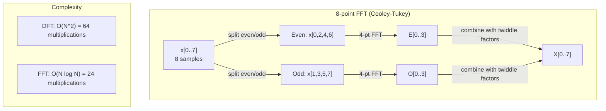
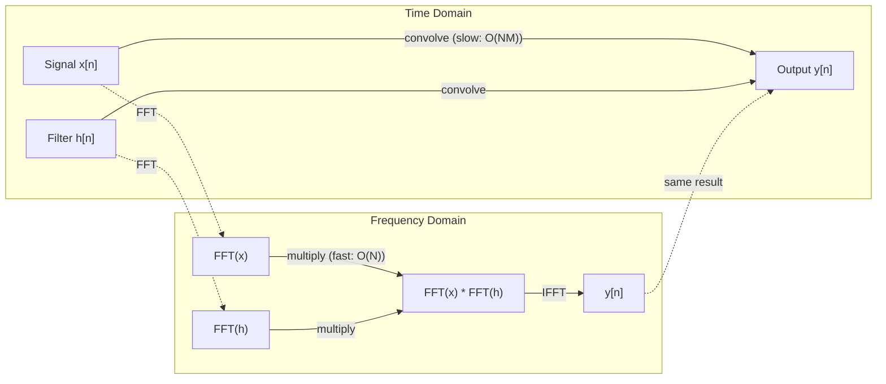

# 傅里叶变换

> 每个信号都是若干正弦波之和。傅里叶变换会告诉你其中包含哪些正弦波。

**类型：** 构建
**语言：** Python
**前置课程：** 第 1 阶段第 01—04、19 课（复数）
**时间：** 约 90 分钟

## 学习目标

- 从零实现离散傅里叶变换（DFT），并用时间复杂度为 O(N log N) 的 Cooley-Tukey 快速傅里叶变换（FFT）进行验证
- 解读频率系数：从信号中提取振幅、相位和功率谱
- 应用卷积定理，通过 FFT 乘法完成卷积
- 建立傅里叶频率分解与 Transformer 位置编码、CNN 卷积层之间的联系

## 问题

一段录音是压力测量值随时间排列而成的序列。股票价格是数值按天排列而成的序列。图像是像素强度在空间中组成的网格。这些都是时域（或空间域）中的数据。你看到的是数值随某个索引而变化。

但许多模式在时域中是看不出来的。这个音频信号是纯音还是和弦？这个股票价格是否存在每周循环？这张图像是否包含重复纹理？这些问题关注的都是频率成分，而时域会把它们隐藏起来。

傅里叶变换把数据从时域转换到频域。它接收一个信号，并将其分解成频率各不相同的正弦波。每个正弦波都有振幅（强度有多大）和相位（从哪里开始）。傅里叶变换会把这两者都告诉你。

这对机器学习很重要，因为频域思维无处不在。卷积神经网络执行卷积，而卷积在频域中就是乘法。Transformer 的位置编码利用频率分解来表示位置。音频模型（语音识别、音乐生成）处理的是频谱图——声音的频率表示。时间序列模型会寻找周期模式。理解傅里叶变换，能让你掌握处理所有这些问题所需的概念语言。

## 概念

### DFT 的定义

给定 N 个样本 x[0]、x[1]、...、x[N-1]，离散傅里叶变换会生成 N 个频率系数 X[0]、X[1]、...、X[N-1]：

```
X[k] = sum_{n=0}^{N-1} x[n] * e^(-2*pi*i*k*n/N)

其中 k = 0, 1, ..., N-1
```

每个 X[k] 都是复数。它的模 |X[k]| 表示频率 k 的振幅。它的相位角 angle(X[k]) 表示该频率的相位偏移。

`e^(-2*pi*i*k*n/N)` 是一个以频率 k 旋转的相量。DFT 计算信号与 N 个等间隔频率中每个频率的相关性：如果信号在频率 k 上包含能量，这个相关性就很大；否则，它会接近零。

### 每个系数的含义

**X[0]：直流分量。** 它是所有样本的总和——与均值成正比。它表示信号的常量（零频率）偏移。

```
X[0] = sum_{n=0}^{N-1} x[n] * e^0 = 所有样本之和
```

**当 1 <= k <= N/2 时的 X[k]：正频率。** X[k] 表示每 N 个样本中循环 k 次的频率。k 越大，频率越高（振荡越快）。

**X[N/2]：奈奎斯特频率。** 这是使用 N 个样本所能表示的最高频率。超过这个频率就会发生混叠——高频会伪装成低频。

**当 N/2 < k < N 时的 X[k]：负频率。** 对实值信号，X[N-k] = conj(X[k])。负频率是正频率的镜像。因此，有用的信息都在前 N/2 + 1 个系数中。

### 逆 DFT

逆 DFT 根据频率系数重建原始信号：

```
x[n] = (1/N) * sum_{k=0}^{N-1} X[k] * e^(2*pi*i*k*n/N)

其中 n = 0, 1, ..., N-1
```

它与正向 DFT 只有两点不同：指数中的符号为正（而非负），并且多了一个 1/N 归一化因子。

逆 DFT 能实现完美重建。任何信息都不会丢失。你可以从时域转换到频域，再转换回来，而不会产生任何误差。DFT 是一次基变换——它用不同的坐标系重新表达同一份信息。

### FFT：让变换更快

按照上述定义计算 DFT 的时间复杂度是 O(N^2)：对于 N 个输出系数中的每一个，都要对 N 个输入样本求和。当 N = 100 万时，需要执行 10^12 次运算。

快速傅里叶变换（FFT）能以 O(N log N) 的时间复杂度计算出相同结果。当 N = 100 万时，只需大约 2000 万次运算，而不是一万亿次。正是这一点让频率分析变得切实可行。

Cooley-Tukey 算法（最常用的 FFT 算法）采用分治法：

1. 将信号拆分为偶数索引样本和奇数索引样本。
2. 递归计算各自一半样本的 DFT。
3. 使用“旋转因子” e^(-2*pi*i*k/N) 合并两个半尺寸的 DFT。

```
X[k] = E[k] + e^(-2*pi*i*k/N) * O[k]          其中 k = 0, ..., N/2 - 1
X[k + N/2] = E[k] - e^(-2*pi*i*k/N) * O[k]    其中 k = 0, ..., N/2 - 1

其中 E = 偶数索引样本的 DFT
     O = 奇数索引样本的 DFT
```

这种对称性意味着每一层递归只需完成 O(N) 的工作，而递归共有 log2(N) 层。因此总时间复杂度为 O(N log N)。



FFT 要求信号长度为 2 的幂。在实践中，通常会在信号末尾补零，使其长度达到下一个 2 的幂。

### 频谱分析

**功率谱**是 |X[k]|^2——每个频率系数的模平方。它显示了每个频率上有多少能量。

**相位谱**是 angle(X[k])——每个频率的相位偏移。在大多数分析任务中，你关注的是功率谱，而会忽略相位。

```
频率 k 处的功率：P[k] = |X[k]|^2 = X[k].real^2 + X[k].imag^2
频率 k 处的相位：phi[k] = atan2(X[k].imag, X[k].real)
```

### 频率分辨率

DFT 的频率分辨率取决于样本数 N 和采样率 fs。

```
频率箱 k 对应的频率：f_k = k * fs / N
频率分辨率：          delta_f = fs / N
最大频率：            f_max = fs / 2  (奈奎斯特频率)
```

若要分辨两个彼此接近的频率，就需要更多样本。若要捕获高频，就需要更高的采样率。

### 卷积定理

这是信号处理中最重要的结论之一，也与 CNN 直接相关。

**时域中的卷积等于频域中的逐点乘法。**

```
x * h = IFFT(FFT(x) . FFT(h))

其中 * 表示卷积，. 表示逐元素乘法
```

它的重要性体现在：

- 直接对长度分别为 N 和 M 的两个信号做卷积，需要 O(N*M) 次运算。
- 基于 FFT 的卷积需要 O(N log N) 次运算：对两者做变换、相乘，再变换回来。
- 对于大型卷积核，FFT 卷积会快得多。
- 这恰恰就是具有大感受野的卷积层中所发生的运算。

注意：DFT 计算的是循环卷积（信号会从末尾绕回开头）。若要计算线性卷积（不会绕回），请先把两个信号都补零到 N + M - 1 的长度，然后再进行计算。



### 加窗

DFT 假定信号是周期性的——它把这 N 个样本视为一个无限重复信号的一个周期。如果信号起点和终点的值不同，边界处就会产生不连续，而这会表现为虚假的高频成分。这种现象称为频谱泄漏。

加窗会在计算 DFT 之前，让信号在两端逐渐衰减至零，从而减少泄漏。

常见窗函数如下：

| 窗函数 | 形状 | 主瓣宽度 | 旁瓣电平 | 使用场景 |
|--------|-------|----------------|-----------------|----------|
| 矩形窗 | 平坦（不加窗） | 最窄 | 最高（-13 dB） | 信号在 N 个样本内恰好呈周期性时 |
| Hann 窗 | 升余弦 | 中等 | 低（-31 dB） | 通用频谱分析 |
| Hamming 窗 | 修正余弦 | 中等 | 更低（-42 dB） | 音频处理、语音分析 |
| Blackman 窗 | 三项余弦 | 宽 | 非常低（-58 dB） | 旁瓣抑制至关重要时 |

```
Hann 窗：   w[n] = 0.5 * (1 - cos(2*pi*n / (N-1)))
Hamming 窗：w[n] = 0.54 - 0.46 * cos(2*pi*n / (N-1))
```

在进行 DFT 之前，将窗函数与信号逐元素相乘即可应用窗函数：`X = DFT(x * w)`。

### DFT 的性质

| 性质 | 时域 | 频域 |
|----------|-------------|-----------------|
| 线性 | a*x + b*y | a*X + b*Y |
| 时移 | x[n - k] | X[f] * e^(-2*pi*i*f*k/N) |
| 频移 | x[n] * e^(2*pi*i*f0*n/N) | X[f - f0] |
| 卷积 | x * h | X * H（逐点） |
| 乘法 | x * h（逐点） | X * H（循环卷积，缩放 1/N） |
| Parseval 定理 | sum \|x[n]\|^2 | (1/N) * sum \|X[k]\|^2 |
| 共轭对称性（实数输入） | x[n] 为实数 | X[k] = conj(X[N-k]) |

Parseval 定理表明，两个域中的总能量相同。变换过程中能量守恒。

### 与位置编码的联系

最初的 Transformer 使用正弦位置编码：

```
PE(pos, 2i)   = sin(pos / 10000^(2i/d_model))
PE(pos, 2i+1) = cos(pos / 10000^(2i/d_model))
```

每一对维度（2i, 2i+1）都以不同频率振荡。这些频率按几何级数排列，从高频（第 0、1 维）逐渐过渡到低频（最后几个维度）。这使每个位置在所有频带上都具有独一无二的模式——类似于傅里叶系数能唯一标识一个信号。

它提供了以下关键性质：

- **唯一性：** 任意两个位置的编码都不相同。
- **有界值：** sin 和 cos 的值始终在 [-1, 1] 范围内。
- **相对位置：** 位置 p+k 的编码可以表示为位置 p 的编码的线性函数。模型可以学会关注相对位置。

### 与 CNN 的联系

卷积层通过让一个学习得到的滤波器（卷积核）在信号或图像上滑动，把它应用到输入上。从数学上讲，这个过程就是卷积运算。

根据卷积定理，这等价于：
1. 对输入做 FFT
2. 对卷积核做 FFT
3. 在频域中相乘
4. 对结果做 IFFT

标准 CNN 实现使用直接卷积（对 3x3 这样的小型卷积核更快）。但对大型卷积核或全局卷积，基于 FFT 的方法会快得多。有些架构（如 FNet）甚至完全用 FFT 取代注意力机制，在把复杂度从 O(N^2) 降至 O(N log N) 的同时取得了有竞争力的准确率。

### 频谱图与短时傅里叶变换

一次 FFT 可以给出整个信号的频率成分，却完全无法告诉你这些频率是在什么时候出现的。啁啾信号（一种频率随时间增加的信号）和和弦（所有频率同时出现）可能拥有相同的幅度谱。

短时傅里叶变换（STFT）通过在信号的重叠窗口上计算 FFT 来解决这个问题。其结果是频谱图：一种二维表示，其中一个轴表示时间，另一个轴表示频率。每一点的强度表示该频率在该时刻的能量。

```
STFT 步骤：
1. 选择窗口大小（例如 1024 个样本）
2. 选择步长（例如 256 个样本——重叠 75%）
3. 对每个窗口位置：
   a. 提取加窗片段
   b. 应用 Hann/Hamming 窗
   c. 计算 FFT
   d. 将幅度谱存为频谱图的一列
```

频谱图是音频机器学习模型的标准输入表示。语音识别模型（Whisper、DeepSpeech）处理的是梅尔频谱图——频率被映射到梅尔标度的频谱图；梅尔标度更贴近人类对音高的感知。

### 混叠

如果信号包含高于 fs/2（奈奎斯特频率）的频率，以 fs 的采样率采样就会产生混叠副本。一个以 100 Hz 采样的 90 Hz 信号，看起来与 10 Hz 信号完全相同。仅凭这些样本无法区分二者。

```
示例：
  真实信号：90 Hz 正弦波
  采样率：100 Hz
  表观频率：100 - 90 = 10 Hz

  以 100 Hz 采样率对 90 Hz 信号取得的样本，
  与对 10 Hz 信号取得的样本完全相同。
  无论进行多少数学运算，都无法恢复原始的 90 Hz 信号。
```

模数转换器包含抗混叠滤波器，是因为它会在采样前去除高于奈奎斯特频率的成分。在机器学习中，如果在没有适当低通滤波的情况下对特征图进行下采样，也会发生混叠——有些架构会使用抗混叠池化层来解决这个问题。

### 补零不会提高分辨率

一个常见误解是，在 FFT 之前给信号补零能提高频率分辨率。补零只会在已有的频率箱之间插值，使频谱看起来更平滑，无法增加原始样本没有包含的频率细节。

频率分辨率只取决于观测时间 T = N / fs。要分辨两个相差 delta_f 的频率，至少需要 T = 1 / delta_f 秒的数据；补零无法改变这个基本限制。

```figure
fourier-synthesis
```

## 动手构建

### 第 1 步：从零实现 DFT

时间复杂度为 O(N^2) 的 DFT 直接遵循定义。

```python
import math

class Complex:
    ...

def dft(x):
    N = len(x)
    result = []
    for k in range(N):
        total = Complex(0, 0)
        for n in range(N):
            angle = -2 * math.pi * k * n / N
            w = Complex(math.cos(angle), math.sin(angle))
            xn = x[n] if isinstance(x[n], Complex) else Complex(x[n])
            total = total + xn * w
        result.append(total)
    return result
```

### 第 2 步：逆 DFT

结构相同，指数为正，再除以 N。

```python
def idft(X):
    N = len(X)
    result = []
    for n in range(N):
        total = Complex(0, 0)
        for k in range(N):
            angle = 2 * math.pi * k * n / N
            w = Complex(math.cos(angle), math.sin(angle))
            total = total + X[k] * w
        result.append(Complex(total.real / N, total.imag / N))
    return result
```

### 第 3 步：FFT（Cooley-Tukey）

递归 FFT 要求长度为 2 的幂。把样本拆分为奇偶两组，递归计算，然后用旋转因子合并。

```python
def fft(x):
    N = len(x)
    if N <= 1:
        return [x[0] if isinstance(x[0], Complex) else Complex(x[0])]
    if N % 2 != 0:
        return dft(x)

    even = fft([x[i] for i in range(0, N, 2)])
    odd = fft([x[i] for i in range(1, N, 2)])

    result = [Complex(0)] * N
    for k in range(N // 2):
        angle = -2 * math.pi * k / N
        twiddle = Complex(math.cos(angle), math.sin(angle))
        t = twiddle * odd[k]
        result[k] = even[k] + t
        result[k + N // 2] = even[k] - t
    return result
```

### 第 4 步：频谱分析辅助函数

```python
def power_spectrum(X):
    return [xk.real ** 2 + xk.imag ** 2 for xk in X]

def convolve_fft(x, h):
    N = len(x) + len(h) - 1
    padded_N = 1
    while padded_N < N:
        padded_N *= 2

    x_padded = x + [0.0] * (padded_N - len(x))
    h_padded = h + [0.0] * (padded_N - len(h))

    X = fft(x_padded)
    H = fft(h_padded)

    Y = [xk * hk for xk, hk in zip(X, H)]

    y = idft(Y)
    return [y[n].real for n in range(N)]
```

## 实际使用

在实际工作中，请使用 NumPy 的 FFT；它由高度优化的 C 语言库提供支持。

```python
import numpy as np

signal = np.sin(2 * np.pi * 5 * np.arange(256) / 256)
spectrum = np.fft.fft(signal)
freqs = np.fft.fftfreq(256, d=1/256)

power = np.abs(spectrum) ** 2

positive_freqs = freqs[:len(freqs)//2]
positive_power = power[:len(power)//2]
```

如需加窗和更高级的频谱分析：

```python
from scipy.signal import windows, stft

window = windows.hann(256)
windowed = signal * window
spectrum = np.fft.fft(windowed)
```

如需执行卷积：

```python
from scipy.signal import fftconvolve

result = fftconvolve(signal, kernel, mode='full')
```

如需生成频谱图：

```python
from scipy.signal import stft

frequencies, times, Zxx = stft(signal, fs=sample_rate, nperseg=256)
spectrogram = np.abs(Zxx) ** 2
```

频谱图矩阵的形状为 (n_frequencies, n_time_frames)。每一列都是一个时间窗口内的功率谱。这正是音频机器学习模型所接收的输入。

## 交付成果

运行 `code/fourier.py`，生成 `outputs/prompt-spectral-analyzer.md`。

## 练习

1. **识别纯音。** 创建一个只包含单个未知频率（1 到 50 Hz 之间）正弦波的信号，以 128 Hz 采样 1 秒。使用你实现的 DFT 识别其频率，并验证答案是否吻合。然后加入标准差为 0.5 的高斯噪声，再重复一次。噪声会怎样影响频谱？

2. **验证 FFT 与 DFT。** 生成一个长度为 64 的随机信号。分别计算 DFT（O(N^2)）和 FFT。验证所有系数的误差都在 1e-10 以内。对长度为 256、512、1024 和 2048 的信号，分别测量两个函数的运行时间。绘制 DFT 运行时间与 FFT 运行时间之比。

3. **用示例证明卷积定理。** 创建信号 x = [1, 2, 3, 4, 0, 0, 0, 0] 和滤波器 h = [1, 1, 1, 0, 0, 0, 0, 0]。直接计算它们的循环卷积（使用嵌套循环）。然后通过 FFT 计算（变换、相乘、逆变换）。验证结果是否相同。接下来，通过适当补零来计算线性卷积。

4. **加窗的影响。** 创建一个由 10 Hz 和 12 Hz 两个正弦波（频率非常接近）相加而成的信号，以 128 Hz 采样 1 秒。分别计算不加窗、使用 Hann 窗以及使用 Hamming 窗时的功率谱。哪一种窗最容易区分这两个峰？为什么？

5. **位置编码分析。** 为 d_model = 128、max_pos = 512 生成正弦位置编码。对每一对位置 (p1, p2)，计算其编码的点积。证明点积只取决于 |p1 - p2|，而不取决于绝对位置。随着距离增加，点积会怎样变化？

## 关键术语

| 术语 | 含义 |
|------|---------------|
| DFT（离散傅里叶变换） | 把 N 个时域样本转换为 N 个频域系数。每个系数都是信号与该频率复正弦波的相关性 |
| FFT（快速傅里叶变换） | 一种以 O(N log N) 时间复杂度计算 DFT 的算法。Cooley-Tukey 算法会递归拆分偶数/奇数索引 |
| 逆 DFT | 根据频率系数重建时域信号。公式与 DFT 相同，但指数符号相反，并按 1/N 缩放 |
| 频率箱 | DFT 输出中的每个索引 k 都表示频率 k*fs/N Hz。“箱”就是这个离散的频率位置 |
| 直流分量 | X[0]，即零频率系数。与信号均值成正比 |
| 奈奎斯特频率 | fs/2，即采样率 fs 所能表示的最高频率。高于它的频率会发生混叠 |
| 功率谱 | \|X[k]\|^2，即每个频率系数的模平方。它显示能量在各个频率上的分布 |
| 相位谱 | angle(X[k])，即每个频率分量的相位偏移。在分析中常被忽略 |
| 频谱泄漏 | 把非周期信号当作周期信号所产生的虚假频率成分。可通过加窗减少 |
| 窗函数 | 在 DFT 前应用的一种渐变函数（Hann、Hamming、Blackman），用于减少频谱泄漏 |
| 旋转因子 | 复指数 e^(-2*pi*i*k/N)，在 FFT 的蝶形运算中用于合并各个子 DFT |
| 卷积定理 | 时域中的卷积等于频域中的逐点乘法。它是信号处理和 CNN 的基础 |
| 循环卷积 | 信号会从末尾绕回开头的卷积。这是 DFT 自然计算的卷积 |
| 线性卷积 | 不会绕回的标准卷积。可以在 DFT 前通过补零实现 |
| Parseval 定理 | 傅里叶变换会保留总能量。sum \|x[n]\|^2 = (1/N) sum \|X[k]\|^2 |
| 混叠 | 由于采样率不足，高于奈奎斯特频率的成分表现为较低频率的现象 |

## 延伸阅读

- [Cooley 和 Tukey：复数傅里叶级数的机器计算算法（1965）](https://www.ams.org/journals/mcom/1965-19-090/S0025-5718-1965-0178586-1/)——这篇最早的 FFT 论文改变了计算领域
- [3Blue1Brown：傅里叶变换究竟是什么？](https://www.youtube.com/watch?v=spUNpyF58BY)——最好的傅里叶变换可视化入门材料
- [Lee-Thorp 等：FNet——用傅里叶变换混合词元（2021）](https://arxiv.org/abs/2105.03824)——在 Transformer 中用 FFT 取代自注意力
- [Smith：科学家和工程师的数字信号处理指南](http://www.dspguide.com/)——免费在线教材，深入介绍 FFT、加窗与频谱分析
- [Vaswani 等：Attention Is All You Need（2017）](https://arxiv.org/abs/1706.03762)——由傅里叶频率分解衍生出的正弦位置编码
- [Radford 等：Whisper（2022）](https://arxiv.org/abs/2212.04356)——使用梅尔频谱图作为输入表示的语音识别模型
