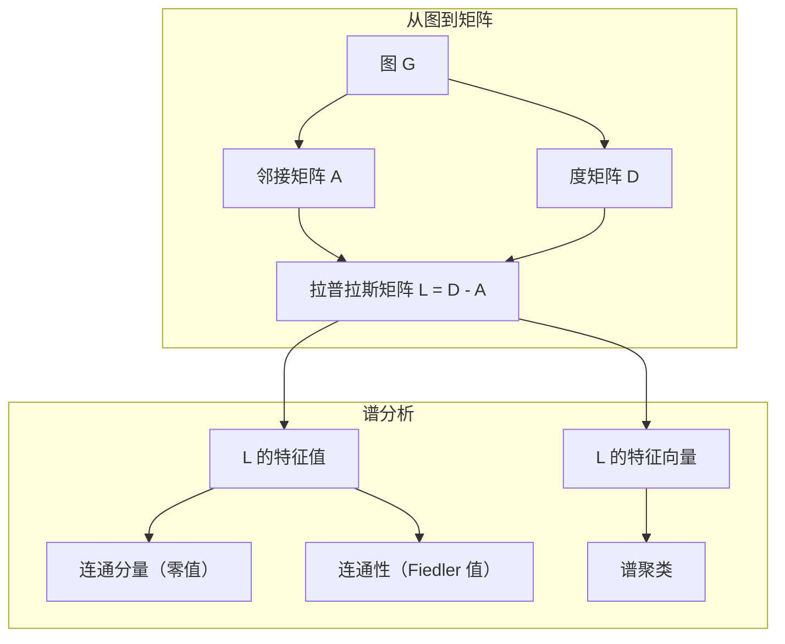
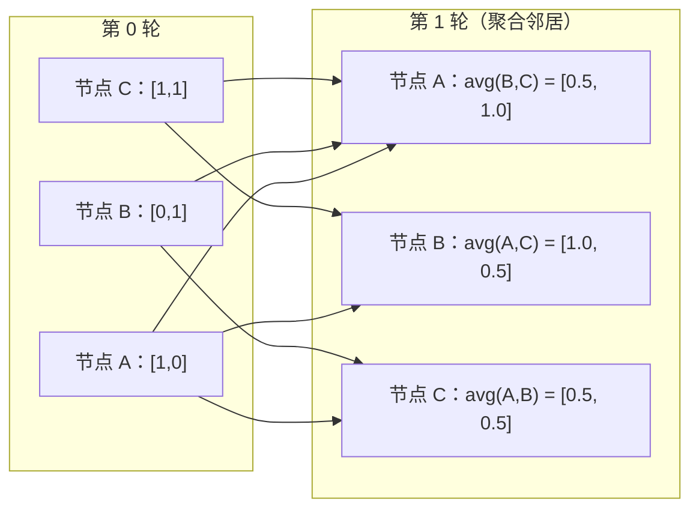

# 面向机器学习的图论

> 图是表示关系的数据结构。如果你的数据中存在连接，你就需要图论。

**类型：** 构建
**语言：** Python
**前置知识：** 阶段 1，第 01–03 课（线性代数、矩阵）
**时间：** 约 90 分钟

## 学习目标

- 构建一个采用邻接矩阵/邻接表表示的图类，并实现 BFS 和 DFS 遍历
- 计算图拉普拉斯矩阵，并用其特征值检测连通分量和对节点进行聚类
- 将归一化邻接矩阵乘法实现为一轮 GNN 风格的消息传递
- 使用 Fiedler 向量进行谱聚类，以划分一张图

## 问题

社交网络、分子、知识库、引用网络、道路地图——它们都是图。传统机器学习把数据视为扁平表格。每一行彼此独立，每个特征占据一列。但当连接结构很重要时，表格就失效了。

以社交网络为例。你想预测一名用户会购买什么产品。他们的购买历史固然重要，但其朋友的购买历史更加重要。连接本身携带着信号。

再以分子为例。你想预测它能否与某种蛋白质结合。原子固然重要，但真正关键的是原子之间如何成键。结构就是数据。

图神经网络（GNN）是深度学习中发展最快的领域。它们为药物发现、社交推荐、欺诈检测和知识图谱推理提供动力。每一种 GNN 都建立在同一个基础之上：基本图论。

你需要掌握四件事：
1. 一种将图表示为矩阵的方法（以便进行矩阵乘法）
2. 用于探索图结构的遍历算法
3. 拉普拉斯矩阵——谱图论中最重要的矩阵
4. 消息传递——让 GNN 得以工作的运算

## 概念

### 图：节点与边

图 G = (V, E) 由顶点（节点）集合 V 和边集合 E 组成。每条边连接两个节点。

**有向与无向。** 在无向图中，边 (u, v) 表示 u 连接到 v，并且 v 也连接到 u。在有向图（digraph）中，边 (u, v) 表示 u 指向 v，但反向关系不一定成立。

**加权与无权。** 在无权图中，边要么存在，要么不存在。在加权图中，每条边都有一个数值权重——距离、成本或强度。

| 图类型 | 示例 |
|-----------|---------|
| 无向、无权 | Facebook 好友网络 |
| 有向、无权 | Twitter 关注网络 |
| 无向、加权 | 道路地图（距离） |
| 有向、加权 | 网页链接（PageRank 分数） |

### 邻接矩阵

邻接矩阵 A 是核心表示方式。对于一张有 n 个节点的图：

```
A[i][j] = 1    如果存在从节点 i 到节点 j 的边
A[i][j] = 0    否则
```

对于无向图，A 是对称矩阵：A[i][j] = A[j][i]。对于加权图，A[i][j] = 边 (i, j) 的权重。

**示例——一个三角形：**

```
节点：0、1、2
边：(0,1)、(1,2)、(0,2)

A = [[0, 1, 1],
     [1, 0, 1],
     [1, 1, 0]]
```

邻接矩阵是每一种 GNN 的输入。对 A 进行的矩阵运算对应着对图进行的操作。

### 度

节点的度是与其相连的边数。对于有向图，还有入度（指向该节点的边）和出度（从该节点指出的边）之分。

度矩阵 D 是一个对角矩阵：

```
D[i][i] = 节点 i 的度
D[i][j] = 0    当 i != j 时
```

对于三角形示例：D = diag(2, 2, 2)，因为每个节点都连接到另外两个节点。

度可以反映节点的重要性。度高 = 枢纽节点。网络的度分布揭示其结构。社交网络遵循幂律（少数枢纽、大量叶节点），而随机图的度服从泊松分布。

### BFS 与 DFS

这是两种基础的图遍历算法，两者都需要掌握。

**广度优先搜索（BFS）：** 先探索所有邻居，再探索邻居的邻居。它使用队列（FIFO，先进先出）。

```
从节点 0 开始 BFS：
  访问 0
  队列：[1, 2]        （0 的邻居）
  访问 1
  队列：[2, 3]        （加入 1 的邻居）
  访问 2
  队列：[3]           （2 的邻居已访问）
  访问 3
  队列：[]            （完成）
```

BFS 能找到无权图中的最短路径。从起点到任意节点的距离，就等于 BFS 首次发现该节点时所在的层级。因此，BFS 可用于计算社交网络中的跳数距离。

**深度优先搜索（DFS）：** 尽可能深入，然后再回溯。它使用栈（LIFO，后进先出）或递归。

```
从节点 0 开始 DFS：
  访问 0
  栈：[1, 2]           （0 的邻居）
  访问 2               （从栈中弹出）
  栈：[1, 3]           （加入 2 的邻居）
  访问 3               （从栈中弹出）
  栈：[1]
  访问 1               （从栈中弹出）
  栈：[]                （完成）
```

DFS 适用于：
- 查找连通分量（从尚未访问的节点开始运行 DFS）
- 环检测（DFS 树中的回边）
- 拓扑排序（将 DFS 完成顺序反转）

| 算法 | 数据结构 | 能找到什么 | 使用场景 |
|-----------|---------------|-------|----------|
| BFS | 队列 | 最短路径 | 社交网络距离、知识图谱遍历 |
| DFS | 栈 | 分量、环 | 连通性、拓扑排序 |

### 图拉普拉斯矩阵

L = D - A。它是谱图论中最重要的矩阵。

对于这个三角形：

```
D = [[2, 0, 0],    A = [[0, 1, 1],    L = [[2, -1, -1],
     [0, 2, 0],         [1, 0, 1],         [-1, 2, -1],
     [0, 0, 2]]         [1, 1, 0]]         [-1, -1,  2]]
```

拉普拉斯矩阵具有一些非凡的性质：

1. **L 是半正定矩阵。** 所有特征值都 >= 0。

2. **零特征值的数量等于连通分量的数量。** 一张连通图恰好有一个零特征值。具有 3 个互不连通分量的图有三个零特征值。

3. **最小的非零特征值（Fiedler 值）衡量连通性。** Fiedler 值大，意味着图的连通性良好。Fiedler 值小，意味着图中存在薄弱点——一个瓶颈。

4. **Fiedler 值对应的特征向量（Fiedler 向量）揭示最佳划分。** 取正值的节点进入一组，取负值的节点进入另一组。这就是谱聚类。



### 谱性质

邻接矩阵和拉普拉斯矩阵的特征值无需任何遍历，就能揭示结构性质。

**谱聚类** 的工作方式如下：
1. 计算拉普拉斯矩阵 L
2. 找到 L 的 k 个最小特征向量（跳过第一个；对于连通图，它是全 1 向量）
3. 将这些特征向量用作每个节点的新坐标
4. 对这些坐标运行 k-means

为什么这会奏效？L 的特征向量编码了图上最“平滑”的函数。连接紧密的节点会获得相近的特征向量值，被瓶颈分隔的节点则会获得不同的值。这些特征向量会自然地将聚类分开。

**与随机游走的联系。** 归一化拉普拉斯矩阵与图上的随机游走有关。随机游走的平稳分布与节点的度成正比。混合时间（游走收敛的速度）取决于谱隙。

### 消息传递

这是图神经网络的核心运算。每个节点收集来自邻居的消息，对其进行聚合，然后更新自身状态。

```
h_v^(k+1) = UPDATE(h_v^(k), AGGREGATE({h_u^(k) : u in neighbors(v)}))
```

最简单的形式中，AGGREGATE = 均值，而 UPDATE = 线性变换 + 激活：

```
h_v^(k+1) = sigma(W * mean({h_u^(k) : u in neighbors(v)}))
```

这其实是伪装成其他形式的矩阵乘法。如果 H 是所有节点特征组成的矩阵，而 A 是邻接矩阵：

```
H^(k+1) = sigma(A_norm * H^(k) * W)
```

其中 A_norm 是归一化邻接矩阵（每一行之和为 1）。

一轮消息传递让每个节点能够“看到”其直接邻居。两轮让它看到邻居的邻居。K 轮则让每个节点获得来自其 K 跳邻域的信息。



### 概念与机器学习应用

| 概念 | 机器学习应用 |
|---------|---------------|
| 邻接矩阵 | GNN 输入表示 |
| 图拉普拉斯矩阵 | 谱聚类、社区检测 |
| BFS/DFS | 知识图谱遍历、路径查找 |
| 度分布 | 节点重要性、特征工程 |
| 消息传递 | GNN 层（GCN、GAT、GraphSAGE） |
| L 的特征值 | 社区检测、图划分 |
| 谱聚类 | 无监督节点分组 |
| PageRank | 节点重要性、网页搜索 |

```figure
graph-degree-distribution
```

## 动手构建

### 第 1 步：从零实现图类

```python
class Graph:
    def __init__(self, n_nodes, directed=False):
        self.n = n_nodes
        self.directed = directed
        self.adj = {i: {} for i in range(n_nodes)}

    def add_edge(self, u, v, weight=1.0):
        self.adj[u][v] = weight
        if not self.directed:
            self.adj[v][u] = weight

    def neighbors(self, node):
        return list(self.adj[node].keys())

    def degree(self, node):
        return len(self.adj[node])

    def adjacency_matrix(self):
        import numpy as np
        A = np.zeros((self.n, self.n))
        for u in range(self.n):
            for v, w in self.adj[u].items():
                A[u][v] = w
        return A

    def degree_matrix(self):
        import numpy as np
        D = np.zeros((self.n, self.n))
        for i in range(self.n):
            D[i][i] = self.degree(i)
        return D

    def laplacian(self):
        return self.degree_matrix() - self.adjacency_matrix()
```

邻接表（`self.adj`）能高效地存储邻居。转换邻接矩阵时使用 NumPy，是因为所有谱运算都需要它。

### 第 2 步：BFS 与 DFS

```python
from collections import deque

def bfs(graph, start):
    visited = set()
    order = []
    distances = {}
    queue = deque([(start, 0)])
    visited.add(start)
    while queue:
        node, dist = queue.popleft()
        order.append(node)
        distances[node] = dist
        for neighbor in graph.neighbors(node):
            if neighbor not in visited:
                visited.add(neighbor)
                queue.append((neighbor, dist + 1))
    return order, distances


def dfs(graph, start):
    visited = set()
    order = []
    stack = [start]
    while stack:
        node = stack.pop()
        if node in visited:
            continue
        visited.add(node)
        order.append(node)
        for neighbor in reversed(graph.neighbors(node)):
            if neighbor not in visited:
                stack.append(neighbor)
    return order
```

BFS 使用 deque（双端队列），从而以 O(1) 的时间执行 popleft。DFS 使用列表作为栈。两种算法都恰好访问每个节点一次——时间复杂度为 O(V + E)。

### 第 3 步：连通分量和拉普拉斯特征值

```python
def connected_components(graph):
    visited = set()
    components = []
    for node in range(graph.n):
        if node not in visited:
            order, _ = bfs(graph, node)
            visited.update(order)
            components.append(order)
    return components


def laplacian_eigenvalues(graph):
    import numpy as np
    L = graph.laplacian()
    eigenvalues = np.linalg.eigvalsh(L)
    return eigenvalues
```

`eigvalsh` 用于对称矩阵——对于无向图，拉普拉斯矩阵始终是对称的。它会按升序返回特征值。数一数零值的数量，就能得到连通分量的数量。

### 第 4 步：谱聚类

```python
def spectral_clustering(graph, k=2):
    import numpy as np
    L = graph.laplacian()
    eigenvalues, eigenvectors = np.linalg.eigh(L)
    features = eigenvectors[:, 1:k+1]

    labels = np.zeros(graph.n, dtype=int)
    for i in range(graph.n):
        if features[i, 0] >= 0:
            labels[i] = 0
        else:
            labels[i] = 1
    return labels
```

当 k=2 时，Fiedler 向量的符号会将图分成两个簇。当 k>2 时，需要对前 k 个特征向量（排除平凡的全 1 特征向量）运行 k-means。

### 第 5 步：消息传递

```python
def message_passing(graph, features, weight_matrix):
    import numpy as np
    A = graph.adjacency_matrix()
    row_sums = A.sum(axis=1, keepdims=True)
    row_sums[row_sums == 0] = 1
    A_norm = A / row_sums
    aggregated = A_norm @ features
    output = aggregated @ weight_matrix
    return output
```

这就是一轮 GNN 消息传递。每个节点的新特征，是其邻居特征的加权平均值经过权重矩阵变换后的结果。堆叠多轮，即可将信息传播得更远。

## 使用它

借助 NetworkX 和 NumPy，同样的操作都可以用一行代码完成：

```python
import networkx as nx
import numpy as np

G = nx.karate_club_graph()

A = nx.adjacency_matrix(G).toarray()
L = nx.laplacian_matrix(G).toarray()

eigenvalues = np.linalg.eigvalsh(L.astype(float))
print(f"Smallest eigenvalues: {eigenvalues[:5]}")
print(f"Connected components: {nx.number_connected_components(G)}")

communities = nx.community.greedy_modularity_communities(G)
print(f"Communities found: {len(communities)}")

pr = nx.pagerank(G)
top_nodes = sorted(pr.items(), key=lambda x: x[1], reverse=True)[:5]
print(f"Top 5 PageRank nodes: {top_nodes}")
```

NetworkX 借助经过优化的 C 后端，可以处理任意规模的图。在生产环境中使用它；使用你从零编写的实现来理解它做了什么。

### NumPy 谱分析

```python
import numpy as np

A = np.array([
    [0, 1, 1, 0, 0],
    [1, 0, 1, 0, 0],
    [1, 1, 0, 1, 0],
    [0, 0, 1, 0, 1],
    [0, 0, 0, 1, 0]
])

D = np.diag(A.sum(axis=1))
L = D - A

eigenvalues, eigenvectors = np.linalg.eigh(L)
print(f"Eigenvalues: {np.round(eigenvalues, 4)}")
print(f"Fiedler value: {eigenvalues[1]:.4f}")
print(f"Fiedler vector: {np.round(eigenvectors[:, 1], 4)}")

fiedler = eigenvectors[:, 1]
group_a = np.where(fiedler >= 0)[0]
group_b = np.where(fiedler < 0)[0]
print(f"Cluster A: {group_a}")
print(f"Cluster B: {group_b}")
```

Fiedler 向量承担了主要工作。正数项归入一个簇，负数项归入另一个簇。不需要迭代优化——只需一次特征分解。

## 交付它

本课会产出：
- `outputs/skill-graph-analysis.md`——一份用于分析图结构数据的技能参考

## 联系

| 概念 | 出现场景 |
|---------|------------------|
| 邻接矩阵 | GCN、GAT、GraphSAGE 的输入 |
| 拉普拉斯矩阵 | 谱聚类、ChebNet 滤波器 |
| BFS | 知识图谱遍历、最短路径查询 |
| 消息传递 | 每一个 GNN 层、神经消息传递 |
| 谱隙 | 图连通性、随机游走的混合时间 |
| 度分布 | 幂律网络、节点特征工程 |
| 连通分量 | 预处理、处理非连通图 |
| PageRank | 节点重要性排名、注意力初始化 |

GNN 值得特别说明。GCN（Kipf 与 Welling，2017）中的图卷积运算使用加入了自环的邻接矩阵 A_hat = A + I：

```text
H^(l+1) = sigma(D_hat^(-1/2) * A_hat * D_hat^(-1/2) * H^(l) * W^(l))
```

其中 A_hat = A + I（邻接矩阵加自环），D_hat 是 A_hat 的度矩阵。自环确保每个节点在聚合过程中包含自身特征。这恰好就是采用对称归一化的消息传递。D_hat^(-1/2) * A_hat * D_hat^(-1/2) 是归一化邻接矩阵。拉普拉斯矩阵之所以会出现，是因为这种归一化与 L_sym = I - D^(-1/2) * A * D^(-1/2) 有关。理解拉普拉斯矩阵，也就意味着理解 GCN 为何有效。

## 练习

1. **从零实现 PageRank。** 从均匀分数开始。在每一步中：对于所有指向 v 的 u，score(v) = (1-d)/n + d * sum(score(u)/out_degree(u))。使用 d=0.85。不断运行，直至收敛（变化量 < 1e-6）。在一个小型网页图上测试。

2. **使用谱聚类查找社区。** 创建一张包含两个明显分离簇的图（例如，用一条边连接的两个团）。运行谱聚类，并验证它能找到正确划分。随着你加入更多跨簇边，会发生什么？

3. **实现 Dijkstra 算法**，以寻找加权图中的最短路径。在具有统一权重的同一张图上，将结果与 BFS 进行比较。

4. **构建一个两层消息传递网络。** 使用不同的权重矩阵应用两次消息传递。证明两轮之后，每个节点都拥有来自其 2 跳邻域的信息。

5. **分析一张现实世界中的图。** 使用 Karate Club 图（34 个节点、78 条边）。计算度分布、拉普拉斯特征值和谱聚类。将谱聚类结果与已知的真实划分进行比较。

## 关键术语

| 术语 | 人们通常怎么说 | 它的实际含义 |
|------|----------------|----------------------|
| 图 | “节点和边” | 一种编码成对关系的数学结构 G=(V,E) |
| 邻接矩阵 | “连接表” | 一个 n x n 矩阵；如果节点 i 和 j 相连，则 A[i][j] = 1 |
| 度 | “一个节点连接得有多广” | 与一个节点相接的边数 |
| 拉普拉斯矩阵 | “D 减 A” | L = D - A，其特征值揭示图结构 |
| Fiedler 值 | “代数连通度” | L 的最小非零特征值，衡量图的连通程度 |
| BFS | “逐层搜索” | 先访问所有邻居再继续深入的遍历，可找到最短路径 |
| DFS | “先深入” | 沿着一条路径走到尽头再回溯的遍历 |
| 消息传递 | “节点与邻居交流” | 每个节点聚合来自邻居的信息，是 GNN 的核心 |
| 谱聚类 | “按特征向量聚类” | 使用图拉普拉斯矩阵的特征向量划分图 |
| 连通分量 | “独立的一块” | 其中每个节点都能到达其他任意节点的极大子图 |

## 延伸阅读

- **Kipf 与 Welling（2017）**——“Semi-Supervised Classification with Graph Convolutional Networks”。这篇论文开创了现代 GNN，说明谱图卷积可以简化为消息传递。
- **Spielman（2012）**——“Spectral Graph Theory”讲义。这是关于拉普拉斯矩阵、谱隙和图划分的权威入门资料。
- **Hamilton（2020）**——“Graph Representation Learning”。一本涵盖从 GNN 基础到应用的书。
- **Bronstein 等人（2021）**——“Geometric Deep Learning: Grids, Groups, Graphs, Geodesics, and Gauges”。提出统一框架的论文。
- **Veličković 等人（2018）**——“Graph Attention Networks”。通过注意力机制扩展消息传递。
