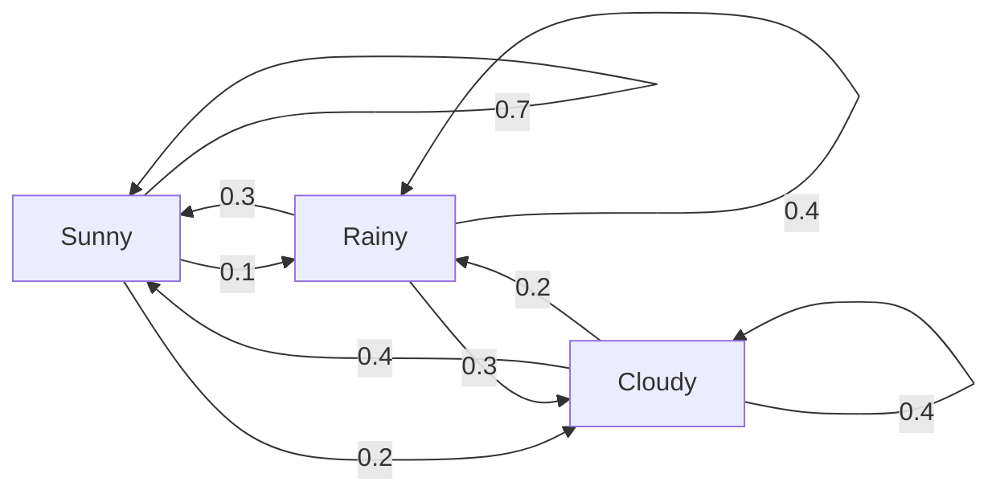
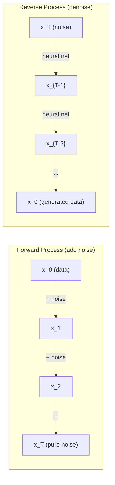

# 随机过程

> 有结构的随机性。随机游走、马尔可夫链和扩散模型背后的数学。

**类型：** 学习
**语言：** Python
**前置课程：** 第 1 阶段，第 06—07 课（概率、贝叶斯）
**时间：** 约 75 分钟

## 学习目标

- 模拟一维和二维随机游走，并验证位移的 sqrt(n) 缩放规律
- 构建马尔可夫链模拟器，并通过特征分解计算其平稳分布
- 实现 Metropolis-Hastings MCMC 和朗之万动力学，从目标分布中采样
- 将前向扩散过程与布朗运动联系起来，并解释逆向过程如何生成数据

## 问题

许多 AI 系统都涉及随时间演化的随机性。它们面对的不是静态的随机性，而是有结构、按顺序发生的随机性，其中每一步都取决于此前发生的事情。

语言模型一次生成一个词元。每个词元都依赖之前的上下文。模型输出一个概率分布，从中采样，然后继续生成。这就是一个随机过程。

扩散模型逐步向图像添加噪声，直到图像变成纯粹的静态噪声。然后，它们将这个过程反转，逐步去噪，直到一幅新图像出现。前向过程是一条马尔可夫链。逆向过程则是一条反向运行的、学习得到的马尔可夫链。

强化学习智能体在环境中采取动作。每个动作都以一定概率产生一个新状态。智能体在随机世界中遵循随机策略。整个系统就是一个马尔可夫决策过程。

MCMC 采样是贝叶斯推断的支柱，它会构造一条马尔可夫链，而这条链的平稳分布正是你想从中采样的后验分布。

所有这些方法都建立在四个基础思想之上：
1. 随机游走——最简单的随机过程
2. 马尔可夫链——由转移矩阵描述的结构化随机性
3. 朗之万动力学——带噪声的梯度下降
4. Metropolis-Hastings——从任意分布中采样

## 概念

### 随机游走

从位置 0 出发。每一步都抛一次均匀硬币。正面：向右移动（+1）。反面：向左移动（-1）。

经过 n 步后，你的位置是 n 个随机 +/-1 值之和。位置的期望为 0（这次游走是无偏的）。但到原点的期望距离会按 sqrt(n) 增长。

这有些反直觉。游走是公平的——两个方向都没有漂移。但随着时间推移，它会离起点越来越远。n 步后的标准差是 sqrt(n)。

```
第 0 步：位置 = 0
第 1 步：位置 = +1 或 -1
第 2 步：位置 = +2、0 或 -2
...
第 100 步：到原点的期望距离约为 10（sqrt(100)）
第 10000 步：到原点的期望距离约为 100（sqrt(10000)）
```

**在二维空间中**，游走以相等概率向上、向下、向左或向右移动。到原点距离仍遵循相同的 sqrt(n) 缩放规律。其路径会描绘出类似分形的图案。

**为什么是 sqrt(n)？** 每一步以相等概率取 +1 或 -1。n 步后，位置 S_n = X_1 + X_2 + ... + X_n，其中每个 X_i 都是 +/-1。每一步的方差为 1，而且各步相互独立，因此 Var(S_n) = n。标准差 = sqrt(n)。根据中心极限定理，S_n / sqrt(n) 收敛到标准正态分布。

这种 sqrt(n) 缩放规律在机器学习中随处可见。SGD 噪声按 1/sqrt(batch_size) 缩放。嵌入维度按 sqrt(d) 缩放。平方根是独立随机增量相加的标志。

**与布朗运动的联系。** 考虑一次随机游走：步长为 1/sqrt(n)，每单位时间走 n 步。当 n 趋于无穷大时，游走会收敛到布朗运动 B(t)——这是一个连续时间过程，其中 B(t) 服从均值为 0、方差为 t 的正态分布。

布朗运动是扩散的数学基础。它可以模拟流体中粒子的随机抖动、股票价格的波动，以及至关重要的一点——扩散模型中的噪声过程。

**赌徒破产问题。** 一个随机游走者从位置 k 出发，0 和 N 处设有吸收边界。先到达 N 而不是 0 的概率是多少？对于公平游走：P(到达 N) = k/N。这个结果出奇地简洁优美。它还与鞅理论相联系——公平随机游走就是一个鞅（未来值的期望 = 当前值）。

### 马尔可夫链

马尔可夫链是一个按照固定概率在不同状态间转移的系统。它的关键性质是：下一个状态只取决于当前状态，而不取决于历史。

```
P(X_{t+1} = j | X_t = i, X_{t-1} = ...) = P(X_{t+1} = j | X_t = i)
```

这就是马尔可夫性质。它意味着你可以用一个转移矩阵 P 描述整个系统的动力学：

```
P[i][j] = 从状态 i 转移到状态 j 的概率
```

P 的每一行之和都等于 1（你必须转移到某个状态）。

**示例——天气：**

```
状态：晴朗（0）、下雨（1）、多云（2）

P = [[0.7, 0.1, 0.2],    （如果晴朗：70% 晴朗、10% 下雨、20% 多云）
     [0.3, 0.4, 0.3],    （如果下雨：30% 晴朗、40% 下雨、30% 多云）
     [0.4, 0.2, 0.4]]    （如果多云：40% 晴朗、20% 下雨、40% 多云）
```

从任意状态开始。经过多次转移后，状态分布会收敛到平稳分布 pi，其中 pi * P = pi。它是 P 对应于特征值 1 的左特征向量。

对于这条天气链，平稳分布为 [0.55, 0.18, 0.27]——从长期来看，无论初始状态是什么，晴朗天气都占 55%。



**计算平稳分布。** 有两种方法：

1. **幂方法**：用 P 反复乘任意初始分布。经过足够多次迭代后，结果会收敛。
2. **特征值方法**：找到 P 对应于特征值 1 的左特征向量，也就是 P^T 对应于特征值 1 的特征向量。

两种方法都要求这条链满足收敛条件。

**收敛条件。** 如果一条马尔可夫链满足以下条件，它就会收敛到唯一的平稳分布：
- **不可约**：从每个状态都可以到达其他任意状态
- **非周期**：链不会以固定周期循环

机器学习中遇到的大多数链都满足这两个条件。

**吸收状态。** 如果一旦进入某个状态就再也不会离开，那么这个状态就是吸收状态（P[i][i] = 1）。吸收马尔可夫链可以模拟带终止状态的过程——结束的游戏、流失的客户，或命中文本结束词元的词元序列。

**混合时间。** 需要多少步，链才会“接近”平稳分布？形式化地说，就是链与平稳分布之间的全变差距离降到某个阈值以下所需的步数。快速混合 = 所需步数少。P 的谱隙（1 减去第二大特征值）控制着混合时间。谱隙越大 = 混合越快。

### 与语言模型的联系

语言模型中的词元生成近似为一个马尔可夫过程。给定当前上下文，模型会输出下一个词元的概率分布。温度控制着分布的尖锐程度：

```
P(token_i) = exp(logit_i / temperature) / sum(exp(logit_j / temperature))
```

- 温度 = 1.0：标准分布
- 温度 < 1.0：更尖锐（更加确定）
- 温度 > 1.0：更平坦（更加随机）
- 温度 -> 0：argmax（贪心选择）

Top-k 采样把分布截断到概率最高的 k 个词元。Top-p（核采样）则把分布截断到累计概率超过 p 的最小词元集合。这两种方法都会修改马尔可夫转移概率。

### 布朗运动

布朗运动是随机游走的连续时间极限。位置 B(t) 具有三个性质：
1. B(0) = 0
2. B(t) - B(s) 服从均值为 0、方差为 t - s 的正态分布（t > s）
3. 不重叠时间区间上的增量相互独立

布朗运动的路径连续，但处处不可微——它在每个尺度上都会抖动。其路径在平面上的分形维数为 2。

在离散模拟中，可以这样近似布朗运动：

```
B(t + dt) = B(t) + sqrt(dt) * z,    其中 z ~ N(0, 1)
```

sqrt(dt) 缩放非常重要。它源自应用于随机游走的中心极限定理。

### 朗之万动力学

梯度下降寻找函数的最小值。朗之万动力学则寻找与 exp(-U(x)/T) 成比例的概率分布，其中 U 是能量函数，T 是温度。

```
x_{t+1} = x_t - dt * gradient(U(x_t)) + sqrt(2 * T * dt) * z_t
```

有两种力作用在粒子上：
1. **梯度力**（-dt * gradient(U)）：将粒子推向低能量区域（类似梯度下降）
2. **随机力**（sqrt(2*T*dt) * z）：把粒子推向随机方向（探索）

当温度 T = 0 时，这就是纯梯度下降。在高温下，它近似为随机游走。在适当温度下，粒子会探索能量景观，并在低能量区域停留更长时间。

**与扩散模型的联系。** 扩散模型的前向过程是：

```
x_t = sqrt(alpha_t) * x_{t-1} + sqrt(1 - alpha_t) * noise
```

这是一条逐渐把数据与噪声混合的马尔可夫链。经过足够多步后，x_T 就变成了纯高斯噪声。

从噪声回到数据的逆向过程也是一条马尔可夫链，但其转移概率由神经网络学习。网络会学习预测每一步中添加的噪声，然后将其减去。



### MCMC：马尔可夫链蒙特卡洛

有时，你需要从一个能够计算（至多相差一个常数）、却无法直接采样的分布 p(x) 中采样。贝叶斯后验就是经典例子——你知道似然与先验的乘积，但归一化常数很难计算。

**Metropolis-Hastings** 会构造一条平稳分布为 p(x) 的马尔可夫链：

1. 从某个位置 x 开始
2. 从提议分布 Q(x'|x) 中提出一个新位置 x'
3. 计算接受比：a = p(x') * Q(x|x') / (p(x) * Q(x'|x))
4. 以 min(1, a) 的概率接受 x'，否则停留在 x。
5. 重复以上步骤。

如果 Q 是对称的（例如 Q(x'|x) = Q(x|x') = N(x, sigma^2)），这个比值就会简化为 a = p(x') / p(x)。你只需要概率之比——归一化常数会抵消。

在温和的条件下，可以保证这条链收敛到 p(x)。但如果提议步长太小（随机游走）或太大（拒绝率高），收敛都会很慢。调整提议分布是 MCMC 的一门艺术。

**为什么它有效。** 接受比保证了细致平衡：处在 x 并移动到 x' 的概率，等于处在 x' 并移动到 x 的概率。细致平衡意味着 p(x) 是这条链的平稳分布。因此，经过足够多步后，样本就来自 p(x)。

**实践注意事项：**
- **预热期**：丢弃前 N 个样本。链需要时间从起点到达平稳分布。
- **稀疏采样**：每隔 k 个样本保留一个，以减少自相关。
- **多条链**：从不同起点运行多条链。如果它们收敛到同一个分布，就得到了收敛的证据。
- **接受率**：对于 d 维空间中的高斯提议，最优接受率约为 23%（Roberts & Rosenthal，2001）。接受率太高意味着链几乎没有移动。接受率太低意味着它拒绝了几乎所有提议。

### AI 中的随机过程

| 过程 | AI 应用 |
|---------|---------------|
| 随机游走 | 强化学习中的探索、Node2Vec 嵌入 |
| 马尔可夫链 | 文本生成、MCMC 采样 |
| 布朗运动 | 扩散模型（前向过程） |
| 朗之万动力学 | 基于分数的生成模型、SGLD |
| 马尔可夫决策过程 | 强化学习 |
| Metropolis-Hastings | 贝叶斯推断、后验采样 |

```figure
random-walk-diffusion
```

## 动手实现

### 第 1 步：随机游走模拟器

```python
import numpy as np

def random_walk_1d(n_steps, seed=None):
    rng = np.random.RandomState(seed)
    steps = rng.choice([-1, 1], size=n_steps)
    positions = np.concatenate([[0], np.cumsum(steps)])
    return positions


def random_walk_2d(n_steps, seed=None):
    rng = np.random.RandomState(seed)
    directions = rng.choice(4, size=n_steps)
    dx = np.zeros(n_steps)
    dy = np.zeros(n_steps)
    dx[directions == 0] = 1   # right
    dx[directions == 1] = -1  # left
    dy[directions == 2] = 1   # up
    dy[directions == 3] = -1  # down
    x = np.concatenate([[0], np.cumsum(dx)])
    y = np.concatenate([[0], np.cumsum(dy)])
    return x, y
```

一维游走保存的是累积和。每一步为 +1 或 -1。n 步后，位置就是这些步长之和。方差随 n 线性增长，因此标准差按 sqrt(n) 增长。

### 第 2 步：马尔可夫链

```python
class MarkovChain:
    def __init__(self, transition_matrix, state_names=None):
        self.P = np.array(transition_matrix, dtype=float)
        self.n_states = len(self.P)
        self.state_names = state_names or [str(i) for i in range(self.n_states)]

    def step(self, current_state, rng=None):
        if rng is None:
            rng = np.random.RandomState()
        probs = self.P[current_state]
        return rng.choice(self.n_states, p=probs)

    def simulate(self, start_state, n_steps, seed=None):
        rng = np.random.RandomState(seed)
        states = [start_state]
        current = start_state
        for _ in range(n_steps):
            current = self.step(current, rng)
            states.append(current)
        return states

    def stationary_distribution(self):
        eigenvalues, eigenvectors = np.linalg.eig(self.P.T)
        idx = np.argmin(np.abs(eigenvalues - 1.0))
        stationary = np.real(eigenvectors[:, idx])
        stationary = stationary / stationary.sum()
        return np.abs(stationary)
```

平稳分布是 P 对应于特征值 1 的左特征向量。我们通过计算 P^T 的特征向量来找到它（转置会把左特征向量变成右特征向量）。

### 第 3 步：朗之万动力学

```python
def langevin_dynamics(grad_U, x0, dt, temperature, n_steps, seed=None):
    rng = np.random.RandomState(seed)
    x = np.array(x0, dtype=float)
    trajectory = [x.copy()]
    for _ in range(n_steps):
        noise = rng.randn(*x.shape)
        x = x - dt * grad_U(x) + np.sqrt(2 * temperature * dt) * noise
        trajectory.append(x.copy())
    return np.array(trajectory)
```

梯度将 x 推向低能量区域。噪声则防止它被困住。在平衡状态下，样本分布与 exp(-U(x)/temperature) 成比例。

### 第 4 步：Metropolis-Hastings

```python
def metropolis_hastings(target_log_prob, proposal_std, x0, n_samples, seed=None):
    rng = np.random.RandomState(seed)
    x = np.array(x0, dtype=float)
    samples = [x.copy()]
    accepted = 0
    for _ in range(n_samples - 1):
        x_proposed = x + rng.randn(*x.shape) * proposal_std
        log_ratio = target_log_prob(x_proposed) - target_log_prob(x)
        if np.log(rng.rand()) < log_ratio:
            x = x_proposed
            accepted += 1
        samples.append(x.copy())
    acceptance_rate = accepted / (n_samples - 1)
    return np.array(samples), acceptance_rate
```

该算法提出一个新点，检查它是否具有更高的概率（或者以与概率之比成比例的概率接受它），然后重复此过程。为了获得良好的混合效果，接受率应在 23%—50% 左右。

## 实际使用

在实践中，你会使用成熟的库来运行这些算法。但理解其内部机制对于调试和调参很重要。

```python
import numpy as np

rng = np.random.RandomState(42)
walk = np.cumsum(rng.choice([-1, 1], size=10000))
print(f"Final position: {walk[-1]}")
print(f"Expected distance: {np.sqrt(10000):.1f}")
print(f"Actual distance: {abs(walk[-1])}")
```

### 用 numpy 处理转移矩阵

```python
import numpy as np

P = np.array([[0.7, 0.1, 0.2],
              [0.3, 0.4, 0.3],
              [0.4, 0.2, 0.4]])

distribution = np.array([1.0, 0.0, 0.0])
for _ in range(100):
    distribution = distribution @ P

print(f"Stationary distribution: {np.round(distribution, 4)}")
```

用 P 反复乘初始分布。经过足够多次迭代后，无论从哪里开始，它都会收敛到平稳分布。这就是寻找占优左特征向量的幂方法。

### 与实际框架的联系

- **PyTorch 扩散：** Hugging Face `diffusers` 中的 `DDPMScheduler` 实现了前向和逆向马尔可夫链
- **NumPyro / PyMC：** 使用 MCMC（NUTS 采样器，它改进了 Metropolis-Hastings）进行贝叶斯推断
- **Gymnasium（强化学习）：** 环境的 step 函数定义了一个马尔可夫决策过程

### 验证马尔可夫链收敛

```python
import numpy as np

P = np.array([[0.9, 0.1], [0.3, 0.7]])

eigenvalues = np.linalg.eigvals(P)
spectral_gap = 1 - sorted(np.abs(eigenvalues))[-2]
print(f"Eigenvalues: {eigenvalues}")
print(f"Spectral gap: {spectral_gap:.4f}")
print(f"Approximate mixing time: {1/spectral_gap:.1f} steps")
```

谱隙表示链遗忘其初始状态的速度。谱隙为 0.2 意味着大约经过 5 步便能混合。谱隙为 0.01 则意味着大约需要 100 步。运行长时间模拟之前一定要检查这一点——混合缓慢的链会浪费算力。

## 交付成果

本课将产出：
- `outputs/prompt-stochastic-process-advisor.md`——一个帮助判断给定问题适合使用哪种随机过程框架的提示词

## 联系

| 概念 | 出现位置 |
|---------|------------------|
| 随机游走 | Node2Vec 图嵌入、强化学习中的探索 |
| 马尔可夫链 | LLM 中的词元生成、MCMC 采样 |
| 布朗运动 | DDPM 的前向扩散过程、基于 SDE 的模型 |
| 朗之万动力学 | 基于分数的生成模型、随机梯度朗之万动力学（SGLD） |
| 平稳分布 | MCMC 收敛目标、PageRank |
| Metropolis-Hastings | 贝叶斯后验采样、模拟退火 |
| 温度 | LLM 采样、强化学习中的玻尔兹曼探索、模拟退火 |
| 混合时间 | MCMC 的收敛速度、谱隙分析 |
| 吸收状态 | 序列结束词元、强化学习中的终止状态 |
| 细致平衡 | MCMC 采样器的正确性保证 |

扩散模型值得特别关注。DDPM（Ho 等，2020）定义了这样一条前向马尔可夫链：

```
q(x_t | x_{t-1}) = N(x_t; sqrt(1-beta_t) * x_{t-1}, beta_t * I)
```

其中 beta_t 是一个噪声调度。经过 T 步后，x_T 近似为 N(0, I)。逆向过程由一个预测噪声的神经网络参数化：

```
p_theta(x_{t-1} | x_t) = N(x_{t-1}; mu_theta(x_t, t), sigma_t^2 * I)
```

生成过程的每一步，都是学习得到的马尔可夫链中的一步。理解马尔可夫链，也就是理解扩散模型生成数据的方式和原因。

SGLD（随机梯度朗之万动力学）将小批量梯度下降与朗之万噪声相结合。它不计算完整梯度，而是使用随机估计并加入经过校准的噪声。随着学习率衰减，SGLD 会从优化转向采样——你无需额外代价，就能获得近似的贝叶斯后验样本。这是从神经网络中获得不确定性估计的最简单方法之一。

贯穿上述所有联系的关键认识是：随机过程不只是理论工具。它们是现代 AI 系统内部的计算机制。调整 LLM 的温度时，你是在调整一条马尔可夫链。训练扩散模型时，你是在学习如何反转一个类似布朗运动的过程。执行贝叶斯推断时，你是在构造一条收敛到后验分布的链。

## 练习

1. **模拟 1000 次、每次 10000 步的随机游走。** 绘制最终位置的分布。验证它近似为均值 0、标准差 sqrt(10000) = 100 的高斯分布。

2. **使用马尔可夫链构建文本生成器。** 在一个小型语料库上训练：对每个单词，统计它向下一个单词转移的次数。构建转移矩阵。通过从链中采样来生成新句子。

3. **使用 Metropolis-Hastings 实现模拟退火。** 从高温开始（几乎接受所有提议），然后逐渐降温（只接受改进）。用它寻找一个具有多个局部极小值的函数的最小值。

4. **比较不同温度下的朗之万动力学。** 从双阱势 U(x) = (x^2 - 1)^2 中采样。在低温下，样本聚集在一个势阱中。在高温下，它们会散布到两个势阱中。找出链能够在两个势阱间混合的临界温度。

5. **实现前向扩散过程。** 从一维信号（例如正弦波）开始，使用线性噪声调度，在 100 步中逐渐加入噪声。展示信号如何退化为纯噪声。然后实现一个简单的去噪器来反转这个过程（即便只是一个减去估计噪声的朴素实现也可以）。

## 关键术语

| 术语 | 人们常说 | 实际含义 |
|------|----------------|----------------------|
| 随机游走 | “抛硬币式移动” | 位置在每一步都按随机增量变化的过程 |
| 马尔可夫性质 | “无记忆” | 未来只取决于当前状态，而不取决于历史 |
| 转移矩阵 | “概率表” | P[i][j] = 从状态 i 移动到状态 j 的概率 |
| 平稳分布 | “长期平均” | 满足 pi*P = pi 的分布——链的平衡状态 |
| 布朗运动 | “随机抖动” | 随机游走的连续时间极限，B(t) ~ N(0, t) |
| 朗之万动力学 | “带噪声的梯度下降” | 结合确定性梯度和随机扰动的更新规则 |
| MCMC | “朝着目标行走” | 构造一条平稳分布为目标分布的马尔可夫链 |
| Metropolis-Hastings | “提议并接受/拒绝” | 使用接受比来保证收敛的 MCMC 算法 |
| 温度 | “随机性旋钮” | 控制探索与利用之间权衡的参数 |
| 扩散过程 | “噪声进，噪声出” | 前向：逐渐加入噪声。逆向：逐渐去除噪声。由此生成数据。 |

## 延伸阅读

- **Ho、Jain、Abbeel（2020）**——《Denoising Diffusion Probabilistic Models》。开启扩散模型革命的 DDPM 论文，其中清晰推导了前向和逆向马尔可夫链。
- **Song 与 Ermon（2019）**——《Generative Modeling by Estimating Gradients of the Data Distribution》。一种使用朗之万动力学采样的基于分数的方法。
- **Roberts 与 Rosenthal（2004）**——《General state space Markov chains and MCMC algorithms》。解释 MCMC 何时以及为何有效的理论。
- **Norris（1997）**——《Markov Chains》。标准教材，涵盖收敛、平稳分布和首达时间。
- **Welling 与 Teh（2011）**——《Bayesian Learning via Stochastic Gradient Langevin Dynamics》。将 SGD 与朗之万动力学结合，用于可扩展的贝叶斯推断。
