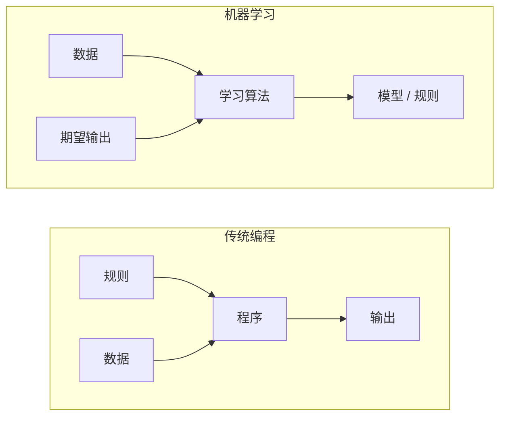
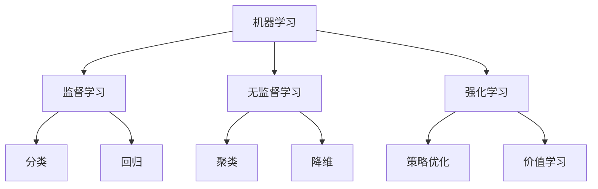
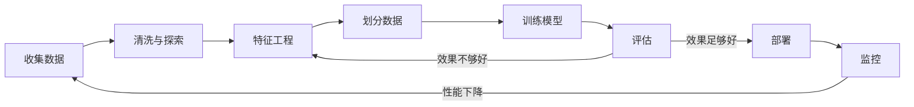
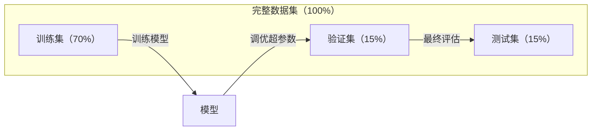
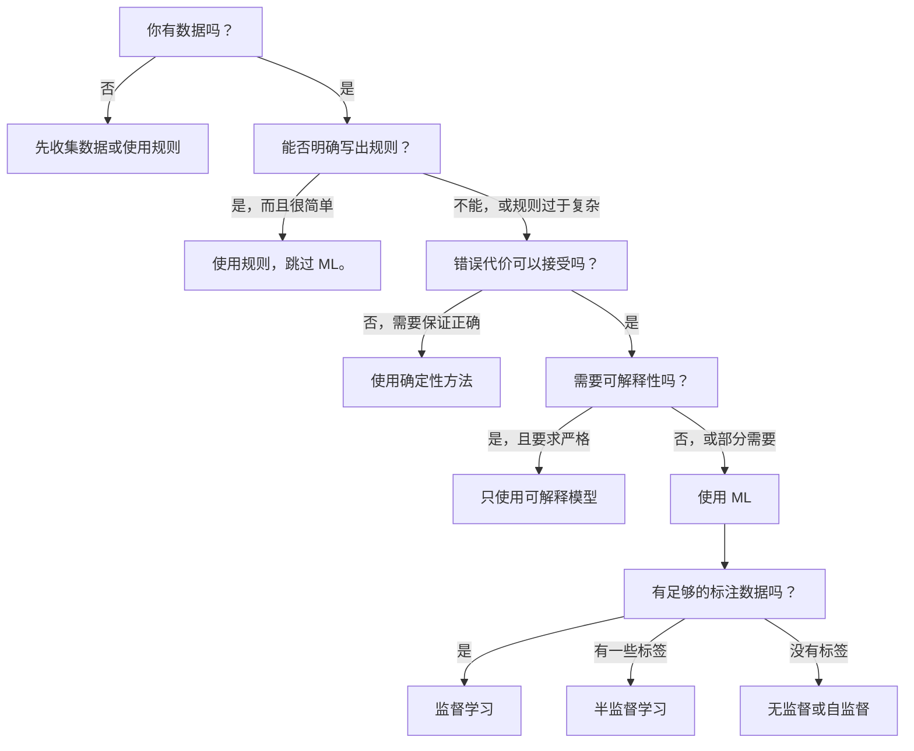

# 什么是机器学习

> 机器学习不是手工编写规则，而是教计算机从数据中发现模式。

**类型：** 学习  
**学习实现：** Python  
**前置课程：** Phase 1（数学基础）  
**预计时间：** 约 45 分钟

## 学习目标

- 解释监督、无监督和强化学习的区别，并判断一个问题适用的类型。
- 从零实现最近质心分类器，并将它与随机基线比较。
- 区分分类与回归任务，并为二者选择合适的损失函数。
- 判断一个业务问题是否适合机器学习，还是应采用确定性规则。

## 问题

假设你要做一个垃圾邮件过滤器。传统做法是写数百条规则：“邮件含有 `FREE MONEY` 就标为垃圾邮件；感叹号超过 3 个也标为垃圾邮件。”你花数周写规则，垃圾邮件发送者一改措辞，规则就失效；于是再写更多规则，如此循环没有尽头。

机器学习反转了这个过程。你不写规则，而是给计算机数千封已标注为“垃圾邮件”或“非垃圾邮件”的邮件，让它自行找出规则。它能发现你未曾想到的模式；对方改变策略后，你只需用新数据重新训练，而不用重写程序。

从“编程规则”转向“从数据学习”正是机器学习的核心。推荐引擎、语音助手、自动驾驶汽车和语言模型都遵循这一思路。

## 概念

### 从数据学习，而非手写规则

传统编程与机器学习以相反方向解决问题。



传统编程中，你写出规则，程序把规则应用到数据上得到输出。机器学习中，你提供数据和期望输出，算法负责发现规则。

训练得到的“模型”本身就是规则，只不过它以数值（权重、参数）编码。它要从见过的样例泛化（generalize）到未见数据并作出预测。

### 机器学习的三大类型



**监督学习（supervised learning）**拥有输入—输出对，模型学习把输入映射为输出。

- “这里有 10,000 张标为猫或狗的照片，学会区分它们。”
- “这里有房屋特征和价格，学会预测价格。”

**无监督学习（unsupervised learning）**只有输入、没有标签，模型自行寻找结构。

- “这里有 10,000 份客户购买记录，找出自然形成的群组。”
- “这里有 1,000 个高维数据点，在保留结构的同时降到二维。”

**强化学习（reinforcement learning）**中，智能体在环境中采取行动并得到奖励或惩罚，学习使总奖励最大的策略（policy）。

- “玩这个游戏：赢得 +1，输掉 −1，自己找出策略。”
- “控制这个机械臂：拿起物体 +1，每浪费一秒 −0.01。”

你在实践中构建的大多数模型属于监督学习；无监督学习常用于预处理和探索；强化学习则驱动游戏 AI、机器人和语言模型的 RLHF。

### 不止三大类

上述分类清晰，但真实世界的机器学习常模糊边界。

**半监督学习（semi-supervised learning）**同时使用少量有标签与大量无标签数据，例如 100 张已标注医学图像和 100,000 张未标注图像。常见方法包括：

- **标签传播：** 建立连接相似数据点的图，让标签从已标注节点沿图扩散到未标注邻居。
- **伪标签：** 先以有标签数据训练模型，再为无标签数据预测标签，最后用全部数据重新训练；模型借此自举训练集。
- **一致性正则化：** 输入及其轻微扰动版本应得到相同预测，即使没有标签也能使用。

**自监督学习（self-supervised learning）**从数据自身创建监督信号，不需要人工标签，而是利用数据结构构造预测任务。

- **掩码语言模型（BERT）：** 遮住句中 15% 的词，训练模型预测缺失词；“标签”来自原始文本。
- **对比学习（SimCLR）：** 对一张图生成两个增强版本，训练模型识别它们来自同一图像，并与其他图像的增强版本区分开。
- **下一个词元预测（GPT）：** 根据此前所有词预测下一个词；每份文本都成为训练样例。

这不是独立于三大类之外的类别，而是融合监督和无监督思想的策略。严格地说，自监督仍是监督学习（模型在预测某物），只是标签自动生成而非人工提供。

### 分类与回归

它们是两类主要的监督学习任务。

| 方面 | 分类 | 回归 |
|---|---|---|
| 输出 | 离散类别 | 连续数值 |
| 示例 | “这封邮件是垃圾邮件吗？” | “房价会是多少？” |
| 输出空间 | `{cat, dog, bird}` | 任意实数 |
| 损失函数 | 交叉熵、准确率 | 均方误差、MAE |
| 决策 | 类别间的边界 | 拟合数据的曲线 |

分类回答“属于哪一类”，回归回答“有多少”。有些问题可被表述为二者之一：预测股票涨跌是分类，预测精确价格是回归。

### 机器学习工作流

无论采用哪种算法，每个机器学习项目都遵循同一条流水线。



**收集数据：** 获取原始数据。数据越多通常越好，但质量比数量更重要。  
**清洗与探索：** 处理缺失值、去重、可视化分布、发现异常；这一步常占整个项目 60–80% 的时间。  
**特征工程：** 将原始数据变成模型能用的特征，如把日期转为星期几、标准化数值列、编码类别列；好特征往往比花哨算法更重要。  
**划分数据：** 分为训练、验证和测试集；模型在训练集学习，在验证集调超参数，最终在测试集报告结果。  
**训练模型：** 把训练数据输入算法，算法调整内部参数以最小化损失函数。  
**评估：** 在验证/测试数据上衡量性能；若不够好，尝试其他特征、算法或超参数。  
**部署：** 将模型投入生产，对新数据作预测。  
**监控：** 跟踪长期性能；数据分布会改变（数据漂移），模型会退化，性能下降时需要重训。

### 训练、验证和测试集

这是初学者最容易犯错的概念：必须在训练期间从未见过的数据上评估模型，否则测到的是记忆而不是学习。



| 划分 | 目的 | 使用时机 | 典型比例 |
|---|---|---|---|
| 训练集 | 模型从中学习 | 训练期间 | 60–80% |
| 验证集 | 调超参数、比较模型 | 每轮训练后 | 10–20% |
| 测试集 | 最终、无偏的性能估计 | 最后且仅一次 | 10–20% |

测试集是神圣的：只能看一次。若持续根据测试表现调模型，你事实上就在训练测试集，报告的数字会失去意义。小数据集可使用 k 折交叉验证：分成 k 份，用 k−1 份训练、剩余一份验证，轮换后取平均。

### 过拟合与欠拟合


**欠拟合：** 模型过于简单，无法捕捉数据模式；例如直线拟合曲线关系。训练误差和测试误差都高。  
**过拟合：** 模型过于复杂，连训练数据中的噪声也记住；例如一条弯曲曲线穿过每个训练点，却无法处理新数据。训练误差低、测试误差高。  
**良好拟合：** 模型捕捉真实模式而不记忆噪声，训练和测试误差都合理地低。

过拟合的信号：

- 训练准确率远高于验证准确率。
- 模型在训练数据上表现好，却在新数据上表现差。
- 增加训练数据后性能改善（模型原先在记忆，而非学习）。

过拟合的修复方法：

- 获取更多训练数据。
- 降低模型复杂度（更少参数、更简单的架构）。
- 正则化（惩罚过大的权重）。
- Dropout（训练时随机置零神经元）。
- 早停（验证误差开始升高时停止训练）。

欠拟合的修复方法：

- 使用更复杂的模型。
- 添加更多特征。
- 减小正则化。
- 训练更久。

### 偏差—方差权衡

这是理解过拟合和欠拟合的数学框架。

**偏差（bias）：** 来自模型错误假设的误差；真实关系非线性时，线性模型偏差很高，高偏差会导致欠拟合。  
**方差（variance）：** 模型对训练数据微小波动的敏感性；高方差模型在不同数据子集上训练会给出很不同的预测，高方差会导致过拟合。

| 模型复杂度 | 偏差 | 方差 | 结果 |
|---|---|---|---|
| 过低（用线性模型拟合曲线数据） | 高 | 低 | 欠拟合 |
| 恰好合适 | 中 | 中 | 泛化良好 |
| 过高（用 20 次多项式拟合 10 个点） | 低 | 高 | 过拟合 |

总误差 = 偏差² + 方差 + 不可约噪声。不可约噪声是数据本身的随机性，无法消除；目标是找到使偏差²加方差最小的平衡点。

### 没有免费午餐定理

不存在对每个问题都最好的单一算法。某算法在一类问题上表现优秀，必然会在另一类问题上表现不佳，所以数据科学家会尝试多种算法并比较结果。

实际选择取决于：

- 拥有多少数据。
- 有多少特征。
- 关系是线性还是非线性。
- 是否需要可解释性。
- 能承担多少计算成本。

### 不该使用机器学习的时候

机器学习很强大，但不总是正确工具。在拿起模型前，先问自己是否真的需要它。

**不要在以下情况使用机器学习：**

- **规则简单且定义明确。** 例如税款计算、排序、单位换算；几条 `if` 就能写出的逻辑，模型只会增加复杂度而没有收益。
- **没有数据或数据极少。** 机器学习需要样例；只有 10 个数据点时无法训练有意义的模型，应先收集数据。
- **犯错代价灾难性且必须保证正确。** 例如医疗剂量计算、核反应堆控制、密码验证；模型具有概率性，若不能接受“有时会错”，应使用确定性方法。
- **查找表或启发式规则已经解决问题。** 简单阈值或表格若覆盖 99% 情况，加入 ML 只会增加维护成本。
- **必须解释每个决定。** 借贷、保险、刑事司法等受监管领域可能要求完全可解释；有些模型可解释（线性回归、小决策树），多数则不可。
- **问题变化快于重训速度。** 若规则每天变化、重训要一周，模型会一直过时。

使用如下决策流程图：



```figure
f3-learning-boundary
```

## 动手实现

`code/ml_intro.py` 从零实现最近质心（nearest centroid）分类器，这是最简单的 ML 算法：从数据学习，再对新数据预测。

### 步骤 1：从零实现最近质心分类器

该分类器计算训练数据中每一类的中心（均值），预测时把新点分给距离最近的类中心。

```python
class NearestCentroid:
    def fit(self, X, y):
        self.classes = np.unique(y)
        self.centroids = np.array([
            X[y == c].mean(axis=0) for c in self.classes
        ])

    def predict(self, X):
        distances = np.array([
            np.sqrt(((X - c) ** 2).sum(axis=1))
            for c in self.centroids
        ])
        return self.classes[distances.argmin(axis=0)]
```

这就是完整算法：`fit` 计算两个均值，`predict` 计算距离；没有梯度下降、迭代或超参数。

### 步骤 2：在合成数据上训练

下面生成一个两类、略有重叠的二维分类数据集。质心分类器会在两个类中心之间画出线性决策边界。

```python
rng = np.random.RandomState(42)
X_class0 = rng.randn(100, 2) + np.array([1.0, 1.0])
X_class1 = rng.randn(100, 2) + np.array([-1.0, -1.0])
X = np.vstack([X_class0, X_class1])
y = np.array([0] * 100 + [1] * 100)
```

### 步骤 3：与基线比较

每个 ML 模型都应与一个平凡基线比较。这里的基线随机预测类别；若模型胜不过随机猜测，必然有问题。

```python
baseline_preds = rng.choice([0, 1], size=len(y_test))
baseline_acc = np.mean(baseline_preds == y_test)
```

在这个干净数据集上，质心分类器准确率应约为 90% 以上，随机基线约为 50%。

### 为什么重要

最近质心分类器极其简单：没有超参数、迭代或梯度下降，却完整呈现 ML 的基本模式：

1. 从训练数据**学习**表示（质心）。
2. 利用该表示对新数据**预测**（最近距离）。
3. 与基线（随机猜测）**评估**比较。

从逻辑回归到 Transformer，每个 ML 算法都遵循这三步；表示会更复杂，工作流不会改变。

### 步骤 4：质心分类器做不到什么

最近质心分类器假设每个类别是单一团块，并绘制线性决策边界。以下情况会失败：

- 类别包含多个簇（如数字 “1” 有多种写法）。
- 决策边界非线性（如一类环绕另一类）。
- 特征尺度差异很大（距离被最大尺度特征支配）。

这些局限推动了后续算法：K 近邻处理多个簇，决策树处理非线性边界，特征缩放解决尺度问题。每课都建立在前一课的局限之上。

## 在工具中使用

scikit-learn 提供 `NearestCentroid` 和合成数据生成器：

```python
from sklearn.neighbors import NearestCentroid
from sklearn.datasets import make_classification
from sklearn.model_selection import train_test_split

X, y = make_classification(
    n_samples=500, n_features=2, n_redundant=0,
    n_clusters_per_class=1, random_state=42
)
X_train, X_test, y_train, y_test = train_test_split(X, y, test_size=0.3)

clf = NearestCentroid()
clf.fit(X_train, y_train)
print(f"Accuracy: {clf.score(X_test, y_test):.3f}")
```

## 产出

本课产出 `outputs/prompt-ml-problem-framer.md`：一个把模糊业务问题转成具体 ML 任务的提示词。输入“我们想降低流失率”或“预测下一季度需求”等描述，它会识别学习类型、定义预测目标、列出候选特征、选择成功指标、建立基线，并标出数据泄漏和类别不平衡等风险。在任何 ML 项目开头使用它，避免构建错误的问题。

## 关键术语

| 术语 | 常见说法 | 准确含义 |
|---|---|---|
| 模型 | “AI 本身” | 将输入映射为输出、带可学习参数的数学函数。 |
| 训练 | “教 AI” | 运行优化算法，调整模型参数，使预测匹配已知输出。 |
| 特征 | “输入列” | 模型用来预测的、数据中可测量的属性。 |
| 标签 | “答案” | 训练样例的已知输出，用来计算误差信号。 |
| 超参数 | “可调设置” | 训练前设定、控制学习过程的参数（学习率、层数）。 |
| 损失函数 | “模型有多错” | 衡量预测与真实输出差距、训练试图最小化的函数。 |
| 过拟合 | “记住了测试” | 模型学到训练特有噪声而非一般模式，因而在新数据失败。 |
| 欠拟合 | “什么也没学到” | 模型过于简单，无法捕捉真实模式。 |
| 泛化 | “新数据上也有效” | 模型在未训练过的数据上作出准确预测的能力。 |
| 交叉验证 | “在不同分块上测试” | 反复划分训练/测试折并取平均，得到更稳健的性能估计。 |
| 正则化 | “让权重保持小” | 在损失中加入惩罚项，抑制过度复杂模型。 |
| 数据漂移 | “世界变了” | 流入数据的统计分布随时间改变，使模型性能下降。 |

## 练习

1. 选择任意数据集（如 Iris、Titanic），按 70/15/15 划分训练/验证/测试集；解释为何不应在测试集上调超参数。
2. 列出三个现实问题，对每个判断它是分类、回归还是聚类，以及监督还是无监督学习。
3. 一个模型训练准确率 99%、测试准确率 60%。诊断问题，并列出三项可能的修复尝试。

## 延伸阅读

- [An Introduction to Statistical Learning](https://www.statlearning.com/) - 免费教材，涵盖全部经典 ML 方法及实践例子。
- [Google's Machine Learning Crash Course](https://developers.google.com/machine-learning/crash-course) - 简洁、可视化的 ML 概念入门。
- [Scikit-learn User Guide](https://scikit-learn.org/stable/user_guide.html) - 使用 Python 实现 ML 的实用参考。
