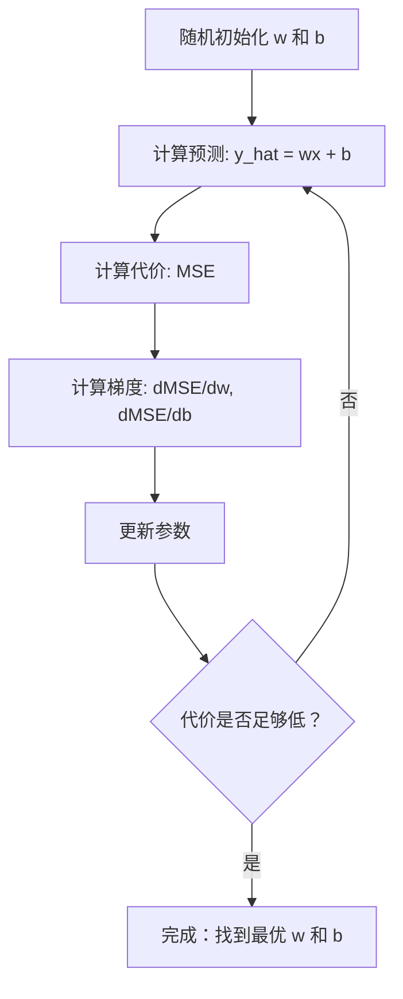

# 线性回归

> 线性回归会穿过数据画出最合适的直线；它是机器学习的“Hello World”。

**类型：** 构建  
**学习实现：** Python  
**前置课程：** Phase 1（线性代数、微积分、优化），Phase 2 第 1 课  
**预计时间：** 约 90 分钟

## 学习目标

- 推导均方误差的梯度下降更新式，并从零实现线性回归。
- 从计算复杂度和适用场景比较梯度下降与正规方程。
- 构建带特征标准化的多元线性回归，并解释学得的权重。
- 解释 Ridge 回归（L2 正则化）如何通过惩罚大权重防止过拟合。

## 问题

你有房屋面积与售价的数据，想根据面积预测新房价格。散点图上可以目测趋势，但还需要一个可代入任意面积、给出价格预测的公式；也就是一条最贴合数据的直线。

线性回归提供这条直线，并引入整个 ML 训练循环：定义模型、定义代价函数、优化参数。每个 ML 算法都遵循这一模式；在最简单的案例中掌握它，之后随处都能认出它。线性回归也绝非只用于简单问题：需求预测、A/B 测试分析、金融建模，以及各种回归任务的基线，都在生产系统中使用它。

## 概念

### 模型

线性回归假设输入 `x` 与输出 `y` 存在线性关系：

```text
y = wx + b
```

- `w`（weight/slope，权重/斜率）：`x` 每增加 1 时 `y` 的变化量。
- `b`（bias/intercept，偏置/截距）：`x = 0` 时 `y` 的值。

对多个输入（特征），模型扩展为：

```text
y = w1*x1 + w2*x2 + ... + wn*xn + b
```

向量形式为 `y = w^T * x + b`。目标是在全部训练样例上找到 `w`、`b`，使预测 `y` 尽量接近真实 `y`。

### 代价函数（均方误差）

“尽量接近”需要一个概括预测错误的单一数值。最常用的是均方误差（MSE）：

```text
MSE = (1/n) * sum((y_predicted - y_actual)^2)
```

平方有两个原因：它对大误差惩罚更重（误差 10 比误差 1 严重 100 倍，而非 10 倍），且平方函数处处光滑可导，便于优化。对单一 `w` 和 `b`，MSE 曲面像凸的碗状抛物面，最低点使 MSE 最小；训练就是找到该点。

### 梯度下降 <!-- learning-atlas: gradient-descent -->

梯度下降通过持续向下坡方向走来找到碗底。



梯度同时告诉你每个参数该往哪个方向走，以及走多远。对 `y_hat = wx + b` 的 MSE：

```text
dMSE/dw = (2/n) * sum((y_hat - y) * x)
dMSE/db = (2/n) * sum(y_hat - y)
```

更新规则为：

```text
w = w - learning_rate * dMSE/dw
b = b - learning_rate * dMSE/db
```

学习率控制步长：过大会越过最小值并发散，过小则训练极慢。常见起始值为 `0.01`、`0.001`、`0.0001`。

### 正规方程（闭式解）

对线性回归，可以不迭代而用直接公式求最优权重：

```text
w = (X^T * X)^(-1) * X^T * y
```

它通过矩阵求逆一步解出 `w`，适合小数据集。对数百万行或数千特征的大数据集，矩阵求逆相对特征数为 `O(n^3)`，应优先采用梯度下降。

### 多元线性回归

多个特征时模型为：

```text
y = w1*x1 + w2*x2 + ... + wn*xn + b
```

其余完全相同：MSE 仍是代价，梯度下降同时更新所有权重；区别只是拟合超平面而非直线。此时特征缩放很重要：若一个特征范围为 0 到 1，另一个为 0 到 1,000,000，代价曲面会被拉长，梯度下降很难收敛。训练前应标准化特征（减均值、除标准差）。

### 多项式回归

关系不线性时，仍可创建多项式特征并使用线性回归：

```text
y = w1*x + w2*x^2 + w3*x^3 + b
```

它仍是“线性”回归，因为相对于权重 `w1`、`w2`、`w3` 仍然线性，只是使用了 `x` 的非线性特征。更高次数能拟合复杂曲线，却可能过拟合；10 个点上的 10 次多项式能穿过所有点，但对新数据预测很差。

### R 平方分数

MSE 反映错误，却受 `y` 尺度影响。R 平方（`R^2`）给出与尺度无关的度量：

```text
R^2 = 1 - (sum of squared residuals) / (sum of squared deviations from mean)
    = 1 - SS_res / SS_tot
```

- `R^2 = 1.0`：预测完美。
- `R^2 = 0.0`：不比每次预测均值更好。
- `R^2 < 0.0`：比预测均值还差。

### 正则化预览（Ridge 回归）

特征很多时，模型会通过分配很大的权重过拟合。Ridge 回归（L2 正则化）加入惩罚：

```text
Cost = MSE + lambda * sum(w_i^2)
```

该项抑制大权重。超参数 `lambda` 控制权衡：越大，权重越小、正则化越强。后续课程将深入介绍；现在先记住它存在以及为何有效。

```figure
linear-regression-fit
```

## 动手实现

### 步骤 1：生成样例数据

```python
import random
import math

random.seed(42)

TRUE_W = 3.0
TRUE_B = 7.0
N_SAMPLES = 100

X = [random.uniform(0, 10) for _ in range(N_SAMPLES)]
y = [TRUE_W * x + TRUE_B + random.gauss(0, 2.0) for x in X]

print(f"Generated {N_SAMPLES} samples")
print(f"True relationship: y = {TRUE_W}x + {TRUE_B} (+ noise)")
print(f"First 5 points: {[(round(X[i], 2), round(y[i], 2)) for i in range(5)]}")
```

### 步骤 2：用梯度下降从零实现线性回归

```python
class LinearRegression:
    def __init__(self, learning_rate=0.01):
        self.w = 0.0
        self.b = 0.0
        self.lr = learning_rate
        self.cost_history = []

    def predict(self, X):
        return [self.w * x + self.b for x in X]

    def compute_cost(self, X, y):
        predictions = self.predict(X)
        n = len(y)
        cost = sum((pred - actual) ** 2 for pred, actual in zip(predictions, y)) / n
        return cost

    def compute_gradients(self, X, y):
        predictions = self.predict(X)
        n = len(y)
        dw = (2 / n) * sum((pred - actual) * x for pred, actual, x in zip(predictions, y, X))
        db = (2 / n) * sum(pred - actual for pred, actual in zip(predictions, y))
        return dw, db

    def fit(self, X, y, epochs=1000, print_every=200):
        for epoch in range(epochs):
            dw, db = self.compute_gradients(X, y)
            self.w -= self.lr * dw
            self.b -= self.lr * db
            cost = self.compute_cost(X, y)
            self.cost_history.append(cost)
            if epoch % print_every == 0:
                print(f"  Epoch {epoch:4d} | Cost: {cost:.4f} | w: {self.w:.4f} | b: {self.b:.4f}")
        return self

    def r_squared(self, X, y):
        predictions = self.predict(X)
        y_mean = sum(y) / len(y)
        ss_res = sum((actual - pred) ** 2 for actual, pred in zip(y, predictions))
        ss_tot = sum((actual - y_mean) ** 2 for actual in y)
        return 1 - (ss_res / ss_tot)


print("=== Training Linear Regression (Gradient Descent) ===")
model = LinearRegression(learning_rate=0.005)
model.fit(X, y, epochs=1000, print_every=200)
print(f"\nLearned: y = {model.w:.4f}x + {model.b:.4f}")
print(f"True:    y = {TRUE_W}x + {TRUE_B}")
print(f"R-squared: {model.r_squared(X, y):.4f}")
```

### 步骤 3：正规方程（闭式解）

```python
class LinearRegressionNormal:
    def __init__(self):
        self.w = 0.0
        self.b = 0.0

    def fit(self, X, y):
        n = len(X)
        x_mean = sum(X) / n
        y_mean = sum(y) / n
        numerator = sum((X[i] - x_mean) * (y[i] - y_mean) for i in range(n))
        denominator = sum((X[i] - x_mean) ** 2 for i in range(n))
        self.w = numerator / denominator
        self.b = y_mean - self.w * x_mean
        return self

    def predict(self, X):
        return [self.w * x + self.b for x in X]

    def r_squared(self, X, y):
        predictions = self.predict(X)
        y_mean = sum(y) / len(y)
        ss_res = sum((actual - pred) ** 2 for actual, pred in zip(y, predictions))
        ss_tot = sum((actual - y_mean) ** 2 for actual in y)
        return 1 - (ss_res / ss_tot)


print("\n=== Normal Equation (Closed-Form) ===")
model_normal = LinearRegressionNormal()
model_normal.fit(X, y)
print(f"Learned: y = {model_normal.w:.4f}x + {model_normal.b:.4f}")
print(f"R-squared: {model_normal.r_squared(X, y):.4f}")
```

### 步骤 4：多元线性回归

以下实现同时拟合面积、卧室数和房龄；`standardize` 将特征和目标标准化，以便稳定训练。

```python
class MultipleLinearRegression:
    def __init__(self, n_features, learning_rate=0.01):
        self.weights = [0.0] * n_features
        self.bias = 0.0
        self.lr = learning_rate
        self.cost_history = []

    def predict_single(self, x):
        return sum(w * xi for w, xi in zip(self.weights, x)) + self.bias

    def predict(self, X):
        return [self.predict_single(x) for x in X]

    def compute_cost(self, X, y):
        predictions = self.predict(X)
        n = len(y)
        return sum((pred - actual) ** 2 for pred, actual in zip(predictions, y)) / n

    def fit(self, X, y, epochs=1000, print_every=200):
        n = len(y)
        n_features = len(X[0])
        for epoch in range(epochs):
            predictions = self.predict(X)
            errors = [pred - actual for pred, actual in zip(predictions, y)]
            for j in range(n_features):
                grad = (2 / n) * sum(errors[i] * X[i][j] for i in range(n))
                self.weights[j] -= self.lr * grad
            grad_b = (2 / n) * sum(errors)
            self.bias -= self.lr * grad_b
            cost = self.compute_cost(X, y)
            self.cost_history.append(cost)
            if epoch % print_every == 0:
                print(f"  Epoch {epoch:4d} | Cost: {cost:.4f}")
        return self

    def r_squared(self, X, y):
        predictions = self.predict(X)
        y_mean = sum(y) / len(y)
        ss_res = sum((actual - pred) ** 2 for actual, pred in zip(y, predictions))
        ss_tot = sum((actual - y_mean) ** 2 for actual in y)
        return 1 - (ss_res / ss_tot)


random.seed(42)
N = 100
X_multi = []
y_multi = []
for _ in range(N):
    size = random.uniform(500, 3000)
    bedrooms = random.randint(1, 5)
    age = random.uniform(0, 50)
    price = 50 * size + 10000 * bedrooms - 1000 * age + 50000 + random.gauss(0, 20000)
    X_multi.append([size, bedrooms, age])
    y_multi.append(price)


def standardize(X):
    n_features = len(X[0])
    means = [sum(X[i][j] for i in range(len(X))) / len(X) for j in range(n_features)]
    stds = []
    for j in range(n_features):
        variance = sum((X[i][j] - means[j]) ** 2 for i in range(len(X))) / len(X)
        stds.append(variance ** 0.5)
    X_scaled = []
    for i in range(len(X)):
        row = [(X[i][j] - means[j]) / stds[j] if stds[j] > 0 else 0 for j in range(n_features)]
        X_scaled.append(row)
    return X_scaled, means, stds


y_mean_val = sum(y_multi) / len(y_multi)
y_std_val = (sum((yi - y_mean_val) ** 2 for yi in y_multi) / len(y_multi)) ** 0.5
y_scaled = [(yi - y_mean_val) / y_std_val for yi in y_multi]

X_scaled, x_means, x_stds = standardize(X_multi)

print("\n=== Multiple Linear Regression (3 features) ===")
print("Features: house size, bedrooms, age")
multi_model = MultipleLinearRegression(n_features=3, learning_rate=0.01)
multi_model.fit(X_scaled, y_scaled, epochs=1000, print_every=200)

print(f"\nWeights (standardized): {[round(w, 4) for w in multi_model.weights]}")
print(f"Bias (standardized): {multi_model.bias:.4f}")
print(f"R-squared: {multi_model.r_squared(X_scaled, y_scaled):.4f}")
```

### 步骤 5：多项式回归

```python
class PolynomialRegression:
    def __init__(self, degree, learning_rate=0.01):
        self.degree = degree
        self.weights = [0.0] * degree
        self.bias = 0.0
        self.lr = learning_rate

    def make_features(self, X):
        return [[x ** (d + 1) for d in range(self.degree)] for x in X]

    def predict(self, X):
        features = self.make_features(X)
        return [sum(w * f for w, f in zip(self.weights, row)) + self.bias for row in features]

    def fit(self, X, y, epochs=1000, print_every=200):
        features = self.make_features(X)
        n = len(y)
        for epoch in range(epochs):
            predictions = [sum(w * f for w, f in zip(self.weights, row)) + self.bias for row in features]
            errors = [pred - actual for pred, actual in zip(predictions, y)]
            for j in range(self.degree):
                grad = (2 / n) * sum(errors[i] * features[i][j] for i in range(n))
                self.weights[j] -= self.lr * grad
            grad_b = (2 / n) * sum(errors)
            self.bias -= self.lr * grad_b
            if epoch % print_every == 0:
                cost = sum(e ** 2 for e in errors) / n
                print(f"  Epoch {epoch:4d} | Cost: {cost:.6f}")
        return self

    def r_squared(self, X, y):
        predictions = self.predict(X)
        y_mean = sum(y) / len(y)
        ss_res = sum((actual - pred) ** 2 for actual, pred in zip(y, predictions))
        ss_tot = sum((actual - y_mean) ** 2 for actual in y)
        return 1 - (ss_res / ss_tot)


random.seed(42)
X_poly = [x / 10.0 for x in range(0, 50)]
y_poly = [0.5 * x ** 2 - 2 * x + 3 + random.gauss(0, 1.0) for x in X_poly]

x_max = max(abs(x) for x in X_poly)
X_poly_norm = [x / x_max for x in X_poly]
y_poly_mean = sum(y_poly) / len(y_poly)
y_poly_std = (sum((yi - y_poly_mean) ** 2 for yi in y_poly) / len(y_poly)) ** 0.5
y_poly_norm = [(yi - y_poly_mean) / y_poly_std for yi in y_poly]

print("\n=== Polynomial Regression (degree 2 vs degree 5) ===")
print("True relationship: y = 0.5x^2 - 2x + 3")

print("\nDegree 2:")
poly2 = PolynomialRegression(degree=2, learning_rate=0.1)
poly2.fit(X_poly_norm, y_poly_norm, epochs=2000, print_every=500)
print(f"  R-squared: {poly2.r_squared(X_poly_norm, y_poly_norm):.4f}")

print("\nDegree 5:")
poly5 = PolynomialRegression(degree=5, learning_rate=0.1)
poly5.fit(X_poly_norm, y_poly_norm, epochs=2000, print_every=500)
print(f"  R-squared: {poly5.r_squared(X_poly_norm, y_poly_norm):.4f}")

print("\nDegree 2 fits the true curve well. Degree 5 fits training data slightly better")
print("but risks overfitting on new data.")
```

二次模型拟合真实曲线良好；五次模型在训练数据上略好，却可能在新数据上过拟合。

### 步骤 6：Ridge 回归（L2 正则化）

```python
class RidgeRegression:
    def __init__(self, n_features, learning_rate=0.01, alpha=1.0):
        self.weights = [0.0] * n_features
        self.bias = 0.0
        self.lr = learning_rate
        self.alpha = alpha

    def predict_single(self, x):
        return sum(w * xi for w, xi in zip(self.weights, x)) + self.bias

    def predict(self, X):
        return [self.predict_single(x) for x in X]

    def fit(self, X, y, epochs=1000, print_every=200):
        n = len(y)
        n_features = len(X[0])
        for epoch in range(epochs):
            predictions = self.predict(X)
            errors = [pred - actual for pred, actual in zip(predictions, y)]
            mse = sum(e ** 2 for e in errors) / n
            reg_term = self.alpha * sum(w ** 2 for w in self.weights)
            cost = mse + reg_term
            for j in range(n_features):
                grad = (2 / n) * sum(errors[i] * X[i][j] for i in range(n))
                grad += 2 * self.alpha * self.weights[j]
                self.weights[j] -= self.lr * grad
            grad_b = (2 / n) * sum(errors)
            self.bias -= self.lr * grad_b
            if epoch % print_every == 0:
                print(f"  Epoch {epoch:4d} | Cost: {cost:.4f} | L2 penalty: {reg_term:.4f}")
        return self


print("\n=== Ridge Regression (L2 Regularization) ===")
print("Same data as multiple regression, with alpha=0.1")
ridge = RidgeRegression(n_features=3, learning_rate=0.01, alpha=0.1)
ridge.fit(X_scaled, y_scaled, epochs=1000, print_every=200)
print(f"\nRidge weights: {[round(w, 4) for w in ridge.weights]}")
print(f"Plain weights: {[round(w, 4) for w in multi_model.weights]}")
print("Ridge weights are smaller (shrunk toward zero) due to the L2 penalty.")
```

Ridge 的权重因 L2 惩罚被向零收缩，通常会小于未正则化回归的权重。

## 在工具中使用

下面是实际生产中会使用的 scikit-learn 版本；它与从零实现给出相同结果，但库会处理边界情况、数值稳定性和性能优化。生产环境使用库；从零实现用于理解其原理。

```python
from sklearn.linear_model import LinearRegression as SklearnLR
from sklearn.linear_model import Ridge
from sklearn.preprocessing import PolynomialFeatures, StandardScaler
from sklearn.model_selection import train_test_split
from sklearn.metrics import mean_squared_error, r2_score
import numpy as np

np.random.seed(42)
X_sk = np.random.uniform(0, 10, (100, 1))
y_sk = 3.0 * X_sk.squeeze() + 7.0 + np.random.normal(0, 2.0, 100)

X_train, X_test, y_train, y_test = train_test_split(X_sk, y_sk, test_size=0.2, random_state=42)

lr = SklearnLR()
lr.fit(X_train, y_train)
y_pred = lr.predict(X_test)

print("=== Scikit-learn Linear Regression ===")
print(f"Coefficient (w): {lr.coef_[0]:.4f}")
print(f"Intercept (b): {lr.intercept_:.4f}")
print(f"R-squared (test): {r2_score(y_test, y_pred):.4f}")
print(f"MSE (test): {mean_squared_error(y_test, y_pred):.4f}")

poly = PolynomialFeatures(degree=2, include_bias=False)
X_poly_sk = poly.fit_transform(X_train)
X_poly_test = poly.transform(X_test)

lr_poly = SklearnLR()
lr_poly.fit(X_poly_sk, y_train)
print(f"\nPolynomial degree 2 R-squared: {r2_score(y_test, lr_poly.predict(X_poly_test)):.4f}")

scaler = StandardScaler()
X_train_scaled = scaler.fit_transform(X_train)
X_test_scaled = scaler.transform(X_test)

ridge = Ridge(alpha=1.0)
ridge.fit(X_train_scaled, y_train)
print(f"Ridge R-squared: {r2_score(y_test, ridge.predict(X_test_scaled)):.4f}")
print(f"Ridge coefficient: {ridge.coef_[0]:.4f}")
```

## 产出

本课产出：

- `outputs/skill-regression.md` —— 根据问题选择合适回归方法的技能。

## 练习

1. 实现批量梯度下降、随机梯度下降（SGD）和小批量梯度下降；在相同数据集上比较收敛速度。哪种最快？哪种代价曲线最平滑？
2. 从三次函数（`y = ax^3 + bx^2 + cx + d + noise`）生成数据，拟合 1、3、10 次多项式，比较训练 `R^2` 与测试 `R^2`；从几次开始过拟合明显？
3. 实现 Lasso 回归（L1 正则化：`penalty = alpha * sum(|w_i|)`），在多特征房屋数据上训练；比较哪些权重会变为零、哪些 Ridge 不会，以及 L1 为何产生稀疏解而 L2 不会。

## 关键术语

| 术语 | 常见说法 | 准确含义 |
|---|---|---|
| 线性回归 | “给数据画直线” | 找到权重 `w` 与偏置 `b`，最小化 `wx+b` 和真实 `y` 的平方差之和。 |
| 代价函数 | “模型有多差” | 将模型参数映射为单一预测误差数值、供优化最小化的函数。 |
| 均方误差 | “平方误差的平均” | `(1/n) * sum(predicted - actual)^2`，对大误差施加不成比例的惩罚。 |
| 梯度下降 | “往下坡走” | 利用偏导数反复沿降低代价的方向调整参数。 |
| 学习率 | “步长” | 控制每次梯度下降时参数变化量的标量。 |
| 正规方程 | “直接求解” | `w = (X^T X)^-1 X^T y` 的闭式解，无需迭代即可给出最优权重。 |
| R 平方 | “拟合有多好” | 模型解释的 `y` 方差比例，范围从负无穷到 1.0。 |
| 特征缩放 | “让特征可比较” | 把特征转换到类似范围（如零均值、单位方差），使梯度下降更快收敛。 |
| 正则化 | “惩罚复杂度” | 在代价中加入收缩权重的项，防止过拟合。 |
| Ridge 回归 | “L2 正则化” | 在 MSE 中加入 `lambda * sum(w_i^2)` 惩罚的线性回归。 |
| 多项式回归 | “用线性数学拟合曲线” | 对多项式特征（`x`、`x^2`、`x^3`……）进行线性回归；相对权重仍线性。 |
| 过拟合 | “记住训练数据” | 模型复杂到拟合训练噪声，因而在新数据上失败。 |

## 延伸阅读

- [An Introduction to Statistical Learning (ISLR)](https://www.statlearning.com/) -- 免费 PDF；第 3、6 章以实用 R 示例介绍线性回归和正则化。
- [The Elements of Statistical Learning (ESL)](https://hastie.su.domains/ElemStatLearn/) -- 免费 PDF；ISLR 的数学性补充，更深入介绍 Ridge 和 Lasso。
- [Stanford CS229 Lecture Notes on Linear Regression](https://cs229.stanford.edu/main_notes.pdf) -- Andrew Ng 从第一原理推导正规方程与梯度下降的讲义。
- [scikit-learn LinearRegression documentation](https://scikit-learn.org/stable/modules/linear_model.html) -- LinearRegression、Ridge、Lasso、ElasticNet 及代码示例的实用参考。
