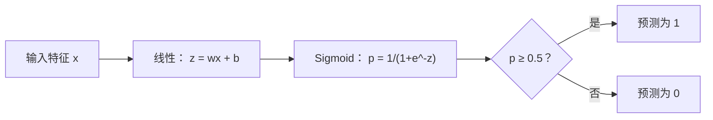
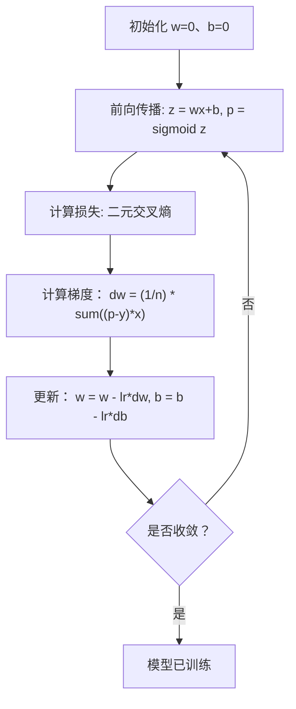

# 逻辑回归

> 逻辑回归把直线弯成 S 曲线，以概率回答“是或否”的问题。

**类型：** 构建  
**学习实现：** Python  
**前置课程：** Phase 2 第 1–2 课（什么是 ML、线性回归）  
**预计时间：** 约 90 分钟

## 学习目标

- 使用 sigmoid 函数和二元交叉熵损失从零实现逻辑回归。
- 计算并解释二元分类的精确率、召回率、F1 分数和混淆矩阵。
- 解释 MSE 为何不适合分类，以及二元交叉熵为何产生凸代价曲面。
- 构建用于多类别分类的 softmax 回归，并评估阈值调节的权衡。

## 问题

想根据肿瘤大小预测它是恶性还是良性。线性回归会给出 `0.3`、`1.7`、`-0.5` 等数字；`1.7` 是“非常恶性”吗，`-0.5` 是“非常良性”吗？线性回归的输出无界，而分类需要 0 到 1 的有界概率及明确的“是/否”决定。

逻辑回归保留同一个线性组合 `wx + b`，但把它送入 sigmoid 函数，将任意数压缩到 `(0, 1)`。输出成为概率，再以通常为 `0.5` 的阈值作决定。尽管名称含“回归”，它是分类算法；名称来自所使用的 logistic（sigmoid）函数，也是实践中最常用的算法之一。

## 概念

### 线性回归为何不能分类

设想根据学习时长预测通过/不通过（1/0）：

```text
hours:  1   2   3   4   5   6   7   8   9   10
actual: 0   0   0   0   1   1   1   1   1   1
```

线性拟合在第 1 小时可能预测 `-0.2`，第 10 小时可能预测 `1.3`；它们不是概率，且落在 0 到 1 之外。一个离群点（学习 50 小时的人）还会拉动整条线，改变所有人的预测。

分类需要的函数应：

- 输出 0 到 1 的值（概率）。
- 形成清晰的转变（决策边界）。
- 不被远离边界的离群点扭曲。

### Sigmoid 函数

sigmoid 正好满足这些条件：

```text
sigmoid(z) = 1 / (1 + e^(-z))
```

性质：

- `z` 很大且为正时，sigmoid(z) 趋近 1。
- `z` 很大且为负时，sigmoid(z) 趋近 0。
- `z = 0` 时，sigmoid(z) = 0.5。
- 输出始终在 0 到 1 之间。
- 函数处处光滑且可导。

其导数形式很方便：`sigmoid'(z) = sigmoid(z) * (1 - sigmoid(z))`，因此梯度计算高效。

### 逻辑回归 = 线性模型 + Sigmoid

模型先计算与线性回归相同的 `z = wx + b`，再应用 sigmoid：



输出 `p` 表示 `P(y=1 | x)`，即输入属于类 1 的概率。决策边界为 `wx + b = 0`，此时 sigmoid 恰为 `0.5`。

### 二元交叉熵损失 <!-- learning-atlas: binary-cross-entropy-loss -->

逻辑回归不能使用 MSE：sigmoid 加 MSE 会产生含许多局部最小值的非凸代价曲面。应使用二元交叉熵（log loss）：

```text
Loss = -(1/n) * sum(y * log(p) + (1-y) * log(1-p))
```

其原因：

- `y=1`、`p` 接近 1 时：`log(1) = 0`，损失接近 0（正确、代价低）。
- `y=1`、`p` 接近 0 时：`log(0)` 趋于负无穷，损失很大（错误、代价高）。
- `y=0`、`p` 接近 0 时：`log(1) = 0`，损失接近 0（正确、代价低）。
- `y=0`、`p` 接近 1 时：`log(0)` 趋于负无穷，损失很大（错误、代价高）。

对逻辑回归，该损失是凸的，保证只有一个全局最小值。

### 逻辑回归的梯度下降

二元交叉熵结合 sigmoid 的梯度形式很简洁：

```text
dL/dw = (1/n) * sum((p - y) * x)
dL/db = (1/n) * sum(p - y)
```

它看起来与线性回归梯度相同，区别只是 `p = sigmoid(wx + b)` 而不是 `p = wx + b`。sigmoid 引入非线性，更新规则保持不变。



### 决策边界

二维输入（两个特征）的决策边界是下式为零的直线：

```text
w1*x1 + w2*x2 + b = 0
```

一侧的点归为 1，另一侧归为 0。因此逻辑回归总产生线性边界；若需要曲线边界，可添加多项式特征或使用非线性模型。

### 用 Softmax 进行多类别分类

二元逻辑回归处理两类，`k` 类则使用 softmax：

```text
softmax(z_i) = e^(z_i) / sum(e^(z_j) for all j)
```

每类有独立权重向量。模型为每类算分数 `z_i`，softmax 把它们变为和为 1 的概率，最大概率所在类即预测类。损失变为类别交叉熵：

```text
Loss = -(1/n) * sum(sum(y_k * log(p_k)))
```

其中真实类别的 `y_k` 为 1、其余为 0（one-hot 编码）。

### 评估指标

仅看准确率不够。若数据 95% 为负类、5% 为正类，一个永远预测负类的模型有 95% 准确率却毫无用处。

**混淆矩阵：**

| | 预测为正 | 预测为负 |
|---|---|---|
| 实际为正 | 真正例（TP） | 假负例（FN） |
| 实际为负 | 假正例（FP） | 真负例（TN） |

**精确率（precision）：** 已预测为正的样本中，多少确为正？

```text
Precision = TP / (TP + FP)
```

**召回率（recall/sensitivity）：** 实际为正的样本中，捕获了多少？

```text
Recall = TP / (TP + FN)
```

**F1 分数：** 精确率与召回率的调和平均，用于平衡二者。

```text
F1 = 2 * (Precision * Recall) / (Precision + Recall)
```

优先考虑的指标：

- **精确率：** 假正例代价高时（垃圾邮件过滤，不能拦截正常邮件）。
- **召回率：** 假负例代价高时（癌症筛查，不能漏掉肿瘤）。
- **F1：** 需要单一平衡指标时。

```figure
logistic-sigmoid
```

## 动手实现

### 步骤 1：Sigmoid 函数和数据生成

```python
import random
import math

def sigmoid(z):
    z = max(-500, min(500, z))
    return 1.0 / (1.0 + math.exp(-z))


random.seed(42)
N = 200
X = []
y = []

for _ in range(N // 2):
    X.append([random.gauss(2, 1), random.gauss(2, 1)])
    y.append(0)

for _ in range(N // 2):
    X.append([random.gauss(5, 1), random.gauss(5, 1)])
    y.append(1)

combined = list(zip(X, y))
random.shuffle(combined)
X, y = zip(*combined)
X = list(X)
y = list(y)

print(f"Generated {N} samples (2 classes, 2 features)")
print(f"Class 0 center: (2, 2), Class 1 center: (5, 5)")
print(f"First 5 samples:")
for i in range(5):
    print(f"  Features: [{X[i][0]:.2f}, {X[i][1]:.2f}], Label: {y[i]}")
```

### 步骤 2：从零实现逻辑回归

```python
class LogisticRegression:
    def __init__(self, n_features, learning_rate=0.01):
        self.weights = [0.0] * n_features
        self.bias = 0.0
        self.lr = learning_rate
        self.loss_history = []

    def predict_proba(self, x):
        z = sum(w * xi for w, xi in zip(self.weights, x)) + self.bias
        return sigmoid(z)

    def predict(self, x, threshold=0.5):
        return 1 if self.predict_proba(x) >= threshold else 0

    def compute_loss(self, X, y):
        n = len(y)
        total = 0.0
        for i in range(n):
            p = self.predict_proba(X[i])
            p = max(1e-15, min(1 - 1e-15, p))
            total += y[i] * math.log(p) + (1 - y[i]) * math.log(1 - p)
        return -total / n

    def fit(self, X, y, epochs=1000, print_every=200):
        n = len(y)
        n_features = len(X[0])
        for epoch in range(epochs):
            dw = [0.0] * n_features
            db = 0.0
            for i in range(n):
                p = self.predict_proba(X[i])
                error = p - y[i]
                for j in range(n_features):
                    dw[j] += error * X[i][j]
                db += error
            for j in range(n_features):
                self.weights[j] -= self.lr * (dw[j] / n)
            self.bias -= self.lr * (db / n)
            loss = self.compute_loss(X, y)
            self.loss_history.append(loss)
            if epoch % print_every == 0:
                print(f"  Epoch {epoch:4d} | Loss: {loss:.4f} | w: [{self.weights[0]:.3f}, {self.weights[1]:.3f}] | b: {self.bias:.3f}")
        return self

    def accuracy(self, X, y):
        correct = sum(1 for i in range(len(y)) if self.predict(X[i]) == y[i])
        return correct / len(y)


split = int(0.8 * N)
X_train, X_test = X[:split], X[split:]
y_train, y_test = y[:split], y[split:]

print("\n=== Training Logistic Regression ===")
model = LogisticRegression(n_features=2, learning_rate=0.1)
model.fit(X_train, y_train, epochs=1000, print_every=200)

print(f"\nTrain accuracy: {model.accuracy(X_train, y_train):.4f}")
print(f"Test accuracy:  {model.accuracy(X_test, y_test):.4f}")
print(f"Weights: [{model.weights[0]:.4f}, {model.weights[1]:.4f}]")
print(f"Bias: {model.bias:.4f}")
```

### 步骤 3：从零实现混淆矩阵和指标

```python
class ClassificationMetrics:
    def __init__(self, y_true, y_pred):
        self.tp = sum(1 for t, p in zip(y_true, y_pred) if t == 1 and p == 1)
        self.tn = sum(1 for t, p in zip(y_true, y_pred) if t == 0 and p == 0)
        self.fp = sum(1 for t, p in zip(y_true, y_pred) if t == 0 and p == 1)
        self.fn = sum(1 for t, p in zip(y_true, y_pred) if t == 1 and p == 0)

    def accuracy(self):
        total = self.tp + self.tn + self.fp + self.fn
        return (self.tp + self.tn) / total if total > 0 else 0

    def precision(self):
        denom = self.tp + self.fp
        return self.tp / denom if denom > 0 else 0

    def recall(self):
        denom = self.tp + self.fn
        return self.tp / denom if denom > 0 else 0

    def f1(self):
        p = self.precision()
        r = self.recall()
        return 2 * p * r / (p + r) if (p + r) > 0 else 0

    def print_confusion_matrix(self):
        print(f"\n  Confusion Matrix:")
        print(f"                  Predicted")
        print(f"                  Pos   Neg")
        print(f"  Actual Pos     {self.tp:4d}  {self.fn:4d}")
        print(f"  Actual Neg     {self.fp:4d}  {self.tn:4d}")

    def print_report(self):
        self.print_confusion_matrix()
        print(f"\n  Accuracy:  {self.accuracy():.4f}")
        print(f"  Precision: {self.precision():.4f}")
        print(f"  Recall:    {self.recall():.4f}")
        print(f"  F1 Score:  {self.f1():.4f}")


y_pred_test = [model.predict(x) for x in X_test]
print("\n=== Classification Report (Test Set) ===")
metrics = ClassificationMetrics(y_test, y_pred_test)
metrics.print_report()
```

### 步骤 4：决策边界分析

```python
print("\n=== Decision Boundary ===")
w1, w2 = model.weights
b = model.bias
print(f"Decision boundary: {w1:.4f}*x1 + {w2:.4f}*x2 + {b:.4f} = 0")
if abs(w2) > 1e-10:
    print(f"Solved for x2:     x2 = {-w1/w2:.4f}*x1 + {-b/w2:.4f}")

print("\nSample predictions near the boundary:")
test_points = [
    [3.0, 3.0],
    [3.5, 3.5],
    [4.0, 4.0],
    [2.5, 2.5],
    [5.0, 5.0],
]
for point in test_points:
    prob = model.predict_proba(point)
    pred = model.predict(point)
    print(f"  [{point[0]}, {point[1]}] -> prob={prob:.4f}, class={pred}")
```

### 步骤 5：带 Softmax 的多类别分类

```python
class SoftmaxRegression:
    def __init__(self, n_features, n_classes, learning_rate=0.01):
        self.n_features = n_features
        self.n_classes = n_classes
        self.lr = learning_rate
        self.weights = [[0.0] * n_features for _ in range(n_classes)]
        self.biases = [0.0] * n_classes

    def softmax(self, scores):
        max_score = max(scores)
        exp_scores = [math.exp(s - max_score) for s in scores]
        total = sum(exp_scores)
        return [e / total for e in exp_scores]

    def predict_proba(self, x):
        scores = [
            sum(self.weights[k][j] * x[j] for j in range(self.n_features)) + self.biases[k]
            for k in range(self.n_classes)
        ]
        return self.softmax(scores)

    def predict(self, x):
        probs = self.predict_proba(x)
        return probs.index(max(probs))

    def fit(self, X, y, epochs=1000, print_every=200):
        n = len(y)
        for epoch in range(epochs):
            grad_w = [[0.0] * self.n_features for _ in range(self.n_classes)]
            grad_b = [0.0] * self.n_classes
            total_loss = 0.0
            for i in range(n):
                probs = self.predict_proba(X[i])
                for k in range(self.n_classes):
                    target = 1.0 if y[i] == k else 0.0
                    error = probs[k] - target
                    for j in range(self.n_features):
                        grad_w[k][j] += error * X[i][j]
                    grad_b[k] += error
                true_prob = max(probs[y[i]], 1e-15)
                total_loss -= math.log(true_prob)
            for k in range(self.n_classes):
                for j in range(self.n_features):
                    self.weights[k][j] -= self.lr * (grad_w[k][j] / n)
                self.biases[k] -= self.lr * (grad_b[k] / n)
            if epoch % print_every == 0:
                print(f"  Epoch {epoch:4d} | Loss: {total_loss / n:.4f}")
        return self

    def accuracy(self, X, y):
        correct = sum(1 for i in range(len(y)) if self.predict(X[i]) == y[i])
        return correct / len(y)


random.seed(42)
X_3class = []
y_3class = []

centers = [(1, 1), (5, 1), (3, 5)]
for label, (cx, cy) in enumerate(centers):
    for _ in range(50):
        X_3class.append([random.gauss(cx, 0.8), random.gauss(cy, 0.8)])
        y_3class.append(label)

combined = list(zip(X_3class, y_3class))
random.shuffle(combined)
X_3class, y_3class = zip(*combined)
X_3class = list(X_3class)
y_3class = list(y_3class)

split_3 = int(0.8 * len(X_3class))
X_train_3 = X_3class[:split_3]
y_train_3 = y_3class[:split_3]
X_test_3 = X_3class[split_3:]
y_test_3 = y_3class[split_3:]

print("\n=== Multi-class Softmax Regression (3 classes) ===")
softmax_model = SoftmaxRegression(n_features=2, n_classes=3, learning_rate=0.1)
softmax_model.fit(X_train_3, y_train_3, epochs=1000, print_every=200)
print(f"\nTrain accuracy: {softmax_model.accuracy(X_train_3, y_train_3):.4f}")
print(f"Test accuracy:  {softmax_model.accuracy(X_test_3, y_test_3):.4f}")

print("\nSample predictions:")
for i in range(5):
    probs = softmax_model.predict_proba(X_test_3[i])
    pred = softmax_model.predict(X_test_3[i])
    print(f"  True: {y_test_3[i]}, Predicted: {pred}, Probs: [{', '.join(f'{p:.3f}' for p in probs)}]")
```

### 步骤 6：调节阈值

默认阈值是 `0.5`；改变阈值会在精确率和召回率之间取舍。

```python
print("\n=== Threshold Tuning ===")
print("Default threshold: 0.5. Adjusting the threshold trades precision for recall.\n")

thresholds = [0.3, 0.4, 0.5, 0.6, 0.7]
print(f"{'Threshold':>10} {'Accuracy':>10} {'Precision':>10} {'Recall':>10} {'F1':>10}")
print("-" * 52)

for t in thresholds:
    y_pred_t = [1 if model.predict_proba(x) >= t else 0 for x in X_test]
    m = ClassificationMetrics(y_test, y_pred_t)
    print(f"{t:>10.1f} {m.accuracy():>10.4f} {m.precision():>10.4f} {m.recall():>10.4f} {m.f1():>10.4f}")
```

## 在工具中使用

下面用 scikit-learn 完成同一任务：

```python
from sklearn.linear_model import LogisticRegression as SklearnLR
from sklearn.metrics import accuracy_score, precision_score, recall_score, f1_score
from sklearn.metrics import confusion_matrix, classification_report
from sklearn.model_selection import train_test_split
from sklearn.preprocessing import StandardScaler
import numpy as np

np.random.seed(42)
X_0 = np.random.randn(100, 2) + [2, 2]
X_1 = np.random.randn(100, 2) + [5, 5]
X_sk = np.vstack([X_0, X_1])
y_sk = np.array([0] * 100 + [1] * 100)

X_tr, X_te, y_tr, y_te = train_test_split(X_sk, y_sk, test_size=0.2, random_state=42)

scaler = StandardScaler()
X_tr_sc = scaler.fit_transform(X_tr)
X_te_sc = scaler.transform(X_te)

lr = SklearnLR()
lr.fit(X_tr_sc, y_tr)
y_pred = lr.predict(X_te_sc)

print("=== Scikit-learn Logistic Regression ===")
print(f"Accuracy:  {accuracy_score(y_te, y_pred):.4f}")
print(f"Precision: {precision_score(y_te, y_pred):.4f}")
print(f"Recall:    {recall_score(y_te, y_pred):.4f}")
print(f"F1:        {f1_score(y_te, y_pred):.4f}")
print(f"\nConfusion Matrix:\n{confusion_matrix(y_te, y_pred)}")
print(f"\nClassification Report:\n{classification_report(y_te, y_pred)}")
```

从零实现会得出相同的决策边界和指标。scikit-learn 另提供求解器选项（liblinear、lbfgs、saga）、自动正则化、多类别策略（one-vs-rest、multinomial）和数值稳定性优化。

## 产出

本课产出：

- `code/logistic_regression.py` —— 带指标的从零逻辑回归实现。

## 练习

1. 生成不可线性分离的数据集（如两个同心圆），训练逻辑回归并观察失败；随后加入多项式特征（`x1^2`、`x2^2`、`x1*x2`）重新训练，展示准确率提升。
2. 为三类 softmax 模型实现多类别混淆矩阵，计算每一类的精确率和召回率；哪一类最难分类？
3. 从零构建 ROC 曲线：对 0 到 1 的 100 个阈值计算真正例率和假正例率，并用梯形法则计算 AUC（曲线下面积）。

## 关键术语

| 术语 | 常见说法 | 准确含义 |
|---|---|---|
| 逻辑回归 | “用于分类的回归” | 后接 sigmoid 函数、输出类别概率的线性模型。 |
| Sigmoid 函数 | “S 曲线” | `1/(1+e^(-z))`，将任意实数映射到 `(0, 1)`。 |
| 二元交叉熵 | “对数损失” | `-[y*log(p) + (1-y)*log(1-p)]`，严厉惩罚自信但错误的预测。 |
| 决策边界 | “分界线” | 模型输出概率为 0.5、分隔预测类别的曲面。 |
| Softmax | “多类别 sigmoid” | 把分数向量转为和为 1 的概率向量的函数。 |
| 精确率 | “选中的有多少相关” | `TP / (TP + FP)`，正类预测中真实为正的比例。 |
| 召回率 | “相关的有多少被选中” | `TP / (TP + FN)`，模型正确识别出的实际正类比例。 |
| F1 分数 | “平衡准确率” | 精确率和召回率的调和平均：`2*P*R / (P+R)`。 |
| 混淆矩阵 | “错误分解” | 显示每个类别对的 TP、TN、FP、FN 计数的表。 |
| 阈值 | “截断点” | 概率高于它时预测为类 1 的值（默认 0.5，可调）。 |
| One-hot 编码 | “类别的二元列” | 用全零、仅类别 `k` 位置为 1 的向量表示类 `k`。 |
| 类别交叉熵 | “多类别对数损失” | 使用 one-hot 标签将二元交叉熵扩展到 `k` 类的损失。 |
