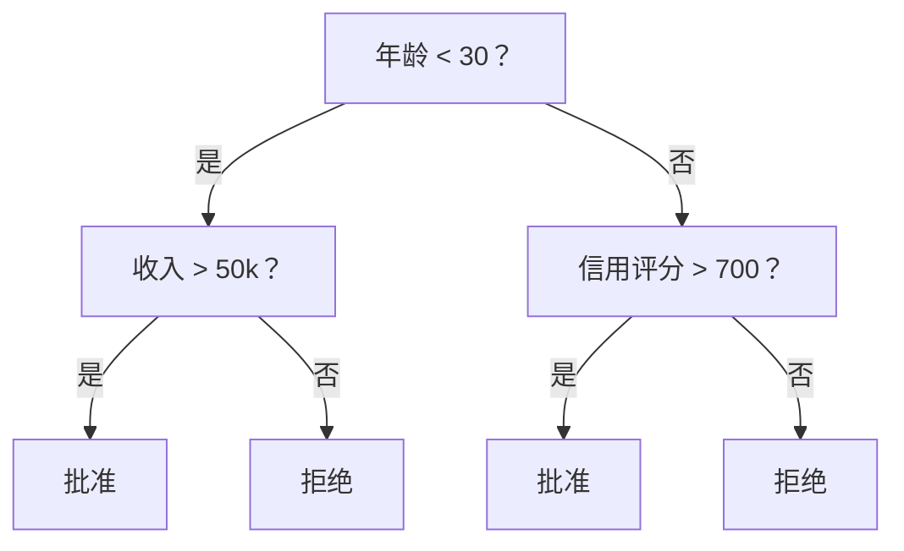
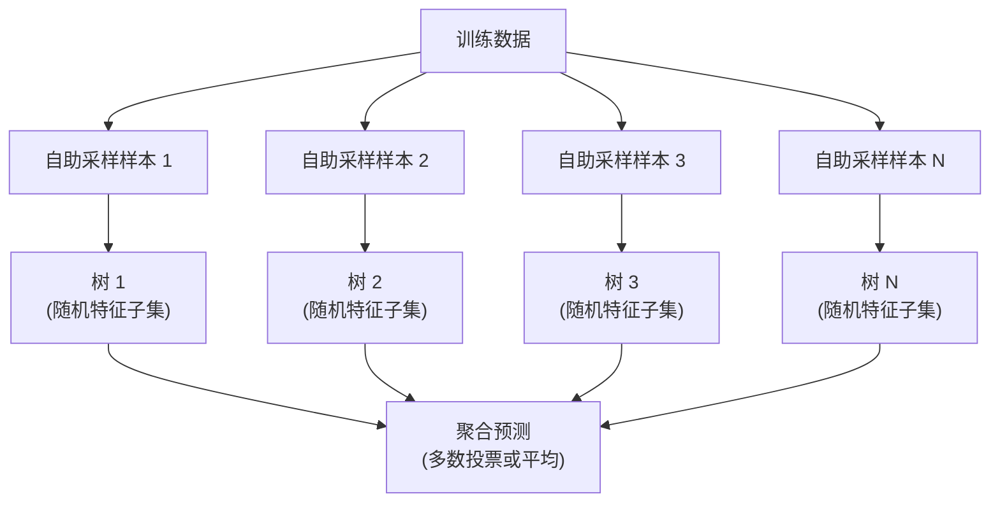

# 决策树与随机森林

> 决策树只是一个流程图；一片由它们组成的森林，却是机器学习中最强大的工具之一。

**类型：** 构建  
**学习实现：** Python  
**前置课程：** Phase 1（第 09 课信息论、第 06 课概率）  
**预计时间：** 约 90 分钟

## 学习目标

- 实现 Gini 不纯度、熵与信息增益，找出最优决策树划分。
- 使用预剪枝控制项（最大深度、最小样本数）从零构建决策树分类器。
- 通过 bootstrap 采样和特征随机化构建随机森林，并解释其为何降低方差。
- 比较 MDI 特征重要性与置换重要性，并识别 MDI 产生偏差的情形。

## 问题

你有表格数据：行是样本、列是特征，还有一个要预测的目标列。虽然可以直接使用神经网络，但对表格数据，树模型（决策树、随机森林、梯度提升树）通常持续胜过深度学习；结构化数据的 Kaggle 竞赛由 XGBoost 和 LightGBM 主导，而非 Transformer。

树可无需预处理地处理数值和类别混合特征，也能不靠特征工程处理非线性关系，并且可解释：查看树就能知道一次预测为何产生。随机森林平均许多树，对中等规模数据的过拟合尤为稳健。本课从递归划分构建决策树，再在其上构建随机森林，理解 Gini 不纯度、熵、信息增益及弱学习器集成为强学习器的原因。

## 概念

### 决策树做什么

决策树通过一系列是/否问题，把特征空间划分为矩形区域。



每个内部节点将一个特征与阈值比较，每个叶节点作预测。分类新样本时，从根节点沿分支走到叶节点。树自顶向下建立：每个节点选择最能分开数据的特征和阈值，“最能分开”由划分准则定义。

### 划分准则：度量不纯度 <!-- learning-atlas: split-criteria-measuring-impurity -->

每个节点包含一组样本，希望划分后的子节点尽量“纯”，即每个子节点大多只含一种类别。

**Gini 不纯度**度量：若按该节点的类别分布给随机样本标注，它被误分的概率。

```text
Gini(S) = 1 - sum(p_k^2)

where p_k is the proportion of class k in set S.
```

纯节点（全为同类）Gini 为 0；二元类别各占 50% 时为 0.5，越低越好。

```text
Example: 6 cats, 4 dogs

Gini = 1 - (0.6^2 + 0.4^2) = 1 - (0.36 + 0.16) = 0.48
```

**熵（entropy）**度量节点的信息量（无序程度），在 Phase 1 第 09 课已介绍：

```text
Entropy(S) = -sum(p_k * log2(p_k))
```

纯节点熵为 0，50/50 二元划分为 1.0，越低越好。

```text
Example: 6 cats, 4 dogs

Entropy = -(0.6 * log2(0.6) + 0.4 * log2(0.4))
        = -(0.6 * -0.737 + 0.4 * -1.322)
        = 0.442 + 0.529
        = 0.971 bits
```

**信息增益**是在划分后不纯度（熵或 Gini）的降低量：

```text
IG(S, feature, threshold) = Impurity(S) - weighted_avg(Impurity(S_left), Impurity(S_right))

where the weights are the proportions of samples in each child.
```

每个节点的贪心算法会尝试每个特征和每个可能阈值，选取使信息增益最大的 `(feature, threshold)` 对。

### 如何划分

当前节点有 `n` 个特征、`m` 个样本时：

1. 对每个特征 `j`（`j = 1` 至 `n`）：
   - 按特征 `j` 排序样本。
   - 尝试每对相邻不同值中点作为阈值。
   - 计算每个阈值的信息增益。
2. 选择信息增益最高的特征和阈值。
3. 将数据分为左子集（`feature <= threshold`）和右子集（`feature > threshold`）。
4. 对每个子节点递归。

这类贪心方法不能保证全局最优树；寻找最优树是 NP-hard 问题，但实践中贪心划分表现良好。

### 停止条件

没有停止条件时，树会一直长到每片叶都纯净（每叶仅一个样本），这会完美记住训练数据却泛化很差。

**预剪枝**在树完全长成前停止：

- 最大深度：树达到设定深度时停止划分。
- 每叶最小样本数：节点样本少于 k 时停止。
- 最小信息增益：最佳划分带来的不纯度改善低于阈值时停止。
- 最大叶节点数：限制叶节点总数。

**后剪枝**先长出完整树，再将其修剪：

- 代价复杂度剪枝（scikit-learn 使用）：加入与叶节点数成正比的惩罚；提高惩罚会得到更小的树。
- 缩减误差剪枝：若验证误差不增加，就移除一棵子树。

预剪枝更简单、更快；后剪枝常能产生更好的树，因为不会过早停止一个日后可能有用的划分。

### 用于回归的决策树

回归时，叶节点预测该叶目标值的均值，准则也改为**方差降低**：

```text
VR(S, feature, threshold) = Var(S) - weighted_avg(Var(S_left), Var(S_right))
```

选择方差降低最多的划分。树把输入空间分为区域，并在每一区域预测常量（均值）。

### 随机森林：集成的力量

单棵决策树方差很高，数据稍变就可能形成完全不同的树。随机森林通过平均多棵树修复这一点。



树的多样性来自两种随机性：

**Bagging（bootstrap aggregating）：** 每棵树在有放回随机抽取的 bootstrap 样本上训练。每个 bootstrap 中约出现原始样本的 63%，其余是可用于验证的袋外（out-of-bag）样本。  
**特征随机化：** 每次划分只考察随机特征子集；分类默认 `sqrt(n_features)`，回归默认 `n_features/3`，从而避免全部树都按同一主导特征划分。

关键洞见是：平均许多彼此不相关的树可以降低方差而不增加偏差。单棵树可能平庸，集成却很强。

### 特征重要性

随机森林自然会给出特征重要性。最常见的方法是：

**不纯度平均降低（MDI）：** 对每个特征，汇总它在所有树、所有使用该特征的节点产生的不纯度总降低；早期划分且降低更多不纯度的特征更重要。

```text
importance(feature_j) = sum over all nodes where feature_j is used:
    (n_samples_at_node / n_total_samples) * impurity_decrease
```

它训练时即可计算，速度快，但偏爱基数高、可选划分点多的特征。

**置换重要性**则打乱某一特征值，观察模型准确率下降多少；它更可靠，但更慢。

### 树何时胜过神经网络

在表格数据上，树和森林通常胜过神经网络：

| 因素 | 树 | 神经网络 |
|---|---|---|
| 混合类型（数值 + 类别） | 原生支持 | 需要编码 |
| 小数据集（< 10k 行） | 表现良好 | 易过拟合 |
| 特征交互 | 通过划分发现 | 需要设计架构 |
| 可解释性 | 完全透明 | 黑箱 |
| 训练时间 | 分钟 | 小时 |
| 超参数敏感度 | 低 | 高 |

数据具有空间或序列结构（图像、文本、音频）时神经网络胜出；对扁平特征表，树是默认选择。

```figure
decision-tree-depth
```

## 动手实现

### 步骤 1：Gini 不纯度与熵

从零构建两种划分准则，并验证它们会同意哪些划分较好。

```python
import math

def gini_impurity(labels):
    n = len(labels)
    if n == 0:
        return 0.0
    counts = {}
    for label in labels:
        counts[label] = counts.get(label, 0) + 1
    return 1.0 - sum((c / n) ** 2 for c in counts.values())

def entropy(labels):
    n = len(labels)
    if n == 0:
        return 0.0
    counts = {}
    for label in labels:
        counts[label] = counts.get(label, 0) + 1
    return -sum(
        (c / n) * math.log2(c / n) for c in counts.values() if c > 0
    )
```

### 步骤 2：寻找最佳划分

尝试每个特征和每个阈值，返回信息增益最大的那个。

```python
def information_gain(parent_labels, left_labels, right_labels, criterion="gini"):
    measure = gini_impurity if criterion == "gini" else entropy
    n = len(parent_labels)
    n_left = len(left_labels)
    n_right = len(right_labels)
    if n_left == 0 or n_right == 0:
        return 0.0
    parent_impurity = measure(parent_labels)
    child_impurity = (
        (n_left / n) * measure(left_labels) +
        (n_right / n) * measure(right_labels)
    )
    return parent_impurity - child_impurity
```

### 步骤 3：构建 `DecisionTree` 类

以下实现递归划分、预测和特征重要性追踪。`_build` 是树的核心：节点纯净或触及预剪枝限制时停止；否则采用最佳划分并对两个孩子递归。

```python
import random

class DecisionTree:
    def __init__(self, max_depth=None, min_samples_split=2,
                 min_samples_leaf=1, criterion="gini",
                 max_features=None):
        self.max_depth = max_depth
        self.min_samples_split = min_samples_split
        self.min_samples_leaf = min_samples_leaf
        self.criterion = criterion
        self.max_features = max_features
        self.tree = None
        self.feature_importances_ = None

    def fit(self, X, y):
        self.n_features = len(X[0])
        self.feature_importances_ = [0.0] * self.n_features
        self.n_samples = len(X)
        self.tree = self._build(X, y, depth=0)
        total = sum(self.feature_importances_)
        if total > 0:
            self.feature_importances_ = [
                fi / total for fi in self.feature_importances_
            ]

    def predict(self, X):
        return [self._predict_one(x, self.tree) for x in X]

    def _build(self, X, y, depth):
        if len(set(y)) == 1:
            return {"leaf": True, "value": y[0]}

        if self.max_depth is not None and depth >= self.max_depth:
            return self._make_leaf(y)

        if len(y) < self.min_samples_split:
            return self._make_leaf(y)

        best_feature, best_threshold, best_gain = self._best_split(X, y)

        if best_feature is None or best_gain <= 0:
            return self._make_leaf(y)

        left_X, left_y, right_X, right_y = self._split_data(
            X, y, best_feature, best_threshold
        )

        if len(left_y) < self.min_samples_leaf or len(right_y) < self.min_samples_leaf:
            return self._make_leaf(y)

        weight = len(y) / self.n_samples
        self.feature_importances_[best_feature] += weight * best_gain

        return {
            "leaf": False,
            "feature": best_feature,
            "threshold": best_threshold,
            "left": self._build(left_X, left_y, depth + 1),
            "right": self._build(right_X, right_y, depth + 1),
        }

    def _make_leaf(self, y):
        counts = {}
        for label in y:
            counts[label] = counts.get(label, 0) + 1
        return {"leaf": True, "value": max(counts, key=counts.get)}

    def _best_split(self, X, y):
        best_feature = None
        best_threshold = None
        best_gain = -1.0

        if self.max_features == "sqrt":
            k = max(1, int(math.sqrt(self.n_features)))
            feature_indices = random.sample(range(self.n_features), k)
        elif isinstance(self.max_features, int):
            if self.max_features < 1:
                raise ValueError("max_features must be at least 1 when given as an integer")
            k = min(self.max_features, self.n_features)
            feature_indices = random.sample(range(self.n_features), k)
        else:
            feature_indices = list(range(self.n_features))

        for feature_idx in feature_indices:
            values = sorted(set(X[i][feature_idx] for i in range(len(X))))
            if len(values) <= 1:
                continue

            for i in range(len(values) - 1):
                threshold = (values[i] + values[i + 1]) / 2.0
                left_y = [y[j] for j in range(len(X)) if X[j][feature_idx] <= threshold]
                right_y = [y[j] for j in range(len(X)) if X[j][feature_idx] > threshold]

                if len(left_y) < self.min_samples_leaf or len(right_y) < self.min_samples_leaf:
                    continue

                gain = information_gain(y, left_y, right_y, self.criterion)
                if gain > best_gain:
                    best_gain = gain
                    best_feature = feature_idx
                    best_threshold = threshold

        return best_feature, best_threshold, best_gain

    def _split_data(self, X, y, feature, threshold):
        left_X, left_y, right_X, right_y = [], [], [], []
        for i in range(len(X)):
            if X[i][feature] <= threshold:
                left_X.append(X[i])
                left_y.append(y[i])
            else:
                right_X.append(X[i])
                right_y.append(y[i])
        return left_X, left_y, right_X, right_y

    def _predict_one(self, x, node):
        if node["leaf"]:
            return node["value"]
        if x[node["feature"]] <= node["threshold"]:
            return self._predict_one(x, node["left"])
        return self._predict_one(x, node["right"])
```

### 步骤 4：构建 `RandomForest` 类

下面实现 bootstrap 采样、特征随机化和多数投票。

```python
class RandomForest:
    def __init__(self, n_trees=100, max_depth=None,
                 min_samples_split=2, max_features="sqrt",
                 criterion="gini"):
        self.n_trees = n_trees
        self.max_depth = max_depth
        self.min_samples_split = min_samples_split
        self.max_features = max_features
        self.criterion = criterion
        self.trees = []

    def fit(self, X, y):
        n = len(X)
        for _ in range(self.n_trees):
            indices = [random.randint(0, n - 1) for _ in range(n)]
            X_boot = [X[i] for i in indices]
            y_boot = [y[i] for i in indices]
            tree = DecisionTree(
                max_depth=self.max_depth,
                min_samples_split=self.min_samples_split,
                max_features=self.max_features,
                criterion=self.criterion,
            )
            tree.fit(X_boot, y_boot)
            self.trees.append(tree)

    def predict(self, X):
        all_preds = [tree.predict(X) for tree in self.trees]
        predictions = []
        for i in range(len(X)):
            votes = {}
            for preds in all_preds:
                v = preds[i]
                votes[v] = votes.get(v, 0) + 1
            predictions.append(max(votes, key=votes.get))
        return predictions
```

完整的辅助方法实现位于 `code/trees.py`。

## 在工具中使用

用 scikit-learn 训练随机森林只需三行：

```python
from sklearn.ensemble import RandomForestClassifier
from sklearn.datasets import load_iris
from sklearn.model_selection import train_test_split

X, y = load_iris(return_X_y=True)
X_train, X_test, y_train, y_test = train_test_split(X, y, random_state=42)

rf = RandomForestClassifier(n_estimators=100, random_state=42)
rf.fit(X_train, y_train)
print(f"Accuracy: {rf.score(X_test, y_test):.4f}")
print(f"Feature importances: {rf.feature_importances_}")
```

实践中梯度提升树（XGBoost、LightGBM、CatBoost）常比随机森林更强，因为它们顺序建树，让每棵树修正前一棵的错误；但随机森林更难配置错误，几乎不需要超参数调优。

## 产出

本课最终产出 `outputs/prompt-tree-interpreter.md`：向业务干系人解释决策树划分的提示词。输入训练树的结构（深度、特征、划分阈值、准确率），它会把模型转为自然语言规则，排序特征重要性，标记过拟合或泄漏，并推荐下一步；适合向不读代码的人说明树模型。

## 练习

1. 在含 3 类的二维数据上训练单棵决策树，手动追踪划分并画出矩形决策边界；比较 `max_depth=2` 与 `max_depth=10`。
2. 为回归树实现方差降低划分。对 200 个点生成 `y = sin(x) + noise`，拟合回归树，并将分段常量预测与真实曲线比较。
3. 构建含 1、5、10、50、200 棵树的随机森林，绘制训练/测试准确率随树数的变化；观察测试准确率会平台化而不下降（森林抗过拟合）。
4. 在 5 个数据集上比较 Gini 与熵作为划分准则，测量准确率和树深；大多数情况下它们几乎相同，解释原因。
5. 实现置换重要性，并与在一个高基数随机噪声特征数据集上的 MDI 比较；MDI 会给噪声高排名，置换重要性不会。

## 关键术语

| 术语 | 常见说法 | 准确含义 |
|---|---|---|
| 决策树 | “预测流程图” | 通过学习一系列 if/else 划分，把特征空间分为矩形区域的模型。 |
| Gini 不纯度 | “节点混杂程度” | 节点随机样本被误分的概率；0 为纯，二元时 0.5 为最大不纯。 |
| 熵 | “节点的无序” | 节点的信息量；0 为纯，二元时 1.0 为最大不确定性，源于信息论。 |
| 信息增益 | “划分有多好” | 划分后的不纯度降低量，是贪心选择划分的准则。 |
| 预剪枝 | “早点停止树” | 通过最大深度、最小样本或最小增益阈值提前停止生长。 |
| 后剪枝 | “事后修剪树” | 先长满树，再去掉不会改善验证表现的子树。 |
| Bagging | “在随机子集训练” | Bootstrap aggregating：每个模型在不同的有放回随机样本上训练。 |
| 随机森林 | “一大堆树” | 决策树集成：每树使用 bootstrap 样本，并在每次划分使用随机特征子集。 |
| 特征重要性（MDI） | “哪些特征重要” | 各特征在所有树和节点中贡献的不纯度降低总量。 |
| 置换重要性 | “打乱再检查” | 随机打乱某特征值后准确率的下降；对噪声特征比 MDI 更可靠。 |
| 方差降低 | “信息增益的回归版” | 回归树中选择令目标方差降低最多划分的准则。 |
| Bootstrap 样本 | “可重复的随机样本” | 从原始数据集有放回抽取的随机样本；大小相同但含重复。 |

## 延伸阅读

- [Breiman: Random Forests (2001)](https://link.springer.com/article/10.1023/A:1010933404324) - 随机森林的原始论文。
- [Grinsztajn et al.: Why do tree-based models still outperform deep learning on tabular data? (2022)](https://arxiv.org/abs/2207.08815) - 严谨比较表格任务中树与神经网络。
- [scikit-learn Decision Trees documentation](https://scikit-learn.org/stable/modules/tree.html) - 含可视化工具的实用指南。
- [XGBoost: A Scalable Tree Boosting System (Chen & Guestrin, 2016)](https://arxiv.org/abs/1603.02754) - 主导 Kaggle 的梯度提升论文。
