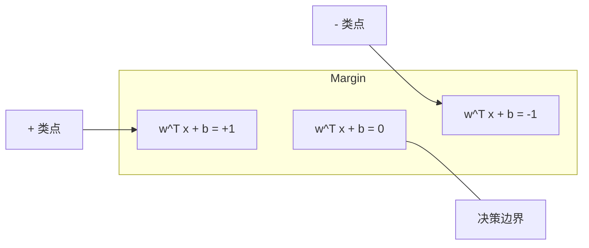
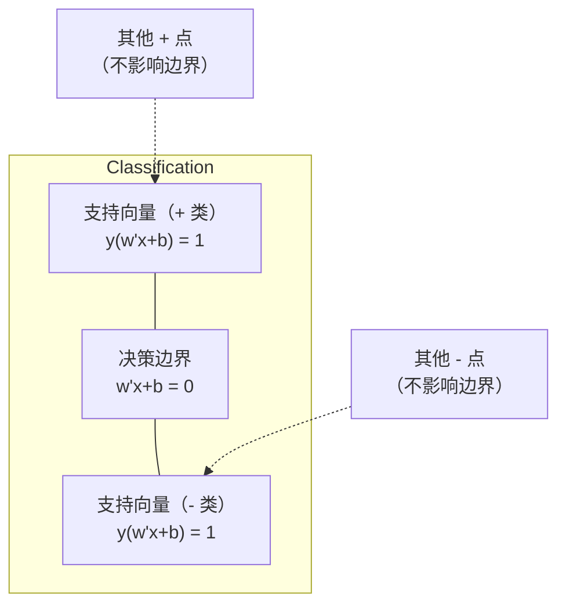
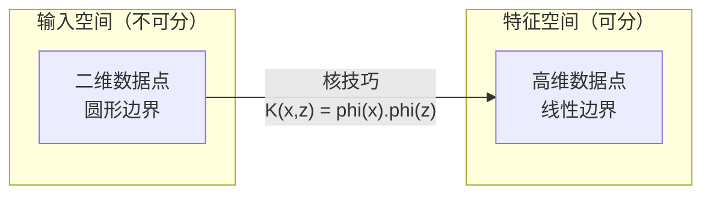

# 支持向量机

> 支持向量机寻找两类之间间隔最宽的决策边界。

**类型：** 构建  
**学习实现：** Python  
**前置课程：** Phase 1（第 08 课优化、第 14 课范数与距离、第 18 课凸优化）  
**预计时间：** 约 90 分钟

## 学习目标

- 用 hinge loss 和原始问题上的梯度下降从零实现线性 SVM。
- 解释最大间隔原则，并从训练后模型中识别支持向量。
- 比较线性、多项式和 RBF 核，并解释核技巧如何避免显式高维映射。
- 评估参数 `C` 对间隔宽度与分类错误之间权衡的控制作用。

## 问题

有两类数据点，需要画一条分开它们的线（或超平面）；能分开它们的线无穷多，应选哪一条？选间隔最大的那一条。间隔是决策边界到两侧最近数据点的距离；更宽的间隔意味着分类器更自信，也更能泛化到未见数据。

这一直觉导向支持向量机（SVM），它是 ML 中数学最优雅的算法之一。深度学习之前，SVM 曾主导分类；如今仍适合小数据集、高维数据，以及需要理论保证、原理清晰模型的问题。它直接连到 Phase 1：优化是凸的（第 18 课），间隔以范数度量（第 14 课），核技巧通过点积处理非线性边界，而无须真的在高维空间计算。

## 概念

### 最大间隔分类器 <!-- learning-atlas: the-maximum-margin-classifier -->

给定线性可分数据，标签 `y_i in {-1, +1}`、特征向量为 `x_i`，希望找到分开类别的超平面 `w^T x + b = 0`。点 `x_i` 到超平面的距离为：

```text
distance = |w^T x_i + b| / ||w||
```

正确分类点满足 `y_i * (w^T x_i + b) > 0`。间隔是超平面到两侧最近点距离的两倍。



优化问题为：

```text
maximize    2 / ||w||     (the margin width)
subject to  y_i * (w^T x_i + b) >= 1  for all i
```

等价地（最小化 `||w||^2` 更易优化）：

```text
minimize    (1/2) ||w||^2
subject to  y_i * (w^T x_i + b) >= 1  for all i
```

这是凸二次规划，拥有唯一全局解。恰好落在间隔边界的点（`y_i * (w^T x_i + b) = 1`）是支持向量；只有它们决定决策边界。移动或删除任意非支持向量，边界都不会改变。

### 支持向量：关键的少数



多数训练点并不相关，只有支持向量重要。因此 SVM 预测时节省内存：只需存支持向量，而非完整训练集。支持向量数量还能给出泛化误差界；相对数据集大小，支持向量越少，泛化越好。

### 软间隔：用 `C` 参数处理噪声

真实数据很少完全可分；有些点会落在边界错误一侧或间隔内部。软间隔通过松弛变量允许违例：

```text
minimize    (1/2) ||w||^2 + C * sum(xi_i)
subject to  y_i * (w^T x_i + b) >= 1 - xi_i
            xi_i >= 0  for all i
```

松弛变量 `xi_i` 度量点 `i` 违反间隔的程度。`C` 控制权衡：

| `C` 值 | 行为 |
|---|---|
| 大 `C` | 严厉惩罚违例；间隔窄、误分类少，易过拟合。 |
| 小 `C` | 允许更多违例；间隔宽、误分类多，易欠拟合。 |

`C` 是反向的正则化强度：大 `C` = 较少正则化，小 `C` = 较多正则化。

### Hinge loss：SVM 的损失函数

软间隔 SVM 可改写成无约束优化：

```text
minimize    (1/2) ||w||^2 + C * sum(max(0, 1 - y_i * (w^T x_i + b)))
```

`max(0, 1 - y_i * f(x_i))` 是 hinge loss。点正确分类且在间隔外时它为零；点在间隔内或误分类时它是线性的。

```text
Hinge loss for a single point:

loss
  |
  | \
  |  \
  |   \
  |    \
  |     \_______________
  |
  +-----|-----|-------->  y * f(x)
       0     1

Zero loss when y*f(x) >= 1 (correctly classified, outside margin).
Linear penalty when y*f(x) < 1.
```

与逻辑损失比较：

```text
Hinge:     max(0, 1 - y*f(x))          Hard cutoff at margin
Logistic:  log(1 + exp(-y*f(x)))        Smooth, never exactly zero
```

hinge loss 产生稀疏解（只有支持向量贡献非零），逻辑损失使用全部数据点；这使 SVM 预测时内存更高效。

### 用梯度下降训练线性 SVM

可在 hinge loss 加 L2 正则化上做梯度下降，无须求解受约束 QP：

```text
L(w, b) = (lambda/2) * ||w||^2 + (1/n) * sum(max(0, 1 - y_i * (w^T x_i + b)))

Gradient with respect to w:
  If y_i * (w^T x_i + b) >= 1:  dL/dw = lambda * w
  If y_i * (w^T x_i + b) < 1:   dL/dw = lambda * w - y_i * x_i

Gradient with respect to b:
  If y_i * (w^T x_i + b) >= 1:  dL/db = 0
  If y_i * (w^T x_i + b) < 1:   dL/db = -y_i
```

这称为原始形式（primal formulation）。每个 epoch 时间为 `O(n * d)`，其中 `n` 是样本数、`d` 是特征数；对大型稀疏高维数据（文本分类）很快。

### 对偶形式与核技巧

SVM 问题的拉格朗日对偶（来自 Phase 1 第 18 课 KKT 条件）为：

```text
maximize    sum(alpha_i) - (1/2) * sum_ij(alpha_i * alpha_j * y_i * y_j * (x_i . x_j))
subject to  0 <= alpha_i <= C
            sum(alpha_i * y_i) = 0
```

对偶只涉及数据点间的点积 `x_i . x_j`。将每个点积替换为核函数 `K(x_i, x_j)`，SVM 就可学习非线性边界，而无须显式计算变换：

```text
Linear kernel:      K(x, z) = x . z
Polynomial kernel:  K(x, z) = (x . z + c)^d
RBF (Gaussian):     K(x, z) = exp(-gamma * ||x - z||^2)
```

RBF 核将数据映射到无限维空间：输入空间相近的点核值接近 1，远离的点核值接近 0；它能学习任意平滑决策边界。



核技巧在高维空间计算点积而不真的前往该空间。对 `D` 维、次数为 `d` 的多项式核，显式特征空间有 `O(D^d)` 维，`K(x, z)` 却只需 `O(D)` 时间。

### 用于回归的 SVM（SVR）

支持向量回归在数据周围拟合宽度为 `epsilon` 的管带。管带内点损失为零，管带外点线性受罚：

```text
minimize    (1/2) ||w||^2 + C * sum(xi_i + xi_i*)
subject to  y_i - (w^T x_i + b) <= epsilon + xi_i
            (w^T x_i + b) - y_i <= epsilon + xi_i*
            xi_i, xi_i* >= 0
```

`epsilon` 控制管带宽度：更宽意味着更少支持向量、更平滑拟合；更窄意味着更多支持向量、更贴合拟合。

### SVM 为何输给深度学习（以及何时仍胜出）

SVM 在 1990 年代后期到 2010 年代早期曾主导 ML，深度学习后来胜出：

| 因素 | SVM | 深度学习 |
|---|---|---|
| 特征工程 | 需要 | 自行学习特征 |
| 可扩展性 | 核为 `O(n^2)` 到 `O(n^3)` | SGD 每 epoch 为 `O(n)` |
| 图像/文本/音频 | 需手工特征 | 可从原始数据学习 |
| 大数据集（>100k） | 慢 | 可扩展 |
| GPU 加速 | 益处有限 | 大幅提速 |

SVM 在以下情形仍有优势：

- 小数据集（数百到数千样本）。
- 高维稀疏数据（带 TF-IDF 特征的文本）。
- 需要数学保证（间隔界）时。
- 训练时间必须极短时（线性 SVM 很快）。
- 有清晰间隔结构的二元分类。
- 异常检测（单类 SVM）。

```figure
svm-margin
```

## 动手实现

### 步骤 1：Hinge loss 与梯度

基础：计算批量的 hinge loss 与梯度。

```python
def hinge_loss(X, y, w, b):
    n = len(X)
    total_loss = 0.0
    for i in range(n):
        margin = y[i] * (dot(w, X[i]) + b)
        total_loss += max(0.0, 1.0 - margin)
    return total_loss / n
```

### 步骤 2：用梯度下降训练线性 SVM

通过最小化正则化 hinge loss 训练，不需要 QP 求解器。

```python
class LinearSVM:
    def __init__(self, lr=0.001, lambda_param=0.01, n_epochs=1000):
        self.lr = lr
        self.lambda_param = lambda_param
        self.n_epochs = n_epochs
        self.w = None
        self.b = 0.0

    def fit(self, X, y):
        n_features = len(X[0])
        self.w = [0.0] * n_features
        self.b = 0.0

        for epoch in range(self.n_epochs):
            for i in range(len(X)):
                margin = y[i] * (dot(self.w, X[i]) + self.b)
                if margin >= 1:
                    self.w = [wj - self.lr * self.lambda_param * wj
                              for wj in self.w]
                else:
                    self.w = [wj - self.lr * (self.lambda_param * wj - y[i] * X[i][j])
                              for j, wj in enumerate(self.w)]
                    self.b -= self.lr * (-y[i])

    def predict(self, X):
        return [1 if dot(self.w, x) + self.b >= 0 else -1 for x in X]
```

### 步骤 3：核函数

实现线性、多项式和 RBF 核。

```python
def linear_kernel(x, z):
    return dot(x, z)

def polynomial_kernel(x, z, degree=3, c=1.0):
    return (dot(x, z) + c) ** degree

def rbf_kernel(x, z, gamma=0.5):
    diff = [xi - zi for xi, zi in zip(x, z)]
    return math.exp(-gamma * dot(diff, diff))
```

### 步骤 4：识别间隔与支持向量

训练后找出支持向量并计算间隔宽度。

```python
def find_support_vectors(X, y, w, b, tol=1e-3):
    support_vectors = []
    for i in range(len(X)):
        margin = y[i] * (dot(w, X[i]) + b)
        if abs(margin - 1.0) < tol:
            support_vectors.append(i)
    return support_vectors
```

完整实现和全部演示请见 `code/svm.py`。

## 在工具中使用

使用 scikit-learn：

```python
from sklearn.svm import SVC, LinearSVC, SVR
from sklearn.preprocessing import StandardScaler
from sklearn.pipeline import Pipeline

clf = Pipeline([
    ("scaler", StandardScaler()),
    ("svm", SVC(kernel="rbf", C=1.0, gamma="scale")),
])
clf.fit(X_train, y_train)
print(f"Accuracy: {clf.score(X_test, y_test):.4f}")
print(f"Support vectors: {clf['svm'].n_support_}")
```

训练 SVM 前务必缩放特征。SVM 对特征尺度敏感，因为间隔依赖 `||w||`，未缩放特征会扭曲几何关系。大数据集应使用 `LinearSVC`（原始形式、每 epoch `O(n)`），而非 `SVC`（对偶形式、`O(n^2)` 至 `O(n^3)`）：

```python
from sklearn.svm import LinearSVC

clf = Pipeline([
    ("scaler", StandardScaler()),
    ("svm", LinearSVC(C=1.0, max_iter=10000)),
])
```

## 练习

1. 生成二维线性可分数据，训练 `LinearSVM` 并找出支持向量；验证它们是最靠近决策边界的点。
2. 在噪声数据上令 `C` 从 0.001 变到 1000，为各个 `C` 绘制决策边界；观察从宽间隔欠拟合到窄间隔过拟合的变化。
3. 创建类别边界为圆形的非线性数据，展示线性 SVM 的失败；计算 RBF 核矩阵，并展示类别在核诱导特征空间中变得可分。
4. 在同一数据集上比较 hinge loss 与逻辑损失，训练线性 SVM 和逻辑回归；统计各模型决策边界由多少训练点贡献（支持向量对全部点）。
5. 实现 SVR（epsilon-insensitive loss），拟合 `y = sin(x) + noise`，绘制预测周围的 epsilon 管带并标出管带外的支持向量。

## 关键术语

| 术语 | 准确含义 |
|---|---|
| 支持向量 | 最接近决策边界的训练点；唯一决定超平面的点。 |
| 间隔 | 决策边界到最近支持向量的距离；SVM 最大化它。 |
| Hinge loss | `max(0, 1 - y*f(x))`；正确且在间隔外为零，否则线性惩罚。 |
| `C` 参数 | 间隔宽度与分类错误的权衡；大 `C` 间隔窄，小 `C` 间隔宽。 |
| 软间隔 | 通过松弛变量允许违反间隔的 SVM 形式，可处理不可分数据。 |
| 核技巧 | 在高维特征空间计算点积、却不显式映射到该空间。 |
| 线性核 | `K(x, z) = x . z`；等于标准点积，适用于线性可分数据。 |
| RBF 核 | `K(x, z) = exp(-gamma * \|\|x-z\|\|^2)`；映射到无限维，可学习任意平滑边界。 |
| 多项式核 | `K(x, z) = (x . z + c)^d`；映射到多项式组合特征空间。 |
| 对偶形式 | 仅依赖数据点间点积的 SVM 重述，使核成为可能。 |
| SVR | 支持向量回归；在数据周围拟合 epsilon 管带，管带内点损失为零。 |
| 松弛变量 | `xi_i`，度量一个点违反间隔的程度；正确分类且在间隔外时为零。 |
| 最大间隔 | 选择到两类最近点距离最大的超平面的原则。 |

## 延伸阅读

- [Vapnik: The Nature of Statistical Learning Theory (1995)](https://link.springer.com/book/10.1007/978-1-4757-3264-1) - SVM 与统计学习的奠基著作。
- [Cortes & Vapnik: Support-vector networks (1995)](https://link.springer.com/article/10.1007/BF00994018) - 原始 SVM 论文。
- [Platt: Sequential Minimal Optimization (1998)](https://www.microsoft.com/en-us/research/publication/sequential-minimal-optimization-a-fast-algorithm-for-training-support-vector-machines/) - 使 SVM 训练实用化的 SMO 算法。
- [scikit-learn SVM documentation](https://scikit-learn.org/stable/modules/svm.html) - 含实现细节的实用指南。
- [LIBSVM: A Library for Support Vector Machines](https://www.csie.ntu.edu.tw/~cjlin/libsvm/) - 多数 SVM 实现背后的 C++ 库。
