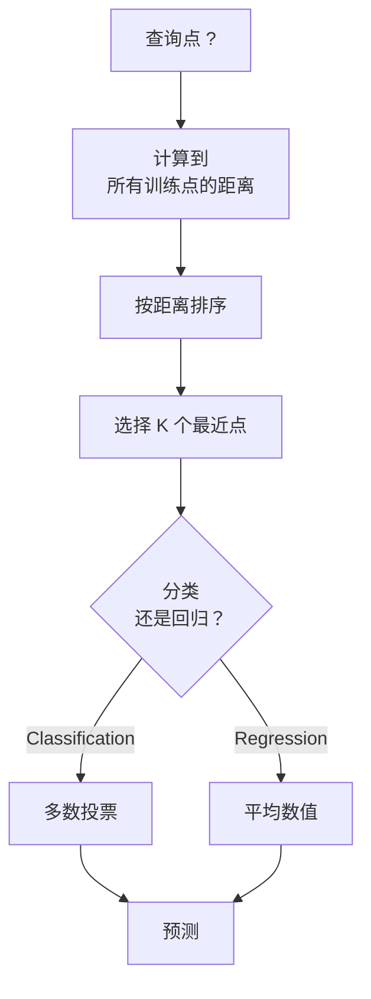
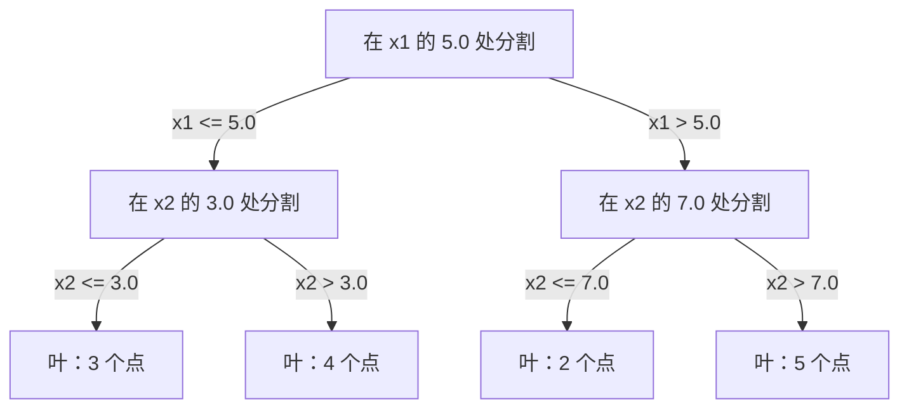

# K 近邻与距离

> 存下全部数据，通过查看邻居作预测；这是最简单却真正有效的算法。

**类型：** 构建  
**学习实现：** Python  
**前置课程：** Phase 1（第 14 课范数与距离）  
**预计时间：** 约 90 分钟

## 学习目标

- 从零实现带可配置 K 和距离加权投票的 KNN 分类与回归。
- 比较 L1、L2、余弦和 Minkowski 距离，并针对数据类型选择合适度量。
- 解释维度灾难，并展示 KNN 为何在高维空间退化。
- 构建用于高效最近邻查询的 KD 树，分析它何时优于暴力搜索。

## 问题

有一个数据集，新数据点到来，需要分类或预测数值。与线性回归或 SVM 从数据中学习参数不同，KNN 只寻找离新点最近的 K 个训练点，让它们投票。

它没有训练阶段、没有可学习参数、没有要最小化的损失函数；只存储完整训练集，在预测时计算距离。听上去过于简单，却对中小数据集很有竞争力，并揭示距离度量选择、维度灾难、惰性/急切学习等基础概念。它在现代 AI 中也无处不在：向量数据库在嵌入上做 KNN，RAG 找 K 个最近文档块，推荐系统找相似用户或物品；算法相同，差别只在规模和数据结构。

## 概念

### KNN 如何工作

对带标签数据集和一个新查询点：

1. 计算查询点到数据集中每个点的距离。
2. 按距离排序。
3. 取最近的 K 个点。
4. 分类时在 K 个邻居中多数投票。
5. 回归时对 K 个邻居值取平均（或加权平均）。



这就是全部算法：没有拟合、梯度下降或 epoch。

### 选择 K

K 是唯一的超参数，控制偏差—方差权衡：

| K | 行为 |
|---|---|
| `K = 1` | 边界追随每个点，训练误差为零，高方差、过拟合。 |
| 小 K（3–5） | 对局部结构敏感，能捕捉复杂边界。 |
| 大 K | 边界更平滑、对噪声更稳健，可能欠拟合。 |
| `K = N` | 对每个点预测多数类，偏差最大。 |

对含 N 个点的数据集，常用起点是 `K = sqrt(N)`；二元分类使用奇数 K 避免平局。


### 距离度量 <!-- learning-atlas: distance-metrics -->

距离函数定义“近”的含义，不同度量产生不同邻居与预测。

**L2（欧氏距离）**是默认选择，即直线距离：

```text
d(a, b) = sqrt(sum((a_i - b_i)^2))
```

它对特征尺度敏感；KNN 使用 L2 前总要标准化特征。

**L1（曼哈顿距离）**累加绝对差，不平方，因此比 L2 对离群值更稳健：

```text
d(a, b) = sum(|a_i - b_i|)
```

**余弦距离**度量向量夹角、忽略模长，是文本和嵌入数据的关键度量：

```text
d(a, b) = 1 - (a . b) / (||a|| * ||b||)
```

**Minkowski 距离**以参数 p 泛化 L1 与 L2：

```text
d(a, b) = (sum(|a_i - b_i|^p))^(1/p)

p=1: Manhattan
p=2: Euclidean
p->inf: Chebyshev (max absolute difference)
```

| 数据类型 | 最佳度量 | 原因 |
|---|---|---|
| 尺度相近的数值特征 | L2（欧氏） | 默认选择，适合空间数据。 |
| 含离群值的数值特征 | L1（曼哈顿） | 稳健，不放大大差异。 |
| 文本嵌入 | 余弦 | 模长是噪声，方向是语义。 |
| 高维稀疏数据 | 余弦或 L1 | L2 会受维度灾难影响。 |
| 混合类型 | 自定义距离 | 按特征类型组合度量。 |

### 加权 KNN

标准 KNN 对全部 K 个邻居等权；距离 0.1 的邻居应比距离 5.0 的更重要。**距离加权 KNN**按距离倒数赋权：

```text
weight_i = 1 / (distance_i + epsilon)

For classification: weighted vote
For regression:     weighted average = sum(w_i * y_i) / sum(w_i)
```

`epsilon` 防止查询点与训练点完全相同时除零。由于远处邻居贡献极小，加权 KNN 对 K 的选择较不敏感。

### 维度灾难

KNN 在高维中退化，这是数学事实而非模糊担忧。

**问题 1：距离收敛。** 维度增加时，最大距离与最小距离的比值趋近 1，所有点对查询点都几乎一样远：

```text
In d dimensions, for random uniform points:

d=2:    max_dist / min_dist = varies widely
d=100:  max_dist / min_dist ~ 1.01
d=1000: max_dist / min_dist ~ 1.001

When all distances are nearly equal, "nearest" is meaningless.
```

**问题 2：体积爆炸。** 要在固定数据比例中捕获 K 个邻居，搜索半径必须覆盖特征空间大得多的比例；高维的“邻域”包含了大部分空间。  
**问题 3：角落占主导。** d 维单位超立方体的大部分体积集中在角落而非中心；随着 d 增长，内接球所占体积趋于零。

实践上 KNN 在约 20–50 个特征内表现良好。超过此范围，应先以 PCA、UMAP、t-SNE 降维，或使用利用数据内在低维结构的树搜索。

### KD 树：快速最近邻搜索

暴力 KNN 每个查询计算到所有训练点的距离，为 `O(n * d)`；大数据集上太慢。KD 树沿特征轴递归划分空间，每层在一个维度的中位数处分割。



查最近点时先走到包含查询点的叶，再回溯；只有相邻分区可能含更近点时才检查。低维平均查询为 `O(log n)`，但高维（`d > 20`）会退化为 `O(n)`，因为回溯无法排除足够分支。

### Ball 树：适合中等维度

Ball 树以嵌套超球而非轴对齐盒划分数据，每个节点定义一个包含其子树全部点的球（中心 + 半径）。它具有以下优势：

- 在中等维度（约 50 维以内）工作更好。
- 能处理非轴对齐结构。
- 更紧的包围体意味着搜索中可以剪去更多分支。

两者都精确；数百万点、数百维的真正大规模搜索改用近似最近邻（HNSW、IVF、产品量化），见 Phase 1 第 14 课。

### 惰性学习与急切学习

KNN 是惰性学习器：训练时不做工作，预测时做全部工作。线性回归、SVM、神经网络等是急切学习器：训练时重计算建紧凑模型，预测快。

| 方面 | 惰性（KNN） | 急切（SVM、神经网络） |
|---|---|---|
| 训练时间 | `O(1)`，只存数据 | `O(n * epochs)` |
| 预测时间 | 每查询 `O(n * d)` | `O(d)` 或 `O(parameters)` |
| 预测时内存 | 完整训练集 | 仅模型参数 |
| 适应新数据 | 立即加点 | 需重训 |
| 决策边界 | 隐式、即时计算 | 显式、训练后固定 |

惰性学习适合以下场景：

- 数据集频繁变化（添加/删除点而无需重训）。
- 只需对极少查询做预测。
- 要求零训练时间。
- 数据集足够小，暴力搜索已经很快。

### 用于回归的 KNN

KNN 回归不多数投票，而是平均 K 个邻居的目标值：

```text
prediction = (1/K) * sum(y_i for i in K nearest neighbors)

Or with distance weighting:
prediction = sum(w_i * y_i) / sum(w_i)
where w_i = 1 / distance_i
```

它产生分段常量预测（加权后可分段平滑），不能外推训练数据范围；训练目标均在 0 到 100 时，KNN 永不会预测 200。

```figure
knn-smoothness
```

## 动手实现

### 步骤 1：距离函数

实现 L1、L2、余弦和 Minkowski 距离，它们直接对应 Phase 1 第 14 课。

```python
import math

def l2_distance(a, b):
    return math.sqrt(sum((ai - bi) ** 2 for ai, bi in zip(a, b)))

def l1_distance(a, b):
    return sum(abs(ai - bi) for ai, bi in zip(a, b))

def cosine_distance(a, b):
    dot_val = sum(ai * bi for ai, bi in zip(a, b))
    norm_a = math.sqrt(sum(ai ** 2 for ai in a))
    norm_b = math.sqrt(sum(bi ** 2 for bi in b))
    if norm_a == 0 or norm_b == 0:
        return 1.0
    return 1.0 - dot_val / (norm_a * norm_b)

def minkowski_distance(a, b, p=2):
    if p == float('inf'):
        return max(abs(ai - bi) for ai, bi in zip(a, b))
    return sum(abs(ai - bi) ** p for ai, bi in zip(a, b)) ** (1 / p)
```

### 步骤 2：KNN 分类器和回归器

构建带可配置 K、距离度量和可选距离加权的完整 KNN。

```python
class KNN:
    def __init__(self, k=5, distance_fn=l2_distance, weighted=False,
                 task="classification"):
        self.k = k
        self.distance_fn = distance_fn
        self.weighted = weighted
        self.task = task
        self.X_train = None
        self.y_train = None

    def fit(self, X, y):
        self.X_train = X
        self.y_train = y

    def predict(self, X):
        return [self._predict_one(x) for x in X]
```

### 步骤 3：高效搜索的 KD 树

从零构建 KD 树，按每个维度中位数递归划分。

```python
class KDTree:
    def __init__(self, X, indices=None, depth=0):
        # Recursively partition the data
        self.axis = depth % len(X[0])
        # Split on median of the current axis
        ...

    def query(self, point, k=1):
        # Traverse to leaf, then backtrack
        ...
```

完整辅助方法与演示见 `code/knn.py`。

### 步骤 4：特征缩放

KNN 必须缩放特征，因为距离对量级敏感；范围 0 至 1000 的特征会支配范围 0 至 1 的特征。

```python
def standardize(X):
    n = len(X)
    d = len(X[0])
    means = [sum(X[i][j] for i in range(n)) / n for j in range(d)]
    stds = [
        max(1e-10, (sum((X[i][j] - means[j]) ** 2 for i in range(n)) / n) ** 0.5)
        for j in range(d)
    ]
    return [[((X[i][j] - means[j]) / stds[j]) for j in range(d)] for i in range(n)], means, stds
```

## 在工具中使用

使用 scikit-learn：

```python
from sklearn.neighbors import KNeighborsClassifier
from sklearn.preprocessing import StandardScaler
from sklearn.pipeline import Pipeline

clf = Pipeline([
    ("scaler", StandardScaler()),
    ("knn", KNeighborsClassifier(n_neighbors=5, metric="euclidean")),
])
clf.fit(X_train, y_train)
print(f"Accuracy: {clf.score(X_test, y_test):.4f}")
```

当数据集足够大且维度足够低时，scikit-learn 自动使用 KD 树或 Ball 树；高维时回退暴力搜索，可通过 `algorithm` 参数控制。数百万向量的搜索使用 FAISS、Annoy 或向量数据库：

```python
import faiss

index = faiss.IndexFlatL2(dimension)
index.add(embeddings)
distances, indices = index.search(query_vectors, k=5)
```

## 练习

1. 在三类二维数据上实现 KNN 分类，绘制 `K=1`、`K=5`、`K=15`、`K=N` 的边界，观察从过拟合到欠拟合的转变。
2. 在 2、5、10、50、100、500 维生成 1000 个随机点，计算最大两两距离与最小两两距离之比，绘制该比值随维度变化，直观展示维度灾难。
3. 在文本分类（TF-IDF 向量）中比较 L1、L2、余弦距离；哪种准确率最高，为何余弦常在文本上胜出？
4. 实现 KD 树，测量它与暴力搜索在 1k、10k、100k 点、2D、10D、50D 时的查询时间；到何种维度 KD 树不再更快？
5. 为 `y = sin(x) + noise` 构建加权 KNN 回归器，比较未加权与 `K=3, 10, 30` 的加权版本，展示加权尤其在大 K 时更平滑。

## 关键术语

| 术语 | 准确含义 |
|---|---|
| K 近邻 | 通过寻找距查询点最近的 K 个训练点来预测的非参数算法。 |
| 惰性学习 | 训练时不计算，全部工作发生在预测时；KNN 是经典例子。 |
| 急切学习 | 训练时重计算建紧凑模型；大多数 ML 算法属于此类。 |
| 维度灾难 | 高维中距离收敛、邻域扩展到大部分空间，使 KNN 无效。 |
| KD 树 | 沿特征轴递归划分空间的二叉树，低维查询为 `O(log n)`。 |
| Ball 树 | 嵌套超球树；中等维度（约 50 以内）优于 KD 树。 |
| 加权 KNN | 邻居权重与距离成反比，近邻对预测影响更大。 |
| 特征缩放 | 将特征归一到可比范围；KNN 等距离方法必需。 |
| 多数投票 | 统计 K 个邻居中最常见类别来分类。 |
| 暴力搜索 | 计算到每个训练点的距离；每查询 `O(n*d)`，精确但大 n 时慢。 |
| 近似最近邻 | HNSW、LSH、IVF 等以牺牲精确性换取远快于精确搜索的算法。 |
| Voronoi 图 | 空间划分：每一区域内的点都比其他训练点更接近某一训练点；`K=1` KNN 产生该边界。 |

## 延伸阅读

- [Cover & Hart: Nearest Neighbor Pattern Classification (1967)](https://ieeexplore.ieee.org/document/1053964) - 奠基 KNN 论文，证明其错误率至多为 Bayes 最优的两倍。
- [Friedman, Bentley, Finkel: An Algorithm for Finding Best Matches in Logarithmic Expected Time (1977)](https://dl.acm.org/doi/10.1145/355744.355745) - 原始 KD 树论文。
- [Beyer et al.: When Is "Nearest Neighbor" Meaningful? (1999)](https://link.springer.com/chapter/10.1007/3-540-49257-7_15) - 对最近邻维度灾难的形式化分析。
- [scikit-learn Nearest Neighbors documentation](https://scikit-learn.org/stable/modules/neighbors.html) - 含算法选择的实用指南。
- [FAISS: A Library for Efficient Similarity Search](https://github.com/facebookresearch/faiss) - Meta 的十亿规模近似最近邻库。
