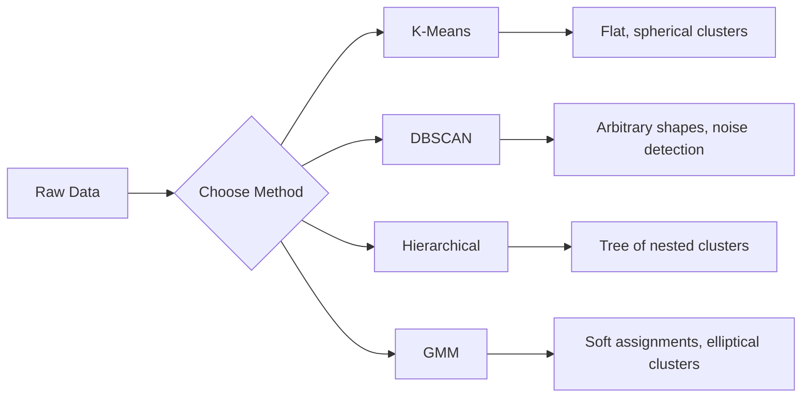

# 无监督学习

> 没有标签，也没有教师；算法自行发现结构。

**类型：** 构建  
**学习实现：** Python  
**前置课程：** Phase 1（范数与距离、概率与分布），Phase 2 第 1–6 课  
**预计时间：** 约 90 分钟

## 学习目标

- 从零实现 K-Means、DBSCAN 和高斯混合模型，并比较聚类行为。
- 使用轮廓系数和肘部法评估聚类质量、选择最优 K。
- 解释 DBSCAN 何时优于 K-Means，以及哪种算法能处理非球形簇与离群点。
- 构建以聚类方法标记偏离正常模式点的异常检测流程。

## 问题

此前课程都假设有标签：“这是输入，这是正确输出。”现实世界标签昂贵：医院有数百万病历，却没有人为每条标注疾病类别；电商有海量会话，却没有手工客户分群；安全团队有网络日志，却无人标出每个异常。

无监督学习无需被告知要找什么，就能发现模式：把相似点分组、找出隐藏结构、暴露异常。若监督学习像带答案的教材，无监督学习则像凝视原始数据直到模式显现。难点在于没有标签便无法直接量“对”或“错”，必须用不同工具判断找到的结构是否有意义。

## 概念

### 聚类：把相似事物放在一起

聚类将每个数据点分到一个组，使同组点彼此比与其他组点更相似；关键始终是“相似”如何定义。



### K-Means：主力算法

K-Means 将数据划入恰好 K 个簇。每簇有一个质心（质量中心），每点归于最近质心。Lloyd 算法：

1. 随机选择 K 个点作初始质心。
2. 将每点分给最近质心。
3. 把每个质心重新计算为其所分配点的均值。
4. 重复第 2–3 步，直到分配不再变化。

目标函数 inertia 是点到所属质心的平方距离总和。K-Means 最小化它，却只能找到局部最小值；不同初始化可得不同结果。

### 选择 K

两种标准方法：

**肘部法：**令 `K = 1, 2, 3, ..., n` 运行 K-Means，绘制 inertia 对 K，寻找增加簇数不再显著降低 inertia 的“肘部”。

**轮廓系数：**对每点量其与本簇的相似性 `a`，以及与最近其他簇的相似性 `b`；系数为 `(b - a) / max(a, b)`，范围 -1（簇分错）到 +1（聚得好）。全局分数取所有点平均。

### DBSCAN：基于密度的聚类

K-Means 假定簇是球形且需预先指定 K；DBSCAN 两者均不假定，把稠密区域之间由稀疏区域隔开的点作为簇。

两个参数：

- **eps：** 邻域半径。
- **min_samples：** 形成稠密区域所需最少点数。

点有三类：

- **核心点：** 在 `eps` 内至少有 `min_samples` 个点。
- **边界点：** 位于核心点的 `eps` 内，但自身不是核心点。
- **噪声点：** 既非核心也非边界，即离群点。

DBSCAN 将相互位于 `eps` 内的核心点连为一簇，边界点加入相近核心点的簇，噪声不属于任何簇。它能发现任意形状、自动定簇数并识别离群值，却难以处理密度不同的簇。

### 层次聚类

层次聚类构建嵌套簇的树（dendrogram）。凝聚式（自底向上）的步骤：

1. 先将每个点视为一个簇。
2. 合并最近的两个簇。
3. 重复，直到仅剩一个簇。
4. 在所需层级切开树状图，得到 K 个簇。

簇间“近”可定义为：

- **单链接：** 两簇任意两点的最小距离。
- **全链接：** 两簇任意两点的最大距离。
- **平均链接：** 全部点对的平均距离。
- **Ward 方法：** 使簇内总方差增加最小的合并。

### 高斯混合模型（GMM） <!-- learning-atlas: gaussian-mixture-models-gmm -->

K-Means 为硬分配，每点只属一簇；GMM 为软分配，每点对每簇都有归属概率。它假定数据由 K 个高斯分布混合生成，各自有均值、协方差。EM 算法交替：

- **E 步：** 计算各点属于各高斯的概率。
- **M 步：** 更新各高斯的均值、协方差与混合权重，以最大化数据似然。

GMM 能建模椭圆簇（而非 K-Means 仅球形簇），也自然处理重叠簇。

### 何时使用哪种

| 方法 | 最适合 | 避免使用时 |
|---|---|---|
| K-Means | 大数据、球形簇、K 已知 | 不规则形状、含离群点 |
| DBSCAN | K 未知、任意形状、离群检测 | 密度变化、高维度 |
| 层次聚类 | 小数据、需树状图、K 未知 | 大数据（`O(n^2)` 内存） |
| GMM | 重叠簇、需软分配 | 极大数据、维度过多 |

### 用聚类做异常检测

聚类天然支持异常检测：

- **K-Means：** 远离任一质心的点为异常。
- **DBSCAN：** 噪声点按定义即异常。
- **GMM：** 在所有高斯下概率低的点为异常。

```figure
kmeans-step
```

## 动手实现

### 步骤 1：从零实现 K-Means

```python
import math
import random


def euclidean_distance(a, b):
    return math.sqrt(sum((ai - bi) ** 2 for ai, bi in zip(a, b)))


def kmeans(data, k, max_iterations=100, seed=42):
    random.seed(seed)
    n_features = len(data[0])

    centroids = random.sample(data, k)

    for iteration in range(max_iterations):
        clusters = [[] for _ in range(k)]
        assignments = []

        for point in data:
            distances = [euclidean_distance(point, c) for c in centroids]
            nearest = distances.index(min(distances))
            clusters[nearest].append(point)
            assignments.append(nearest)

        new_centroids = []
        for cluster in clusters:
            if len(cluster) == 0:
                new_centroids.append(random.choice(data))
                continue
            centroid = [
                sum(point[j] for point in cluster) / len(cluster)
                for j in range(n_features)
            ]
            new_centroids.append(centroid)

        if all(
            euclidean_distance(old, new) < 1e-6
            for old, new in zip(centroids, new_centroids)
        ):
            print(f"  Converged at iteration {iteration + 1}")
            break

        centroids = new_centroids

    return assignments, centroids
```

### 步骤 2：肘部法与轮廓系数

```python
def compute_inertia(data, assignments, centroids):
    total = 0.0
    for point, cluster_id in zip(data, assignments):
        total += euclidean_distance(point, centroids[cluster_id]) ** 2
    return total


def silhouette_score(data, assignments):
    n = len(data)
    if n < 2:
        return 0.0

    clusters = {}
    for i, c in enumerate(assignments):
        clusters.setdefault(c, []).append(i)

    if len(clusters) < 2:
        return 0.0

    scores = []
    for i in range(n):
        own_cluster = assignments[i]
        own_members = [j for j in clusters[own_cluster] if j != i]

        if len(own_members) == 0:
            scores.append(0.0)
            continue

        a = sum(euclidean_distance(data[i], data[j]) for j in own_members) / len(own_members)

        b = float("inf")
        for cluster_id, members in clusters.items():
            if cluster_id == own_cluster:
                continue
            avg_dist = sum(euclidean_distance(data[i], data[j]) for j in members) / len(members)
            b = min(b, avg_dist)

        if max(a, b) == 0:
            scores.append(0.0)
        else:
            scores.append((b - a) / max(a, b))

    return sum(scores) / len(scores)


def find_best_k(data, max_k=10):
    print("Elbow method:")
    inertias = []
    for k in range(1, max_k + 1):
        assignments, centroids = kmeans(data, k)
        inertia = compute_inertia(data, assignments, centroids)
        inertias.append(inertia)
        print(f"  K={k}: inertia={inertia:.2f}")

    print("\nSilhouette scores:")
    for k in range(2, max_k + 1):
        assignments, centroids = kmeans(data, k)
        score = silhouette_score(data, assignments)
        print(f"  K={k}: silhouette={score:.4f}")

    return inertias
```

### 步骤 3：从零实现 DBSCAN

```python
def dbscan(data, eps, min_samples):
    n = len(data)
    labels = [-1] * n
    cluster_id = 0

    def region_query(point_idx):
        neighbors = []
        for i in range(n):
            if euclidean_distance(data[point_idx], data[i]) <= eps:
                neighbors.append(i)
        return neighbors

    visited = [False] * n

    for i in range(n):
        if visited[i]:
            continue
        visited[i] = True

        neighbors = region_query(i)

        if len(neighbors) < min_samples:
            labels[i] = -1
            continue

        labels[i] = cluster_id
        seed_set = list(neighbors)
        seed_set.remove(i)

        j = 0
        while j < len(seed_set):
            q = seed_set[j]

            if not visited[q]:
                visited[q] = True
                q_neighbors = region_query(q)
                if len(q_neighbors) >= min_samples:
                    for nb in q_neighbors:
                        if nb not in seed_set:
                            seed_set.append(nb)

            if labels[q] == -1:
                labels[q] = cluster_id

            j += 1

        cluster_id += 1

    return labels
```

### 步骤 4：高斯混合模型（EM 算法）

```python
def gmm(data, k, max_iterations=100, seed=42):
    random.seed(seed)
    n = len(data)
    d = len(data[0])

    indices = random.sample(range(n), k)
    means = [list(data[i]) for i in indices]
    variances = [1.0] * k
    weights = [1.0 / k] * k

    def gaussian_pdf(x, mean, variance):
        d = len(x)
        coeff = 1.0 / ((2 * math.pi * variance) ** (d / 2))
        exponent = -sum((xi - mi) ** 2 for xi, mi in zip(x, mean)) / (2 * variance)
        return coeff * math.exp(max(exponent, -500))

    for iteration in range(max_iterations):
        responsibilities = []
        for i in range(n):
            probs = []
            for j in range(k):
                probs.append(weights[j] * gaussian_pdf(data[i], means[j], variances[j]))
            total = sum(probs)
            if total == 0:
                total = 1e-300
            responsibilities.append([p / total for p in probs])

        old_means = [list(m) for m in means]

        for j in range(k):
            r_sum = sum(responsibilities[i][j] for i in range(n))
            if r_sum < 1e-10:
                continue

            weights[j] = r_sum / n

            for dim in range(d):
                means[j][dim] = sum(
                    responsibilities[i][j] * data[i][dim] for i in range(n)
                ) / r_sum

            variances[j] = sum(
                responsibilities[i][j]
                * sum((data[i][dim] - means[j][dim]) ** 2 for dim in range(d))
                for i in range(n)
            ) / (r_sum * d)
            variances[j] = max(variances[j], 1e-6)

        shift = sum(
            euclidean_distance(old_means[j], means[j]) for j in range(k)
        )
        if shift < 1e-6:
            print(f"  GMM converged at iteration {iteration + 1}")
            break

    assignments = []
    for i in range(n):
        assignments.append(responsibilities[i].index(max(responsibilities[i])))

    return assignments, means, weights, responsibilities
```

### 步骤 5：生成测试数据并全部运行

```python
def make_blobs(centers, n_per_cluster=50, spread=0.5, seed=42):
    random.seed(seed)
    data = []
    true_labels = []
    for label, (cx, cy) in enumerate(centers):
        for _ in range(n_per_cluster):
            x = cx + random.gauss(0, spread)
            y = cy + random.gauss(0, spread)
            data.append([x, y])
            true_labels.append(label)
    return data, true_labels


def make_moons(n_samples=200, noise=0.1, seed=42):
    random.seed(seed)
    data = []
    labels = []
    n_half = n_samples // 2
    for i in range(n_half):
        angle = math.pi * i / n_half
        x = math.cos(angle) + random.gauss(0, noise)
        y = math.sin(angle) + random.gauss(0, noise)
        data.append([x, y])
        labels.append(0)
    for i in range(n_half):
        angle = math.pi * i / n_half
        x = 1 - math.cos(angle) + random.gauss(0, noise)
        y = 1 - math.sin(angle) - 0.5 + random.gauss(0, noise)
        data.append([x, y])
        labels.append(1)
    return data, labels


if __name__ == "__main__":
    centers = [[2, 2], [8, 3], [5, 8]]
    data, true_labels = make_blobs(centers, n_per_cluster=50, spread=0.8)

    print("=== K-Means on 3 blobs ===")
    assignments, centroids = kmeans(data, k=3)
    print(f"  Centroids: {[[round(c, 2) for c in cent] for cent in centroids]}")
    sil = silhouette_score(data, assignments)
    print(f"  Silhouette score: {sil:.4f}")

    print("\n=== Elbow Method ===")
    find_best_k(data, max_k=6)

    print("\n=== DBSCAN on 3 blobs ===")
    db_labels = dbscan(data, eps=1.5, min_samples=5)
    n_clusters = len(set(db_labels) - {-1})
    n_noise = db_labels.count(-1)
    print(f"  Found {n_clusters} clusters, {n_noise} noise points")

    print("\n=== GMM on 3 blobs ===")
    gmm_assignments, gmm_means, gmm_weights, _ = gmm(data, k=3)
    print(f"  Means: {[[round(m, 2) for m in mean] for mean in gmm_means]}")
    print(f"  Weights: {[round(w, 3) for w in gmm_weights]}")
    gmm_sil = silhouette_score(data, gmm_assignments)
    print(f"  Silhouette score: {gmm_sil:.4f}")

    print("\n=== DBSCAN on moons (non-spherical clusters) ===")
    moon_data, moon_labels = make_moons(n_samples=200, noise=0.1)
    moon_db = dbscan(moon_data, eps=0.3, min_samples=5)
    n_moon_clusters = len(set(moon_db) - {-1})
    n_moon_noise = moon_db.count(-1)
    print(f"  Found {n_moon_clusters} clusters, {n_moon_noise} noise points")

    print("\n=== K-Means on moons (will fail to separate) ===")
    moon_km, moon_centroids = kmeans(moon_data, k=2)
    moon_sil = silhouette_score(moon_data, moon_km)
    print(f"  Silhouette score: {moon_sil:.4f}")
    print("  K-Means splits moons poorly because they are not spherical")

    print("\n=== Anomaly detection with DBSCAN ===")
    anomaly_data = list(data)
    anomaly_data.append([20.0, 20.0])
    anomaly_data.append([-5.0, -5.0])
    anomaly_data.append([15.0, 0.0])
    anomaly_labels = dbscan(anomaly_data, eps=1.5, min_samples=5)
    anomalies = [
        anomaly_data[i]
        for i in range(len(anomaly_labels))
        if anomaly_labels[i] == -1
    ]
    print(f"  Detected {len(anomalies)} anomalies")
    for a in anomalies[-3:]:
        print(f"    Point {[round(v, 2) for v in a]}")
```

## 在工具中使用

scikit-learn 中同样算法只需一行：

```python
from sklearn.cluster import KMeans, DBSCAN, AgglomerativeClustering
from sklearn.mixture import GaussianMixture
from sklearn.metrics import silhouette_score as sklearn_silhouette

km = KMeans(n_clusters=3, random_state=42).fit(data)
db = DBSCAN(eps=1.5, min_samples=5).fit(data)
agg = AgglomerativeClustering(n_clusters=3).fit(data)
gmm_model = GaussianMixture(n_components=3, random_state=42).fit(data)
```

从零版本揭示库确切计算的内容：K-Means 在分配和重算间迭代，DBSCAN 从稠密种子扩展簇，GMM 在期望与最大化间交替。库增加数值稳定性、更聪明的 K-Means++ 初始化和 GPU 加速，核心逻辑相同。

## 产出

本课产出可运行的 K-Means、DBSCAN、GMM 从零实现，可作为更高级无监督方法的基础。

## 练习

1. 实现 K-Means++：首个质心随机选，后续质心以距已有最近质心的平方距离成比例选择；与随机初始化比较收敛速度。
2. 向代码加入凝聚层次聚类，实现 Ward 链接并生成树状图（嵌套合并列表）；在不同高度切树，与 K-Means 比较。
3. 构建简单异常检测流程：在同一数据上跑 DBSCAN 和 GMM，标记两者都认定的离群点（DBSCAN 噪声、GMM 低概率），测量重叠并讨论分歧情形。

## 关键术语

| 术语 | 常见说法 | 准确含义 |
|---|---|---|
| 聚类 | “把相似东西分组” | 按特定距离度量将数据分为组内相似性高于组间相似性的子集。 |
| 质心 | “簇的中心” | 分配给一个簇的所有点的均值；K-Means 用作簇代表。 |
| Inertia | “簇有多紧” | 每点到所属质心的平方距离总和，越低越紧。 |
| 轮廓系数 | “簇分得多开” | 每点 `(b - a) / max(a, b)`；`a` 为平均簇内距离，`b` 为平均最近簇距离。 |
| 核心点 | “稠密区域的点” | DBSCAN 中 `eps` 距离内至少有 `min_samples` 邻居的点。 |
| EM 算法 | “软 K-Means” | 期望最大化：反复计算归属概率（E 步）和更新分布参数（M 步）。 |
| 树状图 | “簇的树” | 展示层次聚类中簇合并次序及距离的树图。 |
| 异常 | “离群点” | 不符合预期模式的数据点；DBSCAN 视为噪声或 GMM 视为低概率。 |

## 延伸阅读

- [Stanford CS229 - Unsupervised Learning](https://cs229.stanford.edu/notes2022fall/main_notes.pdf) - Andrew Ng 关于聚类和 EM 的讲义。
- [scikit-learn Clustering Guide](https://scikit-learn.org/stable/modules/clustering.html) - 全部聚类算法的实用比较和可视化示例。
- [DBSCAN original paper (Ester et al., 1996)](https://www.aaai.org/Papers/KDD/1996/KDD96-037.pdf) - 提出基于密度聚类的论文。
