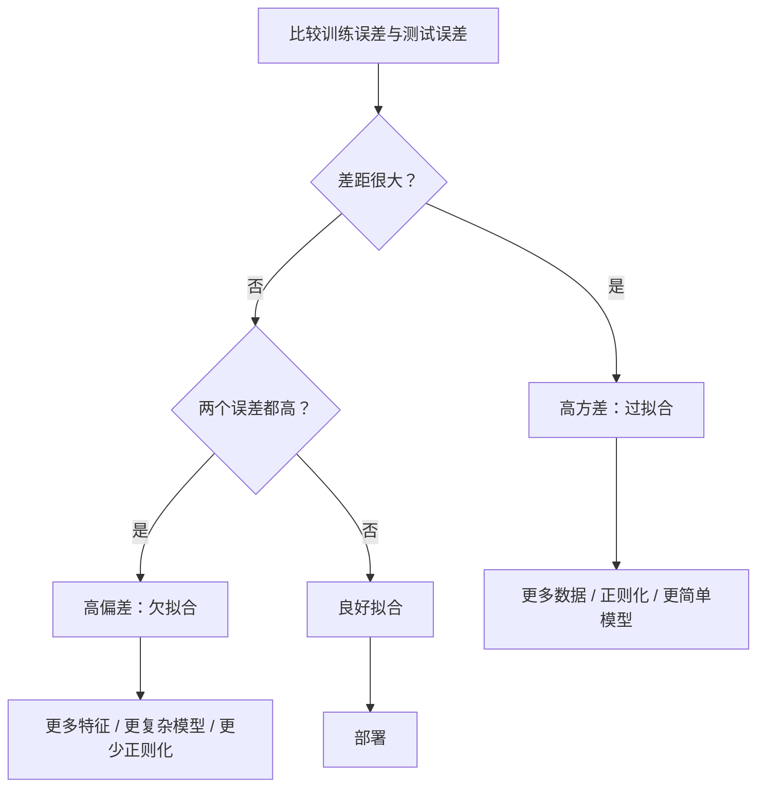
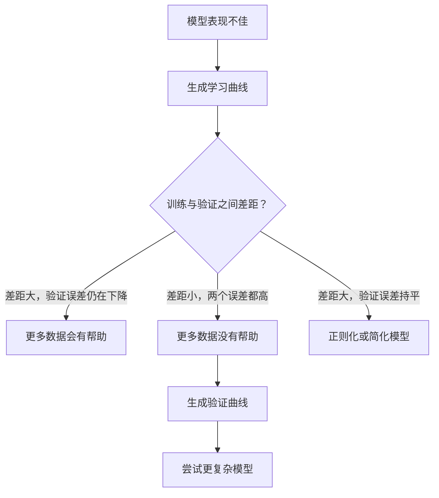

# 偏差—方差权衡

> 每一种模型误差都来自三个来源之一：偏差、方差或噪声；你只能控制前两者。

**类型：** 学习  
**学习实现：** Python  
**前置课程：** Phase 2 第 01–09 课（ML 基础、回归、分类、评估）  
**预计时间：** 约 75 分钟

## 学习目标

- 推导期望预测误差的偏差—方差分解，并解释不可约噪声的作用。
- 用训练误差和测试误差的模式，诊断模型是高偏差还是高方差。
- 解释正则化技术（L1、L2、dropout、早停）怎样用偏差换取方差。
- 实现实验，展示模型复杂度增加时的偏差—方差权衡。

## 问题

你训练了一个模型，它在测试数据上有一定误差。这个误差从哪里来？

如果模型太简单（例如在弯曲数据集上做线性回归），它会持续错过真实模式，产生**偏差**。如果模型太复杂（例如用 15 个数据点拟合 20 次多项式），它能完美拟合训练数据，却会在新数据上给出变化剧烈的预测，产生**方差**。

对固定的模型容量，你无法同时将二者最小化：降低偏差，方差会上升；降低方差，偏差会上升。理解这个权衡是机器学习中最有用的诊断能力：它告诉你该让模型更复杂还是更简单，该收集更多数据还是构造更好的特征，该增强还是减弱正则化。

## 概念

### 偏差：系统性误差

偏差衡量模型平均预测距离真实值有多远。若从同一分布抽取许多不同训练集、训练同一个模型并平均预测，偏差就是这个平均值与真实值之间的差距。

高偏差表示模型过于僵硬，无法捕捉真实模式。无论给多少数据，拟合抛物线的直线都会错过曲线，这称为**欠拟合**。

```text
高偏差（欠拟合）：
  模型总是大致预测同一个错误结果。
  训练误差：高
  测试误差：高
  二者间隙：小
```

### 方差：对训练数据的敏感性

方差衡量在不同数据子集上训练时预测变化有多大。训练集的微小变化若导致模型大幅改变，方差就高。

高方差表示模型在拟合训练数据中的噪声，而非底层信号。20 次多项式会穿过每一个训练点，却在点之间剧烈振荡，这称为**过拟合**。

```text
高方差（过拟合）：
  模型完美拟合训练数据，却在新数据上失败。
  训练误差：低
  测试误差：高
  二者间隙：大
```

### 分解 <!-- learning-atlas: the-decomposition -->

对于任意点 x，平方损失下的期望预测误差可精确分解为：

```text
Expected Error = Bias^2 + Variance + Irreducible Noise

where:
  Bias^2   = (E[f_hat(x)] - f(x))^2
  Variance = E[(f_hat(x) - E[f_hat(x)])^2]
  Noise    = E[(y - f(x))^2]             (sigma^2)
```

- `f(x)` 是真实函数。
- `f_hat(x)` 是模型预测。
- `E[...]` 是对不同训练集的期望。
- `y` 是观测标签（真实函数加上噪声）。

噪声项不可约：在有噪数据上，任何模型都无法做到比 sigma^2 更好。你的任务是为 bias^2 和 variance 找到合适的平衡。

### 模型复杂度与误差


经典曲线呈 U 形：

| 复杂度 | 偏差 | 方差 | 总误差 |
|-----------|------|----------|-------------|
| 过低 | 高 | 低 | 高（欠拟合） |
| 恰当 | 中等 | 中等 | 最低 |
| 过高 | 低 | 高 | 高（过拟合） |

### 正则化：偏差—方差的控制手段

正则化有意增加偏差以降低方差；它约束模型，使其无法追逐噪声。

- **L2（Ridge）：** 将所有权重向零收缩；保留所有特征，但降低其影响。
- **L1（Lasso）：** 将部分权重精确推至零；同时完成特征选择。
- **Dropout：** 训练时随机禁用神经元，迫使模型学习冗余表征。
- **早停：** 在模型完全拟合训练数据之前停止训练。

正则化强度（lambda、dropout 率、训练轮数）直接决定你位于偏差—方差曲线的何处。正则化越强，偏差越高、方差越低。

### 双下降：现代视角

经典理论认为：越过最佳点后，继续增加复杂度总会伤害表现。然而 2019 年以来的研究发现了意外现象：若将模型容量持续增大、远远超过插值阈值（模型已有足够参数完美拟合训练数据的位置），测试误差可能再次下降。


这种“双下降（double descent）”解释了为何参数量远多于训练样本的神经网络仍可良好泛化。经典偏差—方差权衡并没有错，只是不足以描述现代情形。

双下降的关键观察：

- 在线性模型、决策树和神经网络中都会出现。
- 在插值区域，更多数据反而可能有害（按样本双下降）。
- 更多训练轮数也可能导致它（按 epoch 双下降）。
- 正则化会抚平峰值，但不会消除它。

为什么会发生？在插值阈值处，模型刚好有能力拟合全部训练点，只能被迫找到一个穿过每个点的特定解，数据中的微小扰动会大幅改变拟合，因此方差达到峰值。越过阈值后，模型有许多能完美拟合数据的解；学习算法（如带隐式正则化的梯度下降）倾向于从中选择最简单的解。这种对简单解的隐式偏好，正是过参数化模型仍能泛化的原因。

| 区域 | 参数量与样本量 | 行为 |
|--------|----------------------|----------|
| 参数不足 | p << n | 经典权衡适用 |
| 插值阈值 | p ~ n | 方差达峰，测试误差尖峰 |
| 过参数化 | p >> n | 隐式正则化起作用，测试误差下降 |

实践上，若你使用神经网络或大型树集成，不要停在插值阈值处：要么显式正则化后远低于它，要么远远超过它。最糟糕的位置正是阈值附近。

### 诊断你的模型



| 症状 | 诊断 | 修复方式 |
|---------|-----------|-----|
| 训练误差高、测试误差高 | 偏差 | 更多特征、更复杂模型、更弱正则化 |
| 训练误差低、测试误差高 | 方差 | 更多数据、正则化、更简单模型、dropout |
| 训练误差低、测试误差低 | 拟合良好 | 发布它 |
| 训练误差下降、测试误差上升 | 正在过拟合 | 早停 |

### 实用策略

**偏差是问题时：**

- 添加多项式或交互特征。
- 使用更灵活的模型（以树集成替代线性模型）。
- 降低正则化强度。
- 若尚未收敛，训练更久。

**方差是问题时：**

- 获取更多训练数据。
- 使用 bagging（随机森林）。
- 增强正则化（更高 lambda、更高 dropout）。
- 特征选择（移除噪声特征）。
- 用交叉验证及早发现问题。

### 集成方法与方差降低

集成方法是对抗方差最实用的工具。

**Bagging（bootstrap aggregating）**在训练数据的不同 bootstrap 样本上训练多个模型，再平均它们的预测。每个模型都有高方差，但平均后方差低得多。随机森林就是把 bagging 应用于决策树。

数学上，若平均 N 个各自方差为 sigma^2 的独立预测，平均值的方差为 sigma^2 / N。模型并不真正独立（它们看到相似数据），因此降低幅度小于 1/N，但仍相当显著。

**Boosting**按顺序构建模型：每个新模型都关注当前集成的错误，因此主要降低偏差。梯度提升和 AdaBoost 是代表；加入过多模型会过拟合，所以需要早停或正则化。

| 方法 | 主要作用 | 偏差变化 | 方差变化 |
|--------|---------------|-------------|-----------------|
| Bagging | 降低方差 | 不变 | 降低 |
| Boosting | 降低偏差 | 降低 | 可能上升 |
| Stacking | 同时降低两者 | 取决于元学习器 | 取决于基模型 |
| Dropout | 隐式 bagging | 略增 | 降低 |

**实用规则：** 若基模型方差高（深树、高次多项式），用 bagging；若基模型偏差高（浅树桩、简单线性模型），用 boosting。

### 学习曲线

学习曲线绘制训练集大小与训练/验证误差的关系，是最实用的诊断工具。不同于单次训练/测试比较，学习曲线展示模型轨迹，告诉你更多数据是否有帮助。


如何解读：

| 情形 | 训练误差 | 验证误差 | 间隙 | 含义 | 应对 |
|----------|---------------|-----------------|-----|---------------|------------|
| 高偏差 | 高 | 高 | 小 | 模型无法捕捉模式 | 更多特征、更复杂模型、更弱正则化 |
| 高方差 | 低 | 高 | 大 | 模型记住训练数据 | 更多数据、正则化、更简单模型 |
| 拟合良好 | 中等 | 中等 | 小 | 泛化良好 | 发布它 |
| 高方差、正在改善 | 低 | 随更多数据下降 | 缩小 | 数据能修复的方差问题 | 收集更多数据 |
| 高偏差、平坦 | 高 | 高且平坦 | 小且平坦 | 更多数据**没有**帮助 | 改变模型架构 |

判断方法是：如果两条曲线都已平台期，间隙小但两种误差都高，更多数据毫无用处，你需要更好的模型；若间隙大且仍在缩小，更多数据会有帮助。

### 如何生成学习曲线

有两种方法：

**方法 1：固定模型，改变训练集大小。** 保持模型和超参数不变，在越来越大的训练数据子集上训练；每个大小测量训练误差和验证误差。这是标准学习曲线。

**方法 2：固定数据，改变模型复杂度。** 保持数据不变，扫描复杂度参数（多项式次数、树深、层数），为每种复杂度测量训练误差和验证误差。这是验证曲线，直接显示偏差—方差权衡。

二者相辅相成：前者告诉你更多数据是否有帮助，后者告诉你不同模型是否有帮助。决定下一步之前，应同时运行两者。



```figure
bias-variance
```

## 动手实现

`code/bias_variance.py` 运行完整的偏差—方差分解实验。下面逐步说明方法。

### 步骤 1：从已知函数生成合成数据

使用带高斯噪声的 `f(x) = sin(1.5x) + 0.5x`。由于知道真实函数，可以计算精确的偏差和方差。

```python
def true_function(x):
    return np.sin(1.5 * x) + 0.5 * x

def generate_data(n_samples=30, noise_std=0.5, x_range=(-3, 3), seed=None):
    rng = np.random.RandomState(seed)
    x = rng.uniform(x_range[0], x_range[1], n_samples)
    y = true_function(x) + rng.normal(0, noise_std, n_samples)
    return x, y
```

### 步骤 2：Bootstrap 抽样与多项式拟合

对每一个多项式次数，抽取许多 bootstrap 训练集、拟合多项式，并在固定测试网格上记录预测；这样每个测试点都有一个预测分布。

```python
def fit_polynomial(x_train, y_train, degree, lam=0.0):
    X = np.column_stack([x_train ** d for d in range(degree + 1)])
    if lam > 0:
        penalty = lam * np.eye(X.shape[1])
        penalty[0, 0] = 0
        w = np.linalg.solve(X.T @ X + penalty, X.T @ y_train)
    else:
        w = np.linalg.lstsq(X, y_train, rcond=None)[0]
    return w
```

我们在 200 个不同的 bootstrap 样本上拟合。每个样本来自同一底层分布，但包含不同的数据点。

### 步骤 3：计算 bias^2 与方差分解

每个测试点有 200 组预测后，可直接依定义计算分解：

```python
mean_pred = predictions.mean(axis=0)
bias_sq = np.mean((mean_pred - y_true) ** 2)
variance = np.mean(predictions.var(axis=0))
total_error = np.mean(np.mean((predictions - y_true) ** 2, axis=1))
```

- `mean_pred` 是从 bootstrap 样本估计的 E[f_hat(x)]。
- `bias_sq` 是平均预测与真实值间的平方差。
- `variance` 是各 bootstrap 样本预测离散程度的平均。
- `total_error` 应近似等于 bias^2 + variance + noise。

### 步骤 4：学习曲线

学习曲线在固定模型复杂度下扫描训练集大小，展示模型受数据限制还是容量限制。

```python
def demo_learning_curves():
    sizes = [10, 15, 20, 30, 50, 75, 100, 150, 200, 300]
    degree = 5

    for n in sizes:
        train_errors = []
        test_errors = []
        for seed in range(50):
            x_train, y_train = generate_data(n_samples=n, seed=seed * 100)
            w = fit_polynomial(x_train, y_train, degree)
            train_pred = predict_polynomial(x_train, w)
            train_mse = np.mean((train_pred - y_train) ** 2)
            test_pred = predict_polynomial(x_test, w)
            test_mse = np.mean((test_pred - y_test) ** 2)
            train_errors.append(train_mse)
            test_errors.append(test_mse)
        # Average over runs gives the learning curve point
```

对高方差模型（小数据配 5 次多项式），你会看到：

- 训练误差起初很低，更多数据使记忆变难后会上升。
- 测试误差起初很高，随模型获得更多信号而下降。
- 间隙会随更多数据而缩小。

对高偏差模型（1 次多项式），两种误差会很快收敛至同一个高值，更多数据无济于事。

### 步骤 5：扫描正则化强度

代码还包含 `demo_regularization_sweep()`：固定高次多项式（15 次），将 Ridge 正则化强度从 0.001 扫描至 100。这从另一个角度展示偏差—方差权衡：不改变模型复杂度，而是改变约束强度。

```python
def demo_regularization_sweep():
    alphas = [0.001, 0.005, 0.01, 0.05, 0.1, 0.5, 1.0, 5.0, 10.0, 50.0, 100.0]
    for alpha in alphas:
        results = bias_variance_decomposition([15], lam=alpha)
        r = results[15]
        print(f"alpha={alpha:.3f}  bias={r['bias_sq']:.4f}  var={r['variance']:.4f}")
```

alpha 很低时，15 次多项式几乎不受约束，模型会在每个 bootstrap 样本中追逐噪声，方差主导；alpha 很高时，惩罚强到模型近似常数函数，偏差主导。最优 alpha 位于两个极端之间。

这与改变多项式次数得到的是同一条 U 曲线，只是以连续旋钮而不是离散选择控制。实践中，正则化是控制权衡的首选方式，因为无需改变特征集合也能细粒度调节。

## 使用现成工具

sklearn 提供 `learning_curve` 和 `validation_curve`，无需编写 bootstrap 循环即可自动进行这些诊断。

### 验证曲线：扫描模型复杂度

```python
from sklearn.model_selection import validation_curve
from sklearn.pipeline import make_pipeline
from sklearn.preprocessing import PolynomialFeatures
from sklearn.linear_model import Ridge

degrees = list(range(1, 16))
train_scores_all = []
val_scores_all = []

for d in degrees:
    pipe = make_pipeline(PolynomialFeatures(d), Ridge(alpha=0.01))
    train_scores, val_scores = validation_curve(
        pipe, X, y, param_name="polynomialfeatures__degree",
        param_range=[d], cv=5, scoring="neg_mean_squared_error"
    )
    train_scores_all.append(-train_scores.mean())
    val_scores_all.append(-val_scores.mean())
```

这会直接给出偏差—方差权衡曲线。验证分数相对训练分数最差的位置，方差主导；两者都差的位置，偏差主导。

### 学习曲线：扫描训练集大小

```python
from sklearn.model_selection import learning_curve

pipe = make_pipeline(PolynomialFeatures(5), Ridge(alpha=0.01))
train_sizes, train_scores, val_scores = learning_curve(
    pipe, X, y, train_sizes=np.linspace(0.1, 1.0, 10),
    cv=5, scoring="neg_mean_squared_error"
)
train_mse = -train_scores.mean(axis=1)
val_mse = -val_scores.mean(axis=1)
```

将 `train_mse`、`val_mse` 对 `train_sizes` 作图；曲线形状会说明模型的一切。

### 带正则化扫描的交叉验证

```python
from sklearn.model_selection import cross_val_score

alphas = [0.001, 0.01, 0.1, 1.0, 10.0, 100.0]
for alpha in alphas:
    pipe = make_pipeline(PolynomialFeatures(10), Ridge(alpha=alpha))
    scores = cross_val_score(pipe, X, y, cv=5, scoring="neg_mean_squared_error")
    print(f"alpha={alpha:>7.3f}  MSE={-scores.mean():.4f} +/- {scores.std():.4f}")
```

这会在固定模型复杂度下扫描正则化强度。你会看到相同的偏差—方差权衡：alpha 低意味着方差高，alpha 高意味着偏差高。

### 组合起来：完整诊断工作流

实践中，应按顺序运行这些诊断：

1. 训练模型，计算训练误差和测试误差。
2. 两者都高时，说明是偏差问题，跳至第 4 步。
3. 训练误差低而测试误差高时，说明是方差问题；生成学习曲线，判断更多数据是否有帮助。若没有，则正则化。
4. 生成验证曲线，扫描主要复杂度参数，找到最佳点。
5. 在最佳点生成学习曲线。若间隙仍大，需要更多数据或正则化。
6. 用 `cross_val_score` 尝试不同 alpha 的 Ridge/Lasso，选择交叉验证误差最低的 alpha。

对大多数表格数据集，这需要 10–15 分钟计算，却能节省数小时的猜测。

## 交付成果

本课产出：`outputs/prompt-model-diagnostics.md`

## 练习

1. 使用 `noise_std=0`（无噪声）运行分解。不可约误差项发生什么？最优复杂度会变化吗？

2. 将训练集大小从 30 增至 300。这怎样影响方差分量？最优多项式次数会移动吗？

3. 将 L2 正则化（Ridge 回归）加入实验。固定高次多项式（15 次），将 lambda 从 0 扫描至 100；绘制 bias^2 和 variance 随 lambda 的曲线。

4. 将真实函数从多项式改为 `sin(x)`。偏差—方差分解怎样改变？仍有清晰的最优次数吗？

5. 实现一个简单的 bootstrap aggregating（bagging）包装器：在 bootstrap 样本上训练 10 个模型并平均预测。证明这会降低方差而不会大幅增加偏差。

## 核心术语

| 术语 | 常见说法 | 实际含义 |
|------|----------------|----------------------|
| 偏差 | “模型太简单” | 错误假设造成的系统性误差，即平均模型预测与真实值的差距。 |
| 方差 | “模型过拟合” | 对训练数据敏感造成的误差，即不同训练集之间预测的变化程度。 |
| 不可约误差 | “数据中的噪声” | 真实数据生成过程随机性造成的误差，任何模型都无法消除。 |
| 欠拟合 | “没有学够” | 模型偏差高，即使在训练数据上也错过真实模式。 |
| 过拟合 | “记住数据” | 模型方差高，拟合了不能泛化的训练噪声。 |
| 正则化 | “约束模型” | 加入惩罚以降低模型复杂度，用偏差换取更低方差。 |
| 双下降 | “更多参数可能有帮助” | 模型容量远超插值阈值时，测试误差会再次下降。 |
| 模型复杂度 | “模型有多灵活” | 模型拟合任意模式的容量，受架构、特征或正则化控制。 |

## 延伸阅读

- [Hastie、Tibshirani、Friedman：《统计学习要素》，第 7 章](https://hastie.su.domains/ElemStatLearn/)——偏差—方差分解的权威论述。
- [Belkin 等，Reconciling modern machine learning practice and the bias-variance trade-off（2019）](https://arxiv.org/abs/1812.11118)——双下降论文。
- [Nakkiran 等，Deep Double Descent（2019）](https://arxiv.org/abs/1912.02292)——按 epoch 与按样本的双下降。
- [Scott Fortmann-Roe：Understanding the Bias-Variance Tradeoff](http://scott.fortmann-roe.com/docs/BiasVariance.html)——清晰的可视化解释。
