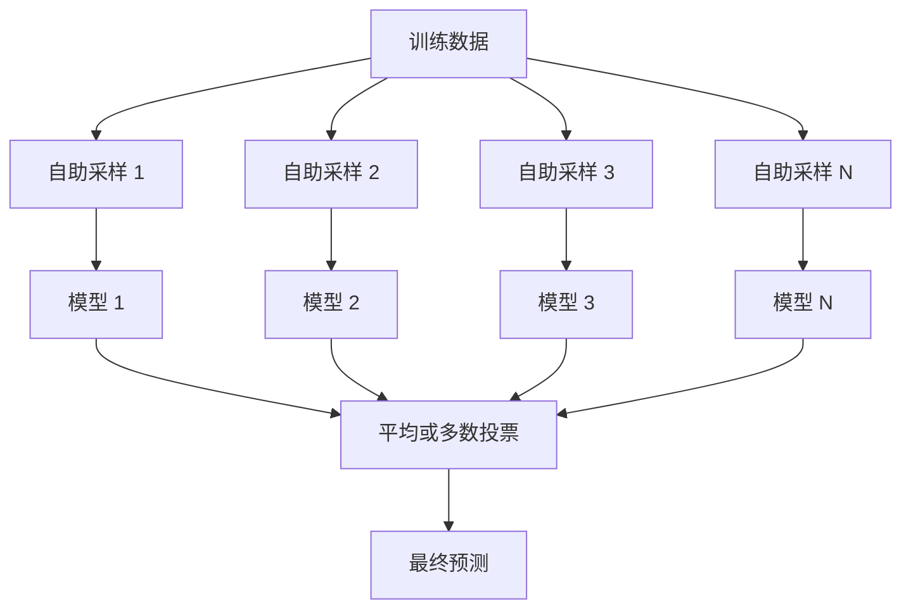
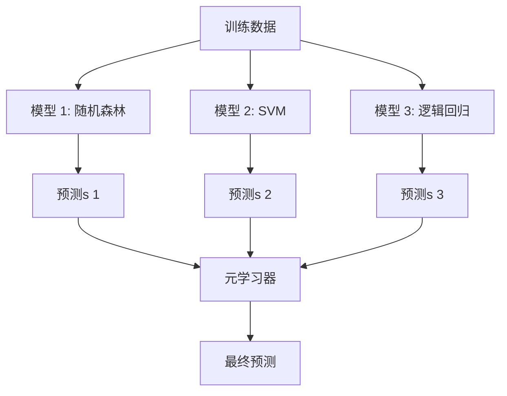

# 集成方法

> 一组弱学习器只要组合得当，就能成为强学习器。这是一条定理，而非比喻。

**类型：** 构建  
**学习实现：** Python  
**前置课程：** Phase 2 第 10 课（偏差—方差权衡）  
**预计时间：** 约 120 分钟

## 学习目标

- 从零实现 AdaBoost 和梯度提升，解释 boosting 如何按顺序降低偏差。
- 构建 bagging 集成，并展示平均去相关模型为何能降低方差而不增加偏差。
- 比较 bagging、boosting、stacking 各自针对的误差分量。
- 评估集成多样性，解释为何更多独立弱学习器能提高多数投票准确率。

## 问题

单棵决策树训练快、易解释，但容易过拟合；单个线性模型在复杂边界上会欠拟合。你可以花数天设计完美模型架构，也可以组合一批不完美模型，得到优于其中任何一个的结果。

集成方法正是这么做的。它们是表格数据 Kaggle 竞赛中最可靠的制胜技术，驱动多数生产 ML 系统，也让偏差—方差权衡变得可见：bagging 降低方差，boosting 降低偏差，stacking 学习在何种输入上信任哪个模型。

## 概念

### 为什么集成有效

假设有 N 个相互独立的分类器，每个准确率为 p > 0.5，则多数投票准确率为：

```text
P(majority correct) = sum over k > N/2 of C(N,k) * p^k * (1-p)^(N-k)
```

对于 21 个准确率均为 60% 的分类器，多数投票准确率约为 74%；有 101 个时升至 84%。不同模型犯不同错误时，错误会彼此抵消。

关键要求是**多样性**。若所有模型犯相同错误，组合没有帮助。集成通过以下方式产生多样模型：

- 不同训练数据子集（bagging）。
- 不同特征子集（随机森林）。
- 顺序地修正错误（boosting）。
- 不同模型家族（stacking）。

### Bagging（Bootstrap Aggregating） <!-- learning-atlas: bagging-bootstrap-aggregating -->

Bagging 在训练数据的不同 bootstrap 样本上训练每个模型，以制造多样性。



bootstrap 样本从原始数据中有放回抽取，大小与原始数据相同。每个样本中约出现 63.2% 的唯一原始样本，剩余 36.8%（袋外样本，out-of-bag）提供了免费的验证集。

Bagging 能显著降低方差而几乎不增加偏差。每棵树都会对自己的 bootstrap 样本过拟合，但不同树过拟合的方式不同，因此平均会抵消噪声。

**随机森林**是在 bagging 上加一层变化：每次分裂时只考虑随机的特征子集，强制树之间有更大多样性。典型候选特征数为分类时的 `sqrt(n_features)`，回归时的 `n_features / 3`。

### Boosting（顺序错误修正）

Boosting 按顺序训练模型；每个新模型都聚焦于前序模型做错的样本。


Boosting 降低偏差。每个新模型都会修正当前集成的系统性错误；最终预测是所有模型的加权和，表现更好的模型权重更高。

代价是：轮数过多时，boosting 可能过拟合，因为它不断拟合困难样本，其中一些可能只是噪声。

### AdaBoost

AdaBoost（Adaptive Boosting）是第一个实用的 boosting 算法。它可配合任意基学习器，通常使用决策树桩（深度为 1 的树）。

算法如下：

```text
1. Initialize sample weights: w_i = 1/N for all i

2. For t = 1 to T:
   a. Train weak learner h_t on weighted data
   b. Compute weighted error:
      err_t = sum(w_i * I(h_t(x_i) != y_i)) / sum(w_i)
   c. Compute model weight:
      alpha_t = 0.5 * ln((1 - err_t) / err_t)
   d. Update sample weights:
      w_i = w_i * exp(-alpha_t * y_i * h_t(x_i))
   e. Normalize weights to sum to 1

3. Final prediction: H(x) = sign(sum(alpha_t * h_t(x)))
```

误差更低的模型获得更高 alpha；被误分类的样本获得更高权重，使下一个模型聚焦于它们。

### 梯度提升

梯度提升将 boosting 推广到任意损失函数。不再重加权样本，而是让每个新模型拟合当前集成的残差（损失的负梯度）。

```text
1. Initialize: F_0(x) = argmin_c sum(L(y_i, c))

2. For t = 1 to T:
   a. Compute pseudo-residuals:
      r_i = -dL(y_i, F_{t-1}(x_i)) / dF_{t-1}(x_i)
   b. Fit a tree h_t to the residuals r_i
   c. Find optimal step size:
      gamma_t = argmin_gamma sum(L(y_i, F_{t-1}(x_i) + gamma * h_t(x_i)))
   d. Update:
      F_t(x) = F_{t-1}(x) + learning_rate * gamma_t * h_t(x)

3. Final prediction: F_T(x)
```

对平方误差损失，伪残差就是实际残差：`r_i = y_i - F_{t-1}(x_i)`。每棵树确实在拟合前一集成的错误。

学习率（shrinkage）控制每棵树的贡献。较小学习率需要更多树，但泛化更好；典型值为 0.01 到 0.3。

### XGBoost：为何主导表格数据

XGBoost（eXtreme Gradient Boosting）是在梯度提升上加入工程优化，使其快速、准确并能抵抗过拟合：

- **正则化目标：** 对叶节点权重施加 L1、L2 惩罚，避免单棵树过度自信。
- **二阶近似：** 同时使用损失的一阶和二阶导数，作出更好的切分决策。
- **稀疏感知切分：** 原生处理缺失值，在每个切分处学习缺失数据的最佳方向。
- **列采样：** 与随机森林一样，每次切分采样特征以获得多样性。
- **加权分位数 sketch：** 在分布式连续特征上高效寻找切分点。
- **缓存感知的块结构：** 内存布局针对 CPU cache line 优化。

对表格数据，XGBoost（及其后继 LightGBM）一贯优于神经网络，短期内不会改变。数据若是行列组成的表格，应从梯度提升开始。

### Stacking（元学习）

Stacking 将多个基模型的预测作为元学习器的特征。



元学习器学会对何种输入信任哪个基模型：若随机森林在某些区域表现好、SVM 在其他区域表现好，元学习器会学习相应地路由。

为避免数据泄漏，基模型预测必须通过训练集上的交叉验证生成。绝不能在同一数据上训练基模型并生成元特征。

### 投票

最简单的集成：直接组合预测。

- **硬投票：** 对类别标签进行多数投票。
- **软投票：** 平均预测概率，选择平均概率最高的类别。它利用置信度信息，通常更好。

```figure
f3-ensemble-average
```

## 动手实现

### 步骤 1：决策树桩（基学习器）

`code/ensembles.py` 从零实现了所有内容。先从单次切分的决策树桩开始。

```python
class DecisionStump:
    def __init__(self):
        self.feature_idx = None
        self.threshold = None
        self.polarity = 1
        self.alpha = None

    def fit(self, X, y, weights):
        n_samples, n_features = X.shape
        best_error = float("inf")

        for f in range(n_features):
            thresholds = np.unique(X[:, f])
            for thresh in thresholds:
                for polarity in [1, -1]:
                    pred = np.ones(n_samples)
                    pred[polarity * X[:, f] < polarity * thresh] = -1
                    error = np.sum(weights[pred != y])
                    if error < best_error:
                        best_error = error
                        self.feature_idx = f
                        self.threshold = thresh
                        self.polarity = polarity

    def predict(self, X):
        n = X.shape[0]
        pred = np.ones(n)
        idx = self.polarity * X[:, self.feature_idx] < self.polarity * self.threshold
        pred[idx] = -1
        return pred
```

### 步骤 2：从零实现 AdaBoost

```python
class AdaBoostScratch:
    def __init__(self, n_estimators=50):
        self.n_estimators = n_estimators
        self.stumps = []
        self.alphas = []

    def fit(self, X, y):
        n = X.shape[0]
        weights = np.full(n, 1 / n)

        for _ in range(self.n_estimators):
            stump = DecisionStump()
            stump.fit(X, y, weights)
            pred = stump.predict(X)

            err = np.sum(weights[pred != y])
            err = np.clip(err, 1e-10, 1 - 1e-10)

            alpha = 0.5 * np.log((1 - err) / err)
            weights *= np.exp(-alpha * y * pred)
            weights /= weights.sum()

            stump.alpha = alpha
            self.stumps.append(stump)
            self.alphas.append(alpha)

    def predict(self, X):
        total = sum(a * s.predict(X) for a, s in zip(self.alphas, self.stumps))
        return np.sign(total)
```

### 步骤 3：从零实现梯度提升

```python
class GradientBoostingScratch:
    def __init__(self, n_estimators=100, learning_rate=0.1, max_depth=3):
        self.n_estimators = n_estimators
        self.lr = learning_rate
        self.max_depth = max_depth
        self.trees = []
        self.initial_pred = None

    def fit(self, X, y):
        self.initial_pred = np.mean(y)
        current_pred = np.full(len(y), self.initial_pred)

        for _ in range(self.n_estimators):
            residuals = y - current_pred
            tree = SimpleRegressionTree(max_depth=self.max_depth)
            tree.fit(X, residuals)
            update = tree.predict(X)
            current_pred += self.lr * update
            self.trees.append(tree)

    def predict(self, X):
        pred = np.full(X.shape[0], self.initial_pred)
        for tree in self.trees:
            pred += self.lr * tree.predict(X)
        return pred
```

### 步骤 4：与 sklearn 对比

代码验证从零实现与 sklearn 的 `AdaBoostClassifier`、`GradientBoostingClassifier` 产生近似准确率，并将所有方法并列比较。

## 使用现成工具

### 何时使用每种方法

| 方法 | 降低 | 最适合 | 注意事项 |
|--------|---------|----------|---------------|
| Bagging / Random Forest | 方差 | 噪声数据、许多特征 | 无助于偏差 |
| AdaBoost | 偏差 | 干净数据、简单基学习器 | 对离群值和噪声敏感 |
| Gradient Boosting | 偏差 | 表格数据、竞赛 | 训练慢，未经调参易过拟合 |
| XGBoost / LightGBM | 两者 | 生产表格 ML | 超参数很多 |
| Stacking | 两者 | 争取最后 1–2% 准确率 | 复杂，元学习器有过拟合风险 |
| Voting | 方差 | 快速组合多样模型 | 仅模型多样时有效 |

### 表格数据的生产栈

对大多数表格预测问题，按此顺序尝试：

1. 使用默认参数的 **LightGBM 或 XGBoost**。
2. 调整 n_estimators、learning_rate、max_depth、min_child_weight。
3. 若要最后 0.5%，构建由 3–5 个多样模型组成的 stacking 集成。
4. 全程使用交叉验证。

尽管持续有研究尝试，表格数据上的神经网络几乎总比梯度提升更差。TabNet、NODE 等架构偶尔能持平，却很少胜过调优良好的 XGBoost。

## 交付成果

本课产出 `outputs/prompt-ensemble-selector.md`：帮助针对给定数据集选择正确集成方法的提示词。描述数据（规模、特征类型、噪声水平、类别平衡）和待解决问题；提示词会经过决策清单、推荐方法、给出起始超参数，并警示该方法的常见错误。还会产出包含完整选择指南的 `outputs/skill-ensemble-builder.md`。

## 练习

1. 修改 AdaBoost 实现，在每一轮后记录训练准确率。绘制准确率与估计器数量的关系；何时收敛？

2. 为回归树添加随机特征子采样，从零实现随机森林。以 `max_features=sqrt(n_features)` 训练 100 棵树并平均预测；与单棵树比较方差降低情况。

3. 在梯度提升实现中加入早停：每轮后跟踪验证损失，连续 10 轮没有改善便停止。它实际需要多少棵树？

4. 用三个基模型（逻辑回归、决策树、K 近邻）和逻辑回归元学习器构建 stacking 集成。用 5 折交叉验证生成元特征，与每个基模型单独比较。

5. 在同一数据集上使用默认参数运行 XGBoost。与从零实现的梯度提升比较准确率，并为两者计时；速度差有多大？

## 核心术语

| 术语 | 常见说法 | 实际含义 |
|------|----------------|----------------------|
| Bagging | “在随机子集上训练” | Bootstrap aggregating：在 bootstrap 样本上训练模型、平均预测以降低方差。 |
| Boosting | “关注困难样本” | 顺序训练模型，每个模型修正当前集成的错误，以降低偏差。 |
| AdaBoost | “重加权数据” | 通过更新样本权重进行 boosting；误分类点对下一个学习器权重更高。 |
| 梯度提升 | “拟合残差” | 让每个新模型拟合损失函数的负梯度来进行 boosting。 |
| XGBoost | “Kaggle 利器” | 具备正则化、二阶优化和系统级速度技巧的梯度提升。 |
| Stacking | “模型之上的模型” | 将基模型预测作为元学习器的输入特征。 |
| 随机森林 | “许多随机化树” | 在决策树 bagging 中，每次切分加入随机特征子采样以产生多样性。 |
| 集成多样性 | “犯不同的错” | 要优于个体，模型的错误必须不相关。 |
| 袋外误差 | “免费验证” | 未进入一次 bootstrap 抽取的样本（约 36.8%），无需留出集即可充当验证集。 |

## 延伸阅读

- [Schapire 与 Freund：Boosting: Foundations and Algorithms](https://mitpress.mit.edu/9780262526036/)——AdaBoost 创造者的著作。
- [Friedman：Greedy Function Approximation: A Gradient Boosting Machine（2001）](https://statweb.stanford.edu/~jhf/ftp/trebst.pdf)——原始梯度提升论文。
- [Chen 与 Guestrin：XGBoost（2016）](https://arxiv.org/abs/1603.02754)——XGBoost 论文。
- [Wolpert：Stacked Generalization（1992）](https://www.sciencedirect.com/science/article/abs/pii/S0893608005800231)——原始 stacking 论文。
- [scikit-learn Ensemble Methods](https://scikit-learn.org/stable/modules/ensemble.html)——实用参考。
