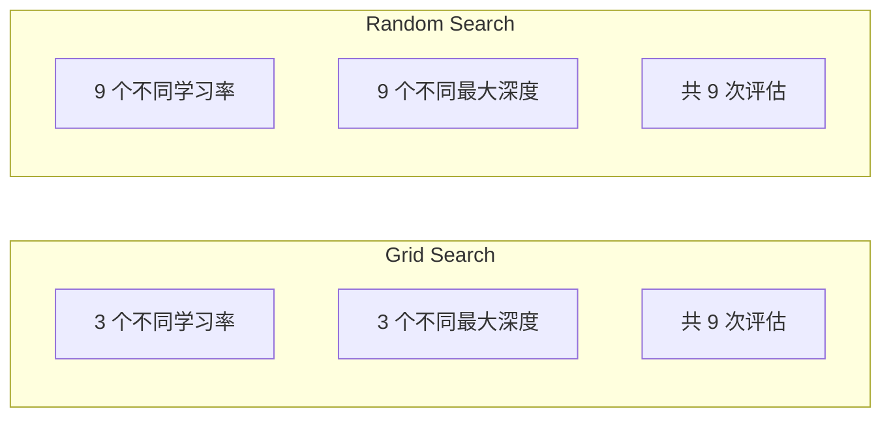
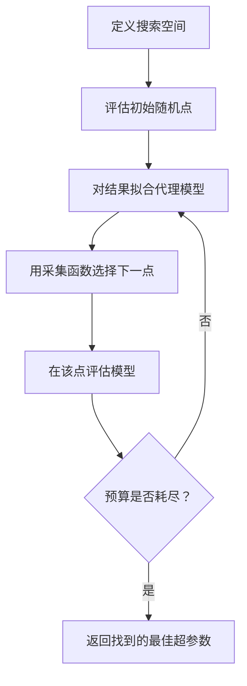
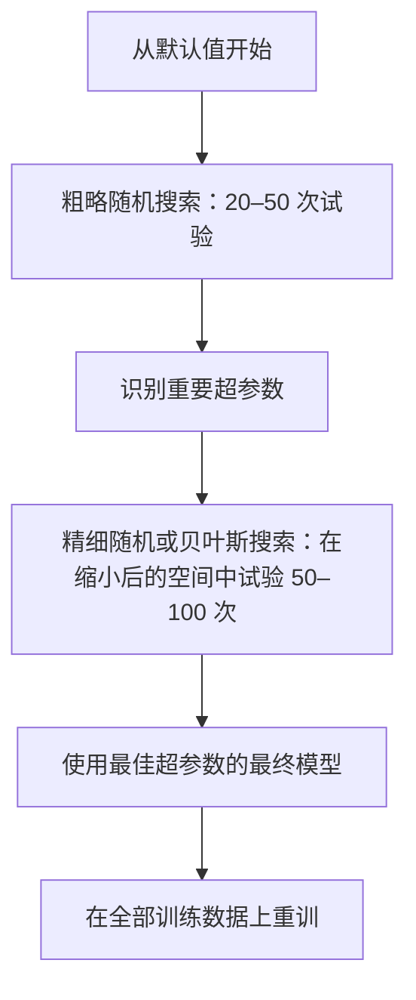
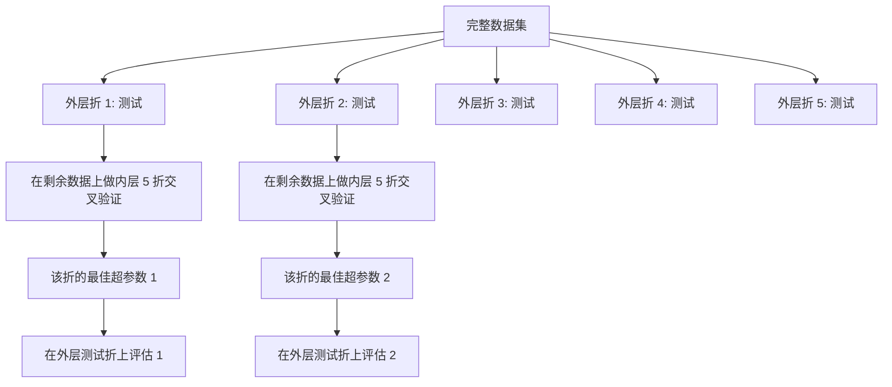

# 超参数调优

> 超参数是在训练开始前转动的旋钮；调得好与坏，决定模型是平庸还是优秀。

**类型：** 构建  
**学习实现：** Python  
**前置课程：** Phase 2 第 11 课（集成方法）  
**预计时间：** 约 90 分钟

## 学习目标

- 从零实现网格搜索、随机搜索与贝叶斯优化，并比较样本效率。
- 解释为什么大部分超参数有效维度低时，随机搜索优于网格搜索。
- 用代理模型和采集函数构建指导搜索的贝叶斯优化循环。
- 设计借助正确交叉验证、避免过拟合验证集的调参策略。

## 问题

梯度提升模型有学习率、树数、最大深度、叶节点最小样本数、行采样率和列采样率六个超参数。每个有 5 个合理值时，网格有 5^6 = 15,625 种组合；每次训练 10 秒，全部尝试需 43 小时。

网格搜索直观，却是大规模下最差的做法；随机搜索以更少计算做得更好，贝叶斯优化会从过去评估中学习，效果更佳。知道应采用何种策略及哪些超参数真正重要，能节省数天浪费的 GPU 时间。

## 概念

### 参数与超参数

参数在训练中学习（权重、偏置、切分阈值）；超参数在训练前设定，控制学习如何进行。

| 超参数 | 控制内容 | 典型范围 |
|---------------|-----------------|---------------|
| 学习率 | 每次更新的步长 | 0.001 到 1.0 |
| 树数/epoch 数 | 训练时长 | 10 到 10,000 |
| 最大深度 | 模型复杂度 | 1 到 30 |
| 正则化（lambda） | 防止过拟合 | 0.0001 到 100 |
| batch size | 梯度估计噪声 | 16 到 512 |
| dropout rate | 被丢弃神经元的比例 | 0.0 到 0.5 |

### 网格搜索

网格搜索评估给定值的每一种组合。它穷举、易理解，但成本随超参数数目指数增长。

```
Grid for 2 hyperparameters:

  learning_rate: [0.01, 0.1, 1.0]
  max_depth:     [3, 5, 7]

  Evaluations: 3 x 3 = 9 combinations

  (0.01, 3)  (0.01, 5)  (0.01, 7)
  (0.1,  3)  (0.1,  5)  (0.1,  7)
  (1.0,  3)  (1.0,  5)  (1.0,  7)
```

网格有根本缺陷：一个超参数重要、另一个不重要时，大部分评估被浪费。9 次评估只探索了重要参数的 3 个唯一取值。

### 随机搜索

随机搜索从分布而非网格采样超参数。同样 9 次评估时，每个超参数会有 9 个唯一取值。



随机搜索为何胜过网格（Bergstra 与 Bengio，2012）：

- 多数超参数有效维度低；六个中通常仅 1–2 个对一个问题重要。
- 网格把评估浪费在不重要维度上。
- 相同预算下，随机搜索更密集地覆盖重要维度。
- 60 次随机试验时，若最优点存在于搜索空间，找到距最优 5% 以内点的概率为 95%。

### 贝叶斯优化

随机搜索会忽略结果：它不知道高学习率会发散，也不知道深度 3 持续优于深度 10。贝叶斯优化利用过去评估来决定下一处搜索位置。



两项关键组成：

**代理模型：** 一个评估成本低的模型（通常是高斯过程），近似昂贵的目标函数；对搜索空间任一点同时给出预测与不确定性估计。

**采集函数：** 在利用（在已知好点附近搜索）与探索（在不确定性高处搜索）之间决定下一个点。常见选择：

- **期望改进（EI）：** 预期能比当前最佳值改进多少？
- **置信上界（UCB）：** 预测值加上不确定性的倍数；高 UCB 表示有希望或尚未探索。
- **改进概率（PI）：** 该点超过当前最佳点的概率。

贝叶斯优化通常以随机搜索 2–5 倍更少的评估找到更好超参数；与实际模型训练相比，拟合代理模型的开销可忽略。

### 早停

并非每次训练都需完成。一个配置在 10 个 epoch 后已明显很差，就应停止并继续下一个；这是超参数搜索语境的早停。

策略：

- **基于 patience：** 验证损失连续 N 个 epoch 未改善就停止。
- **中位数剪枝：** 若试验的中间结果差于相同步骤已完成试验的中位数，就停止。
- **Hyperband：** 给许多配置小预算，再逐步给最佳配置更大预算。

Hyperband 特别有效：先给 81 个配置各 1 个 epoch，保留前三分之一，各给 3 个 epoch，继续保留前三分之一，以此类推。比让全部配置运行完整预算快 10–50 倍。

### 学习率调度器

学习率几乎总是最重要的超参数。调度器不将其固定，而会在训练中调整。

| 调度器 | 公式 | 使用时机 |
|-----------|---------|-------------|
| Step decay | 每 N 个 epoch 乘 0.1 | 经典 CNN 训练 |
| Cosine annealing | lr * 0.5 * (1 + cos(pi * t / T)) | 现代默认值 |
| Warmup + decay | 线性升高后余弦衰减 | Transformer |
| One-cycle | 一个周期内先升后降 | 快速收敛 |
| Reduce on plateau | 指标停滞时按比例降低 | 安全默认值 |

### 超参数重要性

超参数的重要性并不相等。随机森林（Probst 等，2019）和梯度提升研究有一致模式：

**高重要性：**

- 学习率（永远先调）。
- 估计器/epoch 数（以早停替代调参）。
- 正则化强度。

**中等重要性：**

- 最大深度/层数。
- 每叶最小样本数/weight decay。
- 子采样率。

**低重要性：**

- 最大特征数（随机森林）。
- 具体激活函数选择。
- 合理范围内的 batch size。

先调重要参数，其余保留默认值。

### 实用策略



具体工作流：

1. **从库默认值开始。** 经验丰富的实践者选择的默认值通常已接近 80% 的效果。
2. **粗粒度随机搜索。** 宽范围、20–50 次试验；早停快速终止差的运行。
3. **分析结果。** 找出哪些超参数与性能相关，缩窄搜索空间。
4. **精细搜索。** 在缩窄空间内做贝叶斯优化或聚焦随机搜索，50–100 次试验。
5. **以最佳超参数在完整训练数据上重训。**

### 融入交叉验证

在单个验证切分上调参有风险：最佳超参数可能只过拟合该验证折。嵌套交叉验证用两个循环解决：

- **外循环（评估）：** 将数据切为训练+验证与测试，报告无偏性能。
- **内循环（调参）：** 将训练+验证再切为训练与验证，寻找最佳超参数。



每一个外层折都独立寻找自己的最佳超参数；外层分数是泛化性能的无偏估计。

使用 sklearn：

```python
from sklearn.model_selection import cross_val_score, GridSearchCV
from sklearn.ensemble import GradientBoostingRegressor

inner_cv = GridSearchCV(
    GradientBoostingRegressor(),
    param_grid={
        "learning_rate": [0.01, 0.05, 0.1],
        "max_depth": [2, 3, 5],
        "n_estimators": [50, 100, 200],
    },
    cv=5,
    scoring="neg_mean_squared_error",
)

outer_scores = cross_val_score(
    inner_cv, X, y, cv=5, scoring="neg_mean_squared_error"
)

print(f"Nested CV MSE: {-outer_scores.mean():.4f} +/- {outer_scores.std():.4f}")
```

这很昂贵（5 个外层折 × 5 个内层折 × 27 个网格点 = 675 次模型拟合），但能给出可信性能估计。论文报告最终结果或决策代价高时应使用它。

### 实用提示

**从学习率开始。** 它总是基于梯度方法中最重要的超参数；差的学习率会使其他设置失去意义。先固定其余默认值，扫描学习率。

**学习率与正则化使用 log-uniform 分布。** 0.001 到 0.01 的差异和 0.1 到 1.0 同样重要，线性搜索会在大值端浪费预算。

**以早停替代调 n_estimators。** 提升和神经网络中，将 n_estimators 或 epoch 设高，让早停决定何时停止，能少一个搜索维度。

**预算分配。** 将 60% 调参预算用于最重要的两个超参数，其余 40% 用于其他参数；前两个解释了大部分性能变化。

**尺度重要。** batch size 不应对数搜索（16、32、64 合理），学习率始终应对数搜索；搜索分布应匹配该超参数影响模型的方式。

| 模型类型 | 最重要超参数 | 推荐搜索 | 预算 |
|-----------|--------------------|--------------------|--------|
| Random Forest | n_estimators、max_depth、min_samples_leaf | 随机搜索，50 次 | 低（训练快） |
| Gradient Boosting | learning_rate、n_estimators、max_depth | 贝叶斯，100 次 + 早停 | 中 |
| Neural Network | learning_rate、weight_decay、batch_size | 贝叶斯或随机，100+ 次 | 高（训练慢） |
| SVM | C、gamma（RBF 核） | 对数尺度网格，25–50 次 | 低（2 个参数） |
| Lasso/Ridge | alpha | 对数尺度一维搜索，20 次 | 很低 |
| XGBoost | learning_rate、max_depth、subsample、colsample | 贝叶斯，100–200 次 + 早停 | 中 |

**拿不准时：** 随机试验次数取超参数数目的 2 倍（如 6 个超参数至少 12 次）。50 次随机搜索往往胜过精心设计的网格搜索。

```figure
k-fold-cv
```

## 动手实现

### 步骤 1：从零实现网格搜索

`code/tuning.py` 从零实现网格搜索、随机搜索和简单贝叶斯优化器。

```python
def grid_search(model_fn, param_grid, X_train, y_train, X_val, y_val):
    keys = list(param_grid.keys())
    values = list(param_grid.values())
    best_score = -float("inf")
    best_params = None
    n_evals = 0

    for combo in itertools.product(*values):
        params = dict(zip(keys, combo))
        model = model_fn(**params)
        model.fit(X_train, y_train)
        score = evaluate(model, X_val, y_val)
        n_evals += 1

        if score > best_score:
            best_score = score
            best_params = params

    return best_params, best_score, n_evals
```

### 步骤 2：从零实现随机搜索

```python
def random_search(model_fn, param_distributions, X_train, y_train,
                  X_val, y_val, n_iter=50, seed=42):
    rng = np.random.RandomState(seed)
    best_score = -float("inf")
    best_params = None

    for _ in range(n_iter):
        params = {k: sample(v, rng) for k, v in param_distributions.items()}
        model = model_fn(**params)
        model.fit(X_train, y_train)
        score = evaluate(model, X_val, y_val)

        if score > best_score:
            best_score = score
            best_params = params

    return best_params, best_score, n_iter
```

### 步骤 3：贝叶斯优化（简化版）

核心思路：对已观测的（超参数、分数）对拟合高斯过程，再以采集函数决定下一处搜索。

```python
class SimpleBayesianOptimizer:
    def __init__(self, search_space, n_initial=5):
        self.search_space = search_space
        self.n_initial = n_initial
        self.X_observed = []
        self.y_observed = []

    def _kernel(self, x1, x2, length_scale=1.0):
        dists = np.sum((x1[:, None, :] - x2[None, :, :]) ** 2, axis=2)
        return np.exp(-0.5 * dists / length_scale ** 2)

    def _fit_gp(self, X_new):
        X_obs = np.array(self.X_observed)
        y_obs = np.array(self.y_observed)
        y_mean = y_obs.mean()
        y_centered = y_obs - y_mean

        K = self._kernel(X_obs, X_obs) + 1e-4 * np.eye(len(X_obs))
        K_star = self._kernel(X_new, X_obs)

        L = np.linalg.cholesky(K)
        alpha = np.linalg.solve(L.T, np.linalg.solve(L, y_centered))
        mu = K_star @ alpha + y_mean

        v = np.linalg.solve(L, K_star.T)
        var = 1.0 - np.sum(v ** 2, axis=0)
        var = np.maximum(var, 1e-6)

        return mu, var

    def _expected_improvement(self, mu, var, best_y):
        sigma = np.sqrt(var)
        z = (mu - best_y) / (sigma + 1e-10)
        ei = sigma * (z * norm_cdf(z) + norm_pdf(z))
        return ei

    def suggest(self):
        if len(self.X_observed) < self.n_initial:
            return sample_random(self.search_space)

        candidates = [sample_random(self.search_space) for _ in range(500)]
        X_cand = np.array([to_vector(c) for c in candidates])
        mu, var = self._fit_gp(X_cand)
        ei = self._expected_improvement(mu, var, max(self.y_observed))
        return candidates[np.argmax(ei)]

    def observe(self, params, score):
        self.X_observed.append(to_vector(params))
        self.y_observed.append(score)
```

GP 代理在每个候选点给出预测分数（mu）和不确定性（var）。期望改进平衡二者：偏好预测分数高**或**不确定性高的点。早期大多数点不确定性高，优化器会探索；稍后它专注最有希望的区域。

### 步骤 4：比较全部方法

在同一合成目标上运行三种方法并比较。此比较使用调用直接目标函数（不训练模型）的简化包装器，所以 API 与上面的模型式实现不同：

```python
def synthetic_objective(params):
    lr = params["learning_rate"]
    depth = params["max_depth"]
    return -(np.log10(lr) + 2) ** 2 - (depth - 4) ** 2 + 10

param_grid = {
    "learning_rate": [0.001, 0.01, 0.1, 1.0],
    "max_depth": [2, 3, 4, 5, 6, 7, 8],
}

grid_best = None
grid_score = -float("inf")
grid_history = []
for combo in itertools.product(*param_grid.values()):
    params = dict(zip(param_grid.keys(), combo))
    score = synthetic_objective(params)
    grid_history.append((params, score))
    if score > grid_score:
        grid_score = score
        grid_best = params

param_dist = {
    "learning_rate": ("log_float", 0.001, 1.0),
    "max_depth": ("int", 2, 8),
}

rand_best = None
rand_score = -float("inf")
rand_history = []
rng = np.random.RandomState(42)
for _ in range(28):
    params = {k: sample(v, rng) for k, v in param_dist.items()}
    score = synthetic_objective(params)
    rand_history.append((params, score))
    if score > rand_score:
        rand_score = score
        rand_best = params

optimizer = SimpleBayesianOptimizer(param_dist, n_initial=5)
bayes_history = []
for _ in range(28):
    params = optimizer.suggest()
    score = synthetic_objective(params)
    optimizer.observe(params, score)
    bayes_history.append((params, score))
bayes_score = max(s for _, s in bayes_history)

print(f"{'Method':<20} {'Best Score':>12} {'Evaluations':>12}")
print("-" * 50)
print(f"{'Grid Search':<20} {grid_score:>12.4f} {len(grid_history):>12}")
print(f"{'Random Search':<20} {rand_score:>12.4f} {len(rand_history):>12}")
print(f"{'Bayesian Opt':<20} {bayes_score:>12.4f} {len(bayes_history):>12}")
```

在相同预算下，贝叶斯优化通常最快找到最佳分数，因为它不在明显差的区域浪费评估；随机搜索覆盖范围比网格广；仅当超参数极少且能穷举时网格搜索才会胜出。

## 使用现成工具

### 实践中的 Optuna

Optuna 是严肃超参数调优的推荐库，原生支持剪枝、分布式搜索和可视化。

```python
import optuna

def objective(trial):
    lr = trial.suggest_float("learning_rate", 1e-4, 1e-1, log=True)
    n_est = trial.suggest_int("n_estimators", 50, 500)
    max_depth = trial.suggest_int("max_depth", 2, 10)

    model = GradientBoostingRegressor(
        learning_rate=lr,
        n_estimators=n_est,
        max_depth=max_depth,
    )
    model.fit(X_train, y_train)
    return mean_squared_error(y_val, model.predict(X_val))

study = optuna.create_study(direction="minimize")
study.optimize(objective, n_trials=100)

print(f"Best params: {study.best_params}")
print(f"Best MSE: {study.best_value:.4f}")
```

Optuna 的关键功能：

- `suggest_float(..., log=True)`：适合对数尺度搜索的参数（学习率、正则化）。
- `suggest_int`：整数参数。
- `suggest_categorical`：离散选择。
- 内置 `MedianPruner`，可及早终止差的试验。
- `study.trials_dataframe()`：分析结果。

### 使用 Optuna 剪枝

剪枝及早停止没有希望的试验，节省大量计算。模式如下：

```python
import optuna
from sklearn.model_selection import cross_val_score

def objective(trial):
    params = {
        "learning_rate": trial.suggest_float("lr", 1e-4, 0.5, log=True),
        "max_depth": trial.suggest_int("max_depth", 2, 10),
        "n_estimators": trial.suggest_int("n_estimators", 50, 500),
        "subsample": trial.suggest_float("subsample", 0.5, 1.0),
    }

    model = GradientBoostingRegressor(**params)
    scores = cross_val_score(model, X_train, y_train, cv=3,
                             scoring="neg_mean_squared_error")
    mean_score = -scores.mean()

    trial.report(mean_score, step=0)
    if trial.should_prune():
        raise optuna.TrialPruned()

    return mean_score

pruner = optuna.pruners.MedianPruner(n_startup_trials=10, n_warmup_steps=5)
study = optuna.create_study(direction="minimize", pruner=pruner)
study.optimize(objective, n_trials=200)
```

`MedianPruner` 若试验中间值劣于同一步所有完成试验的中位数，就会停止它。剪枝要求调用 `trial.report()` 上报中间指标、调用 `trial.should_prune()` 检查是否停止；`n_startup_trials=10` 确保剪枝前至少有 10 个试验完整结束，通常节省总计算量的 40–60%。

### sklearn 内置调优器

快速实验可使用 sklearn 的 `GridSearchCV`、`RandomizedSearchCV` 和 `HalvingRandomSearchCV`：

```python
from sklearn.model_selection import RandomizedSearchCV
from scipy.stats import loguniform, randint

param_dist = {
    "learning_rate": loguniform(1e-4, 0.5),
    "max_depth": randint(2, 10),
    "n_estimators": randint(50, 500),
}

search = RandomizedSearchCV(
    GradientBoostingRegressor(),
    param_dist,
    n_iter=100,
    cv=5,
    scoring="neg_mean_squared_error",
    random_state=42,
    n_jobs=-1,
)
search.fit(X_train, y_train)
print(f"Best params: {search.best_params_}")
print(f"Best CV MSE: {-search.best_score_:.4f}")
```

对学习率和正则化使用 scipy 的 `loguniform`，整数超参数使用 `randint`；`n_jobs=-1` 会并行使用所有 CPU 核。

### 超参数调优的常见错误

**预处理导致数据泄漏。** 交叉验证前若在完整数据集上拟合 scaler，验证折信息会泄露进训练；始终将预处理放入 `Pipeline`，使其仅在训练折上拟合。

**过拟合验证集。** 反复根据验证集结果选择配置，相当于在验证集上训练。最终性能应使用嵌套交叉验证估计，或保留一份调参中永不触碰的独立测试集。

**搜索范围过窄。** 最佳值落在搜索空间边界时，说明搜索不够宽；最优值可能在范围之外，应始终检查最佳参数是否在边缘。

**忽略交互效应。** 提升中学习率与估计器数强烈交互：低学习率需要更多估计器。独立调它们不如联合调参。

**迭代模型没有早停。** 梯度提升和神经网络中，n_estimators 或 epoch 设高并使用早停，严格优于把迭代次数作为超参数调节。

## 练习

1. 以相同总预算（如 50 次评估）运行网格搜索和随机搜索，比较找到的最佳分数；用不同随机种子重复 10 次，随机搜索多常胜出？
2. 从零实现 Hyperband：从 81 个各训练 1 个 epoch 的配置开始，每轮保留前 1/3 并将预算加倍三倍；与让 81 个配置都运行完整预算比较总计算量。
3. 为第 11 课梯度提升实现加入学习率调度器（余弦退火），与固定学习率相比有帮助吗？
4. 用 Optuna 在真实数据集（如 sklearn 乳腺癌数据集）上调 `RandomForestClassifier`，使用 `optuna.visualization.plot_param_importances(study)` 查看重要参数；是否符合本课排序？
5. 实现简单采集函数（Expected Improvement），演示探索与利用；绘制代理模型均值与不确定性，并显示 EI 选择的下一个评估点。

## 核心术语

| 术语 | 常见说法 | 实际含义 |
|------|----------------|----------------------|
| 超参数 | “你选择的设置” | 训练前设定、控制学习过程而非从数据学习的值。 |
| 网格搜索 | “尝试每种组合” | 在指定参数网格上穷举搜索，成本指数增长。 |
| 随机搜索 | “随机抽样即可” | 从分布采样超参数，比网格更好地覆盖重要维度。 |
| 贝叶斯优化 | “智能搜索” | 用目标函数代理模型决定下一评估点，平衡探索与利用。 |
| 代理模型 | “廉价近似” | 从已观测评估近似昂贵目标函数的模型（通常为高斯过程）。 |
| 采集函数 | “下一处看哪里” | 以预期改进与不确定性平衡来为候选点评分；EI、UCB 常见。 |
| 早停 | “别再浪费时间” | 验证性能停止改善时提前终止训练。 |
| Hyperband | “配置的淘汰赛” | 自适应资源分配：许多配置先获小预算，保留最佳者并增加预算。 |
| 学习率调度器 | “训练中改 lr” | 训练过程中调整学习率以改善收敛的函数。 |

## 延伸阅读

- [Bergstra 与 Bengio：Random Search for Hyper-Parameter Optimization（2012）](https://jmlr.org/papers/v13/bergstra12a.html)——证明随机搜索胜过网格的论文。
- [Snoek 等：Practical Bayesian Optimization of Machine Learning Algorithms（2012）](https://arxiv.org/abs/1206.2944)——机器学习中的贝叶斯优化。
- [Li 等：Hyperband: A Novel Bandit-Based Approach（2018）](https://jmlr.org/papers/v18/16-558.html)——Hyperband 论文。
- [Optuna: A Next-generation Hyperparameter Optimization Framework](https://arxiv.org/abs/1907.10902)——Optuna 论文。
- [Probst 等：Tunability: Importance of Hyperparameters（2019）](https://jmlr.org/papers/v20/18-444.html)——哪些超参数重要。
