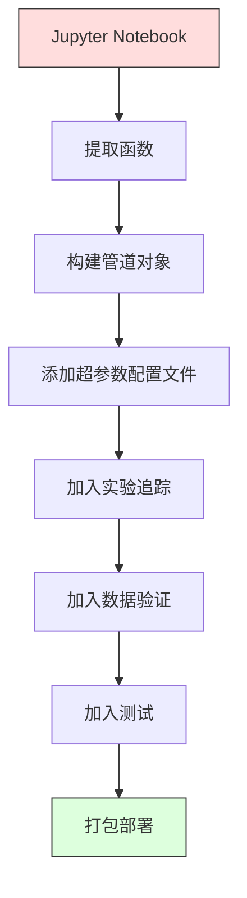

# ML 管道

> 模型不是产品，管道才是。管道覆盖从原始数据到已部署预测的一切，而且每一步都必须可复现。

**类型：** 构建  
**学习实现：** Python  
**前置课程：** Phase 2 第 12 课（超参数调优）  
**预计时间：** 约 120 分钟

## 学习目标

- 从零构建将缺失值填补、缩放、编码和模型训练串成一个可复现对象的 ML 管道。
- 识别数据泄漏场景，并解释管道仅在训练数据上拟合转换器如何防止泄漏。
- 构建对数值与类别特征采用不同预处理的 ColumnTransformer。
- 实现管道序列化，证明同一已拟合管道在训练和生产中产生相同结果。

## 问题

你有一个 notebook：加载数据、以中位数填补缺失值、缩放特征、训练模型并打印准确率。它能运行，于是你发布它。

一个月后，有人重训得到不同结果。中位数在包括测试数据的完整数据集上计算，造成数据泄漏；缩放参数没保存，推理使用了不同统计量；特征工程代码在训练和服务端复制粘贴，两个副本逐渐分歧；生产中类别列新增了编码器从未见过的值。

这并非假设，而是 ML 系统生产失败最常见的原因。管道将每个转换步骤打包成单个有序且可复现的对象，解决所有这些问题。

## 概念

### 管道是什么

管道是依次执行的数据转换和模型组成的序列。每一步以前一步输出为输入；整个管道只在训练数据上拟合一次，推理时同一已拟合管道转换新数据并预测。


管道保证：

- 转换仅在训练数据上拟合（没有泄漏）。
- 推理时应用完全相同的转换。
- 整个对象可作为一个制品序列化和部署。
- 交叉验证按折应用管道，防止隐蔽泄漏。

### 数据泄漏：沉默的杀手

当测试集或未来数据的信息污染训练时会发生数据泄漏；管道可防止最常见形式。

**泄漏（错误）：**

```python
X = df.drop("target", axis=1)
y = df["target"]

scaler = StandardScaler()
X_scaled = scaler.fit_transform(X)

X_train, X_test = X_scaled[:800], X_scaled[800:]
y_train, y_test = y[:800], y[800:]
```

scaler 已经看过测试数据，均值和标准差包括测试样本，准确率估计会虚高。

**正确：**

```python
X_train, X_test = X[:800], X[800:]

scaler = StandardScaler()
X_train_scaled = scaler.fit_transform(X_train)
X_test_scaled = scaler.transform(X_test)
```

使用管道后无需手动担心：管道会自动处理这一点。

### sklearn Pipeline

sklearn 的 `Pipeline` 串联转换器与估计器，并提供按序应用全部步骤的 `.fit()`、`.predict()` 和 `.score()`。

```python
from sklearn.pipeline import Pipeline
from sklearn.preprocessing import StandardScaler
from sklearn.linear_model import LogisticRegression

pipe = Pipeline([
    ("scaler", StandardScaler()),
    ("model", LogisticRegression()),
])

pipe.fit(X_train, y_train)
predictions = pipe.predict(X_test)
```

调用 `pipe.fit(X_train, y_train)` 时：

1. Scaler 对 X_train 调用 `fit_transform`。
2. Model 对缩放后的 X_train 调用 `fit`。

调用 `pipe.predict(X_test)` 时：

1. Scaler 对 X_test 调用 `transform`（而非 fit_transform）。
2. Model 对缩放后的 X_test 调用 `predict`。

拟合期间 scaler 从未看过测试数据，这正是核心。

### ColumnTransformer：不同列使用不同管道

真实数据集有需要不同预处理的数值列和类别列，`ColumnTransformer` 用于此事。

```python
from sklearn.compose import ColumnTransformer
from sklearn.preprocessing import StandardScaler, OneHotEncoder
from sklearn.impute import SimpleImputer

numeric_pipe = Pipeline([
    ("impute", SimpleImputer(strategy="median")),
    ("scale", StandardScaler()),
])

categorical_pipe = Pipeline([
    ("impute", SimpleImputer(strategy="most_frequent")),
    ("encode", OneHotEncoder(handle_unknown="ignore")),
])

preprocessor = ColumnTransformer([
    ("num", numeric_pipe, ["age", "income", "score"]),
    ("cat", categorical_pipe, ["city", "gender", "plan"]),
])

full_pipeline = Pipeline([
    ("preprocess", preprocessor),
    ("model", GradientBoostingClassifier()),
])
```

生产中 OneHotEncoder 的 `handle_unknown="ignore"` 至关重要。出现新类别（模型未见过的城市）时，它生成零向量而非崩溃。

### 实验追踪

管道使训练可复现，但还需记录跨实验发生了什么：使用了哪些超参数、哪个数据集版本、什么指标、运行了哪份代码。

**MLflow** 是最常见开源方案：

```python
import mlflow

with mlflow.start_run():
    mlflow.log_param("max_depth", 5)
    mlflow.log_param("n_estimators", 100)
    mlflow.log_param("learning_rate", 0.1)

    pipe.fit(X_train, y_train)
    accuracy = pipe.score(X_test, y_test)

    mlflow.log_metric("accuracy", accuracy)
    mlflow.sklearn.log_model(pipe, "model")
```

每次运行都记录参数、指标、制品和完整模型，可比较运行、复现任一实验并部署任一模型版本。

**Weights & Biases（wandb）**提供带托管仪表盘的同类功能：

```python
import wandb

wandb.init(project="my-pipeline")
wandb.config.update({"max_depth": 5, "n_estimators": 100})

pipe.fit(X_train, y_train)
accuracy = pipe.score(X_test, y_test)

wandb.log({"accuracy": accuracy})
```

### 模型版本控制

实验追踪后还需管理模型版本：哪个在生产、哪个在 staging、哪个是上周版本？

MLflow 的模型注册表提供：

- **版本追踪：**每个保存模型都有版本号。
- **阶段转换：**“Staging”“Production”“Archived”。
- **批准流程：**模型必须明确提升到生产。
- **回滚：**可立即切回过去版本。

### 使用 DVC 做数据版本控制

代码用 git 版本控制，数据也应如此，但 git 无法承载大文件。DVC（Data Version Control）解决此问题。

```
dvc init
dvc add data/training.csv
git add data/training.csv.dvc data/.gitignore
git commit -m "Track training data"
dvc push
```

DVC 将实际数据存到远程存储（S3、GCS、Azure），在 git 中保存记录哈希的小 `.dvc` 文件。切换 git commit 后，`dvc checkout` 恢复当时精确使用的数据；每个 git commit 因此同时固定代码和数据，实现完整复现。

### 可复现实验

可复现实验需要四件事：

1. **固定随机种子：**为 numpy、random 和框架（torch、sklearn）设种子。
2. **锁定依赖：**在 requirements.txt 或 poetry.lock 中写明精确版本。
3. **版本化数据：**DVC 或类似工具。
4. **配置文件：**所有超参数在配置中，而非硬编码。

```python
import numpy as np
import random

def set_seed(seed=42):
    random.seed(seed)
    np.random.seed(seed)
    try:
        import torch
        torch.manual_seed(seed)
        torch.cuda.manual_seed_all(seed)
        torch.backends.cudnn.deterministic = True
    except ImportError:
        pass
```

### 从 Notebook 到生产管道



典型演进：

1. **Notebook 探索：**快速实验、可视化和特征想法。
2. **提取函数：**将预处理、特征工程和评估移入模块。
3. **构建 Pipeline：**将转换串为 sklearn Pipeline 或自定义类。
4. **配置管理：**把所有超参数放入 YAML/JSON 配置。
5. **实验追踪：**加入 MLflow 或 wandb 日志。
6. **数据验证：**训练前检查 schema、分布与缺失值模式。
7. **测试：**为转换器写单元测试，为完整管道写集成测试。
8. **部署：**序列化管道、封装 API（FastAPI、Flask）并容器化。

### 常见管道错误

| 错误 | 危害 | 修复 |
|---------|-------------|-----|
| 切分前在完整数据上拟合 | 数据泄漏 | 配合 cross_val_score 使用 Pipeline |
| 管道外做特征工程 | 训练与服务端转换不同 | 将全部转换放进 Pipeline |
| 未处理未知类别 | 新值会令生产崩溃 | OneHotEncoder(handle_unknown="ignore") |
| 硬编码列名 | schema 改变时失效 | 从配置读取列名列表 |
| 没有数据验证 | 坏数据导致错误预测却不报错 | 预测前加入 schema 检查 |
| 训练/服务偏差 | 生产模型看到不同特征 | 训练和服务共用一个 Pipeline 对象 |

```figure
f3-pipeline-flow
```

## 动手实现

`code/pipeline.py` 从零构建完整 ML 管道：

### 步骤 1：自定义转换器

```python
class CustomTransformer:
    def __init__(self):
        self.means = None
        self.stds = None

    def fit(self, X):
        self.means = np.mean(X, axis=0)
        self.stds = np.std(X, axis=0)
        self.stds[self.stds == 0] = 1.0
        return self

    def transform(self, X):
        return (X - self.means) / self.stds

    def fit_transform(self, X):
        return self.fit(X).transform(X)
```

### 步骤 2：从零实现管道

```python
class PipelineFromScratch:
    def __init__(self, steps):
        self.steps = steps

    def fit(self, X, y=None):
        X_current = X.copy()
        for name, step in self.steps[:-1]:
            X_current = step.fit_transform(X_current)
        name, model = self.steps[-1]
        model.fit(X_current, y)
        return self

    def predict(self, X):
        X_current = X.copy()
        for name, step in self.steps[:-1]:
            X_current = step.transform(X_current)
        name, model = self.steps[-1]
        return model.predict(X_current)
```

### 步骤 3：配合管道做交叉验证

代码展示管道中的交叉验证为何能防止泄漏：scaler 在每个折的训练数据上分别拟合。

### 步骤 4：使用 sklearn 构建完整生产管道

完整管道包含 `ColumnTransformer`、多条预处理路径和模型；它在正确交叉验证与实验日志下训练。

## 交付成果

本课产出：

- `outputs/prompt-ml-pipeline.md`——构建与调试 ML 管道的 skill。
- `code/pipeline.py`——从零实现到 sklearn 的完整管道。

## 练习

1. 为含 3 列数值特征、2 列类别特征的数据集构建管道。以 `ColumnTransformer` 对数值列做中位数填补加缩放，对类别列做众数填补加 one-hot 编码；使用 5 折交叉验证训练。
2. 故意引入泄漏：切分前在完整数据集上拟合 scaler。将有泄漏的交叉验证分数与干净的管道交叉验证分数比较，差异多大？
3. 用 `joblib.dump` 序列化管道，在独立脚本中加载并预测，验证预测完全一致。
4. 向管道添加一个自定义转换器，为两个最重要数值列创建二次多项式特征；它应在管道的何处？
5. 为管道设置 MLflow 追踪，以不同超参数运行 5 次实验，用 MLflow UI（`mlflow ui`）比较并选择最佳模型。

## 核心术语

| 术语 | 常见说法 | 实际含义 |
|------|----------------|----------------------|
| 管道 | “转换链 + 模型” | 有序的已拟合转换器和模型序列，作为一个单元应用以防止泄漏。 |
| 数据泄漏 | “测试信息进了训练” | 使用训练集之外的信息构建模型，从而夸大性能估计。 |
| ColumnTransformer | “每列不同预处理” | 对不同列子集施加不同管道并合并结果。 |
| 实验追踪 | “记录运行” | 为每次训练记录参数、指标、制品和代码版本。 |
| MLflow | “追踪并部署模型” | 用于实验追踪、模型注册和部署的开源平台。 |
| DVC | “数据的 Git” | 大型数据文件版本控制系统：在 git 存哈希，在远端存数据。 |
| 模型注册表 | “模型版本目录” | 以 staging、production、archived 阶段标签追踪模型版本的系统。 |
| 训练/服务偏差 | “Notebook 里能用” | 训练与推理的数据处理不同，导致静默错误。 |
| 可复现性 | “相同代码，相同结果” | 从相同代码、数据和配置得到完全相同结果的能力。 |

## 延伸阅读

- [scikit-learn Pipeline docs](https://scikit-learn.org/stable/modules/compose.html)——官方管道参考。
- [MLflow documentation](https://mlflow.org/docs/latest/index.html)——实验追踪和模型注册。
- [DVC documentation](https://dvc.org/doc)——数据版本控制。
- [Sculley 等：Hidden Technical Debt in Machine Learning Systems（2015）](https://papers.nips.cc/paper/2015/hash/86df7dcfd896fcaf2674f757a2463eba-Abstract.html)——ML 系统复杂性的奠基论文。
- [Google ML Best Practices: Rules of ML](https://developers.google.com/machine-learning/guides/rules-of-ml)——实用生产 ML 建议。
