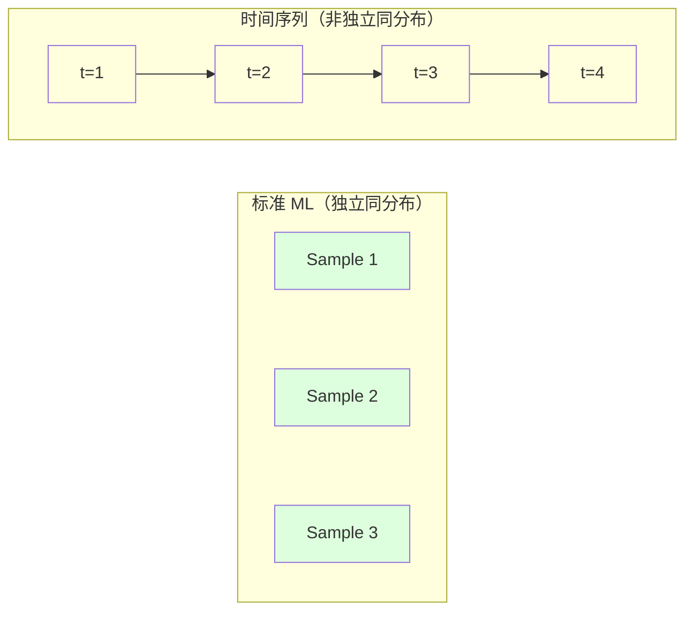
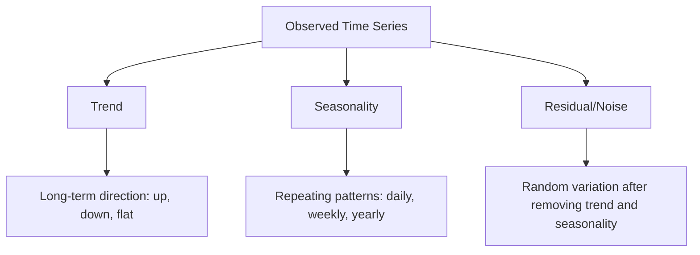
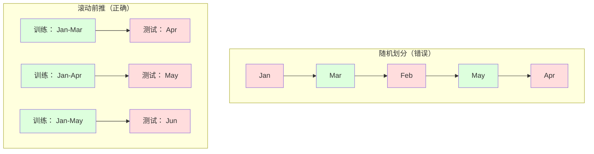

# 时间序列基础

> 过去的表现确实可以预测未来——但先要检验平稳性。

**类型：** 构建  
**学习实现：** Python  
**前置课程：** Phase 2 第 01–09 课  
**预计时间：** 约 90 分钟

## 学习目标

- 将时间序列分解为趋势、季节性和残差，并检验平稳性。
- 实现滞后特征和滚动统计量，把时间序列转为监督学习问题。
- 构建防止未来数据泄漏到训练中的 walk-forward 验证框架。
- 解释随机训练/测试切分对时间序列为何无效，并展示它与正确时间切分的性能差距。

## 问题

你有按时间排序的数据：每日销售额、每小时温度、每分钟 CPU 使用率、每周股价；想预测下一个值、下一周或下一季度。

拿出标准 ML 工具箱——随机训练/测试切分、交叉验证、输入特征矩阵并输出预测——每一步都错了。

时间序列打破标准 ML 的假设：样本不独立，今天温度依赖昨天；随机切分会把未来信息泄入过去；回测表现出色的特征会在生产失败，因为时间中的模式会改变。

随机交叉验证中准确率 95% 的模型，使用合适的时间评估时可能只有 55%。这不是技术细节，而是纸面模型与生产模型的差别。本课介绍时间数据的不同、诚实评估和将序列转成标准 ML 可消费特征的方法。

## 概念

### 时间序列为何不同

标准 ML 假设 i.i.d.（独立同分布）：各样本独立地从同一分布抽取。时间序列两者都违背：

- **不独立。**今日股价依赖昨日，本周销售与上周相关。
- **不同分布。**分布随时间移动；12 月销售不同于 3 月。

这些违背并不小，它们改变特征构建、评估和适用算法。



标准 ML 中样本可互换，打乱无影响；时间序列中顺序是一切，打乱会摧毁信号。

### 时间序列的组成

每个时间序列都由以下部分组合：



- **趋势：**长期方向，例如收入每年增长 10%、全球气温上升。
- **季节性：**固定间隔的重复模式，例如零售额 12 月峰值、空调使用 7 月峰值。
- **残差：**移除趋势和季节性后剩余内容；若似白噪声，说明分解捕捉了信号。

### 平稳性

若统计性质（均值、方差、自相关）不随时间变化，序列是平稳的；多数预测方法假设平稳。

**为何重要：**非平稳序列均值漂移，在 1 月训练的模型学到的均值与 2 月呈现的不同，因而会系统性出错。

**如何检查：**在窗口上计算滚动均值和滚动标准差；若漂移，序列非平稳。

**如何修复：**差分。不要建模原值，建模相邻值变化：

```
diff[t] = value[t] - value[t-1]
```

一次差分仍不平稳就再次差分（二阶差分）；多数真实序列至多需要两次。

**示例：**原序列 `[100, 102, 106, 112, 120]`；一阶差分 `[2, 4, 6, 8]`（仍上升）；二阶差分 `[2, 2, 2]`（常数，平稳）。原序列有二次趋势，一阶后是线性趋势，二阶后变平；实践中很少超过两次。

**正式检验：**Augmented Dickey-Fuller（ADF）是平稳性的标准统计检验，原假设为“序列非平稳”。p 值小于 0.05 时拒绝原假设、认为平稳。本课不从零实现 ADF（需渐近分布表），代码中的滚动统计量给出实用可视检查。

### 自相关

自相关衡量时刻 t 的值与 t-k（过去 k 步）值的相关程度。自相关函数（ACF）对每个滞后 k 绘制此相关。

**ACF 告诉你：**

- 序列记忆多远；ACF 在滞后 5 后为零时，更早值无关。
- 是否有季节性；月度数据在滞后 12 出现尖峰表示年度季节性。
- 该创建多少滞后特征；使用至 ACF 可忽略处的滞后。

**PACF（偏自相关函数）**移除间接相关：若今天与三天前只因都与昨天相关，PACF 的滞后 3 为零而 ACF 不为零。

### 滞后特征：将时间序列转为监督学习

标准 ML 需要特征矩阵 X 和目标 y，而时间序列只给出一列值。桥梁是滞后特征。

对序列 `[10, 12, 14, 13, 15]` 创建 lag-1、lag-2：

| lag_2 | lag_1 | target |
|-------|-------|--------|
| 10 | 12 | 14 |
| 12 | 14 | 13 |
| 14 | 13 | 15 |

现在是标准回归问题，线性回归、随机森林、梯度提升均能由滞后预测目标。

可构造的额外特征：

- **滚动统计量：**最近 k 值的 mean、std、min、max。
- **日历特征：**星期几、月份、is_holiday、is_weekend。
- **差分值：**与前一步变化。
- **扩张统计量：**累计均值、累计和。
- **比率特征：**当前值 / 滚动均值（偏离近期均值多少）。
- **交互特征：**lag_1 * day_of_week（工作日对动量的影响）。

**多少滞后？**按 ACF：显著至 lag 10 时至少用 10 个；有周季节性时加入 lag 7（也许 14）。更多滞后提供历史，也增加待拟合特征并提高过拟合风险。

**目标对齐陷阱。**目标必须是时间 t 的值，所有特征只使用 t-1 或更早的值；误将 t 值作为特征会得到完美却毫无用处的模型，这是时间特征工程最常见 bug。

### Walk-Forward 验证

这是本课最重要概念。标准 k 折交叉验证随机将样本分给训练和测试，在时间序列中会泄露未来信息。



Walk-forward 验证：

1. 用至时间 t 的数据训练。
2. 预测时间 t+1（多步时预测 t+1 至 t+k）。
3. 将窗口向前移动。
4. 重复。

每个测试折都只含晚于全部训练数据的内容，无未来泄漏，因此诚实估计部署表现。

**扩张窗口**使用所有历史数据训练（窗口增长）；**滑动窗口**使用固定大小训练窗口（窗口平移）。认为旧数据仍相关时用扩张；世界改变、旧数据有害时用滑动。

### ARIMA 直觉

ARIMA 是经典时间序列模型，含三部分：

- **AR（自回归）：**由过去值预测，AR(p) 使用最近 p 个值。
- **I（Integrated）：**通过差分实现平稳，I(d) 做 d 次差分。
- **MA（移动平均）：**由过去预测误差预测，MA(q) 使用最近 q 个误差。

ARIMA(p, d, q) 组合三者；按 ACF/PACF 分析或自动搜索（auto-ARIMA）选择 p、d、q。本课不从零实现 ARIMA（需数值优化），重点是理解各部分以解释结果、判断何时使用。

### 何时用什么

| 方法 | 最适合 | 处理季节性 | 处理外部特征 |
|----------|---------|-------------------|------------------------|
| 滞后特征 + ML | 有许多外部特征的表格数据 | 使用日历特征 | 是 |
| ARIMA | 单个单变量、短期 | SARIMA 变体 | 否（有限 ARIMAX） |
| 指数平滑 | 简单趋势 + 季节性 | 是（Holt-Winters） | 否 |
| Prophet | 商业预测、节假日 | 是（Fourier 项） | 有限 |
| 神经网络（LSTM、Transformer） | 长序列、多条序列 | 学得 | 是 |

多数实践问题中，滞后特征 + 梯度提升是最强起点：自然处理外部特征，不要求平稳，也易调试。

### 预测范围与策略

单步预测预测下一个时间步，多步预测预测多个时间步，有三种策略：

**递归（iterated）：**预测一步，再把预测作为下一步输入；简单但误差累计。

**直接：**每个范围单独训练模型；Model-1 预测 t+1、Model-5 预测 t+5。无误差累积，但每模型样本更少、模型不共享信息。

**多输出：**一个模型同时输出全部范围；跨范围共享信息，但需支持多输出的模型（或自定义损失）。

实践中短范围（1–5 步）从递归开始，较长范围从直接开始。

### 常见时间序列错误

| 错误 | 原因 | 修复 |
|---------|---------------|-----------|
| 随机训练/测试切分 | 标准 ML 的习惯 | 用 walk-forward 或时间切分 |
| 使用未来特征 | 误包含 t 时刻特征 | 审计每个特征的时间对齐 |
| 过拟合季节性 | 模型死记日历模式 | 测试集留出完整季节周期 |
| 忽略尺度改变 | 收入翻倍但模式保持 | 建模百分比变化而非绝对值 |
| 过多滞后 | “历史越多越好” | 用 ACF 决定相关滞后 |
| 不做差分 | “模型会自己发现” | 树模型能处理趋势；线性模型需要平稳 |

```figure
f3-series-decompose
```

## 动手实现

`code/time_series.py` 从零实现核心构件。

### 滞后特征创建器

```python
def make_lag_features(series, n_lags):
    n = len(series)
    X = np.full((n, n_lags), np.nan)
    for lag in range(1, n_lags + 1):
        X[lag:, lag - 1] = series[:-lag]
    valid = ~np.isnan(X).any(axis=1)
    return X[valid], series[valid]
```

它将一维序列转换为特征矩阵：每行以最近 `n_lags` 个值为特征，当前值为目标。

### Walk-Forward 交叉验证

```python
def walk_forward_split(n_samples, n_splits=5, min_train=50):
    assert min_train < n_samples, "min_train must be less than n_samples"
    step = max(1, (n_samples - min_train) // n_splits)
    for i in range(n_splits):
        train_end = min_train + i * step
        test_end = min(train_end + step, n_samples)
        if train_end >= n_samples:
            break
        yield slice(0, train_end), slice(train_end, test_end)
```

每个切分保证训练数据严格早于测试数据，训练窗口随折扩张。

### 简单自回归模型

纯 AR 模型就是在滞后特征上做线性回归：

```python
class SimpleAR:
    def __init__(self, n_lags=5):
        self.n_lags = n_lags
        self.weights = None
        self.bias = None

    def fit(self, series):
        X, y = make_lag_features(series, self.n_lags)
        # Solve via normal equations
        X_b = np.column_stack([np.ones(len(X)), X])
        theta = np.linalg.lstsq(X_b, y, rcond=None)[0]
        self.bias = theta[0]
        self.weights = theta[1:]
        return self
```

概念上与第 02 课线性回归相同，只是应用在同一变量的时间滞后版本上。

### 平稳性检查

代码计算滚动统计量，以可视和数值方式评估平稳性：

```python
def check_stationarity(series, window=50):
    rolling_mean = np.array([
        series[max(0, i - window):i].mean()
        for i in range(1, len(series) + 1)
    ])
    rolling_std = np.array([
        series[max(0, i - window):i].std()
        for i in range(1, len(series) + 1)
    ])
    return rolling_mean, rolling_std
```

滚动均值漂移或滚动 std 改变时序列非平稳；差分后再次检查。代码还比较序列前半/后半：均值差超过半个标准差或方差比超过 2 倍时标为非平稳。

### 自相关

```python
def autocorrelation(series, max_lag=20):
    n = len(series)
    mean = series.mean()
    var = series.var()
    acf = np.zeros(max_lag + 1)
    for k in range(max_lag + 1):
        cov = np.mean((series[:n-k] - mean) * (series[k:] - mean))
        acf[k] = cov / var if var > 0 else 0
    return acf
```

## 使用现成工具

sklearn 中可直接将滞后特征交给任意回归器：

```python
from sklearn.linear_model import Ridge
from sklearn.ensemble import GradientBoostingRegressor

X, y = make_lag_features(series, n_lags=10)

for train_idx, test_idx in walk_forward_split(len(X)):
    model = Ridge(alpha=1.0)
    model.fit(X[train_idx], y[train_idx])
    predictions = model.predict(X[test_idx])
```

ARIMA 使用 statsmodels：

```python
from statsmodels.tsa.arima.model import ARIMA

model = ARIMA(train_series, order=(5, 1, 2))
fitted = model.fit()
forecast = fitted.forecast(steps=30)
```

`time_series.py` 展示两种方法，并以 walk-forward 验证比较。

### sklearn TimeSeriesSplit

sklearn 的 `TimeSeriesSplit` 实现 walk-forward 验证：

```python
from sklearn.model_selection import TimeSeriesSplit

tscv = TimeSeriesSplit(n_splits=5)
for train_index, test_index in tscv.split(X):
    X_train, X_test = X[train_index], X[test_index]
    y_train, y_test = y[train_index], y[test_index]
    model.fit(X_train, y_train)
    score = model.score(X_test, y_test)
```

它等同于从零实现的 `walk_forward_split`，但融入 sklearn 交叉验证框架；还可用于 `cross_val_score`：

```python
from sklearn.model_selection import cross_val_score

scores = cross_val_score(model, X, y, cv=TimeSeriesSplit(n_splits=5))
print(f"Mean score: {scores.mean():.4f} +/- {scores.std():.4f}")
```

### 评估指标

预测使用回归指标，但需时间语境：

- **MAE：**|y_true - y_pred| 的平均，原单位容易解释，例如“平均偏差 3.2 度”。
- **RMSE：**均方误差平方根，比 MAE 更重罚大误差；大错比许多小错更坏时用。
- **MAPE：**|error / true_value| * 100 的平均，独立于尺度，可比较不同序列；真实值为零时未定义。
- **朴素基线比较：**始终比较简单基线。季节性朴素基线预测一个周期前值（昨天、上周）；若模型赢不了它，必有问题。

### 滚动特征

代码为滞后特征加入窗口为 7、14 天的滚动 mean、std、min、max；这给模型提供仅靠滞后不具备的近期趋势与波动信息。滚动均值上升表示可能上行，滚动 std 增大表示波动增强；树模型可学习这类模式，线性模型无法做到。

## 交付成果

本课产出：

- `outputs/prompt-time-series-advisor.md`——界定时间序列问题的提示词。
- `code/time_series.py`——滞后特征、walk-forward 验证、AR 模型和平稳性检查。

### 必须击败的基线

建模前先建立基线：

1. **最后值（持续性）。**预测明天等于今天；许多序列意外地难以超越。
2. **季节性朴素。**预测今天等于上周（或去年）同一天；若模型不能超过它，未学到超越季节性的有用模式。
3. **移动平均。**预测最近 k 值均值，能平滑噪声但不能捕捉突变。

花哨的 ML 模型若输给季节性朴素基线，说明存在 bug，最常见为特征未来泄漏、评估方法错误，或序列确实随机而不可预测。

### 实用提示

1. **先作图。**任何建模前绘制原始序列，查看趋势、季节性、离群值和结构断点；30 秒目检常胜过一小时自动分析。
2. **先差分、后建模。**明确趋势时，创建滞后特征前先差分。树模型能处理趋势，线性模型不能，而差分从不有害。
3. **至少留出完整季节周期。**周季节性测试集至少一整周，月季节性至少一整月，否则无法评估是否学会季节模式。
4. **生产中监测。**世界改变会让模型退化；滚动追踪预测误差，误差升高时在近期数据上重训。
5. **警惕制度变化。**疫情前数据无法预测疫情后行为；加入已知制度变化指标，或用会忘掉旧数据的滑动窗口。
6. **对偏斜序列取对数。**收入、价格、计数常右偏；log 稳定方差、将乘性模式变成线性模型可处理的加性模式。先在对数空间预测，再指数变换回原单位。

## 练习

1. **平稳性实验。**生成有线性趋势序列，以滚动统计量检验、应用一阶差分、再次检验；二次趋势需几轮差分？
2. **滞后选择。**在季节周期为 7 的序列上计算 ACF，哪些滞后自相关最高？仅用这些滞后（非连续滞后）创建特征，与 lags 1–7 比较准确率会提升吗？
3. **Walk-forward 与随机切分。**在滞后特征上训练 Ridge，以随机 80/20 和 walk-forward 分别评估；随机切分夸大了多少性能？
4. **特征工程。**为滞后特征添加滚动均值（7）、滚动 std（7）、星期几，与没有它们的 walk-forward 表现比较。
5. **多步预测。**将 AR 改为预测未来 5 步，比较递归（一步预测作为下一步输入）与直接（每个范围独立模型）；哪个更准确？

## 核心术语

| 术语 | 常见说法 | 实际含义 |
|------|----------------|----------------------|
| 平稳性 | “统计量不随时间变” | 均值、方差和自相关结构随时间恒定的序列。 |
| 差分 | “相邻值相减” | 计算 y[t] - y[t-1] 以移除趋势、实现平稳。 |
| 自相关（ACF） | “序列和自身的相关” | 时间序列与其滞后副本的相关，关于滞后的函数。 |
| 偏自相关（PACF） | “仅直接相关” | 移除所有较短滞后影响后，滞后 k 的自相关。 |
| 滞后特征 | “过去值作输入” | 以 y[t-1]、y[t-2]、…、y[t-k] 为特征预测 y[t]。 |
| Walk-forward 验证 | “尊重时间的交叉验证” | 训练数据按时间总早于测试数据的评估。 |
| ARIMA | “经典时间序列模型” | AutoRegressive Integrated Moving Average：组合过去值、差分和过去误差。 |
| 季节性 | “重复的日历模式” | 依附日、周、年等周期的规则、可预测循环。 |
| 趋势 | “长期方向” | 序列水平持续增加或减少。 |
| 扩张窗口 | “使用所有历史” | 训练集随每个折增长的 walk-forward 验证。 |
| 滑动窗口 | “固定大小历史” | 固定长度训练窗口向前滑动的 walk-forward 验证。 |

## 延伸阅读

- [Hyndman 与 Athanasopoulos：Forecasting: Principles and Practice（第 3 版）](https://otexts.com/fpp3/)——最好的免费时间序列预测教材。
- [scikit-learn Time Series Split](https://scikit-learn.org/stable/modules/generated/sklearn.model_selection.TimeSeriesSplit.html)——sklearn walk-forward 切分器。
- [statsmodels ARIMA docs](https://www.statsmodels.org/stable/generated/statsmodels.tsa.arima.model.ARIMA.html)——带诊断的 ARIMA 实现。
- [Makridakis 等：The M5 Competition（2022）](https://www.sciencedirect.com/science/article/pii/S0169207021001874)——比较 ML 与统计方法的大规模预测竞赛。
