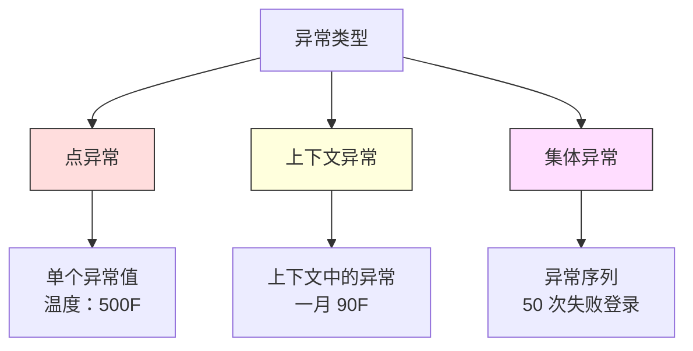
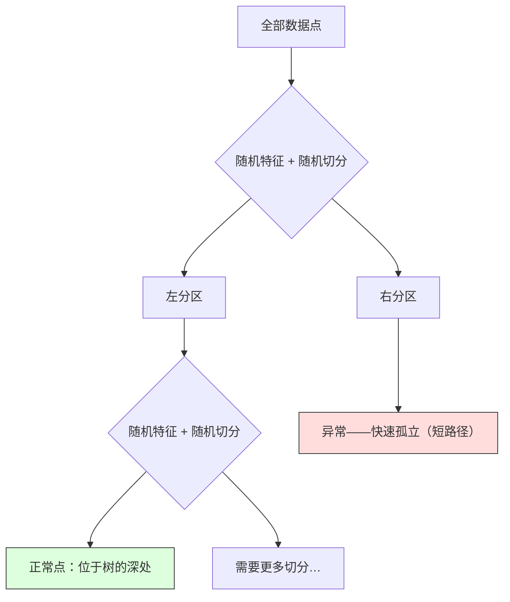

# 异常检测

> 正常很容易定义；异常就是不符合它的一切。

**类型：** 构建  
**学习实现：** Python  
**前置课程：** Phase 2 第 01–09 课  
**预计时间：** 约 75 分钟

## 学习目标

- 从零实现 Z-score、IQR 和 Isolation Forest 异常检测方法。
- 区分点异常、上下文异常、集体异常，并为每种选择适当方法。
- 解释异常检测为何建模正常数据，而非分类异常。
- 比较无监督检测与有监督分类，并评估新异常覆盖率与精确率的权衡。

## 问题

信用卡下午 2 点在纽约使用、2:05 又在东京使用；工厂传感器读到 150 度而正常范围是 80–120；服务器每秒请求 50,000 次而日均为 200。这些都是异常。欺诈、设备失效、网络入侵分别造成资金、停机和数据损失。

难点是几乎没有异常标注：欺诈仅占交易 0.1%，设备故障一年几次。异常类几乎无数据，无法训练标准分类器；即使有少量标注，已见异常也不等于未来异常，明日欺诈会与今日不同。

异常检测反转问题：不学习什么异常，而学习什么正常；任何偏离正常者都可疑。它无需标注、能适应新异常并可扩展至海量数据。

## 概念

### 异常类型

异常并不相同：

- **点异常：**不论上下文都异常的单个点，如 500 度温度、平常花 $50 的账户一笔 $50,000 交易。
- **上下文异常：**在给定上下文才异常，如 90 度夏天正常、冬天异常。
- **集体异常：**单个点正常、整体序列异常，如 5 次登录失败正常，连续 50 次则是暴力破解。

多数方法检测点异常；上下文异常需时间/位置特征，集体异常需序列感知方法。



### 无监督框架

标准分类有两类标签；异常检测通常处于下列之一：

1. **完全无监督：**无任何标注，在所有数据上拟合，期望异常足够少、不污染正常模型。
2. **半监督：**有一份仅包含正常数据的干净集，在其上拟合、对其余数据评分；可能时是最强设置。
3. **弱监督：**有少量已标注异常，仅用于评估而非训练；无监督训练，再在标注子集上测 precision/recall。

关键洞见是：异常检测与分类根本不同——建模的是正常数据分布，而非两类之间的决策边界。

### 有监督与无监督：权衡

有异常标注时，是用于训练还是只用于评估？

**有监督（当分类）：**

- 能抓住已经见过的确切异常类型。
- 对已知异常类型有更高的 precision。
- 会完全错过新型异常。
- 出现新型异常时需要重新训练。
- 需要足够的异常样本（通常很少）。

**无监督（建模正常、标记偏离）：**

- 能捕捉任何偏离正常的情况，包括新型异常。
- 不需要已标注的异常。
- 假阳性率更高（不寻常不等于有害）。
- 对分布变化更稳健。

实践中最佳系统结合二者：无监督广覆盖，有监督处理已知高优先异常，人工复核模糊情形。

### Z-score 方法 <!-- learning-atlas: z-score-method -->

最简单做法是计算每个特征均值和标准差，离均值超过 k 个标准差则标记：

```text
z_score = (x - mean) / std
anomaly if |z_score| > threshold
```

默认阈值 3.0（高斯分布 99.7% 正常数据在三倍标准差内）。

**优点：**简单、快速、可解释（“该值离正常 4.5 个标准差”）。

**弱点：**假设正态分布；训练离群值会移动均值并放大 std，反而变难检测；多峰分布上失败。

**适用：**大致钟形的单特征监控，如服务响应时间、制造公差、稳定基线传感器。**不适用：**多簇数据、偏斜交易额、训练集已有离群值。

### IQR 方法

比 Z-score 稳健，使用四分位距而非均值和标准差：

```
Q1 = 25th percentile
Q3 = 75th percentile
IQR = Q3 - Q1
lower_bound = Q1 - factor * IQR
upper_bound = Q3 + factor * IQR
anomaly if x < lower_bound or x > upper_bound
```

默认 factor 是 1.5。

**优点：**对极值稳健（百分位数不受极端值影响）、适合偏斜分布、无正态假设。**弱点：**仅单变量、逐特征独立，无法检测只有联合空间才不寻常的点。

**实践提示：**IQR 的 1.5 对应箱线图的须，须外点是潜在离群；用 3.0 更保守（更少标记和假阳性）。合适 factor 取决于对误报容忍度。

### Isolation Forest

核心洞见：异常少且不同，随机划分数据时更容易被隔离，只需较少随机切分便与其他点分开。



**工作方式：**

1. 建多棵随机树（isolation forest）。
2. 每节点选随机特征和其最小/最大间的随机切分值。
3. 一直切分直到每点独占叶子。
4. 异常在各树中平均路径更短。

正常点在稠密区域，需要许多随机切分才与邻居分开；异常在稀疏区域，一两次切分即可隔离。

异常分数基于跨树平均路径长度，并以随机二叉搜索树的期望路径长度归一化：

```
score(x) = 2^(-average_path_length(x) / c(n))
```

`c(n)` 是 n 个样本的期望路径长度。接近 1 为异常，0.5 附近正常，接近 0 极正常（密集簇深处）。

**优点：**无分布假设，适用于高维，可扩展（每树只用子样本，样本量次线性），可处理混合特征。**弱点：**难处理稠密区异常（masking），无关特征多时随机切分效率低。

**关键超参数：**

- `n_estimators`：树的数量。100 通常足够；更多树使分数更稳定，但计算更慢。
- `max_samples`：每棵树使用的样本数。原始论文默认 256；更小的值会降低单棵树的准确性、增加多样性。子采样正是 Isolation Forest 快的原因：每棵树只看一小部分数据。
- `contamination`：预期异常比例。它只用于设定阈值，不影响分数本身。

### Local Outlier Factor（LOF）

LOF 比较点周围局部密度和其邻居密度；稀疏点若周围是稠密区则异常。

**工作方式：**

1. 对每个点找到它的 k 个最近邻。
2. 计算局部可达密度（邻域有多稠密）。
3. 将每个点的密度与其邻居的密度比较。
4. 若某点密度远低于其邻居，它就是离群点。

**LOF 分数：**

- 接近 1.0：与邻居密度相似（正常）。
- 大于 1.0：密度低于邻居（可能异常）。
- 远大于 1.0（如 2.0+）：密度显著更低（很可能异常）。

“局部”关键在于两个不同密度簇：1000 点稠密簇与 50 点稀疏簇。稀疏簇边缘点全局不罕见（有 50 个邻居），但若其直接邻居更密集则局部异常；LOF 捕捉这一点。

**优点：**检测局部异常、适用于不同密度簇。**弱点：**大数据慢（朴素实现 O(n^2)）、对 k 敏感、高维中距离受维数灾难影响。

### 比较

| 方法 | 假设 | 速度 | 处理高维 | 检测局部异常 |
|--------|------------|-------|-------------------|------------------------|
| Z-score | 正态分布 | 极快 | 是（逐特征） | 否 |
| IQR | 无（逐特征） | 极快 | 是（逐特征） | 否 |
| Isolation Forest | 无 | 快 | 是 | 部分 |
| LOF | 距离有意义 | 慢 | 差 | 是 |

### 评估挑战

评估异常检测器比评估分类器更难：

- **极端类别不平衡：**异常仅占 0.1% 时，全部预测“正常”也有 99.9% 准确率，准确率毫无用处。
- **AUROC 有误导性：**严重不平衡时，即使模型在实用阈值下漏掉大多数异常，AUROC 仍可能看起来不错。
- **更好的指标：**Precision@k（前 k 个被标记项目中有多少是真异常）、AUPRC（precision-recall 曲线下面积）以及固定假阳性率下的 recall。


### 异常检测管道

实践工作流：

1. **收集基线数据：**理想是已知没有或极少异常的时段。
2. **特征工程：**原始特征加滚动统计、时间、比率等派生特征。
3. **训练检测器：**在基线上拟合，学习“正常”。
4. **为新数据评分：**每次观测得到异常分数。
5. **选择阈值：**分数切点是业务决定；阈值高表示更少误报、更多漏报。
6. **告警与调查：**标记点交由人工或自动响应。
7. **收集反馈：**记录真异常/误报，用来评估并随时间调阈值。

管道永远不会“完成”：数据分布改变、新类型出现、阈值需调整，应把它当存活系统而非一次性模型。

```figure
f3-anomaly-fence
```

## 动手实现

`code/anomaly_detection.py` 从零实现 Z-score、IQR 和 Isolation Forest。

### Z-score 检测器

```python
def zscore_detect(X, threshold=3.0):
    mean = X.mean(axis=0)
    std = X.std(axis=0)
    std[std == 0] = 1.0
    z = np.abs((X - mean) / std)
    return z.max(axis=1) > threshold
```

简单且向量化：任一特征超过阈值即标记该点。

### IQR 检测器

```python
def iqr_detect(X, factor=1.5):
    q1 = np.percentile(X, 25, axis=0)
    q3 = np.percentile(X, 75, axis=0)
    iqr = q3 - q1
    iqr[iqr == 0] = 1.0
    lower = q1 - factor * iqr
    upper = q3 + factor * iqr
    outside = (X < lower) | (X > upper)
    return outside.any(axis=1)
```

### 从零实现 Isolation Forest

从零实现构建随机划分特征空间的隔离树：

```python
class IsolationTree:
    def __init__(self, max_depth):
        self.max_depth = max_depth

    def fit(self, X, depth=0):
        n, p = X.shape
        if depth >= self.max_depth or n <= 1:
            self.is_leaf = True
            self.size = n
            return self
        self.is_leaf = False
        self.feature = np.random.randint(p)
        x_min = X[:, self.feature].min()
        x_max = X[:, self.feature].max()
        if x_min == x_max:
            self.is_leaf = True
            self.size = n
            return self
        self.threshold = np.random.uniform(x_min, x_max)
        left_mask = X[:, self.feature] < self.threshold
        self.left = IsolationTree(self.max_depth).fit(X[left_mask], depth + 1)
        self.right = IsolationTree(self.max_depth).fit(X[~left_mask], depth + 1)
        return self
```

隔离点的路径长度决定异常分数，越短越异常。

`IsolationForest` 类包装多棵树：

```python
class IsolationForest:
    def __init__(self, n_estimators=100, max_samples=256, seed=42):
        self.n_estimators = n_estimators
        self.max_samples = max_samples

    def fit(self, X):
        sample_size = min(self.max_samples, X.shape[0])
        max_depth = int(np.ceil(np.log2(sample_size)))
        for _ in range(self.n_estimators):
            idx = rng.choice(X.shape[0], size=sample_size, replace=False)
            tree = IsolationTree(max_depth=max_depth)
            tree.fit(X[idx])
            self.trees.append(tree)

    def anomaly_score(self, X):
        avg_path = average path length across all trees
        scores = 2.0 ** (-avg_path / c(max_samples))
        return scores
```

归一化项 `c(n)` 是 n 元二叉搜索树一次失败搜索的期望路径长度：`2 * H(n-1) - 2*(n-1)/n`，H 是调和数；这保证不同数据集大小的分数可比较。

### 演示场景

代码生成三类测试：

1. **含离群的单簇：**二维高斯簇，远离中心注入异常；所有方法都应有效。
2. **多峰数据：**三个大小、密度不同簇，簇间点为异常；逐特征范围宽使 Z-score 困难。
3. **高维数据：**50 个特征但异常只在其中 5 个不同，检验方法能否在特征子集发现异常。

每个演示以 precision、recall、F1 和 Precision@k 比较所有方法。

## 使用现成工具

sklearn（使用库实现而非从零代码）：

```python
from sklearn.ensemble import IsolationForest
from sklearn.neighbors import LocalOutlierFactor

iso = IsolationForest(n_estimators=100, contamination=0.05, random_state=42)
iso.fit(X_train)
predictions = iso.predict(X_test)

lof = LocalOutlierFactor(n_neighbors=20, contamination=0.05, novelty=True)
lof.fit(X_train)
predictions = lof.predict(X_test)
```

`contamination` 设预期异常比例；设对很重要——太低会漏异常，太高会制造误报。`anomaly_detection.py` 也会同数据比较从零实现和 sklearn。

### sklearn 的 contamination 参数

`contamination` 仅决定把连续异常分数转成二元预测的阈值，不改变底层分数：

```python
iso_5 = IsolationForest(contamination=0.05)
iso_10 = IsolationForest(contamination=0.10)
```

两者产生相同异常分数，但 `iso_5` 标记前 5%、`iso_10` 标记前 10%。通常不知道真实异常率时，设为 `"auto"` 并直接处理原始分数；依假阳/假阴成本自行设阈值。

### One-Class SVM

另一种值得了解的无监督检测器。One-Class SVM 使用核技巧在高维特征空间为正常数据拟合边界：

```python
from sklearn.svm import OneClassSVM

oc_svm = OneClassSVM(kernel="rbf", gamma="auto", nu=0.05)
oc_svm.fit(X_train)
predictions = oc_svm.predict(X_test)
```

`nu` 近似异常比例。它在中小数据上有效，但不能扩展到极大数据（核矩阵二次增长）。

### Autoencoder 方法（预览）

Autoencoder 是学习压缩与重构的神经网络。在正常数据上训练；测试时异常重构误差高，因为网络仅学到重构正常模式。这在 Phase 3（深度学习）展开，原则相同：建模正常、标记偏离。

### 集成异常检测

如第 11 课集成方法提升分类，组合多个检测器也能提升检测。最简单的做法是：

1. 运行多个检测器（Z-score、IQR、Isolation Forest、LOF）。
2. 将每个检测器的分数归一化到 `[0, 1]`。
3. 对归一化分数取平均。
4. 标记平均分数高于阈值的点。

各方法失败模式不同，因而能减少误报：四个全标记的点几乎肯定异常，只被一个标记的可能只是该方法的偶然特性。更复杂集成会按估计可靠性加权（若有已知异常验证集）。

### 生产注意事项

1. **阈值漂移：**数据分布改变会让固定阈值过时，监控分数分布并定期调整。
2. **告警疲劳：**太多误报会使操作员忽略告警；先设高阈值（少而可信），信任建立后再降低。
3. **集成法：**生产中组合多检测器，仅多方法一致时标记，显著降低假阳。
4. **特征工程：**原始特征很少足够；加入滚动统计、比率、距上次事件时间和领域特征，特征集比检测器选择更重要。
5. **反馈环：**操作员确认或驳回标记项后反馈给系统，逐渐积累标注以评估和改进检测器。

## 交付成果

本课产出：

- `outputs/skill-anomaly-detector.md`——选择合适检测器的决策 skill。
- `code/anomaly_detection.py`——从零实现 Z-score、IQR、Isolation Forest，并与 sklearn 比较。

### 选择阈值

异常分数连续，需要阈值才可作二元决策；这是业务决策而非技术决策。

两种情境：

- **欺诈检测：**漏掉欺诈代价高（退款、客户信任）；误报只让人工分析师多花 5 分钟调查。应设较低阈值，捕获更多欺诈并接受更多误报。
- **设备维护：**误报意味着不必要的停机，成本为 $50,000；漏掉故障意味着 $500,000 的维修。应设置能平衡这些成本的阈值。

两者的最佳阈值均由假阳/假阴成本比决定。绘制不同阈值的 precision 和 recall、叠加成本函数，选择成本最低点。

### 扩展到生产

1. **批训练、在线评分：**按日/周在近期正常数据上重训，为每条新观测评分。
2. **特征计算必须一致：**若训练使用 30 天滚动统计，新观测也需缓冲 30 天历史。
3. **监控分数分布：**随时间跟踪异常分数，中位数上升表示数据改变或模型陈旧。
4. **可解释性：**标记异常要说明原因；如“特征 X 高于正常 4.2 标准差”“平均 3.1 次切分即隔离，正常点需 8.5 次”。

## 练习

1. **阈值调优。**以 0.5 步长运行 1.0 到 5.0 的 Z-score 阈值，画每点 precision/recall；你的数据最佳点在哪？
2. **多变量异常。**创建每个特征单独正常、组合异常的二维数据（如远离主簇对角线），展示逐特征 Z-score 漏检、Isolation Forest 捕获。
3. **从零 LOF。**以 k 近邻实现 LOF，与 sklearn 的同数据结果比较；使用 k=10 与 k=50，k 如何影响结果？
4. **流式异常检测。**将 Z-score 改为流式：新点到来时更新运行均值、方差（Welford 在线算法），与同数据 batch Z-score 比较。
5. **真实评估。**在有已知异常的数据集（如 Kaggle 信用卡欺诈）上，以 precision@100、precision@500、AUPRC 评估四种方法；哪个最好、为什么？

## 核心术语

| 术语 | 常见说法 | 实际含义 |
|------|----------------|----------------------|
| 异常 | “离群、异常点” | 显著偏离正常数据预期模式的数据点。 |
| 点异常 | “单个奇怪值” | 不论上下文都异常的单个观测。 |
| 上下文异常 | “正常值、错误语境” | 在给定时间、位置等上下文中异常、换一语境可能正常的观测。 |
| Isolation Forest | “随机切分找离群” | 以比正常点更少的随机切分隔离异常的随机树集成。 |
| Local Outlier Factor | “与邻居比较密度” | 标记局部密度显著低于邻居的点的方法。 |
| Z-score | “距离均值几个标准差” | (x - mean) / std，以标准差单位衡量点距中心多远。 |
| IQR | “四分位距” | Q3 - Q1，中间 50% 数据离散度，用于稳健离群检测。 |
| Contamination | “预期异常比例” | 告知检测器应将数据中何种比例标为异常的超参数。 |
| Precision@k | “前 k 个标记中有多少是真的” | 仅针对最可疑 k 点计算的 precision，适合不平衡异常检测。 |
| AUPRC | “PR 曲线下面积” | 汇总所有阈值 precision-recall 表现的指标，不平衡时优于 AUROC。 |

## 延伸阅读

- [Liu 等：Isolation Forest（2008）](https://cs.nju.edu.cn/zhouzh/zhouzh.files/publication/icdm08b.pdf)——原始 Isolation Forest 论文。
- [Breunig 等：LOF: Identifying Density-Based Local Outliers（2000）](https://dl.acm.org/doi/10.1145/342009.335388)——原始 LOF 论文。
- [scikit-learn Outlier Detection docs](https://scikit-learn.org/stable/modules/outlier_detection.html)——全部 sklearn 异常检测器概览。
- [Chandola 等：Anomaly Detection: A Survey（2009）](https://dl.acm.org/doi/10.1145/1541880.1541882)——异常检测综合综述。
- [Goldstein 和 Uchida：A Comparative Evaluation of Unsupervised Anomaly Detection Algorithms（2016）](https://journals.plos.org/plosone/article?id=10.1371/journal.pone.0152173)——10 种方法在真实数据集的实证比较。
