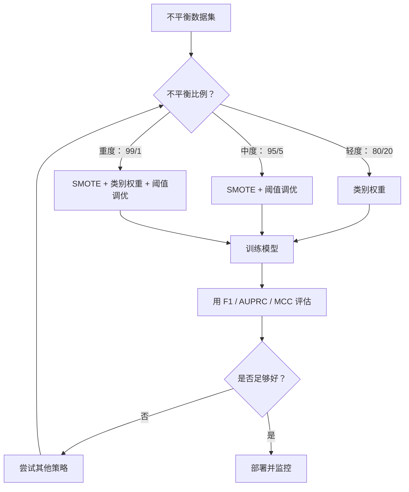
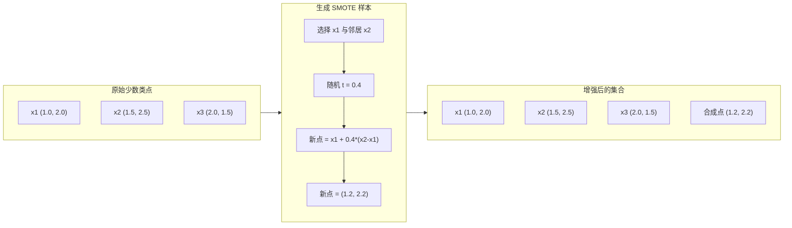
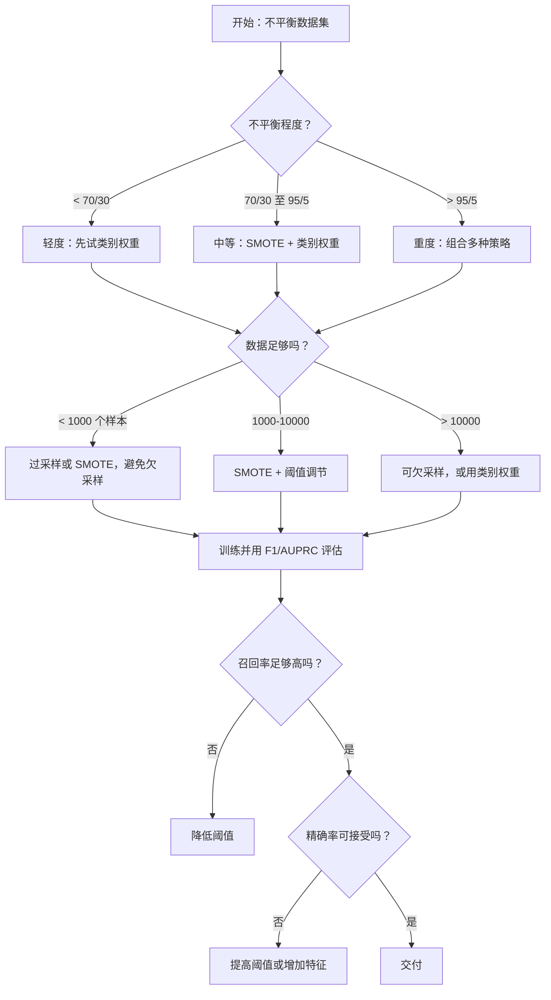

# 处理不平衡数据

> 当 99% 数据都是“正常”时，准确率是谎言。

**类型：** 构建  
**学习实现：** Python  
**前置课程：** Phase 2 第 01–09 课（尤其是评估指标）  
**预计时间：** 约 90 分钟

## 学习目标

- 从零实现 SMOTE，解释合成过采样与随机复制的差异。
- 用 F1、AUPRC、Matthews Correlation Coefficient 而非准确率评估不平衡分类器。
- 比较类别权重、阈值调优和重采样策略，并按不平衡比例选择方案。
- 构建组合 SMOTE、类别权重和阈值优化的完整不平衡数据管道。

## 问题

你建立欺诈检测模型，准确率 99.9%，却发现它对每笔交易都预测“非欺诈”。这不是 bug：只有 0.1% 交易欺诈时，永远猜多数类确实最小化总体错误，却毫无用处。

这存在于真实分类的所有重要场景：疾病阳性 1%、入侵攻击 0.01%、制造缺陷 0.5%、垃圾邮件 20%、流失 5%。少数类越重要，往往越罕见。

准确率平等对待所有正确预测：识别合法交易和识别欺诈同样算一分，但捕获欺诈才是模型存在的原因。需要指标、技术和训练策略迫使模型关注稀少却重要的类。

## 概念

### 准确率为何失效

假设 1000 样本：990 负、10 正。永远预测负的模型：

|  | 预测正 | 预测负 |
|--|---|---|
| 实际正 | 0（TP） | 10（FN） |
| 实际负 | 0（FP） | 990（TN） |

准确率 = (0 + 990) / 1000 = 99.0%。它捕获零欺诈、零疾病、零缺陷，却显示 99%，这正是不平衡问题中准确率危险的原因。

### 更好的指标 <!-- learning-atlas: better-metrics -->

**Precision** = TP / (TP + FP)：所有标为正的对象中有多少真是正，precision 高表示误报少。

**Recall** = TP / (TP + FN)：所有实际正中捕获多少，recall 高表示漏报少。

**F1** = 2 * precision * recall / (precision + recall)：调和平均，比算术平均更惩罚 precision/recall 极端失衡。

**F-beta** = (1 + beta^2) * precision * recall / (beta^2 * precision + recall)：beta > 1 时 recall 更重要，beta < 1 时 precision 更重要；欺诈中常用 F2（漏欺诈比误报更坏）。

**AUPRC**：precision-recall 曲线下面积，类似 AUC-ROC 但对不平衡更有信息；随机分类器的 AUPRC 等于正类比例（不是 ROC 的 0.5），更容易看出改进。

**Matthews Correlation Coefficient** = (TP * TN - FP * FN) / sqrt((TP+FP)(TP+FN)(TN+FP)(TN+FN))，范围 -1 到 +1，只有两类都做好才高；上述永远预测负模型的 precision 通常设 0、recall=0、F1=0、MCC=0，正确判为无价值。

### 不平衡数据管道



### SMOTE：合成少数类过采样技术

随机过采样重复现有少数样本，可能因反复看到相同点过拟合。SMOTE 创建合理但非复制的合成少数点，算法如下：

1. 对每个少数类样本 x，找到其他少数类样本中的 k 个最近邻。
2. 随机选择一个邻居。
3. 在 x 与该邻居之间的线段上创建一个新样本。

公式为 `new_sample = x + random(0, 1) * (neighbor - x)`。它在少数类特征空间区域插值。



### 采样策略比较

**随机过采样：** 复制少数类样本，使其数量与多数类相当。

- 优点：简单；不丢失信息。
- 缺点：精确副本会导致过拟合；增加训练时间。

**随机欠采样：** 移除多数类样本，使其数量与少数类相当。

- 优点：训练快；简单。
- 缺点：丢掉潜在有用的多数类数据；方差更高。

**SMOTE：** 通过插值创建合成少数类样本。

- 优点：生成新数据点；比随机过采样更不易过拟合。
- 缺点：可能在决策边界附近创建噪声样本；不考虑多数类分布。

| 策略 | 改变的数据 | 风险 | 使用时机 |
|----------|-------------|------|-------------|
| 过采样 | 复制少数类 | 过拟合 | 小数据集、中等不平衡 |
| 欠采样 | 移除多数类 | 信息丢失 | 大数据集、想快速训练 |
| SMOTE | 添加合成少数类 | 边界噪声 | 中等不平衡、少数类足以 k-NN |

### 类别权重

不改变数据，而改变模型如何对待错误：误分类少数类权重更高。二元问题中有 950 个负样本、50 个正样本时：

- 负类权重 = n_samples / (2 * n_negative) = 1000 / (2 * 950) = 0.526。
- 正类权重 = n_samples / (2 * n_positive) = 1000 / (2 * 50) = 10.0。

正类权重为 19 倍，错一个正样本与错 19 个负样本代价相同，模型被迫关注少数类。

逻辑回归中这修改损失：

```
weighted_loss = -sum(w_i * [y_i * log(p_i) + (1-y_i) * log(1-p_i)])
```

其中 w_i 依样本 i 类别而定。类别权重在期望意义上与过采样数学等价，却不产生新点，因此更快并避免重复样本过拟合。

### 阈值调优

多数分类器输出概率，默认阈值 0.5（P(positive) >= 0.5 即正），但它是任意的；类别不平衡时最优阈值通常更低。

流程如下：

1. 训练模型。
2. 在验证集上得到预测概率。
3. 将阈值从 0.0 扫描到 1.0。
4. 在每个阈值计算 F1（或你选择的指标）。
5. 选择使该指标最大的阈值。


欺诈交易 P(fraud)=0.15 时，0.5 阈值判非欺诈，而 0.10 能捕获。校准不如排序重要：只要欺诈概率高于非欺诈，总有分开的阈值。

### 成本敏感学习

类别权重的推广：为不同误分类指定具体成本。

|  | 预测正 | 预测负 |
|--|---|---|
| 实际正 | 0（正确） | C_FN = 100 |
| 实际负 | C_FP = 1 | 0（正确） |

漏一笔欺诈（FN）成本是一次误报（FP）的 100 倍，模型优化总成本而非错误计数。能估计真实成本时这是最有原则的方法；漏癌症与一次额外活检的代价完全不同，显式成本会迫使正确权衡。

### 决策流程图



```figure
class-imbalance
```

## 动手实现

### 步骤 1：生成不平衡数据集

```python
import numpy as np


def make_imbalanced_data(n_majority=950, n_minority=50, seed=42):
    rng = np.random.RandomState(seed)

    X_maj = rng.randn(n_majority, 2) * 1.0 + np.array([0.0, 0.0])
    X_min = rng.randn(n_minority, 2) * 0.8 + np.array([2.5, 2.5])

    X = np.vstack([X_maj, X_min])
    y = np.concatenate([np.zeros(n_majority), np.ones(n_minority)])

    shuffle_idx = rng.permutation(len(y))
    return X[shuffle_idx], y[shuffle_idx]
```

### 步骤 2：从零实现 SMOTE

```python
def euclidean_distance(a, b):
    return np.sqrt(np.sum((a - b) ** 2))


def find_k_neighbors(X, idx, k):
    distances = []
    for i in range(len(X)):
        if i == idx:
            continue
        d = euclidean_distance(X[idx], X[i])
        distances.append((i, d))
    distances.sort(key=lambda x: x[1])
    return [d[0] for d in distances[:k]]


def smote(X_minority, k=5, n_synthetic=100, seed=42):
    rng = np.random.RandomState(seed)
    n_samples = len(X_minority)
    k = min(k, n_samples - 1)
    synthetic = []

    for _ in range(n_synthetic):
        idx = rng.randint(0, n_samples)
        neighbors = find_k_neighbors(X_minority, idx, k)
        neighbor_idx = neighbors[rng.randint(0, len(neighbors))]
        t = rng.random()
        new_point = X_minority[idx] + t * (X_minority[neighbor_idx] - X_minority[idx])
        synthetic.append(new_point)

    return np.array(synthetic)
```

### 步骤 3：随机过采样与欠采样

```python
def random_oversample(X, y, seed=42):
    rng = np.random.RandomState(seed)
    classes, counts = np.unique(y, return_counts=True)
    max_count = counts.max()

    X_resampled = list(X)
    y_resampled = list(y)

    for cls, count in zip(classes, counts):
        if count < max_count:
            cls_indices = np.where(y == cls)[0]
            n_needed = max_count - count
            chosen = rng.choice(cls_indices, size=n_needed, replace=True)
            X_resampled.extend(X[chosen])
            y_resampled.extend(y[chosen])

    X_out = np.array(X_resampled)
    y_out = np.array(y_resampled)
    shuffle = rng.permutation(len(y_out))
    return X_out[shuffle], y_out[shuffle]


def random_undersample(X, y, seed=42):
    rng = np.random.RandomState(seed)
    classes, counts = np.unique(y, return_counts=True)
    min_count = counts.min()

    X_resampled = []
    y_resampled = []

    for cls in classes:
        cls_indices = np.where(y == cls)[0]
        chosen = rng.choice(cls_indices, size=min_count, replace=False)
        X_resampled.extend(X[chosen])
        y_resampled.extend(y[chosen])

    X_out = np.array(X_resampled)
    y_out = np.array(y_resampled)
    shuffle = rng.permutation(len(y_out))
    return X_out[shuffle], y_out[shuffle]
```

### 步骤 4：带类别权重的逻辑回归

```python
def sigmoid(z):
    return 1.0 / (1.0 + np.exp(-np.clip(z, -500, 500)))


def logistic_regression_weighted(X, y, weights, lr=0.01, epochs=200):
    n_samples, n_features = X.shape
    w = np.zeros(n_features)
    b = 0.0

    for _ in range(epochs):
        z = X @ w + b
        pred = sigmoid(z)
        error = pred - y
        weighted_error = error * weights

        gradient_w = (X.T @ weighted_error) / n_samples
        gradient_b = np.mean(weighted_error)

        w -= lr * gradient_w
        b -= lr * gradient_b

    return w, b


def compute_class_weights(y):
    classes, counts = np.unique(y, return_counts=True)
    n_samples = len(y)
    n_classes = len(classes)
    weight_map = {}
    for cls, count in zip(classes, counts):
        weight_map[cls] = n_samples / (n_classes * count)
    return np.array([weight_map[yi] for yi in y])
```

### 步骤 5：阈值调优

```python
def find_optimal_threshold(y_true, y_probs, metric="f1"):
    best_threshold = 0.5
    best_score = -1.0

    for threshold in np.arange(0.05, 0.96, 0.01):
        y_pred = (y_probs >= threshold).astype(int)
        tp = np.sum((y_pred == 1) & (y_true == 1))
        fp = np.sum((y_pred == 1) & (y_true == 0))
        fn = np.sum((y_pred == 0) & (y_true == 1))

        if metric == "f1":
            precision = tp / (tp + fp) if (tp + fp) > 0 else 0.0
            recall = tp / (tp + fn) if (tp + fn) > 0 else 0.0
            score = 2 * precision * recall / (precision + recall) if (precision + recall) > 0 else 0.0
        elif metric == "recall":
            score = tp / (tp + fn) if (tp + fn) > 0 else 0.0
        elif metric == "precision":
            score = tp / (tp + fp) if (tp + fp) > 0 else 0.0

        if score > best_score:
            best_score = score
            best_threshold = threshold

    return best_threshold, best_score
```

### 步骤 6：评估函数

```python
def confusion_matrix_values(y_true, y_pred):
    tp = np.sum((y_pred == 1) & (y_true == 1))
    tn = np.sum((y_pred == 0) & (y_true == 0))
    fp = np.sum((y_pred == 1) & (y_true == 0))
    fn = np.sum((y_pred == 0) & (y_true == 1))
    return tp, tn, fp, fn


def compute_metrics(y_true, y_pred):
    tp, tn, fp, fn = confusion_matrix_values(y_true, y_pred)
    accuracy = (tp + tn) / (tp + tn + fp + fn)
    precision = tp / (tp + fp) if (tp + fp) > 0 else 0.0
    recall = tp / (tp + fn) if (tp + fn) > 0 else 0.0
    f1 = 2 * precision * recall / (precision + recall) if (precision + recall) > 0 else 0.0

    denom = np.sqrt(float((tp + fp) * (tp + fn) * (tn + fp) * (tn + fn)))
    mcc = (tp * tn - fp * fn) / denom if denom > 0 else 0.0

    return {
        "accuracy": accuracy,
        "precision": precision,
        "recall": recall,
        "f1": f1,
        "mcc": mcc,
    }
```

### 步骤 7：比较所有方法

```python
X, y = make_imbalanced_data(950, 50, seed=42)
split = int(0.8 * len(y))
X_train, X_test = X[:split], X[split:]
y_train, y_test = y[:split], y[split:]

# Baseline: no treatment
w_base, b_base = logistic_regression_weighted(
    X_train, y_train, np.ones(len(y_train)), lr=0.1, epochs=300
)
probs_base = sigmoid(X_test @ w_base + b_base)
preds_base = (probs_base >= 0.5).astype(int)

# Oversampled
X_over, y_over = random_oversample(X_train, y_train)
w_over, b_over = logistic_regression_weighted(
    X_over, y_over, np.ones(len(y_over)), lr=0.1, epochs=300
)
preds_over = (sigmoid(X_test @ w_over + b_over) >= 0.5).astype(int)

# SMOTE
minority_mask = y_train == 1
X_minority = X_train[minority_mask]
synthetic = smote(X_minority, k=5, n_synthetic=len(y_train) - 2 * int(minority_mask.sum()))
X_smote = np.vstack([X_train, synthetic])
y_smote = np.concatenate([y_train, np.ones(len(synthetic))])
w_sm, b_sm = logistic_regression_weighted(
    X_smote, y_smote, np.ones(len(y_smote)), lr=0.1, epochs=300
)
preds_smote = (sigmoid(X_test @ w_sm + b_sm) >= 0.5).astype(int)

# Class weights
sample_weights = compute_class_weights(y_train)
w_cw, b_cw = logistic_regression_weighted(
    X_train, y_train, sample_weights, lr=0.1, epochs=300
)
probs_cw = sigmoid(X_test @ w_cw + b_cw)
preds_cw = (probs_cw >= 0.5).astype(int)

# Threshold tuning (tune on held-out validation set, not test set)
probs_val = sigmoid(X_val @ w_cw + b_cw)
best_thresh, best_f1 = find_optimal_threshold(y_val, probs_val, metric="f1")
preds_thresh = (probs_cw >= best_thresh).astype(int)
```

代码文件会在单个脚本中运行这些内容并打印结果。

## 使用现成工具

使用 scikit-learn 与 imbalanced-learn，这些技术是一行调用：

```python
from sklearn.linear_model import LogisticRegression
from sklearn.metrics import classification_report, f1_score
from sklearn.model_selection import train_test_split
from imblearn.over_sampling import SMOTE
from imblearn.under_sampling import RandomUnderSampler
from imblearn.pipeline import Pipeline

X_train, X_test, y_train, y_test = train_test_split(X, y, stratify=y)

model_weighted = LogisticRegression(class_weight="balanced")
model_weighted.fit(X_train, y_train)
print(classification_report(y_test, model_weighted.predict(X_test)))

smote = SMOTE(random_state=42)
X_resampled, y_resampled = smote.fit_resample(X_train, y_train)
model_smote = LogisticRegression()
model_smote.fit(X_resampled, y_resampled)
print(classification_report(y_test, model_smote.predict(X_test)))

pipeline = Pipeline([
    ("smote", SMOTE()),
    ("model", LogisticRegression(class_weight="balanced")),
])
pipeline.fit(X_train, y_train)
print(classification_report(y_test, pipeline.predict(X_test)))
```

从零实现展示每项技术具体做什么：SMOTE 是少数类上的 k-NN 插值，类别权重乘损失，阈值调优是遍历切点的循环，并无魔法。

## 交付成果

本课产出：

- `outputs/skill-imbalanced-data.md`——处理不平衡分类问题的决策清单。

## 练习

1. **Borderline-SMOTE：** 仅为靠近决策边界的少数点生成合成样本（其 k 近邻包含多数类样本），在类别重叠数据上与标准 SMOTE 比较。
2. **成本矩阵优化：** 实现成本敏感学习，将成本矩阵作为参数，返回最小化期望成本的预测；测试 1:10、1:100、1:1000 成本比并绘制 precision-recall 权衡变化。
3. **阈值校准：** 实现 Platt scaling（对模型原始输出拟合逻辑回归以产出校准概率），比较校准前后 PR 曲线；证明校准不改变排序（AUC 不变）但使概率更有意义。
4. **带平衡 bagging 的集成：** 训练多个模型，每个用平衡 bootstrap 样本（所有少数类 + 多数类随机子集），平均预测；与单个 SMOTE 模型比较性能和跨运行方差。
5. **不平衡比例实验：** 将平衡数据集逐步变为 50/50、70/30、90/10、95/5、99/1；每种比例有无 SMOTE 都训练，绘制二者 F1 对比例曲线；SMOTE 从哪个比例开始显著有用？

## 核心术语

| 术语 | 常见说法 | 实际含义 |
|------|----------------|----------------------|
| 类别不平衡 | “一个类样本多得多” | 数据集类别分布严重偏斜，导致模型偏向多数类。 |
| SMOTE | “合成过采样” | 在现有少数样本与其 k 个最近少数邻居之间插值创建新少数样本。 |
| 类别权重 | “让罕见类的错误更昂贵” | 对损失乘类别特异权重，使模型对少数类误分类惩罚更重。 |
| 阈值调优 | “移动决策边界” | 将分类概率切点从默认 0.5 改为优化目标指标的值。 |
| Precision-recall 权衡 | “二者不可兼得” | 降低阈值捕获更多正类（更高 recall），也标记更多假正（更低 precision），反之亦然。 |
| AUPRC | “PR 曲线下面积” | 将 PR 曲线压缩为单个数，重不平衡时比 AUC-ROC 信息更多。 |
| Matthews Correlation Coefficient | “平衡指标” | 预测和真实标签的相关；只有两类都表现好才给高分。 |
| 成本敏感学习 | “不同错误成本不同” | 将真实误分类成本纳入训练目标，优化总成本而非错误数。 |
| 随机过采样 | “复制少数类” | 重复少数类样本以平衡数量，简单但可能对重复点过拟合。 |

## 延伸阅读

- [SMOTE: Synthetic Minority Over-sampling Technique（Chawla 等，2002）](https://arxiv.org/abs/1106.1813)——原始 SMOTE 论文，也是最常被引用的不平衡学习工作。
- [Learning from Imbalanced Data（He 与 Garcia，2009）](https://ieeexplore.ieee.org/document/5128907)——涵盖采样、成本敏感和算法方法的综合综述。
- [imbalanced-learn documentation](https://imbalanced-learn.org/stable/)——含 SMOTE 变体、欠采样策略和管道整合的 Python 库。
- [The Precision-Recall Plot Is More Informative than the ROC Plot（Saito 与 Rehmsmeier，2015）](https://journals.plos.org/plosone/article?id=10.1371/journal.pone.0118432)——不平衡问题何时、为何应偏好 PR 曲线。
