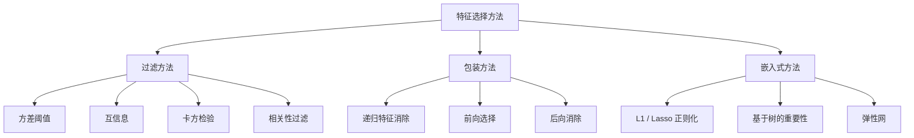
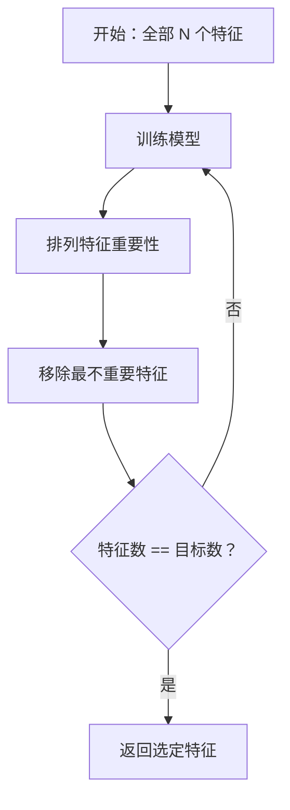
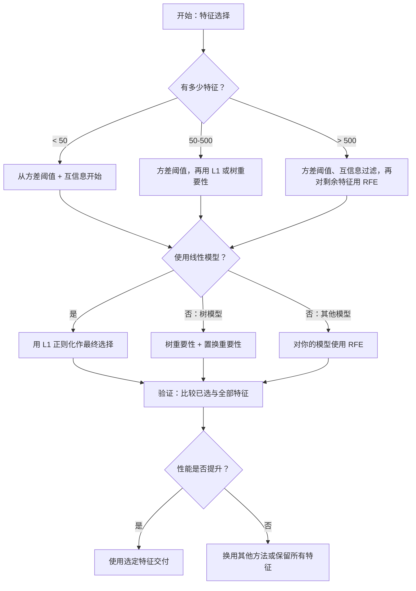

# 特征选择

> 特征更多不等于更好；正确的特征才更好。

**类型：** 构建  
**学习实现：** Python  
**前置课程：** Phase 2 第 01–09 课、第 08 课（特征工程）  
**预计时间：** 约 75 分钟

## 学习目标

- 从零实现筛选法（方差阈值、互信息、卡方）和包装法（RFE、前向选择）。
- 解释互信息为何能捕捉相关性遗漏的非线性特征—目标关系。
- 比较 L1 正则化（嵌入式选择）与 RFE（包装选择）及计算权衡。
- 构建组合多个方法的特征选择管道，并展示在留出数据上更好的泛化。

## 问题

你有 500 个特征，模型训练慢、不断过拟合且无人能解释它学到什么；继续加特征，希望改善，结果更差。

这是维数灾难：特征数增长，特征空间体积爆炸，数据点变稀疏、点间距离收敛，模型需指数更多数据才找得到真实模式；噪声特征淹没信号，过拟合成为默认。

特征选择通过去除噪声和冗余，只保留包含目标信息的特征，从而加快训练、改善泛化并提高模型可解释性。目标是筛出有用信息，而不是用尽所有可用特征。

## 概念

### 三类特征选择

所有方法都属于三类之一：



**筛选法**用统计量独立评分每个特征，不使用模型，速度快但会漏掉特征交互。

**包装法**训练模型评估特征子集，以模型性能为分数，结果更好但昂贵，因为需反复重训。

**嵌入式方法**在训练中选择特征：L1 将权重压至零，树按最有用特征切分；选择发生在拟合中，而非独立步骤。

### 方差阈值

最简单的筛选器：一个特征在样本间几乎不变，就几乎不含信息。1000 个样本中有 999 个为 0.0 的特征方差近零，任何模型无法用其区分类别，应移除。

```
variance(x) = mean((x - mean(x))^2)
```

设阈值（如 0.01），丢弃低于阈值的特征；无需查看目标，可作为其他方法之前的近零成本预处理。局限是高方差特征仍可能纯噪声，方差阈值必要但不充分。

### 互信息 <!-- learning-atlas: mutual-information -->

互信息衡量知道 X 的值使目标 Y 不确定性减少多少：

```
I(X; Y) = sum_x sum_y p(x, y) * log(p(x, y) / (p(x) * p(y)))
```

若 X、Y 独立，p(x,y)=p(x)*p(y)，对数项为零、I(X;Y)=0；X 对 Y 信息越多，互信息越高。

相对相关系数的优势是捕捉非线性关系：特征可能和目标零相关，却因二次或周期关系有高互信息。连续特征需先分箱估计；箱数过少丢信息、过多加噪声，常用 sqrt(n) 或 Sturges 规则（1 + log2(n)）。


### 递归特征消除（RFE）

RFE 是包装法，用模型自身特征重要性迭代剪枝：

1. 以所有特征训练模型。
2. 按重要性排序（线性模型系数、树的 impurity reduction）。
3. 删除最不重要特征。
4. 重复至目标特征数。



模型同时看到所有剩余特征，因此移除一个会改变其他的重要性、能够考虑交互，比筛选法更彻底。代价是训练 N - target 次：500 特征选 10 需要 490 次训练；可每步删多个（如底部 10%）加速。

### L1（Lasso）正则化

L1 在损失中加入权重绝对值：

```
loss = prediction_error + alpha * sum(|w_i|)
```

alpha 控制剪枝强度，越高越多权重变成精确零。L1 在权重空间形成菱形约束，最优解常落在角上（一些权重为零）；L2/Ridge 是圆形约束，权重收缩却很少为零。

这是嵌入式选择：模型训练中学会忽略哪些特征，零权重即被移除。优点是只需一次训练、处理相关特征（保留一个、其他置零）、多数线性模型内置；局限是仅在线性模型中工作，无法表示非线性重要性。

### 基于树的特征重要性

决策树及其集成自然排序特征：每次切分都降低 impurity（分类的 Gini/entropy、回归的方差），降得多的更重要。随机森林 T 棵树时：

```
importance(feature_j) = (1/T) * sum over all trees of
    sum over all nodes splitting on feature_j of
        (n_samples * impurity_decrease)
```

它给出每个特征归一化重要分数，能自动处理非线性与交互。注意它偏向高基数特征：随机 ID 列可因完美切分每样本而显得重要，应用 permutation importance 做 sanity check。

### 置换重要性

模型无关方法：

1. 训练模型，并记录其在验证数据上的基线性能。
2. 对每个特征，随机打乱其取值，测量性能下降。
3. 性能下降越大，该特征越重要。

打乱一个特征不伤性能，说明模型不依赖它；性能崩溃则说明该特征关键。它避免树重要性的基数偏差，但慢：每个特征至少要完整评估一次，常重复多次求稳定。

### 对比表

| 方法 | 类型 | 速度 | 非线性 | 特征交互 |
|--------|------|-------|-----------|---------------------|
| 方差阈值 | 筛选 | 极快 | 否 | 否 |
| 互信息 | 筛选 | 快 | 是 | 否 |
| 相关性筛选 | 筛选 | 快 | 否 | 否 |
| RFE | 包装 | 慢 | 取决于模型 | 是 |
| L1 / Lasso | 嵌入 | 快 | 否（线性） | 否 |
| Tree importance | 嵌入 | 中 | 是 | 是 |
| Permutation importance | 模型无关 | 慢 | 是 | 是 |

### 决策流程图



```figure
f3-feature-prune
```

## 动手实现

### 步骤 1：生成已知特征结构的合成数据

```python
import numpy as np


def make_feature_selection_data(n_samples=500, seed=42):
    rng = np.random.RandomState(seed)

    x1 = rng.randn(n_samples)
    x2 = rng.randn(n_samples)
    x3 = rng.randn(n_samples)
    x4 = x1 + 0.1 * rng.randn(n_samples)
    x5 = x2 + 0.1 * rng.randn(n_samples)

    informative = np.column_stack([x1, x2, x3, x4, x5])

    correlated = np.column_stack([
        x1 * 0.9 + 0.1 * rng.randn(n_samples),
        x2 * 0.8 + 0.2 * rng.randn(n_samples),
        x3 * 0.7 + 0.3 * rng.randn(n_samples),
        x1 * 0.5 + x2 * 0.5 + 0.1 * rng.randn(n_samples),
        x2 * 0.6 + x3 * 0.4 + 0.1 * rng.randn(n_samples),
    ])

    noise = rng.randn(n_samples, 10) * 0.5

    X = np.hstack([informative, correlated, noise])
    y = (2 * x1 - 1.5 * x2 + x3 + 0.5 * rng.randn(n_samples) > 0).astype(int)

    feature_names = (
        [f"info_{i}" for i in range(5)]
        + [f"corr_{i}" for i in range(5)]
        + [f"noise_{i}" for i in range(10)]
    )

    return X, y, feature_names
```

已知事实：特征 0–4 有信息（3、4 是 0、1 的相关副本），5–9 与信息特征相关，10–19 为纯噪声。好方法应将 0–4 排最高、10–19 最低。

### 步骤 2：方差阈值

```python
def variance_threshold(X, threshold=0.01):
    variances = np.var(X, axis=0)
    mask = variances > threshold
    return mask, variances
```

### 步骤 3：互信息（离散）

```python
def discretize(x, n_bins=10):
    min_val, max_val = x.min(), x.max()
    if max_val == min_val:
        return np.zeros_like(x, dtype=int)
    bin_edges = np.linspace(min_val, max_val, n_bins + 1)
    binned = np.digitize(x, bin_edges[1:-1])
    return binned


def mutual_information(X, y, n_bins=10):
    n_samples, n_features = X.shape
    mi_scores = np.zeros(n_features)

    y_vals, y_counts = np.unique(y, return_counts=True)
    p_y = y_counts / n_samples

    for f in range(n_features):
        x_binned = discretize(X[:, f], n_bins)
        x_vals, x_counts = np.unique(x_binned, return_counts=True)
        p_x = dict(zip(x_vals, x_counts / n_samples))

        mi = 0.0
        for xv in x_vals:
            for yi, yv in enumerate(y_vals):
                joint_mask = (x_binned == xv) & (y == yv)
                p_xy = np.sum(joint_mask) / n_samples
                if p_xy > 0:
                    mi += p_xy * np.log(p_xy / (p_x[xv] * p_y[yi]))
        mi_scores[f] = mi

    return mi_scores
```

### 步骤 4：递归特征消除

```python
def simple_logistic_importance(X, y, lr=0.1, epochs=100):
    n_samples, n_features = X.shape
    w = np.zeros(n_features)
    b = 0.0

    for _ in range(epochs):
        z = X @ w + b
        pred = 1.0 / (1.0 + np.exp(-np.clip(z, -500, 500)))
        error = pred - y
        w -= lr * (X.T @ error) / n_samples
        b -= lr * np.mean(error)

    return w, b


def rfe(X, y, n_features_to_select=5, lr=0.1, epochs=100):
    n_total = X.shape[1]
    remaining = list(range(n_total))
    rankings = np.ones(n_total, dtype=int)
    rank = n_total

    while len(remaining) > n_features_to_select:
        X_subset = X[:, remaining]
        w, _ = simple_logistic_importance(X_subset, y, lr, epochs)
        importances = np.abs(w)

        least_idx = np.argmin(importances)
        original_idx = remaining[least_idx]
        rankings[original_idx] = rank
        rank -= 1
        remaining.pop(least_idx)

    for idx in remaining:
        rankings[idx] = 1

    selected_mask = rankings == 1
    return selected_mask, rankings
```

### 步骤 5：L1 特征选择

```python
def soft_threshold(w, alpha):
    return np.sign(w) * np.maximum(np.abs(w) - alpha, 0)


def l1_feature_selection(X, y, alpha=0.1, lr=0.01, epochs=500):
    n_samples, n_features = X.shape
    w = np.zeros(n_features)
    b = 0.0

    for _ in range(epochs):
        z = X @ w + b
        pred = 1.0 / (1.0 + np.exp(-np.clip(z, -500, 500)))
        error = pred - y

        gradient_w = (X.T @ error) / n_samples
        gradient_b = np.mean(error)

        w -= lr * gradient_w
        w = soft_threshold(w, lr * alpha)
        b -= lr * gradient_b

    selected_mask = np.abs(w) > 1e-6
    return selected_mask, w
```

### 步骤 6：基于树的重要性（简单决策树）

```python
def gini_impurity(y):
    if len(y) == 0:
        return 0.0
    classes, counts = np.unique(y, return_counts=True)
    probs = counts / len(y)
    return 1.0 - np.sum(probs ** 2)


def best_split(X, y, feature_idx):
    values = np.unique(X[:, feature_idx])
    if len(values) <= 1:
        return None, -1.0

    best_threshold = None
    best_gain = -1.0
    parent_gini = gini_impurity(y)
    n = len(y)

    for i in range(len(values) - 1):
        threshold = (values[i] + values[i + 1]) / 2.0
        left_mask = X[:, feature_idx] <= threshold
        right_mask = ~left_mask

        n_left = np.sum(left_mask)
        n_right = np.sum(right_mask)

        if n_left == 0 or n_right == 0:
            continue

        gain = parent_gini - (n_left / n) * gini_impurity(y[left_mask]) - (n_right / n) * gini_impurity(y[right_mask])

        if gain > best_gain:
            best_gain = gain
            best_threshold = threshold

    return best_threshold, best_gain


def tree_importance(X, y, n_trees=50, max_depth=5, seed=42):
    rng = np.random.RandomState(seed)
    n_samples, n_features = X.shape
    importances = np.zeros(n_features)

    for _ in range(n_trees):
        sample_idx = rng.choice(n_samples, size=n_samples, replace=True)
        feature_subset = rng.choice(n_features, size=max(1, int(np.sqrt(n_features))), replace=False)

        X_boot = X[sample_idx]
        y_boot = y[sample_idx]

        tree_imp = _build_tree_importance(X_boot, y_boot, feature_subset, max_depth)
        importances += tree_imp

    total = importances.sum()
    if total > 0:
        importances /= total

    return importances


def _build_tree_importance(X, y, feature_subset, max_depth, depth=0):
    n_features = X.shape[1]
    importances = np.zeros(n_features)

    if depth >= max_depth or len(np.unique(y)) <= 1 or len(y) < 4:
        return importances

    best_feature = None
    best_threshold = None
    best_gain = -1.0

    for f in feature_subset:
        threshold, gain = best_split(X, y, f)
        if gain > best_gain:
            best_gain = gain
            best_feature = f
            best_threshold = threshold

    if best_feature is None or best_gain <= 0:
        return importances

    importances[best_feature] += best_gain * len(y)

    left_mask = X[:, best_feature] <= best_threshold
    right_mask = ~left_mask

    importances += _build_tree_importance(X[left_mask], y[left_mask], feature_subset, max_depth, depth + 1)
    importances += _build_tree_importance(X[right_mask], y[right_mask], feature_subset, max_depth, depth + 1)

    return importances
```

### 步骤 7：运行全部方法并比较

代码文件在同一合成数据集运行五种方法，打印各方法选择的特征对比表。

## 使用现成工具

sklearn 已将特征选择整合入管道：

```python
from sklearn.feature_selection import (
    VarianceThreshold,
    mutual_info_classif,
    RFE,
    SelectFromModel,
)
from sklearn.linear_model import Lasso, LogisticRegression
from sklearn.ensemble import RandomForestClassifier

vt = VarianceThreshold(threshold=0.01)
X_filtered = vt.fit_transform(X)

mi_scores = mutual_info_classif(X, y)
top_k = np.argsort(mi_scores)[-10:]

rfe_selector = RFE(LogisticRegression(), n_features_to_select=10)
rfe_selector.fit(X, y)
X_rfe = rfe_selector.transform(X)

lasso_selector = SelectFromModel(Lasso(alpha=0.01))
lasso_selector.fit(X, y)
X_lasso = lasso_selector.transform(X)

rf = RandomForestClassifier(n_estimators=100)
rf.fit(X, y)
importances = rf.feature_importances_
```

从零实现展示每个方法内部：方差阈值是计算 `var(X, axis=0)` 并加 mask；互信息是在列联表中计联合/边缘频率；RFE 是训练、排序、剪枝循环；L1 是带软阈值步骤的梯度下降；树重要性是跨切分累计 impurity reduction。没有魔法，只有统计和循环。

sklearn 版本更稳健（如 `mutual_info_classif` 使用 k-NN 密度估计而非分箱）、更快（C 实现）并能整合管道。

## 交付成果

本课产出：

- `outputs/skill-feature-selector.md`——快速选择合适特征选择方法的决策树。

## 练习

1. **前向选择：** 实现 RFE 相反方法：从零特征开始，每步加入改善性能最多的特征，新增不再有帮助时停止；与 RFE 比较选择、速度和结果。
2. **稳定选择：** 在随机 80% 子样本、略不同 alpha 上运行 L1 50 次，统计每特征选中频率；超过 80% 为“稳定”，与单次 L1 比较，哪个更可靠？
3. **多重共线性检测：** 计算相关矩阵，实现函数：高于 0.9 的相关特征对中移除一个，保留和目标互信息更高者；在合成数据验证冗余相关特征被移除。
4. **特征选择管道：** 串联方差阈值、互信息筛选和 RFE：先去近零方差，再保留互信息前 50%，最后对幸存者 RFE；与全特征 RFE 比较速度和准确率。
5. **从零置换重要性：** 每个特征打乱 10 次，测 F1 平均下降；与树重要性排名比较，找到不一致情形并解释（提示：相关特征）。

## 核心术语

| 术语 | 常见说法 | 实际含义 |
|------|----------------|----------------------|
| 筛选法 | “独立给特征评分” | 无需训练模型、用统计量隔离评估和排序特征的方法。 |
| 包装法 | “用模型挑特征” | 训练模型并以性能为选择标准评估特征子集的方法。 |
| 嵌入式方法 | “模型训练中选特征” | 选择作为拟合一部分发生，如 L1 将权重推至零。 |
| 互信息 | “一个变量告诉另一个多少” | 已知 X 后 Y 不确定性降低量，能捕捉线性和非线性依赖。 |
| 递归特征消除 | “训练、排序、剪枝、重复” | 迭代包装法，训练模型、移除最不重要特征直到目标数量。 |
| L1 / Lasso 正则化 | “杀死特征的惩罚” | 向损失加入绝对权重和，使不重要特征权重精确为零。 |
| 方差阈值 | “移除常数特征” | 丢弃样本间方差低于阈值、无信息的特征。 |
| 特征重要性 | “哪些特征最重要” | 特征对预测贡献的分数，来自树切分增益或线性系数幅度。 |
| 置换重要性 | “打乱并测损失” | 随机打乱每个特征的值、测模型性能下降以评估重要性。 |
| 维数灾难 | “特征太多、数据太少” | 加特征使空间体积指数增长，数据稀疏且距离失去意义的现象。 |

## 延伸阅读

- [An Introduction to Variable and Feature Selection（Guyon 与 Elisseeff，2003）](https://jmlr.org/papers/v3/guyon03a.html)——特征选择方法的奠基综述。
- [scikit-learn Feature Selection Guide](https://scikit-learn.org/stable/modules/feature_selection.html)——筛选、包装、嵌入式方法的实用参考。
- [Stability Selection（Meinshausen 与 Buhlmann，2010）](https://arxiv.org/abs/0809.2932)——以子采样结合特征选择，获得稳健可复现结果。
- [Beware Default Random Forest Importances（Strobl 等，2007）](https://bmcbioinformatics.biomedcentral.com/articles/10.1186/1471-2105-8-25)——展示树重要性的基数偏差并提出条件重要性。
