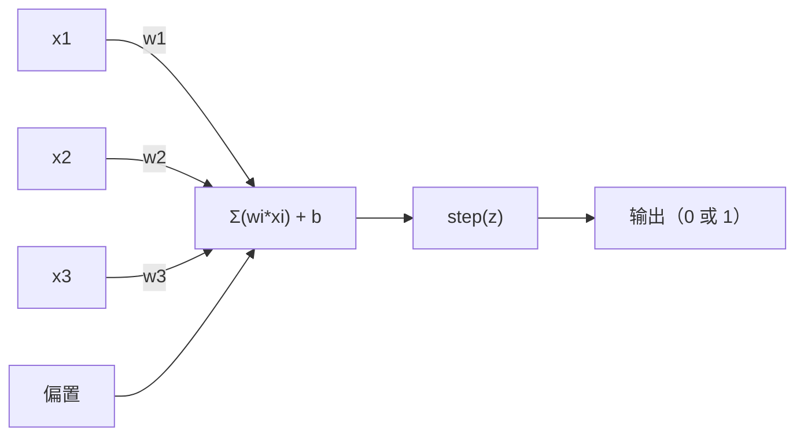
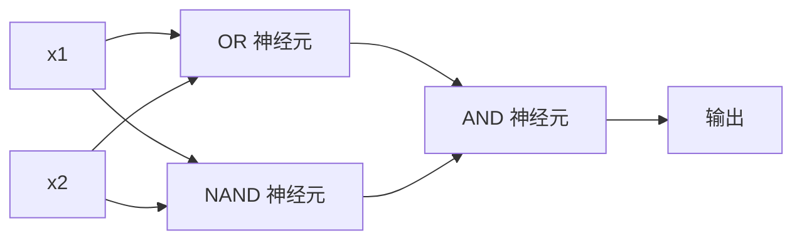

# 感知机

> 感知机是神经网络的原子。把它拆开，只有权重、偏置和一个决定。

**类型：** 构建  
**学习实现：** Python  
**前置课程：** Phase 1（线性代数直觉）  
**预计时间：** 约 60 分钟

## 学习目标

- 从零用 Python 实现感知机，包括权重更新规则与阶跃激活函数。
- 解释单个感知机为何只能解决线性可分问题，并展示 XOR 失败情形。
- 通过组合 OR、NAND、AND 门构建多层感知机以解决 XOR。
- 用 sigmoid 激活与反向传播训练两层网络，自动学会 XOR。

## 问题

你知道向量与点积，也知道矩阵将输入变换为输出。但机器如何**学习**应使用哪一种变换？

感知机给出答案。它是最简单的学习机器：接收输入、乘权重、加偏置、作二元决定，然后调整，仅此而已。每一个神经网络都是把这个想法层层堆叠。

理解感知机就是理解代码中的“学习”：不断调整数字，直到输出匹配现实。

## 概念

### 一个神经元，一个决定

感知机接收 n 个输入，每个乘一个权重、求和、加偏置，再通过激活函数。



阶跃函数很直接：加权和加偏置 >= 0 时输出 1，否则输出 0。

```
step(z) = 1  if z >= 0
           0  if z < 0
```

这是线性分类器。权重和偏置定义一条直线（高维中为超平面），将输入空间分为两个区域。

### 决策边界 <!-- learning-atlas: the-decision-boundary -->

对两个输入，感知机在二维空间画一条线：

```
  x2
  ┤
  │  Class 1        /
  │    (0)          /
  │                /
  │               / w1·x1 + w2·x2 + b = 0
  │              /
  │             /     Class 2
  │            /        (1)
  ┼───────────/──────────── x1
```

直线一侧全部输出 0，另一侧输出 1。训练移动此线，直到正确分开类别。

### 学习规则

感知机学习规则很简单：

```
For each training example (x, y_true):
    y_pred = predict(x)
    error = y_true - y_pred

    For each weight:
        w_i = w_i + learning_rate * error * x_i
    bias = bias + learning_rate * error
```

预测正确时 error=0，什么都不变；预测 0 而应为 1 时权重增加；预测 1 而应为 0 时权重降低。学习率控制每次调整的大小。

### XOR 问题

问题从这里开始。逻辑门如下：

```
AND gate:           OR gate:            XOR gate:
x1  x2  out         x1  x2  out         x1  x2  out
0   0   0           0   0   0           0   0   0
0   1   0           0   1   1           0   1   1
1   0   0           1   0   1           1   0   1
1   1   1           1   1   1           1   1   0
```

AND、OR 线性可分，一条线可分开 0 与 1；XOR 不可分，任何单线都无法将 `[0,1]`、`[1,0]` 与 `[0,0]`、`[1,1]` 分离。

```
AND (separable):        XOR (not separable):

  x2                      x2
  1 ┤  0     1            1 ┤  1     0
    │     /                 │
  0 ┤  0 / 0              0 ┤  0     1
    ┼──/──────── x1         ┼──────────── x1
       line works!          no single line works!
```

这是根本限制：单个感知机只可解决线性可分问题。Minsky 与 Papert 于 1969 年证明它，几乎令神经网络研究停滞十年。

解法是堆叠感知机成层；多层感知机将两个线性决定组合为非线性决定，可解 XOR。

```figure
perceptron-boundary
```

## 动手实现

### 步骤 1：Perceptron 类

```python
class Perceptron:
    def __init__(self, n_inputs, learning_rate=0.1):
        self.weights = [0.0] * n_inputs
        self.bias = 0.0
        self.lr = learning_rate

    def predict(self, inputs):
        total = sum(w * x for w, x in zip(self.weights, inputs))
        total += self.bias
        return 1 if total >= 0 else 0

    def train(self, training_data, epochs=100):
        for epoch in range(epochs):
            errors = 0
            for inputs, target in training_data:
                prediction = self.predict(inputs)
                error = target - prediction
                if error != 0:
                    errors += 1
                    for i in range(len(self.weights)):
                        self.weights[i] += self.lr * error * inputs[i]
                    self.bias += self.lr * error
            if errors == 0:
                print(f"Converged at epoch {epoch + 1}")
                return
        print(f"Did not converge after {epochs} epochs")
```

### 步骤 2：在逻辑门上训练

```python
and_data = [
    ([0, 0], 0),
    ([0, 1], 0),
    ([1, 0], 0),
    ([1, 1], 1),
]

or_data = [
    ([0, 0], 0),
    ([0, 1], 1),
    ([1, 0], 1),
    ([1, 1], 1),
]

not_data = [
    ([0], 1),
    ([1], 0),
]

print("=== AND Gate ===")
p_and = Perceptron(2)
p_and.train(and_data)
for inputs, _ in and_data:
    print(f"  {inputs} -> {p_and.predict(inputs)}")

print("\n=== OR Gate ===")
p_or = Perceptron(2)
p_or.train(or_data)
for inputs, _ in or_data:
    print(f"  {inputs} -> {p_or.predict(inputs)}")

print("\n=== NOT Gate ===")
p_not = Perceptron(1)
p_not.train(not_data)
for inputs, _ in not_data:
    print(f"  {inputs} -> {p_not.predict(inputs)}")
```

### 步骤 3：观察 XOR 失败

```python
xor_data = [
    ([0, 0], 0),
    ([0, 1], 1),
    ([1, 0], 1),
    ([1, 1], 0),
]

print("\n=== XOR Gate (single perceptron) ===")
p_xor = Perceptron(2)
p_xor.train(xor_data, epochs=1000)
for inputs, expected in xor_data:
    result = p_xor.predict(inputs)
    status = "OK" if result == expected else "WRONG"
    print(f"  {inputs} -> {result} (expected {expected}) {status}")
```

它永不收敛，这严格证明单一感知机学不会 XOR。

### 步骤 4：用两层解决 XOR

可以把 XOR 写成 `(x1 OR x2) AND NOT (x1 AND x2)`，再组合三个感知机：



```python
def xor_network(x1, x2):
    or_neuron = Perceptron(2)
    or_neuron.weights = [1.0, 1.0]
    or_neuron.bias = -0.5

    nand_neuron = Perceptron(2)
    nand_neuron.weights = [-1.0, -1.0]
    nand_neuron.bias = 1.5

    and_neuron = Perceptron(2)
    and_neuron.weights = [1.0, 1.0]
    and_neuron.bias = -1.5

    hidden1 = or_neuron.predict([x1, x2])
    hidden2 = nand_neuron.predict([x1, x2])
    output = and_neuron.predict([hidden1, hidden2])
    return output


print("\n=== XOR Gate (multi-layer network) ===")
for inputs, expected in xor_data:
    result = xor_network(inputs[0], inputs[1])
    print(f"  {inputs} -> {result} (expected {expected})")
```

四种输入都正确。把感知机堆成层，会产生单个感知机无法形成的决策边界。

### 步骤 5：训练两层网络

步骤 4 手工设定权重，只适用于 XOR；真实问题不知道正确权重。应把阶跃换成 sigmoid，通过反向传播自动学习权重。

```python
class TwoLayerNetwork:
    def __init__(self, learning_rate=0.5):
        import random
        random.seed(0)
        self.w_hidden = [[random.uniform(-1, 1), random.uniform(-1, 1)] for _ in range(2)]
        self.b_hidden = [random.uniform(-1, 1), random.uniform(-1, 1)]
        self.w_output = [random.uniform(-1, 1), random.uniform(-1, 1)]
        self.b_output = random.uniform(-1, 1)
        self.lr = learning_rate

    def sigmoid(self, x):
        import math
        x = max(-500, min(500, x))
        return 1.0 / (1.0 + math.exp(-x))

    def forward(self, inputs):
        self.inputs = inputs
        self.hidden_outputs = []
        for i in range(2):
            z = sum(w * x for w, x in zip(self.w_hidden[i], inputs)) + self.b_hidden[i]
            self.hidden_outputs.append(self.sigmoid(z))
        z_out = sum(w * h for w, h in zip(self.w_output, self.hidden_outputs)) + self.b_output
        self.output = self.sigmoid(z_out)
        return self.output

    def train(self, training_data, epochs=10000):
        for epoch in range(epochs):
            total_error = 0
            for inputs, target in training_data:
                output = self.forward(inputs)
                error = target - output
                total_error += error ** 2

                d_output = error * output * (1 - output)

                saved_w_output = self.w_output[:]
                hidden_deltas = []
                for i in range(2):
                    h = self.hidden_outputs[i]
                    hd = d_output * saved_w_output[i] * h * (1 - h)
                    hidden_deltas.append(hd)

                for i in range(2):
                    self.w_output[i] += self.lr * d_output * self.hidden_outputs[i]
                self.b_output += self.lr * d_output

                for i in range(2):
                    for j in range(len(inputs)):
                        self.w_hidden[i][j] += self.lr * hidden_deltas[i] * inputs[j]
                    self.b_hidden[i] += self.lr * hidden_deltas[i]
```

```python
net = TwoLayerNetwork(learning_rate=2.0)
net.train(xor_data, epochs=10000)
for inputs, expected in xor_data:
    result = net.forward(inputs)
    predicted = 1 if result >= 0.5 else 0
    print(f"  {inputs} -> {result:.4f} (rounded: {predicted}, expected {expected})")
```

与步骤 4 有两处关键不同：sigmoid 取代阶跃，它平滑且存在梯度；`train` 从输出层向隐藏层反传误差，按每个权重对误差的贡献调整。20 行代码由此实现了反向传播。

这通向第 03 课。`d_output`、`hidden_deltas` 背后是对网络图应用链式法则，届时会完整推导。

## 使用现成工具

所有从零构建内容在一个 import 中已经存在：

```python
from sklearn.linear_model import Perceptron as SkPerceptron
import numpy as np

X = np.array([[0,0],[0,1],[1,0],[1,1]])
y = np.array([0, 0, 0, 1])

clf = SkPerceptron(max_iter=100, tol=1e-3)
clf.fit(X, y)
print([clf.predict([x])[0] for x in X])
```

只需五行。30 行的 `Perceptron` 类做的是同一件事。sklearn 增加收敛检查、多种损失和稀疏输入支持，但核心循环相同：加权和、阶跃、出错时更新权重。

规模化网络的变化：

- 阶跃换为 sigmoid、ReLU 等平滑激活。
- 权重通过反向传播自动学习（第 03 课）。
- 层数变深：3、10、100+ 层。
- 原理不变：每层从上一层输出创建新特征。

单一感知机只能画直线，堆叠它们就能画任意形状。

## 交付成果

本课产出：

- `outputs/skill-perceptron.md`——说明何时需要单层或多层架构的 skill。

## 练习

1. 在 NAND 门（通用门，任何逻辑电路都可由 NAND 构造）上训练感知机，验证其权重和偏置形成有效决策边界。
2. 修改 Perceptron 类，每个 epoch 跟踪决策边界（w1*x1 + w2*x2 + b = 0）；打印 AND 门训练中直线如何移动。
3. 构建三输入感知机：仅当 3 个输入至少 2 个为 1 时输出 1（多数投票）；它线性可分吗？为什么？

## 核心术语

| 术语 | 常见说法 | 实际含义 |
|------|----------------|----------------------|
| 感知机 | “假神经元” | 线性分类器：输入与权重的点积加偏置，经阶跃函数。 |
| 权重 | “输入有多重要” | 缩放每个输入对决策贡献的乘数。 |
| 偏置 | “阈值” | 平移决策边界的常数，使感知机即使输入全零也可激活。 |
| 激活函数 | “压缩值的东西” | 施于加权和后的函数；感知机用阶跃，现代网络常用 sigmoid/ReLU。 |
| 线性可分 | “能在它们间画线” | 单个超平面能完美分开各类的数据集。 |
| XOR 问题 | “感知机做不到的事” | 证明单层网络无法学习非线性可分函数。 |
| 决策边界 | “分类器切换处” | 将输入空间分为两类的超平面 w*x + b = 0。 |
| 多层感知机 | “真正的神经网络” | 分层堆叠感知机，每层输出喂给下一层输入。 |

## 延伸阅读

- Frank Rosenblatt，《The Perceptron: A Probabilistic Model for Information Storage and Organization in the Brain》（1958）——提出感知机的原始论文。
- Minsky 与 Papert，《Perceptrons》（1969）——证明 XOR 不可由单层网络解决、令感知机研究停滞十年的著作。
- Michael Nielsen，《Neural Networks and Deep Learning》，第 1 章（http://neuralnetworksanddeeplearning.com/）——免费在线，对感知机如何组合成网络的最佳可视解释。
