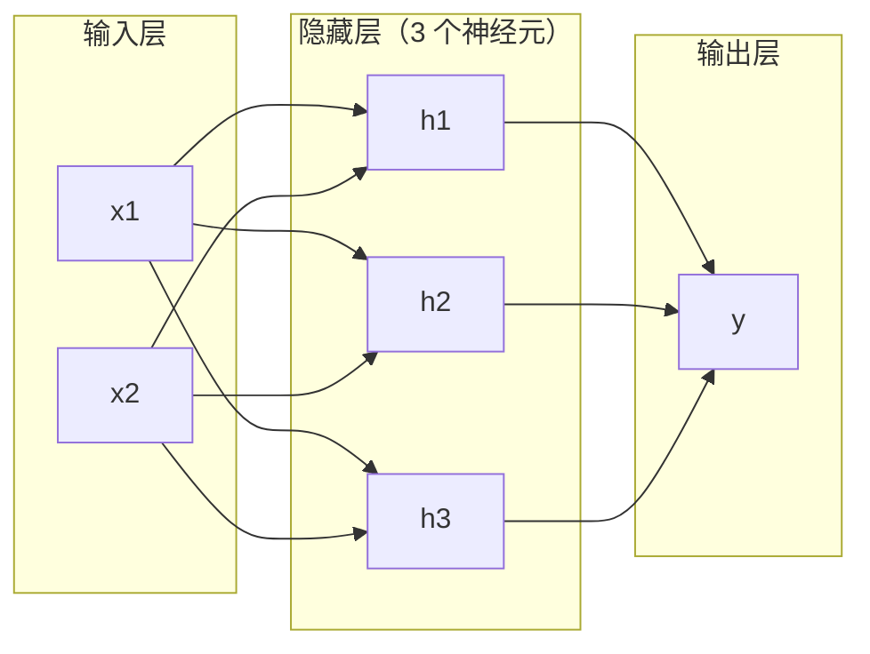
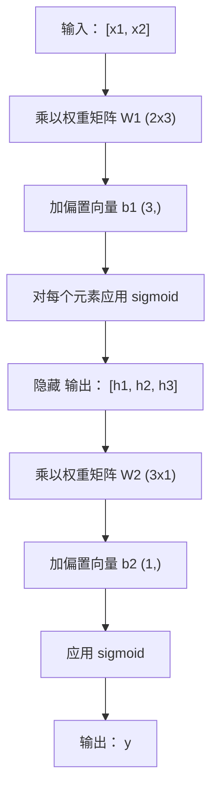

# 多层网络与前向传播

> 一个神经元画一条线；堆叠它们，你就能画任何形状。

**类型：** 构建  
**学习实现：** Python  
**前置课程：** Phase 01（数学基础）、第 03.01 课（感知机）  
**预计时间：** 约 90 分钟

## 学习目标

- 从零构建含 Layer、Network 类的多层网络，完成前向传播。
- 跟踪网络每层的矩阵维度，定位形状不匹配。
- 解释堆叠非线性激活为何能学习弯曲决策边界。
- 以手调 sigmoid 权重的 2-2-1 架构解决 XOR。

## 问题

单个神经元只能画直线，真实 AI 问题——图像识别、语言理解、围棋——需要曲线；将神经元堆成层才能得到曲线。

1969 年 Minsky 和 Papert 证明单层网络无法学习 XOR，不是“很难学”，而是数学上不可能：`[0,1]`、`[1,0]` 在一侧，`[0,0]`、`[1,1]` 在另一侧，单线不能分开。它令神经网络资金停滞十多年。

事后看修复很明显：不再只用一层。第一层将输入空间雕刻为新特征，第二层将其组合为单线无法作出的决定。这就是多层网络，是今日所有生产深度学习模型的基础。前向传播——数据从输入经隐藏层流至输出——是一切工作前首先要构建的东西。

## 概念

### 层：输入、隐藏、输出

多层网络有三种层：

**输入层**并不真正计算，只保存原始数据；两项特征即两个输入节点。**隐藏层**完成工作：每个神经元接收前层全部输出、加权加偏置后激活，“隐藏”是因为训练数据中不直接看到其值。**输出层**给出最终答案；二分类用一个 sigmoid 神经元，多分类每类一个。



这是 2-3-1 网络：两个输入、三个隐藏神经元、一个输出。每条连接有权重，每个非输入神经元有偏置。

每层产生称为 hidden state 的数值向量。文本中隐藏状态增维，如用 768 数编码词以捕捉语义；图像中可降维，将数百万像素压缩成可管理表征。学习发生在隐藏状态中。

### 神经元与激活

每个神经元做三事：

1. 每个输入乘对应权重。
2. 求积之和并加偏置。
3. 将和通过激活函数。

暂使用 sigmoid：

```
sigmoid(z) = 1 / (1 + e^(-z))
```

sigmoid 将任意数压到 (0,1)：大正数趋近 1，大负数趋近 0，零映射到 0.5。它的平滑曲线使学习可行——与感知机硬阶跃不同，sigmoid 处处有梯度。

### 前向传播：数据怎样流动

前向传播将输入逐层推至输出，期间没有学习；纯计算：乘、加、激活、重复。



每层按序执行：

```
z = W * input + b       (linear transformation)
a = sigmoid(z)           (activation)
```

一层输出成为下一层输入，这就是完整前向传播。

### 矩阵维度 <!-- learning-atlas: matrix-dimensions -->

跟踪维度是深度学习最重要的调试技能。2-3-1 网络：

| 步骤 | 操作 | 维度 | 结果形状 |
|------|-----------|------------|-------------|
| 输入 | x | -- | (2,) |
| 隐藏线性 | W1 * x + b1 | W1: (3, 2)，b1: (3,) | (3,) |
| 隐藏激活 | sigmoid(z1) | -- | (3,) |
| 输出线性 | W2 * h + b2 | W2: (1, 3)，b2: (1,) | (1,) |
| 输出激活 | sigmoid(z2) | -- | (1,) |

规则：第 k 层权重 W 的形状是 `(第 k 层神经元数, 第 k-1 层神经元数)`；行匹配当前层、列匹配前层。形状对不上就是 bug。

### 通用逼近定理

1989 年 George Cybenko 证明：单隐藏层且有足够神经元的网络，能以任意精度逼近任意连续函数。

这不表示一层总是最佳，仅表示架构理论上有能力。实践中更深的网络（更多层、每层更少神经元）以远少于浅宽网络的参数学习同样函数，这就是深度学习有效的原因。

直觉是每个隐藏神经元学习一个“凸包”或特征；在正确位置放足够多凸包便可逼近平滑曲线。神经元越多，凸包越多，逼近越好。


### 可组合性

神经网络可堆叠、串联、并行。Whisper 用 encoder 处理音频、独立 decoder 生成文本；现代 LLM 多为 decoder-only，BERT 是 encoder-only，T5 是 encoder-decoder。架构选择定义模型能力。

```figure
mlp-forward
```

## 动手实现

纯 Python，不用 numpy；所有矩阵操作从零写起。

### 步骤 1：Sigmoid 激活

```python
import math

def sigmoid(x):
    x = max(-500.0, min(500.0, x))
    return 1.0 / (1.0 + math.exp(-x))
```

限制到 [-500, 500] 防止溢出：`math.exp(500)` 很大但有限，`math.exp(1000)` 为无穷。

### 步骤 2：Layer 类

矩阵乘法是深度学习最重要操作：每层、每个 attention head、每次前向传播，底层都是 matmul。线性层将输入向量乘权重矩阵并加偏置：y = Wx + b；这一个方程占网络 90% 计算。

Layer 持有权重矩阵和偏置向量，`forward` 接收输入向量并返回激活输出。

```python
class Layer:
    def __init__(self, n_inputs, n_neurons, weights=None, biases=None):
        if weights is not None:
            self.weights = weights
        else:
            import random
            self.weights = [
                [random.uniform(-1, 1) for _ in range(n_inputs)]
                for _ in range(n_neurons)
            ]
        if biases is not None:
            self.biases = biases
        else:
            self.biases = [0.0] * n_neurons

    def forward(self, inputs):
        self.last_input = inputs
        self.last_output = []
        for neuron_idx in range(len(self.weights)):
            z = sum(
                w * x for w, x in zip(self.weights[neuron_idx], inputs)
            )
            z += self.biases[neuron_idx]
            self.last_output.append(sigmoid(z))
        return self.last_output
```

权重矩阵形状 `(n_neurons, n_inputs)`，每行是一个神经元跨全部输入的权重。前向循环每个神经元，计算加权和加偏置、应用 sigmoid、收集输出。

### 步骤 3：Network 类

网络是层列表，前向将其链接：第 k 层输出喂入第 k+1 层。

```python
class Network:
    def __init__(self, layers):
        self.layers = layers

    def forward(self, inputs):
        current = inputs
        for layer in self.layers:
            current = layer.forward(current)
        return current
```

这就是完整前向传播，四行逻辑：数据进入、穿过每层、从另一端出来。

### 步骤 4：手调权重解决 XOR

第 01 课以 OR、NAND、AND 感知机解决 XOR。现在用 Layer、Network 做同样事情，2-2-1 架构即两个输入、两个隐藏神经元、一个输出。

```python
hidden = Layer(
    n_inputs=2,
    n_neurons=2,
    weights=[[20.0, 20.0], [-20.0, -20.0]],
    biases=[-10.0, 30.0],
)

output = Layer(
    n_inputs=2,
    n_neurons=1,
    weights=[[20.0, 20.0]],
    biases=[-30.0],
)

xor_net = Network([hidden, output])

xor_data = [
    ([0, 0], 0),
    ([0, 1], 1),
    ([1, 0], 1),
    ([1, 1], 0),
]

for inputs, expected in xor_data:
    result = xor_net.forward(inputs)
    predicted = 1 if result[0] >= 0.5 else 0
    print(f"  {inputs} -> {result[0]:.6f} (rounded: {predicted}, expected: {expected})")
```

大权重（20、-20）使 sigmoid 如阶跃：首个隐藏神经元近似 OR，第二个近似 NAND，输出神经元将二者以 AND 组合，即 XOR。

### 步骤 5：圆形分类

更难问题：将二维点分为原点半径 0.5 圆内/圆外。这需要弯曲边界，单感知机不可能。

```python
import random
import math

random.seed(42)

data = []
for _ in range(200):
    x = random.uniform(-1, 1)
    y = random.uniform(-1, 1)
    label = 1 if (x * x + y * y) < 0.25 else 0
    data.append(([x, y], label))

circle_net = Network([
    Layer(n_inputs=2, n_neurons=8),
    Layer(n_inputs=8, n_neurons=1),
])
```

随机权重下网络分类不好，但前向仍可运行，这正是重点：前向只是计算；学习正确权重是第 03 课的反向传播。

```python
correct = 0
for inputs, expected in data:
    result = circle_net.forward(inputs)
    predicted = 1 if result[0] >= 0.5 else 0
    if predicted == expected:
        correct += 1

print(f"Accuracy with random weights: {correct}/{len(data)} ({100*correct/len(data):.1f}%)")
```

随机权重准确率低，常不如猜多数类。训练后（第 03 课），同一 8 隐藏神经元架构可画出分开内外的曲边界。

## 使用现成工具

PyTorch 用四行完成以上：

```python
import torch
import torch.nn as nn

model = nn.Sequential(
    nn.Linear(2, 8),
    nn.Sigmoid(),
    nn.Linear(8, 1),
    nn.Sigmoid(),
)

x = torch.tensor([[0.0, 0.0], [0.0, 1.0], [1.0, 0.0], [1.0, 1.0]])
output = model(x)
print(output)
```

`nn.Linear(2, 8)` 即 Layer：形状 (8,2) 的权重、(8,) 偏置；`nn.Sigmoid()` 是逐元素 sigmoid；`nn.Sequential` 即按序串联层的 Network。

差别在速度和规模：PyTorch 可用 GPU、处理百万样本批次，并自动计算反向传播梯度；但前向逻辑与从零构建完全相同。

## 交付成果

本课产出可复用的网络架构设计提示词：

- `outputs/prompt-network-architect.md`

当需要确定特定问题的层数、每层神经元数和激活函数时使用它。

## 练习

1. 构建 2-4-2-1 网络（两个隐藏层），以随机权重在 XOR 上前向，打印中间隐藏层输出，观察表征如何逐层变换。
2. 将圆分类器隐藏层从 8 改为 2、再改为 32，以随机权重前向；隐藏神经元数会改变输出范围或分布吗？为什么？
3. 为 Network 增加 `count_parameters`，返回可训练权重加偏置总数；在经典 MNIST 784-256-128-10 上测试，它有多少参数？
4. 为 3-4-4-2 网络构建前向，输入归一化 0–1 RGB 色值，观察两个输出；它是简单二类颜色分类器架构。
5. 用“leaky step”替换 sigmoid：z<0 时返回 0.01*z，否则 1.0；以步骤 4 的手调权重运行 XOR，仍有效吗？为什么平滑 sigmoid 优于硬切分？

## 核心术语

| 术语 | 常见说法 | 实际含义 |
|------|----------------|----------------------|
| 前向传播 | “运行模型” | 把输入穿过每层——乘权重、加偏置、激活——以产生输出。 |
| 隐藏层 | “中间部分” | 输入和输出之间、数据中不直接观测值的任一层。 |
| 多层网络 | “深度神经网络” | 顺序堆叠神经元层，每层输出作为下一层输入。 |
| 激活函数 | “非线性” | 线性变换后施加、在决策边界引入曲线的函数。 |
| Sigmoid | “S 曲线” | sigma(z)=1/(1+e^(-z))，将实数压到 (0,1)，平滑且处处可导。 |
| 权重矩阵 | “参数” | 形状 `(当前层神经元, 前一层神经元)`、含可学习连接强度的矩阵 W。 |
| 偏置向量 | “偏移” | 矩阵乘法后相加的向量，使输入全零时神经元也可激活。 |
| 通用逼近 | “网络能学一切” | 单隐藏层足够神经元可逼近任意连续函数，但“足够”可能为数十亿。 |
| 线性变换 | “矩阵乘法步” | z = W * x + b，激活前将输入映射到新空间的计算。 |
| 决策边界 | “分类器切换处” | 网络输出跨越分类阈值的输入空间曲面。 |

## 延伸阅读

- [Michael Nielsen，《Neural Networks and Deep Learning》第 1–2 章](http://neuralnetworksanddeeplearning.com/)——最清晰的免费前向传播与网络结构说明，含交互可视化。
- Cybenko，《Approximation by Superpositions of a Sigmoidal Function》（1989）——原始通用逼近定理论文，出人意料地易读。
- [3Blue1Brown，《But what is a neural network?》](https://www.youtube.com/watch?v=aircAruvnKk)——20 分钟可视讲解层、权重和前向传播。
- [Goodfellow、Bengio、Courville，《Deep Learning》第 6 章](https://www.deeplearningbook.org/)——免费在线的多层网络标准参考。
