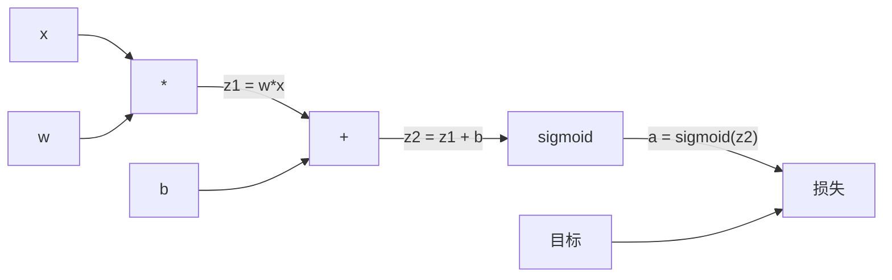
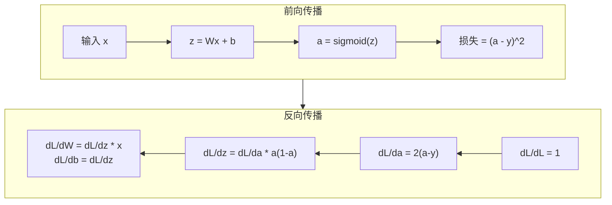

# 从零实现反向传播

> 反向传播是让学习成为可能的算法。没有它，神经网络只是昂贵的随机数生成器。

**类型：** 构建  
**学习实现：** Python  
**前置课程：** 第 03.02 课（多层网络）  
**预计时间：** 约 120 分钟

## 学习目标

- 实现基于 Value 的 autograd 引擎，构建计算图并以拓扑排序计算梯度。
- 以链式法则推导加法、乘法、sigmoid 的反向传播。
- 仅使用从零反向传播引擎，在 XOR 和圆分类上训练多层网络。
- 识别深 sigmoid 网络的梯度消失，并解释梯度为何指数缩小。

## 问题

网络单隐藏层有 768 输入、3072 输出，即 2,359,296 个权重；一次预测错了，哪些权重导致错误？逐个测试需 230 万次前向传播；反向传播一次反向即可算出全部 230 万梯度。这不是优化，而是可训练与不可能的区别。

朴素方法是微调一个权重、重跑前向、观察损失涨跌，得到该权重梯度；再对网络每个权重、数千训练步、数百万数据点重复，训练任何有用模型都需“地质年代”。

反向传播以一次前向、一次反向计算所有梯度。诀窍是将微积分链式法则系统应用在计算图上；它使深度学习实际可行，否则我们仍困在玩具问题。

## 概念

### 链式法则应用于网络 <!-- learning-atlas: the-chain-rule-applied-to-networks -->

你在 Phase 01 第 05 课学过：y=f(g(x)) 时 dy/dx=f'(g(x))*g'(x)，即沿链相乘导数。

神经网络中的“链”是输入到损失的一串操作：各层加权、加偏置、激活，损失比较最终输出与目标。反向传播从后向前追踪，计算每一步对误差的贡献。

### 计算图

每次前向都会构建图：节点是乘、加、sigmoid 等操作；边向前携带值、向后携带梯度。



前向自左向右：x、w 产生 z1=w*x，加 b 得 z2，sigmoid 得激活 a，再与目标 y 比较为损失。

反向自右向左：从 dL/da 开始，乘 da/dz2（sigmoid 导数）得 dL/dz2；它分为 dL/db（等于 dL/dz2，因为 z2=z1+b）与 dL/dz1；再得 dL/dw=dL/dz1*x、dL/dx=dL/dz1*w。

每个节点只做一件事：接收上方梯度、乘本地导数、向下传递。

### 前向与反向



前向存储每个中间值 z、a、各层输入；反向需这些值计算梯度。这是反向传播核心的内存—计算权衡：用内存保存激活，换取速度（一次而非百万次传播）。

### 梯度在网络中流动

三层网络中，梯度贯穿每层：


每层梯度乘 sigmoid 导数 a*(1-a)，其最大 0.25（a=0.5）。三层最多乘 0.25^3=0.0156；十层是 0.25^10=0.000001。

### 梯度消失

这就是梯度消失：sigmoid 输出在 0 到 1，导数恒小于 0.25；叠足够多 sigmoid 层，梯度变为零，早期层几乎不学习。

```
sigmoid(z):     Output range [0, 1]
sigmoid'(z):    Max value 0.25 (at z = 0)

After 5 layers:   gradient * 0.25^5 = 0.001x original
After 10 layers:  gradient * 0.25^10 = 0.000001x original
```

因此深 sigmoid 网络几乎无法训练。解法 ReLU 及变体在第 04 课；目前要理解反向传播本身完全正确，问题在于它穿过什么。

### 推导两层网络梯度

对输入 x、sigmoid 隐藏层、sigmoid 输出层、MSE 损失的具体网络，前向为：

```
z1 = W1 * x + b1
a1 = sigmoid(z1)
z2 = W2 * a1 + b2
a2 = sigmoid(z2)
L = (a2 - y)^2
```

逐步应用链式法则的反向为：

```
dL/da2 = 2(a2 - y)
da2/dz2 = a2 * (1 - a2)
dL/dz2 = dL/da2 * da2/dz2 = 2(a2 - y) * a2 * (1 - a2)

dL/dW2 = dL/dz2 * a1
dL/db2 = dL/dz2

dL/da1 = dL/dz2 * W2
da1/dz1 = a1 * (1 - a1)
dL/dz1 = dL/da1 * da1/dz1

dL/dW1 = dL/dz1 * x
dL/db1 = dL/dz1
```

每个梯度都是从损失向后追踪的本地导数乘积，这就是反向传播全部含义。

```figure
backprop-vanishing
```

## 动手实现

### 步骤 1：Value 节点

计算中的每个数都成为 Value：保存数值、梯度和创建方式，以便向后计算梯度。

```python
class Value:
    def __init__(self, data, children=(), op=''):
        self.data = data
        self.grad = 0.0
        self._backward = lambda: None
        self._children = set(children)
        self._op = op

    def __repr__(self):
        return f"Value(data={self.data:.4f}, grad={self.grad:.4f})"
```

初始无梯度（0.0）、无反向函数（no-op）。`_children` 记录产生该 Value 的节点，使稍后可拓扑排序。

### 步骤 2：带反向函数的操作

每个操作创建新 Value，并定义梯度如何反向流过它：

```python
def __add__(self, other):
    other = other if isinstance(other, Value) else Value(other)
    out = Value(self.data + other.data, (self, other), '+')

    def _backward():
        self.grad += out.grad
        other.grad += out.grad

    out._backward = _backward
    return out

def __mul__(self, other):
    other = other if isinstance(other, Value) else Value(other)
    out = Value(self.data * other.data, (self, other), '*')

    def _backward():
        self.grad += other.data * out.grad
        other.grad += self.data * out.grad

    out._backward = _backward
    return out
```

加法中 d(a+b)/da=d(a+b)/db=1，两个输入直接得到输出梯度；乘法中 d(a*b)/da=b、d(a*b)/db=a，各输入获得另一值乘输出梯度。

`+=` 很关键：Value 可能参与多个操作，最终梯度为所有路径梯度之和。

### 步骤 3：Sigmoid 与损失

```python
import math

def sigmoid(self):
    x = self.data
    x = max(-500, min(500, x))
    s = 1.0 / (1.0 + math.exp(-x))
    out = Value(s, (self,), 'sigmoid')

    def _backward():
        self.grad += (s * (1 - s)) * out.grad

    out._backward = _backward
    return out
```

sigmoid 导数是 sigmoid(x)*(1-sigmoid(x))。前向已经计算 s，重用即可，无额外工作。

```python
def mse_loss(predicted, target):
    diff = predicted + Value(-target)
    return diff * diff
```

单输出 MSE 为 `(predicted - target)^2`，以与负 Value 相加表达减法。

### 步骤 4：反向传播

拓扑排序保证按正确次序处理：一个节点梯度完全累积后才向其传播。

```python
def backward(self):
    topo = []
    visited = set()

    def build_topo(v):
        if v not in visited:
            visited.add(v)
            for child in v._children:
                build_topo(child)
            topo.append(v)

    build_topo(self)
    self.grad = 1.0
    for v in reversed(topo):
        v._backward()
```

从损失开始（dL/dL=1），在排序图上向后行走，每节点 `_backward` 向 children 推梯度。

### 步骤 5：层与网络

```python
import random

class Neuron:
    def __init__(self, n_inputs):
        scale = (2.0 / n_inputs) ** 0.5
        self.weights = [Value(random.uniform(-scale, scale)) for _ in range(n_inputs)]
        self.bias = Value(0.0)

    def __call__(self, x):
        act = sum((wi * xi for wi, xi in zip(self.weights, x)), self.bias)
        return act.sigmoid()

    def parameters(self):
        return self.weights + [self.bias]


class Layer:
    def __init__(self, n_inputs, n_outputs):
        self.neurons = [Neuron(n_inputs) for _ in range(n_outputs)]

    def __call__(self, x):
        out = [n(x) for n in self.neurons]
        return out[0] if len(out) == 1 else out

    def parameters(self):
        params = []
        for n in self.neurons:
            params.extend(n.parameters())
        return params


class Network:
    def __init__(self, sizes):
        self.layers = []
        for i in range(len(sizes) - 1):
            self.layers.append(Layer(sizes[i], sizes[i + 1]))

    def __call__(self, x):
        for layer in self.layers:
            x = layer(x)
            if not isinstance(x, list):
                x = [x]
        return x[0] if len(x) == 1 else x

    def parameters(self):
        params = []
        for layer in self.layers:
            params.extend(layer.parameters())
        return params

    def zero_grad(self):
        for p in self.parameters():
            p.grad = 0.0
```

Neuron 将输入加权求和加偏置、应用 sigmoid；权重以 sqrt(2/n_inputs) 缩放初始化，防深网络 sigmoid 饱和。Layer 是 Neuron 列表，Network 是 Layer 列表；`parameters()` 收集所有可学习 Value 以便更新。

### 步骤 6：训练 XOR

```python
random.seed(42)
net = Network([2, 4, 1])

xor_data = [
    ([0.0, 0.0], 0.0),
    ([0.0, 1.0], 1.0),
    ([1.0, 0.0], 1.0),
    ([1.0, 1.0], 0.0),
]

learning_rate = 1.0

for epoch in range(1000):
    total_loss = Value(0.0)
    for inputs, target in xor_data:
        x = [Value(i) for i in inputs]
        pred = net(x)
        loss = mse_loss(pred, target)
        total_loss = total_loss + loss

    net.zero_grad()
    total_loss.backward()

    for p in net.parameters():
        p.data -= learning_rate * p.grad

    if epoch % 100 == 0:
        print(f"Epoch {epoch:4d} | Loss: {total_loss.data:.6f}")

print("\nXOR Results:")
for inputs, target in xor_data:
    x = [Value(i) for i in inputs]
    pred = net(x)
    print(f"  {inputs} -> {pred.data:.4f} (expected {target})")
```

观察损失下降：从随机预测到正确 XOR，完全由反向传播算梯度、将权重推向正确方向驱动。

### 步骤 7：圆形分类

第 02 课中你为圆分类手调权重，现在让网络自己学习。

```python
random.seed(7)

def generate_circle_data(n=100):
    data = []
    for _ in range(n):
        x1 = random.uniform(-1.5, 1.5)
        x2 = random.uniform(-1.5, 1.5)
        label = 1.0 if x1 * x1 + x2 * x2 < 1.0 else 0.0
        data.append(([x1, x2], label))
    return data

circle_data = generate_circle_data(80)

circle_net = Network([2, 8, 1])
learning_rate = 0.5

for epoch in range(2000):
    random.shuffle(circle_data)
    total_loss_val = 0.0
    for inputs, target in circle_data:
        x = [Value(i) for i in inputs]
        pred = circle_net(x)
        loss = mse_loss(pred, target)
        circle_net.zero_grad()
        loss.backward()
        for p in circle_net.parameters():
            p.data -= learning_rate * p.grad
        total_loss_val += loss.data

    if epoch % 200 == 0:
        correct = 0
        for inputs, target in circle_data:
            x = [Value(i) for i in inputs]
            pred = circle_net(x)
            predicted_class = 1.0 if pred.data > 0.5 else 0.0
            if predicted_class == target:
                correct += 1
        accuracy = correct / len(circle_data) * 100
        print(f"Epoch {epoch:4d} | Loss: {total_loss_val:.4f} | Accuracy: {accuracy:.1f}%")
```

这里使用在线 SGD：每个样本后更新，而非累积整批；它更快打破对称性并避免在完整损失面上 sigmoid 饱和。每 epoch 打乱数据，避免网络记住顺序。

无需手调。网络自己发现圆形决策边界；反向传播的力量在于你定义架构、损失、数据，算法找到权重。

## 使用现成工具

PyTorch 用少数行完成相同工作：autograd 在前向时建图，再向后追踪计算梯度。

```python
import torch
import torch.nn as nn

model = nn.Sequential(
    nn.Linear(2, 4),
    nn.Sigmoid(),
    nn.Linear(4, 1),
    nn.Sigmoid(),
)
optimizer = torch.optim.SGD(model.parameters(), lr=1.0)
criterion = nn.MSELoss()

X = torch.tensor([[0,0],[0,1],[1,0],[1,1]], dtype=torch.float32)
y = torch.tensor([[0],[1],[1],[0]], dtype=torch.float32)

for epoch in range(1000):
    pred = model(X)
    loss = criterion(pred, y)
    optimizer.zero_grad()
    loss.backward()
    optimizer.step()

print("PyTorch XOR Results:")
with torch.no_grad():
    for i in range(4):
        pred = model(X[i])
        print(f"  {X[i].tolist()} -> {pred.item():.4f} (expected {y[i].item()})")
```

`loss.backward()` 对应 `total_loss.backward()`，`optimizer.step()` 对应手写 `p.data -= lr * p.grad`，`optimizer.zero_grad()` 对应 `net.zero_grad()`。算法相同，PyTorch 是工业级实现，增加 GPU、混合精度、gradient checkpointing、数百层类型；反向仍是同一计算图上的链式法则。

训练运行前向、反向、更新；推理仅前向，不算梯度、不更新。生产中调用 Claude/GPT 是推理：提示词前向流过网络、token 输出，权重不变。理解反向传播重要，因为它塑造了网络的每个权重。

## 交付成果

本课产出：

- `outputs/prompt-gradient-debugger.md`——诊断任意神经网络梯度问题（消失、爆炸、NaN）的可复用提示词。

## 练习

1. 为 Value 增加 `__sub__`（a-b=a+(-1*b)）及 `__neg__`，以 `(a-b)^2` 等简单表达式手算比较，验证梯度正确。
2. 为 Value 增加 `relu`（max(0,x)，x>0 导数 1 否则 0），以 relu 取代隐藏层 sigmoid 重训 XOR，比较收敛速度，应更快，预览第 04 课。
3. 为 Value 实现整数幂 `__pow__`，以 `(predicted-target) ** 2` 替换 mse_loss，验证梯度一致。
4. 在 `backward()` 后加入梯度裁剪至 [-1,1]；训练 4+ 层 sigmoid 深网络，比较有无裁剪损失曲线，作为对抗梯度爆炸的第一道防线。
5. XOR 训练后打印网络每个参数梯度，找出梯度最小的层，展示概念部分的梯度消失。

## 核心术语

| 术语 | 常见说法 | 实际含义 |
|------|----------------|----------------------|
| 反向传播 | “网络在学习” | 通过计算图反向应用链式法则，为每个权重计算 dL/dw 的算法。 |
| 计算图 | “网络结构” | 节点为操作的有向无环图，边向前传值、向后传梯度。 |
| 链式法则 | “导数相乘” | y=f(g(x)) 时 dy/dx=f'(g(x))*g'(x)，是反向传播数学基础。 |
| 梯度 | “最陡上升方向” | 损失相对参数的偏导数，说明怎样改变参数可减少损失。 |
| 梯度消失 | “深网络不学习” | 在 sigmoid 等饱和激活层间传播时梯度指数缩小。 |
| 前向传播 | “运行网络” | 顺序执行各层操作、从输入计算输出并存储中间值。 |
| 反向传播 | “计算梯度” | 反向遍历计算图，按链式法则在节点累积梯度。 |
| 学习率 | “学习多快” | 控制权重更新步长的标量：w_new=w_old-lr*gradient。 |
| 拓扑排序 | “正确顺序” | 每节点出现在其依赖的所有节点之后的图排序，保证传播前梯度已累积。 |
| Autograd | “自动微分” | 前向建计算图、自动求梯度的系统，也是 PyTorch 引擎所做的事。 |

## 延伸阅读

- Rumelhart、Hinton、Williams，《Learning representations by back-propagating errors》（1986）——让反向传播成为主流、解锁多层网络训练的论文。
- [3Blue1Brown，《Neural Networks》系列](https://www.youtube.com/playlist?list=PLZHQObOWTQDNU6R1_67000Dx_ZCJB-3pi)——反向传播与梯度流的最佳可视解释。
