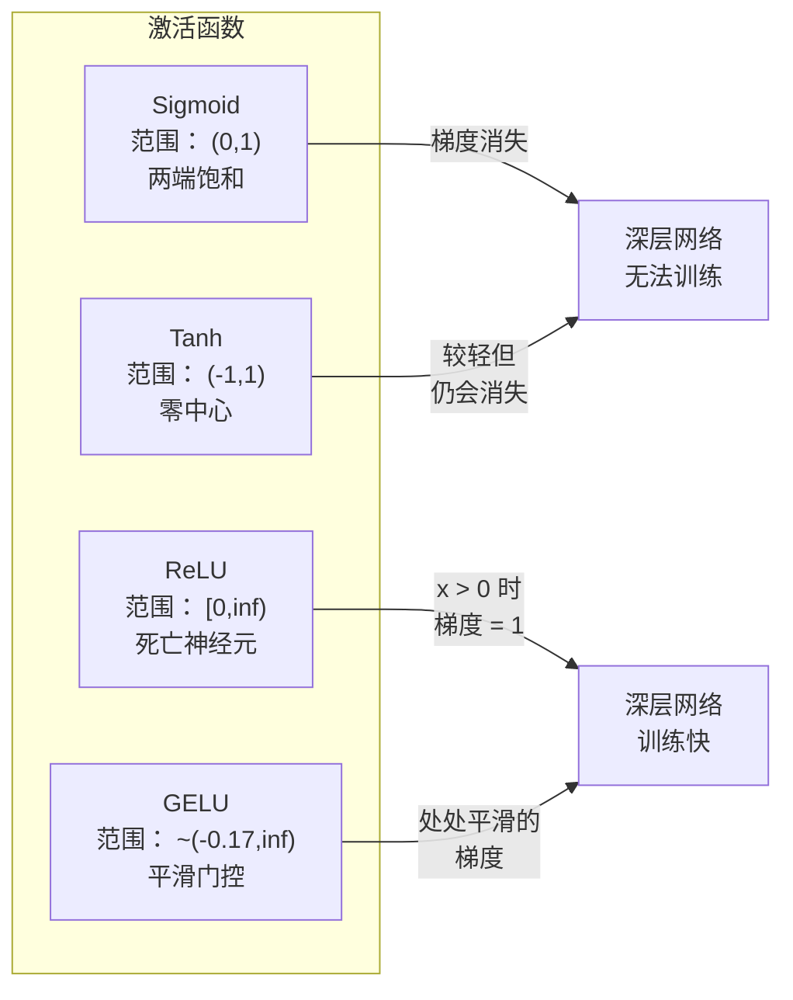
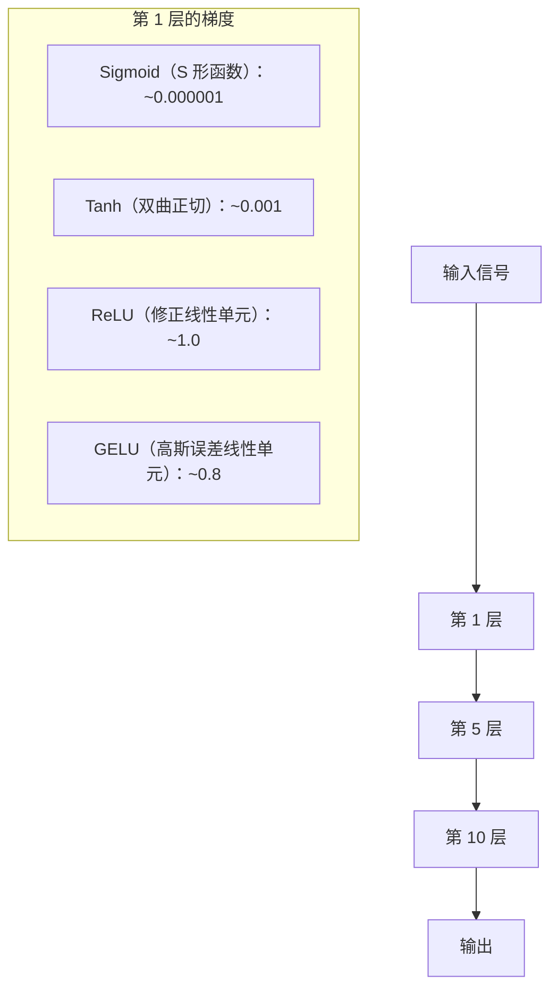
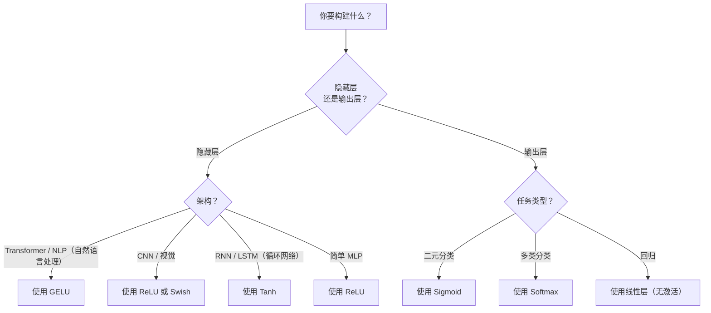

# 激活函数

> 没有非线性，100 层网络只是花哨的矩阵乘法；激活函数是让网络用曲线思考的门。

**类型：** 构建  
**学习实现：** Python  
**前置课程：** 第 03.03 课（反向传播）  
**预计时间：** 约 75 分钟

## 学习目标

- 从零实现 sigmoid、tanh、ReLU、Leaky ReLU、GELU、Swish、softmax 及导数。
- 通过测量不同激活下 10+ 层的激活幅度诊断梯度消失。
- 检测 ReLU 网络的死神经元，并解释 GELU 为何避开此失败模式。
- 为 Transformer、CNN、RNN 和输出层选择正确激活。

## 问题

叠两次线性变换 `y=W2(W1x+b1)+b2`，展开后为 `y=W2W1x+W2b1+b2=Ax+c`，仍是单一线性变换。无论堆多少线性层都可折叠为一次矩阵乘法，100 层网络与单层表征能力相同。

因此，深线性网络无法学习 XOR、螺旋数据或人脸等非线性结构；没有激活函数，多层线性变换仍等价于单层线性变换。非线性激活让网络弯曲决策边界并逼近复杂函数。选择不当则会导致梯度消失、爆炸，或让 ReLU 神经元因持续负偏置永久死亡。

## 概念

### 为什么必须非线性 <!-- learning-atlas: why-nonlinearity-is-necessary -->

矩阵乘法可组合：先乘 A 再乘 B 等价于乘 AB，十层线性层等价于一层。证明中，线性层 f(x)=Wx+b，叠两层：

```
Layer 1: h = W1 * x + b1
Layer 2: y = W2 * h + b2
```

代入：

```
y = W2 * (W1 * x + b1) + b2
y = (W2 * W1) * x + (W2 * b1 + b2)
y = A * x + c
```

仍是一层。若中间插入非线性 g()：

```
h = g(W1 * x + b1)
y = W2 * h + b2
```

`W2*g(W1*x+b1)+b2` 无法约为单线性变换；网络可表示非线性函数，每增加一个含激活层就增加表征能力。

### Sigmoid

原始神经网络激活：

```
sigmoid(x) = 1 / (1 + e^(-x))
```

输出范围 (0,1)，平滑可导，将任意实数映射为类似概率的值。其导数：

```
sigmoid'(x) = sigmoid(x) * (1 - sigmoid(x))
```

导数最大 0.25（x=0）。反向梯度跨层相乘，十层 sigmoid 至多为：

```
0.25^10 = 0.000000953674
```

小于原信号百万分之一，早期权重几乎不更新，深 sigmoid 网络无法训练。另一个问题是输出恒正，权重梯度常同号，梯度下降呈锯齿。

### Tanh

以零为中心的 sigmoid：

```
tanh(x) = (e^x - e^(-x)) / (e^x + e^(-x))
```

输出范围 (-1,1)，消除锯齿问题。导数：

```
tanh'(x) = 1 - tanh(x)^2
```

最大导数 1.0（x=0），是 sigmoid 四倍；但大正/负输入时导数仍趋零，梯度消失仍存在，只是较轻。

### ReLU：突破

Rectified Linear Unit，由 Nair、Hinton 2010 年推广（函数可追溯到 Fukushima 1969）：

```
relu(x) = max(0, x)
```

输出 [0,∞)，导数简单：

```
relu'(x) = 1  if x > 0
            0  if x <= 0
```

正输入不消失，梯度精确为 1，直接穿过；这使深网络可训练。

失败模式是**死神经元**：若加权输入总负（大负偏置或不幸初始化），输出与梯度恒零，永不更新、永久死亡；实践中 10–40% ReLU 神经元可能死去。

### Leaky ReLU

对死神经元最简单的修复：

```
leaky_relu(x) = x        if x > 0
                alpha * x if x <= 0
```

alpha 通常 0.01，负侧留有小斜率，神经元仍获梯度并可恢复。

### GELU：现代默认

Gaussian Error Linear Unit，Hendrycks、Gimpel 2016 提出，是 BERT、GPT 和多数现代 Transformer 默认激活：

```
gelu(x) = x * Phi(x)
```

Phi(x) 是标准正态 CDF，实践近似为：

```
gelu(x) ~= 0.5 * x * (1 + tanh(sqrt(2/pi) * (x + 0.044715 * x^3)))
```

GELU 处处平滑，允许小负值（ReLU 会硬截为零），概率解释为按输入为正的高斯概率加权。其平滑 gating 在 Transformer 中优于 ReLU，梯度流更好，彻底避免死神经元。

### Swish / SiLU

Ramachandran 等 2017 经自动搜索发现的自门控激活：

```
swish(x) = x * sigmoid(x)
```

即 x*sigmoid(x)。它同 GELU 一样平滑、非单调、允许小负值；差别是 Swish 用 sigmoid gating、GELU 用 Gaussian CDF。实践表现近似，Swish 用于 EfficientNet 和部分视觉模型，GELU 主导语言模型。

### Softmax：输出激活

不用于隐藏层，softmax 将 logits 向量转为概率分布：

```
softmax(x_i) = e^(x_i) / sum(e^(x_j) for all j)
```

每个输出在 0–1，全部和为 1，故是多分类标准最终激活。最大 logit 概率最高；与 argmax 不同，softmax 可导并保留相对置信度。

### 形状对比



### 梯度流对比



### 何时使用哪种激活



```figure
softmax-temperature
```

## 动手实现

### 步骤 1：实现全部激活及导数

每个函数接收、返回一个 float，导数函数对同一输入返回梯度。

```python
import math

def sigmoid(x):
    x = max(-500, min(500, x))
    return 1.0 / (1.0 + math.exp(-x))

def sigmoid_derivative(x):
    s = sigmoid(x)
    return s * (1 - s)

def tanh_act(x):
    return math.tanh(x)

def tanh_derivative(x):
    t = math.tanh(x)
    return 1 - t * t

def relu(x):
    return max(0.0, x)

def relu_derivative(x):
    return 1.0 if x > 0 else 0.0

def leaky_relu(x, alpha=0.01):
    return x if x > 0 else alpha * x

def leaky_relu_derivative(x, alpha=0.01):
    return 1.0 if x > 0 else alpha

def gelu(x):
    return 0.5 * x * (1 + math.tanh(math.sqrt(2 / math.pi) * (x + 0.044715 * x ** 3)))

def gelu_derivative(x):
    phi = 0.5 * (1 + math.erf(x / math.sqrt(2)))
    pdf = math.exp(-0.5 * x * x) / math.sqrt(2 * math.pi)
    return phi + x * pdf

def swish(x):
    return x * sigmoid(x)

def swish_derivative(x):
    s = sigmoid(x)
    return s + x * s * (1 - s)

def softmax(xs):
    max_x = max(xs)
    exps = [math.exp(x - max_x) for x in xs]
    total = sum(exps)
    return [e / total for e in exps]
```

### 步骤 2：可视化梯度在哪消失

在 -5 至 5 均匀取 100 点，打印每种激活梯度接近零的位置文本直方图：

```python
def gradient_scan(name, derivative_fn, start=-5, end=5, n=100):
    step = (end - start) / n
    near_zero = 0
    healthy = 0
    for i in range(n):
        x = start + i * step
        g = derivative_fn(x)
        if abs(g) < 0.01:
            near_zero += 1
        else:
            healthy += 1
    pct_dead = near_zero / n * 100
    print(f"{name:15s}: {healthy:3d} healthy, {near_zero:3d} near-zero ({pct_dead:.0f}% dead zone)")

gradient_scan("Sigmoid", sigmoid_derivative)
gradient_scan("Tanh", tanh_derivative)
gradient_scan("ReLU", relu_derivative)
gradient_scan("Leaky ReLU", leaky_relu_derivative)
gradient_scan("GELU", gelu_derivative)
gradient_scan("Swish", swish_derivative)
```

### 步骤 3：梯度消失实验

以 sigmoid 和 ReLU 让信号前向穿过 N 层，测激活幅度如何变化：

```python
import random

def vanishing_gradient_experiment(activation_fn, name, n_layers=10, n_inputs=5):
    random.seed(42)
    values = [random.gauss(0, 1) for _ in range(n_inputs)]

    print(f"\n{name} through {n_layers} layers:")
    for layer in range(n_layers):
        weights = [random.gauss(0, 1) for _ in range(n_inputs)]
        z = sum(w * v for w, v in zip(weights, values))
        activated = activation_fn(z)
        magnitude = abs(activated)
        bar = "#" * int(magnitude * 20)
        print(f"  Layer {layer+1:2d}: magnitude = {magnitude:.6f} {bar}")
        values = [activated] * n_inputs

vanishing_gradient_experiment(sigmoid, "Sigmoid")
vanishing_gradient_experiment(relu, "ReLU")
vanishing_gradient_experiment(gelu, "GELU")
```

### 步骤 4：死神经元检测器

创建 ReLU 网络、通过随机输入，统计从未激活的神经元：

```python
def dead_neuron_detector(n_inputs=5, hidden_size=20, n_samples=1000):
    random.seed(0)
    weights = [[random.gauss(0, 1) for _ in range(n_inputs)] for _ in range(hidden_size)]
    biases = [random.gauss(0, 1) for _ in range(hidden_size)]

    fire_counts = [0] * hidden_size

    for _ in range(n_samples):
        inputs = [random.gauss(0, 1) for _ in range(n_inputs)]
        for neuron_idx in range(hidden_size):
            z = sum(w * x for w, x in zip(weights[neuron_idx], inputs)) + biases[neuron_idx]
            if relu(z) > 0:
                fire_counts[neuron_idx] += 1

    dead = sum(1 for c in fire_counts if c == 0)
    rarely_fire = sum(1 for c in fire_counts if 0 < c < n_samples * 0.05)
    healthy = hidden_size - dead - rarely_fire

    print(f"\nDead Neuron Report ({hidden_size} neurons, {n_samples} samples):")
    print(f"  Dead (never fired):     {dead}")
    print(f"  Barely alive (<5%):     {rarely_fire}")
    print(f"  Healthy:                {healthy}")
    print(f"  Dead neuron rate:       {dead/hidden_size*100:.1f}%")

    for i, c in enumerate(fire_counts):
        status = "DEAD" if c == 0 else "WEAK" if c < n_samples * 0.05 else "OK"
        bar = "#" * (c * 40 // n_samples)
        print(f"  Neuron {i:2d}: {c:4d}/{n_samples} fires [{status:4s}] {bar}")

dead_neuron_detector()
```

### 步骤 5：训练比较——Sigmoid、ReLU、GELU

在相同圆形数据集（圆内为类 1、外为类 0）上以三种激活训练相同两层网络，比较收敛速度：

```python
def make_circle_data(n=200, seed=42):
    random.seed(seed)
    data = []
    for _ in range(n):
        x = random.uniform(-2, 2)
        y = random.uniform(-2, 2)
        label = 1.0 if x * x + y * y < 1.5 else 0.0
        data.append(([x, y], label))
    return data


class ActivationNetwork:
    def __init__(self, activation_fn, activation_deriv, hidden_size=8, lr=0.1):
        random.seed(0)
        self.act = activation_fn
        self.act_d = activation_deriv
        self.lr = lr
        self.hidden_size = hidden_size

        self.w1 = [[random.gauss(0, 0.5) for _ in range(2)] for _ in range(hidden_size)]
        self.b1 = [0.0] * hidden_size
        self.w2 = [random.gauss(0, 0.5) for _ in range(hidden_size)]
        self.b2 = 0.0

    def forward(self, x):
        self.x = x
        self.z1 = []
        self.h = []
        for i in range(self.hidden_size):
            z = self.w1[i][0] * x[0] + self.w1[i][1] * x[1] + self.b1[i]
            self.z1.append(z)
            self.h.append(self.act(z))

        self.z2 = sum(self.w2[i] * self.h[i] for i in range(self.hidden_size)) + self.b2
        self.out = sigmoid(self.z2)
        return self.out

    def backward(self, target):
        error = self.out - target
        d_out = error * self.out * (1 - self.out)

        for i in range(self.hidden_size):
            d_h = d_out * self.w2[i] * self.act_d(self.z1[i])
            self.w2[i] -= self.lr * d_out * self.h[i]
            for j in range(2):
                self.w1[i][j] -= self.lr * d_h * self.x[j]
            self.b1[i] -= self.lr * d_h
        self.b2 -= self.lr * d_out

    def train(self, data, epochs=200):
        losses = []
        for epoch in range(epochs):
            total_loss = 0
            correct = 0
            for x, y in data:
                pred = self.forward(x)
                self.backward(y)
                total_loss += (pred - y) ** 2
                if (pred >= 0.5) == (y >= 0.5):
                    correct += 1
            avg_loss = total_loss / len(data)
            accuracy = correct / len(data) * 100
            losses.append(avg_loss)
            if epoch % 50 == 0 or epoch == epochs - 1:
                print(f"    Epoch {epoch:3d}: loss={avg_loss:.4f}, accuracy={accuracy:.1f}%")
        return losses


data = make_circle_data()

configs = [
    ("Sigmoid", sigmoid, sigmoid_derivative),
    ("ReLU", relu, relu_derivative),
    ("GELU", gelu, gelu_derivative),
]

results = {}
for name, act_fn, act_d_fn in configs:
    print(f"\n=== Training with {name} ===")
    net = ActivationNetwork(act_fn, act_d_fn, hidden_size=8, lr=0.1)
    losses = net.train(data, epochs=200)
    results[name] = losses

print("\n=== Final Loss Comparison ===")
for name, losses in results.items():
    print(f"  {name:10s}: start={losses[0]:.4f} -> end={losses[-1]:.4f} (improvement: {(1 - losses[-1]/losses[0])*100:.1f}%)")
```

## 使用现成工具

PyTorch 以 functional 和 module 两种形式提供所有这些：

```python
import torch
import torch.nn as nn
import torch.nn.functional as F

x = torch.randn(4, 10)

relu_out = F.relu(x)
gelu_out = F.gelu(x)
sigmoid_out = torch.sigmoid(x)
swish_out = F.silu(x)

logits = torch.randn(4, 5)
probs = F.softmax(logits, dim=1)

model = nn.Sequential(
    nn.Linear(10, 64),
    nn.GELU(),
    nn.Linear(64, 32),
    nn.GELU(),
    nn.Linear(32, 5),
)
```

Transformer 隐藏层用 GELU，CNN 隐藏层用 ReLU，分类输出 softmax，回归输出不激活（线性），概率输出 sigmoid。先使用这些默认值，只在有证据时改变。

RNN/LSTM 隐状态用 tanh、门用 sigmoid；如今从零构建时通常不会用 RNN。若 ReLU 网络神经元死亡，改 GELU；除非有具体理由，不必优先 Leaky ReLU，GELU 已解决死亡问题且梯度流更好。

## 交付成果

本课产出：

- `outputs/prompt-activation-selector.md`——帮助为任意架构选择激活函数的可复用提示词。

## 练习

1. 实现 Parametric ReLU（PReLU），负斜率 alpha 可学习；在圆数据集训练并与固定 Leaky ReLU 比较。
2. 将梯度消失实验扩展到 50 层，绘制 sigmoid、tanh、ReLU、GELU 每层幅度；各自在哪层信号有效归零？
3. 实现 ELU：x>0 时 x，否则 alpha*(e^x-1)；在同一网络与 ReLU 比较死神经元率。
4. 构建训练中运行的“梯度健康监视器”：每 epoch 测每层平均梯度，任一层低于 0.001 或高于 100 时警告。
5. 将训练比较换成第 01 课 XOR 数据，哪种激活收敛最快？为何与圆分类结果不同？

## 核心术语

| 术语 | 常见说法 | 实际含义 |
|------|----------------|----------------------|
| 激活函数 | “非线性部分” | 施于每个神经元输出、打破线性从而让网络学习非线性映射的函数。 |
| 梯度消失 | “深网络梯度消失” | 激活导数小于 1 时，跨层梯度指数缩小，早层无法训练。 |
| 梯度爆炸 | “梯度变大” | 有效乘数大于 1 时梯度跨层指数增长，导致训练不稳定。 |
| 死神经元 | “停止学习的神经元” | 输入永久负的 ReLU 神经元，输出和梯度均为零。 |
| Sigmoid | “将值压到 0–1” | logistic 函数 1/(1+e^-x)，历史重要但深网络会梯度消失。 |
| ReLU | “将负数截零” | max(0,x)，以保留梯度大小使深度学习实际可用的激活。 |
| GELU | “Transformer 激活” | Gaussian Error Linear Unit，以输入为正的概率平滑加权。 |
| Swish/SiLU | “自门控 ReLU” | x*sigmoid(x)，由自动搜索发现、用于 EfficientNet。 |
| Softmax | “将分数变概率” | 将 logits 归一化为各值在 (0,1)、总和为 1 的概率分布。 |
| Leaky ReLU | “不会死的 ReLU” | max(alpha*x,x)，alpha 小（0.01）以允许小负梯度、防死神经元。 |
| 饱和 | “sigmoid 的平坦区” | 激活导数趋近零、阻断梯度流的区域。 |
| Logit | “softmax 前原始分数” | 最终层应用 softmax 或 sigmoid 前的未归一化输出。 |

## 延伸阅读

- Nair 与 Hinton，《Rectified Linear Units Improve Restricted Boltzmann Machines》（2010）——引入 ReLU、使深网络可训练的论文。
- Hendrycks 与 Gimpel，《Gaussian Error Linear Units（GELUs）》（2016）——提出成为 Transformer 默认的激活。
- Ramachandran 等，《Searching for Activation Functions》（2017）——自动搜索发现 Swish，展示激活设计可自动化。
- Glorot 与 Bengio，《Understanding the difficulty of training deep feedforward neural networks》（2010）——诊断梯度消失/爆炸并提出 Xavier 初始化。
- [Goodfellow、Bengio、Courville，《Deep Learning》第 6.3 节](https://www.deeplearningbook.org/)——隐藏单元与激活函数的严谨论述。
