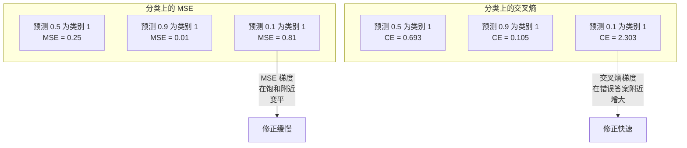
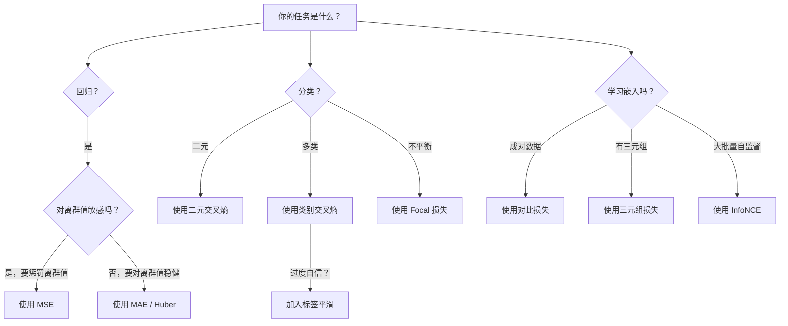
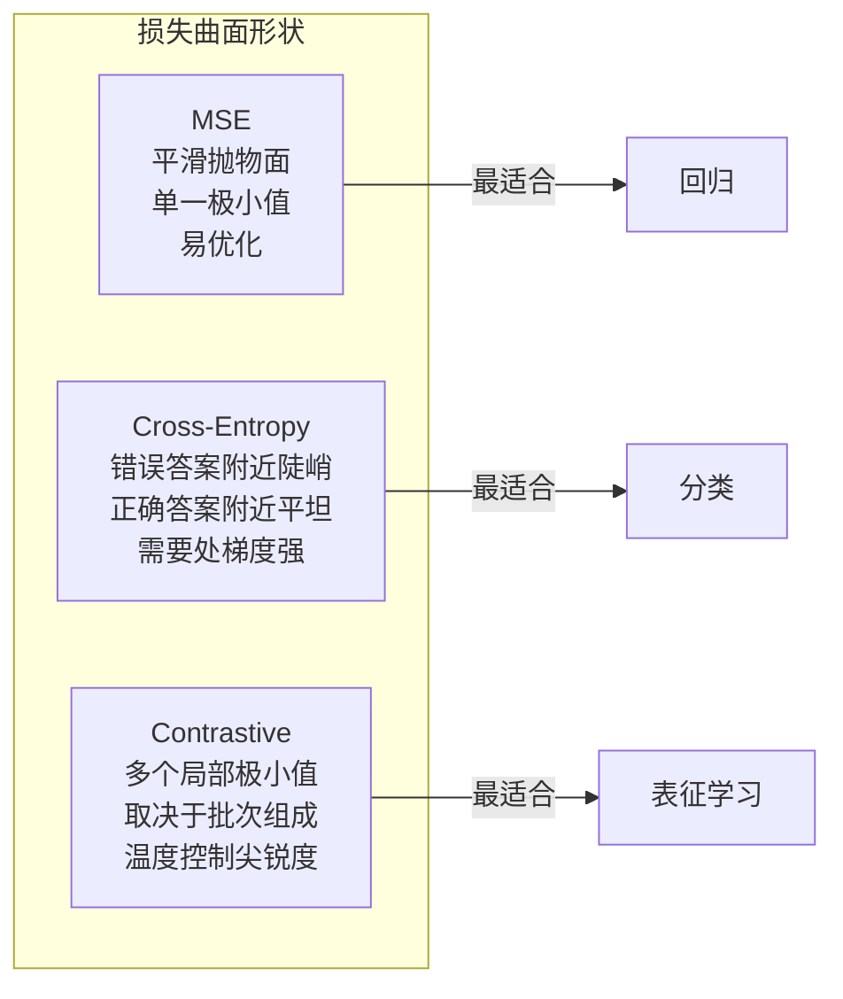

# 损失函数

> 网络做出预测，真实答案说并非如此；它错多少？那个数就是损失。选错损失，模型会完全优化错误的目标。

**类型：** 构建  
**学习实现：** Python  
**前置课程：** 第 03.04 课（激活函数）  
**预计时间：** 约 75 分钟

## 学习目标

- 从零实现 MSE、二元交叉熵、类别交叉熵、对比损失（InfoNCE）及梯度。
- 通过“任何输入都预测 0.5”失败模式解释 MSE 为何不适合分类。
- 将标签平滑用于交叉熵，并说明它如何避免过度自信。
- 为回归、二元分类、多分类和嵌入学习选择正确损失。

## 问题

分类任务上最小化 MSE 的模型会自信地对一切预测 0.5；它确实最小化了损失，也完全无用。

优化器只根据损失函数的梯度调整权重，不会直接优化准确率、F1 或汇报指标。若损失没有表达任务目标，模型会选择数学上最容易降低损失的方式，结果可能偏离实际需求。

具体地说，二元 50/50 分类用 MSE 时，所有输入预测 0.5 的平均 MSE=0.25，是不学习任何东西也能达到的最小值；毫无区分能力。改用交叉熵，`-log(0.5)=0.693` 很差，而 `-log(0.99)=0.01` 奖励自信正确预测，模型必须把概率推向 0 或 1。

自监督中甚至没有标签，对比损失完全定义学习信号：何为相似、何为不同、要分开多远。设错会使嵌入坍塌为一点，每个输入映射到同一向量；技术上零损失，实际无价值。

## 概念

### 均方误差（MSE）

回归默认损失，计算预测与目标差的平方并对样本平均：

```
MSE = (1/n) * sum((y_pred - y_true)^2)
```

平方使大误差二次受罚：误差 2 成本是误差 1 的 4 倍，误差 10 是 100 倍，故 MSE 对离群值敏感。房价中大多数偏 $10,000、一个豪宅偏 $200,000 时，它会猛烈修正豪宅，可能损害其他 99 套表现。

对预测的梯度：

```
dMSE/dy_pred = (2/n) * (y_pred - y_true)
```

它与误差线性相关，大错梯度大；回归中这是特性，分类中是 bug——分类需要指数式惩罚自信错误，而非线性惩罚。

### 交叉熵损失 <!-- learning-atlas: cross-entropy-loss -->

分类损失，来自信息论，度量预测概率分布与真实分布的差异。

**二元交叉熵（BCE）：**

```
BCE = -(y * log(p) + (1 - y) * log(1 - p))
```

y 是 0/1 真实标签，p 是预测概率。标签 1 而 p=0.99 时损失 `-log(0.99)=0.01`，p=0.01 时为 `-log(0.01)=4.6`，相差 460 倍，因而能严惩自信错误。

梯度也如此：

```
dBCE/dp = -(y/p) + (1-y)/(1-p)
```

y=1、p 近零时梯度 -1/p 趋负无穷，模型收到巨大的修正信号；p 近一时梯度很小，已正确无需修正。

**类别交叉熵（CCE）：** 用于 one-hot 目标的多分类：

```
CCE = -sum(y_i * log(p_i))
```

仅真实类贡献损失。10 类中真实类概率 0.1（随机猜）时损失 2.3，概率 0.9 时 0.105；模型学习将概率质量集中到答案上。

### MSE 为何在分类失败



MSE 在预测接近 0/1 时因 sigmoid 饱和而梯度变平；交叉熵补偿此问题，`-log` 抵消 sigmoid 平坦区，最需要时给强梯度。

### 标签平滑

标准 one-hot 说“100% 为第 3 类，其他 0%”，很强。标签平滑变为：

```
smooth_label = (1 - alpha) * one_hot + alpha / num_classes
```

alpha=0.1、10 类时 `[0,0,1,0,...]` 变 `[0.01,0.01,0.91,0.01,...]`，目标为 0.91 而非 1.0。

softmax 要输出精确 1.0 需把 logits 推到无穷，会过度自信、伤泛化、在分布偏移下脆弱。标签平滑将目标封顶 0.9，logit 保持合理范围；GPT 和多数现代模型使用它或等价技术。

### 对比损失

无标签、无类别，只有输入对是否相似。SimCLR 式 NT-Xent/InfoNCE：对一个图像造两个增强视图（裁剪、旋转、颜色抖动）作为应相近的正对，batch 中其他图像为应不同的负对：

```
L = -log(exp(sim(z_i, z_j) / tau) / sum(exp(sim(z_i, z_k) / tau)))
```

sim 是余弦相似度，z_i、z_j 是正对，对全部负对求和；温度 tau 控制尖锐性，温度低=负例更难=分离更激进。batch 256 表示每正对有 255 个负例；tau=0.07 是 SimCLR 默认，损失类似相似度上的 softmax，期望正对是 256 个中最高。

**Triplet Loss：** 输入 anchor、同类 positive、异类 negative：

```
L = max(0, d(anchor, positive) - d(anchor, negative) + margin)
```

margin 通常 0.2–1.0，强制正/负距离差；负例已足够远则损失零、无梯度，训练高效但须精心挖掘靠近 anchor 的 hard negative。

### Focal Loss

用于不平衡数据。普通交叉熵同等对待正确样本；Focal loss 降权简单样本：

```
FL = -alpha * (1 - p_t)^gamma * log(p_t)
```

p_t 是真实类预测概率，gamma 控制聚焦。gamma=0 即普通交叉熵。例子：

- 容易样本（`p_t = 0.9`）：权重 = `(0.1)^2 = 0.01`，几乎被忽略。
- 困难样本（`p_t = 0.1`）：权重 = `(0.9)^2 = 0.81`，保留完整梯度信号。

Lin 等为目标检测提出它，候选区域 99% 是背景（简单负例）；没有它模型淹没在背景，学不会检测对象；有它则将容量聚焦困难、模糊案例。

### 损失函数决策树



### 损失景观



```figure
cross-entropy-loss
```

## 动手实现

### 步骤 1：MSE 及梯度

```python
def mse(predictions, targets):
    n = len(predictions)
    total = 0.0
    for p, t in zip(predictions, targets):
        total += (p - t) ** 2
    return total / n

def mse_gradient(predictions, targets):
    n = len(predictions)
    grads = []
    for p, t in zip(predictions, targets):
        grads.append(2.0 * (p - t) / n)
    return grads
```

### 步骤 2：二元交叉熵

log(0) 确实存在；正例预测恰为 0 时 log(0) 是负无穷，裁剪可防止它：

```python
import math

def binary_cross_entropy(predictions, targets, eps=1e-15):
    n = len(predictions)
    total = 0.0
    for p, t in zip(predictions, targets):
        p_clipped = max(eps, min(1 - eps, p))
        total += -(t * math.log(p_clipped) + (1 - t) * math.log(1 - p_clipped))
    return total / n

def bce_gradient(predictions, targets, eps=1e-15):
    grads = []
    for p, t in zip(predictions, targets):
        p_clipped = max(eps, min(1 - eps, p))
        grads.append(-(t / p_clipped) + (1 - t) / (1 - p_clipped))
    return grads
```

### 步骤 3：含 Softmax 的类别交叉熵

softmax 将原始 logits 转概率，再对 one-hot 目标计算交叉熵：

```python
def softmax(logits):
    max_val = max(logits)
    exps = [math.exp(x - max_val) for x in logits]
    total = sum(exps)
    return [e / total for e in exps]

def categorical_cross_entropy(logits, target_index, eps=1e-15):
    probs = softmax(logits)
    p = max(eps, probs[target_index])
    return -math.log(p)

def cce_gradient(logits, target_index):
    probs = softmax(logits)
    grads = list(probs)
    grads[target_index] -= 1.0
    return grads
```

softmax + CE 梯度优雅地化简：真实类是预测概率减 1，其他类是预测概率；这正是二者配对的原因。

### 步骤 4：标签平滑

```python
def label_smoothed_cce(logits, target_index, num_classes, alpha=0.1, eps=1e-15):
    probs = softmax(logits)
    loss = 0.0
    for i in range(num_classes):
        if i == target_index:
            smooth_target = 1.0 - alpha + alpha / num_classes
        else:
            smooth_target = alpha / num_classes
        p = max(eps, probs[i])
        loss += -smooth_target * math.log(p)
    return loss
```

### 步骤 5：对比损失（简化 InfoNCE）

```python
def cosine_similarity(a, b):
    dot = sum(x * y for x, y in zip(a, b))
    norm_a = math.sqrt(sum(x * x for x in a))
    norm_b = math.sqrt(sum(x * x for x in b))
    if norm_a < 1e-10 or norm_b < 1e-10:
        return 0.0
    return dot / (norm_a * norm_b)

def contrastive_loss(anchor, positive, negatives, temperature=0.07):
    sim_pos = cosine_similarity(anchor, positive) / temperature
    sim_negs = [cosine_similarity(anchor, neg) / temperature for neg in negatives]

    max_sim = max(sim_pos, max(sim_negs)) if sim_negs else sim_pos
    exp_pos = math.exp(sim_pos - max_sim)
    exp_negs = [math.exp(s - max_sim) for s in sim_negs]
    total_exp = exp_pos + sum(exp_negs)

    return -math.log(max(1e-15, exp_pos / total_exp))
```

### 步骤 6：分类中的 MSE 与交叉熵

在第 04 课的圆数据集上以两种损失训练同一网络，观察 CE 更快收敛：

```python
import random

def sigmoid(x):
    x = max(-500, min(500, x))
    return 1.0 / (1.0 + math.exp(-x))

def make_circle_data(n=200, seed=42):
    random.seed(seed)
    data = []
    for _ in range(n):
        x = random.uniform(-2, 2)
        y = random.uniform(-2, 2)
        label = 1.0 if x * x + y * y < 1.5 else 0.0
        data.append(([x, y], label))
    return data


class LossComparisonNetwork:
    def __init__(self, loss_type="bce", hidden_size=8, lr=0.1):
        random.seed(0)
        self.loss_type = loss_type
        self.lr = lr
        self.hidden_size = hidden_size

        self.w1 = [[random.gauss(0, 0.5) for _ in range(2)] for _ in range(hidden_size)]
        self.b1 = [0.0] * hidden_size
        self.w2 = [random.gauss(0, 0.5) for _ in range(hidden_size)]
        self.b2 = 0.0

    def forward(self, x):
        self.x = x
        self.z1 = []
        self.h = []
        for i in range(self.hidden_size):
            z = self.w1[i][0] * x[0] + self.w1[i][1] * x[1] + self.b1[i]
            self.z1.append(z)
            self.h.append(max(0.0, z))

        self.z2 = sum(self.w2[i] * self.h[i] for i in range(self.hidden_size)) + self.b2
        self.out = sigmoid(self.z2)
        return self.out

    def backward(self, target):
        if self.loss_type == "mse":
            d_loss = 2.0 * (self.out - target)
        else:
            eps = 1e-15
            p = max(eps, min(1 - eps, self.out))
            d_loss = -(target / p) + (1 - target) / (1 - p)

        d_sigmoid = self.out * (1 - self.out)
        d_out = d_loss * d_sigmoid

        for i in range(self.hidden_size):
            d_relu = 1.0 if self.z1[i] > 0 else 0.0
            d_h = d_out * self.w2[i] * d_relu
            self.w2[i] -= self.lr * d_out * self.h[i]
            for j in range(2):
                self.w1[i][j] -= self.lr * d_h * self.x[j]
            self.b1[i] -= self.lr * d_h
        self.b2 -= self.lr * d_out

    def compute_loss(self, pred, target):
        if self.loss_type == "mse":
            return (pred - target) ** 2
        else:
            eps = 1e-15
            p = max(eps, min(1 - eps, pred))
            return -(target * math.log(p) + (1 - target) * math.log(1 - p))

    def train(self, data, epochs=200):
        losses = []
        for epoch in range(epochs):
            total_loss = 0.0
            correct = 0
            for x, y in data:
                pred = self.forward(x)
                self.backward(y)
                total_loss += self.compute_loss(pred, y)
                if (pred >= 0.5) == (y >= 0.5):
                    correct += 1
            avg_loss = total_loss / len(data)
            accuracy = correct / len(data) * 100
            losses.append((avg_loss, accuracy))
            if epoch % 50 == 0 or epoch == epochs - 1:
                print(f"    Epoch {epoch:3d}: loss={avg_loss:.4f}, accuracy={accuracy:.1f}%")
        return losses
```

## 使用现成工具

PyTorch 内置数值稳定的标准损失：

```python
import torch
import torch.nn as nn
import torch.nn.functional as F

predictions = torch.tensor([0.9, 0.1, 0.7], requires_grad=True)
targets = torch.tensor([1.0, 0.0, 1.0])

mse_loss = F.mse_loss(predictions, targets)
bce_loss = F.binary_cross_entropy(predictions, targets)

logits = torch.randn(4, 10)
labels = torch.tensor([3, 7, 1, 9])
ce_loss = F.cross_entropy(logits, labels)
ce_smooth = F.cross_entropy(logits, labels, label_smoothing=0.1)
```

使用 `F.cross_entropy`（而非 `F.nll_loss` 加手工 softmax），它将 log-softmax 与负对数似然合为稳定操作；先 softmax 再 log 较不稳定，会在大指数相减中损精度。

对比学习大多数团队使用自定义实现或 `lightly`、`pytorch-metric-learning` 等库；核心始终是计算两两相似度、在正负样本上建 softmax、反向传播。

## 交付成果

- `outputs/prompt-loss-function-selector.md`——选择正确损失的可复用提示词。
- `outputs/prompt-loss-debugger.md`——损失曲线异常时的诊断提示词。

## 练习

1. 实现 Huber（smooth L1）：小误差用 MSE、大误差用 MAE；在 5% 目标加随机离群噪声的 y=sin(x) 回归中，比较 MSE、Huber 最终测试误差。
2. 向二分类循环加入 focal loss，创建 90% 类 0、10% 类 1 数据，200 epoch 后比较 BCE 与 gamma=2 focal 的少数类 recall。
3. 实现带 semi-hard negative mining 的 triplet loss，生成 5 类二维嵌入；对每个锚点找比正样本远、却最困难的负样本，比较随机 triplet 的收敛。
4. 在 MSE vs CE 中跟踪每层梯度幅度，画每 epoch 平均梯度范数，验证模型最不确定的初期 CE 产生更大梯度。
5. 实现 KL divergence，验证 one-hot 真分布时最小化 KL(true||predicted) 与 CE 梯度相同；再试 teacher softmax 产生的 soft target（知识蒸馏）。

## 核心术语

| 术语 | 常见说法 | 实际含义 |
|------|----------------|----------------------|
| 损失函数 | “模型有多错” | 将预测、目标映射为供优化器最小化的标量的可导函数。 |
| MSE | “平均平方误差” | 预测与目标平方差均值，对大错二次惩罚。 |
| 交叉熵 | “分类损失” | 以 -log(p) 度量预测概率分布与真实分布差异。 |
| 二元交叉熵 | “BCE” | 两类交叉熵：-(y*log(p)+(1-y)*log(1-p))。 |
| 标签平滑 | “软化目标” | 以软值（如 0.1/0.9）替换硬 0/1，防过度自信、改善泛化。 |
| 对比损失 | “拉近、推远” | 让相似对在嵌入空间靠近、不同对远离的表征学习损失。 |
| InfoNCE | “CLIP/SimCLR 损失” | 对相似度做归一化温度缩放 CE，将对比学习视为分类。 |
| Focal loss | “不平衡数据修复” | 以 (1-p_t)^gamma 加权 CE，降权容易样本、聚焦困难样本。 |
| Triplet loss | “anchor-positive-negative” | 强制 anchor 到 positive 至少比到 negative 近一个 margin。 |
| 温度 | “尖锐度旋钮” | 除 logits/相似度、控制分布峰度的标量；越低越尖锐。 |

## 延伸阅读

- Lin 等，《Focal Loss for Dense Object Detection》（2017）——为 RetinaNet 极端类别不平衡提出 focal loss。
- Chen 等，《A Simple Framework for Contrastive Learning of Visual Representations》（SimCLR，2020）——以 NT-Xent 定义现代对比学习管道。
- Szegedy 等，《Rethinking the Inception Architecture》（2016）——将标签平滑引入正则化，现已成大模型标准。
- Hinton 等，《Distilling the Knowledge in a Neural Network》（2015）——以 soft target、KL 散度进行知识蒸馏的奠基工作。
