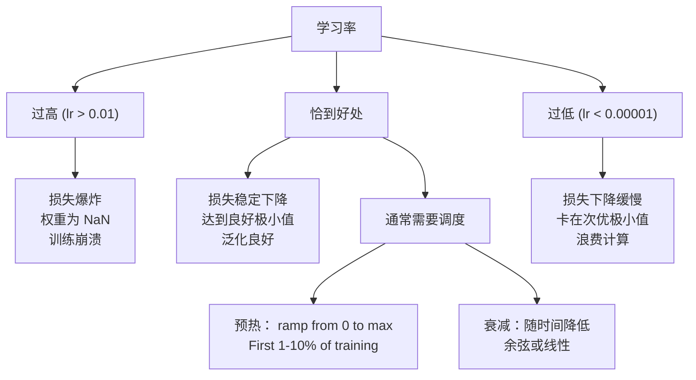
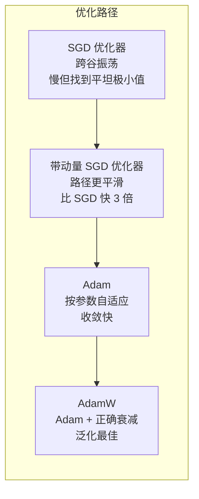
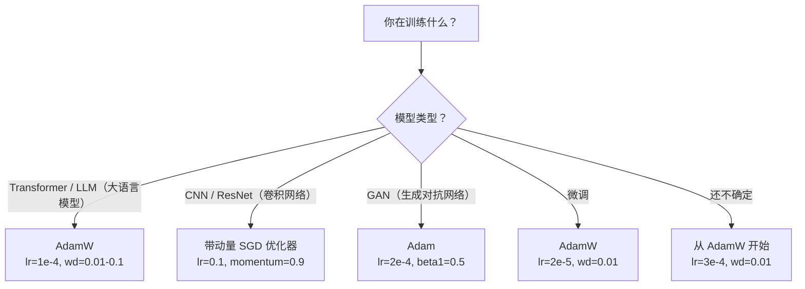

# 优化器

> 梯度下降告诉你往哪走，却不告诉你走多远、多快。SGD 是指南针，Adam 是带路况的 GPS。

**类型：** 构建  
**学习实现：** Python  
**前置课程：** 第 03.05 课（损失函数）  
**预计时间：** 约 75 分钟

## 学习目标

- 从零实现 SGD、带动量 SGD、Adam、AdamW。
- 解释 Adam 偏差校正如何补偿早期零初始化矩估计。
- 演示同任务中 AdamW 为何比带 L2 的 Adam 泛化更好。
- 为 Transformer、CNN、GAN、微调选择优化器及默认超参数。

## 问题

梯度已算出，知道权重 #4,721 应减少 0.003 才能降损失；但 0.003 用什么尺度？第一步和第一千步应走同样远吗？

普通梯度下降对每参数、每一步使用相同学习率 `w=w-lr*gradient`，实践中有三大问题：损失景观像狭长山谷，梯度多指横跨的陡方向，SGD 横向振荡、纵向进展极小；所有参数一个 lr 不合理，欠拟合权重需大更新、接近最优的需小更新；高维鞍点有大片近零梯度平坦区，SGD 几乎无法穿过。

Adam 同时维护每参数的平均梯度（动量，处理振荡）与平均平方梯度（自适应速率，处理尺度），并在最初步骤做偏差校正；默认超参数可处理 80% 问题。本课从零实现，以理解剩余 20% 何时失败。

## 概念

### 随机梯度下降（SGD）

最简单优化器：以 mini-batch 梯度向反方向走：

```
w = w - lr * gradient
```

“随机”指用数据随机子集而非全量估计梯度。噪声有益，可逃离尖锐局部极小，却也导致振荡。学习率唯一旋钮：过高损失发散，过低训练极慢；依架构、数据、batch、训练阶段变化。现代网络 vanilla SGD 常在 0.01–0.1，且单次运行的理想值也会改变。

### 动量

不只用当前梯度，而维护累积历史梯度的速度：

```
m_t = beta * m_{t-1} + gradient
w = w - lr * m_t
```

beta（常 0.9）控制历史量，beta=0.9 大致平均最近 10 个梯度。方向一致的梯度积累、翻转的抵消；狭谷横向分量每步反号被抑制，纵向一致分量被放大，得到顺滑加速。坏条件景观中 SGD 的 10,000 步，0.9 动量通常仅需 3,000–5,000，提升并非边际。

### RMSProp

第一个成功的逐参数自适应学习率法，由 Hinton 在 Coursera 讲座提出：

```
s_t = beta * s_{t-1} + (1 - beta) * gradient^2
w = w - lr * gradient / (sqrt(s_t) + epsilon)
```

s_t 跟踪平方梯度均值，长期大梯度参数被大数除、有效 lr 变小；小梯度参数被小数除、有效 lr 变大，解决“一种 lr 不适合全部参数”。epsilon（常 1e-8）防未更新参数除零。

### Adam：Momentum + RMSProp <!-- learning-atlas: adam-momentum-rmsprop -->

Adam 合并两者，每参数维护两条指数移动平均：

```
m_t = beta1 * m_{t-1} + (1 - beta1) * gradient        (first moment: mean)
v_t = beta2 * v_{t-1} + (1 - beta2) * gradient^2       (second moment: variance)
```

**偏差校正**是关键。第 1 步 m_1=(1-beta1)*gradient，beta1=0.9 时仅真实梯度 0.1 倍，均值尚未 warm up。校正：

```
m_hat = m_t / (1 - beta1^t)
v_hat = v_t / (1 - beta2^t)
```

第 1 步 m_hat=m_1/(1-0.9)=真实梯度；第 100 步校正近 1，消失。校正在前约 10 步重要、50 步后无关。更新为：

```
w = w - lr * m_hat / (sqrt(v_hat) + epsilon)
```

Adam 默认 lr=0.001、beta1=0.9、beta2=0.999、epsilon=1e-8，覆盖 80% 问题；不适用先改 lr、再 beta2，几乎不改 beta1 或 epsilon。

### AdamW：正确的权重衰减

L2 向损失加 lambda*w^2；在 SGD 中等价于每步衰减权重，Adam 中此等价关系失效，因为自适应 lr 也缩放正则项：大梯度方差参数正则更少、小方差参数更多，并非所需的统一正则。

Loshchilov、Hutter 的 AdamW 在 Adam 更新后直接衰减权重：

```
w = w - lr * m_hat / (sqrt(v_hat) + epsilon) - lr * lambda * w
```

`lr*lambda*w` 不受自适应因子缩放，每个参数同样比例收缩。它非小细节：AdamW 几乎在每任务上优于 Adam+L2，是 Transformer、diffusion、现代架构默认；BERT、GPT、LLaMA、Stable Diffusion 都用 AdamW。

### 学习率：最重要超参数



若只调一个超参就调学习率；10 倍 lr 改变比任何架构决定影响更大。常用默认：

- SGD：`lr = 0.01` 到 `0.1`。
- Adam/AdamW：`lr = 1e-4` 到 `3e-4`。
- 微调预训练模型：`lr = 1e-5` 到 `5e-5`。
- 学习率预热：前 1–10% 步线性从 0 升至最大。

### 优化器比较



### 各优化器何时胜出



```figure
optimizer-trajectory
```

## 动手实现

### 步骤 1：Vanilla SGD

```python
class SGD:
    def __init__(self, lr=0.01):
        self.lr = lr

    def step(self, params, grads):
        for i in range(len(params)):
            params[i] -= self.lr * grads[i]
```

### 步骤 2：带动量 SGD

```python
class SGDMomentum:
    def __init__(self, lr=0.01, beta=0.9):
        self.lr = lr
        self.beta = beta
        self.velocities = None

    def step(self, params, grads):
        if self.velocities is None:
            self.velocities = [0.0] * len(params)
        for i in range(len(params)):
            self.velocities[i] = self.beta * self.velocities[i] + grads[i]
            params[i] -= self.lr * self.velocities[i]
```

### 步骤 3：Adam

```python
import math

class Adam:
    def __init__(self, lr=0.001, beta1=0.9, beta2=0.999, epsilon=1e-8):
        self.lr = lr
        self.beta1 = beta1
        self.beta2 = beta2
        self.epsilon = epsilon
        self.m = None
        self.v = None
        self.t = 0

    def step(self, params, grads):
        if self.m is None:
            self.m = [0.0] * len(params)
            self.v = [0.0] * len(params)

        self.t += 1

        for i in range(len(params)):
            self.m[i] = self.beta1 * self.m[i] + (1 - self.beta1) * grads[i]
            self.v[i] = self.beta2 * self.v[i] + (1 - self.beta2) * grads[i] ** 2

            m_hat = self.m[i] / (1 - self.beta1 ** self.t)
            v_hat = self.v[i] / (1 - self.beta2 ** self.t)

            params[i] -= self.lr * m_hat / (math.sqrt(v_hat) + self.epsilon)
```

### 步骤 4：AdamW

```python
class AdamW:
    def __init__(self, lr=0.001, beta1=0.9, beta2=0.999, epsilon=1e-8, weight_decay=0.01):
        self.lr = lr
        self.beta1 = beta1
        self.beta2 = beta2
        self.epsilon = epsilon
        self.weight_decay = weight_decay
        self.m = None
        self.v = None
        self.t = 0

    def step(self, params, grads):
        if self.m is None:
            self.m = [0.0] * len(params)
            self.v = [0.0] * len(params)

        self.t += 1

        for i in range(len(params)):
            self.m[i] = self.beta1 * self.m[i] + (1 - self.beta1) * grads[i]
            self.v[i] = self.beta2 * self.v[i] + (1 - self.beta2) * grads[i] ** 2

            m_hat = self.m[i] / (1 - self.beta1 ** self.t)
            v_hat = self.v[i] / (1 - self.beta2 ** self.t)

            params[i] -= self.lr * m_hat / (math.sqrt(v_hat) + self.epsilon)
            params[i] -= self.lr * self.weight_decay * params[i]
```

### 步骤 5：训练比较

在第 05 课圆形数据集上以四个优化器训练同一两层网络，比较收敛：

```python
import random

def sigmoid(x):
    x = max(-500, min(500, x))
    return 1.0 / (1.0 + math.exp(-x))

def make_circle_data(n=200, seed=42):
    random.seed(seed)
    data = []
    for _ in range(n):
        x = random.uniform(-2, 2)
        y = random.uniform(-2, 2)
        label = 1.0 if x * x + y * y < 1.5 else 0.0
        data.append(([x, y], label))
    return data


class OptimizerTestNetwork:
    def __init__(self, optimizer, hidden_size=8):
        random.seed(0)
        self.hidden_size = hidden_size
        self.optimizer = optimizer

        self.w1 = [[random.gauss(0, 0.5) for _ in range(2)] for _ in range(hidden_size)]
        self.b1 = [0.0] * hidden_size
        self.w2 = [random.gauss(0, 0.5) for _ in range(hidden_size)]
        self.b2 = 0.0

    def get_params(self):
        params = []
        for row in self.w1:
            params.extend(row)
        params.extend(self.b1)
        params.extend(self.w2)
        params.append(self.b2)
        return params

    def set_params(self, params):
        idx = 0
        for i in range(self.hidden_size):
            for j in range(2):
                self.w1[i][j] = params[idx]
                idx += 1
        for i in range(self.hidden_size):
            self.b1[i] = params[idx]
            idx += 1
        for i in range(self.hidden_size):
            self.w2[i] = params[idx]
            idx += 1
        self.b2 = params[idx]

    def forward(self, x):
        self.x = x
        self.z1 = []
        self.h = []
        for i in range(self.hidden_size):
            z = self.w1[i][0] * x[0] + self.w1[i][1] * x[1] + self.b1[i]
            self.z1.append(z)
            self.h.append(max(0.0, z))

        self.z2 = sum(self.w2[i] * self.h[i] for i in range(self.hidden_size)) + self.b2
        self.out = sigmoid(self.z2)
        return self.out

    def compute_grads(self, target):
        eps = 1e-15
        p = max(eps, min(1 - eps, self.out))
        d_loss = -(target / p) + (1 - target) / (1 - p)
        d_sigmoid = self.out * (1 - self.out)
        d_out = d_loss * d_sigmoid

        grads = [0.0] * (self.hidden_size * 2 + self.hidden_size + self.hidden_size + 1)
        idx = 0
        for i in range(self.hidden_size):
            d_relu = 1.0 if self.z1[i] > 0 else 0.0
            d_h = d_out * self.w2[i] * d_relu
            grads[idx] = d_h * self.x[0]
            grads[idx + 1] = d_h * self.x[1]
            idx += 2

        for i in range(self.hidden_size):
            d_relu = 1.0 if self.z1[i] > 0 else 0.0
            grads[idx] = d_out * self.w2[i] * d_relu
            idx += 1

        for i in range(self.hidden_size):
            grads[idx] = d_out * self.h[i]
            idx += 1

        grads[idx] = d_out
        return grads

    def train(self, data, epochs=300):
        losses = []
        for epoch in range(epochs):
            total_loss = 0.0
            correct = 0
            for x, y in data:
                pred = self.forward(x)
                grads = self.compute_grads(y)
                params = self.get_params()
                self.optimizer.step(params, grads)
                self.set_params(params)

                eps = 1e-15
                p = max(eps, min(1 - eps, pred))
                total_loss += -(y * math.log(p) + (1 - y) * math.log(1 - p))
                if (pred >= 0.5) == (y >= 0.5):
                    correct += 1
            avg_loss = total_loss / len(data)
            accuracy = correct / len(data) * 100
            losses.append((avg_loss, accuracy))
            if epoch % 75 == 0 or epoch == epochs - 1:
                print(f"    Epoch {epoch:3d}: loss={avg_loss:.4f}, accuracy={accuracy:.1f}%")
        return losses
```

## 使用现成工具

PyTorch 优化器还处理参数组、梯度裁剪与 lr 调度：

```python
import torch
import torch.optim as optim

model = torch.nn.Sequential(
    torch.nn.Linear(784, 256),
    torch.nn.ReLU(),
    torch.nn.Linear(256, 10),
)

optimizer = optim.AdamW(model.parameters(), lr=3e-4, weight_decay=0.01)

scheduler = optim.lr_scheduler.CosineAnnealingLR(optimizer, T_max=100)

for epoch in range(100):
    optimizer.zero_grad()
    output = model(torch.randn(32, 784))
    loss = torch.nn.functional.cross_entropy(output, torch.randint(0, 10, (32,)))
    loss.backward()
    torch.nn.utils.clip_grad_norm_(model.parameters(), max_norm=1.0)
    optimizer.step()
    scheduler.step()
```

顺序永远是：zero_grad、forward、loss、backward、（clip）、step、（schedule）。记住它；顺序错（如 scheduler.step 在 optimizer.step 前）是常见隐蔽 bug。

CNN 中许多人仍偏好 SGD+momentum（lr=0.1、momentum=0.9、weight_decay=1e-4）加 step/cosine schedule，因为 SGD 找到更平坦、常泛化更好的极小；Transformer/LLM 的通用默认是 AdamW 加 warmup+cosine decay，不要无测量理由地反对共识。

## 交付成果

- `outputs/prompt-optimizer-selector.md`——为任意架构选择优化器和学习率的决策提示词。

## 练习

1. 实现 Nesterov 动量：在 lookahead 位置 `w-lr*beta*v` 而非当前位置求梯度，与标准动量在圆数据上比较收敛。
2. 实现前 10% 步从 0 到 max_lr 的线性 warmup，后续 cosine 衰减到 0；比较 Adam 有无 warmup 达到 90% 准确率所需 epoch。
3. 跟踪 Adam 每参数有效 lr `lr*m_hat/(sqrt(v_hat)+eps)`，在 10、50、200 步画分布；所有参数更新速度相同吗？
4. 实现全局范数梯度裁剪，最大 1.0；高 lr=0.01 Adam 有/无裁剪、10 个种子统计发散（loss NaN）次数。
5. 大权重 [-5,5] 初始化，200 epoch、weight_decay=0.1 比较 Adam/AdamW，画权重 L2 范数；AdamW 应更快收缩。

## 核心术语

| 术语 | 常见说法 | 实际含义 |
|------|----------------|----------------------|
| 学习率 | “步长” | 梯度更新的标量乘数，训练中影响最大的超参数。 |
| SGD | “基础梯度下降” | 随机梯度下降：以 mini-batch 算 lr*gradient 并从权重减去。 |
| 动量 | “滚球类比” | 过去梯度的指数移动平均，抑制振荡、加速一致方向。 |
| RMSProp | “自适应学习率” | 用近期梯度的 RMS 除每参数梯度，均衡学习速率。 |
| Adam | “默认优化器” | 结合动量一阶矩、RMSProp 二阶矩并对初始步偏差校正。 |
| AdamW | “正确的 Adam” | 解耦权重衰减的 Adam，直接正则权重而非经梯度。 |
| 偏差校正 | “移动均值 warmup” | 以 `(1-beta^t)` 除，补偿 Adam 矩从零初始化。 |
| 权重衰减 | “收缩权重” | 每步减去权重值的一小部分、惩罚大权重的正则化。 |
| 学习率调度 | “随时间改变 lr” | 训练中调整学习率的函数，warmup+cosine 是现代默认。 |
| 梯度裁剪 | “限制梯度范数” | 范数超阈值时缩小梯度向量，防梯度爆炸更新。 |

## 延伸阅读

- Kingma 与 Ba，《Adam: A Method for Stochastic Optimization》（2014）——原始 Adam、收敛分析和偏差校正推导。
- Loshchilov 与 Hutter，《Decoupled Weight Decay Regularization》（2017）——证明 Adam 中 L2 与 weight decay 不等价、提出 AdamW。
- Smith，《Cyclical Learning Rates for Training Neural Networks》（2017）——提出 LR range test、周期调度，减少固定 lr 调参需求。
- Ruder，《An Overview of Gradient Descent Optimization Algorithms》（2016）——优化器变体最好的单篇综述。
