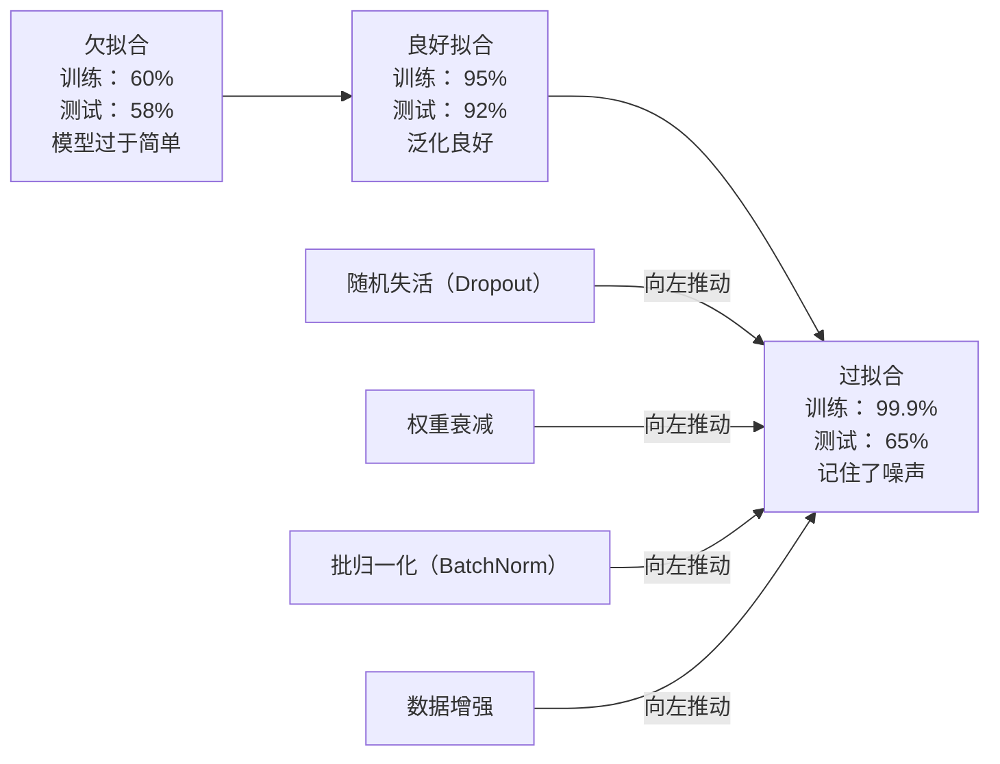
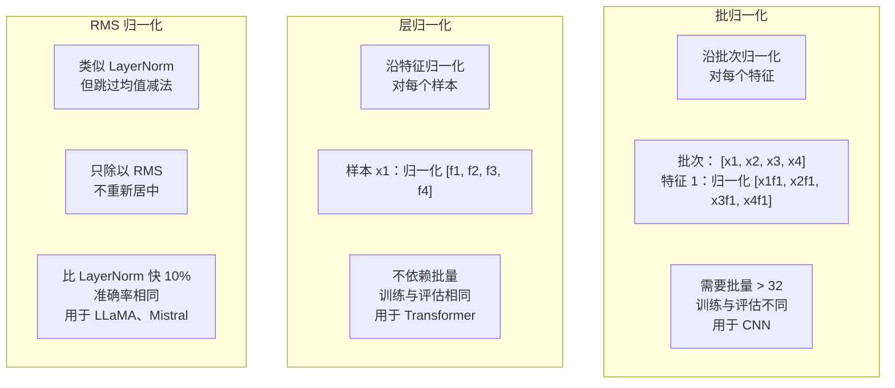
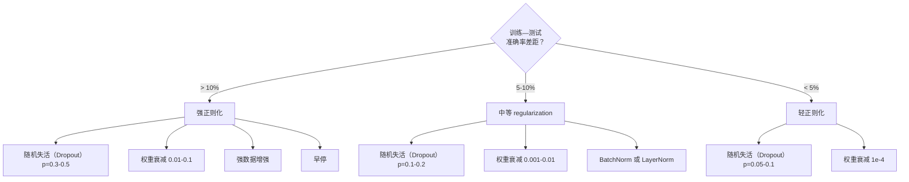

# 正则化

> 你的模型在训练数据上达到 99%，测试数据上却只有 60%。它是在记忆，而不是学习。正则化是你向复杂度征收的税，用它迫使模型实现泛化。

**类型：** 构建  
**学习实现：** Python  
**前置课程：** 第 03.06 课（优化器）  
**预计时间：** 约 75 分钟

## 学习目标

- 从零实现带反向缩放的 Dropout、L2 权重衰减、批归一化、层归一化和 RMSNorm。
- 通过正则化实验测量训练—测试准确率差距，并诊断过拟合。
- 解释 Transformer 为什么使用 LayerNorm 而非 BatchNorm，以及现代 LLM 为什么偏好 RMSNorm。
- 根据过拟合的严重程度，组合使用恰当的正则化技术。

## 问题

参数足够多的神经网络可以记住任何数据集。这不是假设：Zhang 等人（2017）在 ImageNet 的随机标签上训练标准网络，证明了这一点。网络在完全随机的标签分配上也获得了接近零的训练损失。它们记住了一百万个没有可学习模式的随机输入—输出对。训练损失完美，测试准确率却为零。

这就是过拟合问题；模型越大，问题越严重。GPT-3 有 1750 亿参数，训练集约有 5000 亿个 token。如此多的参数足以让模型逐字记住训练数据中的大量片段。没有正则化，它只会复述训练示例，而非学习可泛化的模式。

训练表现和测试表现之间的差就是过拟合差距。本课的每种技术都从不同角度缩小该差距：Dropout 让网络不能依赖任一单独神经元；权重衰减避免任一权重增长过大；批归一化平滑损失景观，使优化器找到更平坦、泛化更好的极小值；层归一化有相同作用，却适用于批归一化失效的场景（小批次、变长序列）；RMSNorm 省去均值计算，速度快约 10%。每项技术都很简单，但它们共同决定模型是在记忆还是在泛化。

## 概念

### 过拟合谱系

每个模型都位于从欠拟合（过于简单，无法捕捉模式）到过拟合（过于复杂，连噪声也捕捉）的谱系上。理想位置在中间；正则化从过拟合一侧把模型推向这个位置。



### Dropout

这是最简单、解释也最优雅的正则化技术。训练时，以概率 p 将每个神经元的输出随机设为零。

```
output = activation(z) * mask    where mask[i] ~ Bernoulli(1 - p)
```

当 p = 0.5 时，每次前向传播都会置零一半神经元。网络必须学习冗余表征，因为它无法预测哪些神经元可用。这防止了协同适应（co-adaptation）——神经元学会依赖某些特定其他神经元存在的情况。

从集成的角度看：拥有 N 个神经元并使用 dropout 的网络会产生 2^N 个可能子网络（即哪些神经元开或关的每一种组合）。带 dropout 的训练近似于同时训练所有 2^N 个子网络，每个子网络使用不同的小批次。测试时使用全部神经元（不做 dropout），再以 (1 - p) 缩放输出以匹配训练期间的期望值。这等价于平均 2^N 个子网络的预测——用一个模型得到规模巨大的集成。

实践中，缩放在训练时而非测试时完成（反向 Dropout）：

```
During training:  output = activation(z) * mask / (1 - p)
During testing:   output = activation(z)   (no change needed)
```

这样更简洁，因为测试代码完全不必知道 dropout 的存在。

默认概率为：Transformer 使用 p = 0.1，MLP 使用 p = 0.5，CNN 使用 p = 0.2–0.3。Dropout 越高，正则化越强，欠拟合风险也越高。

### 权重衰减（L2 正则化） <!-- learning-atlas: weight-decay-l2-regularization -->

把所有权重的平方大小加入损失：

```
total_loss = task_loss + (lambda / 2) * sum(w_i^2)
```

正则化项的梯度是 lambda * w。因此在每一步中，每个权重都会按与其大小成正比的比例向零收缩。大权重受到的惩罚更强，模型被推向没有单一权重占主导的解。

为什么这能改善泛化：过拟合模型往往有放大训练数据噪声的大权重。权重衰减保持权重较小，限制模型的有效容量，迫使它依赖稳健、可泛化的特征，而非被记住的细枝末节。

超参数 lambda 控制强度。典型取值：

- Transformer 的 AdamW：0.01。
- CNN 的 SGD：1e-4。
- 严重过拟合模型：0.1。

如第 06 课所述，权重衰减和 L2 正则化在 SGD 中等价，在 Adam 中却不等价。使用 Adam 训练时，应始终使用 AdamW（解耦的权重衰减）。

### 批归一化

在将一层输出传给下一层前，沿小批次维度将其归一化。

对于某一层的一批激活值：

```
mu = (1/B) * sum(x_i)           (batch mean)
sigma^2 = (1/B) * sum((x_i - mu)^2)   (batch variance)
x_hat = (x_i - mu) / sqrt(sigma^2 + eps)   (normalize)
y = gamma * x_hat + beta        (scale and shift)
```

Gamma 和 beta 是可学习参数，允许网络在最佳时撤销归一化。没有它们，你会强制每层输出都是零均值、单位方差，而这未必是网络需要的。

**训练与推理的分离：** 训练期间，mu 和 sigma 来自当前小批次；推理期间，使用训练中累积的滑动平均（动量 = 0.1 的指数移动平均，即 90% 旧值 + 10% 新值）。

BatchNorm 为何有效仍有争议。原论文称它减少了“内部协变量偏移”（较早层更新时，层输入分布发生变化）。Santurkar 等人（2018）表明这个解释并不正确。真正的原因是：BatchNorm 让损失景观更平滑，梯度的预测性更好，Lipschitz 常数更小，优化器可以安全地走更大的步长。这就是 BatchNorm 允许更高学习率并更快收敛的原因。

BatchNorm 有根本限制：它依赖批统计量。批量大小为 1 时，均值和方差没有意义；小批量（< 32）时，统计量噪声很大并会损害性能。这对目标检测（内存限制批量大小）和语言建模（序列长度不同）等任务很重要。

### 层归一化

沿特征维度而非批次维度归一化。对于单个样本：

```
mu = (1/D) * sum(x_j)           (feature mean)
sigma^2 = (1/D) * sum((x_j - mu)^2)   (feature variance)
x_hat = (x_j - mu) / sqrt(sigma^2 + eps)
y = gamma * x_hat + beta
```

D 是特征维度。每个样本都独立归一化，不依赖批量大小。这正是 Transformer 使用 LayerNorm 而非 BatchNorm 的原因：序列长度可变，批量通常很小（生成时甚至为 1），并且训练与推理的计算完全相同。

Transformer 在每个自注意力块和每个前馈块之后应用 LayerNorm（Post-LN），或在它们之前应用（Pre-LN；训练更稳定）。

### RMSNorm

LayerNorm 去掉均值减法后的形式，由 Zhang 与 Sennrich（2019）提出。

```
rms = sqrt((1/D) * sum(x_j^2))
y = gamma * x / rms
```

仅此而已：不计算均值，也没有 beta 参数。其观察是，LayerNorm 的重新居中（减去均值）对模型性能贡献很小，却需要计算成本。去掉它能在准确率相同的条件下减少约 10% 的开销。

LLaMA、LLaMA 2、LLaMA 3、Mistral 和大多数现代 LLM 都使用 RMSNorm 而不是 LayerNorm。参数达到数十亿、token 达到数万亿时，这 10% 的节省相当重要。

### 归一化对比



### 将数据增强作为正则化

它不改变模型，而是改变数据：在保持标签不变的前提下变换训练输入。

- 图像：随机裁剪、翻转、旋转、颜色抖动、cutout。
- 文本：同义词替换、回译、随机删除。
- 音频：时间拉伸、音高偏移、添加噪声。

效果与正则化相同：它增加训练集的有效规模，使模型更难记住具体示例。只以原始形式看一次每张图像的模型可以记住它；看过每张图像的 50 个增强版本的模型，则被迫学习不变结构。

### 早停

最简单的正则器是：当验证损失开始上升时停止训练，此时模型尚未过拟合。实践中，每个 epoch 跟踪验证损失、保存最佳模型，并在一个“耐心”窗口（通常 5–20 个 epoch）内继续训练。若验证损失在该窗口内没有改善，就停止并加载保存的最佳模型。

### 何时使用什么



```figure
l2-regularization
```

## 构建实现

### 步骤 1：Dropout（训练与评估模式）

```python
import random
import math


class Dropout:
    def __init__(self, p=0.5):
        self.p = p
        self.training = True
        self.mask = None

    def forward(self, x):
        if not self.training:
            return list(x)
        self.mask = []
        output = []
        for val in x:
            if random.random() < self.p:
                self.mask.append(0)
                output.append(0.0)
            else:
                self.mask.append(1)
                output.append(val / (1 - self.p))
        return output

    def backward(self, grad_output):
        grads = []
        for g, m in zip(grad_output, self.mask):
            if m == 0:
                grads.append(0.0)
            else:
                grads.append(g / (1 - self.p))
        return grads
```

### 步骤 2：L2 权重衰减

```python
def l2_regularization(weights, lambda_reg):
    penalty = 0.0
    for w in weights:
        penalty += w * w
    return lambda_reg * 0.5 * penalty

def l2_gradient(weights, lambda_reg):
    return [lambda_reg * w for w in weights]
```

### 步骤 3：批归一化

```python
class BatchNorm:
    def __init__(self, num_features, momentum=0.1, eps=1e-5):
        self.gamma = [1.0] * num_features
        self.beta = [0.0] * num_features
        self.eps = eps
        self.momentum = momentum
        self.running_mean = [0.0] * num_features
        self.running_var = [1.0] * num_features
        self.training = True
        self.num_features = num_features

    def forward(self, batch):
        batch_size = len(batch)
        if self.training:
            mean = [0.0] * self.num_features
            for sample in batch:
                for j in range(self.num_features):
                    mean[j] += sample[j]
            mean = [m / batch_size for m in mean]

            var = [0.0] * self.num_features
            for sample in batch:
                for j in range(self.num_features):
                    var[j] += (sample[j] - mean[j]) ** 2
            var = [v / batch_size for v in var]

            for j in range(self.num_features):
                self.running_mean[j] = (1 - self.momentum) * self.running_mean[j] + self.momentum * mean[j]
                self.running_var[j] = (1 - self.momentum) * self.running_var[j] + self.momentum * var[j]
        else:
            mean = list(self.running_mean)
            var = list(self.running_var)

        self.x_hat = []
        output = []
        for sample in batch:
            normalized = []
            out_sample = []
            for j in range(self.num_features):
                x_h = (sample[j] - mean[j]) / math.sqrt(var[j] + self.eps)
                normalized.append(x_h)
                out_sample.append(self.gamma[j] * x_h + self.beta[j])
            self.x_hat.append(normalized)
            output.append(out_sample)
        return output
```

### 步骤 4：层归一化

```python
class LayerNorm:
    def __init__(self, num_features, eps=1e-5):
        self.gamma = [1.0] * num_features
        self.beta = [0.0] * num_features
        self.eps = eps
        self.num_features = num_features

    def forward(self, x):
        mean = sum(x) / len(x)
        var = sum((xi - mean) ** 2 for xi in x) / len(x)

        self.x_hat = []
        output = []
        for j in range(self.num_features):
            x_h = (x[j] - mean) / math.sqrt(var + self.eps)
            self.x_hat.append(x_h)
            output.append(self.gamma[j] * x_h + self.beta[j])
        return output
```

### 步骤 5：RMSNorm

```python
class RMSNorm:
    def __init__(self, num_features, eps=1e-6):
        self.gamma = [1.0] * num_features
        self.eps = eps
        self.num_features = num_features

    def forward(self, x):
        rms = math.sqrt(sum(xi * xi for xi in x) / len(x) + self.eps)
        output = []
        for j in range(self.num_features):
            output.append(self.gamma[j] * x[j] / rms)
        return output
```

### 步骤 6：带与不带正则化的训练

```python
def sigmoid(x):
    x = max(-500, min(500, x))
    return 1.0 / (1.0 + math.exp(-x))


def make_circle_data(n=200, seed=42):
    random.seed(seed)
    data = []
    for _ in range(n):
        x = random.uniform(-2, 2)
        y = random.uniform(-2, 2)
        label = 1.0 if x * x + y * y < 1.5 else 0.0
        data.append(([x, y], label))
    return data


class RegularizedNetwork:
    def __init__(self, hidden_size=16, lr=0.05, dropout_p=0.0, weight_decay=0.0):
        random.seed(0)
        self.hidden_size = hidden_size
        self.lr = lr
        self.dropout_p = dropout_p
        self.weight_decay = weight_decay
        self.dropout = Dropout(p=dropout_p) if dropout_p > 0 else None

        self.w1 = [[random.gauss(0, 0.5) for _ in range(2)] for _ in range(hidden_size)]
        self.b1 = [0.0] * hidden_size
        self.w2 = [random.gauss(0, 0.5) for _ in range(hidden_size)]
        self.b2 = 0.0

    def forward(self, x, training=True):
        self.x = x
        self.z1 = []
        self.h = []
        for i in range(self.hidden_size):
            z = self.w1[i][0] * x[0] + self.w1[i][1] * x[1] + self.b1[i]
            self.z1.append(z)
            self.h.append(max(0.0, z))

        if self.dropout and training:
            self.dropout.training = True
            self.h = self.dropout.forward(self.h)
        elif self.dropout:
            self.dropout.training = False
            self.h = self.dropout.forward(self.h)

        self.z2 = sum(self.w2[i] * self.h[i] for i in range(self.hidden_size)) + self.b2
        self.out = sigmoid(self.z2)
        return self.out

    def backward(self, target):
        eps = 1e-15
        p = max(eps, min(1 - eps, self.out))
        d_loss = -(target / p) + (1 - target) / (1 - p)
        d_sigmoid = self.out * (1 - self.out)
        d_out = d_loss * d_sigmoid

        for i in range(self.hidden_size):
            d_relu = 1.0 if self.z1[i] > 0 else 0.0
            d_h = d_out * self.w2[i] * d_relu
            self.w2[i] -= self.lr * (d_out * self.h[i] + self.weight_decay * self.w2[i])
            for j in range(2):
                self.w1[i][j] -= self.lr * (d_h * self.x[j] + self.weight_decay * self.w1[i][j])
            self.b1[i] -= self.lr * d_h
        self.b2 -= self.lr * d_out

    def evaluate(self, data):
        correct = 0
        total_loss = 0.0
        for x, y in data:
            pred = self.forward(x, training=False)
            eps = 1e-15
            p = max(eps, min(1 - eps, pred))
            total_loss += -(y * math.log(p) + (1 - y) * math.log(1 - p))
            if (pred >= 0.5) == (y >= 0.5):
                correct += 1
        return total_loss / len(data), correct / len(data) * 100

    def train_model(self, train_data, test_data, epochs=300):
        history = []
        for epoch in range(epochs):
            total_loss = 0.0
            correct = 0
            for x, y in train_data:
                pred = self.forward(x, training=True)
                self.backward(y)
                eps = 1e-15
                p = max(eps, min(1 - eps, pred))
                total_loss += -(y * math.log(p) + (1 - y) * math.log(1 - p))
                if (pred >= 0.5) == (y >= 0.5):
                    correct += 1
            train_loss = total_loss / len(train_data)
            train_acc = correct / len(train_data) * 100
            test_loss, test_acc = self.evaluate(test_data)
            history.append((train_loss, train_acc, test_loss, test_acc))
            if epoch % 75 == 0 or epoch == epochs - 1:
                gap = train_acc - test_acc
                print(f"    Epoch {epoch:3d}: train_acc={train_acc:.1f}%, test_acc={test_acc:.1f}%, gap={gap:.1f}%")
        return history
```

## 应用

PyTorch 已将全部归一化和正则化功能做成模块：

```python
import torch
import torch.nn as nn

model = nn.Sequential(
    nn.Linear(784, 256),
    nn.BatchNorm1d(256),
    nn.ReLU(),
    nn.Dropout(0.3),
    nn.Linear(256, 128),
    nn.BatchNorm1d(128),
    nn.ReLU(),
    nn.Dropout(0.3),
    nn.Linear(128, 10),
)

model.train()
out_train = model(torch.randn(32, 784))

model.eval()
out_test = model(torch.randn(1, 784))
```

`model.train()` / `model.eval()` 的切换至关重要。它会开关 dropout，并通知 BatchNorm 使用批统计量还是滑动统计量。推理前忘记调用 `model.eval()` 是深度学习最常见的错误之一：测试准确率会随机波动，因为 dropout 仍在生效，BatchNorm 仍在使用小批次统计量。

对于 Transformer，模式不同：

```python
class TransformerBlock(nn.Module):
    def __init__(self, d_model=512, nhead=8, dropout=0.1):
        super().__init__()
        self.attention = nn.MultiheadAttention(d_model, nhead, dropout=dropout)
        self.norm1 = nn.LayerNorm(d_model)
        self.ff = nn.Sequential(
            nn.Linear(d_model, d_model * 4),
            nn.GELU(),
            nn.Linear(d_model * 4, d_model),
            nn.Dropout(dropout),
        )
        self.norm2 = nn.LayerNorm(d_model)
        self.dropout = nn.Dropout(dropout)

    def forward(self, x):
        attended, _ = self.attention(x, x, x)
        x = self.norm1(x + self.dropout(attended))
        x = self.norm2(x + self.ff(x))
        return x
```

使用 LayerNorm，而非 BatchNorm；Dropout p=0.1，而非 p=0.5。这些是 Transformer 的默认值。

## 交付物

本课产出：

- `outputs/prompt-regularization-advisor.md`——用于诊断过拟合并推荐合适正则化策略的提示词。

## 练习

1. 为二维数据实现 spatial dropout：不丢弃单个神经元，而是丢弃整个特征通道。把连续特征组当作通道并丢弃整个组来模拟它。使用 `hidden_size=32` 在圆形数据集上比较其与标准 dropout 的训练—测试差距。

2. 将第 05 课的标签平滑与本课 Dropout 结合。训练四种配置：两者都不用、仅 dropout、仅标签平滑、两者都用。测量每一种最终训练—测试准确率差距。哪种组合的差距最小？

3. 在圆形数据集网络中，于隐藏层与激活之间加入 BatchNorm。分别在学习率 0.01、0.05、0.1 下带与不带 BatchNorm 训练。在原始网络发散的较高学习率下，BatchNorm 应能保持稳定训练。

4. 实现早停：每个 epoch 跟踪测试损失，保存最佳权重；若测试损失连续 20 个 epoch 没有改善，就停止。在正则化网络上运行 1000 个 epoch，报告测试准确率最佳的 epoch，以及节省了多少个 epoch 的计算。

5. 在 4 层网络（而非仅 2 层）上比较 LayerNorm 与 RMSNorm。两者用同一组权重初始化，训练 200 个 epoch，比较最终准确率、训练速度（每 epoch 时间）和第一层的梯度大小。验证 RMSNorm 在准确率相同的情况下速度更快。

## 关键术语

| 术语 | 常见说法 | 实际含义 |
|------|----------|----------|
| 过拟合 | “模型记住了数据” | 模型训练表现显著优于测试表现，说明它学习到的是噪声而非信号 |
| 正则化 | “防止过拟合” | 约束模型复杂度以改善泛化的任何技术：dropout、权重衰减、归一化、增强等 |
| Dropout | “随机删除神经元” | 训练时以概率 p 将随机神经元置零，强制形成冗余表征；等价于训练一个集成 |
| 权重衰减 | “L2 惩罚” | 每步减去 lambda * w，使所有权重向零收缩；通过权重大小惩罚复杂度 |
| 批归一化 | “按批归一化” | 沿批次维度用批统计量归一化层输出；训练时用批统计量，推理时用滑动平均 |
| 层归一化 | “按样本归一化” | 在每个样本内部沿特征归一化；不依赖批量大小，适用于批量变化的 Transformer |
| RMSNorm | “不减均值的 LayerNorm” | 均方根归一化；从 LayerNorm 中删去均值减法，以相同准确率换取约 10% 加速 |
| 早停 | “过拟合前停止” | 验证损失不再改善时停止训练；最简单的正则器，常与其他方法一起使用 |
| 数据增强 | “用少量数据得到更多数据” | 变换训练输入（翻转、裁剪、噪声），增大有效数据集并迫使模型学习不变性 |
| 泛化差距 | “训练—测试差异” | 训练与测试表现的差值；正则化旨在最小化该差距 |

## 延伸阅读

- Srivastava 等，《Dropout: A Simple Way to Prevent Neural Networks from Overfitting》（2014）——原始 Dropout 论文，提出集成解释并给出大量实验。
- Ioffe 与 Szegedy，《Batch Normalization: Accelerating Deep Network Training by Reducing Internal Covariate Shift》（2015）——介绍 BatchNorm 及其训练过程，是被引用最多的深度学习论文之一。
- Zhang 与 Sennrich，《Root Mean Square Layer Normalization》（2019）——表明 RMSNorm 以较少计算达到与 LayerNorm 相同的准确率；后被 LLaMA 和 Mistral 采用。
- Zhang 等，《Understanding Deep Learning Requires Rethinking Generalization》（2017）——里程碑论文，说明神经网络可以记忆随机标签，挑战传统泛化观点。
