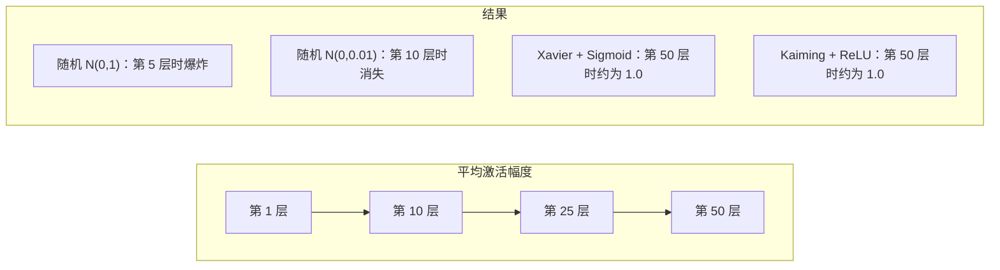
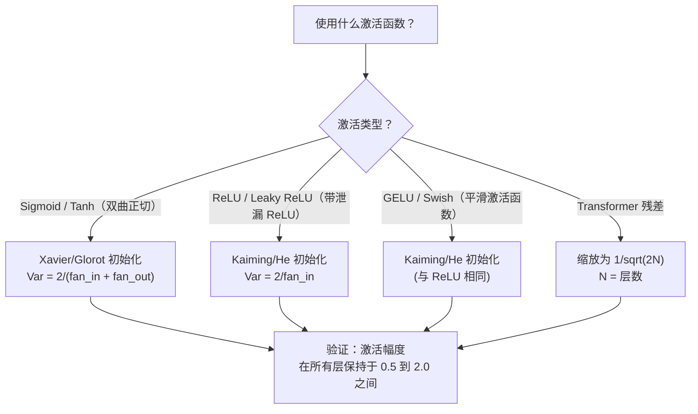

# 权重初始化与训练稳定性

> 初始化错了，训练根本不会开始；初始化正确，50 层网络也能像 3 层一样平稳训练。

**类型：** 构建  
**学习实现：** Python  
**前置课程：** 第 03.04 课（激活函数）、第 03.07 课（正则化）  
**预计时间：** 约 90 分钟

## 学习目标

- 实现零、随机、Xavier/Glorot 和 Kaiming/He 初始化策略，并测量它们穿过 50 层后对激活值大小的影响。
- 推导 Xavier 初始化为何使用 Var(w) = 2/(fan_in + fan_out)，Kaiming 为何使用 Var(w) = 2/fan_in。
- 演示零初始化的对称性问题，并解释为什么仅随机缩放仍不够。
- 为正确的激活函数匹配初始化策略：sigmoid/tanh 用 Xavier，ReLU/GELU 用 Kaiming。

## 问题

把所有权重初始化为零，什么也学不到。每个神经元计算相同函数、收到相同梯度、以相同方式更新。即使经过 10,000 个 epoch，你的 512 神经元隐藏层仍是同一个神经元的 512 份副本：付出了 512 个参数的代价，得到的却只有 1 个。

把权重初始化得太大，激活会在网络中爆炸。到第 10 层，数值可能达到 1e15；到第 20 层，会溢出为无穷大。梯度在反向传播时沿相同轨迹发生问题。

从标准正态分布随机初始化，3 层网络能工作；50 层时，信号会坍缩为零或爆炸为无穷大，取决于随机尺度是略小还是略大。“能工作”与“已损坏”的界线极窄。

权重初始化是深度学习中最被低估的决策。架构有论文，优化器有博客，初始化只得到脚注；但若初始化错误，其余一切都无关紧要——网络在训练开始前就已经死了。

## 概念

### 对称性问题

一层中的每个神经元结构相同：输入乘权重、加偏置、应用激活函数。若所有权重从相同值开始（零是极端情况），每个神经元都会计算相同输出。反向传播时，它们接收相同梯度；更新时，它们以相同幅度改变。

你被困住了：网络有数百个参数，却步调一致地移动。这称为对称性；随机初始化是打破它的直接办法。每个神经元从权重空间的不同位置出发，因此学习不同特征。

但“随机”还不够，随机性的*尺度*决定网络是否能训练。

### 方差在层间的传播 <!-- learning-atlas: variance-propagation-through-layers -->

考虑一个有 fan_in 个输入的单层：

```
z = w1*x1 + w2*x2 + ... + w_n*x_n
```

若每个权重 wi 来自方差 Var(w) 的分布、每个输入 xi 的方差为 Var(x)，输出方差为：

```
Var(z) = fan_in * Var(w) * Var(x)
```

若 Var(w) = 1、fan_in = 512，输出方差会是输入方差的 512 倍。经过 10 层：512^10 = 1.2e27，信号爆炸。

若 Var(w) = 0.001，输出方差每层缩小 0.001 * 512 = 0.512 倍。经过 10 层：0.512^10 = 0.00013，信号消失。

目标是选择 Var(w)，使 Var(z) = Var(x)，让信号大小跨层保持不变。

### Xavier/Glorot 初始化

Glorot 与 Bengio（2010）为 sigmoid 和 tanh 激活函数推导出了解法。为在前向和反向传播中都保持方差恒定：

```
Var(w) = 2 / (fan_in + fan_out)
```

实践中，权重取自：

```
w ~ Uniform(-limit, limit)  where limit = sqrt(6 / (fan_in + fan_out))
```

或：

```
w ~ Normal(0, sqrt(2 / (fan_in + fan_out)))
```

它之所以有效，是因为 sigmoid 和 tanh 在零点附近（正确初始化的激活通常所在的位置）近似线性。方差可在几十层中保持稳定。

### Kaiming/He 初始化

ReLU 会丢弃一半输出（所有负值变为零），所以有效 fan_in 减半：平均一半输入被置零。Xavier 初始化没有考虑这一点，低估了所需方差。

He 等人（2015）调整公式为：

```
Var(w) = 2 / fan_in
```

权重取自：

```
w ~ Normal(0, sqrt(2 / fan_in))
```

因子 2 补偿 ReLU 将一半激活置零的作用。没有它，信号每层约缩小 0.5 倍；50 层后为 0.5^50 = 8.8e-16。Kaiming 初始化正是为防止这一点。

### Transformer 初始化

GPT-2 引入了不同模式。残差连接会将每个子层输出加到输入上：

```
x = x + sublayer(x)
```

每次相加都会增大方差。N 个残差层时，方差大致随 N 增长。GPT-2 将残差层权重缩放为 1/sqrt(2N)，N 为层数，从而保持累积信号大小稳定。

Llama 3（405B 参数、126 层）使用类似方案；没有这个缩放，残差流会在 126 层注意力和前馈块中无界增长。

```mermaid
flowchart TD
    subgraph "零初始化"
        Z1["第 1 层<br/>全部权重 = 0"] --> Z2["第 2 层<br/>所有神经元相同"]
        Z2 --> Z3["第 3 层<br/>仍然相同"]
        Z3 --> ZR["结果：仅 1 个有效神经元<br/>与宽度无关"]
    end

    subgraph "Xavier 初始化"
        X1["第 1 层<br/>Var = 2/(fan_in+fan_out)"] --> X2["第 2 层<br/>信号稳定"]
        X2 --> X3["第 50 层<br/>信号稳定"]
        X3 --> XR["结果：可用<br/>sigmoid/tanh 训练"]
    end

    subgraph "Kaiming 初始化"
        K1["第 1 层<br/>Var = 2/fan_in"] --> K2["第 2 层<br/>信号稳定"]
        K2 --> K3["第 50 层<br/>信号稳定"]
        K3 --> KR["结果：可用<br/>ReLU/GELU 训练"]
    end
```



### 穿过 50 层的激活大小



### 选择正确的初始化



```figure
weight-init-variance
```

## 构建实现

### 步骤 1：初始化策略

初始化权重矩阵的四种方法。每种方法都返回列表的列表（二维矩阵），其列数为 fan_in、行数为 fan_out。

```python
import math
import random


def zero_init(fan_in, fan_out):
    return [[0.0 for _ in range(fan_in)] for _ in range(fan_out)]


def random_init(fan_in, fan_out, scale=1.0):
    return [[random.gauss(0, scale) for _ in range(fan_in)] for _ in range(fan_out)]


def xavier_init(fan_in, fan_out):
    std = math.sqrt(2.0 / (fan_in + fan_out))
    return [[random.gauss(0, std) for _ in range(fan_in)] for _ in range(fan_out)]


def kaiming_init(fan_in, fan_out):
    std = math.sqrt(2.0 / fan_in)
    return [[random.gauss(0, std) for _ in range(fan_in)] for _ in range(fan_out)]
```

### 步骤 2：激活函数

我们需要 sigmoid、tanh 和 ReLU，才能让每种初始化策略搭配其预定的激活函数进行测试。

```python
def sigmoid(x):
    x = max(-500, min(500, x))
    return 1.0 / (1.0 + math.exp(-x))


def tanh_act(x):
    return math.tanh(x)


def relu(x):
    return max(0.0, x)
```

### 步骤 3：穿过 50 层的前向传播

让随机数据通过深层网络，并测量每一层的平均激活大小。

```python
def forward_deep(init_fn, activation_fn, n_layers=50, width=64, n_samples=100):
    random.seed(42)
    layer_magnitudes = []

    inputs = [[random.gauss(0, 1) for _ in range(width)] for _ in range(n_samples)]

    for layer_idx in range(n_layers):
        weights = init_fn(width, width)
        biases = [0.0] * width

        new_inputs = []
        for sample in inputs:
            output = []
            for neuron_idx in range(width):
                z = sum(weights[neuron_idx][j] * sample[j] for j in range(width)) + biases[neuron_idx]
                output.append(activation_fn(z))
            new_inputs.append(output)
        inputs = new_inputs

        magnitudes = []
        for sample in inputs:
            magnitudes.append(sum(abs(v) for v in sample) / width)
        mean_mag = sum(magnitudes) / len(magnitudes)
        layer_magnitudes.append(mean_mag)

    return layer_magnitudes
```

### 步骤 4：实验

运行所有组合：零初始化、随机 N(0,1)、随机 N(0,0.01)、Xavier + sigmoid、Xavier + tanh、Kaiming + ReLU，并打印关键层的大小。

```python
def run_experiment():
    configs = [
        ("Zero init + Sigmoid", lambda fi, fo: zero_init(fi, fo), sigmoid),
        ("Random N(0,1) + ReLU", lambda fi, fo: random_init(fi, fo, 1.0), relu),
        ("Random N(0,0.01) + ReLU", lambda fi, fo: random_init(fi, fo, 0.01), relu),
        ("Xavier + Sigmoid", xavier_init, sigmoid),
        ("Xavier + Tanh", xavier_init, tanh_act),
        ("Kaiming + ReLU", kaiming_init, relu),
    ]

    print(f"{'Strategy':<30} {'L1':>10} {'L5':>10} {'L10':>10} {'L25':>10} {'L50':>10}")
    print("-" * 80)

    for name, init_fn, act_fn in configs:
        mags = forward_deep(init_fn, act_fn)
        row = f"{name:<30}"
        for idx in [0, 4, 9, 24, 49]:
            val = mags[idx]
            if val > 1e6:
                row += f" {'EXPLODED':>10}"
            elif val < 1e-6:
                row += f" {'VANISHED':>10}"
            else:
                row += f" {val:>10.4f}"
        print(row)
```

### 步骤 5：对称性演示

展示零初始化如何产生完全相同的神经元。

```python
def symmetry_demo():
    random.seed(42)
    weights = zero_init(2, 4)
    biases = [0.0] * 4

    inputs = [0.5, -0.3]
    outputs = []
    for neuron_idx in range(4):
        z = sum(weights[neuron_idx][j] * inputs[j] for j in range(2)) + biases[neuron_idx]
        outputs.append(sigmoid(z))

    print("\nSymmetry Demo (4 neurons, zero init):")
    for i, out in enumerate(outputs):
        print(f"  Neuron {i}: output = {out:.6f}")
    all_same = all(abs(outputs[i] - outputs[0]) < 1e-10 for i in range(len(outputs)))
    print(f"  All identical: {all_same}")
    print(f"  Effective parameters: 1 (not {len(weights) * len(weights[0])})")
```

### 步骤 6：逐层大小报告

打印经过 50 层的激活大小的可视化条形图。

```python
def magnitude_report(name, magnitudes):
    print(f"\n{name}:")
    for i, mag in enumerate(magnitudes):
        if i % 5 == 0 or i == len(magnitudes) - 1:
            if mag > 1e6:
                bar = "X" * 50 + " EXPLODED"
            elif mag < 1e-6:
                bar = "." + " VANISHED"
            else:
                bar_len = min(50, max(1, int(mag * 10)))
                bar = "#" * bar_len
            print(f"  Layer {i+1:3d}: {bar} ({mag:.6f})")
```

## 应用

PyTorch 将这些功能作为内置函数提供：

```python
import torch
import torch.nn as nn

layer = nn.Linear(512, 256)

nn.init.xavier_uniform_(layer.weight)
nn.init.xavier_normal_(layer.weight)

nn.init.kaiming_uniform_(layer.weight, nonlinearity='relu')
nn.init.kaiming_normal_(layer.weight, nonlinearity='relu')

nn.init.zeros_(layer.bias)
```

调用 `nn.Linear(512, 256)` 时，PyTorch 默认使用 Kaiming 均匀初始化。这也是多数简单网络“直接能用”的原因——PyTorch 已做出正确选择。但构建自定义架构或深度超过 20 层时，你需要理解发生了什么，并可能覆盖默认设置。

对于 Transformer，HuggingFace 模型通常在 `_init_weights` 方法中处理初始化。GPT-2 实现会按 1/sqrt(N) 缩放残差投影；若从零构建 Transformer，就必须自己加入此处理。

## 交付物

本课产出：

- `outputs/prompt-init-strategy.md`——用于诊断权重初始化问题并推荐正确策略的提示词。

## 练习

1. 添加 LeCun 初始化（Var = 1/fan_in，为 SELU 激活设计）。运行 LeCun + tanh 的 50 层实验，并与 Xavier + tanh 比较。

2. 实现 GPT-2 残差缩放：在把每层输出加到残差流前，将其乘以 1/sqrt(2*N)。运行带与不带缩放的 50 层，测量残差大小的增长速度。

3. 创建“初始化健康检查”函数：接收网络层尺寸和激活类型，推荐正确初始化，并在当前初始化会导致问题时发出警告。

4. 分别以 fan_in = 16 和 fan_in = 1024 运行实验。Xavier 与 Kaiming 会适应 fan_in，随机初始化不会。展示随着层变宽，“能工作”与“会损坏”之间的差距如何扩大。

5. 实现正交初始化（生成随机矩阵、计算其 SVD、使用正交矩阵 U）。在 50 层 ReLU 网络中与 Kaiming 比较。

## 关键术语

| 术语 | 常见说法 | 实际含义 |
|------|----------|----------|
| 权重初始化 | “随机设置起始权重” | 选择初始权重值的策略，它决定网络能否训练 |
| 打破对称性 | “让神经元不同” | 用随机初始化确保神经元学习不同特征，而不是计算相同函数 |
| Fan-in | “一个神经元的输入数” | 输入连接数，决定输入方差如何在加权和中累积 |
| Fan-out | “一个神经元的输出数” | 输出连接数，与反向传播时维持梯度方差有关 |
| Xavier/Glorot 初始化 | “sigmoid 初始化” | Var(w) = 2/(fan_in + fan_out)，用于在 sigmoid 和 tanh 激活中保持方差 |
| Kaiming/He 初始化 | “ReLU 初始化” | Var(w) = 2/fan_in，考虑到 ReLU 会将一半激活置零 |
| 方差传播 | “信号如何穿层增长或缩小” | 根据权重尺度逐层分析激活方差如何变化的数学方法 |
| 残差缩放 | “GPT-2 的初始化技巧” | 用 1/sqrt(2N) 缩放残差连接权重，防止 N 层 Transformer 中方差增长 |
| 死亡网络 | “什么也训练不了” | 初始化差导致所有梯度为零或所有激活饱和的网络 |
| 激活爆炸 | “值变成无穷大” | 权重方差过高，激活值大小穿过网络时指数增长 |

## 延伸阅读

- Glorot 与 Bengio，《Understanding the difficulty of training deep feedforward neural networks》（2010）——原始 Xavier 初始化论文，包含方差分析。
- He 等，《Delving Deep into Rectifiers》（2015）——为 ReLU 网络引入 Kaiming 初始化。
- Radford 等，《Language Models are Unsupervised Multitask Learners》（2019）——包含残差缩放初始化的 GPT-2 论文。
- Mishkin 与 Matas，《All You Need is a Good Init》（2016）——逐层序列单位方差初始化，是解析公式的一个经验替代方案。
