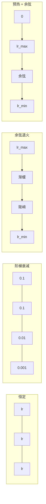
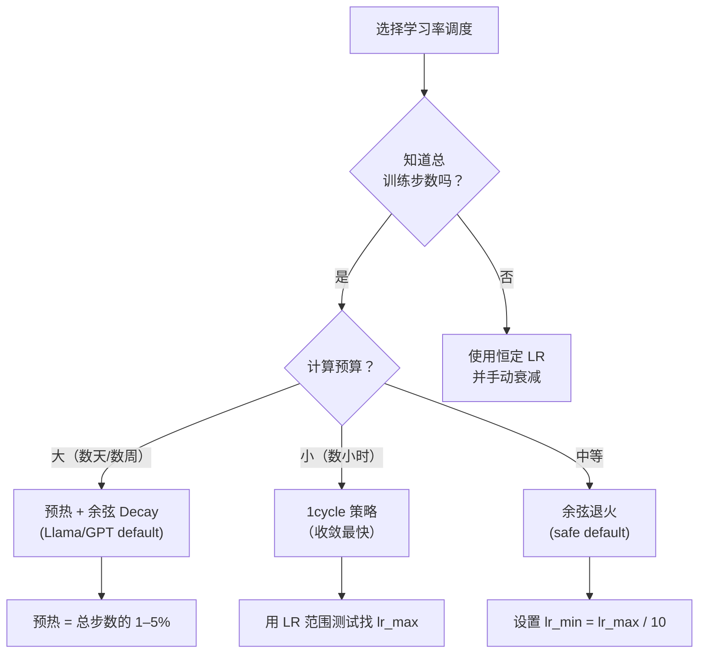
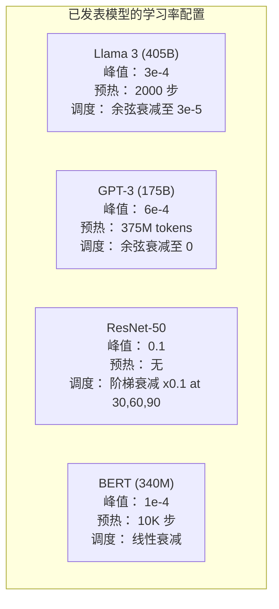

# 学习率调度与预热

> 学习率是最重要的单个超参数：不是架构，不是数据集大小，也不是激活函数。如果你只能调一个参数，就调它。

**类型：** 构建  
**学习实现：** Python  
**前置课程：** 第 03.06 课（优化器）、第 03.08 课（权重初始化）  
**预计时间：** 约 90 分钟

## 学习目标

- 从零实现恒定、阶梯衰减、余弦退火、预热 + 余弦和 1cycle 学习率调度。
- 演示学习率选择的三种失败模式：发散（过高）、停滞（过低）和振荡（没有衰减）。
- 解释基于 Adam 的优化器为何必须预热，以及预热如何稳定训练早期阶段。
- 在同一任务上比较五种调度的收敛速度，并为给定训练预算选择合适的一种。

## 问题

把学习率设为 0.1，训练发散——3 步内损失跳到无穷大；设为 0.0001，训练像爬行——100 个 epoch 后模型几乎没有离开随机状态；设为 0.01，训练前 50 个 epoch 正常，随后损失在永远到不了的极小值周围振荡，因为步长太大。

最佳学习率不是常数，它会随训练改变。早期需要大步快速覆盖空间，后期需要小步落入尖锐极小值。90% 准确率与 95% 准确率模型的区别，往往仅在调度。

近三年发表的每个大型模型都使用学习率调度。Llama 3 使用峰值 lr=3e-4、2000 步预热、余弦衰减至 3e-5；GPT-3 使用 lr=6e-4，并在 3.75 亿 token 内预热。这不是随意选择，而是花费数百万美元的大规模超参数扫描结果。

你需要理解调度，因为默认值不会适合你的问题。微调预训练模型与从零训练所需调度不同；增大批量时预热期需要改变；当训练在第 10,000 步崩溃时，需要知道这是调度问题还是其他问题。

## 概念

### 恒定学习率

最简单的做法是选一个数，每一步都使用它：

```
lr(t) = lr_0
```

它很少最优：要么对训练结尾太高（在极小值附近振荡），要么对开始太低（用小步浪费计算）。小模型和调试可以使用；训练超过一小时的任何任务都不适合。

### 阶梯衰减

ResNet 时代的传统做法：在固定 epoch 将学习率按一个因子（通常 10 倍）降低。

```
lr(t) = lr_0 * gamma^(floor(epoch / step_size))
```

当 gamma = 0.1、step_size = 30 时，lr 每 30 个 epoch 降低 10 倍。ResNet-50 使用该方案：lr=0.1，在 epoch 30、60、90 分别降低 10 倍。

问题是最佳衰减时点取决于数据集与架构。换一个问题，就需要重新调节何时下降；而且过渡突然，速率骤变时损失可能尖峰。

### 余弦退火

沿余弦曲线，从最大学习率平滑衰减至最小值：

```
lr(t) = lr_min + 0.5 * (lr_max - lr_min) * (1 + cos(pi * t / T))
```

t 是当前步数，T 是总步数。t=0 时余弦项为 1，lr=lr_max；t=T 时余弦项为 -1，lr=lr_min。衰减开始缓慢，中段加速，结尾又变缓。

这是大多数现代训练运行的默认选择。除 lr_max 和 lr_min 外无需调节超参数。余弦形状吻合一个经验观察：多数学习发生在训练中期，因此关键时期要保持合理步长。

### 预热：为什么要从小开始

Adam 等自适应优化器维护梯度均值与方差的滑动估计。第 0 步这些估计初始化为零，前几次更新依赖的是无用统计量。若此时学习率很大，模型会走出巨大且方向不佳的步子。

预热可修复此问题：从极小学习率（通常为 lr_max / warmup_steps，甚至零）开始，在前 N 步线性上升至 lr_max。达到完整学习率时，Adam 的统计量已稳定。

```
lr(t) = lr_max * (t / warmup_steps)     for t < warmup_steps
```

典型预热占总训练步数 1–5%。Llama 3 在约 1.8 万亿 token 上训练、预热 2000 步；GPT-3 在 3.75 亿 token 上预热。

### 线性预热 + 余弦衰减

现代默认方案：线性上升，随后余弦衰减。

```
if t < warmup_steps:
    lr(t) = lr_max * (t / warmup_steps)
else:
    progress = (t - warmup_steps) / (total_steps - warmup_steps)
    lr(t) = lr_min + 0.5 * (lr_max - lr_min) * (1 + cos(pi * progress))
```

Llama、GPT、PaLM 和多数现代 Transformer 都使用它。预热防止早期不稳定，余弦衰减让模型落入良好极小值。

### 1cycle 策略

Leslie Smith（2018）的发现是：训练前半程把学习率从低值上升到高值，后半程再降回去。为什么要在训练中途*提高*学习率？这看似违反直觉。

理论是高学习率通过为优化轨迹添加噪声来充当正则化。模型在上升阶段探索更多损失景观，从而找到更好的盆地；下降阶段再在发现的最佳盆地内细化。

```
Phase 1 (0 to T/2):    lr ramps from lr_max/25 to lr_max
Phase 2 (T/2 to T):    lr ramps from lr_max to lr_max/10000
```

固定计算预算下，1cycle 的训练往往比余弦退火更快。代价是必须预先知道总步数。

### 调度形状



### 决策流程图



### 已发表模型的真实数字



```figure
lr-schedule
```

## 构建实现

### 步骤 1：调度函数

每个函数接收当前步数，并返回该步的学习率。

```python
import math


def constant_schedule(step, lr=0.01, **kwargs):
    return lr


def step_decay_schedule(step, lr=0.1, step_size=100, gamma=0.1, **kwargs):
    return lr * (gamma ** (step // step_size))


def cosine_schedule(step, lr=0.01, total_steps=1000, lr_min=1e-5, **kwargs):
    if step >= total_steps:
        return lr_min
    return lr_min + 0.5 * (lr - lr_min) * (1 + math.cos(math.pi * step / total_steps))


def warmup_cosine_schedule(step, lr=0.01, total_steps=1000, warmup_steps=100, lr_min=1e-5, **kwargs):
    if total_steps <= warmup_steps:
        return lr * (step / max(warmup_steps, 1))
    if step < warmup_steps:
        return lr * step / warmup_steps
    progress = (step - warmup_steps) / (total_steps - warmup_steps)
    return lr_min + 0.5 * (lr - lr_min) * (1 + math.cos(math.pi * progress))


def one_cycle_schedule(step, lr=0.01, total_steps=1000, **kwargs):
    mid = max(total_steps // 2, 1)
    if step < mid:
        return (lr / 25) + (lr - lr / 25) * step / mid
    else:
        progress = (step - mid) / max(total_steps - mid, 1)
        return lr * (1 - progress) + (lr / 10000) * progress
```

### 步骤 2：可视化所有调度

打印基于文本的图，展示每种调度如何随训练演变。

```python
def visualize_schedule(name, schedule_fn, total_steps=500, **kwargs):
    steps = list(range(0, total_steps, total_steps // 20))
    if total_steps - 1 not in steps:
        steps.append(total_steps - 1)

    lrs = [schedule_fn(s, total_steps=total_steps, **kwargs) for s in steps]
    max_lr = max(lrs) if max(lrs) > 0 else 1.0

    print(f"\n{name}:")
    for s, lr_val in zip(steps, lrs):
        bar_len = int(lr_val / max_lr * 40)
        bar = "#" * bar_len
        print(f"  Step {s:4d}: lr={lr_val:.6f} {bar}")
```

### 步骤 3：训练网络

在圆形数据集上使用简单的双层网络，与前几课相同，但现在改变调度。

```python
import random


def sigmoid(x):
    x = max(-500, min(500, x))
    return 1.0 / (1.0 + math.exp(-x))


def relu(x):
    return max(0.0, x)


def relu_deriv(x):
    return 1.0 if x > 0 else 0.0


def make_circle_data(n=200, seed=42):
    random.seed(seed)
    data = []
    for _ in range(n):
        x = random.uniform(-2, 2)
        y = random.uniform(-2, 2)
        label = 1.0 if x * x + y * y < 1.5 else 0.0
        data.append(([x, y], label))
    return data


def train_with_schedule(schedule_fn, schedule_name, data, epochs=300, base_lr=0.05, **kwargs):
    random.seed(0)
    hidden_size = 8
    total_steps = epochs * len(data)

    std = math.sqrt(2.0 / 2)
    w1 = [[random.gauss(0, std) for _ in range(2)] for _ in range(hidden_size)]
    b1 = [0.0] * hidden_size
    w2 = [random.gauss(0, std) for _ in range(hidden_size)]
    b2 = 0.0

    step = 0
    epoch_losses = []

    for epoch in range(epochs):
        total_loss = 0
        correct = 0

        for x, target in data:
            lr = schedule_fn(step, lr=base_lr, total_steps=total_steps, **kwargs)

            z1 = []
            h = []
            for i in range(hidden_size):
                z = w1[i][0] * x[0] + w1[i][1] * x[1] + b1[i]
                z1.append(z)
                h.append(relu(z))

            z2 = sum(w2[i] * h[i] for i in range(hidden_size)) + b2
            out = sigmoid(z2)

            error = out - target
            d_out = error * out * (1 - out)

            for i in range(hidden_size):
                d_h = d_out * w2[i] * relu_deriv(z1[i])
                w2[i] -= lr * d_out * h[i]
                for j in range(2):
                    w1[i][j] -= lr * d_h * x[j]
                b1[i] -= lr * d_h
            b2 -= lr * d_out

            total_loss += (out - target) ** 2
            if (out >= 0.5) == (target >= 0.5):
                correct += 1
            step += 1

        avg_loss = total_loss / len(data)
        accuracy = correct / len(data) * 100
        epoch_losses.append(avg_loss)

    return epoch_losses
```

### 步骤 4：比较所有调度

用每种调度训练相同网络，比较最终损失和收敛行为。

```python
def compare_schedules(data):
    configs = [
        ("Constant", constant_schedule, {}),
        ("Step Decay", step_decay_schedule, {"step_size": 15000, "gamma": 0.1}),
        ("Cosine", cosine_schedule, {"lr_min": 1e-5}),
        ("Warmup+Cosine", warmup_cosine_schedule, {"warmup_steps": 3000, "lr_min": 1e-5}),
        ("1cycle", one_cycle_schedule, {}),
    ]

    print(f"\n{'Schedule':<20} {'Start Loss':>12} {'Mid Loss':>12} {'End Loss':>12} {'Best Loss':>12}")
    print("-" * 70)

    for name, schedule_fn, extra_kwargs in configs:
        losses = train_with_schedule(schedule_fn, name, data, epochs=300, base_lr=0.05, **extra_kwargs)
        mid_idx = len(losses) // 2
        best = min(losses)
        print(f"{name:<20} {losses[0]:>12.6f} {losses[mid_idx]:>12.6f} {losses[-1]:>12.6f} {best:>12.6f}")
```

### 步骤 5：学习率过高与过低

演示三种失败模式：过高（发散）、过低（缓慢）和恰到好处。

```python
def lr_sensitivity(data):
    learning_rates = [1.0, 0.1, 0.01, 0.001, 0.0001]

    print("\nLR Sensitivity (constant schedule, 100 epochs):")
    print(f"  {'LR':>10} {'Start Loss':>12} {'End Loss':>12} {'Status':>15}")
    print("  " + "-" * 52)

    for lr in learning_rates:
        losses = train_with_schedule(constant_schedule, f"lr={lr}", data, epochs=100, base_lr=lr)
        start = losses[0]
        end = losses[-1]

        if end > start or math.isnan(end) or end > 1.0:
            status = "DIVERGED"
        elif end > start * 0.9:
            status = "BARELY MOVED"
        elif end < 0.15:
            status = "CONVERGED"
        else:
            status = "LEARNING"

        end_str = f"{end:.6f}" if not math.isnan(end) else "NaN"
        print(f"  {lr:>10.4f} {start:>12.6f} {end_str:>12} {status:>15}")
```

## 应用

PyTorch 在 `torch.optim.lr_scheduler` 中提供调度器：

```python
import torch
import torch.optim as optim
from torch.optim.lr_scheduler import CosineAnnealingLR, OneCycleLR, StepLR

model = nn.Sequential(nn.Linear(10, 64), nn.ReLU(), nn.Linear(64, 1))
optimizer = optim.Adam(model.parameters(), lr=3e-4)

scheduler = CosineAnnealingLR(optimizer, T_max=1000, eta_min=1e-5)

for step in range(1000):
    loss = train_step(model, optimizer)
    scheduler.step()
```

对于预热 + 余弦，使用 lambda 调度器或 HuggingFace 的 `get_cosine_schedule_with_warmup`：

```python
from transformers import get_cosine_schedule_with_warmup

scheduler = get_cosine_schedule_with_warmup(
    optimizer,
    num_warmup_steps=2000,
    num_training_steps=100000,
)
```

HuggingFace 函数正是多数 Llama 与 GPT 微调脚本使用的方案。若不确定，使用预热 + 余弦，并将预热设为总步数的 3–5%；它几乎适用于所有任务。

## 交付物

本课产出：

- `outputs/prompt-lr-schedule-advisor.md`——为你的训练设置推荐正确学习率调度和超参数的提示词。

## 练习

1. 实现指数衰减：lr(t) = lr_0 * gamma^t，gamma = 0.999；在圆形数据集上与余弦退火比较。

2. 实现学习率范围测试（Leslie Smith）：数百步内将 LR 从 1e-7 指数增长至 1，绘制损失与 LR 的关系。最佳 max LR 恰在损失开始上升前。

3. 使用预热 + 余弦训练，但将预热长度设为总步数的 0%、1%、5%、10%、20%。找出训练最稳定的甜点。

4. 实现带热重启的余弦退火（SGDR）：每 T 步将学习率重置为 lr_max，然后再次衰减。在更长的训练中与标准余弦比较。

5. 构建“调度外科医生”：监测训练损失，损失稳定时自动从预热切换到余弦；若损失平台期过长，则降低 lr。

## 关键术语

| 术语 | 常见说法 | 实际含义 |
|------|----------|----------|
| 学习率 | “模型学习得多快” | 乘在梯度上的标量，决定参数更新的大小 |
| 调度 | “随时间改变 LR” | 将训练步映射为学习率、旨在优化收敛的函数 |
| 预热 | “从小 LR 开始” | 在最初 N 步把 LR 从接近零线性上升到目标值，以稳定优化器统计量 |
| 余弦退火 | “平滑 LR 衰减” | 在训练期间沿余弦曲线将 LR 从 lr_max 降到 lr_min |
| 阶梯衰减 | “在里程碑降低 LR” | 在固定 epoch 间隔将 LR 乘以一个因子（通常 0.1） |
| 1cycle 策略 | “先升后降” | Leslie Smith 提出的单个周期中先提高再降低 LR、以更快收敛的方法 |
| LR 范围测试 | “寻找最佳学习率” | 在短暂训练中逐步提高 LR，找到损失开始发散的值 |
| 带热重启的余弦 | “重置并重复” | 周期性将 LR 重置为 lr_max 后再衰减（SGDR） |
| Eta min | “LR 的下限” | 调度最终衰减到的最小学习率 |
| 峰值学习率 | “最大 LR” | 训练期间达到的最高 LR，通常在预热后达到 |

## 延伸阅读

- Loshchilov 与 Hutter，《SGDR: Stochastic Gradient Descent with Warm Restarts》（2017）——提出余弦退火与热重启。
- Smith，《Super-Convergence: Very Fast Training of Neural Networks Using Large Learning Rates》（2018）——1cycle 策略论文。
- Touvron 等，《Llama 2: Open Foundation and Fine-Tuned Chat Models》（2023）——记录大规模使用的预热 + 余弦调度。
- Goyal 等，《Accurate, Large Minibatch SGD: Training ImageNet in 1 Hour》（2017）——大批量训练的线性缩放规则与预热。
