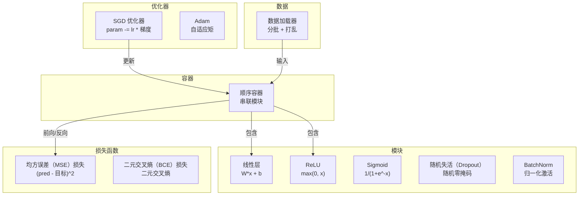
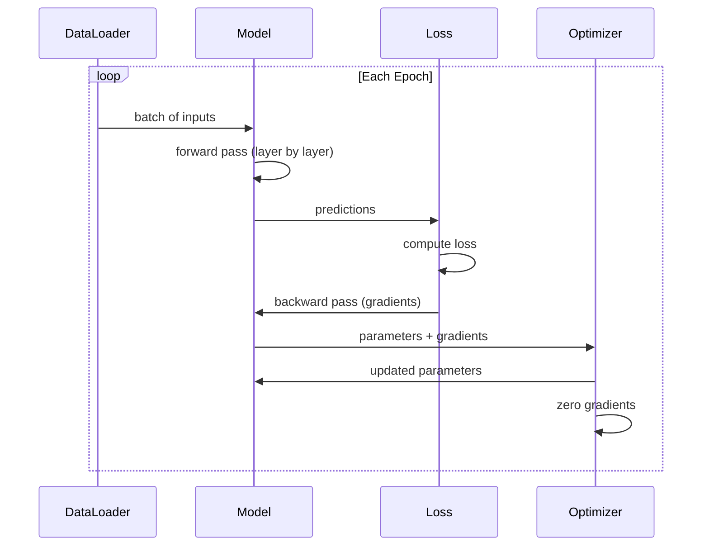
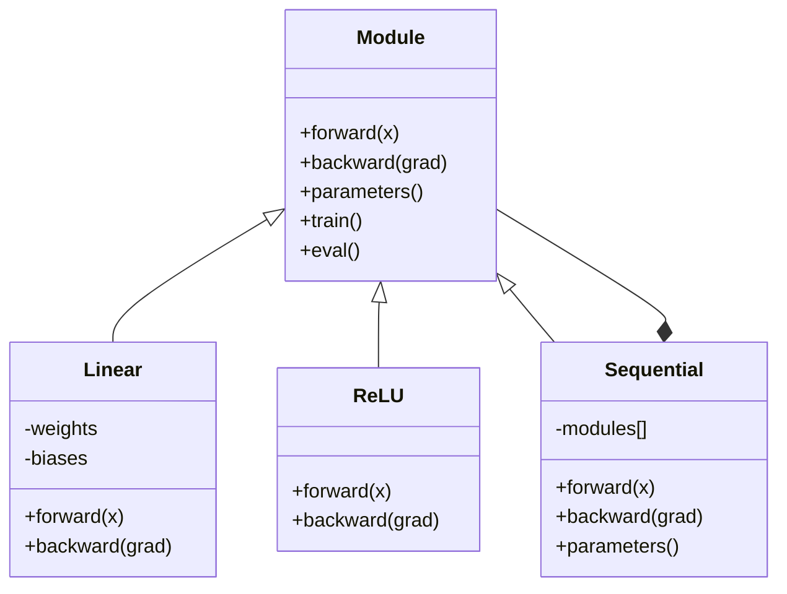

# 构建自己的迷你框架

> 你已分别构建神经元、层、网络和训练组件；现在把它们连接成一个可以运行的微型框架。

**类型：** 构建  
**学习实现：** Python  
**前置课程：** Phase 03 全部课程（第 01–09 课）  
**预计时间：** 约 120 分钟

## 学习目标

- 构建完整的深度学习框架（约 500 行），包括 Module、Linear、ReLU、Sigmoid、Dropout、BatchNorm、Sequential、损失函数、优化器和 DataLoader。
- 解释 Module 抽象（forward、backward、parameters）以及 train/eval 模式切换的必要性。
- 将所有组件接入可运行训练循环，在圆形分类上训练一个四层网络。
- 将框架中的组件映射到其 PyTorch 对应物（nn.Module、nn.Sequential、optim.Adam、DataLoader）。

## 问题

你有十课的构件，分散在不同文件里：这里有 `Value` 类，那里有训练循环，另一个文件有权重初始化，再一个文件有学习率调度。要训练网络，就得从五课中复制粘贴，再手工连接。

框架负责组织这些组件。PyTorch 提供 `nn.Module`、`nn.Sequential`、`optim.Adam`、`DataLoader` 和连接它们的训练循环模式；TensorFlow 提供 `keras.Layer`、`keras.Sequential`、`keras.optimizers.Adam`。这些组织模式让你无需每次重建管道，就能定义、训练和评估网络。

你将用约 500 行 Python 构建同一件事：不用 numpy，不用外部依赖。这个框架可以定义任意前馈网络，用 SGD 或 Adam 训练，分批数据，应用 dropout 和批归一化，使用任意激活函数，并调度学习率。

完成后，你会确切理解写下 `model = nn.Sequential(...)` 时 PyTorch 做了什么，理解为什么有 `model.train()` 与 `model.eval()`，理解 `optimizer.zero_grad()` 为什么是独立调用。因为你亲手构建了全部内容。

## 概念

### Module 抽象

PyTorch 中每一层都继承 `nn.Module`。一个 Module 有三项职责：

1. **forward()**——给定输入计算输出。
2. **parameters()**——返回全部可训练权重。
3. **backward()**——计算梯度（PyTorch 中由 autograd 处理，在本框架中显式实现）。

线性层是 Module，ReLU 激活是 Module，dropout 层是 Module，批归一化层也是 Module，它们共享相同接口。

### Sequential 容器

`nn.Sequential` 串联 Module：前向传播把数据依次送入 Module 1、2、3；反向传播按相反顺序通过。容器自身也是 Module，具有 forward()、parameters() 和 backward()。这构成组合模式：一串 Module 本身也是 Module。

### 训练与评估模式

Dropout 训练时随机置零神经元，评估时全部通过；批归一化训练时使用批统计量，评估时使用滑动平均。`train()` 和 `eval()` 方法切换此行为，每个 Module 都有 `training` 标志。

### 优化器

优化器利用梯度更新参数。SGD：`param -= lr * grad`；Adam 维护动量和方差估计后再更新。优化器不了解网络架构，只看到参数及其梯度组成的平面列表。

### DataLoader

分批有两个原因：大问题无法将整个数据集放入内存；小批量梯度下降的噪声有助于逃离局部极小值。DataLoader 将数据切成批次，并可在 epoch 间打乱。

### 框架架构



### 训练循环 <!-- learning-atlas: training-loop -->



### Module 层级



```figure
gradient-clipping
```

## 构建实现

### 步骤 1：Module 基类

每一层实现的抽象接口。

```python
class Module:
    def __init__(self):
        self.training = True

    def forward(self, x):
        raise NotImplementedError

    def backward(self, grad):
        raise NotImplementedError

    def parameters(self):
        return []

    def train(self):
        self.training = True

    def eval(self):
        self.training = False
```

### 步骤 2：线性层

基本构件。它存储权重和偏置，前向计算 Wx + b，反向计算权重与输入梯度。

```python
import math
import random


class Linear(Module):
    def __init__(self, fan_in, fan_out):
        super().__init__()
        std = math.sqrt(2.0 / fan_in)
        self.weights = [[random.gauss(0, std) for _ in range(fan_in)] for _ in range(fan_out)]
        self.biases = [0.0] * fan_out
        self.weight_grads = [[0.0] * fan_in for _ in range(fan_out)]
        self.bias_grads = [0.0] * fan_out
        self.fan_in = fan_in
        self.fan_out = fan_out
        self.input = None

    def forward(self, x):
        self.input = x
        output = []
        for i in range(self.fan_out):
            val = self.biases[i]
            for j in range(self.fan_in):
                val += self.weights[i][j] * x[j]
            output.append(val)
        return output

    def backward(self, grad):
        input_grad = [0.0] * self.fan_in
        for i in range(self.fan_out):
            self.bias_grads[i] += grad[i]
            for j in range(self.fan_in):
                self.weight_grads[i][j] += grad[i] * self.input[j]
                input_grad[j] += grad[i] * self.weights[i][j]
        return input_grad

    def parameters(self):
        params = []
        for i in range(self.fan_out):
            for j in range(self.fan_in):
                params.append((self.weights, i, j, self.weight_grads))
            params.append((self.biases, i, None, self.bias_grads))
        return params
```

### 步骤 3：激活模块

将 ReLU、Sigmoid 和 Tanh 实现为 Module；每个模块缓存反向传播所需的内容。

```python
class ReLU(Module):
    def __init__(self):
        super().__init__()
        self.mask = None

    def forward(self, x):
        self.mask = [1.0 if v > 0 else 0.0 for v in x]
        return [max(0.0, v) for v in x]

    def backward(self, grad):
        return [g * m for g, m in zip(grad, self.mask)]


class Sigmoid(Module):
    def __init__(self):
        super().__init__()
        self.output = None

    def forward(self, x):
        self.output = []
        for v in x:
            v = max(-500, min(500, v))
            self.output.append(1.0 / (1.0 + math.exp(-v)))
        return self.output

    def backward(self, grad):
        return [g * o * (1 - o) for g, o in zip(grad, self.output)]


class Tanh(Module):
    def __init__(self):
        super().__init__()
        self.output = None

    def forward(self, x):
        self.output = [math.tanh(v) for v in x]
        return self.output

    def backward(self, grad):
        return [g * (1 - o * o) for g, o in zip(grad, self.output)]
```

### 步骤 4：Dropout 模块

训练时随机将元素置零，以 1/(1-p) 缩放剩余元素，保证期望值不变；评估时不执行任何操作。

```python
class Dropout(Module):
    def __init__(self, p=0.5):
        super().__init__()
        self.p = p
        self.mask = None

    def forward(self, x):
        if not self.training:
            return x
        self.mask = [0.0 if random.random() < self.p else 1.0 / (1 - self.p) for _ in x]
        return [v * m for v, m in zip(x, self.mask)]

    def backward(self, grad):
        if self.mask is None:
            return grad
        return [g * m for g, m in zip(grad, self.mask)]
```

### 步骤 5：BatchNorm 模块

在批次内按特征将激活归一化为零均值、单位方差；为评估模式维护滑动统计量。

```python
class BatchNorm(Module):
    def __init__(self, size, momentum=0.1, eps=1e-5):
        super().__init__()
        self.size = size
        self.gamma = [1.0] * size
        self.beta = [0.0] * size
        self.gamma_grads = [0.0] * size
        self.beta_grads = [0.0] * size
        self.running_mean = [0.0] * size
        self.running_var = [1.0] * size
        self.momentum = momentum
        self.eps = eps
        self.x_norm = None
        self.std_inv = None
        self.batch_input = None

    def forward_batch(self, batch):
        batch_size = len(batch)
        output_batch = []

        if self.training:
            mean = [0.0] * self.size
            for sample in batch:
                for j in range(self.size):
                    mean[j] += sample[j]
            mean = [m / batch_size for m in mean]

            var = [0.0] * self.size
            for sample in batch:
                for j in range(self.size):
                    var[j] += (sample[j] - mean[j]) ** 2
            var = [v / batch_size for v in var]

            self.std_inv = [1.0 / math.sqrt(v + self.eps) for v in var]

            self.x_norm = []
            self.batch_input = batch
            for sample in batch:
                normed = [(sample[j] - mean[j]) * self.std_inv[j] for j in range(self.size)]
                self.x_norm.append(normed)
                output = [self.gamma[j] * normed[j] + self.beta[j] for j in range(self.size)]
                output_batch.append(output)

            for j in range(self.size):
                self.running_mean[j] = (1 - self.momentum) * self.running_mean[j] + self.momentum * mean[j]
                self.running_var[j] = (1 - self.momentum) * self.running_var[j] + self.momentum * var[j]
        else:
            std_inv = [1.0 / math.sqrt(v + self.eps) for v in self.running_var]
            for sample in batch:
                normed = [(sample[j] - self.running_mean[j]) * std_inv[j] for j in range(self.size)]
                output = [self.gamma[j] * normed[j] + self.beta[j] for j in range(self.size)]
                output_batch.append(output)

        return output_batch

    def forward(self, x):
        result = self.forward_batch([x])
        return result[0]

    def backward(self, grad):
        if self.x_norm is None:
            return grad
        for j in range(self.size):
            self.gamma_grads[j] += self.x_norm[0][j] * grad[j]
            self.beta_grads[j] += grad[j]
        return [grad[j] * self.gamma[j] * self.std_inv[j] for j in range(self.size)]

    def parameters(self):
        params = []
        for j in range(self.size):
            params.append((self.gamma, j, None, self.gamma_grads))
            params.append((self.beta, j, None, self.beta_grads))
        return params
```

### 步骤 6：Sequential 容器

串联模块：前向从左到右，反向从右到左。

```python
class Sequential(Module):
    def __init__(self, *modules):
        super().__init__()
        self.modules = list(modules)

    def forward(self, x):
        for module in self.modules:
            x = module.forward(x)
        return x

    def backward(self, grad):
        for module in reversed(self.modules):
            grad = module.backward(grad)
        return grad

    def parameters(self):
        params = []
        for module in self.modules:
            params.extend(module.parameters())
        return params

    def train(self):
        self.training = True
        for module in self.modules:
            module.train()

    def eval(self):
        self.training = False
        for module in self.modules:
            module.eval()
```

### 步骤 7：损失函数

均方误差（MSE）与二元交叉熵。每个对象返回损失值，并提供返回梯度的 backward()。

```python
class MSELoss:
    def __call__(self, predicted, target):
        self.predicted = predicted
        self.target = target
        n = len(predicted)
        self.loss = sum((p - t) ** 2 for p, t in zip(predicted, target)) / n
        return self.loss

    def backward(self):
        n = len(self.predicted)
        return [2 * (p - t) / n for p, t in zip(self.predicted, self.target)]


class BCELoss:
    def __call__(self, predicted, target):
        self.predicted = predicted
        self.target = target
        eps = 1e-7
        n = len(predicted)
        self.loss = 0
        for p, t in zip(predicted, target):
            p = max(eps, min(1 - eps, p))
            self.loss += -(t * math.log(p) + (1 - t) * math.log(1 - p))
        self.loss /= n
        return self.loss

    def backward(self):
        eps = 1e-7
        n = len(self.predicted)
        grads = []
        for p, t in zip(self.predicted, self.target):
            p = max(eps, min(1 - eps, p))
            grads.append((-t / p + (1 - t) / (1 - p)) / n)
        return grads
```

### 步骤 8：SGD 和 Adam 优化器

两者均接收参数列表，并用梯度更新权重。

```python
class SGD:
    def __init__(self, parameters, lr=0.01):
        self.params = parameters
        self.lr = lr

    def step(self):
        for container, i, j, grad_container in self.params:
            if j is not None:
                container[i][j] -= self.lr * grad_container[i][j]
            else:
                container[i] -= self.lr * grad_container[i]

    def zero_grad(self):
        for container, i, j, grad_container in self.params:
            if j is not None:
                grad_container[i][j] = 0.0
            else:
                grad_container[i] = 0.0


class Adam:
    def __init__(self, parameters, lr=0.001, beta1=0.9, beta2=0.999, eps=1e-8):
        self.params = parameters
        self.lr = lr
        self.beta1 = beta1
        self.beta2 = beta2
        self.eps = eps
        self.t = 0
        self.m = [0.0] * len(parameters)
        self.v = [0.0] * len(parameters)

    def step(self):
        self.t += 1
        for idx, (container, i, j, grad_container) in enumerate(self.params):
            if j is not None:
                g = grad_container[i][j]
            else:
                g = grad_container[i]

            self.m[idx] = self.beta1 * self.m[idx] + (1 - self.beta1) * g
            self.v[idx] = self.beta2 * self.v[idx] + (1 - self.beta2) * g * g

            m_hat = self.m[idx] / (1 - self.beta1 ** self.t)
            v_hat = self.v[idx] / (1 - self.beta2 ** self.t)

            update = self.lr * m_hat / (math.sqrt(v_hat) + self.eps)

            if j is not None:
                container[i][j] -= update
            else:
                container[i] -= update

    def zero_grad(self):
        for container, i, j, grad_container in self.params:
            if j is not None:
                grad_container[i][j] = 0.0
            else:
                grad_container[i] = 0.0
```

### 步骤 9：DataLoader

把数据拆分为批次，并可在每个 epoch 打乱。

```python
class DataLoader:
    def __init__(self, data, batch_size=32, shuffle=True):
        self.data = data
        self.batch_size = batch_size
        self.shuffle = shuffle

    def __iter__(self):
        indices = list(range(len(self.data)))
        if self.shuffle:
            random.shuffle(indices)
        for start in range(0, len(indices), self.batch_size):
            batch_indices = indices[start:start + self.batch_size]
            batch = [self.data[i] for i in batch_indices]
            inputs = [item[0] for item in batch]
            targets = [item[1] for item in batch]
            yield inputs, targets

    def __len__(self):
        return (len(self.data) + self.batch_size - 1) // self.batch_size
```

### 步骤 10：在圆形分类上训练四层网络

把所有部分接起来：定义模型、选择损失、选择优化器、运行训练循环。

```python
def make_circle_data(n=500, seed=42):
    random.seed(seed)
    data = []
    for _ in range(n):
        x = random.uniform(-2, 2)
        y = random.uniform(-2, 2)
        label = 1.0 if x * x + y * y < 1.5 else 0.0
        data.append(([x, y], [label]))
    return data


def train():
    random.seed(42)

    model = Sequential(
        Linear(2, 16),
        ReLU(),
        Linear(16, 16),
        ReLU(),
        Linear(16, 8),
        ReLU(),
        Linear(8, 1),
        Sigmoid(),
    )

    criterion = BCELoss()
    optimizer = Adam(model.parameters(), lr=0.01)

    data = make_circle_data(500)
    split = int(len(data) * 0.8)
    train_data = data[:split]
    test_data = data[split:]

    loader = DataLoader(train_data, batch_size=16, shuffle=True)

    model.train()

    for epoch in range(100):
        total_loss = 0
        total_correct = 0
        total_samples = 0

        for batch_inputs, batch_targets in loader:
            batch_loss = 0
            for x, t in zip(batch_inputs, batch_targets):
                pred = model.forward(x)
                loss = criterion(pred, t)
                batch_loss += loss

                optimizer.zero_grad()
                grad = criterion.backward()
                model.backward(grad)
                optimizer.step()

                predicted_class = 1.0 if pred[0] >= 0.5 else 0.0
                if predicted_class == t[0]:
                    total_correct += 1
                total_samples += 1

            total_loss += batch_loss

        avg_loss = total_loss / total_samples
        accuracy = total_correct / total_samples * 100

        if epoch % 10 == 0 or epoch == 99:
            print(f"Epoch {epoch:3d} | Loss: {avg_loss:.6f} | Train Accuracy: {accuracy:.1f}%")

    model.eval()
    correct = 0
    for x, t in test_data:
        pred = model.forward(x)
        predicted_class = 1.0 if pred[0] >= 0.5 else 0.0
        if predicted_class == t[0]:
            correct += 1
    test_accuracy = correct / len(test_data) * 100
    print(f"\nTest Accuracy: {test_accuracy:.1f}% ({correct}/{len(test_data)})")

    return model, test_accuracy
```

## 应用

下面是刚才构建内容的 PyTorch 等价实现：

```python
import torch
import torch.nn as nn
from torch.utils.data import DataLoader, TensorDataset

model = nn.Sequential(
    nn.Linear(2, 16),
    nn.ReLU(),
    nn.Linear(16, 16),
    nn.ReLU(),
    nn.Linear(16, 8),
    nn.ReLU(),
    nn.Linear(8, 1),
    nn.Sigmoid(),
)

criterion = nn.BCELoss()
optimizer = torch.optim.Adam(model.parameters(), lr=0.01)

for epoch in range(100):
    model.train()
    for inputs, targets in dataloader:
        optimizer.zero_grad()
        predictions = model(inputs)
        loss = criterion(predictions, targets)
        loss.backward()
        optimizer.step()

    model.eval()
    with torch.no_grad():
        test_predictions = model(test_inputs)
```

结构完全相同：`Sequential`、`Linear`、`ReLU`、`Sigmoid`、`BCELoss`、`Adam`、`zero_grad`、`backward`、`step`、`train`、`eval`，每个概念一一对应。差别在于 PyTorch 自动处理 autograd（无需在每个模块实现 backward()）、可在 GPU 上运行且经过多年优化，但骨架相同。

完成这些实现后，你可以逐行理解 PyTorch 代码所执行的操作。

## 交付物

本课产出：

- `outputs/prompt-framework-architect.md`——使用框架抽象设计神经网络架构的提示词。

## 练习

1. 为多分类加入 `SoftmaxCrossEntropyLoss` 类：对预测做 softmax、计算交叉熵损失并处理合并的反向传播。在三类螺旋数据集上测试。

2. 在优化器中实现学习率调度：加入 `set_lr()` 方法，接入第 09 课余弦调度。用预热 + 余弦训练圆形分类器，并与恒定 LR 比较。

3. 向 Sequential 加入 `save()` 和 `load()`，将所有权重序列化为 JSON 文件并加载回来。验证加载模型与原模型产生相同预测。

4. 在 Adam 优化器中实现权重衰减（L2 正则化）：加入 `weight_decay` 参数，每步使权重向零收缩。比较 decay=0 与 decay=0.01 的训练。

5. 将逐样本训练循环替换为真正的小批量梯度累积：累积批中所有样本的梯度，除以批量大小，再做一次优化器更新。测量这是否改变收敛速度。

## 关键术语

| 术语 | 常见说法 | 实际含义 |
|------|----------|----------|
| Module | “一层” | 框架中的基础抽象——具有 forward()、backward() 和 parameters() 的任何对象 |
| Sequential | “按顺序堆叠层” | 串联模块的容器；前向按顺序应用，反向按相反顺序应用 |
| 前向传播 | “运行网络” | 按顺序让输入通过每个模块来计算输出 |
| 反向传播 | “计算梯度” | 以相反顺序将损失梯度传过各模块，计算参数梯度 |
| 参数 | “可训练权重” | 优化器可更新的网络中所有值：权重与偏置 |
| 优化器 | “更新权重的东西” | 利用梯度更新参数的算法，实现 SGD、Adam 或其他规则 |
| DataLoader | “喂数据的东西” | 将数据集拆成批次的迭代器，可选择在 epoch 间打乱 |
| 训练模式 | “model.train()” | 开启 dropout 等随机行为、并让批归一化使用批统计量的标志 |
| 评估模式 | “model.eval()” | 关闭 dropout，并让批归一化使用滑动统计量的标志 |
| 清零梯度 | “清除梯度” | 在计算下一批梯度前，把所有参数梯度重置为零 |

## 延伸阅读

- Paszke 等，《PyTorch: An Imperative Style, High-Performance Deep Learning Library》（2019）——描述 PyTorch 设计决策的论文。
- Chollet，《Deep Learning with Python, Second Edition》（2021）——第 3 章以相同的模块/层抽象讲解 Keras 内部机制。
- Johnson，《Tiny-DNN》（https://github.com/tiny-dnn/tiny-dnn）——用于理解框架内部结构的仅头文件 C++ 深度学习框架。
